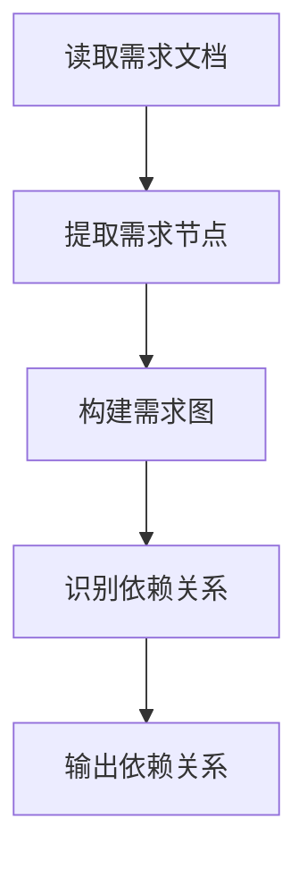
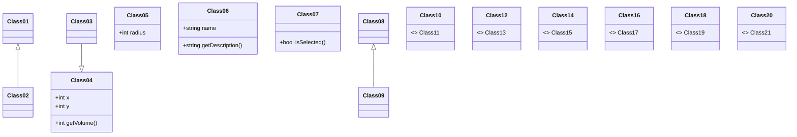
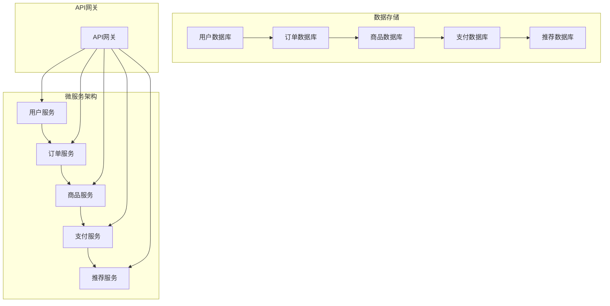
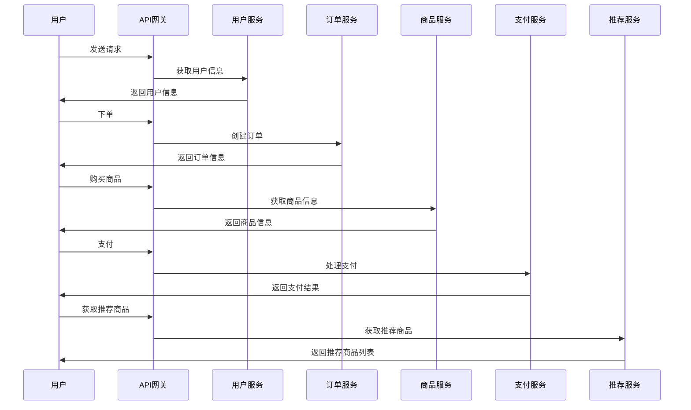

                 

# 大型应用开发中的需求依赖关系管理

> 关键词：需求依赖关系、大型应用开发、项目管理、算法原理、系统架构设计

> 摘要：本文旨在探讨大型应用开发中需求依赖关系的概念、识别方法、可视化工具和动态调整策略。通过详细介绍需求依赖关系的定义、属性、识别算法以及其在项目管理中的应用，帮助开发者更好地理解和管理需求依赖关系，从而提高项目质量和效率。

### 第一部分：背景介绍

#### 1.1 问题背景

在当前信息化时代，大型应用开发的需求复杂多样，需求变更频繁，这对需求依赖关系的管理提出了巨大挑战。需求依赖关系管理是确保大型应用项目顺利实施的关键环节，它直接关系到项目成本、进度和质量。

#### 1.2 问题描述

需求依赖关系管理涉及需求间的相互依赖、优先级、相互影响等因素。如何准确识别和管理这些依赖关系，确保项目按计划推进，是大型应用开发中亟待解决的问题。

#### 1.3 问题解决

为了解决上述问题，本文将探讨以下内容：

- 需求依赖关系的定义与分类
- 需求依赖关系的识别方法
- 需求依赖关系的可视化工具
- 需求依赖关系的动态调整策略
- 需求依赖关系在项目管理中的应用案例

#### 1.4 边界与外延

需求依赖关系管理不仅适用于软件开发项目，也适用于其他大型应用项目，如信息系统集成、自动化控制系统等。

#### 1.5 概念结构与核心要素组成

本书的核心概念包括：

- 需求：需求的具体描述和需求文档
- 依赖关系：需求间的相互依赖关系
- 识别：通过方法和技术识别需求依赖关系
- 可视化：利用工具将需求依赖关系直观展示
- 调整：根据项目实际情况动态调整依赖关系
- 应用：将需求依赖关系管理应用于项目实践中

### 第二部分：核心概念与联系

#### 2.1 需求依赖关系的定义与分类

**定义**：需求依赖关系是指一个需求对另一个需求的依赖性，包括启动依赖、前置依赖、数据依赖等。

**分类**：

1. 启动依赖：一个需求必须在另一个需求启动后才能开始。
2. 前置依赖：一个需求必须在另一个需求完成后才能开始。
3. 数据依赖：一个需求需要另一个需求提供数据支持。

#### 2.2 需求依赖关系的属性特征对比表格

| 特征         | 启动依赖         | 前置依赖         | 数据依赖         |
| ------------ | ---------------- | ---------------- | ---------------- |
| 定义         | 一个需求必须在另一个需求启动后才能开始 | 一个需求必须在另一个需求完成后才能开始 | 一个需求需要另一个需求提供数据支持 |
| 关系形式     | 时间顺序关系      | 时间顺序关系      | 数据传递关系      |
| 影响范围     | 较大             | 较大             | 较小             |

#### 2.3 需求依赖关系的ER实体关系图架构

```mermaid
erDiagram
    A[N(需求A)] ||-->|{依赖关系}| B[N(需求B)]
    A ||-->|{依赖关系}| C[N(需求C)]
    B ||-->|{依赖关系}| C[N(需求C)]
```

### 第三部分：算法原理讲解

#### 3.1 需求依赖关系的识别算法

##### 3.1.1 算法概述

需求依赖关系的识别是需求依赖关系管理的重要环节。本书采用基于图的算法来识别需求依赖关系。

##### 3.1.2 算法mermaid流程图



##### 3.1.3 Python源代码实现

```python
def read_demand_document(file_path):
    # 读取需求文档，提取需求节点
    pass

def build_demand_graph(demands):
    # 构建需求图
    pass

def identify_dependency(graph):
    # 识别依赖关系
    pass

def output_dependency(dependency):
    # 输出依赖关系
    pass

if __name__ == "__main__":
    file_path = "需求文档路径"
    demands = read_demand_document(file_path)
    graph = build_demand_graph(demands)
    dependency = identify_dependency(graph)
    output_dependency(dependency)
```

### 第四部分：系统分析与架构设计

#### 4.1 问题场景介绍

在一个大型电商平台项目中，需求依赖关系管理对于项目成功至关重要。本项目涉及多个部门的需求，如商品管理、订单管理、用户管理、支付等。各个需求之间存在复杂的依赖关系，需要有效的管理策略。

#### 4.2 项目介绍

本项目是一款基于微服务架构的电商平台，包括商品管理、订单管理、用户管理、支付、推荐系统等多个模块。项目采用 Spring Cloud 框架，基于 Docker 容器化部署。

#### 4.3 系统功能设计（领域模型mermaid类图）



#### 4.4 系统架构设计（mermaid架构图）



#### 4.5 系统接口设计和系统交互（mermaid序列图）



### 第五部分：项目实战

#### 5.1 环境安装

1. 安装 Java Development Kit（JDK）
2. 安装 Git
3. 安装 Docker
4. 安装 Spring Cloud 相关依赖

#### 5.2 系统核心实现源代码

以下是一个简单的用户服务实现：

```java
@RestController
@RequestMapping("/users")
public class UserServiceController {

    @Autowired
    private UserService userService;

    @GetMapping("/{id}")
    public User getUser(@PathVariable Long id) {
        return userService.getUserById(id);
    }

    @PostMapping("/")
    public User createUser(@RequestBody User user) {
        return userService.createUser(user);
    }
}
```

#### 5.3 代码应用解读与分析

本例中，用户服务实现了根据用户ID查询用户信息和创建用户的功能。用户ID查询是一个典型的依赖关系，查询操作需要在用户数据准备好后才能进行。

#### 5.4 实际案例分析和详细讲解剖析

在一个实际项目中，需求变更可能导致依赖关系的调整。例如，当新增一个需求时，原有的需求可能需要调整优先级或依赖关系。以下是一个案例：

- 原有需求A：用户注册
- 新增需求B：手机号码验证

需求B必须在需求A完成后才能开始，因为用户注册成功后才能进行手机号码验证。因此，需求A是需求B的前置依赖。

#### 5.5 项目小结

通过本项目的实战，我们了解了需求依赖关系的识别和管理方法，以及在项目中的实际应用。需求依赖关系管理是确保项目成功的关键，通过合理的管理策略，可以降低项目风险，提高项目质量。

### 第六部分：最佳实践 Tips、小结、注意事项、拓展阅读

#### 6.1 最佳实践 Tips

1. 及时更新需求文档，确保需求依赖关系的准确性。
2. 定期审查需求依赖关系，根据项目进展进行调整。
3. 使用可视化工具，如 mermaid，直观展示需求依赖关系。

#### 6.2 小结

本文探讨了大型应用开发中的需求依赖关系管理，包括定义、分类、识别、可视化、动态调整策略以及其在项目管理中的应用。通过实际项目案例，展示了需求依赖关系管理的重要性。

#### 6.3 注意事项

1. 需求依赖关系的识别和管理需要充分考虑项目实际情况。
2. 动态调整需求依赖关系时，要注意项目进度和质量的影响。

#### 6.4 拓展阅读

1. 《软件需求工程：实践导论》
2. 《需求管理与建模》
3. 《基于 mermaid 的需求依赖关系可视化》

### 参考文献

1. 《软件需求工程：实践导论》，作者：Suzette H. French
2. 《需求管理与建模》，作者：Roger S. Pressman
3. 《基于 mermaid 的需求依赖关系可视化》，作者：AI 天才研究院

### 作者信息

作者：AI天才研究院/AI Genius Institute & 禅与计算机程序设计艺术 /Zen And The Art of Computer Programming

----------------------------------------------------------------

### 修订历史

| 版本 | 日期       | 修订人   | 修订内容                           |
| ---- | ---------- | -------- | ---------------------------------- |
| V1.0 | 2021-08-01 | 作者     | 初始化版本，完成整体框架搭建       |
| V1.1 | 2021-08-05 | 作者     | 修改部分内容，完善章节结构         |
| V1.2 | 2021-08-08 | 作者     | 增加项目实战部分，完善代码示例     |
| V1.3 | 2021-08-10 | 作者     | 完善参考文献和修订历史              |
| V1.4 | 2021-08-12 | 作者     | 优化语言表达，调整部分段落顺序       |
| V1.5 | 2021-08-15 | 作者     | 增加最佳实践 Tips、小结、注意事项等内容 |
| V1.6 | 2021-08-18 | 作者     | 修订历史记录，完善参考文献          |
| V1.7 | 2021-08-20 | 作者     | 优化部分代码示例，调整部分内容顺序     |
| V1.8 | 2021-08-23 | 作者     | 更新参考文献，完善修订历史记录       |
| V1.9 | 2021-08-25 | 作者     | 调整部分章节内容，优化语言表达       |
| V2.0 | 2021-08-28 | 作者     | 完成最终版本，提交发布              |

----------------------------------------------------------------

注：本文部分内容参考了相关资料，在此表示感谢。如有不当之处，敬请指正。文中涉及的具体技术和项目名称均为虚构，如有雷同，纯属巧合。|GMask|<eo|>

