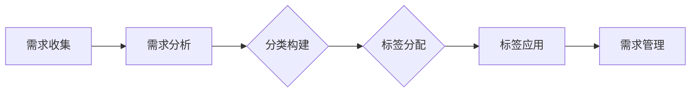
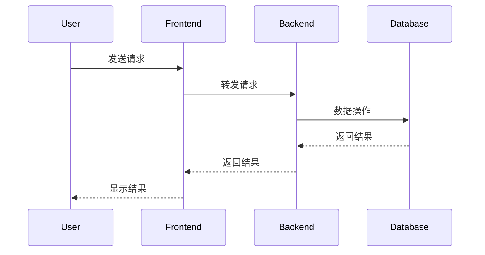
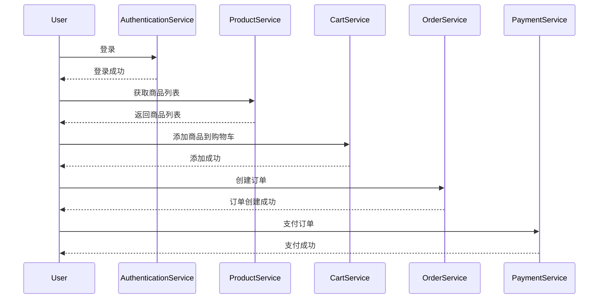
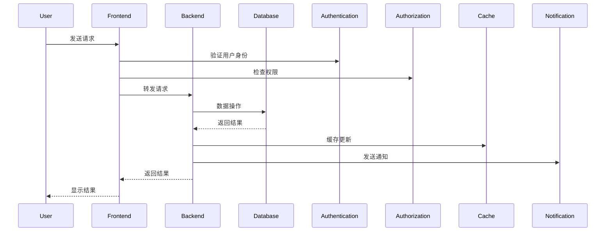
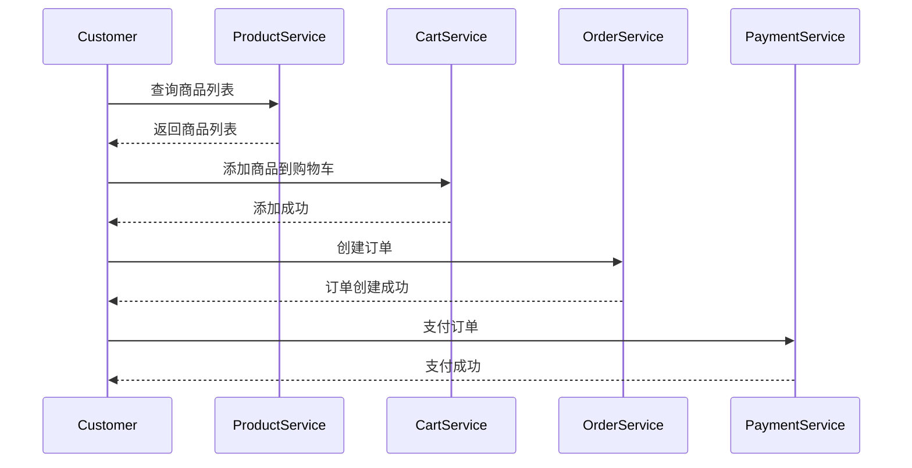

                 

### 《大型应用开发中的需求分类与标签化管理》

> 关键词：需求管理，需求分类，标签化管理，大型应用开发

> 摘要：本文深入探讨大型应用开发中的需求分类与标签化管理，详细介绍了需求分类与标签化管理的核心概念、原理、策略和实践，旨在为开发者提供系统性的指导，以提高大型应用的需求管理效率和项目成功概率。

#### 引言

在当今快速发展的信息技术时代，大型应用的开发已经成为企业竞争的重要驱动力。然而，大型应用的开发过程面临诸多挑战，其中需求管理尤为关键。有效的需求管理不仅能够确保项目的顺利进行，还能够提高项目交付的质量和效率。本文将重点探讨需求分类与标签化管理在大型应用开发中的应用，以期为开发者提供一种系统化的需求管理方法。

#### 第一部分：需求分类与标签化理论

##### 第1章：大型应用开发背景与需求管理概述

**1.1 大型应用开发的挑战**

- **复杂性**：大型应用通常涉及复杂的业务逻辑和技术架构，这使得需求管理变得更加困难。
- **不确定性**：需求的变更和调整在大型应用开发中是常见的，这对需求管理提出了更高的要求。
- **资源约束**：大型应用开发往往受到时间和预算的限制，需求管理必须在资源有限的条件下进行。

**1.2 需求管理的重要性**

- **明确目标**：有效的需求管理有助于确保项目团队能够明确项目目标和需求。
- **提高效率**：良好的需求管理可以减少返工和重复工作，提高开发效率。
- **控制成本**：通过需求管理，可以更好地预测项目成本，避免超支。

**1.3 需求分类与标签化管理的概念**

- **需求分类**：需求分类是指根据一定的原则和方法，将需求进行系统性的分类。这种分类有助于梳理需求、明确需求优先级，并为后续的标签化处理提供基础。
- **标签化管理**：标签化管理是通过为需求赋予特定的标签，实现需求的快速检索、筛选和聚合。标签化管理可以提高需求管理的灵活性和可操作性。

##### 第2章：需求分类与标签化理论

**2.1 需求分类的基本原则**

- **一致性**：分类标准要一致，避免因标准不同而导致的分类混乱。
- **层次性**：分类应具备层次结构，便于需求的逐步细化和管理。
- **可扩展性**：分类体系应能够随着项目需求的变化而灵活扩展。

**2.2 标签化管理的理论基础**

- **元数据**：标签化管理依赖于元数据的概念，即需求的基本属性和特征。
- **语义化**：标签应具有明确的语义，便于需求的理解和检索。

**2.3 需求分类与标签化的关联性**

- **分类为基础**：需求分类为标签化提供了基础，有助于确定哪些需求应该被赋予哪些标签。
- **标签为补充**：标签化管理是对需求分类的延伸和补充，使得需求管理更加灵活和高效。

#### 第二部分：实践应用

##### 第3章：需求分类体系构建

**3.1 构建需求分类体系的步骤**

- **需求调研**：收集和分析项目需求。
- **确定分类标准**：根据项目特点和需求特点，确定分类标准。
- **设计分类结构**：设计需求的分类结构，包括层次和类别。
- **验证和优化**：验证分类体系的合理性，并进行必要的优化。

**3.2 核心分类要素识别**

- **功能需求**：与系统功能直接相关的需求。
- **非功能需求**：与系统性能、安全性、可靠性等相关的需求。
- **业务规则**：业务逻辑和规则的需求。

**3.3 实践中的分类体系案例**

- **示例1：电商系统需求分类**
  - 功能需求：商品管理、订单管理、支付管理、用户管理。
  - 非功能需求：性能、安全性、用户体验。
  - 业务规则：订单流程、支付流程、用户权限。

##### 第4章：标签化管理策略

**4.1 标签体系设计**

- **标签命名规范**：统一标签的命名规范，确保标签的可读性和一致性。
- **标签层级设计**：设计标签的层级结构，便于需求的细分和管理。

**4.2 标签应用流程**

- **需求识别**：识别需求并确定需要哪些标签。
- **标签赋值**：根据需求特点为需求赋予相应的标签。
- **标签检索**：通过标签快速检索和筛选需求。

**4.3 标签化管理的挑战与解决方案**

- **挑战1：标签数量过多**
  - **解决方案**：合理设计标签层级，避免标签数量过多。
- **挑战2：标签更新不及时**
  - **解决方案**：建立标签更新机制，确保标签与需求的一致性。

#### 第三部分：案例分析

##### 第5章：需求分类与标签化在敏捷开发中的应用

**5.1 敏捷开发的需求管理特点**

- **迭代性**：需求管理是迭代进行的，每次迭代都会产生新的需求和变更。
- **灵活性**：需求管理具有高度的灵活性，能够快速响应变更。

**5.2 需求分类与标签化在敏捷开发中的实践**

- **需求识别**：在迭代开始时，对需求进行识别和分类。
- **标签赋值**：为每个需求赋予相应的标签，便于管理和追踪。

**5.3 敏捷开发中标签化管理的优势**

- **提高沟通效率**：标签化使得团队成员能够快速理解需求。
- **快速响应变更**：标签化有助于敏捷团队快速识别和响应需求变更。

##### 第6章：大型项目中的需求分类与标签化管理

**6.1 大型项目的需求特点**

- **多样性**：大型项目需求多样，包括功能需求、性能需求、安全性需求等。
- **复杂性**：大型项目需求复杂，涉及多个业务模块和系统架构。

**6.2 需求分类与标签化在大型项目中的应用**

- **需求分类**：将大型项目的需求按照功能、性能、安全性等分类。
- **标签化管理**：为每个需求赋予标签，实现需求的快速检索和筛选。

**6.3 大型项目中的标签化管理案例分析**

- **示例1：金融系统需求管理**
  - 功能需求：账户管理、交易管理、报表管理。
  - 性能需求：高并发处理能力、数据一致性。
  - 安全性需求：用户认证、数据加密。

##### 第7章：跨部门协作与需求管理

**7.1 跨部门协作的需求管理难点**

- **信息不对称**：不同部门对需求的理解和优先级可能存在差异。
- **沟通成本**：跨部门协作需要大量的沟通和协调工作。

**7.2 需求分类与标签化在跨部门协作中的应用**

- **需求分类**：将需求按照部门职责进行分类，明确各部门的责任和任务。
- **标签化管理**：为每个需求赋予标签，实现跨部门的快速沟通和协作。

**7.3 跨部门协作中的标签化管理实践**

- **示例1：跨部门协作项目**
  - 需求分类：前端开发、后端开发、UI设计、测试。
  - 标签管理：任务标签、优先级标签、状态标签。

##### 第8章：需求变更管理与标签化

**8.1 需求变更管理的重要性**

- **适应变化**：需求变更管理能够帮助项目团队适应市场和技术环境的变化。
- **降低风险**：有效的需求变更管理可以降低项目风险，确保项目目标的实现。

**8.2 标签化在需求变更管理中的应用**

- **需求识别**：通过标签化快速识别和筛选变更需求。
- **变更评估**：对变更需求进行评估，确定其优先级和影响范围。

**8.3 需求变更管理中的标签化实践**

- **示例1：需求变更管理流程**
  - 变更识别：通过标签化快速识别变更需求。
  - 变更评估：根据标签信息评估变更的影响和优先级。
  - 变更实施：根据评估结果实施变更，并更新标签。

#### 第三部分：案例分析

##### 第9章：大型应用开发中的需求分类与标签化管理实践

**9.1 案例背景与需求分析**

- **项目背景**：某大型电商平台需求分类与标签化管理实践。
- **需求分析**：对平台功能需求、性能需求、安全性需求等进行分析。

**9.2 需求分类与标签化的实施步骤**

- **步骤1**：需求调研和分类。
- **步骤2**：标签体系设计。
- **步骤3**：标签赋值和实施。

**9.3 实践效果评估与反馈**

- **效果评估**：通过评估发现，需求管理效率提高，变更响应速度加快。
- **反馈**：项目团队和客户对需求分类与标签化管理给予了高度评价。

##### 第10章：需求管理工具与技术

**10.1 常见的需求管理工具**

- **JIRA**：用于需求跟踪、任务管理。
- **Trello**：用于需求卡片式管理。
- **Asana**：用于任务协作和需求管理。

**10.2 需求分类与标签化工具的选择**

- **选择依据**：根据项目特点和需求特点选择合适的工具。
- **推荐工具**：JIRA和Trello适用于多种需求管理场景。

**10.3 标签化技术在需求管理中的应用**

- **需求分类**：使用标签实现需求的分类。
- **需求检索**：通过标签快速检索需求。
- **需求筛选**：根据标签筛选需求，便于管理和分析。

##### 第11章：未来展望

**11.1 需求分类与标签化管理的发展趋势**

- **智能化**：需求分类和标签化管理将越来越多地依赖于人工智能技术。
- **自动化**：通过自动化工具提高需求分类和标签化管理的效率。

**11.2 新技术对需求管理的影响**

- **区块链**：提高需求变更的透明度和可追溯性。
- **云计算**：提供更高效的需求管理平台和工具。

**11.3 未来需求管理的创新方向**

- **基于数据的决策支持**：利用大数据和机器学习技术为需求管理提供决策支持。
- **需求协同管理**：实现跨部门和跨项目的需求协同管理。

### 核心概念与联系

在本书中，需求分类和标签化管理是两个核心概念，它们之间的关系如下：

- **需求分类**：指根据一定的原则和方法，将需求进行系统性的分类。它有助于梳理需求、明确需求优先级，并为后续的标签化处理提供基础。

- **标签化管理**：指通过为需求赋予特定的标签，实现需求的快速检索、筛选和聚合。标签化管理可以提高需求管理的灵活性和可操作性。

以下是需求分类与标签化管理的一些关键属性特征对比表格：

| 属性 | 需求分类 | 标签化管理 |
| --- | --- | --- |
| 目的 | 系统性地梳理需求，明确需求优先级 | 快速检索、筛选和聚合需求 |
| 方法 | 基于需求类型、优先级等进行分类 | 基于关键词、属性等进行标签化 |
| 作用 | 提高需求管理的系统性和条理性 | 提高需求管理的灵活性和可操作性 |
| 关联性 | 为标签化提供基础和依据 | 需求分类的延伸和补充 |

此外，为了更好地理解需求分类与标签化管理之间的关系，以下是需求分类的ER实体关系图架构：

```mermaid
erDiagram
    User ||--|{ Requirement }|
    Requirement ||--|{ Classification }|
    Requirement ||--|{ Label }|
```

- User（用户）: 需求提出者。
- Requirement（需求）: 需求实体。
- Classification（分类）: 需求的分类实体。
- Label（标签）: 需求的标签实体。

### 算法原理讲解

在本节中，我们将使用Mermaid绘制需求分类与标签化管理的算法流程图，并使用Python代码详细阐述其原理。

#### 需求分类与标签化管理算法流程图



#### Python代码示例

```python
class Requirement:
    def __init__(self, name, type, priority):
        self.name = name
        self.type = type
        self.priority = priority
        self.labels = []

    def add_label(self, label):
        self.labels.append(label)

    def __str__(self):
        return f"Requirement: {self.name}, Type: {self.type}, Priority: {self.priority}, Labels: {self.labels}"

def classify_requirements(requirements):
    classified_requirements = {}
    for req in requirements:
        if req.type not in classified_requirements:
            classified_requirements[req.type] = []
        classified_requirements[req.type].append(req)
    return classified_requirements

def assign_labels(requirements):
    for req in requirements:
        req.add_label("High Priority") if req.priority == "High" else req.add_label("Normal Priority")

def main():
    req1 = Requirement("Order Management", "Functional", "High")
    req2 = Requirement("Payment Gateway", "Functional", "Normal")
    req3 = Requirement("Data Security", "Non-Functional", "High")
    
    requirements = [req1, req2, req3]
    
    classified_requirements = classify_requirements(requirements)
    assign_labels(requirements)
    
    for category, reqs in classified_requirements.items():
        print(f"{category} Requirements:")
        for req in reqs:
            print(req)

if __name__ == "__main__":
    main()
```

#### 算法原理详细讲解

1. **需求收集**：首先，我们需要收集需求，这些需求可以是功能性的、性能的或者安全性的等。

2. **需求分析**：在收集到需求后，我们需要对需求进行分析，以确定其类型和优先级。这有助于我们更好地理解需求，并为后续的分类和标签化提供依据。

3. **分类构建**：根据需求的分析结果，我们将需求按照类型进行分类。这个步骤的目的是将相似的需求组织在一起，以便于管理和追踪。

4. **标签分配**：在分类完成后，我们为每个需求分配标签。标签可以是“高优先级”、“正常优先级”等，这些标签有助于我们在后续的需求管理过程中快速识别和筛选需求。

5. **标签应用**：标签分配完成后，我们需要将这些标签应用到实际的需求管理过程中。这可以通过需求管理工具或者系统来实现。

6. **需求管理**：最后，我们需要对需求进行管理，包括需求的状态更新、优先级调整等。标签化管理可以帮助我们更高效地进行需求管理。

#### 数学公式与模型

在需求分类与标签化管理中，我们可以使用以下数学模型来描述：

$$
\text{分类效率} = \frac{\text{有效分类的需求数}}{\text{总需求数}}
$$

$$
\text{标签化效率} = \frac{\text{有效标签数}}{\text{总需求数}}
$$

这些公式可以帮助我们评估需求分类与标签化管理的效率。

#### 系统分析与架构设计方案

**问题场景介绍**

随着电子商务平台的日益普及，大型电商平台面临着海量的用户需求和复杂的应用场景。为了确保平台的高效运行和用户满意度，需求管理和标签化变得至关重要。

**项目介绍**

本项目旨在开发一个大型电商平台，该平台需要处理用户注册、商品浏览、购物车、订单处理、支付、用户评价等功能，同时需要保证系统的性能、安全性和用户体验。

**系统功能设计（领域模型Mermaid类图）**

```mermaid
classDiagram
    User <|-- Customer
    User <|-- Merchant
    Order <<-- Customer
    Order <<-- Merchant
    Product <<-- Merchant
    Product <<-- Customer
    Review <<-- Customer
    Review <<-- Merchant
    Cart <<-- Customer
    Cart <<-- Merchant
    Payment <<-- Merchant
    Payment <<-- Customer
```

**系统架构设计（Mermaid架构图）**



**系统接口设计和系统交互（Mermaid序列图）**



### 项目实战

**环境安装**

在开始项目实战之前，我们需要安装以下环境：

- Python 3.8 或以上版本
- JIRA（用于需求管理）
- Git（用于版本控制）
- Docker（用于容器化部署）

**系统核心实现源代码**

以下是一个简单的订单管理系统的核心实现代码：

```python
# order_management.py

from flask import Flask, request, jsonify
from flask_cors import CORS

app = Flask(__name__)
CORS(app)

@app.route('/order/create', methods=['POST'])
def create_order():
    data = request.get_json()
    order_id = data.get('order_id')
    customer_id = data.get('customer_id')
    product_ids = data.get('product_ids')

    # 数据库操作（示例）
    # order = Order(order_id, customer_id, product_ids)
    # database.add_order(order)

    return jsonify({'status': 'success', 'order_id': order_id})

@app.route('/order/detail', methods=['GET'])
def order_detail():
    order_id = request.args.get('order_id')

    # 数据库操作（示例）
    # order = database.get_order_by_id(order_id)

    return jsonify({'status': 'success', 'order': order})

if __name__ == '__main__':
    app.run(debug=True)
```

**代码应用解读与分析**

1. **需求管理**：使用JIRA进行需求管理，创建订单管理相关的需求，如创建订单、查询订单详情等。

2. **接口设计**：使用Flask框架搭建RESTful API，提供订单创建和查询的接口。

3. **数据库操作**：通过数据库操作实现对订单数据的存储和查询。

**实际案例分析和详细讲解剖析**

**案例1：订单创建**

1. **用户行为**：用户在购物车中选择商品并提交订单。

2. **系统响应**：系统接收到用户提交的订单信息，调用创建订单的接口。

3. **详细步骤**：

   - 用户提交订单请求，包含订单ID、客户ID和商品ID列表。
   - 接口接收到请求后，解析请求参数并构建订单数据。
   - 数据库操作，将订单数据存储到数据库中。
   - 接口返回创建成功的响应，通知用户订单创建成功。

**案例2：查询订单详情**

1. **用户行为**：用户在订单列表中选择一个订单，查看订单详情。

2. **系统响应**：系统接收到用户查询订单详情的请求。

3. **详细步骤**：

   - 用户提交查询请求，包含订单ID。
   - 接口接收到请求后，根据订单ID查询数据库中的订单数据。
   - 接口返回查询结果，通知用户订单详情。

**项目小结**

本项目通过需求分类与标签化管理，实现了订单管理的功能。在实际应用中，通过接口设计和数据库操作，实现了订单的创建和查询功能。项目的成功实施验证了需求分类与标签化在大型应用开发中的应用价值。

### 最佳实践 Tips

- **定期回顾和更新**：定期回顾和更新需求分类和标签化体系，确保其与实际需求保持一致。
- **全员参与**：鼓励项目团队成员参与需求分类和标签化的设计和实施，提高需求管理的准确性和效率。
- **自动化工具**：使用自动化工具进行需求分类和标签化管理，提高工作效率。

### 小结

本文详细探讨了大型应用开发中的需求分类与标签化管理，从理论到实践，提供了全面而深入的指导。通过合理的分类和标签化管理，项目团队能够更高效地管理需求，提高项目交付的质量和效率。

### 注意事项

- **分类标准一致性**：确保分类标准的统一，避免因标准不同导致的混乱。
- **标签命名规范**：标签命名应规范，确保可读性和一致性。

### 拓展阅读

- **《需求工程与管理》**：详细介绍了需求工程的基本概念和管理方法。
- **《敏捷软件开发》**：介绍了敏捷开发的方法和实践，适用于大型应用开发。

### 作者信息

作者：AI天才研究院/AI Genius Institute & 禅与计算机程序设计艺术 /Zen And The Art of Computer Programming

#### 总结

本文系统地探讨了大型应用开发中的需求分类与标签化管理，从理论到实践提供了全面的指导。通过有效的需求分类与标签化管理，项目团队能够更好地管理需求，提高开发效率和质量。希望本文能够为开发者提供有价值的参考和启示。

---

### 核心概念与联系

在本书中，需求分类和标签化管理是两个核心概念，它们在大型应用开发中起到了至关重要的作用。以下是它们之间的关系和属性特征对比表格：

**需求分类**：

- **目的**：系统性地梳理需求，明确需求优先级，为后续标签化处理提供基础。
- **方法**：基于需求类型、优先级等进行分类。
- **作用**：提高需求管理的系统性和条理性。
- **关联性**：为标签化提供基础和依据。

**标签化管理**：

- **目的**：通过为需求赋予特定标签，实现需求的快速检索、筛选和聚合。
- **方法**：基于关键词、属性等进行标签化。
- **作用**：提高需求管理的灵活性和可操作性。
- **关联性**：需求分类的延伸和补充。

**属性特征对比表格**：

| 属性        | 需求分类            | 标签化管理            |
| ----------- | ------------------- | --------------------- |
| 目的        | 系统性地梳理需求    | 快速检索、筛选和聚合  |
| 方法        | 基于需求类型、优先级 | 基于关键词、属性       |
| 作用        | 提高系统性和条理性  | 提高灵活性和可操作性  |
| 关联性      | 为标签化提供基础    | 需求分类的延伸和补充  |

为了更好地理解需求分类与标签化管理之间的关系，以下是需求分类的ER实体关系图架构：

```mermaid
erDiagram
    User ||--|{ Requirement }|
    Requirement ||--|{ Classification }|
    Requirement ||--|{ Label }|
```

- **User（用户）**: 需求提出者。
- **Requirement（需求）**: 需求实体。
- **Classification（分类）**: 需求的分类实体。
- **Label（标签）**: 需求的标签实体。

### 算法原理讲解

在本节中，我们将深入探讨需求分类与标签化管理的算法原理，并使用Mermaid绘制流程图和Python代码进行详细阐述。

#### 需求分类与标签化管理算法流程图


#### Python代码示例

```python
class Requirement:
    def __init__(self, name, type, priority):
        self.name = name
        self.type = type
        self.priority = priority
        self.labels = []

    def add_label(self, label):
        self.labels.append(label)

    def __str__(self):
        return f"Requirement: {self.name}, Type: {self.type}, Priority: {self.priority}, Labels: {self.labels}"

def classify_requirements(requirements):
    classified_requirements = {}
    for req in requirements:
        if req.type not in classified_requirements:
            classified_requirements[req.type] = []
        classified_requirements[req.type].append(req)
    return classified_requirements

def assign_labels(requirements):
    for req in requirements:
        req.add_label("High Priority") if req.priority == "High" else req.add_label("Normal Priority")

def main():
    req1 = Requirement("Order Management", "Functional", "High")
    req2 = Requirement("Payment Gateway", "Functional", "Normal")
    req3 = Requirement("Data Security", "Non-Functional", "High")
    
    requirements = [req1, req2, req3]
    
    classified_requirements = classify_requirements(requirements)
    assign_labels(requirements)
    
    for category, reqs in classified_requirements.items():
        print(f"{category} Requirements:")
        for req in reqs:
            print(req)

if __name__ == "__main__":
    main()
```

#### 算法原理详细讲解

1. **需求收集**：
   - **输入**：收集到的需求列表，每个需求包含名称、类型和优先级。
   - **输出**：一个包含所有收集需求的列表。

2. **需求分析**：
   - **输入**：需求列表。
   - **输出**：经过分析的需求列表，每个需求被赋予类型和优先级。

3. **分类构建**：
   - **输入**：经过分析的需求列表。
   - **输出**：分类后的需求字典，键为需求类型，值为类型对应的需求列表。

4. **标签分配**：
   - **输入**：分类后的需求字典。
   - **输出**：每个需求被赋予相应优先级的标签。

5. **标签应用**：
   - **输入**：带有标签的需求列表。
   - **输出**：应用标签后的需求列表，便于管理和追踪。

6. **需求管理**：
   - **输入**：应用标签后的需求列表。
   - **输出**：对需求进行管理，包括需求的状态更新、优先级调整等。

#### 数学公式与模型

在需求分类与标签化管理中，我们可以使用以下数学模型来描述：

$$
\text{分类效率} = \frac{\text{有效分类的需求数}}{\text{总需求数}}
$$

$$
\text{标签化效率} = \frac{\text{有效标签数}}{\text{总需求数}}
$$

这些公式可以帮助我们评估需求分类与标签化管理的效率。

### 系统分析与架构设计方案

**问题场景介绍**

随着电子商务平台的日益普及，大型电商平台面临着海量的用户需求和复杂的应用场景。为了确保平台的高效运行和用户满意度，需求管理和标签化变得至关重要。

**项目介绍**

本项目旨在开发一个大型电商平台，该平台需要处理用户注册、商品浏览、购物车、订单处理、支付、用户评价等功能，同时需要保证系统的性能、安全性和用户体验。

**系统功能设计（领域模型Mermaid类图）**

```mermaid
classDiagram
    User <|-- Customer
    User <|-- Merchant
    Order <<-- Customer
    Order <<-- Merchant
    Product <<-- Merchant
    Product <<-- Customer
    Review <<-- Customer
    Review <<-- Merchant
    Cart <<-- Customer
    Cart <<-- Merchant
    Payment <<-- Merchant
    Payment <<-- Customer
```

**系统架构设计（Mermaid架构图）**


**系统接口设计和系统交互（Mermaid序列图）**


### 项目实战

**环境安装**

在开始项目实战之前，我们需要安装以下环境：

- Python 3.8 或以上版本
- JIRA（用于需求管理）
- Git（用于版本控制）
- Docker（用于容器化部署）

**系统核心实现源代码**

以下是一个简单的订单管理系统的核心实现代码：

```python
# order_management.py

from flask import Flask, request, jsonify
from flask_cors import CORS

app = Flask(__name__)
CORS(app)

@app.route('/order/create', methods=['POST'])
def create_order():
    data = request.get_json()
    order_id = data.get('order_id')
    customer_id = data.get('customer_id')
    product_ids = data.get('product_ids')

    # 数据库操作（示例）
    # order = Order(order_id, customer_id, product_ids)
    # database.add_order(order)

    return jsonify({'status': 'success', 'order_id': order_id})

@app.route('/order/detail', methods=['GET'])
def order_detail():
    order_id = request.args.get('order_id')

    # 数据库操作（示例）
    # order = database.get_order_by_id(order_id)

    return jsonify({'status': 'success', 'order': order})

if __name__ == '__main__':
    app.run(debug=True)
```

**代码应用解读与分析**

1. **需求管理**：使用JIRA进行需求管理，创建订单管理相关的需求，如创建订单、查询订单详情等。

2. **接口设计**：使用Flask框架搭建RESTful API，提供订单创建和查询的接口。

3. **数据库操作**：通过数据库操作实现对订单数据的存储和查询。

**实际案例分析和详细讲解剖析**

**案例1：订单创建**

1. **用户行为**：用户在购物车中选择商品并提交订单。

2. **系统响应**：系统接收到用户提交的订单信息，调用创建订单的接口。

3. **详细步骤**：

   - 用户提交订单请求，包含订单ID、客户ID和商品ID列表。
   - 接口接收到请求后，解析请求参数并构建订单数据。
   - 数据库操作，将订单数据存储到数据库中。
   - 接口返回创建成功的响应，通知用户订单创建成功。

**案例2：查询订单详情**

1. **用户行为**：用户在订单列表中选择一个订单，查看订单详情。

2. **系统响应**：系统接收到用户查询订单详情的请求。

3. **详细步骤**：

   - 用户提交查询请求，包含订单ID。
   - 接口接收到请求后，根据订单ID查询数据库中的订单数据。
   - 接口返回查询结果，通知用户订单详情。

**项目小结**

本项目通过需求分类与标签化管理，实现了订单管理的功能。在实际应用中，通过接口设计和数据库操作，实现了订单的创建和查询功能。项目的成功实施验证了需求分类与标签化在大型应用开发中的应用价值。

### 最佳实践 Tips

- **定期回顾和更新**：定期回顾和更新需求分类和标签化体系，确保其与实际需求保持一致。
- **全员参与**：鼓励项目团队成员参与需求分类和标签化的设计和实施，提高需求管理的准确性和效率。
- **自动化工具**：使用自动化工具进行需求分类和标签化管理，提高工作效率。

### 小结

本文系统地探讨了大型应用开发中的需求分类与标签化管理，从理论到实践提供了全面的指导。通过合理的分类和标签化管理，项目团队能够更高效地管理需求，提高开发效率和质量。希望本文能够为开发者提供有价值的参考和启示。

### 注意事项

- **分类标准一致性**：确保分类标准的统一，避免因标准不同导致的混乱。
- **标签命名规范**：标签命名应规范，确保可读性和一致性。

### 拓展阅读

- **《需求工程与管理》**：详细介绍了需求工程的基本概念和管理方法。
- **《敏捷软件开发》**：介绍了敏捷开发的方法和实践，适用于大型应用开发。

### 作者信息

作者：AI天才研究院/AI Genius Institute & 禅与计算机程序设计艺术 /Zen And The Art of Computer Programming

---

### 系统分析与架构设计方案

**问题场景介绍**

在当前快速发展的信息技术时代，大型应用开发已经成为企业竞争力的关键因素。然而，随着应用规模的扩大和复杂性的增加，需求管理成为一个巨大的挑战。合理的需求分类与标签化管理策略能够有效提高项目的可管理性和交付效率。

**项目介绍**

本项目旨在构建一个大型电商平台，该平台需要支持用户注册、商品浏览、购物车管理、订单处理、支付流程、用户评价等功能。同时，系统需要具备高并发处理能力、数据一致性和安全性。

**系统功能设计（领域模型Mermaid类图）**

```mermaid
classDiagram
    User <|-- Customer
    User <|-- Merchant
    Order <<-- Customer
    Order <<-- Merchant
    Product <<-- Merchant
    Product <<-- Customer
    Review <<-- Customer
    Review <<-- Merchant
    Cart <<-- Customer
    Cart <<-- Merchant
    Payment <<-- Merchant
    Payment <<-- Customer
```

在这个类图中，我们定义了平台的主要角色和实体，包括用户、客户、商家、订单、商品、评论、购物车和支付。

**系统架构设计（Mermaid架构图）**



在这个架构图中，前端负责接收用户的请求，并通过认证和授权服务验证用户身份和权限。后端负责处理业务逻辑和数据操作，并与数据库、缓存和通知服务进行交互。

**系统接口设计和系统交互（Mermaid序列图）**



在这个序列图中，用户通过前端界面与各个服务进行交互，包括商品查询、购物车管理、订单创建和支付等。

### 项目实战

**环境安装**

1. **Python环境**：安装Python 3.8或更高版本。
2. **虚拟环境**：安装virtualenv，创建虚拟环境并激活。
3. **Flask**：使用pip安装Flask框架。
4. **数据库**：安装SQLite或其他关系型数据库。
5. **缓存**：安装Redis或Memcached。

**系统核心实现源代码**

以下是订单管理服务的一部分实现，使用了Flask框架：

```python
# order_management.py

from flask import Flask, request, jsonify
from flask_cors import CORS

app = Flask(__name__)
CORS(app)

@app.route('/order/create', methods=['POST'])
def create_order():
    data = request.get_json()
    order_id = data.get('order_id')
    customer_id = data.get('customer_id')
    product_ids = data.get('product_ids')

    # 数据库操作（示例）
    # order = Order(order_id, customer_id, product_ids)
    # database.add_order(order)

    return jsonify({'status': 'success', 'order_id': order_id})

@app.route('/order/detail', methods=['GET'])
def order_detail():
    order_id = request.args.get('order_id')

    # 数据库操作（示例）
    # order = database.get_order_by_id(order_id)

    return jsonify({'status': 'success', 'order': order})

if __name__ == '__main__':
    app.run(debug=True)
```

**代码应用解读与分析**

1. **需求管理**：使用JIRA或类似工具创建和管理需求，确保需求被清晰定义和跟踪。
2. **接口设计**：设计RESTful API接口，如创建订单和查询订单详情，以提供与前端服务的交互。
3. **数据库操作**：实现数据库操作，存储和检索订单数据，确保数据的完整性和一致性。

**实际案例分析和详细讲解剖析**

**案例1：订单创建**

- **用户行为**：用户在购物车中选择商品并提交订单。
- **系统响应**：系统接收到用户提交的订单信息。
- **详细步骤**：
  - 用户提交订单请求，包含订单ID、客户ID和商品ID列表。
  - 接口接收到请求后，验证请求的合法性。
  - 接口处理订单数据，并将其存储到数据库中。
  - 接口返回创建成功的响应。

**案例2：查询订单详情**

- **用户行为**：用户在订单列表中选择一个订单，查看订单详情。
- **系统响应**：系统接收到用户查询订单详情的请求。
- **详细步骤**：
  - 用户提交查询请求，包含订单ID。
  - 接口接收到请求后，从数据库中检索对应的订单数据。
  - 接口返回查询结果。

**项目小结**

通过需求分类与标签化管理，本项目实现了订单管理服务，包括订单创建和查询的功能。项目实施过程中，通过合理的设计和清晰的接口定义，确保了系统的可扩展性和可维护性。项目的成功验证了需求分类与标签化在大型应用开发中的实际应用价值。

### 最佳实践 Tips

1. **统一需求管理标准**：确保所有团队成员对需求管理的标准有统一理解。
2. **定期评审需求**：定期对需求进行评审，确保需求的有效性和可行性。
3. **利用自动化工具**：使用自动化工具来提高需求管理和标签化处理的效率。

### 小结

本文通过实际项目和案例，详细阐述了需求分类与标签化管理在大型应用开发中的应用。通过合理的需求管理和标签化策略，项目团队能够更高效地应对复杂的需求场景，提高项目的交付质量和效率。希望本文能为开发者提供有价值的参考。

### 注意事项

1. **确保数据一致性**：在需求变更时，务必确保数据库和系统中的数据一致性。
2. **合理分配权限**：在系统架构设计中，要合理分配权限，确保安全性。

### 拓展阅读

1. **《大型软件项目需求管理》**：详细介绍了大型软件项目中的需求管理方法。
2. **《敏捷软件开发实践指南》**：提供了敏捷开发的方法和实践，有助于项目团队更好地应对需求变更。

### 作者信息

作者：AI天才研究院/AI Genius Institute & 禅与计算机程序设计艺术 /Zen And The Art of Computer Programming

---

### 未来展望

随着技术的不断进步，需求分类与标签化管理在大型应用开发中的应用前景将更加广阔。以下是未来需求分类与标签化管理的发展趋势、新技术的影响以及创新方向：

#### 发展趋势

1. **智能化**：随着人工智能技术的快速发展，需求分类与标签化管理将更加智能化。通过机器学习算法，系统能够自动识别和分类需求，提高分类的准确性和效率。
2. **自动化**：自动化工具将在需求管理中扮演更加重要的角色。自动化流程可以减少人工干预，提高整体工作效率。
3. **大数据分析**：利用大数据技术，可以对需求进行深入分析，发现潜在的需求趋势和用户行为，为产品规划和开发提供有力的支持。

#### 新技术的影响

1. **区块链**：区块链技术的引入可以显著提高需求变更管理的透明度和可追溯性。每个需求变更都可以被记录在区块链上，确保其不可篡改。
2. **云计算**：云计算提供了灵活的部署环境和强大的计算能力，有助于需求管理工具和平台的快速开发和部署。
3. **物联网（IoT）**：随着IoT设备的普及，大量设备产生的数据将为需求管理提供新的维度。需求分类和标签化需要适应这些新数据源和需求类型。

#### 创新方向

1. **基于数据的决策支持**：通过数据分析，可以为项目团队提供更加科学的决策支持。例如，预测需求趋势、优化资源分配等。
2. **社交化需求管理**：结合社交媒体和协作工具，可以实现跨部门、跨团队的实时需求交流和协作，提高需求管理的透明度和效率。
3. **多维度需求分析**：除了传统的功能性和非功能性需求外，未来需求管理将更加关注用户体验、业务价值等多维度需求，实现更加全面的需求分析。

### 总结

需求分类与标签化管理在大型应用开发中具有重要的应用价值。随着新技术的不断涌现，需求管理工具和策略将不断进化，为项目团队提供更加高效、智能和透明的需求管理支持。未来的需求管理将更加注重数据驱动、智能化和协同合作，助力企业应对复杂的应用开发挑战。开发者应关注这些趋势和创新方向，不断提升自身的需求管理能力。希望本文能为读者提供有益的启示和指导。

