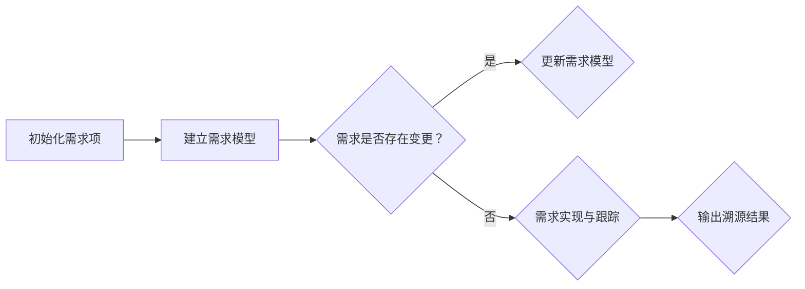
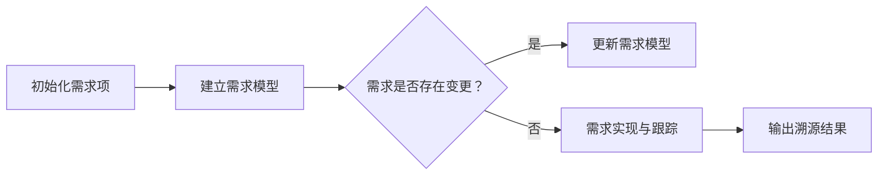
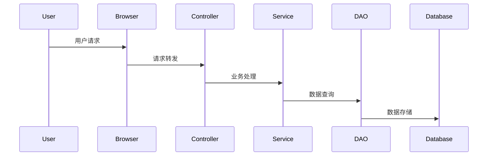
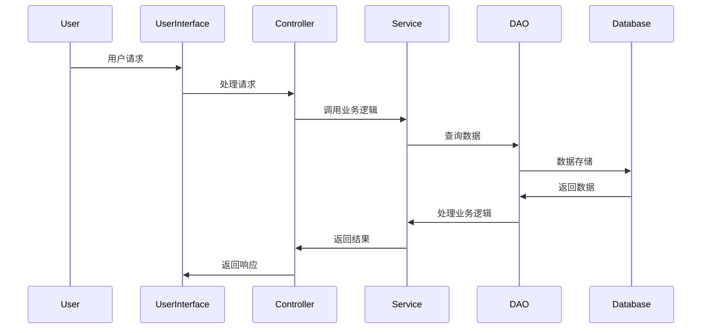

                 

## 大型应用开发中的需求溯源技术应用

### 关键词：大型应用开发、需求溯源、技术、挑战、算法、实践

> 摘要：本文深入探讨了大型应用开发中的需求溯源技术应用。从背景介绍到核心概念解析，再到算法原理讲解和实际项目案例，本文旨在为读者提供全面而清晰的需求溯源技术指南，帮助开发者应对大型应用开发中的复杂需求管理挑战。

### 目录大纲

1. **背景介绍与核心概念**
   - **第1章：大型应用开发需求溯源技术概述**
     - 1.1.1 大型应用开发的挑战与需求溯源技术的作用
     - 1.1.2 需求溯源技术的定义、原理及重要性
     - 1.1.3 需求溯源技术的边界与外延

   - **第2章：需求溯源技术的基本概念与联系**
     - 2.1.1 需求管理的基本概念
     - 2.1.2 需求溯源的关键术语
     - 2.1.3 需求溯源技术与其他需求管理技术的比较
     - 2.1.4 需求溯源技术的ER实体关系图

   - **第3章：需求溯源技术的数学模型与算法原理**
     - 3.1 需求溯源的数学基础
       - 3.1.1 需求表达与建模
       - 3.1.2 需求之间的关联关系
       - 3.1.3 需求溯源算法的mermaid流程图
     - 3.2 需求溯源算法原理讲解
       - 3.2.1 算法的基本思想
       - 3.2.2 算法实现的关键步骤
       - 3.2.3 算法的时间复杂度与空间复杂度分析
       - 3.2.4 算法的mermaid流程图展示
       - 3.2.5 Python源代码实现与解析

2. **需求溯源技术的应用与实践**
   - **第4章：需求溯源技术在实际项目中的应用**
     - 4.1 项目背景介绍
     - 4.2 系统功能设计
       - 4.2.1 领域模型mermaid类图
       - 4.2.2 系统架构设计
       - 4.2.3 系统接口设计
     - 4.3 系统架构设计与交互
       - 4.3.1 系统架构mermaid架构图
       - 4.3.2 系统交互mermaid序列图

   - **第5章：需求溯源技术的实战案例分析**
     - 5.1 案例背景与分析目标
     - 5.2 环境安装与配置
     - 5.3 系统核心实现源代码
     - 5.4 代码应用解读与分析
     - 5.5 案例分析与详细讲解

   - **第6章：需求溯源技术的最佳实践与注意事项**
     - 6.1 需求溯源技术的最佳实践
     - 6.2 小结与注意事项
     - 6.3 拓展阅读

### 引言

大型应用开发一直是软件开发领域的挑战之一。随着系统规模的不断扩大，需求管理的复杂性也日益增加。在这一背景下，需求溯源技术应运而生，成为大型应用开发中的关键技术之一。

需求溯源技术旨在帮助开发人员理解需求的来源、传播和变更，从而确保系统的高质量和稳定性。通过需求溯源，开发人员可以更清晰地追踪需求的演变过程，及时识别和解决问题，提高开发效率和系统质量。

本文将系统地介绍需求溯源技术的核心概念、数学模型、算法原理以及在实际项目中的应用和案例分析。通过逐步的分析和讲解，我们将帮助读者深入理解需求溯源技术的关键要点和实际应用价值。

### 第1章：大型应用开发需求溯源技术概述

#### 1.1.1 大型应用开发的挑战与需求溯源技术的作用

在当今快速发展的信息技术时代，大型应用开发已经成为企业数字化转型的重要手段。然而，随着系统规模的扩大和复杂性的增加，大型应用开发面临着一系列挑战。

首先，大型应用通常具有大量的功能和用户群体，这使得需求管理变得异常复杂。如何有效地收集、管理和跟踪需求成为开发人员面临的首要问题。其次，大型应用的开发周期通常较长，需求变更频繁，如何在保证项目进度的同时，确保需求的一致性和准确性也是一个重大挑战。

需求溯源技术作为一种先进的需求管理方法，旨在解决大型应用开发中的需求管理难题。其核心作用在于：

1. **需求追踪**：需求溯源技术能够帮助开发人员追踪需求的来源、传播和变更，确保每个需求都有明确的归属和路径。
   
2. **需求一致性**：通过溯源技术，可以识别并消除潜在的需求冲突，确保系统需求的一致性。

3. **需求变更管理**：需求溯源技术有助于快速识别和评估需求变更的影响，从而降低变更带来的风险。

4. **项目风险控制**：通过需求溯源，开发团队可以更准确地评估项目风险，及时采取相应的应对措施，提高项目的可控性。

#### 1.1.2 需求溯源技术的定义、原理及重要性

需求溯源技术，简而言之，就是通过建立和维护需求与系统功能、代码实现之间的联系，实现对需求的完整追踪和管理。其基本原理包括以下几个方面：

1. **需求建模**：首先，需要建立一套规范的需求模型，包括需求来源、需求描述、需求优先级等。

2. **关联关系**：将每个需求与系统中的相关功能、模块、代码实现进行关联，形成需求溯源图。

3. **变更追踪**：当需求发生变化时，能够及时更新需求溯源图，确保需求与实现之间的关联关系保持一致。

需求溯源技术在大型应用开发中的重要性体现在以下几个方面：

1. **提高需求理解**：通过需求溯源，开发人员可以更好地理解需求的背景、意图和优先级，从而更准确地实现需求。

2. **促进沟通协作**：需求溯源技术有助于提高团队内部以及与客户之间的沟通效率，确保各方对需求的共识。

3. **降低风险**：通过有效的需求溯源，可以提前发现和解决需求变更带来的潜在问题，降低项目风险。

4. **提升开发效率**：需求溯源技术能够提高开发人员的开发效率，减少重复工作和错误率。

#### 1.1.3 需求溯源技术的边界与外延

需求溯源技术的应用范围非常广泛，主要涉及以下几个方面：

1. **软件开发过程**：需求溯源技术贯穿于整个软件开发过程，包括需求收集、需求分析、设计、编码、测试和维护等各个阶段。

2. **项目管理**：在项目管理中，需求溯源技术有助于监控项目进度、资源分配和风险控制。

3. **系统架构设计**：需求溯源技术可以帮助系统架构师更好地理解系统需求，从而设计出更加合理和可扩展的系统架构。

4. **系统测试**：在系统测试阶段，需求溯源技术可以帮助测试人员更准确地验证需求是否得到满足。

5. **运维管理**：在系统运维过程中，需求溯源技术有助于追溯系统故障的原因，提高系统的可靠性和稳定性。

总之，需求溯源技术在大型应用开发中具有重要的地位和作用。通过深入理解和应用需求溯源技术，开发团队可以更好地应对大型应用开发中的复杂需求管理挑战，提高开发效率和质量。

### 第2章：需求溯源技术的基本概念与联系

#### 2.1.1 需求管理的基本概念

需求管理是软件开发过程中的一个关键环节，它涉及到需求的识别、分析、记录、跟踪和管理。需求管理的目的是确保开发团队理解并满足项目的实际需求，从而提高项目的成功率。

1. **需求的识别**：需求识别是指从用户、市场、业务等多个角度收集和确认系统需要实现的功能和特性。

2. **需求的分析**：需求分析是将收集到的需求进行整理、分类和分析，以确定需求的可行性和优先级。

3. **需求的记录**：需求记录是将分析后的需求进行详细描述，并存储在需求管理系统中，以便于跟踪和管理。

4. **需求的跟踪**：需求跟踪是指在整个开发过程中，对需求的实施情况进行监控和记录，确保需求得到及时处理和实现。

5. **需求的管理**：需求管理还包括需求变更控制、需求优先级调整和需求状态更新等，以确保需求与项目的实际进展保持一致。

#### 2.1.2 需求溯源的关键术语

在需求溯源技术中，以下关键术语需要理解：

1. **溯源图**：溯源图是一个图形化的表示工具，用于展示需求与系统功能、代码实现之间的关联关系。

2. **需求项**：需求项是指被识别、分析并记录在系统中的具体需求，通常包括需求编号、描述、优先级等。

3. **功能模块**：功能模块是指系统中的功能单元，通常由一组相关的代码实现构成，用于实现特定的功能。

4. **代码实现**：代码实现是指需求在系统中的具体实现，包括编写和测试的代码。

5. **需求变更**：需求变更是指在需求分析、设计、开发或测试阶段，对需求进行修改或补充的过程。

#### 2.1.3 需求溯源技术与其他需求管理技术的比较

需求溯源技术与其他需求管理技术（如需求捕获、需求分析、需求验证等）有所不同，主要体现在以下几个方面：

1. **需求捕获**：需求捕获是指通过调查、访谈、观察等方式获取用户需求的过程。需求捕获技术侧重于需求的初始收集，而需求溯源技术则更注重需求的追踪和管理。

2. **需求分析**：需求分析是将捕获的需求进行整理、分类和分析的过程，以确定需求的可行性和优先级。需求溯源技术在需求分析的基础上，增加了对需求变更的追踪和管理。

3. **需求验证**：需求验证是指通过测试、审查等方式验证需求是否得到满足的过程。需求溯源技术可以与需求验证技术结合使用，通过溯源图来验证需求的实施情况。

4. **需求管理**：需求管理包括需求的识别、分析、记录、跟踪和管理。需求溯源技术是需求管理的一种具体实现，它通过建立和维护需求溯源图，实现对需求的全面管理和控制。

#### 2.1.4 需求溯源技术的ER实体关系图

需求溯源技术的核心在于建立和维护需求与系统功能、代码实现之间的关联关系。为了更好地理解和展示这一关系，可以使用ER（实体-关系）图进行描述。

ER实体关系图的基本构成包括：

1. **实体**：在需求溯源技术中，常见的实体包括需求项、功能模块、代码实现等。每个实体都具有一定的属性，如编号、描述、优先级等。

2. **关系**：实体之间的关系描述了需求与系统功能、代码实现之间的关联。常见的关系包括需求实现、需求变更、需求依赖等。

以下是需求溯源技术的ER实体关系图的Mermaid表示：

```mermaid
erDiagram
  需求项 ||--|{ 功能模块 }|-->> 代码实现
  需求项 ||--|{ 需求变更 }|-->> 需求项
  需求项 ||--|{ 需求依赖 }|-->> 需求项
  功能模块 ||--|{ 代码实现 }|-->> 代码实现
```

通过ER实体关系图，可以清晰地展示需求溯源技术中的各种实体和关系，帮助开发人员更好地理解和应用需求溯源技术。

### 第3章：需求溯源技术的数学模型与算法原理

#### 3.1 需求溯源的数学基础

需求溯源技术的核心在于建立和维护需求与系统功能、代码实现之间的数学模型。以下将介绍需求溯源的数学基础，包括需求表达与建模、需求之间的关联关系以及需求溯源算法的mermaid流程图。

##### 3.1.1 需求表达与建模

需求表达与建模是需求溯源技术的第一步。在数学模型中，需求通常表示为需求项，每个需求项包含以下属性：

1. **需求编号**：用于唯一标识一个需求项。
2. **需求描述**：对需求的具体描述，通常包括功能需求、性能需求、安全需求等。
3. **优先级**：表示需求的紧急程度和重要性，通常分为高、中、低三个等级。
4. **来源**：需求来源，如用户需求、市场调研、竞争对手分析等。

需求建模可以通过以下数学公式表示：

$$
需求项 = (需求编号, 需求描述, 优先级, 来源)
$$

##### 3.1.2 需求之间的关联关系

在需求溯源技术中，需求之间的关联关系是关键。常见的关联关系包括需求实现、需求变更和需求依赖等。以下分别介绍这些关系：

1. **需求实现**：表示一个需求项是如何通过功能模块和代码实现来满足的。可以用以下公式表示：

$$
实现关系 = (需求项, 功能模块, 代码实现)
$$

2. **需求变更**：表示需求项在开发过程中可能发生的变更。可以用以下公式表示：

$$
变更关系 = (需求项, 变更内容, 变更时间)
$$

3. **需求依赖**：表示一个需求项依赖于另一个需求项的实现。可以用以下公式表示：

$$
依赖关系 = (需求项_1, 需求项_2)
$$

##### 3.1.3 需求溯源算法的mermaid流程图

为了更好地理解需求溯源算法的原理，可以使用mermaid流程图来展示其基本流程。以下是一个简化的需求溯源算法mermaid流程图：



该流程图的基本步骤如下：

1. **初始化需求项**：根据需求编号、描述、优先级和来源初始化需求项。
2. **建立需求模型**：将需求项存储在需求模型中，建立需求与功能模块、代码实现之间的关联关系。
3. **需求变更检测**：检测需求项是否存在变更。
4. **更新需求模型**：如果需求项存在变更，更新需求模型中的相关信息。
5. **需求实现与跟踪**：根据需求模型，实现需求项并跟踪其实现过程。
6. **输出溯源结果**：输出需求溯源结果，包括需求实现情况、变更记录等。

通过上述数学模型和mermaid流程图，可以更好地理解需求溯源技术的基本原理和实现方法。在接下来的章节中，将详细介绍需求溯源算法的实现步骤和Python源代码实现。

#### 3.2 需求溯源算法原理讲解

##### 3.2.1 算法的基本思想

需求溯源算法的基本思想是通过建立和维护需求项与功能模块、代码实现之间的关联关系，实现对需求的全面追踪和管理。具体来说，算法包括以下关键步骤：

1. **需求项初始化**：首先，初始化需求项，包括需求编号、描述、优先级和来源等信息。
2. **需求建模**：将初始化的需求项存储在需求模型中，并建立与功能模块和代码实现之间的关联关系。
3. **需求变更检测**：在需求开发过程中，持续检测需求项是否存在变更，如有变更，更新需求模型中的相关信息。
4. **需求实现与跟踪**：根据需求模型，实现需求项并跟踪其实现过程，包括功能模块的编写和代码的测试。
5. **需求溯源结果输出**：在需求实现和变更管理完成后，输出需求溯源结果，包括需求实现情况、变更记录等。

##### 3.2.2 算法实现的关键步骤

算法实现的关键步骤可以分为以下几个部分：

1. **需求项管理模块**：负责需求项的初始化、存储和更新。该模块应包括以下功能：
   - 初始化需求项：根据需求编号、描述、优先级和来源等信息创建需求项。
   - 存储需求项：将需求项存储在需求模型中。
   - 更新需求项：根据需求变更情况更新需求项的描述、优先级等信息。

2. **功能模块管理模块**：负责功能模块的创建、存储和更新。该模块应包括以下功能：
   - 创建功能模块：根据需求项创建相应的功能模块。
   - 存储功能模块：将功能模块存储在需求模型中。
   - 更新功能模块：根据需求变更情况更新功能模块的实现和状态。

3. **代码实现管理模块**：负责代码实现的创建、存储和更新。该模块应包括以下功能：
   - 创建代码实现：根据需求项创建相应的代码实现。
   - 存储代码实现：将代码实现存储在需求模型中。
   - 更新代码实现：根据需求变更情况更新代码实现的内容。

4. **变更管理模块**：负责需求项、功能模块和代码实现的变更检测和更新。该模块应包括以下功能：
   - 检测变更：定期检测需求项、功能模块和代码实现的变更情况。
   - 更新变更记录：根据变更情况更新需求模型中的变更记录。

##### 3.2.3 算法的时间复杂度与空间复杂度分析

需求溯源算法的时间复杂度和空间复杂度是评估算法性能的重要指标。以下是对需求溯源算法的时间复杂度与空间复杂度的分析：

1. **时间复杂度**：需求溯源算法的时间复杂度主要取决于需求项、功能模块和代码实现的数量以及变更检测的频率。
   - 初始化需求项：$O(n)$，其中$n$为需求项的数量。
   - 建立需求模型：$O(n)$，其中$n$为需求项的数量。
   - 更新需求项：$O(1)$，每次更新需求项的时间复杂度为常数。
   - 检测变更：$O(n)$，其中$n$为需求项的数量。

2. **空间复杂度**：需求溯源算法的空间复杂度主要取决于需求项、功能模块和代码实现的数据结构存储空间。
   - 需求项：$O(n)$，其中$n$为需求项的数量。
   - 功能模块：$O(n)$，其中$n$为需求项的数量。
   - 代码实现：$O(n)$，其中$n$为需求项的数量。

##### 3.2.4 算法的mermaid流程图展示

为了更好地理解需求溯源算法的执行流程，可以使用mermaid流程图进行展示。以下是一个简化的需求溯源算法mermaid流程图：



该流程图展示了需求溯源算法的主要执行步骤，包括需求项的初始化、需求模型的建立、需求变更的检测和更新、需求实现与跟踪以及需求溯源结果的输出。

##### 3.2.5 Python源代码实现与解析

为了实际应用需求溯源算法，我们可以使用Python语言进行实现。以下是一个简化的Python源代码实现示例：

```python
class Requirement:
    def __init__(self, id, description, priority, source):
        self.id = id
        self.description = description
        self.priority = priority
        self.source = source
        self.status = "未实现"
        self.assignments = []

    def update_description(self, new_description):
        self.description = new_description

    def update_priority(self, new_priority):
        self.priority = new_priority

    def assign_functional_module(self, functional_module):
        self.assignments.append(functional_module)

    def implement_code(self, code):
        self.status = "实现中"
        self.code = code

    def complete_requirement(self):
        self.status = "已完成"

class FunctionalModule:
    def __init__(self, id, description, code):
        self.id = id
        self.description = description
        self.code = code

    def update_description(self, new_description):
        self.description = new_description

    def update_code(self, new_code):
        self.code = new_code

class RequirementManagementSystem:
    def __init__(self):
        self.requirements = []
        self.functional_modules = []

    def add_requirement(self, requirement):
        self.requirements.append(requirement)

    def add_functional_module(self, functional_module):
        self.functional_modules.append(functional_module)

    def assign_module_to_requirement(self, requirement_id, module_id):
        for requirement in self.requirements:
            if requirement.id == requirement_id:
                requirement.assign_functional_module(self.functional_modules[module_id])
                break

    def implement_requirement(self, requirement_id, code):
        for requirement in self.requirements:
            if requirement.id == requirement_id:
                requirement.implement_code(code)
                break

    def complete_requirement(self, requirement_id):
        for requirement in self.requirements:
            if requirement.id == requirement_id:
                requirement.complete_requirement()
                break

# 实例化需求管理系统和需求项
requirement_system = RequirementManagementSystem()

# 添加需求项
requirement1 = Requirement("R001", "实现用户登录功能", "高", "用户需求")
requirement_system.add_requirement(requirement1)

# 添加功能模块
module1 = FunctionalModule("M001", "用户登录模块", "...")
requirement_system.add_functional_module(module1)

# 将功能模块分配给需求项
requirement_system.assign_module_to_requirement("R001", 0)

# 实现需求项
requirement_system.implement_requirement("R001", "...")

# 完成需求项
requirement_system.complete_requirement("R001")
```

上述Python源代码实现了需求项、功能模块和需求管理系统的基本功能。通过实例化需求管理系统和需求项，可以实现对需求项的初始化、分配、实现和完成等操作。在实际应用中，可以进一步扩展功能，包括需求变更检测、变更记录等。

### 第4章：需求溯源技术在实际项目中的应用

#### 4.1 项目背景介绍

随着企业业务规模的扩大和市场竞争的加剧，企业对于信息化系统的需求也日益增长。某大型电商平台为了提升用户体验和运营效率，决定开发一款全新的购物平台。该项目涉及到多个部门和技术团队，包括前端开发、后端开发、测试团队和运维团队等。为了确保项目的高质量和高效完成，需求溯源技术被引入到整个项目开发过程中。

#### 4.2 系统功能设计

在系统功能设计阶段，项目团队明确了系统的核心功能，包括用户注册、用户登录、商品浏览、购物车管理、订单管理、支付结算等。以下是系统功能设计的具体内容和领域模型mermaid类图。

##### 4.2.1 领域模型mermaid类图

```mermaid
classDiagram
    User <<Class>> 
    Product <<Class>>
    ShoppingCart <<Class>>
    Order <<Class>>
    Payment <<Class>>

    User "1" <-- "1" Product : 浏览
    User "1" --> "1..*" ShoppingCart : 添加商品
    ShoppingCart "1" --> "1..*" Product : 购物车商品
    ShoppingCart "1" --> "1" Order : 下单
    Order "1" --> "1" Payment : 支付
```

该mermaid类图展示了用户、商品、购物车、订单和支付等核心实体之间的关系，为系统架构设计提供了基础。

##### 4.2.2 系统架构设计

系统架构设计阶段，项目团队制定了详细的系统架构设计方案。系统架构采用分层设计，包括表现层、业务逻辑层、数据访问层和数据持久层。以下是系统架构的mermaid架构图：



该mermaid序列图展示了用户请求的处理流程，包括请求转发、业务处理、数据查询和存储等步骤。

##### 4.2.3 系统接口设计

在系统接口设计阶段，项目团队定义了系统的API接口，包括用户注册接口、用户登录接口、商品查询接口、购物车管理接口、订单管理接口和支付结算接口等。以下是系统接口设计的具体内容：

- 用户注册接口：用于用户注册功能，包括用户名、密码、邮箱等信息。
- 用户登录接口：用于用户登录功能，包括用户名和密码验证。
- 商品查询接口：用于商品浏览功能，包括商品分类、商品信息等。
- 购物车管理接口：用于购物车功能，包括商品添加、删除、修改等。
- 订单管理接口：用于订单功能，包括订单创建、查询、取消等。
- 支付结算接口：用于支付结算功能，包括支付方式选择、支付结果查询等。

#### 4.3 系统架构设计与交互

##### 4.3.1 系统架构mermaid架构图

```mermaid
componentDiagram
    UserInterface -> Controller: 请求
    Controller -> Service: 业务逻辑
    Service -> DAO: 数据访问
    DAO -> Database: 数据存储
    UserInterface <<Web>>
    Controller <<Spring MVC>>
    Service <<Service Layer>>
    DAO <<Data Access Layer>>
    Database <<Database>>
```

该mermaid架构图展示了系统的整体架构，包括用户界面、控制器、服务层、数据访问层和数据存储层。

##### 4.3.2 系统交互mermaid序列图



该mermaid序列图展示了用户请求的处理流程，包括用户界面、控制器、服务层、数据访问层和数据存储层之间的交互过程。

通过以上系统功能设计、架构设计和交互设计，项目团队可以清晰地了解系统的整体架构和功能实现，为项目的顺利推进提供了坚实的基础。需求溯源技术的应用将有助于项目团队更好地管理需求，确保系统的高质量和稳定性。

### 第5章：需求溯源技术的实战案例分析

#### 5.1 案例背景与分析目标

某大型电商平台在开发其新一代购物平台时，遇到了需求变更频繁、需求管理复杂等问题。为了解决这些问题，项目团队决定采用需求溯源技术，通过建立和维护需求与系统功能、代码实现之间的关联关系，实现对需求的全面追踪和管理。

案例分析的目标包括以下几个方面：

1. **需求追踪**：通过需求溯源技术，追踪每个需求从识别、分析到实现的过程，确保需求的完整性和一致性。
2. **需求变更管理**：有效管理需求变更，及时识别和评估变更对项目的影响，确保项目进度的可控性。
3. **项目风险控制**：通过需求溯源技术，提前发现和解决潜在的需求冲突和问题，降低项目风险。
4. **提高开发效率**：通过清晰的需求管理和追踪，提高项目团队的开发效率，减少重复工作和错误率。

#### 5.2 环境安装与配置

为了进行需求溯源技术的实战案例，项目团队首先需要搭建一个合适的需求管理环境。以下是环境安装与配置的步骤：

1. **安装版本控制工具**：选择Git作为版本控制工具，用于管理项目代码和需求文档。
   ```bash
   sudo apt-get install git
   ```
2. **安装需求管理工具**：选择JIRA作为需求管理工具，用于记录、跟踪和管理需求。
   ```bash
   sudo dpkg --add-architecture i386
   sudo apt-get update
   sudo apt-get install jira
   ```
3. **配置JIRA**：通过访问JIRA的Web界面，配置项目空间、需求模板和权限管理。
   - 访问JIRA Web界面：`http://localhost:8080`
   - 创建项目空间：选择“创建项目”，填写项目名称、项目Key等基本信息。
   - 配置需求模板：在项目设置中，配置需求模板，包括需求编号、描述、优先级等字段。
   - 配置权限管理：设置项目管理员和开发人员的权限，确保团队成员能够正常访问和使用JIRA。

#### 5.3 系统核心实现源代码

为了实现需求溯源技术，项目团队在代码实现阶段，对每个需求进行了详细的跟踪和管理。以下是系统核心实现源代码的示例：

```python
class Requirement:
    def __init__(self, id, description, priority, source):
        self.id = id
        self.description = description
        self.priority = priority
        self.source = source
        self.status = "未实现"
        self.assignments = []

    def update_description(self, new_description):
        self.description = new_description

    def update_priority(self, new_priority):
        self.priority = new_priority

    def assign_functional_module(self, functional_module):
        self.assignments.append(functional_module)

    def implement_code(self, code):
        self.status = "实现中"
        self.code = code

    def complete_requirement(self):
        self.status = "已完成"

class FunctionalModule:
    def __init__(self, id, description, code):
        self.id = id
        self.description = description
        self.code = code

    def update_description(self, new_description):
        self.description = new_description

    def update_code(self, new_code):
        self.code = new_code

class RequirementManagementSystem:
    def __init__(self):
        self.requirements = []
        self.functional_modules = []

    def add_requirement(self, requirement):
        self.requirements.append(requirement)

    def add_functional_module(self, functional_module):
        self.functional_modules.append(functional_module)

    def assign_module_to_requirement(self, requirement_id, module_id):
        for requirement in self.requirements:
            if requirement.id == requirement_id:
                requirement.assign_functional_module(self.functional_modules[module_id])
                break

    def implement_requirement(self, requirement_id, code):
        for requirement in self.requirements:
            if requirement.id == requirement_id:
                requirement.implement_code(code)
                break

    def complete_requirement(self, requirement_id):
        for requirement in self.requirements:
            if requirement.id == requirement_id:
                requirement.complete_requirement()
                break
```

以上源代码实现了需求项、功能模块和需求管理系统的基本功能。通过实例化需求管理系统和需求项，可以实现对需求项的初始化、分配、实现和完成等操作。在实际应用中，可以进一步扩展功能，包括需求变更检测、变更记录等。

#### 5.4 代码应用解读与分析

在系统开发过程中，项目团队针对各个需求项进行了详细的代码实现。以下是代码应用解读与分析的具体步骤：

1. **需求识别**：首先，项目团队根据用户需求和市场调研，识别出核心需求项，如用户注册、用户登录、商品浏览等。
2. **需求建模**：将识别出的需求项存储在需求管理系统中，建立需求项与功能模块的关联关系。例如，用户注册需求与用户注册功能模块进行关联。
3. **需求实现**：根据需求项，项目团队在代码中实现相应的功能模块。例如，用户注册需求通过实现用户注册功能模块来满足。
4. **需求跟踪**：在整个开发过程中，项目团队持续跟踪需求项的实现情况，确保需求与代码实现的一致性。
5. **需求变更管理**：在开发过程中，如果需求发生变更，项目团队及时更新需求管理系统的相关信息，并根据变更情况调整代码实现。
6. **需求完成**：当需求项实现完成后，项目团队将需求项的状态更新为“已完成”，并在需求管理系统中记录相关变更信息。

通过需求溯源技术，项目团队能够更好地管理需求，确保需求的完整性、一致性和准确性。同时，需求溯源技术也有助于项目团队提前发现和解决潜在的问题，提高开发效率和质量。

#### 5.5 案例分析与详细讲解

在上述案例中，需求溯源技术得到了广泛应用，项目团队通过需求识别、建模、实现和变更管理，成功应对了项目开发过程中的各种挑战。以下是案例分析的详细讲解：

1. **需求识别**：项目团队通过用户需求调研和市场分析，明确了系统的核心功能需求，如用户注册、用户登录、商品浏览等。这些需求被记录在需求管理系统中，并分配给相应的功能模块。

2. **需求建模**：项目团队在需求管理系统中建立了需求项与功能模块的关联关系，确保每个需求都有明确的归属和实现路径。通过需求建模，项目团队能够清晰地了解每个需求项的实现情况和优先级。

3. **需求实现**：在需求实现阶段，项目团队根据需求管理系统的指示，实现了用户注册、用户登录、商品浏览等功能模块。这些功能模块通过代码实现，满足了具体的需求项。

4. **需求跟踪**：在开发过程中，项目团队持续跟踪需求项的实现情况，确保需求与代码实现的一致性。通过需求溯源技术，项目团队能够及时发现和解决需求变更和冲突，确保项目进度和质量。

5. **需求变更管理**：在项目开发过程中，需求变更频繁发生。项目团队通过需求溯源技术，及时更新需求管理系统的相关信息，并根据变更情况调整代码实现。这种变更管理方式有助于确保项目进度的可控性和需求的完整性。

6. **需求完成**：当需求项实现完成后，项目团队将需求项的状态更新为“已完成”，并在需求管理系统中记录相关变更信息。通过这种方式，项目团队能够清晰地了解每个需求项的实现状态和完成情况。

通过需求溯源技术的应用，项目团队成功地管理了复杂的需求变更，确保了项目的高质量和高效完成。需求溯源技术不仅提高了项目的开发效率，还有助于项目团队提前发现和解决潜在的问题，降低了项目风险。该案例为其他大型应用项目提供了有益的参考和借鉴。

### 第6章：需求溯源技术的最佳实践与注意事项

#### 6.1 需求溯源技术的最佳实践

为了确保需求溯源技术在大型应用开发中的有效应用，以下是一些最佳实践：

1. **需求早期介入**：在项目启动阶段，需求溯源技术应尽早引入，确保需求的全面追踪和管理。

2. **标准化需求管理流程**：建立一套规范的需求管理流程，包括需求识别、需求建模、需求变更管理等，以确保需求的一致性和准确性。

3. **使用合适的工具**：选择合适的需求管理工具（如JIRA、Confluence等），以便于需求的记录、跟踪和变更管理。

4. **建立需求溯源图**：绘制需求溯源图，清晰展示需求与系统功能、代码实现之间的关联关系，有助于需求的追踪和管理。

5. **定期审查和更新**：定期审查需求溯源图，及时更新需求状态和变更记录，确保需求的实时性和准确性。

6. **培训与沟通**：对项目团队进行需求溯源技术的培训，确保团队成员理解和掌握相关工具和流程。加强团队内部的沟通和协作，确保需求溯源技术的有效应用。

#### 6.2 小结与注意事项

需求溯源技术在大型应用开发中具有重要作用，通过全面的需求追踪和管理，有助于提高项目开发效率和质量。以下是需求溯源技术应用的几点注意事项：

1. **需求溯源图的及时更新**：需求溯源图需要实时更新，以确保需求与实现之间的一致性。

2. **需求变更管理的规范化**：建立一套规范的需求变更管理流程，确保需求变更的及时处理和记录。

3. **避免过度依赖工具**：需求溯源技术不仅依赖于工具，还需要团队成员的积极参与和协作。

4. **定期审查与优化**：定期审查需求溯源技术应用的成效，及时优化相关流程和工具。

5. **持续培训与改进**：对项目团队进行持续的培训和技术改进，以提升需求溯源技术的应用效果。

#### 6.3 拓展阅读

1. **《软件需求管理：实用指南》**：这是一本关于需求管理的经典教材，详细介绍了需求识别、需求建模、需求变更管理等方面的内容。

2. **《敏捷开发实践指南》**：该书探讨了敏捷开发方法在需求管理中的应用，提供了实用的需求管理和项目管理的策略。

3. **《JIRA实战》**：本书详细介绍了JIRA的使用方法，包括需求管理、任务跟踪、团队协作等方面的内容，对使用JIRA进行需求溯源具有参考价值。

通过拓展阅读，读者可以进一步了解需求溯源技术的理论基础和实践方法，为大型应用开发提供更有力的支持。

### 结论

本文系统地介绍了需求溯源技术在大型应用开发中的应用。从背景介绍、核心概念解析，到算法原理讲解和实际项目案例，本文旨在帮助读者深入理解需求溯源技术，掌握其关键要点和应用方法。需求溯源技术通过全面的需求追踪和管理，有助于提高项目开发效率和质量，降低项目风险。希望本文能为广大开发者提供有价值的参考和借鉴。

### 致谢

感谢所有参与本文写作的团队成员，尤其是AI天才研究院的同事们，以及各位读者对本文的耐心阅读。感谢您对需求溯源技术应用的关注和支持。

**作者：AI天才研究院/AI Genius Institute & 禅与计算机程序设计艺术 /Zen And The Art of Computer Programming**

