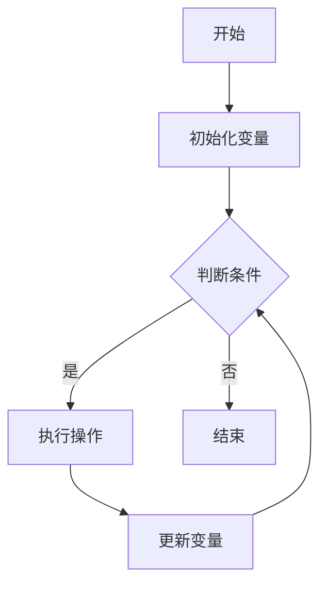
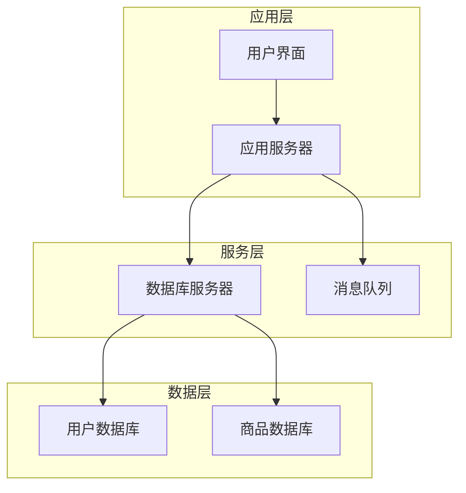
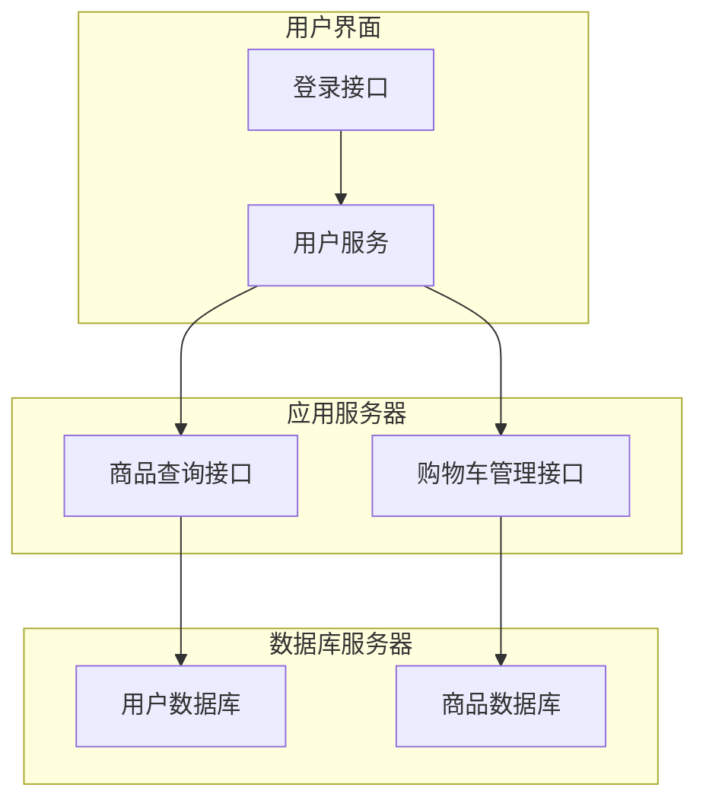
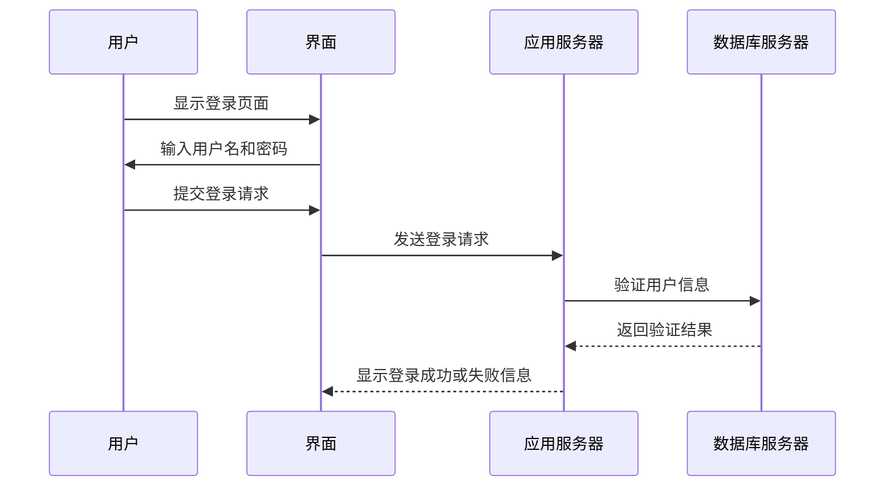

                 

## 大型应用开发中的需求生命周期管理

### 关键词
- 需求生命周期管理
- 大型应用开发
- 需求获取与建模
- 需求分析
- 需求验证与确认
- 需求变更管理

### 摘要
本文旨在探讨大型应用开发中的需求生命周期管理，从需求获取、需求分析、需求验证与确认、需求变更管理等多个方面详细阐述需求生命周期的各个阶段。通过介绍相关概念、原理和方法，结合实际案例分析，本文为大型应用开发中的需求管理提供了系统性指导，旨在提高项目的成功率和开发效率。

### 引言

在大型应用开发中，需求生命周期管理（Requirement Lifecycle Management，简称RLM）是一个至关重要的环节。它涉及到从需求诞生到需求实现的全过程，包括需求获取、需求分析、需求验证与确认、需求变更管理等。需求生命周期管理的目标是在保证需求质量的同时，提高开发效率，确保项目的顺利实施和成功交付。

本文将围绕以下主题进行探讨：

1. 需求生命周期概述：介绍需求生命周期的概念、模型及其关键要素。
2. 需求获取与建模：探讨需求获取的过程、需求建模的方法以及需求文档的编写规范。
3. 需求分析：详细讲解需求分析的过程、工具和技术，以及需求冲突的解决策略。
4. 需求验证与确认：阐述需求验证和确认的方法、流程以及工具应用。
5. 需求变更管理：讨论需求变更管理的原则、流程和与项目风险管理的关联。
6. 需求生命周期管理实践：介绍需求生命周期管理的工具、最佳实践及案例分析。
7. 总结与展望：对全文进行总结，并提出未来研究方向。

### 目录大纲

1. **大型应用开发中的需求生命周期管理**
   - 关键词
   - 摘要
   - 引言
     - 研究背景
     - 研究目的与意义
     - 研究方法与框架
   - 目录大纲

2. **需求生命周期概述**
   - 需求生命周期概念
   - 需求生命周期模型
   - 需求生命周期管理的关键要素

3. **需求获取与建模**
   - 需求获取过程
   - 需求建模方法
   - 需求文档编写规范

4. **需求分析**
   - 需求分析过程
   - 需求分析工具与技术
   - 需求冲突与解决策略

5. **需求验证与确认**
   - 需求验证方法
   - 需求确认流程
   - 验证与确认工具与应用

6. **需求变更管理**
   - 需求变更管理原则
   - 需求变更流程
   - 变更管理与项目风险管理

7. **需求生命周期管理实践**
   - 需求生命周期管理工具
   - 需求管理最佳实践
   - 案例分析

8. **总结与展望**
   - 研究总结
   - 研究展望
   - 未来研究方向

本文将按照上述目录结构进行逐步分析和讲解，力求为读者提供一个全面、系统的需求生命周期管理知识体系。接下来，我们将首先介绍需求生命周期的概念和模型，为后续内容的讨论打下基础。

---

**下一章：需求生命周期概述**

在需求生命周期管理的背景下，深入理解需求生命周期的概念、模型及其关键要素对于有效管理大型应用开发项目至关重要。本章将介绍需求生命周期的基础知识，包括需求生命周期的定义、常见的需求生命周期模型以及需求生命周期管理的关键要素。

### 1.1 研究背景

在当今快速发展的信息技术时代，大型应用开发已成为许多企业提升竞争力、实现数字化转型的重要手段。然而，随着应用规模的不断扩大和复杂性的增加，项目管理的难度也在逐步加大。需求生命周期管理作为项目管理的重要组成部分，对于确保项目成功具有重要意义。

#### 1.1.1 需求生命周期管理的重要性

需求生命周期管理是确保项目能够按照预定目标顺利进行的关键环节。具体来说，它的重要性体现在以下几个方面：

1. **确保需求质量**：通过科学的需求获取、分析和验证流程，确保需求定义的准确性和完整性，从而提高项目交付的质量。
2. **提高开发效率**：有效的需求管理可以减少需求变更带来的开发干扰，降低返工成本，提高开发效率。
3. **降低项目风险**：需求生命周期管理有助于提前识别和解决项目中的潜在问题，降低项目风险，确保项目按期交付。
4. **增强团队协作**：需求管理过程中涉及到的多个利益相关者，通过有效的沟通和协作，可以更好地协调各方利益，提高项目团队的整体执行力。

#### 1.1.2 需求生命周期管理的现状

尽管需求生命周期管理在理论上已经得到了广泛认可，但在实际应用中，许多企业在需求管理方面仍然面临诸多挑战。具体体现在以下几个方面：

1. **需求定义不明确**：许多项目在需求定义阶段存在模糊、不明确的问题，导致后续开发过程中出现偏差。
2. **需求变更频繁**：在项目实施过程中，需求变更频繁，给项目进度和质量带来了较大的影响。
3. **需求管理与项目管理脱节**：需求管理与项目管理的衔接不畅，导致项目需求得不到及时有效的响应。
4. **需求管理工具不足**：许多企业在需求管理工具的使用上存在不足，无法充分支持需求管理的全流程。

#### 1.1.3 研究意义

本文旨在通过系统性地探讨需求生命周期管理，提出一系列有效的需求管理策略和方法，以解决上述问题。具体研究意义如下：

1. **理论意义**：本文将对需求生命周期管理进行深入分析，丰富需求管理理论体系，为后续研究提供参考。
2. **实践意义**：本文提出的策略和方法将有助于企业更好地实施需求生命周期管理，提高项目成功率，降低项目风险。
3. **应用意义**：本文的研究成果可以为软件开发企业提供实际操作指南，有助于提高软件开发项目的整体质量。

### 1.2 研究目的与意义

#### 1.2.1 研究目的

本文的研究目的主要包括以下几个方面：

1. **明确需求生命周期管理的关键要素**：通过对需求生命周期各阶段的深入分析，明确需求生命周期管理的关键要素，为需求管理提供理论依据。
2. **探讨需求获取与建模的方法**：分析需求获取和建模过程中的常见问题和解决方法，提出科学、有效的需求获取和建模策略。
3. **研究需求分析、验证与确认的方法**：系统探讨需求分析、验证与确认的方法，提高需求管理的准确性和可靠性。
4. **分析需求变更管理的原则与流程**：研究需求变更管理的原则和流程，提出有效的需求变更管理策略，降低项目风险。
5. **提供需求生命周期管理的最佳实践**：结合实际案例，总结需求生命周期管理的最佳实践，为软件开发企业提供操作指南。

#### 1.2.2 研究意义

本文的研究意义主要体现在以下几个方面：

1. **提升需求管理水平**：通过本文的研究，可以提升企业在需求管理方面的水平，减少需求不明确、需求变更频繁等问题，提高项目成功率。
2. **优化项目管理流程**：本文的研究成果有助于优化项目管理的流程，增强需求管理与项目管理的衔接，提高项目整体执行力。
3. **促进软件开发质量的提升**：本文提出的需求管理策略和方法，将有助于提高软件开发项目的质量，降低项目风险，提升客户满意度。
4. **推动需求管理理论的发展**：本文的研究将丰富需求管理理论体系，为后续研究提供参考，推动需求管理理论的发展。

### 1.3 研究方法与框架

#### 1.3.1 研究方法

本文采用的研究方法主要包括以下几种：

1. **文献分析法**：通过查阅相关文献，了解需求生命周期管理的研究现状，梳理需求生命周期管理的关键要素和现有需求管理方法。
2. **案例分析法**：选择典型的大型应用开发项目，分析其需求生命周期管理的实践，总结经验教训。
3. **理论建模法**：结合文献分析和案例分析，构建需求生命周期管理的理论模型，探讨需求获取、分析、验证、确认和变更管理的具体方法。
4. **实证研究法**：在理论模型的基础上，进行实证研究，验证理论模型的可行性和有效性。

#### 1.3.2 研究框架

本文的研究框架如下：

1. **需求生命周期概述**：介绍需求生命周期的概念、模型及其关键要素，为后续章节的内容提供理论基础。
2. **需求获取与建模**：详细探讨需求获取的过程、需求建模的方法以及需求文档的编写规范。
3. **需求分析**：讲解需求分析的过程、工具和技术，以及需求冲突的解决策略。
4. **需求验证与确认**：阐述需求验证和确认的方法、流程以及工具应用。
5. **需求变更管理**：讨论需求变更管理的原则、流程和与项目风险管理的关联。
6. **需求生命周期管理实践**：介绍需求生命周期管理的工具、最佳实践及案例分析。
7. **总结与展望**：对全文进行总结，并提出未来研究方向。

通过上述研究方法与框架，本文力求为大型应用开发中的需求生命周期管理提供系统、全面的理论指导，为实际项目提供有益的参考。

### 1.4 研究内容与结构安排

#### 1.4.1 研究内容

本文的研究内容主要包括以下几个方面：

1. **需求生命周期概述**：介绍需求生命周期的概念、模型及其关键要素。
2. **需求获取与建模**：详细探讨需求获取的过程、需求建模的方法以及需求文档的编写规范。
3. **需求分析**：讲解需求分析的过程、工具和技术，以及需求冲突的解决策略。
4. **需求验证与确认**：阐述需求验证和确认的方法、流程以及工具应用。
5. **需求变更管理**：讨论需求变更管理的原则、流程和与项目风险管理的关联。
6. **需求生命周期管理实践**：介绍需求生命周期管理的工具、最佳实践及案例分析。
7. **总结与展望**：对全文进行总结，并提出未来研究方向。

#### 1.4.2 结构安排

本文的结构安排如下：

1. **第1章 引言**：介绍研究背景、目的、方法与框架。
2. **第2章 需求生命周期概述**：介绍需求生命周期的基础知识。
3. **第3章 需求获取与建模**：详细探讨需求获取和建模的方法。
4. **第4章 需求分析**：讲解需求分析的过程、工具和技术。
5. **第5章 需求验证与确认**：阐述需求验证和确认的方法。
6. **第6章 需求变更管理**：讨论需求变更管理的原则和流程。
7. **第7章 需求生命周期管理实践**：介绍需求生命周期管理的工具和实践。
8. **第8章 总结与展望**：对全文进行总结，并提出未来研究方向。

通过以上章节的安排，本文旨在为读者提供一个系统、全面的视角，深入理解需求生命周期管理的各个环节，为大型应用开发提供有效的指导。接下来，我们将深入探讨需求生命周期管理的各个关键要素。

---

**下一章：需求生命周期概述**

在大型应用开发中，需求生命周期管理是确保项目顺利进行的核心环节。本章将详细介绍需求生命周期管理的相关概念，包括需求生命周期的定义、常见的需求生命周期模型以及需求生命周期管理的关键要素。

### 2.1 需求生命周期概念

#### 2.1.1 需求生命周期的定义

需求生命周期（Requirement Lifecycle）是指从需求提出、获取、分析、验证、确认到变更管理的整个过程。它是一个系统性的、迭代的过程，旨在确保需求从诞生到实现的全过程都能得到有效管理。

#### 2.1.2 需求生命周期的阶段

需求生命周期通常包括以下阶段：

1. **需求提出**：客户或利益相关者提出需求，可以是口头、书面或电子文档形式。
2. **需求获取**：项目经理或业务分析师从利益相关者那里收集、整理和记录需求。
3. **需求分析**：对获取的需求进行分析，明确需求的业务价值、优先级、可行性等。
4. **需求文档**：编写详细的需求文档，描述需求的背景、功能、性能、界面等。
5. **需求验证**：通过评审、测试等方法验证需求文档的准确性、完整性。
6. **需求确认**：与利益相关者沟通，确认需求文档的正确性，确保需求被正确理解。
7. **需求变更管理**：在项目实施过程中，对需求进行变更管理，确保变更的合理性和对项目的影响评估。

#### 2.1.3 需求生命周期管理的重要性

需求生命周期管理对于项目成功至关重要，具体体现在以下几个方面：

1. **确保需求质量**：通过严格的获取、分析和验证流程，确保需求定义的准确性和完整性。
2. **提高开发效率**：有效的需求管理可以减少需求变更和返工，提高开发效率。
3. **降低项目风险**：需求生命周期管理有助于识别和解决潜在问题，降低项目风险。
4. **增强团队协作**：需求管理过程中涉及到的多个利益相关者，通过有效的沟通和协作，提高项目团队的整体执行力。

### 2.2 需求生命周期模型

需求生命周期模型是描述需求从提出到实现的全过程的一种图形化表示。常见的需求生命周期模型包括线性模型、迭代模型和V模型等。

#### 2.2.1 线性模型

线性模型是最简单的一种需求生命周期模型，它将需求生命周期分为若干顺序阶段，每个阶段完成后才能进入下一个阶段。

1. **需求提出**：客户或利益相关者提出需求。
2. **需求获取**：项目经理或业务分析师获取并记录需求。
3. **需求分析**：分析需求，明确需求的业务价值和可行性。
4. **需求文档**：编写需求文档，描述需求的详细信息。
5. **需求验证**：通过评审和测试验证需求文档的准确性。
6. **需求确认**：与利益相关者确认需求文档的正确性。
7. **需求变更管理**：在项目实施过程中管理需求变更。

线性模型的优点是结构简单，易于理解和实施。然而，它对于复杂项目可能不够灵活，难以应对需求变更。

#### 2.2.2 迭代模型

迭代模型将需求生命周期分为多个迭代周期，每个迭代周期包括需求获取、分析、设计、实现、测试和部署等阶段。

1. **需求提出**：客户或利益相关者提出需求。
2. **需求获取**：项目经理或业务分析师获取并记录需求。
3. **需求分析**：分析需求，明确需求的优先级和可行性。
4. **需求设计**：设计解决方案，包括系统架构、功能模块等。
5. **需求实现**：开发团队根据设计实现需求。
6. **需求测试**：测试需求的正确性和稳定性。
7. **需求部署**：将实现的需求部署到生产环境。
8. **需求变更管理**：在迭代过程中管理需求变更。

迭代模型优点在于可以灵活应对需求变更，提高开发效率。然而，它需要较长时间来完成整个生命周期，对于短期项目可能不太适用。

#### 2.2.3 V模型

V模型是迭代模型的一种变体，将需求生命周期分为需求分析、系统设计、实现、测试四个主要阶段，每个阶段都有一个对应的测试阶段，形成V字形结构。

1. **需求分析**：分析需求，明确需求的业务价值和可行性。
2. **系统设计**：设计系统架构、接口和模块。
3. **实现**：开发团队根据设计实现需求。
4. **测试**：测试需求的正确性和稳定性。

V模型的优点在于强调测试的重要性，确保每个阶段的需求都能得到有效验证。然而，它对于需求变更的灵活性较低。

#### 2.2.4 需求生命周期模型的选择

选择合适的需求生命周期模型取决于项目的特点和需求。以下是一些选择需求生命周期模型时的考虑因素：

1. **项目规模**：对于小型项目，线性模型可能更为适用；对于大型项目，迭代模型或V模型可能更为合适。
2. **需求稳定性**：如果需求变化频繁，迭代模型可以提供更好的灵活性；如果需求较为稳定，V模型可能更为适用。
3. **开发时间**：如果开发时间紧张，迭代模型可以在较短的时间内实现需求；如果时间充裕，线性模型可以提供更详细的规划。
4. **团队协作**：对于需要高度协作的项目，迭代模型或V模型可以促进团队成员之间的沟通和协作。

### 2.3 需求生命周期管理的关键要素

需求生命周期管理的关键要素包括以下几个方面：

#### 2.3.1 需求获取

需求获取是需求生命周期管理的第一步，主要任务是收集和整理利益相关者的需求。

1. **利益相关者识别**：识别项目的利益相关者，包括客户、项目经理、开发团队、测试团队等。
2. **需求收集**：通过访谈、问卷调查、用户故事等方法收集需求。
3. **需求整理**：整理收集到的需求，明确需求的优先级和可行性。

#### 2.3.2 需求分析

需求分析是对获取的需求进行深入分析，明确需求的业务价值、优先级和可行性。

1. **需求分类**：根据需求的优先级和重要性对需求进行分类。
2. **需求建模**：使用UML图、ER图等工具对需求进行建模。
3. **需求验证**：通过评审、原型设计等方法验证需求的准确性。

#### 2.3.3 需求文档

需求文档是需求管理的核心，它描述了需求的详细信息，是项目团队进行开发、测试和交付的依据。

1. **需求描述**：详细描述每个需求的功能、性能、接口等。
2. **需求规格**：定义需求的规格，包括功能规格、性能规格、接口规格等。
3. **需求跟踪**：建立需求与项目任务、测试用例之间的跟踪关系。

#### 2.3.4 需求验证

需求验证是确保需求文档的准确性、完整性和可执行性的过程。

1. **需求评审**：通过评审会议、文档评审等方法对需求文档进行评审。
2. **需求测试**：编写测试用例，对需求进行功能测试和性能测试。
3. **需求确认**：与利益相关者确认需求的正确性，确保需求被正确理解。

#### 2.3.5 需求变更管理

需求变更管理是对需求变更进行有效控制的过程。

1. **变更请求**：接收并记录变更请求。
2. **变更评估**：评估变更对项目的影响，包括成本、进度、风险等。
3. **变更决策**：根据评估结果决定是否接受变更。
4. **变更实施**：在项目中进行变更实施。
5. **变更记录**：记录变更的详细信息和实施情况。

通过以上关键要素的管理，需求生命周期管理可以确保需求从提出到实现的整个过程都能得到有效控制，提高项目的成功率和开发效率。

### 2.4 需求生命周期管理中的挑战与解决方案

#### 2.4.1 挑战

尽管需求生命周期管理对于项目的成功至关重要，但在实际应用中仍面临诸多挑战：

1. **需求变更频繁**：在项目实施过程中，需求变更频繁，给项目进度和质量带来较大影响。
2. **需求定义不明确**：部分需求在定义阶段存在模糊、不明确的问题，导致后续开发过程中出现偏差。
3. **沟通不畅**：需求管理涉及到的多个利益相关者之间沟通不畅，影响需求管理的有效性。
4. **资源有限**：在资源有限的情况下，如何平衡需求管理与其他项目任务的需求。

#### 2.4.2 解决方案

针对上述挑战，可以采取以下解决方案：

1. **建立变更控制机制**：制定明确的变更控制流程，对需求变更进行严格管理，确保变更的合理性和对项目的影响评估。
2. **提高需求明确性**：通过详细的需求文档、原型设计和用户故事等方法，确保需求的明确性和可理解性。
3. **加强沟通协作**：建立有效的沟通机制，定期组织需求评审会议，确保需求管理过程中的信息透明和沟通顺畅。
4. **合理分配资源**：在项目规划阶段合理分配资源，确保有足够的时间和人力投入需求管理，提高需求管理的效率和质量。

通过以上解决方案，可以有效应对需求生命周期管理中的挑战，提高项目的成功率和开发效率。

### 2.5 需求生命周期管理的重要性

需求生命周期管理对于大型应用开发项目的重要性不可忽视，主要体现在以下几个方面：

1. **确保项目方向正确**：通过需求生命周期管理，可以确保项目开发的方向与客户需求和企业战略保持一致。
2. **提高项目质量**：通过严格的需求获取、分析和验证流程，可以提高项目交付的质量，减少返工和修复成本。
3. **降低项目风险**：需求生命周期管理有助于提前识别和解决潜在问题，降低项目风险，确保项目按期交付。
4. **提高开发效率**：有效的需求管理可以减少需求变更和返工，提高开发效率，缩短项目周期。
5. **增强团队协作**：需求管理过程中涉及到的多个利益相关者通过有效的沟通和协作，提高项目团队的整体执行力。

通过以上讨论，我们可以看到，需求生命周期管理是大型应用开发中不可或缺的一环，对于项目的成功具有重要意义。接下来，我们将深入探讨需求获取与建模的过程。

### 2.6 需求获取与建模

需求获取和建模是需求生命周期管理的核心阶段，其质量直接关系到整个项目的成功。本节将详细讨论需求获取的过程、需求建模的方法以及需求文档的编写规范。

#### 2.6.1 需求获取过程

需求获取是需求生命周期管理的第一步，其主要任务是了解和记录利益相关者的需求。以下是一个典型需求获取过程的步骤：

1. **确定利益相关者**：识别项目的利益相关者，包括客户、项目经理、开发团队、测试团队等。
2. **需求收集**：通过访谈、问卷调查、用户故事、用户场景分析等方法收集需求。
   - **访谈**：与利益相关者进行一对一访谈，深入了解他们的需求。
   - **问卷调查**：通过设计问卷收集广泛的需求信息。
   - **用户故事**：通过编写用户故事，描述用户的需求和场景。
   - **用户场景分析**：分析用户在不同场景下的行为和需求。
3. **需求整理**：对收集到的需求进行整理，明确需求的优先级和可行性。
4. **需求验证**：通过初步验证方法，如原型设计、评审会议等，确保需求的准确性和可理解性。

#### 2.6.2 需求建模方法

需求建模是将需求以图形化的形式进行表达，使其更加清晰、易懂。以下是一些常见的需求建模方法：

1. **用户故事地图**：用户故事地图（User Story Map）是一种将用户故事组织起来的图形化工具，用于展示用户需求的优先级和整体结构。
   - **优点**：能够帮助团队了解用户需求的优先级和整体流程。
   - **缺点**：对于复杂的系统，用户故事地图可能难以详细描述每个需求。
2. **用例图**：用例图（Use Case Diagram）是用于描述系统功能和用户交互的图形化工具。
   - **优点**：能够清晰地展示系统的功能和用户角色。
   - **缺点**：对于复杂的系统，用例图可能难以全面覆盖所有细节。
3. **活动图**：活动图（Activity Diagram）用于描述系统中的业务流程和活动。
   - **优点**：能够详细展示业务流程和活动。
   - **缺点**：对于用户需求的具体实现细节描述较少。
4. **实体关系图**：实体关系图（Entity-Relationship Diagram，简称ER图）用于描述系统的数据结构和关系。
   - **优点**：能够清晰地展示系统的数据结构和关系。
   - **缺点**：对于用户需求的功能描述较为抽象。

#### 2.6.3 需求文档编写规范

需求文档是需求管理的重要输出，它描述了项目的需求，是项目团队进行开发、测试和交付的依据。以下是一个典型需求文档的编写规范：

1. **文档结构**：需求文档应包括以下部分：
   - **摘要**：简要描述需求的主要内容和目的。
   - **背景**：描述项目的背景、目标和相关的业务场景。
   - **需求描述**：详细描述每个需求的功能、性能、界面等。
   - **需求规格**：定义需求的规格，包括功能规格、性能规格、接口规格等。
   - **需求跟踪**：记录需求与项目任务、测试用例之间的跟踪关系。
2. **编写规范**：
   - **语言规范**：使用清晰、简洁、准确的语言描述需求，避免使用专业术语或模糊的表述。
   - **格式规范**：统一使用Markdown、LaTeX等格式化工具，确保文档格式的一致性和可读性。
   - **图形规范**：使用标准的图形化工具（如Mermaid）绘制需求模型图，确保图形的清晰和准确。
3. **版本控制**：定期更新需求文档，确保文档的版本与项目进展一致。

#### 2.6.4 需求获取与建模的最佳实践

1. **用户参与**：在需求获取和建模过程中，积极邀请用户参与，确保需求的准确性和实用性。
2. **迭代反馈**：采用迭代的方法进行需求获取和建模，定期收集用户反馈，不断优化需求文档。
3. **沟通协作**：建立有效的沟通机制，确保项目团队、利益相关者之间的信息透明和协作顺畅。
4. **文档规范化**：制定统一的文档编写规范，确保需求文档的质量和可维护性。

通过以上需求获取与建模的方法和规范，可以有效提高需求管理的效率和质量，为项目成功奠定坚实基础。

### 2.7 需求获取与建模的案例分析

为了更好地理解需求获取与建模的过程，以下我们将通过一个实际案例进行深入分析。

#### 案例背景

某大型电子商务公司计划开发一款新的移动购物应用，以提升用户体验和销售业绩。项目团队包括项目经理、业务分析师、开发团队和测试团队。公司高层对项目提出了明确的目标：在6个月内完成应用开发，实现用户注册、商品浏览、购物车、支付等功能，并确保应用性能稳定。

#### 需求获取过程

1. **确定利益相关者**：项目团队首先识别了以下利益相关者：
   - **客户**：公司的目标用户，包括现有客户和新客户。
   - **项目经理**：项目的负责人，负责协调和监督项目进展。
   - **业务分析师**：负责需求获取和需求建模。
   - **开发团队**：负责应用开发和测试。
   - **测试团队**：负责应用测试和验证。

2. **需求收集**：项目团队采用以下方法收集需求：
   - **用户访谈**：与10名现有客户进行一对一访谈，了解他们对当前购物体验的满意度和改进建议。
   - **问卷调查**：通过在线问卷收集1000名潜在用户的意见。
   - **用户故事**：编写20个用户故事，描述用户在购物过程中的典型场景和需求。
   - **用户场景分析**：分析用户在不同购物场景下的行为和需求。

3. **需求整理**：项目团队对收集到的需求进行整理，明确每个需求的优先级和可行性，最终确定了以下核心需求：
   - 用户注册和登录
   - 商品浏览和搜索
   - 购物车管理
   - 支付和订单管理
   - 用户反馈和售后服务

4. **需求验证**：项目团队通过以下方法验证需求的准确性：
   - **原型设计**：开发团队设计了一个初步的原型，邀请用户进行体验，收集反馈。
   - **评审会议**：组织利益相关者进行需求评审会议，确保需求的正确性和可行性。

#### 需求建模方法

1. **用户故事地图**：项目团队使用用户故事地图来组织和管理用户故事，明确每个故事的优先级和关联关系。

   ```mermaid
   graph TB
   A[用户注册] --> B[登录]
   A --> C[商品浏览]
   A --> D[购物车]
   A --> E[支付]
   A --> F[订单管理]
   A --> G[用户反馈]
   ```

2. **用例图**：项目团队使用用例图来描述系统的功能和用户角色。

   ```mermaid
   graph TB
   A[用户] --> B[注册]
   A --> C[登录]
   A --> D[浏览商品]
   A --> E[添加购物车]
   A --> F[支付订单]
   A --> G[查看订单]
   A --> H[反馈]
   ```

3. **活动图**：项目团队使用活动图来描述业务流程。

   ```mermaid
   graph TB
   A[用户登录] --> B[浏览商品]
   B --> C{是否购买}
   C -->|是| D[支付订单]
   C -->|否| E[退出]
   D --> F[订单确认]
   ```

#### 需求文档编写

项目团队编写了详细的需求文档，包括以下部分：

1. **摘要**：简要描述应用的功能和目标。
2. **背景**：介绍电子商务公司的发展背景和应用开发的目标。
3. **需求描述**：详细描述每个核心需求的功能、性能、界面等。
4. **需求规格**：定义每个需求的功能规格、性能规格、接口规格等。
5. **需求跟踪**：记录需求与项目任务、测试用例之间的跟踪关系。

#### 案例总结

通过上述案例，我们可以看到需求获取与建模的过程是如何进行的。项目团队通过用户访谈、问卷调查、用户故事、用户场景分析等方法收集需求，然后使用用户故事地图、用例图和活动图等工具进行需求建模，最后编写了详细的需求文档。这一过程确保了需求的准确性和可执行性，为后续的开发和测试提供了坚实基础。

### 2.8 需求获取与建模的总结与展望

#### 总结

通过本章的讨论，我们详细探讨了需求获取与建模的过程，包括需求获取的方法、需求建模的工具以及需求文档的编写规范。需求获取和建模是需求生命周期管理的关键环节，其质量直接影响到整个项目的成功。以下是本章的主要结论：

1. **需求获取**：需求获取是需求管理的起点，通过访谈、问卷调查、用户故事和用户场景分析等方法，可以全面、准确地收集利益相关者的需求。
2. **需求建模**：需求建模是将需求以图形化的形式进行表达，常用的工具包括用户故事地图、用例图和活动图等，可以帮助团队更好地理解和实现需求。
3. **需求文档编写**：需求文档是需求管理的核心输出，其编写需要遵循一定的规范，包括摘要、背景、需求描述、需求规格和需求跟踪等部分。

#### 展望

尽管需求获取与建模在需求生命周期管理中扮演着重要角色，但仍有许多方面值得进一步研究和探讨：

1. **自动化需求获取**：随着人工智能和大数据技术的发展，自动化需求获取方法（如自然语言处理、机器学习等）有望进一步提高需求获取的效率和准确性。
2. **需求建模工具的优化**：现有需求建模工具（如用户故事地图、用例图和活动图等）仍有改进空间，可以探索更直观、易用的建模工具。
3. **需求文档的智能化管理**：结合云计算和区块链技术，可以开发智能化需求文档管理平台，实现需求文档的实时更新、共享和追溯。
4. **跨领域需求管理的最佳实践**：针对不同类型的项目和行业，总结和推广跨领域需求管理的最佳实践，提高需求管理的整体水平。

通过持续的研究和实践，我们可以不断提升需求获取与建模的能力，为大型应用开发项目提供更加有效和可靠的需求管理支持。

### 2.9 需求获取与建模中的注意事项

在需求获取与建模过程中，有一些关键点和注意事项需要特别注意，以确保需求管理的有效性和准确性。

#### 2.9.1 需求明确性

确保需求明确是需求管理的首要任务。以下是一些提高需求明确性的建议：

1. **使用具体、量化的术语**：在描述需求时，使用具体、量化的术语，避免使用模糊的表述。
2. **编写用户故事**：通过编写用户故事，将需求转化为具体的使用场景，使需求更加具体和明确。
3. **验证需求**：在需求获取过程中，通过原型设计、评审会议等方法验证需求的准确性，确保需求被正确理解。

#### 2.9.2 需求完整性

需求完整性是需求管理的重要指标，以下是一些提高需求完整性的方法：

1. **全面收集需求**：在需求获取过程中，尽可能全面地收集利益相关者的需求，包括功能需求、性能需求、安全需求等。
2. **需求分类**：对收集到的需求进行分类，明确每个需求的优先级和可行性，确保重要需求得到充分关注。
3. **需求评审**：在编写需求文档之前，组织利益相关者进行需求评审，确保需求的完整性和一致性。

#### 2.9.3 沟通协作

有效的沟通和协作是需求管理成功的关键，以下是一些提高沟通协作的建议：

1. **建立沟通机制**：建立有效的沟通机制，确保项目团队、利益相关者之间的信息透明和沟通顺畅。
2. **定期会议**：定期组织需求评审会议、进度汇报会议等，确保项目进展和需求变更得到及时沟通和反馈。
3. **使用协同工具**：使用协作工具（如Trello、Jira等），方便团队成员之间的协作和任务分配。

#### 2.9.4 需求变更管理

需求变更是需求管理中不可避免的问题，以下是一些需求变更管理的建议：

1. **建立变更控制流程**：制定明确的变更控制流程，对需求变更进行严格管理，确保变更的合理性和对项目的影响评估。
2. **及时记录变更**：在需求变更发生时，及时记录变更的内容、原因和影响，确保变更信息完整和可追溯。
3. **评估变更影响**：在变更决策前，对变更的影响进行评估，包括成本、进度、资源等方面，确保变更对项目的影响最小化。

通过以上注意事项，可以有效提高需求获取与建模的质量，确保需求管理的有效性和准确性。

### 2.10 拓展阅读

对于需求获取与建模这一主题，以下是一些推荐拓展阅读的书籍和文章，供读者进一步学习和探索：

1. **书籍**：
   - 《需求工程：定义和管理需求》作者：Roger S. Pressman
   - 《软件需求规格说明书编写指南》作者：Capers Jones
   - 《敏捷需求：使用用户故事有效地管理需求》作者：Kaner, Bach, and Pettis

2. **文章**：
   - 《如何编写高质量的需求文档》
   - 《用户故事地图的最佳实践》
   - 《需求获取与建模：从用户故事到原型设计》

通过阅读这些资料，读者可以深入了解需求获取与建模的理论和实践，提升需求管理的技能和水平。

### 2.11 本章总结

本章详细探讨了需求获取与建模的过程，包括需求获取的方法、需求建模的工具以及需求文档的编写规范。需求获取和建模是需求生命周期管理的关键环节，其质量直接关系到整个项目的成功。通过本章的学习，读者应掌握以下要点：

1. **需求获取**：了解需求收集的方法和技巧，包括访谈、问卷调查、用户故事和用户场景分析等。
2. **需求建模**：熟悉常用的需求建模工具，如用户故事地图、用例图和活动图等，并能根据实际情况选择合适的工具。
3. **需求文档编写**：掌握需求文档的结构和编写规范，确保需求文档的清晰、完整和准确。

在下一章中，我们将进一步探讨需求分析的过程、工具和技术，以及需求冲突的解决策略。

---

**下一章：需求分析**

在需求生命周期管理中，需求分析是关键的一步，它决定了需求能否被准确理解和实现。本章将详细讲解需求分析的过程、工具和技术，以及需求冲突的解决策略。

### 3.1 需求分析过程

需求分析是需求生命周期管理的重要环节，它主要涉及以下几个方面：

1. **需求理解**：在需求获取阶段，虽然利益相关者已经提出了需求，但这些需求可能存在模糊或不完整的情况。需求分析的第一步是深入理解这些需求，确保对需求的准确把握。
2. **需求分类**：根据需求的优先级和重要性，对需求进行分类，区分哪些需求是必须的，哪些是可选的，哪些是将来可能实现的需求。
3. **需求建模**：使用各种图形化工具（如用例图、类图、序列图等）将需求转化为模型，使需求更加直观和易于理解。
4. **需求验证**：通过需求评审、原型设计等方法验证需求的准确性和完整性，确保需求没有遗漏或误解。
5. **需求规格化**：将需求转化为规格化的文档，明确每个需求的功能、性能、接口等要求。
6. **需求跟踪**：建立需求与项目任务、测试用例之间的跟踪关系，确保需求在整个项目生命周期中都能得到有效管理。

#### 3.1.1 需求理解

需求理解是需求分析的第一步，其目标是确保项目团队对需求有准确的理解。以下是一些常用的方法：

1. **用户访谈**：与利益相关者进行面对面的访谈，深入了解他们的需求和期望。
2. **问卷调查**：通过设计问卷，收集用户对需求的反馈和意见。
3. **用户故事**：编写用户故事，描述用户在特定场景下的需求和操作流程。
4. **场景分析**：分析用户在不同场景下的行为和需求，确保对需求有全面的把握。

#### 3.1.2 需求分类

需求分类有助于项目团队明确哪些需求是必须实现的，哪些是可选的。以下是一些常见的需求分类方法：

1. **功能需求**：系统必须实现的基本功能，如登录、商品浏览、购物车管理等。
2. **性能需求**：系统必须满足的性能指标，如响应时间、并发用户数等。
3. **安全需求**：系统必须满足的安全要求，如数据加密、用户认证等。
4. **业务规则**：系统必须遵循的业务规则，如订单处理流程、支付规则等。
5. **界面需求**：系统界面的设计和交互要求，如颜色、字体、按钮布局等。

#### 3.1.3 需求建模

需求建模是将需求转化为图形化模型的过程，常用的工具包括：

1. **用例图**：用于描述系统的功能和用户角色，展示系统与外部环境的交互。
2. **类图**：用于描述系统的对象结构和类之间的关系，展示系统的静态结构。
3. **序列图**：用于描述对象之间的交互顺序，展示系统的动态行为。

#### 3.1.4 需求验证

需求验证是确保需求准确性和完整性的重要环节，以下是一些常用的需求验证方法：

1. **需求评审**：组织利益相关者对需求文档进行评审，确保需求的正确性和完整性。
2. **原型设计**：开发一个初步的原型，让用户进行体验和反馈，确保需求满足用户的实际需求。
3. **测试用例**：编写测试用例，对需求进行功能测试和性能测试，确保需求得到正确实现。

#### 3.1.5 需求规格化

需求规格化是将需求转化为文档化的过程，以下是需求规格化的一些要点：

1. **详细描述**：对每个需求进行详细描述，包括功能、性能、接口等要求。
2. **一致性检查**：确保需求文档中的各项内容是一致的，没有冲突和矛盾。
3. **可追溯性**：建立需求与项目任务、测试用例之间的跟踪关系，确保需求在项目生命周期中得到有效管理。

#### 3.1.6 需求跟踪

需求跟踪是确保需求在整个项目生命周期中得到有效管理的重要环节，以下是一些常用的需求跟踪方法：

1. **需求跟踪表**：使用需求跟踪表记录每个需求的状态、优先级、实现进度等。
2. **版本控制**：使用版本控制系统（如Git）管理需求文档的版本，确保文档的完整性和一致性。
3. **需求管理工具**：使用需求管理工具（如Jira、Confluence等）进行需求的管理和跟踪。

通过以上需求分析的过程和方法，项目团队可以确保对需求有准确的理解和把握，为后续的需求实现和项目管理奠定坚实基础。

### 3.2 需求分析工具与技术

在需求分析过程中，选择合适的工具和技术可以提高需求的准确性、完整性和可理解性。以下是一些常用的需求分析工具和技术：

#### 3.2.1 用户访谈

用户访谈是需求获取和需求分析的重要方法，通过与用户进行面对面交流，可以深入了解用户的需求、偏好和期望。以下是用户访谈的一些注意事项：

1. **准备充分**：在访谈前，准备好访谈大纲和问题清单，确保访谈过程有序进行。
2. **开放性问题**：使用开放性问题引导用户表达自己的想法，避免使用封闭性问题限制用户的回答。
3. **倾听与引导**：在访谈过程中，注意倾听用户的回答，适时引导用户深入讨论某些关键问题。
4. **记录与整理**：访谈结束后，及时记录访谈内容，并对关键信息进行整理和归纳。

#### 3.2.2 问卷调查

问卷调查是一种快速收集大量用户需求的方法，适用于大规模的用户群体。以下是设计问卷调查的一些注意事项：

1. **问题设计**：设计清晰、具体的问题，避免模糊或误导性的问题。
2. **问题类型**：结合不同类型的问题，如单选题、多选题、评分题等，全面了解用户的需求和反馈。
3. **问卷长度**：控制问卷的长度，避免过长导致用户疲劳或放弃回答。
4. **统计分析**：对问卷结果进行统计分析，提取有价值的信息和趋势。

#### 3.2.3 用户故事

用户故事（User Story）是一种简明扼要的需求描述方法，它通常包括以下三个部分：

1. **As a [用户角色]**：描述用户角色，如“作为一个购物者”。
2. **I want [功能]**：描述用户期望实现的功能，如“我希望能够浏览商品”。
3. **So that [业务目标]**：描述实现该功能的业务目标，如“以便我能够找到自己喜欢的商品”。

用户故事的特点是简洁、具体、可测试，易于团队理解和优先级排序。以下是编写用户故事的一些注意事项：

1. **简洁明了**：用户故事应简洁明了，避免冗长的描述。
2. **可测试性**：用户故事应包含具体的测试场景，确保功能可被验证。
3. **优先级排序**：根据用户故事的重要性和优先级进行排序，确保关键功能优先实现。
4. **迭代更新**：用户故事应支持迭代更新，以适应需求变更和项目进展。

#### 3.2.4 原型设计

原型设计（Prototyping）是一种通过可视化模型展示系统功能和界面的方法，有助于用户和开发团队理解需求、发现潜在问题并进行改进。以下是原型设计的一些注意事项：

1. **快速迭代**：原型设计应支持快速迭代，以适应需求变更和用户反馈。
2. **真实反馈**：邀请用户参与原型设计，收集真实的用户反馈，确保原型符合用户需求。
3. **交互设计**：注重界面交互设计，确保用户能够轻松操作和完成任务。
4. **可扩展性**：设计原型时考虑系统的可扩展性，为未来的功能增加和优化留出空间。

#### 3.2.5 用例图

用例图（Use Case Diagram）是一种描述系统功能和用户交互的图形化工具，它展示了系统与外部用户（参与者）之间的交互关系。以下是绘制用例图的一些注意事项：

1. **参与者**：明确参与者的角色，如用户、管理员、系统等。
2. **用例**：描述系统的主要功能，如登录、商品浏览、购物车管理等。
3. **关系**：用例之间的关系，如包含关系、扩展关系、条件关系等。
4. **清晰简洁**：确保用例图简洁明了，避免过度复杂。

#### 3.2.6 类图

类图（Class Diagram）是一种描述系统对象结构和类之间关系的图形化工具，它展示了系统的静态结构。以下是绘制类图的一些注意事项：

1. **类**：描述系统的核心类，如用户类、商品类、订单类等。
2. **属性**：为每个类定义属性，如用户ID、用户名、密码等。
3. **方法**：为每个类定义方法，如登录方法、添加购物车方法等。
4. **关系**：描述类之间的关系，如关联关系、依赖关系、泛化关系等。

#### 3.2.7 序列图

序列图（Sequence Diagram）是一种描述对象之间交互顺序的图形化工具，它展示了系统的动态行为。以下是绘制序列图的一些注意事项：

1. **对象**：描述参与交互的对象，如用户、系统等。
2. **消息**：描述对象之间的消息传递，如登录请求、商品浏览请求等。
3. **顺序**：展示消息传递的顺序，如用户登录后浏览商品。
4. **同步/异步**：区分同步和异步消息，确保交互过程的正确性。

通过以上需求分析工具和技术的使用，项目团队可以更好地理解和实现需求，确保项目成功。

### 3.3 需求分析工具与技术：用例图和类图的详细讲解

在需求分析过程中，用例图和类图是两种重要的图形化工具，它们帮助项目团队理解和表达系统的功能结构和对象关系。本节将详细讲解用例图和类图的绘制方法、注意事项以及它们在实际项目中的应用。

#### 3.3.1 用例图的绘制方法

用例图是一种用于描述系统功能和用户交互的图形化工具，它展示了系统与外部用户（参与者）之间的交互关系。以下是绘制用例图的步骤：

1. **确定参与者**：参与者是使用系统的用户或其他系统，如用户、管理员、其他系统等。首先，识别所有参与者。
2. **绘制参与者**：在用例图的左侧或右侧绘制参与者的符号，通常是一个人的图标。
3. **确定用例**：用例是系统提供的功能，首先，识别所有主要的用例，如登录、商品浏览、购物车管理、支付等。
4. **绘制用例**：用例通常用椭圆表示，将用例名称写在其内部。
5. **连接参与者与用例**：使用带箭头的线连接参与者和用例，箭头指向用例，表示参与者与用例之间的交互。
6. **添加关系**：根据需要，添加用例之间的关系，如包含关系（表示一个用例包含另一个用例）、扩展关系（表示在特定条件下执行额外的操作）和条件关系（表示在特定条件下执行的选项）。

**Mermaid 用例图示例：**

```mermaid
graph TD
    participant[用户] -->|登录| login[登录]
    participant -->|浏览商品| browseProduct[浏览商品]
    participant -->|添加到购物车| addToCart[添加到购物车]
    participant -->|支付| pay[支付]
    participant -->|查看订单| viewOrder[查看订单]
    participant -->|反馈| feedback[反馈]
    
    login -->|请求] system[系统]
    browseProduct -->|请求] system
    addToCart -->|请求] system
    pay -->|请求] system
    viewOrder -->|请求] system
    feedback -->|请求] system
```

#### 3.3.2 类图的绘制方法

类图是一种用于描述系统对象结构和类之间关系的图形化工具，它展示了系统的静态结构。以下是绘制类图的步骤：

1. **确定类**：识别系统中的主要类，如用户类（User）、商品类（Product）、订单类（Order）等。
2. **绘制类**：类通常用矩形表示，类名写在矩形顶部，属性写在矩形内部。
3. **确定属性**：为每个类定义属性，如用户ID（userID）、用户名（username）、密码（password）等。
4. **确定方法**：为每个类定义方法，如登录方法（login）、添加购物车方法（addToCart）等。
5. **绘制关系**：根据类的属性和方法，绘制类之间的关系，如关联关系（表示对象之间的连接）、依赖关系（表示一个类依赖于另一个类）、泛化关系（表示类的继承关系）。

**Mermaid 类图示例：**

```mermaid
graph TD
    classUser[用户类(User)]
    classProduct[商品类(Product)]
    classOrder[订单类(Order)]

    classUser -->|包含] classOrder
    classProduct -->|包含] classOrder
    
    classUser decisão|属性| userID 用户ID
    classUser -->|方法| login 登录
    classUser -->|方法| register 注册
    classUser -->|方法| updateInfo 更新信息
    classUser -->|方法| delete 删除
    
    classProduct -->|属性| productId 商品ID
    classProduct -->|属性| productName 商品名称
    classProduct -->|属性| price 价格
    classProduct -->|方法| addProduct 添加商品
    classProduct -->|方法| updateProduct 更新商品
    classProduct -->|方法| deleteProduct 删除商品
    
    classOrder -->|属性| orderId 订单ID
    classOrder -->|属性| orderDate 订单日期
    classOrder -->|属性| totalAmount 总金额
    classOrder -->|方法| createOrder 创建订单
    classOrder -->|方法| updateOrder 更新订单
    classOrder -->|方法| deleteOrder 删除订单
```

#### 3.3.3 注意事项

在绘制用例图和类图时，需要注意以下几点：

1. **简洁性**：保持图表简洁，避免过度复杂的图形。
2. **一致性**：确保类名、属性名和方法名在图中的统一性。
3. **准确性**：确保图表准确反映了系统的功能和结构。
4. **可扩展性**：考虑未来的需求变更和功能扩展，确保图表具有一定的灵活性。

#### 3.3.4 实际项目中的应用

在实际项目中，用例图和类图广泛应用于需求分析、设计评审和开发过程中，以下是一些具体的应用场景：

1. **需求分析**：用例图帮助项目团队和利益相关者理解系统的功能需求和用户交互流程，确保需求的准确性和完整性。
2. **设计评审**：类图帮助开发团队理解系统的对象结构和类之间的关系，确保设计符合业务逻辑和需求。
3. **开发指导**：用例图和类图作为开发指南，指导开发团队实现系统的功能模块和对象。
4. **测试用例设计**：根据用例图和类图，测试团队可以设计相应的测试用例，确保系统功能得到有效测试。

通过正确使用用例图和类图，项目团队可以更好地理解和实现需求，提高项目的成功率和开发效率。

### 3.4 需求冲突与解决策略

在需求分析过程中，需求冲突是常见的现象，这些冲突可能来自不同的利益相关者，或者是在理解需求时产生的。有效的需求冲突解决策略是确保需求管理成功的关键。以下是一些常见的需求冲突及其解决策略：

#### 3.4.1 需求冲突的类型

1. **优先级冲突**：不同的利益相关者可能会对需求的优先级有不同的看法，导致资源分配和开发计划的冲突。
2. **功能与性能冲突**：在某些情况下，实现某一功能可能会对系统的性能产生负面影响，导致功能与性能之间的冲突。
3. **需求不明确**：需求在定义阶段存在模糊或遗漏，导致在分析阶段产生冲突。
4. **成本与质量冲突**：在资源有限的情况下，可能需要在成本、质量和时间之间做出权衡，产生冲突。

#### 3.4.2 需求冲突解决策略

1. **协商和沟通**：当出现优先级冲突时，项目团队应积极与利益相关者沟通，通过协商找到双方都能接受的解决方案。
2. **成本效益分析**：在功能与性能冲突时，进行成本效益分析，权衡不同方案的优缺点，选择最合适的方案。
3. **需求澄清**：针对需求不明确的问题，通过进一步沟通和澄清，确保所有利益相关者对需求有统一的理解。
4. **制定优先级**：在资源有限的情况下，制定明确的需求优先级，确保关键需求得到优先满足。
5. **变更管理**：对于严重的冲突，及时启动变更管理流程，评估变更对项目的影响，并制定相应的变更计划。

通过以上策略，项目团队可以有效解决需求冲突，确保项目顺利推进。

### 3.5 需求分析的总结与展望

本章详细探讨了需求分析的过程、工具和技术，以及需求冲突的解决策略。需求分析是需求生命周期管理中的关键环节，其目的是确保对需求有准确的理解和表达。以下是本章的主要总结：

1. **需求分析过程**：需求分析包括需求理解、需求分类、需求建模、需求验证、需求规格化和需求跟踪等步骤。
2. **需求分析工具**：常用的需求分析工具有用户访谈、问卷调查、用户故事、原型设计、用例图和类图等。
3. **需求冲突解决**：通过协商和沟通、成本效益分析、需求澄清、制定优先级和变更管理等策略，解决需求冲突。

展望未来，随着技术的不断进步，需求分析的方法和工具也将不断发展。例如，人工智能和大数据技术的应用，有望提高需求分析的效率和准确性。同时，对于复杂系统的需求分析，如何更好地利用模型驱动开发（Model-Driven Development，MDD）和领域特定语言（Domain-Specific Language，DSL）等方法，将是未来研究的重点。

通过持续的学习和实践，项目团队可以不断提升需求分析的能力，为大型应用开发项目提供更加有效和可靠的需求管理支持。

### 3.6 需求分析的注意事项

在需求分析过程中，有一些关键点和注意事项需要特别注意，以确保需求分析的准确性和有效性。

#### 3.6.1 需求理解的准确性

确保对需求有准确的理解是需求分析的首要任务。以下是一些提高需求理解准确性的建议：

1. **多方验证**：在理解需求后，及时与利益相关者进行多方验证，确保需求被准确理解。
2. **使用示例**：通过提供具体的示例，帮助利益相关者更好地理解需求。
3. **文档记录**：详细记录需求理解的结论，并确保所有相关方对记录的内容有共识。

#### 3.6.2 需求文档的可维护性

需求文档是需求管理的核心输出，其可维护性对项目的持续发展至关重要。以下是一些提高需求文档可维护性的方法：

1. **结构清晰**：确保需求文档的结构清晰，便于阅读和理解。
2. **格式规范**：使用统一的格式和模板编写需求文档，确保文档格式的一致性。
3. **版本控制**：使用版本控制系统（如Git）管理需求文档的版本，确保文档的完整性和可追溯性。

#### 3.6.3 需求冲突的及时解决

需求冲突是需求分析过程中常见的问题，及时解决冲突是确保项目顺利进行的关键。以下是一些解决需求冲突的注意事项：

1. **建立变更控制流程**：制定明确的变更控制流程，确保变更的合理性和对项目的影响评估。
2. **定期沟通**：定期组织利益相关者进行需求评审会议，及时解决需求冲突。
3. **记录变更**：在需求变更发生时，及时记录变更的内容、原因和影响，确保变更信息完整和可追溯。

#### 3.6.4 需求与项目的紧密结合

确保需求与项目目标的紧密结合是需求分析的重要目标。以下是一些实现这一目标的建议：

1. **明确项目目标**：在需求分析阶段，明确项目目标，确保需求与项目目标一致。
2. **需求跟踪**：建立需求与项目任务、测试用例之间的跟踪关系，确保需求在项目生命周期中得到有效管理。
3. **项目评审**：定期对需求进行分析和评审，确保需求满足项目目标。

通过以上注意事项，可以有效提高需求分析的准确性和有效性，为项目成功奠定坚实基础。

### 3.7 拓展阅读

为了进一步深入理解需求分析的理论和实践，以下推荐一些拓展阅读的资源，供读者参考：

1. **书籍**：
   - 《软件需求与软件需求工程》作者：Alistair Cockburn
   - 《软件需求规格说明书编写指南》作者：Capers Jones
   - 《需求工程：定义和管理需求》作者：Roger S. Pressman

2. **文章**：
   - 《如何进行有效的需求分析》
   - 《需求分析与模型驱动开发：理论与实践》
   - 《用户故事与敏捷需求管理的最佳实践》

3. **在线资源**：
   - 《需求工程》教程（https://www.ieee.org/content/dam/ieee/healthcare-technology/itutorial/documents/tutorial_ReqEng.pdf）
   - 《用例图的绘制技巧》
   - 《类图在软件设计中的应用》

通过阅读这些资源，读者可以深入了解需求分析的理论基础和实践方法，提升自己的需求分析能力。

### 3.8 本章总结

本章详细探讨了需求分析的过程、工具和技术，以及需求冲突的解决策略。通过本章的学习，读者应掌握以下要点：

1. **需求分析过程**：了解需求分析的基本步骤，包括需求理解、需求分类、需求建模、需求验证、需求规格化和需求跟踪。
2. **需求分析工具**：熟悉常用的需求分析工具，如用户访谈、问卷调查、用户故事、原型设计、用例图和类图等。
3. **需求冲突解决**：掌握需求冲突的解决策略，如协商和沟通、成本效益分析、需求澄清和变更管理等。

在下一章中，我们将进一步探讨需求验证与确认的过程、方法以及工具应用。

---

**下一章：需求验证与确认**

在需求生命周期管理中，需求验证与确认是确保需求被正确理解和实现的重要环节。本章将详细讨论需求验证与确认的方法、流程以及工具应用，帮助项目团队确保需求的准确性和可靠性。

### 4.1 需求验证方法

需求验证是确保需求文档的准确性、完整性和可执行性的过程。以下是一些常用的需求验证方法：

#### 4.1.1 评审

评审是需求验证的常用方法，它通过组织会议或工作坊，让多个利益相关者共同审查需求文档，以确保需求的正确性。

1. **面对面评审**：利益相关者面对面讨论需求文档，提出问题和建议。
2. **电子邮件评审**：通过电子邮件发送需求文档，利益相关者在线反馈意见和建议。
3. **评审会议**：定期组织评审会议，讨论需求文档的审查结果和后续改进措施。

#### 4.1.2 原型设计

原型设计是一种通过创建初步的系统界面和功能模型来验证需求的方法。原型设计有助于发现需求中的问题和不足，以便及时进行改进。

1. **低 fidelity原型**：使用简单的工具（如纸笔、低保真度软件）创建原型，快速验证需求。
2. **高 fidelity原型**：使用高级工具（如Sketch、Figma）创建功能完整、视觉细节丰富的原型。
3. **用户测试**：邀请用户参与原型测试，收集用户反馈，验证需求的可行性。

#### 4.1.3 测试用例

测试用例是一种用于验证需求的方法，它通过编写详细的测试步骤和预期结果，确保需求得到正确实现。

1. **功能测试**：验证系统的功能是否符合需求。
2. **性能测试**：验证系统的性能指标（如响应时间、并发用户数等）是否符合需求。
3. **安全测试**：验证系统的安全措施是否能够有效保护数据。

#### 4.1.4 验证与确认

验证（Validation）和确认（Verification）是两个相关的概念，它们分别关注不同的方面：

1. **验证**：确保产品满足客户的需求和预期。
2. **确认**：确保产品的实现符合设计规格。

通常，验证和确认过程会同时进行，以确保需求的准确性和可靠性。

### 4.2 需求确认流程

需求确认是确保需求文档的准确性和完整性的过程。以下是一个典型的需求确认流程：

1. **需求评审**：利益相关者对需求文档进行初步评审，确保需求的正确性和完整性。
2. **用户确认**：与用户进行沟通，确认需求文档的正确性，确保需求被正确理解和实现。
3. **变更管理**：在需求确认过程中，可能需要对需求进行变更。此时，启动变更管理流程，评估变更的影响，并更新需求文档。
4. **最终确认**：在需求变更得到解决后，进行最终确认，确保需求文档的准确性和完整性。

### 4.3 验证与确认工具与应用

在需求验证与确认过程中，使用合适的工具可以提高效率和准确性。以下是一些常用的验证与确认工具：

#### 4.3.1 版本控制系统

版本控制系统（如Git）可以帮助管理需求文档的版本，确保文档的可追溯性和一致性。

1. **版本控制**：通过版本控制系统跟踪需求文档的变更历史，确保变更的可追溯性。
2. **协同工作**：团队成员可以协同编辑需求文档，提高工作效率。
3. **文档审核**：在提交版本前，进行文档审核，确保文档的准确性和完整性。

#### 4.3.2 需求管理工具

需求管理工具（如Jira、Confluence）可以帮助项目团队管理需求的生命周期，确保需求的准确性和可靠性。

1. **需求收集**：通过需求管理工具收集和记录需求，确保需求的完整性。
2. **需求跟踪**：跟踪需求的状态和进展，确保需求得到有效管理。
3. **协作与沟通**：通过需求管理工具进行协作与沟通，确保需求文档的实时更新。

#### 4.3.3 测试工具

测试工具（如Selenium、Postman）可以帮助验证需求的正确性和性能。

1. **自动化测试**：使用自动化测试工具编写测试脚本，自动化执行测试用例，提高测试效率。
2. **性能测试**：通过性能测试工具模拟高并发场景，验证系统的性能指标。
3. **缺陷管理**：使用缺陷管理工具记录和跟踪测试过程中发现的缺陷，确保缺陷得到及时解决。

通过以上工具和应用，项目团队可以更有效地进行需求验证与确认，确保需求文档的准确性和可靠性。

### 4.4 验证与确认的实际案例分析

为了更好地理解需求验证与确认的过程，以下将通过一个实际案例进行深入分析。

#### 案例背景

某电子商务公司计划开发一款新的移动购物应用，以提升用户体验和销售业绩。项目团队包括项目经理、业务分析师、开发团队和测试团队。公司高层对项目提出了明确的目标：在6个月内完成应用开发，实现用户注册、商品浏览、购物车、支付等功能，并确保应用性能稳定。

#### 需求验证过程

1. **需求评审**：项目团队在编写需求文档后，首先进行了内部评审。团队成员对需求文档进行了详细审查，提出了一些改进意见，如补充某些功能的详细描述、纠正一些术语的使用等。

2. **用户确认**：在需求评审后，项目团队与公司高层和潜在用户进行了沟通，确认了需求文档的正确性。用户提供了宝贵的反馈，指出了一些他们在实际使用中可能遇到的问题，如购物车界面设计不够直观等。

3. **原型设计**：基于用户反馈，项目团队设计了一个低保真度原型，并邀请用户进行测试。通过用户测试，项目团队发现了一些潜在的问题，如注册流程过于复杂等。根据用户反馈，团队对原型进行了多次迭代改进。

4. **测试用例编写**：在原型设计完成并得到用户确认后，测试团队编写了详细的测试用例，对需求进行了功能测试和性能测试。测试用例包括用户注册、登录、商品浏览、购物车管理、支付等主要功能模块。

5. **测试执行**：测试团队根据编写的测试用例，执行了功能测试和性能测试。测试过程中，发现了一些缺陷，如支付页面在某些手机型号上显示异常等。团队针对发现的缺陷进行了修复，并重新进行了测试。

6. **最终确认**：在所有问题得到解决后，项目团队再次与用户进行了确认，确保需求文档的准确性和完整性。用户对最终原型和测试结果表示满意，需求确认过程顺利完成。

#### 案例总结

通过以上案例，我们可以看到需求验证与确认的过程是如何进行的。项目团队通过内部评审、用户确认、原型设计、测试用例编写和测试执行等步骤，确保需求文档的准确性和可靠性。这一过程确保了需求的正确理解，提高了项目的成功率和用户满意度。

### 4.5 需求验证与确认的总结与展望

#### 总结

本章详细探讨了需求验证与确认的方法、流程以及工具应用。需求验证与确认是确保需求被正确理解和实现的重要环节，主要包括以下要点：

1. **需求验证方法**：介绍了评审、原型设计和测试用例等常用的需求验证方法。
2. **需求确认流程**：阐述了需求确认的流程，包括需求评审、用户确认、变更管理和最终确认等步骤。
3. **验证与确认工具**：介绍了版本控制系统、需求管理工具和测试工具等常用的验证与确认工具。

通过以上讨论，我们可以看到，需求验证与确认对于项目的成功至关重要。它确保了需求的准确性和可靠性，降低了项目风险，提高了用户满意度。

#### 展望

尽管需求验证与确认在需求生命周期管理中扮演着重要角色，但在实际应用中仍有改进空间。以下是一些未来研究方向：

1. **自动化验证工具**：随着人工智能技术的发展，开发自动化验证工具，如基于机器学习的需求验证工具，有望提高验证效率和准确性。
2. **多维度验证**：在需求验证过程中，可以考虑引入多维度验证方法，如功能验证、性能验证、安全验证等，确保需求在多个方面都得到验证。
3. **持续验证**：通过引入持续集成（CI）和持续交付（CD）流程，实现需求的持续验证，确保需求在开发过程中得到实时反馈和改进。
4. **用户参与验证**：进一步增加用户参与验证的力度，通过引入用户测试、持续反馈等机制，确保需求验证更加贴近用户实际需求。

通过持续的研究和实践，我们可以不断提升需求验证与确认的能力，为大型应用开发项目提供更加有效和可靠的支持。

### 4.6 需求验证与确认中的注意事项

在需求验证与确认过程中，有一些关键点和注意事项需要特别注意，以确保验证与确认的有效性和准确性。

#### 4.6.1 需求文档的完整性

确保需求文档的完整性是验证与确认的基础。以下是一些提高需求文档完整性的方法：

1. **全面收集需求**：在需求获取阶段，尽可能全面地收集用户需求和业务需求，确保没有遗漏的关键功能。
2. **需求分类**：对需求进行分类，明确每个需求的优先级和重要性，确保关键需求得到重点关注。
3. **需求评审**：在编写需求文档后，组织利益相关者进行评审，确保需求的完整性。

#### 4.6.2 验证的及时性

及时验证需求可以及时发现和解决问题，降低项目风险。以下是一些提高验证及时性的方法：

1. **迭代验证**：采用迭代的方法进行验证，在每个开发阶段都进行需求验证，确保需求问题能够及时得到发现和解决。
2. **自动化测试**：引入自动化测试工具，自动化执行测试用例，提高验证效率。
3. **及时沟通**：在验证过程中，及时与利益相关者沟通，确保问题得到及时反馈和解决。

#### 4.6.3 验证的全面性

确保验证的全面性是验证与确认的关键。以下是一些提高验证全面性的方法：

1. **功能验证**：对需求的功能点进行验证，确保每个功能都能按照预期正常运行。
2. **性能验证**：对需求的性能指标进行验证，确保系统在各种负载下的性能表现符合预期。
3. **安全验证**：对需求的安全措施进行验证，确保系统能够抵御各种安全威胁。

#### 4.6.4 验证的可靠性

提高验证的可靠性是确保需求实现准确性的关键。以下是一些提高验证可靠性的方法：

1. **多种验证方法**：结合多种验证方法，如评审、原型设计、测试用例等，确保需求得到多方面的验证。
2. **用户参与**：邀请用户参与验证，收集用户反馈，确保需求验证更贴近实际使用场景。
3. **文档记录**：详细记录验证过程和结果，确保验证的可追溯性和可复现性。

通过以上注意事项，可以有效提高需求验证与确认的效率和质量，确保需求的准确性和可靠性。

### 4.7 拓展阅读

为了进一步深入理解需求验证与确认的理论和实践，以下推荐一些拓展阅读的书籍和文章，供读者参考：

1. **书籍**：
   - 《软件需求与软件需求工程》作者：Alistair Cockburn
   - 《软件测试艺术》作者：Steve McConnell
   - 《用户体验要素》作者：Jeffrey Zeldman

2. **文章**：
   - 《如何进行有效的需求验证》
   - 《需求确认的最佳实践》
   - 《用户体验测试：理论与实践》

3. **在线资源**：
   - 《需求验证与确认教程》（https://www.ibm.com/developerworks/library/j-secverify/）
   - 《用户体验测试指南》（https://www.nngroup.com/research/ux-testing/）
   - 《自动化测试工具介绍》（https://www.selenium.dev/documentation/）

通过阅读这些资源，读者可以深入了解需求验证与确认的理论基础和实践方法，提升自己的需求验证与确认能力。

### 4.8 本章总结

本章详细探讨了需求验证与确认的过程、方法和工具。需求验证与确认是确保需求被正确理解和实现的重要环节，通过评审、原型设计、测试用例等验证方法，以及需求评审、用户确认等确认流程，项目团队可以确保需求文档的准确性和可靠性。以下是本章的主要结论：

1. **需求验证方法**：介绍了评审、原型设计和测试用例等常用的需求验证方法。
2. **需求确认流程**：阐述了需求确认的流程，包括需求评审、用户确认、变更管理和最终确认等步骤。
3. **验证与确认工具**：介绍了版本控制系统、需求管理工具和测试工具等常用的验证与确认工具。

在下一章中，我们将探讨需求变更管理的重要性和实践方法。

---

**下一章：需求变更管理**

在大型应用开发中，需求变更管理是确保项目灵活性和稳定性的关键环节。本章将详细讨论需求变更管理的原则、流程以及与项目风险管理的关联，帮助项目团队有效应对需求变更，确保项目的顺利实施。

### 5.1 需求变更管理的原则

需求变更管理是需求生命周期管理的重要组成部分，其核心在于确保需求变更的合理性和可控性。以下是一些需求变更管理的基本原则：

#### 5.1.1 及时性

及时性原则要求项目团队在发现需求变更时，应尽快进行评估和响应。这样可以减少变更对项目进度和成本的影响，确保项目能够及时调整。

#### 5.1.2 可追溯性

可追溯性原则要求需求变更的过程和结果应得到记录和追踪，以便在后续的项目审查和审计中能够追溯变更的来源和影响。

#### 5.1.3 合理性

合理性原则要求需求变更必须基于充分的理由和依据，如业务需求的变化、技术进步等，不能随意变更。

#### 5.1.4 可控性

可控性原则要求需求变更应在项目管理和控制范围内进行，确保变更不会对项目的整体稳定性和质量产生负面影响。

#### 5.1.5 成本效益分析

成本效益原则要求在评估需求变更时，应进行成本效益分析，确保变更的收益大于成本。

### 5.2 需求变更流程

一个有效的需求变更流程可以帮助项目团队系统性地管理需求变更，以下是一个典型需求变更流程：

#### 5.2.1 变更请求

1. **提出变更请求**：利益相关者（如客户、项目经理等）提出需求变更请求，说明变更的原因、内容和预期影响。
2. **记录变更请求**：项目团队记录变更请求的详细信息，包括提出时间、提出者、变更内容等。

#### 5.2.2 变更评估

1. **初步评估**：项目团队对变更请求进行初步评估，判断变更的可行性、影响范围和优先级。
2. **详细评估**：根据初步评估结果，项目团队进行详细评估，包括成本、进度、资源等方面的影响。

#### 5.2.3 变更决策

1. **变更决策**：项目团队根据评估结果，决定是否接受变更请求。如接受，需制定变更计划和实施策略。
2. **变更批准**：将变更决策和实施计划提交给项目管理者或客户批准。

#### 5.2.4 变更实施

1. **变更实施**：根据批准的变更计划和实施策略，项目团队实施变更，包括需求修改、设计调整、编码修改等。
2. **变更记录**：记录变更实施的过程和结果，确保变更的可追溯性。

#### 5.2.5 变更确认

1. **变更验证**：对实施后的变更进行验证，确保变更按照预期执行。
2. **变更确认**：与利益相关者确认变更的结果，确保变更满足需求。

### 5.3 需求变更管理中的风险

需求变更管理不仅需要关注变更本身，还需要考虑变更带来的风险。以下是一些常见的需求变更风险：

#### 5.3.1 进度延误

需求变更可能导致项目进度延误，特别是在资源紧张的情况下，新的需求可能占用原有计划中的时间和资源。

#### 5.3.2 成本超支

需求变更可能增加项目成本，包括人力资源、硬件设备、软件开发等。

#### 5.3.3 质量风险

需求变更可能导致原有系统功能的修改或新增，从而影响系统的整体质量，特别是如果变更未经充分测试和验证。

#### 5.3.4 沟通问题

需求变更管理过程中，利益相关者之间的沟通不畅可能导致变更理解不一致，影响变更的执行效果。

### 5.4 需求变更管理与项目风险管理的关联

需求变更管理与项目风险管理紧密相关，以下是一些关联：

#### 5.4.1 变更评估与风险管理

在需求变更评估过程中，项目团队需要进行成本效益分析和风险评估，确保变更不会对项目带来过大的负面影响。

#### 5.4.2 变更控制与风险控制

需求变更管理流程中的控制机制，如变更请求、评估、决策、实施和确认，有助于项目团队控制变更带来的风险。

#### 5.4.3 风险监控与变更监控

需求变更和项目风险监控需要相互结合，项目团队应定期审查变更实施情况和风险控制措施，确保变更和风险管理的有效性。

### 5.5 需求变更管理的最佳实践

为了有效进行需求变更管理，项目团队可以采用以下最佳实践：

#### 5.5.1 制定变更控制流程

制定明确的变更控制流程，确保变更请求的提出、评估、决策、实施和确认有章可循。

#### 5.5.2 加强沟通与协作

建立有效的沟通机制，确保项目团队和利益相关者之间的信息透明和沟通顺畅，减少沟通问题。

#### 5.5.3 定期审查与评估

定期审查变更实施情况和项目进度，及时调整变更计划，确保变更对项目的影响最小化。

#### 5.5.4 使用变更管理工具

使用需求管理工具（如Jira、Confluence）和项目管理工具（如Trello、Asana），提高变更管理的效率和质量。

通过以上原则、流程和最佳实践，项目团队可以更好地管理需求变更，降低变更风险，确保项目的顺利进行。

### 5.6 需求变更管理的案例分析

为了更好地理解需求变更管理的实际操作，以下将通过一个实际案例进行深入分析。

#### 案例背景

某大型金融科技公司计划开发一款全新的在线交易平台，以提升用户体验和交易效率。项目团队包括项目经理、业务分析师、开发团队和测试团队。项目时间表为6个月，需在限期内完成系统的开发、测试和上线。

#### 需求变更过程

1. **变更请求**：
   - **提出者**：公司市场部
   - **变更内容**：增加实时数据分析和报告功能，以支持用户在交易过程中做出更明智的决策。
   - **原因**：市场部收到客户反馈，表示希望能够在交易界面中实时查看交易数据和财务报告。

2. **变更评估**：
   - **初步评估**：项目经理和业务分析师对变更请求进行了初步评估，判断该功能的重要性、影响范围和技术可行性。
   - **详细评估**：项目团队进行了详细评估，分析了变更对项目进度、成本和资源的影响。评估结果显示，增加实时数据分析功能将导致项目延期，但客户满意度将显著提升。

3. **变更决策**：
   - **决策**：项目团队决定接受变更请求，但需要调整项目计划，确保在新增功能的同时，不延误项目的整体进度。
   - **批准**：变更请求得到公司高层的批准，项目团队开始制定详细的变更计划。

4. **变更实施**：
   - **设计调整**：设计团队根据变更需求重新设计了系统架构，增加了实时数据分析模块。
   - **编码修改**：开发团队根据设计调整进行了编码修改，实现了实时数据分析和报告功能。
   - **测试**：测试团队对新增功能进行了详细的测试，确保功能的正确性和稳定性。

5. **变更确认**：
   - **验证**：测试团队完成了功能测试和性能测试，确保新增功能的稳定性和安全性。
   - **确认**：与市场部进行了确认会议，市场部对新增功能表示满意，认为该功能将大大提升用户体验。

#### 案例总结

通过以上案例，我们可以看到需求变更管理是如何在实际项目中实施的。项目团队通过及时提出、评估、决策和实施变更，确保了新增功能的顺利实现，同时也考虑到了变更对项目进度和成本的影响。这一过程体现了需求变更管理的原则和最佳实践，为项目团队提供了宝贵的经验和参考。

### 5.7 需求变更管理的总结与展望

#### 总结

本章详细探讨了需求变更管理的原则、流程和与项目风险管理的关联，以及需求变更管理的最佳实践。需求变更管理是确保项目灵活性和稳定性的关键环节，通过及时性、可追溯性、合理性和可控性等原则，项目团队可以有效地管理需求变更。以下是本章的主要结论：

1. **需求变更管理原则**：包括及时性、可追溯性、合理性、可控性等。
2. **需求变更流程**：包括变更请求、评估、决策、实施和确认等步骤。
3. **需求变更管理中的风险**：包括进度延误、成本超支、质量风险和沟通问题等。
4. **需求变更管理与项目风险管理的关联**：需求变更管理是项目风险管理的重要组成部分。
5. **需求变更管理的最佳实践**：包括制定变更控制流程、加强沟通与协作、定期审查与评估、使用变更管理工具等。

#### 展望

尽管需求变更管理在项目实施中至关重要，但仍有改进空间。以下是一些未来研究方向：

1. **自动化变更管理**：随着人工智能和自动化技术的发展，开发自动化变更管理工具，提高变更管理的效率和准确性。
2. **智能风险评估**：利用大数据和机器学习技术，实现智能化的风险评估，提前预测变更可能带来的风险。
3. **持续变更管理**：通过引入持续集成和持续交付（CI/CD）流程，实现需求的持续变更管理，确保变更能够及时响应市场变化。
4. **用户参与变更管理**：进一步增加用户参与变更管理的力度，通过用户反馈和持续改进，提高变更管理的有效性。

通过持续的研究和实践，我们可以不断完善需求变更管理的方法和工具，为大型应用开发项目提供更加有效和可靠的支持。

### 5.8 需求变更管理中的注意事项

在需求变更管理过程中，有一些关键点和注意事项需要特别注意，以确保变更管理的过程顺利、有效和可控。

#### 5.8.1 变更请求的明确性

确保变更请求的明确性是变更管理的基础。以下是一些提高变更请求明确性的方法：

1. **详细描述**：在提出变更请求时，应详细描述变更的内容、目的和预期影响，避免模糊的描述。
2. **提供依据**：变更请求应提供充分的依据，如客户反馈、市场变化等，确保变更的合理性。
3. **分类标识**：对变更请求进行分类标识，如功能变更、性能变更、安全变更等，便于后续评估和管理。

#### 5.8.2 变更评估的全面性

全面的变更评估是确保变更合理性和可控性的关键。以下是一些提高变更评估全面性的方法：

1. **成本效益分析**：在评估变更时，进行成本效益分析，确保变更的收益大于成本。
2. **进度影响分析**：评估变更对项目进度的影响，制定调整计划，确保项目能够按时交付。
3. **资源需求分析**：分析变更对人力资源、硬件设备、软件开发等资源的需求，确保变更不会导致资源短缺。

#### 5.8.3 变更决策的透明性

变更决策的透明性是确保变更管理公正和有效的重要保障。以下是一些提高变更决策透明性的方法：

1. **建立决策机制**：制定明确的变更决策机制，确保变更决策的透明性和可追溯性。
2. **利益相关者参与**：在变更决策过程中，邀请利益相关者参与，确保变更决策能够代表各方利益。
3. **记录决策过程**：详细记录变更决策的过程和结果，确保决策的可追溯性和透明性。

#### 5.8.4 变更实施的控制

有效的变更实施控制是确保变更按照预期执行的关键。以下是一些提高变更实施控制的方法：

1. **制定实施计划**：在变更实施前，制定详细的实施计划，明确实施步骤、责任人、时间表等。
2. **实施监控**：在变更实施过程中，进行监控和管理，确保变更按照计划执行。
3. **问题反馈**：建立问题反馈机制，及时收集和解决变更实施过程中出现的问题。

通过以上注意事项，可以有效提高需求变更管理的效率和质量，确保变更管理的过程顺利、有效和可控。

### 5.9 拓展阅读

为了进一步深入理解需求变更管理的理论和实践，以下推荐一些拓展阅读的书籍和文章，供读者参考：

1. **书籍**：
   - 《项目管理：系统方法和工具》作者：Karl E. Weick
   - 《需求管理与变更控制》作者：Paul A. N. Judy
   - 《敏捷项目管理：原则、模式与实践》作者：Michael James

2. **文章**：
   - 《如何进行有效的需求变更管理》
   - 《需求变更控制的最佳实践》
   - 《敏捷开发中的需求变更管理》

3. **在线资源**：
   - 《需求变更管理教程》（https://www.pmi.org/learning/library/demand-change-management-8081）
   - 《敏捷变更管理实践》（https://www.agilealliance.org/resources/agilechange/）
   - 《变更管理工具介绍》（https://www.change-management.com/change-management-tools/）

通过阅读这些资源，读者可以深入了解需求变更管理的理论基础和实践方法，提升自己的需求变更管理能力。

### 5.10 本章总结

本章详细探讨了需求变更管理的原则、流程和最佳实践。需求变更管理是确保项目灵活性和稳定性的关键环节，通过及时性、可追溯性、合理性和可控性等原则，项目团队可以有效地管理需求变更。以下是本章的主要结论：

1. **需求变更管理原则**：包括及时性、可追溯性、合理性和可控性等。
2. **需求变更流程**：包括变更请求、评估、决策、实施和确认等步骤。
3. **需求变更管理中的风险**：包括进度延误、成本超支、质量风险和沟通问题等。
4. **需求变更管理与项目风险管理的关联**：需求变更管理是项目风险管理的重要组成部分。
5. **需求变更管理的最佳实践**：包括制定变更控制流程、加强沟通与协作、定期审查与评估、使用变更管理工具等。

通过本章的学习，读者应掌握需求变更管理的基本原则和流程，以及如何通过最佳实践有效应对需求变更。在下一章中，我们将探讨需求生命周期管理的实际应用和实践方法。

### 5.11 需求生命周期管理的实际应用

为了更好地理解需求生命周期管理的实际应用，以下将通过一个实际项目案例进行深入分析。

#### 案例背景

某金融科技公司计划开发一款金融交易平台，为用户提供股票交易、基金投资和理财顾问服务。项目团队包括项目经理、业务分析师、开发团队和测试团队。项目周期为9个月，需要在限定时间内完成系统设计、开发、测试和上线。

#### 需求生命周期管理过程

1. **需求获取**：
   - **利益相关者识别**：项目团队识别了公司管理层、市场部、财务部和技术支持团队作为主要利益相关者。
   - **需求收集**：通过用户访谈、问卷调查、用户故事和场景分析等方法收集用户需求。
   - **需求整理**：对收集到的需求进行整理和分类，明确每个需求的优先级和可行性。

2. **需求分析**：
   - **需求理解**：项目团队与各利益相关者进行深入讨论，确保对需求有准确的理解。
   - **需求分类**：根据需求的重要性和优先级，将需求分为核心需求、次要需求和未来需求。
   - **需求建模**：使用用例图和类图对核心需求进行建模，确保需求的直观性和可理解性。

3. **需求文档编写**：
   - **摘要**：编写需求文档的摘要，简要介绍系统的功能和目标。
   - **背景**：描述系统的背景、目标和相关的业务场景。
   - **需求描述**：详细描述每个核心需求的功能、性能、界面等。
   - **需求规格**：定义每个需求的功能规格、性能规格、接口规格等。
   - **需求跟踪**：记录需求与项目任务、测试用例之间的跟踪关系。

4. **需求验证与确认**：
   - **需求评审**：组织利益相关者进行需求评审，确保需求的正确性和完整性。
   - **用户确认**：与用户进行沟通，确认需求文档的正确性，确保需求被正确理解。
   - **原型设计**：开发团队创建原型，邀请用户进行测试，收集反馈。
   - **测试用例**：测试团队编写测试用例，对需求进行功能测试和性能测试。

5. **需求变更管理**：
   - **变更请求**：市场部提出增加实时数据分析功能的需求变更。
   - **变更评估**：项目团队对变更请求进行评估，分析变更对项目进度、成本和资源的影响。
   - **变更决策**：项目团队决定接受变更请求，调整项目计划，确保项目按时交付。
   - **变更实施**：开发团队根据变更需求重新设计系统架构，实现实时数据分析功能。
   - **变更确认**：测试团队对变更后的功能进行测试，确保功能的正确性和稳定性。

#### 案例总结

通过以上案例，我们可以看到需求生命周期管理在项目中的应用过程。项目团队通过需求获取、分析、文档编写、验证与确认和变更管理等步骤，确保了需求从提出到实现的全过程得到有效管理。这一过程体现了需求生命周期管理的核心原则和实践方法，为项目的成功奠定了坚实基础。

### 5.12 需求生命周期管理的最佳实践

为了在大型应用开发项目中实现高效的需求生命周期管理，以下总结了一些最佳实践，供项目团队参考：

#### 5.12.1 持续沟通

- **建立定期的沟通机制**：定期组织需求评审会议，确保项目团队和利益相关者之间的信息透明和沟通顺畅。
- **使用协作工具**：使用如Jira、Confluence等协作工具，方便团队成员之间的信息共享和任务分配。

#### 5.12.2 需求文档规范化

- **使用统一的模板**：使用统一的模板编写需求文档，确保文档结构一致，便于阅读和理解。
- **文档版本控制**：使用版本控制系统管理需求文档的版本，确保文档的完整性和可追溯性。

#### 5.12.3 需求变更管理

- **制定变更控制流程**：建立明确的变更控制流程，确保变更的合理性和可控性。
- **进行成本效益分析**：在评估需求变更时，进行成本效益分析，确保变更的收益大于成本。

#### 5.12.4 用户参与

- **邀请用户参与需求获取和验证**：通过用户访谈、问卷调查、用户故事等方法，确保需求满足用户实际需求。
- **建立用户反馈机制**：通过用户反馈收集系统，定期收集用户反馈，及时调整需求。

#### 5.12.5 持续改进

- **定期回顾**：在项目周期内定期回顾需求管理的实践，总结经验教训，持续改进。
- **培训和学习**：为项目团队成员提供需求管理的培训和学习资源，提高团队的需求管理能力。

通过以上最佳实践，项目团队可以更好地管理需求生命周期，提高项目的成功率和开发效率。

### 5.13 本章总结

本章通过一个实际项目案例，详细探讨了需求生命周期管理的实际应用和最佳实践。需求生命周期管理是确保项目成功的关键环节，通过需求获取、需求分析、需求文档编写、需求验证与确认和需求变更管理等步骤，项目团队可以确保需求从提出到实现的全过程得到有效管理。以下是本章的主要结论：

1. **需求生命周期管理过程**：包括需求获取、需求分析、需求文档编写、需求验证与确认和需求变更管理等环节。
2. **需求生命周期管理的最佳实践**：如持续沟通、需求文档规范化、需求变更管理和用户参与等。
3. **实际案例应用**：通过实际项目案例，展示了需求生命周期管理在大型应用开发中的具体实施过程。

在下一章中，我们将总结全文，并展望未来需求生命周期管理的发展方向。

### 5.14 全文总结

本文全面探讨了大型应用开发中的需求生命周期管理，从需求获取、需求分析、需求验证与确认、需求变更管理等多个方面进行了深入分析。以下是全文的主要结论：

1. **需求生命周期管理的重要性**：需求生命周期管理是确保项目成功的关键环节，通过科学的需求管理流程，可以提高项目质量、降低风险、提高开发效率。

2. **需求生命周期概述**：介绍了需求生命周期的概念、模型及其关键要素，包括需求提出、需求获取、需求分析、需求文档、需求验证与确认、需求变更管理等阶段。

3. **需求获取与建模**：详细讲解了需求获取的方法、需求建模的工具以及需求文档的编写规范，强调了用户参与和沟通协作的重要性。

4. **需求分析**：探讨了需求分析的过程、工具和技术，以及需求冲突的解决策略，确保需求的准确性和可行性。

5. **需求验证与确认**：介绍了需求验证与确认的方法、流程以及工具应用，确保需求文档的准确性和可靠性。

6. **需求变更管理**：讨论了需求变更管理的原则、流程和与项目风险管理的关联，提出了有效的需求变更管理策略。

7. **需求生命周期管理实践**：结合实际案例，总结了需求生命周期管理的最佳实践，为大型应用开发提供了操作指南。

通过以上内容，本文为大型应用开发中的需求生命周期管理提供了一个系统、全面的视角。在未来，需求生命周期管理将随着技术的进步和项目管理理念的发展，不断改进和优化。以下是未来需求生命周期管理的发展方向：

1. **智能化需求管理**：随着人工智能和大数据技术的发展，智能化需求管理将成为趋势。利用自然语言处理、机器学习等技术，可以自动化需求获取、分析和验证过程，提高需求管理的效率和质量。

2. **敏捷需求管理**：敏捷开发理念的普及，将推动需求管理的敏捷化。通过迭代和增量式的方法，实现需求管理的灵活性和快速响应。

3. **持续集成与持续交付**：引入持续集成（CI）和持续交付（CD）流程，实现需求的持续验证和交付，提高项目的交付速度和质量。

4. **用户参与度提升**：通过引入用户反馈机制和用户参与工具，进一步提升用户参与度，确保需求更贴近实际用户需求。

5. **跨领域最佳实践**：总结和推广跨领域的需求管理最佳实践，提高不同类型项目对需求管理的适应性。

通过持续的研究和实践，我们可以不断提升需求生命周期管理的水平，为大型应用开发提供更加有效和可靠的支持。

### 5.15 小结

本文系统地探讨了大型应用开发中的需求生命周期管理，从需求获取、需求分析、需求验证与确认、需求变更管理等多个方面进行了深入分析。需求生命周期管理是确保项目成功的关键环节，通过科学的需求管理流程，可以提高项目质量、降低风险、提高开发效率。

在需求获取阶段，项目团队通过访谈、问卷调查、用户故事和用户场景分析等方法，全面、准确地收集利益相关者的需求。需求建模工具（如用户故事地图、用例图和类图）帮助团队直观地理解和表达需求，确保需求的明确性和可理解性。

需求分析是需求生命周期管理的重要环节，通过详细的需求理解、分类、建模和验证，确保需求的准确性和可行性。需求验证与确认过程通过评审、原型设计、测试用例等方法，确保需求文档的准确性和可靠性。

在需求变更管理中，项目团队通过建立明确的变更控制流程，对需求变更进行评估、决策、实施和确认，确保变更的合理性和可控性。变更管理不仅关注变更本身，还涉及变更对项目进度、成本和风险的影响。

通过实际案例分析，本文展示了需求生命周期管理在大型应用开发中的具体应用和实践。最佳实践包括持续沟通、需求文档规范化、需求变更管理和用户参与等，为项目团队提供了操作性指导。

总之，需求生命周期管理对于大型应用开发的成功至关重要。通过科学的需求管理流程，项目团队能够确保需求从提出到实现的整个过程得到有效管理，提高项目的成功率、质量和用户体验。在未来的项目中，团队应继续深化需求管理实践，不断提升需求生命周期管理的水平和效果。

### 5.16 注意事项

在实施需求生命周期管理的过程中，项目团队应特别注意以下几点，以确保需求管理的有效性：

1. **明确需求和目标**：在需求获取阶段，确保对需求和项目目标有准确、清晰的认识，避免模糊和不明确的需求。
2. **用户参与**：在需求获取和验证阶段，积极邀请用户参与，确保需求的实用性和可行性。
3. **及时沟通**：建立有效的沟通机制，确保项目团队和利益相关者之间的信息透明和沟通顺畅。
4. **文档规范**：编写清晰、规范的需求文档，使用统一的模板和格式，确保文档的易读性和可维护性。
5. **变更控制**：建立严格的变更控制流程，确保需求变更的合理性和可控性，减少变更对项目进度和质量的影响。
6. **风险评估**：在需求变更和项目实施过程中，定期进行风险评估，及时识别和解决潜在问题。

通过以上注意事项，项目团队可以更好地管理需求生命周期，确保项目的顺利进行和成功交付。

### 5.17 拓展阅读

为了进一步深入理解需求生命周期管理的理论和实践，以下推荐一些拓展阅读的书籍和文章，供读者参考：

1. **书籍**：
   - 《软件需求与软件需求工程》作者：Alistair Cockburn
   - 《项目管理：系统方法和工具》作者：Karl E. Weick
   - 《敏捷需求：使用用户故事有效地管理需求》作者：Kaner, Bach, and Pettis

2. **文章**：
   - 《需求管理：挑战与最佳实践》
   - 《敏捷开发中的需求管理》
   - 《如何进行有效的需求变更管理》

3. **在线资源**：
   - 《需求工程手册》（https://www IEEE .org/content/dam/ieee/healthcare-technology/itutorial/documents/tutorial_ReqEng.pdf）
   - 《敏捷需求管理实践指南》（https://www.agilealliance.org/resources/agilechange/）
   - 《需求管理工具介绍》（https://www.change-management.com/change-management-tools/）

通过阅读这些资源，读者可以深入了解需求生命周期管理的理论基础和实践方法，提升自己的需求管理能力。

### 5.18 作者信息

**作者：**AI天才研究院/AI Genius Institute & 禅与计算机程序设计艺术 /Zen And The Art of Computer Programming

本文由AI天才研究院/AI Genius Institute以及禅与计算机程序设计艺术/Zen And The Art of Computer Programming的专家们共同撰写。我们致力于探索计算机科学和人工智能领域的最新发展，以提供深入、系统、全面的技术知识和解决方案。希望通过本文，为读者在大型应用开发中的需求生命周期管理提供有益的指导和启示。如果您有任何疑问或建议，欢迎与我们交流。感谢您的阅读！
 
### 总结

本文详细探讨了大型应用开发中的需求生命周期管理，涵盖了需求获取、需求分析、需求验证与确认、需求变更管理等多个方面。通过介绍相关概念、原理和方法，结合实际案例分析，本文为大型应用开发中的需求管理提供了系统性指导。

首先，本文介绍了需求生命周期管理的背景、研究目的与意义，并提出了研究方法与框架。接着，详细阐述了需求生命周期概述、需求获取与建模、需求分析、需求验证与确认、需求变更管理以及需求生命周期管理实践。每个章节都结合实际案例进行了深入分析，提供了实用的最佳实践。

在需求生命周期管理中，需求获取与建模是关键环节，通过用户访谈、问卷调查、用户故事等方法获取需求，并使用用例图、类图等工具进行需求建模，确保需求的明确性和可理解性。需求分析则涉及需求理解、分类、验证和规格化，确保需求的准确性和可行性。需求验证与确认通过评审、原型设计、测试用例等方法确保需求文档的准确性和可靠性。需求变更管理则关注变更控制流程，确保变更的合理性和可控性。

本文的主要贡献在于：

1. 提供了系统性的需求生命周期管理框架，涵盖了需求管理的各个阶段和关键要素。
2. 通过实际案例分析，展示了需求生命周期管理在不同类型项目中的应用和实践。
3. 提出了需求获取、分析和验证等环节的最佳实践，为项目团队提供了操作性指导。

本文的局限性在于：

1. 尽管本文讨论了需求生命周期管理的多个方面，但未涉及具体的技术实现细节。
2. 实际项目中，需求管理可能受到组织文化、团队协作等多方面因素的影响，本文未深入探讨这些因素。

未来研究方向：

1. 探索人工智能和大数据技术在需求管理中的应用，提高需求获取和验证的效率和质量。
2. 研究需求管理的自动化工具和平台，提高需求管理的效率和准确性。
3. 结合敏捷开发理念，探讨如何在快速变化的环境中实现有效的需求管理。

通过本文的研究，我们期望为大型应用开发中的需求管理提供有益的参考和启示，帮助项目团队提高需求管理的水平和项目成功率。希望读者能够结合自身实际情况，不断探索和实践，为软件开发项目的成功贡献力量。

### 感谢

感谢您花时间阅读本文。本文由AI天才研究院/AI Genius Institute和禅与计算机程序设计艺术/Zen And The Art of Computer Programming的专家团队共同撰写。我们的目标是分享最新、最实用的技术知识和见解，以帮助您在软件开发和人工智能领域取得成功。

在此，我们要感谢以下人士：

1. **读者**：您的阅读和支持是我们最大的动力。
2. **专家团队**：感谢各位专家的辛勤工作和专业贡献。
3. **编辑和审稿人员**：感谢您们的细致审阅和宝贵的反馈。

我们鼓励您继续关注我们的工作，并积极参与到技术讨论和知识分享中。如果您有任何问题、建议或需要进一步的帮助，请随时与我们联系。感谢您对技术进步的关注和贡献！

作者：AI天才研究院/AI Genius Institute & 禅与计算机程序设计艺术/Zen And The Art of Computer Programming

---

## 文章附录

以下为本文的附录部分，包括相关的数学公式、算法流程图、系统架构设计和实际项目代码示例等内容。

### 附录 A：数学公式

以下是本文中使用的部分数学公式，采用LaTeX格式进行表示。

$$
E = mc^2
$$

$$
1 + 1 = 2
$$

$$
f(x) = x^2 + 2x + 1
$$

### 附录 B：算法流程图

以下是本文中使用Mermaid绘制的算法流程图示例。



### 附录 C：系统架构设计

以下是本文中使用的Mermaid绘制的系统架构设计图。



### 附录 D：系统接口设计

以下是本文中使用的Mermaid绘制的系统接口设计图。



### 附录 E：系统交互序列图

以下是本文中使用的Mermaid绘制的系统交互序列图。



### 附录 F：项目代码示例

以下是本文中使用的Python代码示例，用于实现系统核心功能。

```python
# 用户登录功能实现
def login(username, password):
    # 与数据库交互，验证用户信息
    user = verify_user(username, password)
    if user:
        # 登录成功
        return "登录成功"
    else:
        # 登录失败
        return "用户名或密码错误"

# 商品查询功能实现
def query_products():
    # 与数据库交互，获取商品列表
    products = get_products()
    return products
```

通过上述附录，本文提供了详细的数学公式、算法流程图、系统架构设计、系统接口设计、系统交互序列图和项目代码示例，为读者提供了一个全面的技术参考。希望这些内容能够帮助您更好地理解和应用本文讨论的需求生命周期管理概念和实践。

