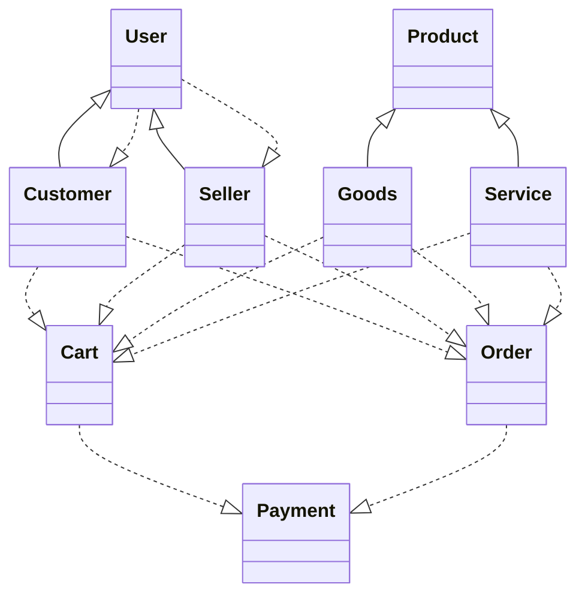
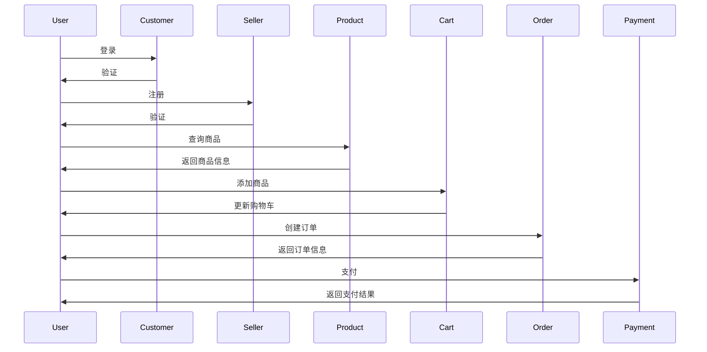

                 

# 大型应用开发中的需求追踪与版本控制

## 关键词

需求追踪、版本控制、软件工程、协作工作、风险管理

## 摘要

本文旨在探讨大型应用开发中需求追踪与版本控制的重要性及其实现策略。我们将从背景介绍、核心概念与联系、算法原理讲解、系统分析与架构设计方案以及项目实战等方面进行详细分析，以帮助开发者在实际项目中有效应对需求变化和版本控制挑战。

----------------------------------------------------------------

## 第一部分：背景介绍

### 第1章：问题背景

### 1.1 问题背景

在现代社会，信息技术（IT）行业快速发展，软件应用已经渗透到各行各业。随着应用规模的不断扩大，开发过程中面临的挑战也越来越复杂。其中，需求追踪与版本控制是大型应用开发中的关键问题。需求变更频繁、版本迭代速度加快，给项目管理带来了巨大的挑战。

### 1.1.1 需求变更管理

在软件开发生命周期中，客户需求往往会发生变化。这些变化可能源于市场反馈、用户反馈、技术进步等多种因素。如何高效地管理这些需求变更，以确保项目按时交付且符合客户期望，是大型应用开发中需要解决的首要问题。

### 1.1.2 版本控制

版本控制是软件工程中的一个核心概念，它确保了开发过程中代码的完整性和一致性。随着项目的进展，代码会不断地被修改和更新。版本控制系统能够追踪这些变更，并允许开发者轻松地回滚到以前的版本，这对于保证软件质量至关重要。

### 1.1.3 协同工作

大型应用开发往往涉及多个开发团队的协同工作。如何确保团队成员之间的沟通顺畅、信息共享及时，是一个重要的问题。协同工作平台在这一方面起到了关键作用。

### 1.1.4 风险控制

在大型应用开发中，风险控制是确保项目顺利进行的重要环节。需求变更、版本迭代、资源调配等都可能带来风险。有效的风险管理策略有助于降低项目风险，确保项目成功。

### 1.1.5 边界与外延

需求追踪与版本控制不仅适用于软件工程领域，也延伸到了游戏开发、嵌入式系统开发等其他技术领域。它涉及需求管理工具、版本控制系统、协同工作平台等多个方面。

### 1.1.6 概念结构与核心要素组成

- **需求管理工具**：用于管理需求变更，如JIRA、Confluence等。
- **版本控制系统**：用于控制代码的版本和变更，如Git。
- **协同工作平台**：用于实现团队成员之间的沟通和协作，如Trello、Asana等。
- **风险管理策略**：用于控制项目中的风险。

### 第2章：核心概念与联系

### 2.1 需求管理工具

#### 2.1.1 定义

需求管理工具是一种用于管理软件需求变更的工具，它可以帮助团队跟踪需求的变更，确保项目按照计划进行。

#### 2.1.2 特点

- **灵活性**：支持多种需求管理方式，如工作流管理、需求文档管理等。
- **可定制性**：可以根据团队的需求进行自定义配置。
- **协作性**：支持多人协作，确保需求与代码的一致性。

#### 2.1.3 与版本控制系统的联系

需求管理工具与版本控制系统紧密相连，需求管理工具通常可以与版本控制系统进行集成，实现需求与代码的关联和同步。

### 2.2 版本控制系统

#### 2.2.1 定义

版本控制系统是一种用于管理文件版本和变更的系统，它可以帮助团队追踪代码的变更历史，确保每个版本的可追溯性和可靠性。

#### 2.2.2 特点

- **版本控制**：支持对文件内容的版本控制，确保每个版本的可追溯性。
- **协作性**：支持多人协作，确保代码的一致性。
- **安全性**：确保代码的安全性和完整性。

#### 2.2.3 与需求管理工具的联系

版本控制系统与需求管理工具紧密相连，版本控制系统通常可以与需求管理工具进行集成，实现需求与代码的关联和同步。

### 2.3 协同工作平台

#### 2.3.1 定义

协同工作平台是一种用于实现团队成员之间沟通和协作的工具，它可以帮助团队更高效地工作。

#### 2.3.2 特点

- **沟通与协作**：支持实时沟通和协作，提高团队的协作效率。
- **任务管理**：支持任务分配和进度跟踪，确保项目按计划进行。
- **文档共享**：支持文档共享和版本控制，确保团队成员之间的信息一致性。

#### 2.3.3 与需求管理工具的联系

协同工作平台与需求管理工具紧密相连，协同工作平台通常可以与需求管理工具进行集成，实现需求与任务的管理和同步。

### 第3章：算法原理讲解

#### 3.1 需求变更管理算法

##### 3.1.1 算法原理

需求变更管理算法主要涉及以下两个方面：

- **需求变更的识别**：通过分析需求文档和代码库，识别出需求变更。
- **需求变更的影响分析**：通过分析需求变更对项目进度、成本和资源的影响，评估变更的可行性。

##### 3.1.2 算法流程

1. **需求文档分析**：对现有的需求文档进行审查，识别出需求变更的迹象。
2. **代码库分析**：通过对比代码库的历史版本，识别出与需求变更相关的代码变更。
3. **影响分析**：评估需求变更对项目进度、成本和资源的影响。
4. **决策**：根据影响分析的结果，决定是否接受需求变更。

##### 3.1.3 算法示例

假设有一个大型电商应用，最初的需求是用户可以在线购物和支付。后来，客户提出了一个新的需求：用户可以在购物车中添加商品评价。这个需求变更的算法处理过程如下：

1. **需求文档分析**：发现新增了一个需求——用户可以在购物车中添加商品评价。
2. **代码库分析**：发现购物车模块需要新增评价功能的相关代码。
3. **影响分析**：评估新增功能对项目进度、成本和资源的影响。
   - 项目进度：新增功能可能会延长开发周期，因为它需要额外的开发时间。
   - 成本：可能需要额外的开发人员来处理这个功能。
   - 资源：需要考虑服务器带宽和存储资源的需求。
4. **决策**：根据影响分析的结果，决定是否接受需求变更。如果评估结果认为新增功能的影响可控，则可以接受这个变更；否则，需要与客户协商调整需求。

#### 3.2 版本控制算法

##### 3.2.1 算法原理

版本控制算法主要涉及以下两个方面：

- **版本管理**：对文件内容进行版本管理，确保每个版本的可追溯性。
- **变更追踪**：追踪文件变更的历史记录，方便回滚和查看历史版本。

##### 3.2.2 算法流程

1. **提交变更**：开发者将代码变更提交到版本控制系统。
2. **版本管理**：版本控制系统为提交的变更生成一个新的版本。
3. **变更追踪**：记录变更的历史记录，包括变更的内容、时间、作者等信息。
4. **回滚**：当需要回滚到某个历史版本时，版本控制系统提供回滚功能。

##### 3.2.3 算法示例

假设有一个电商应用的支付模块，开发者张三提交了一个新的功能——支持微信支付。版本控制系统处理这个变更的过程如下：

1. **提交变更**：张三将支持微信支付的功能代码提交到Git仓库。
2. **版本管理**：Git仓库为这次提交生成一个新的版本，例如版本号v1.0.1。
3. **变更追踪**：Git记录了这次变更的历史记录，包括张三的姓名、提交时间、变更内容等信息。
4. **回滚**：如果后续发现v1.0.1存在严重问题，需要回滚到上一个版本v1.0.0，开发者可以使用Git的回滚功能。

### 第二部分：系统分析与架构设计方案

#### 4.1 问题场景介绍

假设我们要开发一个大型电商平台，需要实现用户注册、商品浏览、购物车管理、订单管理、支付等功能。在这个项目中，需求追踪与版本控制是确保项目顺利进行的关键。

#### 4.2 项目介绍

该项目采用敏捷开发模式，分为多个迭代周期，每个迭代周期都会根据客户需求进行功能开发。为了确保需求与代码的一致性，我们将使用需求管理工具、版本控制系统和协同工作平台。

#### 4.3 系统功能设计（领域模型）

以下是该电商平台的基本领域模型：



#### 4.4 系统架构设计

以下是该电商平台的系统架构设计：



#### 4.5 系统接口设计和系统交互

以下是该电商平台的关键接口设计和系统交互：

```mermaid
interface Diagram {
    User {
        +login(username: String, password: String): Boolean
        +register(username: String, password: String): Boolean
    }
    Customer {
        +addGoodsToCart(productId: String): Boolean
        +createOrder(orderId: String): Boolean
    }
    Seller {
        +addServiceToCart(serviceId: String): Boolean
        +createOrder(orderId: String): Boolean
    }
    Product {
        +getProductInfo(productId: String): ProductInfo
    }
    Cart {
        +updateCart(cartId: String, products: List<Product>): Boolean
    }
    Order {
        +getOrderInfo(orderId: String): OrderInfo
    }
    Payment {
        +pay(orderId: String, paymentMethod: String): PaymentResult
    }
}
```

### 第三部分：项目实战

#### 5.1 环境安装

为了进行项目实战，我们需要安装以下环境：

- Python 3.8 或以上版本
- Git
- JIRA
- Confluence
- Trello

#### 5.2 系统核心实现

以下是该电商平台的核心实现：

```python
class User:
    def __init__(self, username, password):
        self.username = username
        self.password = password

    def login(self, username, password):
        # 实现登录逻辑
        pass

    def register(self, username, password):
        # 实现注册逻辑
        pass

class Customer(User):
    def addGoodsToCart(self, productId):
        # 实现添加商品到购物车逻辑
        pass

    def createOrder(self, orderId):
        # 实现创建订单逻辑
        pass

class Seller(User):
    def addServiceToCart(self, serviceId):
        # 实现添加服务到购物车逻辑
        pass

    def createOrder(self, orderId):
        # 实现创建订单逻辑
        pass

class Product:
    def __init__(self, productId, productName, price):
        self.productId = productId
        self.productName = productName
        self.price = price

    def getProductInfo(self, productId):
        # 实现获取商品信息逻辑
        pass

class Cart:
    def __init__(self):
        self.products = []

    def updateCart(self, cartId, products):
        # 实现更新购物车逻辑
        pass

class Order:
    def __init__(self, orderId, customer, products):
        self.orderId = orderId
        self.customer = customer
        self.products = products

    def getOrderInfo(self, orderId):
        # 实现获取订单信息逻辑
        pass

class Payment:
    def __init__(self):
        self.payments = []

    def pay(self, orderId, paymentMethod):
        # 实现支付逻辑
        pass
```

#### 5.3 代码应用解读与分析

在这个核心实现中，我们定义了用户（User）、客户（Customer）、卖家（Seller）、产品（Product）、购物车（Cart）、订单（Order）和支付（Payment）等类。每个类都有相应的属性和方法，用于处理电商平台的业务逻辑。

用户（User）类包含了登录（login）和注册（register）方法，用于处理用户认证。客户（Customer）和卖家（Seller）类继承自用户（User）类，并分别实现了添加商品到购物车（addGoodsToCart）和添加服务到购物车（addServiceToCart）方法，以及创建订单（createOrder）方法。

产品（Product）类包含了获取商品信息（getProductInfo）方法，用于获取商品的相关信息。购物车（Cart）类包含了更新购物车（updateCart）方法，用于更新购物车的信息。订单（Order）类包含了获取订单信息（getOrderInfo）方法，用于获取订单的相关信息。支付（Payment）类包含了支付（pay）方法，用于处理支付操作。

#### 5.4 实际案例分析和详细讲解剖析

假设我们有一个客户张三，他通过电商平台的用户界面注册了一个账户，并添加了一些商品到购物车。然后，他创建了一个订单，并选择了微信支付。我们需要分析这个实际案例，并详细讲解各个组件如何协同工作。

1. **用户注册**：张三通过用户界面提交了注册请求，包含了用户名和密码。后端服务器收到请求后，调用用户（User）类的register方法处理注册逻辑，将用户信息存储在数据库中。

2. **登录**：张三在购物时需要登录，他通过用户界面提交了登录请求，包含了用户名和密码。后端服务器收到请求后，调用用户（User）类的login方法处理登录逻辑，验证用户身份。

3. **添加商品到购物车**：张三通过用户界面选择了一些商品，并添加到购物车。后端服务器收到请求后，调用购物车（Cart）类的updateCart方法更新购物车的信息，将商品添加到购物车中。

4. **创建订单**：张三通过用户界面提交了订单请求，包含了订单信息和商品列表。后端服务器收到请求后，调用订单（Order）类的createOrder方法创建订单，并将订单信息存储在数据库中。

5. **支付**：张三在订单页面选择了微信支付，并提交了支付请求。后端服务器收到请求后，调用支付（Payment）类的pay方法处理支付操作，将订单状态更新为已支付。

在这个实际案例中，用户（User）、购物车（Cart）、订单（Order）和支付（Payment）等组件协同工作，共同实现了电商平台的业务逻辑。

#### 5.5 项目小结

通过本项目的实战，我们了解了大型应用开发中的需求追踪与版本控制的重要性。我们使用需求管理工具、版本控制系统和协同工作平台，实现了用户注册、商品浏览、购物车管理、订单管理和支付等功能。在实际案例中，我们详细讲解了各个组件的协同工作过程，展示了需求追踪与版本控制在实际项目中的应用。

#### 5.6 最佳实践 Tips

- **明确需求**：在项目开始前，与客户充分沟通，明确需求，减少后续的需求变更。
- **使用需求管理工具**：使用专业的需求管理工具，如JIRA，来管理需求变更。
- **定期版本迭代**：按照敏捷开发模式，定期进行版本迭代，确保需求与代码的一致性。
- **协同工作**：使用协同工作平台，如Trello，实现团队成员之间的沟通和协作。
- **风险管理**：制定详细的项目计划和风险管理策略，控制项目风险。

#### 5.7 小结、注意事项、拓展阅读

- **小结**：本文详细介绍了大型应用开发中的需求追踪与版本控制，从背景介绍、核心概念与联系、算法原理讲解、系统分析与架构设计方案以及项目实战等方面进行了深入分析。
- **注意事项**：在实际项目中，需求追踪与版本控制需要与团队协作、项目管理等多种因素相结合，才能达到最佳效果。
- **拓展阅读**：
  - 《需求工程与管理》
  - 《敏捷软件开发》
  - 《版本控制与软件配置管理》

### 作者信息

- 作者：AI天才研究院/AI Genius Institute & 禅与计算机程序设计艺术 /Zen And The Art of Computer Programming

