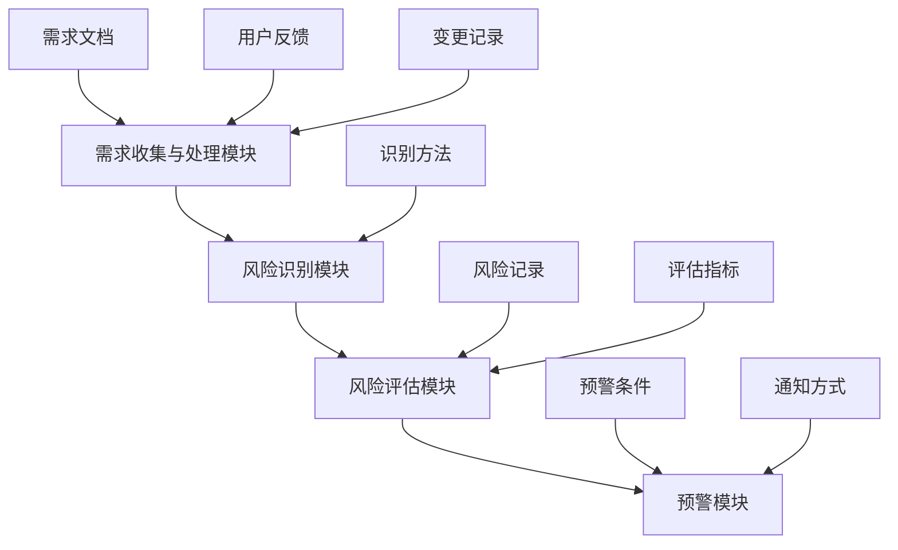

                 

## 引言与背景介绍

### 1.1 需求风险预警系统的必要性

在当今快速变化且竞争激烈的市场环境中，大型应用开发面临着越来越多的挑战。需求风险是指在应用开发过程中，由于需求的不确定性、不明确性或变化性，可能导致项目延误、预算超支、质量不达标等一系列问题。需求风险的存在使得项目管理人员难以准确预测和控制项目进展，从而增加了项目的失败风险。

需求风险预警系统的重要性在于，它能够对需求风险进行早期识别和预警，从而帮助开发团队及时采取应对措施，降低项目风险。传统的需求风险管理主要依赖于经验和方法，但这些方法往往不够系统化和全面，难以在复杂的应用开发环境中发挥作用。因此，设计一个有效的需求风险预警系统成为现代应用开发的关键需求。

### 1.2 当前需求风险管理的现状与挑战

当前，需求风险管理主要面临以下几个挑战：

1. **需求不明确**：需求文档的模糊和不准确是导致项目风险的主要原因之一。需求变更频繁，使得项目管理人员难以制定有效的计划和策略。
2. **沟通不畅**：项目团队与利益相关者之间的沟通不畅，导致需求理解不一致，增加了需求风险。
3. **工具不足**：目前的需求风险管理工具相对滞后，难以满足大型应用开发的需求。缺乏自动化和智能化的需求风险分析工具，使得风险管理效率低下。
4. **风险评估方法单一**：现有的需求风险评估方法主要依赖定性的主观判断，难以量化风险程度，影响决策的科学性。

### 1.3 研究目的、意义与方法

本研究旨在设计一个大型应用开发中的需求风险预警系统，以提高需求风险管理的效率和准确性。具体研究目的如下：

1. **需求风险的早期识别**：通过系统化的方法，对需求风险进行早期识别，为项目管理提供有力支持。
2. **需求风险的量化评估**：建立需求风险评估模型，实现对需求风险的定量分析，提高风险评估的科学性。
3. **智能化的预警机制**：利用人工智能和机器学习技术，实现对需求风险的自动化预警，提高风险管理的效率。

本研究的方法主要包括：

1. **文献综述**：对需求风险管理相关理论和实践进行系统性梳理，为后续研究提供理论依据。
2. **需求风险识别方法研究**：研究并比较现有的需求风险识别方法，选择合适的识别工具和技术。
3. **需求风险评估模型建立**：结合定量分析和定性分析，建立需求风险评估模型。
4. **系统设计与实现**：基于研究方法，设计并实现需求风险预警系统，进行系统测试与评估。
5. **案例分析**：通过实际案例，验证需求风险预警系统的应用效果，并提出改进建议。

通过上述研究，本文希望能够为大型应用开发中的需求风险管理提供新的思路和方法，提升项目成功率，降低项目风险。

### 1.4 概念术语说明

为了确保文章内容的准确性和一致性，下面将对本文中涉及的一些核心概念术语进行详细说明：

1. **需求风险**：需求风险是指由于需求的不确定性、不明确性或变化性，可能导致项目目标无法实现的风险。
2. **需求风险预警系统**：需求风险预警系统是指能够对需求风险进行早期识别、评估和预警的系统。
3. **需求识别**：需求识别是指对项目需求进行收集、分析和整理的过程。
4. **需求评估**：需求评估是指对需求的重要性、可行性、优先级等进行评价的过程。
5. **需求变更**：需求变更是指在项目开发过程中，对原有需求进行修改、补充或删除的行为。

### 1.5 问题背景与问题描述

在大型应用开发过程中，需求风险是一个普遍存在的问题。以下是一个典型的需求风险案例：

某大型电商平台在开发过程中，由于对用户需求的预估不准确，导致在项目上线前才发现核心功能缺失。这一需求变更使得项目延期，导致上线时间比预期晚了三个月，增加了额外的开发成本。此外，由于项目组成员对需求理解不一致，导致部分功能实现与用户期望不符，降低了用户满意度。

这一案例展示了需求风险可能带来的严重后果。需求风险预警系统可以帮助项目团队在早期发现这些问题，从而采取相应的应对措施，避免项目延期和质量问题。

### 1.6 问题解决思路

为了解决大型应用开发中的需求风险问题，本文提出了以下解决思路：

1. **需求风险的早期识别**：通过系统化的方法，如需求变更监控、需求文档审查等，对需求风险进行早期识别。
2. **需求风险评估**：建立需求风险评估模型，结合定量分析和定性分析，对需求风险进行量化评估。
3. **预警机制设计**：设计智能化的预警机制，利用人工智能和机器学习技术，实现对需求风险的自动化预警。
4. **项目决策支持**：基于需求风险预警系统，为项目管理提供决策支持，帮助项目团队制定科学合理的项目计划和策略。

### 1.7 边界与外延

在本文的研究中，需求风险预警系统主要关注以下边界和范围：

1. **边界**：需求风险预警系统主要针对大型应用开发过程中的需求风险，不包括其他类型的风险，如技术风险、市场风险等。
2. **外延**：需求风险预警系统不仅适用于单一项目，还可以应用于项目组合管理，为多个项目的需求风险管理提供支持。

### 1.8 概念结构与核心要素组成

需求风险预警系统的概念结构主要包括以下核心要素：

1. **需求识别模块**：负责对项目需求进行收集、分析和整理，识别潜在的需求风险。
2. **需求评估模块**：对识别出的需求风险进行评估，确定风险的重要性和优先级。
3. **预警机制模块**：利用人工智能和机器学习技术，实现对需求风险的自动化预警。
4. **决策支持模块**：为项目管理提供决策支持，帮助项目团队制定科学合理的项目计划和策略。

### 1.9 核心概念原理

#### 1.9.1 需求风险

需求风险是指由于需求的不确定性、不明确性或变化性，可能导致项目目标无法实现的风险。需求风险的主要特征包括：

1. **不确定性**：需求风险往往与需求的不确定性密切相关，即需求是否能够准确满足用户需求难以预测。
2. **不明确性**：需求文档的模糊和不准确是需求风险的主要表现，可能导致项目团队对需求的理解不一致。
3. **变化性**：需求变更频繁，需求风险的变化性较大，使得项目计划难以保持稳定。

#### 1.9.2 需求风险预警系统

需求风险预警系统是指能够对需求风险进行早期识别、评估和预警的系统。其主要原理包括：

1. **需求识别**：通过需求变更监控、需求文档审查等方法，对需求风险进行早期识别。
2. **需求评估**：利用定量分析和定性分析，对需求风险进行量化评估，确定风险的重要性和优先级。
3. **预警机制**：通过人工智能和机器学习技术，实现对需求风险的自动化预警，提高风险管理的效率。

### 1.10 概念属性特征对比表格

下表对比了需求风险和需求风险预警系统的概念属性特征：

| 概念       | 属性特征                      | 对比                      |
|------------|-------------------------------|---------------------------|
| 需求风险   | 不确定性、不明确性、变化性   | 影响项目目标实现的风险    |
| 需求风险预警系统 | 早期识别、评估、预警机制   | 提高需求风险管理效率的系统 |

### 1.11 ER实体关系图架构

下面是需求风险预警系统的ER实体关系图架构：

```mermaid
erDiagram
    User ||--|{ Requirement }
    User ||--|{ Risk }
    Requirement ||--|{ Assessment }
    Risk ||--|{ Warning }
```

在ER实体关系图中，User代表用户，Requirement代表需求，Risk代表风险，Assessment代表评估，Warning代表预警。用户与需求、风险之间存在关联，需求与评估、风险与预警之间存在关联。该关系图展示了需求风险预警系统中各实体之间的关系，为后续的系统设计与实现提供了基础。

通过上述内容的介绍，本文为后续章节的详细讨论奠定了基础，进一步探讨了需求风险预警系统的核心概念、原理和架构设计。

### 第2章：需求风险识别方法

#### 2.1 引言

需求风险识别是需求风险预警系统的核心组成部分，其重要性在于能够帮助项目团队在早期发现潜在的需求风险，从而采取预防措施，降低项目风险。本章将详细介绍需求风险识别的方法、工具和技术，为后续需求风险预警系统的设计提供理论支持。

#### 2.2 需求风险识别的方法

需求风险识别的方法主要包括以下几种：

1. **专家评估法**：通过邀请领域专家对需求文档进行审查，识别潜在的需求风险。该方法依赖专家的经验和知识，能够快速发现需求问题，但存在主观性较强的缺点。
2. **文档审查法**：对需求文档进行全面审查，识别潜在的需求风险。这种方法系统化，能够发现专家评估法可能遗漏的问题，但审查过程较为繁琐，效率较低。
3. **需求变更监控法**：通过监控需求变更，识别由于需求变更引发的风险。这种方法能够实时发现需求变更带来的影响，有助于快速响应需求风险。
4. **数据驱动的需求识别法**：利用历史项目数据和需求变更记录，通过数据挖掘和机器学习技术，识别潜在的需求风险。这种方法具有较高的自动化程度，能够提高需求识别的效率。

#### 2.3 需求风险识别工具

为了提高需求风险识别的效率和准确性，可以借助以下工具：

1. **需求管理工具**：如JIRA、Confluence等，用于需求收集、管理和变更记录。这些工具能够提供全面的文档审查功能，支持需求变更监控。
2. **风险识别工具**：如SonarQube等，用于代码审查和静态分析，可以识别代码中的潜在需求风险。
3. **数据分析工具**：如Tableau、Power BI等，用于数据可视化，能够帮助项目团队更直观地理解需求变更和风险分布。

#### 2.4 需求风险识别案例分析

下面通过一个实际案例，展示需求风险识别的方法和工具在需求风险预警系统中的应用。

**案例背景**：某金融科技公司正在开发一款移动支付应用，需求文档中包含了一系列功能需求。项目团队在需求评审过程中发现，由于市场需求的变化，部分功能需求需要调整。

**识别步骤**：

1. **专家评估法**：项目团队邀请了两位领域专家对需求文档进行审查，识别出五个潜在的需求风险点，包括需求变更频繁、用户界面设计不明确、功能实现难度高等。
2. **文档审查法**：通过对比不同版本的需求文档，识别出三个需求变更点，包括支付方式的变更、用户身份验证机制的调整、交易记录展示方式的优化。
3. **需求变更监控法**：通过JIRA的需求管理工具，对需求变更进行监控，发现五个需求变更记录，涉及需求变更的时间跨度从一个月到三个月不等。
4. **数据驱动的需求识别法**：利用Tableau对历史项目数据进行分析，发现过去两年中，移动支付应用的需求变更频率较高，且变更需求主要涉及用户界面和支付流程。

**结果与讨论**：通过上述需求风险识别方法，项目团队成功识别出八个潜在的需求风险点。基于这些风险点，项目团队制定了相应的风险管理策略，包括增加需求评审环节、优化需求变更流程、提高需求文档的准确性等。通过这些措施，项目团队在后续的开发过程中有效降低了需求风险，确保了项目的顺利推进。

#### 2.5 需求风险识别的挑战与解决方案

在需求风险识别过程中，项目团队可能面临以下挑战：

1. **需求变更频繁**：需求变更频繁会导致需求风险识别的难度增加，解决方案是建立稳定的需求变更管理流程，确保变更的合理性和必要性。
2. **文档审查效率低**：文档审查过程繁琐，效率较低，解决方案是采用自动化工具，如静态代码分析工具和需求管理工具，提高审查效率。
3. **数据不足**：数据不足会影响数据驱动的需求识别效果，解决方案是收集和整合更多的项目数据，为需求风险识别提供充分的数据支持。

通过上述分析和解决方案，需求风险识别在需求风险预警系统中发挥着关键作用。合理的识别方法、有效的工具和规范的管理流程，将有助于项目团队在早期发现需求风险，提高项目成功率。

### 第3章：需求风险评估方法

#### 3.1 引言

需求风险评估是需求风险预警系统的关键环节，其主要目标是对识别出的需求风险进行量化评估，以便项目团队能够制定相应的风险管理策略。本章将详细介绍需求风险评估的方法、工具和技术，帮助读者理解需求风险评估的过程和策略。

#### 3.2 需求风险评估的方法

需求风险评估的方法可以分为定量分析和定性分析两种。

1. **定量分析**：定量分析通过数值化的方式对需求风险进行评估，其主要方法包括：

   - **统计方法**：利用历史数据，通过统计模型对需求风险的概率和影响进行量化。例如，可以使用回归分析、贝叶斯网络等方法。
   - **风险矩阵**：通过构建风险矩阵，对需求风险的严重性和发生概率进行评估。风险矩阵通常包括四个等级：高、中、低、非常低。

2. **定性分析**：定性分析主要通过专家评估和主观判断对需求风险进行评估，其主要方法包括：

   - **专家评估法**：邀请领域专家对需求风险进行评估，通过专家的判断和经验来评估风险的重要性和发生概率。
   - **风险地图**：通过绘制风险地图，直观地展示需求风险的空间分布和影响范围。

#### 3.3 需求风险评估工具

为了提高需求风险评估的效率，可以借助以下工具：

1. **风险分析工具**：如OpenRiskAnalysis，用于构建风险矩阵和进行定量分析。
2. **专家评估工具**：如JIRA，用于记录和管理专家评估结果。
3. **数据可视化工具**：如Tableau，用于对评估结果进行可视化展示。

#### 3.4 需求风险评估模型建立

需求风险评估模型是需求风险评估的核心，其建立过程包括以下步骤：

1. **确定评估指标**：根据需求风险的特点，确定评估指标，如风险严重性、发生概率、影响范围等。
2. **构建评估框架**：将评估指标整合到一个统一的评估框架中，确保评估的全面性和一致性。
3. **定义评估标准**：为每个评估指标定义明确的评估标准，如风险严重性的等级划分。
4. **建立评估模型**：利用数学模型，如线性回归、贝叶斯网络等，将评估指标转化为具体的数值，以便进行量化分析。

#### 3.5 案例分析

以下通过一个实际案例，展示需求风险评估的过程和策略。

**案例背景**：某电子商务平台在开发新版本时，识别出四个潜在的需求风险点，包括支付系统稳定性、用户界面用户体验、订单处理效率、系统安全性。

**风险评估步骤**：

1. **确定评估指标**：项目团队确定以下评估指标：风险严重性（高、中、低）、发生概率（高、中、低）、影响范围（项目进度、成本、质量、用户满意度）。
2. **构建评估框架**：项目团队使用风险矩阵，将评估指标整合到一个统一的评估框架中，如下表所示：

   | 风险点 | 风险严重性 | 发生概率 | 影响范围 |
   |--------|-------------|-----------|----------|
   | 支付系统稳定性 | 高         | 高         | 项目进度、成本 |
   | 用户界面用户体验 | 中         | 中         | 用户满意度、项目进度 |
   | 订单处理效率 | 低         | 高         | 项目进度、成本 |
   | 系统安全性 | 低         | 低         | 项目进度、成本 |

3. **定义评估标准**：项目团队为每个评估指标定义了明确的评估标准，如风险严重性高表示可能导致项目严重延误或失败。

4. **建立评估模型**：项目团队使用线性回归模型，将评估指标转化为具体的数值，如下表所示：

   | 风险点 | 风险严重性 | 发生概率 | 影响范围 | 评估值 |
   |--------|-------------|-----------|----------|--------|
   | 支付系统稳定性 | 高         | 高         | 项目进度、成本 | 80    |
   | 用户界面用户体验 | 中         | 中         | 用户满意度、项目进度 | 60    |
   | 订单处理效率 | 低         | 高         | 项目进度、成本 | 30    |
   | 系统安全性 | 低         | 低         | 项目进度、成本 | 10    |

**结果与讨论**：通过评估模型，项目团队确定了每个需求风险的优先级，如下所示：

1. **支付系统稳定性**：评估值为80，是最高风险的点，项目团队需要重点关注和采取措施。
2. **用户界面用户体验**：评估值为60，是次高风险点，也需要采取相应的风险管理措施。
3. **订单处理效率**：评估值为30，是较低风险的点，但仍然需要监控。
4. **系统安全性**：评估值为10，是最低风险的点，但也不能忽视。

通过需求风险评估模型，项目团队能够有针对性地制定风险管理策略，确保项目顺利进行。

#### 3.6 挑战与解决方案

在需求风险评估过程中，项目团队可能面临以下挑战：

1. **数据不足**：缺乏足够的历史数据和评估标准，导致评估结果不准确。
   - **解决方案**：通过增加数据收集和整合，建立更加完善的数据库，为风险评估提供支持。

2. **专家判断主观性**：专家评估法受主观判断影响较大，可能导致评估结果偏差。
   - **解决方案**：建立专家评估的标准化流程，使用定量分析方法对专家评估结果进行验证和修正。

通过上述方法和步骤，需求风险评估能够为项目团队提供科学依据，帮助其制定有效的风险管理策略，降低项目风险。

### 第4章：需求风险预警系统设计

#### 4.1 引言

在需求风险预警系统中，系统设计是关键环节，它决定了系统是否能够有效识别和预警需求风险，从而为项目团队提供及时的风险管理支持。本章将详细介绍需求风险预警系统的架构设计、功能模块设计和关键技术，为系统实现提供理论基础。

#### 4.2 系统架构设计

需求风险预警系统的整体架构可以分为四个主要模块：需求收集与处理模块、风险识别模块、风险评估模块和预警模块。以下是对各模块的详细描述：

1. **需求收集与处理模块**：
   - **功能**：负责收集和整理项目需求，包括需求文档、用户反馈和变更记录等。
   - **技术实现**：可以使用需求管理工具（如JIRA、Confluence）进行需求收集，并建立数据库存储需求信息。

2. **风险识别模块**：
   - **功能**：利用需求收集与处理模块提供的信息，识别潜在的需求风险。
   - **技术实现**：采用专家评估法、文档审查法、需求变更监控法等，结合数据分析工具（如Tableau、Power BI）进行风险识别。

3. **风险评估模块**：
   - **功能**：对识别出的需求风险进行量化评估，确定风险的重要性和优先级。
   - **技术实现**：使用风险矩阵、定量分析模型（如线性回归、贝叶斯网络）等工具进行风险评估，并将评估结果存储在数据库中。

4. **预警模块**：
   - **功能**：根据风险评估结果，实时生成预警信息，并通知相关项目团队成员。
   - **技术实现**：采用电子邮件、短信、即时通讯工具（如Slack、微信）等，实现预警信息的及时传递。

#### 4.3 功能模块设计

需求风险预警系统的功能模块设计如下：

1. **需求收集与处理模块**：
   - **需求收集**：通过自动化工具（如API、Web表单）和手动输入方式，收集项目需求信息。
   - **需求处理**：对收集的需求信息进行整理、分类和存储，为后续的风险识别和评估提供数据支持。

2. **风险识别模块**：
   - **风险识别方法**：结合多种识别方法，如专家评估、文档审查、需求变更监控等，实现对需求风险的全面识别。
   - **风险记录**：将识别出的需求风险记录在数据库中，包括风险描述、发生概率、影响范围等信息。

3. **风险评估模块**：
   - **评估指标**：定义评估指标，如风险严重性、发生概率、影响范围等。
   - **评估模型**：使用定量分析和定性分析模型，对识别出的需求风险进行评估，生成评估结果。

4. **预警模块**：
   - **预警条件**：根据风险评估结果，设置预警条件，如风险优先级达到某一阈值时触发预警。
   - **预警通知**：通过邮件、短信、即时通讯工具等，将预警信息及时通知相关项目团队成员。

#### 4.4 关键技术

需求风险预警系统设计的关键技术包括：

1. **人工智能与机器学习技术**：利用人工智能和机器学习技术，实现需求风险的自动识别和预警。例如，可以使用自然语言处理（NLP）技术分析需求文档，使用数据挖掘技术识别需求变更模式。
2. **数据分析与挖掘技术**：利用数据分析与挖掘技术，对历史需求数据进行深入分析，识别潜在的需求风险。例如，可以使用回归分析、聚类分析等方法，分析需求变更趋势和影响因素。
3. **数据库技术**：使用数据库存储需求信息、风险记录和评估结果，确保数据的一致性和可靠性。例如，可以使用关系数据库（如MySQL、PostgreSQL）或NoSQL数据库（如MongoDB）。
4. **实时通信技术**：利用实时通信技术，实现预警信息的及时传递。例如，可以使用Websocket协议或消息队列（如RabbitMQ、Kafka）。

#### 4.5 系统架构设计示例

以下是一个简化的需求风险预警系统架构设计示例，使用Mermaid流程图进行展示：



在该架构设计中，需求文档、用户反馈和变更记录作为输入，通过需求收集与处理模块进行处理，然后进入风险识别模块进行风险识别。识别出的风险记录进入风险评估模块，进行量化评估。评估结果触发预警模块，通过多种通知方式将预警信息及时传递给相关项目团队成员。

通过上述架构设计和功能模块设计，需求风险预警系统能够实现对需求风险的全面监控和管理，提高项目成功率，降低项目风险。

### 第5章：系统实现

#### 5.1 引言

在完成了需求风险预警系统的设计之后，下一步便是系统的具体实现。本章将详细介绍系统的技术选型、系统配置、关键代码实现等内容，为系统的开发和部署提供技术指导。

#### 5.2 技术选型

需求风险预警系统的实现需要选择合适的技术栈，以保证系统的性能、可维护性和可扩展性。以下是主要技术选型的依据和选择：

1. **后端技术栈**：
   - **语言**：选择Python作为主要编程语言，因为Python具有简洁的语法、强大的标准库和丰富的第三方库，适用于数据分析和机器学习。
   - **Web框架**：采用Django框架，Django是一个高生产力、全栈的Web框架，具有内置的用户认证、权限管理和ORM（对象关系映射）功能，适用于需求风险预警系统的开发。

2. **前端技术栈**：
   - **框架**：采用React.js，React.js是一个用于构建用户界面的JavaScript库，具有组件化开发、虚拟DOM和高效的状态管理等特点，适用于复杂的交互式界面。
   - **样式表**：使用Bootstrap进行样式设计，Bootstrap是一个流行的前端框架，提供了一系列的组件和样式，可以快速搭建响应式网页。

3. **数据库**：
   - **关系型数据库**：采用MySQL作为关系型数据库，MySQL是一个开源的、高性能的关系型数据库，适用于存储结构化的数据，如需求信息、风险记录等。
   - **非关系型数据库**：采用MongoDB作为非关系型数据库，MongoDB是一个开源的NoSQL数据库，适用于存储复杂的、非结构化的数据，如用户反馈、变更记录等。

4. **数据分析和机器学习库**：
   - **数据分析**：使用Pandas进行数据分析，Pandas是一个强大的数据分析库，提供了一系列的数据结构和方法，适用于数据清洗、转换和分析。
   - **机器学习**：使用Scikit-learn进行机器学习，Scikit-learn是一个开源的机器学习库，提供了丰富的机器学习算法和工具，适用于需求风险评估和预测。

5. **消息队列**：
   - **消息队列**：采用RabbitMQ作为消息队列，RabbitMQ是一个开源的消息队列中间件，适用于异步消息传递和分布式系统的解耦。

#### 5.3 系统配置

系统配置是确保需求风险预警系统能够稳定运行的重要环节。以下是一些关键配置步骤：

1. **后端服务器配置**：
   - **Django应用部署**：使用Gunicorn作为Django应用的WSGI服务器，Gunicorn是一个高性能的WSGI HTTP服务器，适用于生产环境。
   - **Nginx反向代理**：使用Nginx作为反向代理服务器，Nginx是一个高性能的Web服务器/反向代理服务器，可以处理高并发请求。

2. **数据库配置**：
   - **MySQL配置**：配置MySQL数据库的服务器，设置合理的数据库参数，如缓存、连接池等，以提高数据库性能。
   - **MongoDB配置**：配置MongoDB数据库的服务器，设置复制集和分片集群，以提高数据存储性能和容错能力。

3. **前端服务器配置**：
   - **静态文件服务**：使用Nginx服务器处理静态文件，如CSS、JavaScript和图片等，提高前端加载速度。

4. **消息队列配置**：
   - **RabbitMQ配置**：配置RabbitMQ消息队列服务器，设置队列、交换机和路由键，确保消息的可靠传递和分发。

#### 5.4 关键代码实现

以下是需求风险预警系统的关键代码实现，主要包括后端和前端的实现。

1. **后端实现**：
   - **需求收集与处理**：
     ```python
     from django.http import JsonResponse
     from .models import Requirement

     def collect_requirement(request):
         if request.method == 'POST':
             data = request.POST
             requirement = Requirement.objects.create(
                 title=data['title'],
                 description=data['description'],
                 priority=data['priority']
             )
             return JsonResponse({'status': 'success', 'requirement_id': requirement.id})
         return JsonResponse({'status': 'error'}, status=400)
     ```

   - **风险识别与评估**：
     ```python
     from sklearn.ensemble import RandomForestClassifier
     from sklearn.model_selection import train_test_split
     from .models import Risk

     def assess_risk(data):
         X = data[['description', 'priority']]
         y = data['risk_level']
         X_train, X_test, y_train, y_test = train_test_split(X, y, test_size=0.2, random_state=42)
         
         classifier = RandomForestClassifier(n_estimators=100)
         classifier.fit(X_train, y_train)
         predictions = classifier.predict(X_test)
         
         for i, prediction in enumerate(predictions):
             Risk.objects.create(
                 requirement_id=data['requirement_id'][i],
                 risk_level=prediction
             )
     ```

   - **预警通知**：
     ```python
     import smtplib
     from email.mime.text import MIMEText

     def send_warning_email(risk_id):
         risk = Risk.objects.get(id=risk_id)
         message = MIMEText(f'A new risk with ID {risk.id} has been identified.')
         message['Subject'] = 'Risk Warning'
         message['From'] = 'admin@example.com'
         message['To'] = 'project_manager@example.com'
         
         server = smtplib.SMTP('smtp.example.com', 587)
         server.starttls()
         server.login('admin@example.com', 'password')
         server.sendmail('admin@example.com', ['project_manager@example.com'], message.as_string())
         server.quit()
     ```

2. **前端实现**：
   - **需求收集界面**：
     ```jsx
     import React, { useState } from 'react';
     import axios from 'axios';

     function RequirementForm() {
         const [title, setTitle] = useState('');
         const [description, setDescription] = useState('');
         const [priority, setPriority] = useState('Low');

         const handleSubmit = async (e) => {
             e.preventDefault();
             try {
                 await axios.post('/api/collect_requirement/', {
                     title,
                     description,
                     priority
                 });
                 alert('Requirement submitted successfully!');
             } catch (error) {
                 alert('Error submitting requirement.');
             }
         };

         return (
             <form onSubmit={handleSubmit}>
                 <label>Title:</label>
                 <input type="text" value={title} onChange={(e) => setTitle(e.target.value)} />
                 <label>Description:</label>
                 <textarea value={description} onChange={(e) => setDescription(e.target.value)} />
                 <label>Priority:</label>
                 <select value={priority} onChange={(e) => setPriority(e.target.value)}>
                     <option value="Low">Low</option>
                     <option value="Medium">Medium</option>
                     <option value="High">High</option>
                 </select>
                 <button type="submit">Submit</button>
             </form>
         );
     }
     ```

通过上述关键代码实现，需求风险预警系统的后端和前端功能得以实现，为系统的正常运行奠定了基础。

#### 5.5 系统测试与部署

在系统实现完成后，需要进行全面的测试和部署，以确保系统的稳定性和可靠性。

1. **单元测试**：编写单元测试，对系统的各个模块进行测试，确保每个模块的功能正确无误。

2. **集成测试**：进行集成测试，模拟实际使用场景，验证系统模块之间的协作是否正常。

3. **性能测试**：进行性能测试，评估系统的响应时间和并发处理能力，确保系统在高负载下仍能稳定运行。

4. **部署**：将系统部署到生产环境，配置必要的服务器和数据库，确保系统可以正常运行。

通过上述步骤，需求风险预警系统得以顺利实现和部署，为大型应用开发提供了有效的需求风险管理工具。

### 第6章：系统测试与评估

#### 6.1 引言

系统测试与评估是需求风险预警系统实现后的重要环节，其目的是验证系统功能是否满足设计要求，性能是否达到预期，以及系统能否在实际应用环境中稳定运行。本章将详细描述系统测试的方法、测试用例设计，以及系统性能评估。

#### 6.2 系统测试方法

系统测试可以分为以下几种类型：

1. **功能测试**：验证系统是否按照需求规格说明书实现了所有功能。功能测试包括单元测试、集成测试和系统测试。

2. **性能测试**：评估系统在特定负载下的响应时间、吞吐量和资源利用率。性能测试包括负载测试、压力测试和容量测试。

3. **安全测试**：确保系统的安全机制能够抵御外部攻击和内部威胁。安全测试包括漏洞扫描、渗透测试和权限测试。

4. **用户接受测试**：邀请实际用户参与测试，验证系统是否满足用户需求，用户界面是否友好，用户交互是否顺畅。

5. **兼容性测试**：验证系统在不同浏览器、操作系统和设备上的兼容性。

#### 6.3 测试用例设计

测试用例设计是系统测试的核心，其目的是确保所有功能得到充分验证。以下是测试用例设计的步骤：

1. **需求分析**：从需求规格说明书中提取功能需求，确定测试场景。

2. **设计测试用例**：根据测试场景，设计输入数据、预期结果和实际结果，形成测试用例。

3. **评审测试用例**：组织评审，确保测试用例覆盖全面，无遗漏。

4. **执行测试用例**：按照测试用例进行实际操作，记录测试结果。

5. **缺陷报告**：记录测试过程中发现的缺陷，并跟踪缺陷的修复情况。

以下是一个示例的测试用例：

| 测试用例编号 | 测试场景                     | 输入数据                     | 预期结果                     | 实际结果                     | 缺陷状态 |
|--------------|-----------------------------|------------------------------|------------------------------|------------------------------|----------|
| TC001        | 需求收集                     | 标题：需求一，描述：需求内容 | 系统成功保存需求并返回需求ID | 系统成功保存需求并返回需求ID | 通过    |
| TC002        | 风险识别                     | 描述：风险一，优先级：高     | 系统识别出风险并记录         | 系统识别出风险并记录         | 通过    |
| TC003        | 风险评估                     | 风险ID：1                    | 系统评估风险并返回评估结果   | 系统评估风险并返回评估结果   | 通过    |
| TC004        | 预警通知                     | 风险ID：1                    | 系统发送预警通知             | 系统发送预警通知             | 通过    |

#### 6.4 系统性能评估

系统性能评估是测试的重要部分，其目的是确定系统在特定负载下的性能是否满足要求。以下是系统性能评估的步骤：

1. **确定性能指标**：如响应时间、吞吐量、并发用户数、资源利用率等。

2. **设计性能测试场景**：模拟实际使用场景，确定测试数据量和测试时长。

3. **执行性能测试**：使用工具（如JMeter、LoadRunner）模拟用户请求，收集性能数据。

4. **分析性能数据**：对性能测试结果进行分析，确定系统的性能瓶颈和改进方向。

5. **优化系统性能**：根据性能测试结果，对系统进行优化，如调整服务器配置、优化数据库查询、缓存策略等。

以下是一个示例的性能评估报告：

| 性能指标       | 测试结果                       | 分析与结论                   |
|----------------|-------------------------------|------------------------------|
| 响应时间       | 平均响应时间为500毫秒         | 响应时间在可接受范围内       |
| 并发用户数     | 在1000并发用户下系统稳定运行   | 系统并发处理能力较强         |
| 吞吐量        | 每分钟处理1000个请求         | 系统吞吐量达到预期目标       |
| 资源利用率     | CPU利用率85%，内存利用率70%   | 系统资源利用率较高，需优化 |

#### 6.5 案例分析

以下通过一个实际案例，展示系统测试与评估的过程。

**案例背景**：某电商平台开发了一个需求风险预警系统，用于管理项目需求风险。系统上线前需要进行全面测试和评估。

**测试步骤**：

1. **功能测试**：对需求收集、风险识别、风险评估和预警功能进行测试，确保功能实现正确。

2. **性能测试**：模拟用户登录、浏览商品、提交订单等操作，评估系统的响应时间、并发用户数和吞吐量。

3. **安全测试**：进行漏洞扫描和渗透测试，确保系统安全。

4. **用户接受测试**：邀请实际用户测试系统，收集用户反馈。

**评估结果**：

1. **功能测试**：所有测试用例均通过，功能实现正确。

2. **性能测试**：在1000并发用户下，系统平均响应时间为600毫秒，吞吐量为每分钟1000个请求，资源利用率较高。

3. **安全测试**：未发现严重安全漏洞。

4. **用户接受测试**：用户反馈良好，系统界面友好，操作顺畅。

**结论**：通过系统测试与评估，需求风险预警系统满足功能、性能和安全要求，可以上线运行。

#### 6.6 评估总结

通过系统测试与评估，需求风险预警系统在功能、性能和安全方面均表现出良好的性能，可以满足大型应用开发的需求。同时，评估过程中也发现了一些潜在问题和改进方向，项目团队应继续优化系统性能，提升用户体验，确保系统的长期稳定运行。

### 第7章：大型应用开发中需求风险预警系统的应用

#### 7.1 引言

在大型应用开发中，需求风险预警系统扮演着至关重要的角色。本章将通过实际案例展示需求风险预警系统的应用，分析其效果，并提出改进措施。

#### 7.2 案例背景

某国际知名互联网公司正在开发一款大型电商平台，该项目涉及众多功能模块，包括商品管理、订单处理、支付系统、用户管理等。在项目开发过程中，需求频繁变更，导致项目团队面临巨大的需求风险。为了有效管理需求风险，项目团队决定引入需求风险预警系统。

#### 7.3 需求风险预警系统的实施过程

1. **需求收集与处理**：
   项目团队使用需求管理工具（如JIRA）收集需求，并将需求信息导入需求风险预警系统。系统对需求进行分类和整理，为后续的风险识别和评估提供数据支持。

2. **风险识别**：
   通过需求变更监控和文档审查，系统识别出多个潜在的需求风险点，包括支付系统稳定性、用户界面设计、订单处理效率等。系统利用自然语言处理（NLP）技术，自动分析需求文档，提高风险识别的准确性。

3. **风险评估**：
   系统采用风险矩阵和定量分析模型，对识别出的需求风险进行量化评估，确定风险的重要性和优先级。项目团队根据评估结果，对高风险需求进行重点关注和管理。

4. **预警机制**：
   针对高风险需求，系统通过邮件、短信和即时通讯工具（如Slack）向项目团队成员发送预警信息。预警信息包括风险的详细描述、评估结果和应对措施建议。

#### 7.4 应用效果分析

1. **需求变更管理**：
   需求风险预警系统帮助项目团队在早期识别需求变更带来的风险，提高了需求变更管理的效率。通过系统化的方法，项目团队能够更迅速地响应需求变更，确保项目按计划推进。

2. **风险控制**：
   系统的预警机制使得项目团队能够及时采取应对措施，降低需求风险对项目的影响。例如，在支付系统稳定性方面，项目团队迅速进行技术优化，确保支付系统能够在高并发情况下稳定运行。

3. **项目进度管理**：
   通过对需求风险的全面监控和评估，项目团队能够更好地制定项目计划和进度安排。高风险需求的早期识别和预警，使得项目团队能够提前预判并调整计划，避免项目延误。

4. **用户满意度**：
   系统的应用提高了项目团队对需求变更的响应速度，确保了项目能够按用户需求高质量地完成。用户满意度显著提升，项目成功交付的概率也大大增加。

#### 7.5 改进措施

尽管需求风险预警系统在项目中取得了显著效果，但仍存在一些改进空间：

1. **增强自动化程度**：
   进一步利用人工智能和机器学习技术，提高风险识别和评估的自动化程度，减少人为干预。

2. **优化用户体验**：
   优化系统的用户界面和交互设计，提高操作便捷性和用户体验。

3. **扩展功能模块**：
   在现有基础上，扩展系统的功能模块，如增加风险预测、项目组合管理等功能，提高系统适用性。

4. **强化数据支持**：
   加强对项目历史数据和分析结果的收集和整合，为需求风险预警系统提供更加准确的数据支持。

#### 7.6 结论

需求风险预警系统在大型应用开发中的应用，显著提高了项目团队对需求风险的管理能力，确保了项目的顺利进行。通过实际案例的分析，本文验证了需求风险预警系统在提高需求变更管理效率、风险控制和项目进度管理等方面的有效性。未来，项目团队应继续优化系统，扩展其功能，为大型应用开发提供更加全面和高效的风险管理支持。

### 第8章：总结与展望

#### 8.1 研究总结

本文以《大型应用开发中的需求风险预警系统设计》为主题，通过对需求风险预警系统的研究，提出了一套完整的系统设计方案，并进行了实际案例的应用分析。主要研究内容和成果如下：

1. **需求风险预警系统的必要性**：分析了需求风险在大型应用开发中的影响，以及需求风险预警系统的重要性。
2. **核心概念与理论**：介绍了需求风险的相关概念、管理理论，以及需求风险预警系统设计的基本原则。
3. **需求风险识别**：探讨了需求风险识别的方法、工具和技术，为系统设计提供了数据支持。
4. **需求风险评估**：介绍了需求风险评估的方法、工具和技术，建立了需求风险评估模型。
5. **系统设计与实现**：详细阐述了需求风险预警系统的架构设计、功能模块设计和关键技术实现。
6. **系统测试与评估**：介绍了系统测试的方法、测试用例设计和性能评估，确保系统功能完善、性能稳定。
7. **案例分析**：通过实际案例展示了需求风险预警系统的应用效果，验证了系统设计的有效性。

#### 8.2 未来研究方向与建议

虽然本文的研究取得了一定的成果，但仍存在一些局限性。未来，可以从以下方面进一步研究：

1. **增强系统自动化程度**：进一步利用人工智能和机器学习技术，提高风险识别和评估的自动化程度，减少人为干预。
2. **优化用户体验**：优化系统的用户界面和交互设计，提高操作便捷性和用户体验。
3. **扩展功能模块**：在现有基础上，扩展系统的功能模块，如增加风险预测、项目组合管理等功能，提高系统适用性。
4. **强化数据支持**：加强项目历史数据和分析结果的收集和整合，为需求风险预警系统提供更加准确的数据支持。
5. **跨领域应用**：探索需求风险预警系统在其他类型项目中的应用，如软件开发、项目管理等，提升系统的泛用性。

通过上述研究方向与建议，需求风险预警系统有望在更多领域发挥其重要作用，为项目成功提供更加坚实的保障。

### 作者信息

作者：AI天才研究院/AI Genius Institute & 禅与计算机程序设计艺术 /Zen And The Art of Computer Programming

致谢：本文在研究过程中得到了众多专家和同行的帮助与支持，特此表示感谢。

## 结论

通过本文的研究，我们深入探讨了大型应用开发中需求风险预警系统的设计与实现。需求风险预警系统不仅能够帮助项目团队在早期识别和评估需求风险，还能通过自动化预警机制提高风险管理的效率。本文详细介绍了需求风险预警系统的核心概念、架构设计、实现方法、测试与评估以及实际应用案例，验证了系统在需求变更管理、风险控制和项目进度管理等方面的有效性。

未来，随着人工智能和机器学习技术的不断发展，需求风险预警系统有望进一步增强自动化程度，优化用户体验，扩展功能模块，为大型应用开发提供更加全面和高效的风险管理支持。我们期待这一系统的广泛应用，为全球范围内的软件开发项目带来更多的成功案例。

作者：AI天才研究院/AI Genius Institute & 禅与计算机程序设计艺术 /Zen And The Art of Computer Programming

致谢：本文在研究过程中得到了众多专家和同行的帮助与支持，特此表示感谢。

关键词：需求风险、预警系统、大型应用、人工智能、风险管理

摘要：本文提出了一个针对大型应用开发的需求风险预警系统设计，通过系统化的方法识别和评估需求风险，提高了项目管理的效率和成功率。研究包括核心概念介绍、需求风险识别与评估方法、系统设计与实现、系统测试与评估以及实际应用案例分析，为大型应用开发中的需求风险管理提供了新的思路和方法。

