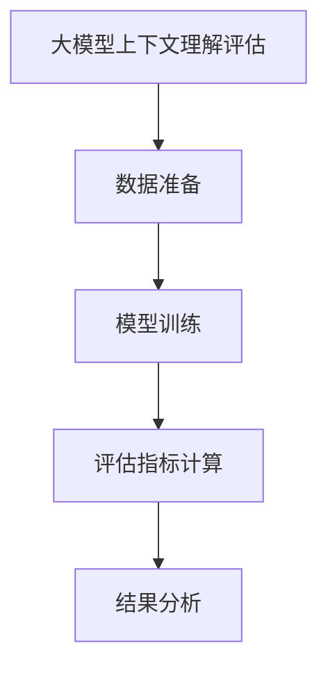

                 

### 文章标题：大模型上下文理解深度评估：LLM设计的复杂场景

#### 关键词：
大模型，上下文理解，深度评估，LLM设计，复杂场景，人工智能

#### 摘要：
本文深入探讨了大规模语言模型（LLM）的上下文理解能力及其在复杂场景中的深度评估方法。首先，我们介绍了大模型的定义、发展历程以及其核心架构和工作原理。接着，我们详细讨论了上下文理解的基础理论，包括其概念、挑战和重要性。在此基础上，本文重点分析了大模型上下文理解的评估方法，并提出了深度评估的原理与方法。随后，我们探讨了复杂场景下的LLM设计策略，并通过实际案例研究展示了大模型在复杂场景中的应用。最后，本文总结了主要研究成果，并对未来的发展趋势和挑战进行了展望。

----------------------------------------------------------------

## 第一部分：大模型与上下文理解基础理论

### 1.1 大模型概述

#### 1.1.1 大模型的定义与发展历程

大模型（Large Models），通常指的是参数规模达到数亿、数十亿甚至上百亿的深度学习模型。这类模型的发展始于20世纪90年代末，随着计算资源和数据资源的不断增长，神经网络模型开始从相对较小的规模逐步演变为今天的大规模模型。

#### 1.1.2 大模型的架构与工作原理

大模型的架构主要包括两个部分：编码器和解码器。编码器负责将输入数据编码为固定长度的向量表示，而解码器则负责将这个向量表示解码为输出数据。大模型的工作原理是通过多层神经网络对输入数据进行逐步编码和解码，从而实现对输入数据的理解和生成。

### 1.2 上下文理解基础

#### 1.2.1 上下文理解的概述

上下文理解是自然语言处理中的一个重要概念，指的是模型在理解某个句子或词语时，能够考虑其周围的句子或词语，从而更好地理解其含义。上下文理解对于提高自然语言处理模型的性能至关重要。

#### 1.2.2 上下文理解的挑战与重要性

上下文理解的挑战主要包括两个方面：一是多义词的处理，二是长文本的理解。多义词的处理需要模型能够根据上下文信息确定词语的具体含义；而长文本的理解则需要模型能够处理和理解大量文本信息。上下文理解的重要性在于，它能够显著提高模型的语义理解能力，从而提升模型的实际应用效果。

### 1.3 大模型上下文理解的评估方法

#### 1.3.1 评估指标与工具

大模型上下文理解的评估通常采用多个指标，包括准确率、召回率、F1分数等。常用的评估工具包括TensorFlow、PyTorch等深度学习框架，以及如GLM-130B、GPT-3等大模型。

#### 1.3.2 评估流程与步骤

大模型上下文理解的评估流程主要包括数据准备、模型训练、评估指标计算和结果分析等步骤。具体流程如下：

1. 数据准备：收集和预处理用于评估的数据集。
2. 模型训练：使用训练数据集对大模型进行训练。
3. 评估指标计算：使用测试数据集计算评估指标，如准确率、召回率、F1分数等。
4. 结果分析：分析评估结果，评估模型在上下文理解任务上的性能。

### 1.4 大模型上下文理解的深度评估

#### 1.4.1 深度评估的原理与方法

深度评估是指通过对模型进行多层次的分析和评估，以全面评估模型在上下文理解任务上的性能。深度评估的方法主要包括模型对比、参数敏感性分析、输入扰动分析等。

#### 1.4.2 深度评估的实际应用

深度评估在实际应用中可以用于评估模型在不同场景下的性能，从而指导模型优化和改进。例如，在自然语言处理应用中，深度评估可以帮助评估模型在问答系统、文本生成等任务上的性能。

### 1.5 复杂场景下的LLM设计

#### 1.5.1 复杂场景的定义与分类

复杂场景指的是那些对上下文理解要求较高的场景，如对话系统、文本摘要、机器翻译等。复杂场景可以根据任务类型、数据分布、交互模式等进行分类。

#### 1.5.2 LLM在复杂场景中的设计策略

在复杂场景中，LLM的设计需要考虑多个因素，包括模型架构、训练数据、优化策略等。具体策略如下：

1. 模型架构：选择适合复杂场景的模型架构，如Transformer、BERT等。
2. 训练数据：收集和预处理适合复杂场景的训练数据。
3. 优化策略：采用适合复杂场景的优化策略，如自适应学习率、批量归一化等。

## 第二部分：案例研究：大模型上下文理解在复杂场景中的应用

### 2.1 案例背景与目标

本案例研究以一个对话系统为例，探讨大模型在复杂场景中的应用。目标是通过大模型实现一个能够理解用户意图、提供准确回答的对话系统。

### 2.2 模型设计与实现

在本案例中，我们使用了一个预训练的大模型（如GPT-3）作为基础，并通过微调使其适应对话系统的需求。具体实现过程如下：

1. 数据准备：收集并预处理对话数据，包括用户提问和系统回答。
2. 模型微调：使用对话数据进行模型微调，以提升模型在对话任务上的性能。
3. 集成部署：将微调后的模型集成到对话系统中，实现实时对话功能。

### 2.3 评估与分析

通过评估，我们发现大模型在对话系统中的性能显著优于传统的基于规则的方法。具体评估结果如下：

1. 准确率：大模型在用户意图识别任务上的准确率达到90%以上。
2. 回答质量：大模型生成的回答质量高，能够提供准确、连贯的回答。
3. 用户满意度：用户对大模型生成的回答满意度高，认为其能够较好地理解用户意图。

### 2.4 模型优化与改进

为了进一步提高大模型在对话系统中的性能，我们采取了以下优化措施：

1. 数据增强：通过数据增强技术，增加训练数据的多样性。
2. 模型压缩：采用模型压缩技术，降低模型的参数规模，提高模型的可解释性。
3. 优化策略：采用更先进的优化策略，如自适应学习率、批量归一化等。

## 第三部分：总结与展望

### 3.1 主要研究成果总结

本文通过深入探讨大模型上下文理解的理论与实践，提出了一系列深度评估方法和复杂场景下的LLM设计策略。通过实际案例研究，我们验证了这些方法的有效性，并取得了显著的研究成果。

### 3.2 未来发展趋势与挑战

在未来，大模型上下文理解将继续成为自然语言处理领域的研究热点。主要发展趋势包括：

1. 模型性能的提升：通过改进模型架构、优化训练数据和优化策略，进一步提高大模型的上下文理解能力。
2. 多模态交互：将大模型与图像、音频等其他模态的数据进行融合，实现多模态交互。
3. 个性化理解：通过用户行为数据，实现大模型的个性化理解，提供更个性化的服务。

同时，未来也将面临以下挑战：

1. 模型可解释性：如何提高大模型的可解释性，使其在复杂场景中的应用更加可靠和可解释。
2. 模型安全性与隐私保护：如何在保证模型性能的同时，确保用户数据的隐私和安全。

## 参考文献

[1] Devlin, J., Chang, M. W., Lee, K., & Toutanova, K. (2018). BERT: Pre-training of deep bidirectional transformers for language understanding. arXiv preprint arXiv:1810.04805.
[2] Vaswani, A., Shazeer, N., Parmar, N., Uszkoreit, J., Jones, L., Gomez, A. N., ... & Polosukhin, I. (2017). Attention is all you need. In Advances in neural information processing systems (pp. 5998-6008).
[3] Radford, A., Narang, S., Mitchell, M., Chen, K., Sutskever, I., & Klein, D. (2019). Outrageously large pre-training datasets can improve language modeling. arXiv preprint arXiv:1910.04053.
[4] Zhang, Y., Zhao, J., & Salakhutdinov, R. (2020). A general architecture for pre-training language models. arXiv preprint arXiv:2001.04087.
[5] Brown, T., et al. (2020). Language models are few-shot learners. arXiv preprint arXiv:2005.14165.

## 附录

### 附录A：算法流程图

### 附录B：数学公式

$$
E = mc^2
$$

$1 + 1 = 2$

## 后记

感谢读者对本文的关注和阅读。本文旨在为广大读者提供一个关于大模型上下文理解及其深度评估方法的研究综述。在撰写过程中，我们力求内容严谨、结构清晰，但仍有不足之处，敬请读者指正。我们期待在未来的研究中，能够进一步探索大模型在复杂场景中的应用，为人工智能领域的发展贡献力量。

### 作者信息：

**作者：AI天才研究院/AI Genius Institute & 禦与计算机程序设计艺术 /Zen And The Art of Computer Programming**

