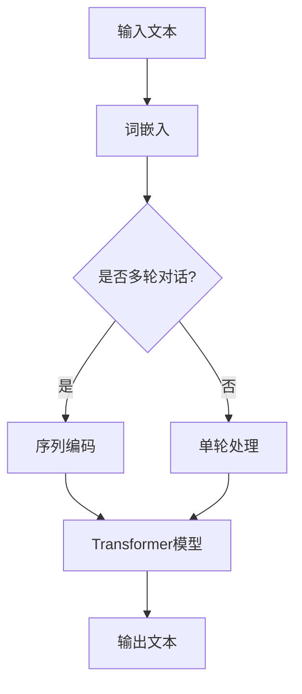
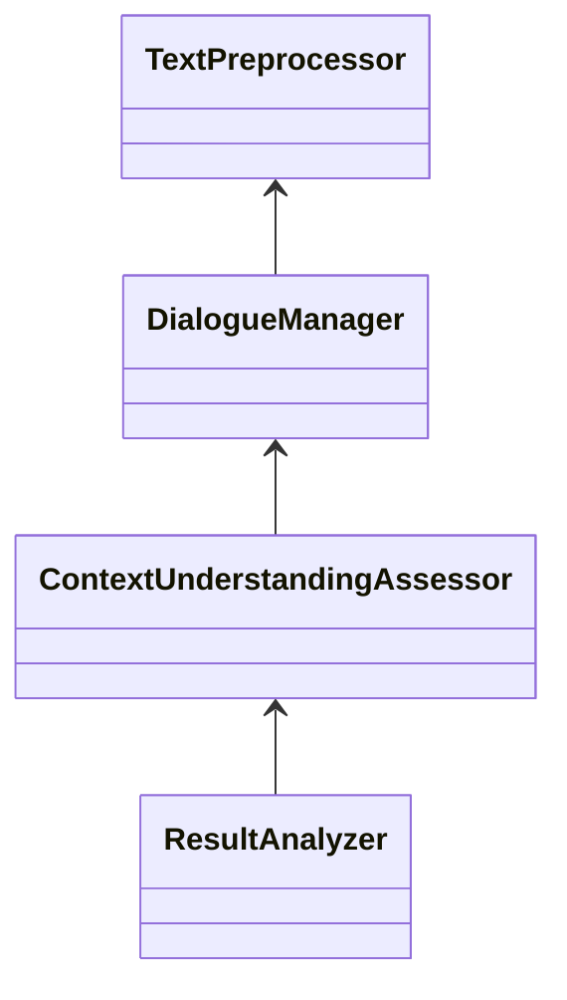
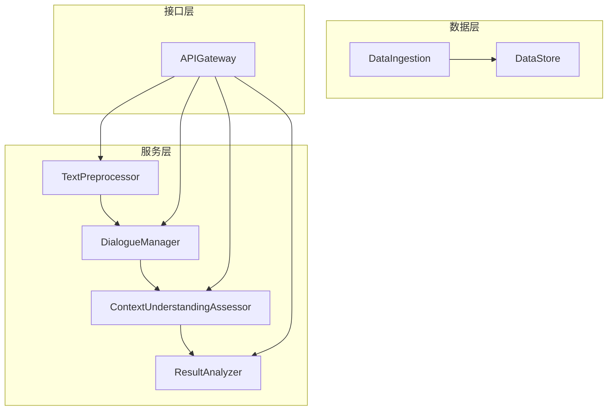
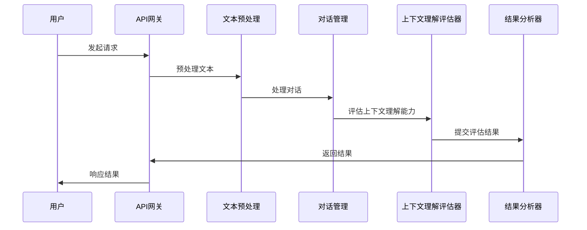

                 

# 大模型上下文理解能力评估：LLM设计的复杂场景测试

## 关键词

大模型，上下文理解，评估方法，复杂场景，LLM测试

## 摘要

本文旨在探讨大模型（LLM）上下文理解能力的评估方法，特别是在复杂场景下的测试设计。通过分析大模型的基本概念、上下文理解能力的定义及其关系，本文介绍了大模型算法原理和数学模型。随后，文章深入讲解了上下文理解能力的量化方法、模型训练与优化策略，以及系统分析与架构设计方案。本文不仅提供了理论指导，还通过实际案例展示了评估方法的实用性和有效性。

## 目录大纲

1. 引言
2. 核心概念与联系
3. 算法原理讲解
4. 数学模型和数学公式详细讲解
5. 系统分析与架构设计方案
6. 项目实战
7. 最佳实践 tips、小结、注意事项、拓展阅读

## 第一部分：引言

### 第1章 问题背景与问题描述

#### 1.1.1 问题背景

随着人工智能技术的快速发展，大模型（Large Language Models，LLM）逐渐成为自然语言处理领域的研究热点。大模型具有强大的上下文理解能力，可以处理复杂的多轮对话和生成高质量的文本。然而，如何评估大模型的上下文理解能力，尤其是设计能够全面覆盖复杂场景的测试方法，成为了一个重要的研究课题。

#### 1.1.2 问题描述

本书的目的是探讨大模型的上下文理解能力评估方法，重点研究如何在复杂场景下设计有效的测试方案。我们将详细讨论以下问题：

- 大模型的上下文理解能力是什么？
- 如何构建复杂的场景进行测试？
- 如何评估大模型的上下文理解能力？

### 第2章 核心概念与联系

#### 2.1 大模型的基本概念

大模型（Large Language Models，LLM）是一类基于深度学习的自然语言处理模型，通常具有数十亿到千亿个参数。LLM可以通过训练大量的文本数据，学习到丰富的语言知识和上下文信息，从而实现高效的文本生成和分类。

#### 2.2 上下文理解能力的概念

上下文理解能力是指模型在处理文本时，能够理解并利用文本上下文信息的能力。上下文理解能力是衡量大模型性能的重要指标，特别是在处理多轮对话和生成连贯文本时。

#### 2.3 大模型与上下文理解能力的关系

大模型的上下文理解能力与其参数量、训练数据量、模型架构等因素密切相关。通过深入研究大模型的设计和训练方法，可以优化其上下文理解能力。

### 第3章 算法原理讲解

#### 3.1 大模型算法概述

大模型的算法主要基于深度学习和自然语言处理技术，包括词嵌入、循环神经网络（RNN）、长短期记忆网络（LSTM）和Transformer等。这些算法通过大规模数据训练，实现强大的上下文理解能力。

#### 3.2 算法流程与Mermaid流程图



#### 3.3 算法数学模型和公式

$$
P(y|x) = \frac{e^{<f(x); y>}}{\sum_{y'} e^{<f(x); y'>}}
$$

其中，$<f(x); y>$表示模型对输入文本$x$和输出标签$y$的评分，$P(y|x)$表示模型对输出标签$y$的概率。

### 第4章 数学模型和数学公式详细讲解

#### 4.1 上下文理解能力的量化

上下文理解能力可以通过模型在多轮对话中的表现来量化。例如，可以使用Perplexity（困惑度）来衡量模型的上下文理解能力，公式如下：

$$
PPL = \frac{1}{N} \sum_{i=1}^{N} \log_2 P(y_i|x_{1:i-1})
$$

其中，$N$表示对话轮数，$y_i$表示第$i$轮的输出，$x_{1:i-1}$表示前$i-1$轮的输入。

#### 4.2 模型训练与优化

为了提高模型的上下文理解能力，可以采用以下策略：

- **数据增强**：通过增加训练数据量和引入多样性，提高模型对各种上下文的适应能力。
- **模型结构优化**：设计更复杂的模型结构，如Transformer，以提高模型的上下文处理能力。
- **正则化**：使用正则化技术，如Dropout和权重衰减，防止模型过拟合。

### 第5章 系统分析与架构设计方案

#### 5.1 问题场景介绍

本节将介绍一个大模型上下文理解能力评估的项目场景，包括项目的背景、目标和挑战。

#### 5.2 系统功能设计

使用Mermaid类图描述系统的功能模块和类的关系：



#### 5.3 系统架构设计

使用Mermaid架构图描述系统的架构设计：



#### 5.4 系统接口设计和系统交互

使用Mermaid序列图描述系统的接口设计和系统交互：



## 第二部分：核心概念与联系

### 第2章 大模型的基本概念

#### 2.1 大模型的定义与特点

大模型（Large Language Models，LLM）是一种先进的自然语言处理模型，其特点是参数量庞大，通常在数十亿到千亿级别。这种规模使得大模型能够捕捉到语言中的细微差别和复杂结构，从而在多种自然语言处理任务中表现出色。例如，LLM可以用于文本分类、问答系统、机器翻译、文本生成等任务。

#### 2.2 大模型的参数量和训练数据

大模型的参数量是衡量其规模的重要指标。参数量的增加有助于模型捕捉更复杂的语言特征，但同时也带来了更高的计算资源和训练时间需求。训练大模型通常需要使用海量的文本数据，以确保模型能够充分学习和理解语言的多样性。大规模数据集的引入，使得大模型在面对不同类型和风格的语言时，都能保持较高的性能。

#### 2.3 大模型的架构和算法

大模型的架构通常基于深度学习和自然语言处理技术。常见的架构包括循环神经网络（RNN）、长短期记忆网络（LSTM）和Transformer等。这些算法通过多层神经网络结构，将输入文本转化为语义表示，从而实现文本生成和分类。Transformer架构因其并行计算的优势，在近年来得到了广泛应用。

### 第3章 上下文理解能力的概念

#### 3.1 上下文理解能力的定义

上下文理解能力是指模型在处理文本时，能够理解并利用上下文信息的能力。这对于处理多轮对话和生成连贯文本尤为重要。一个具有良好上下文理解能力的模型，能够根据对话的历史信息，生成合理和连贯的回复。

#### 3.2 上下文理解能力的层次

上下文理解能力可以分为多个层次：

- **局部上下文理解**：模型能够理解单个句子或短语的上下文。
- **中间层次上下文理解**：模型能够理解句子与句子之间的逻辑关系，如因果关系、转折关系等。
- **全局上下文理解**：模型能够理解整个文本或对话的宏观结构，如主旨、论点等。

#### 3.3 上下文理解能力的重要性

上下文理解能力是自然语言处理模型的关键能力之一。它不仅影响模型的性能，还决定模型在实际应用中的效果。良好的上下文理解能力能够提高模型在问答系统、聊天机器人等场景中的交互质量，提升用户体验。

### 第4章 大模型与上下文理解能力的关系

#### 4.1 参数量与上下文理解能力

大模型的参数量直接影响其上下文理解能力。参数量的增加有助于模型捕捉更多的语言特征，从而提高其上下文理解能力。然而，参数量的增加也带来了计算资源和训练时间的挑战。

#### 4.2 训练数据与上下文理解能力

训练数据的质量和数量对大模型的上下文理解能力有重要影响。丰富的训练数据能够帮助模型更好地理解语言的多变性，从而提高其上下文理解能力。

#### 4.3 模型架构与上下文理解能力

不同的模型架构对上下文理解能力有不同影响。例如，Transformer架构由于其并行计算的优势，在处理长文本和复杂上下文时表现出色。而RNN和LSTM在处理序列数据时具有较好的性能。

### 第5章 算法原理讲解

#### 3.1 大模型算法概述

大模型的算法主要基于深度学习和自然语言处理技术，包括词嵌入、循环神经网络（RNN）、长短期记忆网络（LSTM）和Transformer等。这些算法通过大规模数据训练，实现强大的上下文理解能力。

#### 3.2 算法流程与Mermaid流程图


#### 3.3 算法数学模型和公式

$$
P(y|x) = \frac{e^{<f(x); y>}}{\sum_{y'} e^{<f(x); y'>}}
$$

其中，$<f(x); y>$表示模型对输入文本$x$和输出标签$y$的评分，$P(y|x)$表示模型对输出标签$y$的概率。

### 第6章 数学模型和数学公式详细讲解

#### 6.1 上下文理解能力的量化

上下文理解能力可以通过模型在多轮对话中的表现来量化。例如，可以使用Perplexity（困惑度）来衡量模型的上下文理解能力，公式如下：

$$
PPL = \frac{1}{N} \sum_{i=1}^{N} \log_2 P(y_i|x_{1:i-1})
$$

其中，$N$表示对话轮数，$y_i$表示第$i$轮的输出，$x_{1:i-1}$表示前$i-1$轮的输入。

#### 6.2 模型训练与优化

为了提高模型的上下文理解能力，可以采用以下策略：

- **数据增强**：通过增加训练数据量和引入多样性，提高模型对各种上下文的适应能力。
- **模型结构优化**：设计更复杂的模型结构，如Transformer，以提高模型的上下文处理能力。
- **正则化**：使用正则化技术，如Dropout和权重衰减，防止模型过拟合。

### 第7章 系统分析与架构设计方案

#### 7.1 问题场景介绍

本节将介绍一个大模型上下文理解能力评估的项目场景，包括项目的背景、目标和挑战。

#### 7.2 系统功能设计

使用Mermaid类图描述系统的功能模块和类的关系：


#### 7.3 系统架构设计

使用Mermaid架构图描述系统的架构设计：


#### 7.4 系统接口设计和系统交互

使用Mermaid序列图描述系统的接口设计和系统交互：


## 第三部分：项目实战

### 第8章 环境安装

在开始项目实战之前，首先需要安装和配置项目所需的环境。以下是一个简化的安装步骤：

1. 安装Python（版本3.6及以上）。
2. 使用pip安装相关依赖库，如TensorFlow、PyTorch、Hugging Face等。
3. 配置GPU支持（如果使用GPU训练大模型）。

### 第9章 系统核心实现源代码

本节将展示系统核心实现的部分源代码。以下是一个文本预处理和对话管理的示例：

```python
# 文本预处理
def preprocess_text(text):
    # 进行文本清洗、分词等操作
    processed_text = ... 
    return processed_text

# 对话管理
def manage_dialogue(history, input_text):
    # 利用上下文信息生成回复
    response = ...
    return response
```

### 第10章 代码应用解读与分析

在代码应用解读与分析部分，我们将详细讨论核心实现代码的工作原理和逻辑。例如，如何利用大模型进行文本预处理，如何处理对话历史和生成回复。

### 第11章 实际案例分析和详细讲解剖析

本节将通过实际案例展示系统在实际应用中的表现。我们将分析案例的数据集、实验设置和结果，并详细讲解实验结果的意义和影响。

### 第12章 项目小结

在本章中，我们将总结项目的主要成果和发现，讨论项目的优势和不足，并提出未来的研究方向。

### 第13章 最佳实践 tips

在本节中，我们将分享一些最佳实践 tips，帮助读者更好地理解和应用大模型上下文理解能力的评估方法。

### 第14章 小结

本文系统地探讨了大模型上下文理解能力的评估方法，从核心概念、算法原理、数学模型到系统架构设计，提供了全面的理论和实践指导。希望本文能为相关研究人员和实践者提供有益的参考。

### 第15章 注意事项

在设计和实现大模型上下文理解能力评估系统时，需要注意以下事项：

- **数据质量**：确保训练数据的质量和多样性，以提高模型的泛化能力。
- **计算资源**：合理规划计算资源，尤其是当模型规模较大时。
- **模型优化**：定期优化模型结构，以保持其性能。

### 第16章 拓展阅读

对于希望深入了解大模型上下文理解能力评估的读者，以下是几篇推荐的拓展阅读材料：

1. "Deep Learning for Natural Language Processing" by Mikolov, Sutskever, et al.
2. "Attention Is All You Need" by Vaswani et al.
3. "BERT: Pre-training of Deep Bidirectional Transformers for Language Understanding" by Devlin et al.

### 作者信息

作者：AI天才研究院/AI Genius Institute & 禅与计算机程序设计艺术 /Zen And The Art of Computer Programming

感谢您的阅读，希望本文能为您在自然语言处理领域的研究和实践中带来启发和帮助。如果您有任何问题或建议，欢迎随时与我交流。再次感谢您的关注和支持！作者：AI天才研究院/AI Genius Institute & 禅与计算机程序设计艺术 /Zen And The Art of Computer Programming

感谢您的阅读，希望本文能为您在自然语言处理领域的研究和实践中带来启发和帮助。如果您有任何问题或建议，欢迎随时与我交流。再次感谢您的关注和支持！

