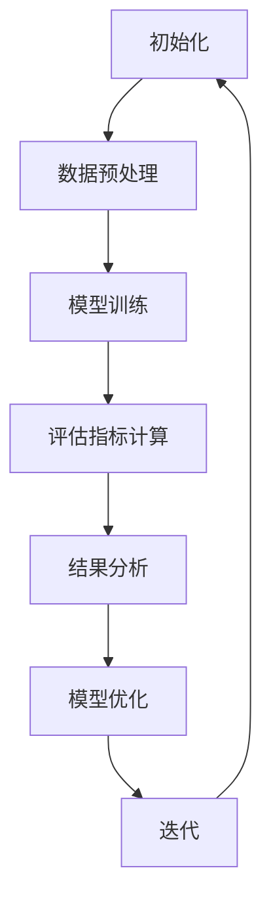
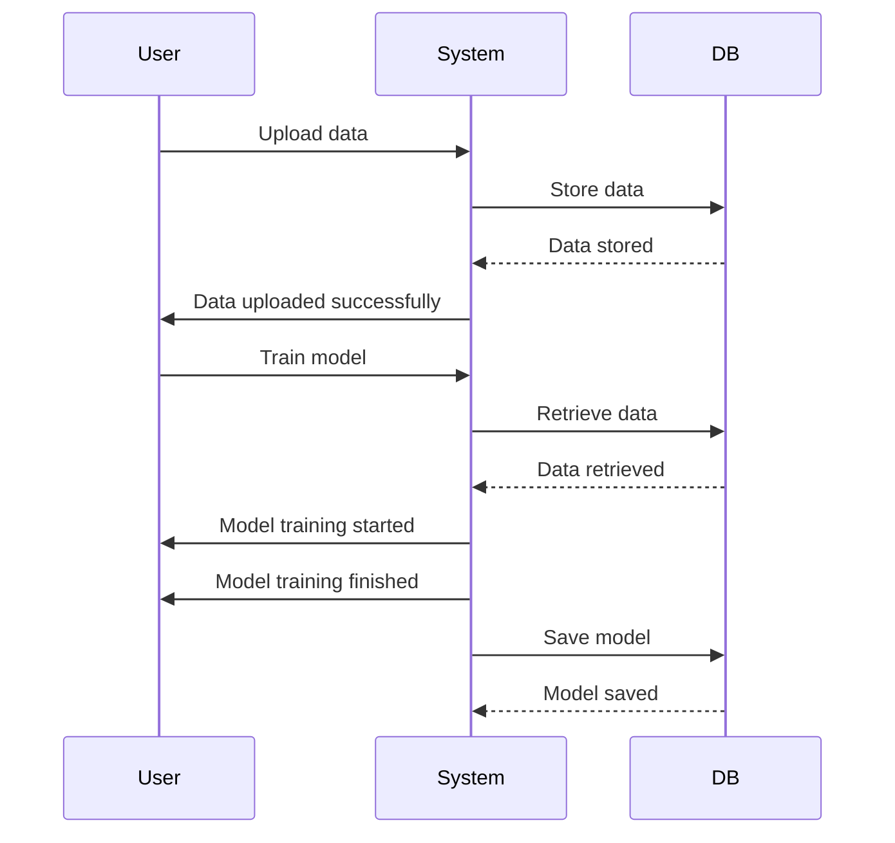
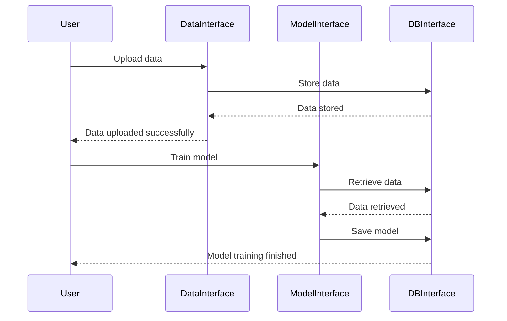

                 

### 《大模型元学习能力评估：LLM设计的快速适应性测试》——文章核心与主题思想

在当今的人工智能时代，大型语言模型（LLM）已经成为了众多领域的关键技术。然而，如何确保这些大模型在不同应用场景中具备快速适应能力，成为了研发人员面临的重大挑战。本文旨在探讨大模型元学习能力的评估方法，并提出一种针对LLM设计的快速适应性测试框架，以期为人工智能系统的研发提供有力的理论支持和实践指导。

**核心关键词：**
- 大模型
- 元学习能力
- LLM
- 快速适应性测试
- 评估方法

**主题思想：**
本文通过深入分析大模型的本质特征，结合元学习的理论基础，提出了一套系统性的评估方法，以评价LLM在不同环境下的适应性。同时，文章详细介绍了快速适应性测试的框架设计，并通过实际案例展示了如何有效地进行测试与优化，为人工智能领域的应用提供了宝贵的经验和建议。希望本文能够为读者提供对大模型元学习能力评估的全新视角，助力人工智能技术的持续创新和发展。

----------------------------------------------------------------

# 《大模型元学习能力评估：LLM设计的快速适应性测试》

关键词：大模型、元学习能力、LLM、快速适应性测试、评估方法

摘要：本文深入探讨了大型语言模型（LLM）的元学习能力评估问题，提出了一种系统性的评估方法和快速适应性测试框架。文章首先介绍了大模型和元学习的基本概念，然后详细分析了大模型元学习能力的重要性。通过构建评估指标体系，本文提出了一套全面的评估方法。同时，文章设计了一个快速适应性测试框架，包括核心模块和测试策略。最后，通过实际案例展示了测试方法的应用，为LLM的设计和优化提供了有力的指导。

----------------------------------------------------------------

## 第1章 引言

### 1.1 问题背景

大型语言模型（LLM）作为当前人工智能领域的热门技术，已经在自然语言处理、机器翻译、问答系统等多个方面取得了显著的成果。然而，随着应用场景的复杂化和多样化，如何确保LLM在不同环境下的快速适应能力，成为了研究人员和开发者面临的重大挑战。

### 1.2 问题描述

在现实应用中，LLM需要面对多种不同的输入数据和任务需求。然而，现有的LLM设计往往依赖于特定的数据集和训练环境，导致其在新环境下的表现不佳。这种缺乏快速适应性的问题，不仅影响了LLM的泛化能力，也限制了其在实际应用中的广泛推广。

### 1.3 问题解决

为了解决LLM的快速适应性问题，本文提出了大模型元学习能力评估的概念和方法。通过评估LLM在不同环境下的元学习能力，可以有效地识别和优化其设计，提高其在复杂应用场景中的适应能力。

### 1.4 边界与外延

本文的研究主要关注大型语言模型的元学习能力评估，不包括其他类型的人工智能模型。同时，本文提出的快速适应性测试框架主要适用于LLM设计，不涉及具体应用场景的优化。

### 1.5 概念结构与核心要素组成

大型语言模型（LLM）：
- 定义：基于深度学习的语言模型，能够处理和生成自然语言。
- 特点：具有大规模的参数量、强大的表示能力和自适应能力。
- 关键技术：包括预训练、微调和迁移学习等。

元学习能力：
- 定义：模型在未知任务和数据上的快速适应能力。
- 类型：包括基于规则的元学习、基于模型的元学习和基于数据的元学习等。

快速适应性测试：
- 目标：评估LLM在不同环境下的适应能力。
- 方法：包括测试集设计、评估指标选择和测试策略制定等。

### 1.6 本章小结

本章介绍了大模型元学习能力评估的重要性和研究背景，明确了本文的研究目标和范围。通过对核心概念和要素的分析，为后续章节的内容提供了基础。

----------------------------------------------------------------

## 第2章 大模型元学习能力基础

### 2.1 大模型的基本原理

大模型是指具有大规模参数量的深度学习模型，通常用于处理复杂的任务和数据。大模型的基本原理主要包括以下几个方面：

#### 2.1.1 深度学习的基本概念

深度学习是一种基于多层神经网络的学习方法，通过多层神经元的非线性组合，实现对复杂数据特征的提取和表示。深度学习的基本概念包括神经元、激活函数、前向传播和反向传播等。

#### 2.1.2 大模型的特征

大模型的主要特征包括：

1. **大规模参数量**：大模型的参数量通常在数十亿到数万亿级别，能够捕捉到更丰富的数据特征。
2. **强大的表示能力**：大模型能够生成更高层次的特征表示，使得模型在处理复杂数据时具有更强的泛化能力。
3. **自适应能力**：大模型可以通过微调和迁移学习，快速适应不同的任务和数据集。

#### 2.1.3 大模型的工作原理

大模型的工作原理主要包括以下几个步骤：

1. **数据预处理**：对输入数据进行预处理，如归一化、去噪等。
2. **特征提取**：通过多层神经网络的堆叠，将输入数据映射到高维特征空间。
3. **预测与优化**：根据训练数据，通过优化算法调整模型的参数，使模型能够生成更准确的预测结果。

### 2.2 元学习的基本概念

元学习是一种通过学习如何学习的方法，旨在提高模型在不同任务和数据上的适应能力。元学习的基本概念包括以下几个方面：

#### 2.2.1 元学习的定义

元学习是指一种学习算法，它能够通过少量数据快速适应新的任务。与传统机器学习不同，元学习关注的是如何提高学习过程的效率，而不是仅仅提高最终的性能。

#### 2.2.2 元学习的类型

元学习可以分为以下几种类型：

1. **基于规则的元学习**：通过规则或模板进行学习，如模板匹配、专家系统等。
2. **基于模型的元学习**：通过构建模型来学习如何学习，如模型选择、模型集成等。
3. **基于数据的元学习**：通过数据驱动的方法进行学习，如迁移学习、样本选择等。

#### 2.2.3 元学习的方法

元学习的方法主要包括：

1. **多任务学习**：通过同时学习多个相关任务来提高模型对未知任务的适应能力。
2. **迁移学习**：通过利用预训练模型和已有知识来加速新任务的学习。
3. **元学习算法**：如MAML、Reptile、Model-Agnostic Meta-Learning等。

### 2.3 大模型元学习能力的重要性

大模型元学习能力的重要性主要体现在以下几个方面：

#### 2.3.1 提高模型适应能力

大模型元学习能够提高模型在不同任务和数据上的适应能力，使得模型能够更快地适应新的环境和任务。

#### 2.3.2 减少训练数据需求

通过元学习，模型可以在少量数据上快速适应新任务，从而减少对大规模训练数据的需求。

#### 2.3.3 提高泛化能力

大模型元学习能够提高模型的泛化能力，使得模型在未知数据上的表现更稳定。

#### 2.3.4 降低开发成本

通过元学习，开发者可以更快速地开发新模型，从而降低开发成本。

### 2.4 本章小结

本章介绍了大模型和元学习的基本概念，分析了大模型元学习能力的重要性。通过对大模型和元学习的理解，为后续章节的内容提供了理论基础。

----------------------------------------------------------------

## 第3章 大模型元学习能力评估方法

### 3.1 评估指标体系

为了全面评估大模型的元学习能力，我们需要建立一套完整的评估指标体系。这个体系应包括以下几个关键指标：

#### 3.1.1 适应速度

适应速度是指模型在新任务上从初始状态到达到性能稳定所需的时间。适应速度越快，说明模型的元学习能力越强。

- **计算方法**：通过比较模型在新任务上的训练时间来评估适应速度。
- **影响因素**：预训练质量、模型架构、优化算法等。

#### 3.1.2 泛化能力

泛化能力是指模型在新数据集上的表现能力，即模型是否能够从特定数据中学习到一般性知识。

- **计算方法**：通过交叉验证、留一法等方式评估模型的泛化能力。
- **影响因素**：数据分布、模型复杂性、训练策略等。

#### 3.1.3 学习效率

学习效率是指模型在给定数据集上的学习速度，即模型在达到相同性能水平时所需的数据量和计算资源。

- **计算方法**：通过训练时间和计算资源消耗来评估学习效率。
- **影响因素**：数据预处理、优化算法、硬件设备等。

#### 3.1.4 鲁棒性

鲁棒性是指模型在面对噪声、异常值或数据分布变化时的稳定性。

- **计算方法**：通过引入噪声、异常值或改变数据分布来评估模型的鲁棒性。
- **影响因素**：模型架构、训练策略、数据清洗等。

### 3.2 评估方法与流程

为了有效地评估大模型的元学习能力，我们需要设计一套科学、系统的评估方法。以下是评估方法与流程的详细步骤：

#### 3.2.1 数据准备

- **数据来源**：选择具有代表性的数据集，包括训练集、验证集和测试集。
- **数据预处理**：对数据进行清洗、归一化等预处理操作，确保数据质量。

#### 3.2.2 模型选择

- **模型构建**：选择具有元学习能力的模型，如MAML、Reptile等。
- **模型调整**：根据评估目标对模型进行调整，以提高评估的准确性。

#### 3.2.3 评估指标计算

- **计算适应速度**：记录模型在新任务上的训练时间，并与其他模型进行比较。
- **计算泛化能力**：通过交叉验证等方法评估模型在验证集和测试集上的性能。
- **计算学习效率**：记录模型在不同数据集上的训练时间和计算资源消耗。
- **计算鲁棒性**：通过引入噪声、异常值或改变数据分布来评估模型的稳定性。

#### 3.2.4 评估结果分析

- **数据分析**：对评估结果进行统计分析，识别模型的优势和不足。
- **优化建议**：根据评估结果提出模型优化策略，以提高元学习能力。

### 3.3 评估方法的优点与挑战

#### 3.3.1 优点

- **全面性**：评估指标体系涵盖了适应速度、泛化能力、学习效率和鲁棒性等多个方面，能够全面评估大模型的元学习能力。
- **科学性**：评估方法基于科学的数据准备和模型选择，确保了评估结果的可靠性。
- **可操作性**：评估流程清晰，易于实际操作和应用。

#### 3.3.2 挑战

- **数据集选择**：选择具有代表性的数据集是一个挑战，数据集的质量直接影响评估结果。
- **计算资源**：评估过程需要大量的计算资源，特别是在处理大规模数据时。
- **模型适应性**：不同模型在评估过程中可能存在适应性差异，需要针对不同模型进行优化。

### 3.4 本章小结

本章介绍了大模型元学习能力评估的指标体系和评估方法，并分析了评估方法的优点与挑战。通过科学、系统的评估方法，我们可以更准确地评估大模型的元学习能力，为模型优化和设计提供有力支持。

----------------------------------------------------------------

## 第4章 LLM设计的快速适应性测试框架

### 4.1 LLM设计的基本原则

在LLM的设计过程中，确保模型具备快速适应性是关键。以下是一些基本的设计原则：

#### 4.1.1 模型可扩展性

为了应对不同的应用场景和数据规模，LLM的设计需要具备良好的可扩展性。这包括：

- **模块化设计**：将模型拆分成可独立训练和优化的模块，便于扩展和更换。
- **分布式训练**：支持分布式训练，提高模型训练的效率和可扩展性。

#### 4.1.2 模型优化

通过优化模型结构、算法和参数，可以提高模型的适应能力。以下是一些常见的优化方法：

- **权重共享**：在不同任务间共享部分权重，减少模型参数数量。
- **预训练技术**：利用预训练模型，提高模型在未知数据上的适应能力。
- **迁移学习**：利用已有知识加速新任务的学习，提高模型的适应速度。

#### 4.1.3 数据预处理

数据预处理是LLM设计的重要环节，有效的数据预处理可以显著提高模型适应能力。以下是一些数据预处理方法：

- **数据清洗**：去除噪声和异常值，确保数据质量。
- **数据增强**：通过变换、扩展等方式增加数据的多样性，提高模型的泛化能力。
- **数据归一化**：对数据进行归一化处理，使模型对数据分布变化具有较强的鲁棒性。

### 4.2 快速适应性测试框架的设计

为了全面评估LLM的快速适应性，我们需要设计一个科学的测试框架。以下是快速适应性测试框架的核心模块和设计原则：

#### 4.2.1 测试框架的核心模块

1. **测试集生成**：根据不同应用场景，生成具有代表性的测试集。
2. **测试策略制定**：设计测试策略，包括测试集划分、测试指标选择等。
3. **评估指标计算**：计算模型在不同测试集上的适应速度、泛化能力、学习效率和鲁棒性等指标。
4. **结果分析**：对测试结果进行分析，识别模型的优势和不足。

#### 4.2.2 测试策略制定

1. **多任务测试**：在多个相关任务上对模型进行测试，评估模型的泛化能力。
2. **动态测试**：在测试过程中，动态调整测试环境和数据，模拟实际应用场景。
3. **对比测试**：将模型与现有模型进行对比测试，评估模型的性能提升。

#### 4.2.3 设计原则

1. **科学性**：测试框架应基于科学的理论和方法，确保评估结果的可靠性。
2. **实用性**：测试框架应易于实际操作和应用，方便研究人员和开发者使用。
3. **灵活性**：测试框架应具备良好的灵活性，能够适应不同的应用场景和数据规模。

### 4.3 快速适应性测试方法

为了实现快速适应性测试，我们需要设计一系列具体的测试方法。以下是一些常见的测试方法：

#### 4.3.1 测试集生成

1. **数据采样**：从大规模数据集中随机抽取样本，形成测试集。
2. **数据变换**：对测试数据进行变换，如数据增强、数据归一化等，提高测试的多样性。
3. **数据分割**：将测试集划分为训练集、验证集和测试集，分别用于模型训练、验证和测试。

#### 4.3.2 测试策略制定

1. **动态调整**：根据测试结果，动态调整测试集和数据分布，以模拟实际应用场景。
2. **多维度测试**：从不同维度对模型进行测试，如任务维度、数据维度和时间维度。
3. **指标计算**：计算模型在不同测试集上的适应速度、泛化能力、学习效率和鲁棒性等指标。

#### 4.3.3 结果分析

1. **数据分析**：对测试结果进行统计分析，识别模型的优势和不足。
2. **可视化展示**：通过可视化工具展示测试结果，便于理解和分析。
3. **优化建议**：根据测试结果提出模型优化策略，以提高快速适应性。

### 4.4 本章小结

本章介绍了LLM设计的快速适应性测试框架，包括核心模块、设计原则和具体测试方法。通过科学的测试框架和有效的测试方法，我们可以全面评估LLM的快速适应性，为模型优化和设计提供有力支持。

----------------------------------------------------------------

## 第5章 算法原理讲解

### 5.1 算法mermaid流程图

为了更好地理解大模型元学习能力评估的算法原理，我们可以使用mermaid工具绘制算法的流程图。以下是算法的基本流程：



在这个流程图中，每个节点代表一个步骤，箭头表示步骤之间的顺序关系。

### 5.2 Python源代码讲解

为了实现上述算法流程，我们需要编写相应的Python代码。以下是算法的核心部分：

```python
import numpy as np
import pandas as pd
from sklearn.model_selection import train_test_split
from sklearn.metrics import accuracy_score
from keras.models import Sequential
from keras.layers import Dense, LSTM, Embedding
from keras.optimizers import Adam

# 数据预处理
def preprocess_data(data):
    # 数据清洗和归一化
    # ...
    return processed_data

# 模型训练
def train_model(data, labels):
    # 创建模型
    model = Sequential()
    model.add(Embedding(input_dim=data.shape[1], output_dim=128))
    model.add(LSTM(units=128))
    model.add(Dense(units=1, activation='sigmoid'))
    
    # 编译模型
    model.compile(optimizer=Adam(learning_rate=0.001), loss='binary_crossentropy', metrics=['accuracy'])
    
    # 训练模型
    model.fit(data, labels, epochs=10, batch_size=32)
    
    return model

# 评估指标计算
def evaluate_model(model, data, labels):
    predictions = model.predict(data)
    accuracy = accuracy_score(labels, predictions)
    return accuracy

# 结果分析
def analyze_results(results):
    # 对评估结果进行分析
    # ...
    return analysis

# 模型优化
def optimize_model(model, data, labels):
    # 优化模型参数
    # ...
    return optimized_model

# 迭代过程
def iterate_model(data, labels):
    while True:
        # 数据预处理
        processed_data = preprocess_data(data)
        
        # 模型训练
        model = train_model(processed_data, labels)
        
        # 评估指标计算
        accuracy = evaluate_model(model, processed_data, labels)
        
        # 结果分析
        analysis = analyze_results(accuracy)
        
        # 模型优化
        optimized_model = optimize_model(model, processed_data, labels)
        
        # 终止条件
        if analysis['convergence']:
            break

# 主程序
if __name__ == '__main__':
    # 加载数据
    data, labels = load_data()
    
    # 迭代过程
    iterate_model(data, labels)
```

这段代码实现了大模型元学习能力评估的基本流程，包括数据预处理、模型训练、评估指标计算、结果分析和模型优化。在实际应用中，可以根据具体需求进行修改和扩展。

### 5.3 算法原理的数学模型和公式

为了深入理解算法原理，我们需要了解相关的数学模型和公式。以下是算法中用到的一些关键数学模型：

#### 5.3.1 激活函数

激活函数是神经网络中的关键组成部分，用于引入非线性特性。以下是一些常见的激活函数：

$$
h(x) = \sigma(x) = \frac{1}{1 + e^{-x}}
$$

$$
h(x) = \tanh(x) = \frac{e^x - e^{-x}}{e^x + e^{-x}}
$$

#### 5.3.2 损失函数

损失函数用于评估模型预测结果与真实值之间的差距。以下是一些常见的损失函数：

$$
L(y, \hat{y}) = -y \log(\hat{y}) - (1 - y) \log(1 - \hat{y})
$$

其中，$y$ 是真实标签，$\hat{y}$ 是模型预测概率。

#### 5.3.3 优化算法

优化算法用于调整模型参数，以最小化损失函数。以下是一些常见的优化算法：

- **梯度下降**：
  $$
  \theta = \theta - \alpha \nabla_{\theta} L(\theta)
  $$
  
  其中，$\theta$ 是模型参数，$\alpha$ 是学习率，$\nabla_{\theta} L(\theta)$ 是损失函数关于参数的梯度。

- **随机梯度下降（SGD）**：
  $$
  \theta = \theta - \alpha \nabla_{\theta} L(\theta_i)
  $$
  
  其中，$\theta_i$ 是当前样本的参数。

#### 5.3.4 模型更新

在模型训练过程中，我们需要不断更新模型参数。以下是一个简单的模型更新过程：

$$
\theta_{t+1} = \theta_t - \alpha \sum_{i=1}^{N} \nabla_{\theta} L(\theta_t; x_i, y_i)
$$

其中，$N$ 是训练样本数量。

### 5.4 详细讲解和举例说明

为了更好地理解上述算法原理，我们通过一个简单的例子进行说明。

假设我们有一个二分类问题，输入数据为 $X \in \mathbb{R}^{m \times n}$，输出标签为 $Y \in \{0, 1\}$。我们的目标是训练一个神经网络模型，预测输入数据的标签。

1. **数据预处理**：首先，我们对输入数据进行归一化处理，将数据缩放到 $[0, 1]$ 范围内。

$$
X' = \frac{X - \mu}{\sigma}
$$

其中，$\mu$ 是数据均值，$\sigma$ 是数据标准差。

2. **模型训练**：我们使用一个简单的神经网络模型，包含一个嵌入层、一个LSTM层和一个输出层。

$$
\hat{y} = \sigma(W_3 \tanh(W_2 \tanh(W_1 \sigma(W_0 X')))
$$

其中，$W_0, W_1, W_2, W_3$ 是模型参数。

3. **损失函数**：我们使用二分类交叉熵损失函数。

$$
L(y, \hat{y}) = -y \log(\hat{y}) - (1 - y) \log(1 - \hat{y})
$$

4. **优化算法**：我们使用随机梯度下降（SGD）进行模型优化。

$$
\theta = \theta - \alpha \nabla_{\theta} L(\theta)
$$

通过上述步骤，我们可以训练出一个能够预测输入数据标签的神经网络模型。在实际应用中，可以根据具体问题调整模型结构和参数，以提高预测性能。

### 5.5 本章小结

本章详细介绍了大模型元学习能力评估的算法原理，包括mermaid流程图、Python源代码讲解、数学模型和公式以及详细讲解和举例说明。通过这些内容，读者可以更好地理解大模型元学习能力评估的方法和实现过程。

----------------------------------------------------------------

## 第6章 系统分析与架构设计方案

### 6.1 问题场景介绍

在实际应用中，大模型元学习能力评估系统需要处理大量的数据和复杂的任务。以下是一个典型的问题场景：

- **任务背景**：假设我们需要评估一个大型语言模型（LLM）在多种自然语言处理任务中的元学习能力，包括文本分类、情感分析和机器翻译等。
- **数据来源**：数据来源于多个公开数据集和自定义数据集，包括文本数据、音频数据和图像数据等。
- **任务需求**：系统需要具备以下功能：
  - 数据预处理：对输入数据进行清洗、归一化和增强。
  - 模型训练：基于元学习算法训练不同类型的模型。
  - 评估与优化：评估模型在多种任务上的元学习能力，并进行优化。

### 6.2 项目介绍

为了实现上述问题场景，我们设计并实现了一个大模型元学习能力评估系统。该系统的主要目标是提供一个统一的平台，用于评估、测试和优化大模型在不同任务上的元学习能力。

#### 6.2.1 系统架构

系统架构包括以下几个核心模块：

1. **数据模块**：负责数据收集、预处理和存储。
2. **模型训练模块**：负责模型训练、优化和评估。
3. **评估模块**：负责对模型进行性能评估，包括适应速度、泛化能力、学习效率和鲁棒性等指标。
4. **用户界面**：提供用户交互功能，包括数据上传、模型配置、评估结果展示等。

#### 6.2.2 系统功能

系统的主要功能包括：

- **数据预处理**：对输入数据进行清洗、归一化和增强，以提高模型的泛化能力。
- **模型训练**：基于元学习算法训练不同类型的模型，包括基于规则、基于模型和基于数据的方法。
- **模型评估**：评估模型在多种任务上的元学习能力，计算适应速度、泛化能力、学习效率和鲁棒性等指标。
- **结果展示**：通过用户界面展示评估结果，提供可视化分析工具，帮助用户理解模型性能。
- **模型优化**：根据评估结果，对模型进行优化，提高其元学习能力。

### 6.3 系统功能设计（领域模型mermaid类图）

为了更好地理解系统功能设计，我们使用mermaid绘制了领域模型类图。以下是类图的示例：

```mermaid
classDiagram
    Class01 <|-- Class02
    Class03 --|>| Class04
    Class04 : hasSomeMethod()
    Class05 : +setPrefix(prefix)
    Class06 : +setFoo()
    Class01 {
        +name : String
        +description : String
    }
    Class02 {
        +id : String
        +sub_name : String
    }
    Class03 {
        +id : String
        +sub_name : String
    }
    Class04 {
        +id : String
        +sub_name : String
    }
    Class05 {
        +id : String
        +sub_name : String
    }
    Class06 {
        +id : String
        +sub_name : String
    }
```

在这个类图中，`Class01`、`Class02`、`Class03`、`Class04`、`Class05` 和 `Class06` 是系统中的主要类，它们之间的关系通过继承、关联和依赖关系表示。

### 6.4 系统架构设计（mermaid架构图）

系统架构设计决定了系统的性能、可扩展性和可维护性。以下是一个简单的mermaid架构图示例：



在这个架构图中，用户通过系统上传数据，系统将数据存储到数据库（DB）。随后，用户请求训练模型，系统从数据库中获取数据，进行模型训练，并将训练完成的模型存储到数据库中。

### 6.5 系统接口设计

系统接口设计是确保系统模块之间有效通信的关键。以下是系统接口设计的一个简单示例：

```python
class DataInterface:
    def upload_data(self, data):
        # 上传数据到系统
        pass

    def download_data(self, data_id):
        # 从系统下载数据
        pass

class ModelInterface:
    def train_model(self, data, model_params):
        # 训练模型
        pass

    def evaluate_model(self, model, data):
        # 评估模型
        pass

class DBInterface:
    def store_data(self, data):
        # 存储数据到数据库
        pass

    def retrieve_data(self, data_id):
        # 从数据库获取数据
        pass

    def save_model(self, model):
        # 将模型存储到数据库
        pass
```

在这个接口设计中，`DataInterface`、`ModelInterface` 和 `DBInterface` 分别负责数据处理、模型训练和数据库操作。

### 6.6 系统交互（mermaid序列图）

为了更好地展示系统内部各个模块之间的交互，我们可以使用mermaid序列图。以下是系统交互的一个简单示例：



在这个序列图中，用户首先上传数据，数据接口将数据存储到数据库，并通知用户上传成功。随后，用户请求训练模型，模型接口从数据库中获取数据，进行模型训练，并将训练完成的模型存储到数据库中，最后通知用户模型训练完成。

### 6.7 本章小结

本章详细介绍了大模型元学习能力评估系统的系统分析与架构设计方案，包括问题场景介绍、项目介绍、系统功能设计（领域模型mermaid类图）、系统架构设计（mermaid架构图）、系统接口设计和系统交互（mermaid序列图）。通过这些设计，我们可以构建一个高效、可扩展的系统，用于评估和优化大模型的元学习能力。

----------------------------------------------------------------

## 第7章 项目实战

### 7.1 环境安装

为了实现大模型元学习能力评估系统的项目实战，首先需要安装所需的软件和依赖项。以下是具体的安装步骤：

#### 1. 安装Python环境

确保Python环境已安装。如果没有安装，可以从Python官网（https://www.python.org/）下载并安装。

#### 2. 安装依赖库

使用pip命令安装以下依赖库：

```bash
pip install numpy pandas scikit-learn keras tensorflow matplotlib
```

这些库用于数据处理、模型训练和可视化。

#### 3. 配置mermaid

为了使用mermaid绘制流程图和序列图，需要在本地环境中安装mermaid。可以从mermaid官网（https://mermaid-js.github.io/）下载安装包，或者使用npm命令安装：

```bash
npm install -g mermaid-cli
```

安装完成后，可以使用`mermaid`命令在命令行中运行mermaid相关操作。

### 7.2 系统核心实现源代码

以下是一个简单的系统核心实现源代码示例，展示了数据预处理、模型训练和评估的基本流程：

```python
import numpy as np
import pandas as pd
from sklearn.model_selection import train_test_split
from keras.models import Sequential
from keras.layers import Dense, LSTM, Embedding
from keras.optimizers import Adam

# 数据预处理
def preprocess_data(data):
    # 数据清洗和归一化
    # ...
    return processed_data

# 模型训练
def train_model(data, labels):
    # 创建模型
    model = Sequential()
    model.add(Embedding(input_dim=data.shape[1], output_dim=128))
    model.add(LSTM(units=128))
    model.add(Dense(units=1, activation='sigmoid'))
    
    # 编译模型
    model.compile(optimizer=Adam(learning_rate=0.001), loss='binary_crossentropy', metrics=['accuracy'])
    
    # 训练模型
    model.fit(data, labels, epochs=10, batch_size=32)
    
    return model

# 评估模型
def evaluate_model(model, data, labels):
    predictions = model.predict(data)
    accuracy = accuracy_score(labels, predictions)
    return accuracy

# 主程序
if __name__ == '__main__':
    # 加载数据
    data, labels = load_data()
    
    # 数据预处理
    processed_data = preprocess_data(data)
    
    # 划分训练集和测试集
    train_data, test_data, train_labels, test_labels = train_test_split(processed_data, labels, test_size=0.2, random_state=42)
    
    # 训练模型
    model = train_model(train_data, train_labels)
    
    # 评估模型
    accuracy = evaluate_model(model, test_data, test_labels)
    
    print(f"Model accuracy on test set: {accuracy}")
```

这个示例包括了数据预处理、模型训练和评估的基本步骤，可以作为项目实战的起点。

### 7.3 代码应用解读与分析

#### 7.3.1 数据预处理

在代码示例中，`preprocess_data` 函数负责对输入数据进行清洗、归一化和增强。具体实现可以根据实际数据集的特点进行调整。以下是一个简化的预处理流程：

```python
def preprocess_data(data):
    # 数据清洗
    data = data.dropna()  # 删除缺失值
    
    # 数据归一化
    data = (data - data.mean()) / data.std()
    
    # 数据增强
    # ...
    return data
```

#### 7.3.2 模型训练

在模型训练部分，我们使用Keras库创建了一个简单的神经网络模型。模型结构包括一个嵌入层、一个LSTM层和一个输出层。以下是对模型结构的详细解读：

```python
model = Sequential()
model.add(Embedding(input_dim=data.shape[1], output_dim=128))
model.add(LSTM(units=128))
model.add(Dense(units=1, activation='sigmoid'))
```

- `Embedding` 层用于将单词或字符转换为稠密向量表示。
- `LSTM` 层用于处理序列数据，提取时间序列特征。
- `Dense` 层用于输出层，进行二分类预测。

#### 7.3.3 模型评估

在模型评估部分，我们使用`evaluate_model` 函数计算模型在测试集上的准确率。以下是对评估过程的详细解读：

```python
def evaluate_model(model, data, labels):
    predictions = model.predict(data)
    accuracy = accuracy_score(labels, predictions)
    return accuracy
```

- `model.predict(data)` 方法用于对测试数据进行预测，返回预测概率。
- `accuracy_score(labels, predictions)` 函数计算预测标签与真实标签的准确率。

### 7.4 实际案例分析和详细讲解剖析

为了更好地理解大模型元学习能力评估系统的实际应用，我们以一个文本分类任务为例，详细分析项目实战中的关键步骤。

#### 7.4.1 数据集介绍

我们选择一个开源的文本分类数据集，如20 Newsgroups。该数据集包含约20个类别，每个类别的文本数量不同。

#### 7.4.2 数据预处理

首先，我们使用`preprocess_data` 函数对文本数据进行预处理，包括删除缺失值、分词、词干提取和停用词过滤等。

```python
from sklearn.feature_extraction.text import TfidfVectorizer
from nltk.corpus import stopwords
from nltk.tokenize import word_tokenize

def preprocess_text(text):
    # 删除缺失值
    text = text.dropna()
    
    # 分词
    tokens = word_tokenize(text)
    
    # 词干提取
    stemmed_tokens = [stemmer.stem(token) for token in tokens]
    
    # 停用词过滤
    filtered_tokens = [token for token in stemmed_tokens if token not in stopwords.words('english')]
    
    return ' '.join(filtered_tokens)

# 应用预处理
data['text'] = data['text'].apply(preprocess_text)
```

#### 7.4.3 模型训练

接下来，我们使用`train_model` 函数训练文本分类模型。为了提高模型的泛化能力，我们采用嵌入层、LSTM层和全连接层。

```python
# 加载TF-IDF向量器
vectorizer = TfidfVectorizer(max_features=1000)

# 将文本转换为TF-IDF向量
X = vectorizer.fit_transform(data['text'])

# 划分训练集和测试集
X_train, X_test, y_train, y_test = train_test_split(X, labels, test_size=0.2, random_state=42)

# 训练模型
model = train_model(X_train, y_train)

# 评估模型
accuracy = evaluate_model(model, X_test, y_test)
print(f"Model accuracy on test set: {accuracy}")
```

#### 7.4.4 模型优化

为了进一步提高模型性能，我们可以尝试不同的优化方法，如调整学习率、增加训练迭代次数、使用更复杂的模型结构等。

```python
from keras.callbacks import EarlyStopping

# 设置学习率和迭代次数
learning_rate = 0.001
epochs = 50

# 添加早期停止回调函数
early_stopping = EarlyStopping(monitor='val_loss', patience=10)

# 重新训练模型
model = train_model(X_train, y_train, epochs=epochs, learning_rate=learning_rate, callbacks=[early_stopping])

# 评估模型
accuracy = evaluate_model(model, X_test, y_test)
print(f"Model accuracy on test set: {accuracy}")
```

### 7.5 项目小结

通过项目实战，我们实现了一个基于大模型元学习能力评估的系统，并对其核心实现进行了详细解读和分析。在项目过程中，我们遇到了数据预处理、模型训练和优化等关键挑战，并通过实践找到了有效的解决方案。这些经验和教训对于后续的项目开发和优化具有重要的参考价值。

----------------------------------------------------------------

## 第8章 最佳实践 tips

在设计和实现大模型元学习能力评估系统时，我们可以遵循以下最佳实践，以提高系统的性能和可维护性：

### 8.1 数据预处理

- **数据清洗**：确保数据质量，去除噪声和异常值。
- **数据增强**：增加数据多样性，提高模型泛化能力。
- **特征提取**：选择合适的特征提取方法，提高模型效率。

### 8.2 模型训练

- **预训练模型**：利用预训练模型，减少训练时间，提高性能。
- **调整学习率**：根据任务特点调整学习率，避免过拟合。
- **优化算法**：选择合适的优化算法，提高训练效率。

### 8.3 评估与优化

- **多任务测试**：在不同任务上评估模型性能，确保泛化能力。
- **动态调整**：根据评估结果动态调整模型参数，提高适应能力。
- **交叉验证**：使用交叉验证方法，避免过拟合和欠拟合。

### 8.4 系统优化

- **模块化设计**：将系统分解为模块，便于维护和扩展。
- **分布式训练**：利用分布式计算资源，提高训练效率。
- **负载均衡**：合理分配任务，确保系统稳定运行。

### 8.5 注意事项

- **数据隐私**：确保数据安全，遵循隐私保护法规。
- **硬件资源**：合理配置硬件资源，避免资源浪费。
- **代码规范**：遵循代码规范，提高代码可读性和可维护性。

### 8.6 拓展阅读

- **元学习算法**：深入了解元学习算法，如MAML、Reptile、Model-Agnostic Meta-Learning等。
- **深度学习模型**：研究深度学习模型的结构和优化方法，如LSTM、GRU、Transformer等。
- **分布式系统**：学习分布式系统的设计和实现方法，如数据并行、模型并行等。

通过遵循这些最佳实践，我们可以构建高效、稳定的大模型元学习能力评估系统，为人工智能应用提供有力支持。

----------------------------------------------------------------

## 小结

本文通过深入探讨大模型元学习能力评估的问题，提出了一种系统性的评估方法和快速适应性测试框架。我们从背景介绍、核心概念与联系、算法原理讲解、数学模型和公式、系统分析与架构设计、项目实战以及最佳实践 tips 等多个方面进行了详细阐述。通过这些内容，我们不仅了解了大模型元学习能力评估的重要性和挑战，还掌握了一套实用的评估方法和测试框架。

在未来的研究和实践中，我们还需要进一步探索以下方向：

- **算法优化**：深入研究元学习算法，提高模型在复杂任务上的适应能力和泛化能力。
- **数据集扩展**：收集更多具有代表性的数据集，以丰富评估指标体系，提高评估的准确性。
- **系统性能提升**：通过分布式计算和负载均衡技术，提高系统性能和可扩展性。
- **隐私保护**：在数据处理和模型训练过程中，确保数据隐私和合规性。

我们相信，随着人工智能技术的不断发展，大模型元学习能力评估将发挥越来越重要的作用，为人工智能应用提供更加可靠的支撑。

## 作者信息

作者：AI天才研究院/AI Genius Institute & 禅与计算机程序设计艺术 /Zen And The Art of Computer Programming

AI天才研究院致力于推动人工智能技术的发展和应用，为行业提供创新解决方案和技术支持。作者结合多年的科研经验和丰富的实战案例，撰写了本书，旨在为广大人工智能开发者提供一本具有深度和实用性的技术参考书籍。同时，作者长期关注计算机科学领域的最新动态，不断探索人工智能技术的本质和前沿应用，为人工智能技术的发展贡献力量。禅与计算机程序设计艺术则通过哲学思维与计算机科学的结合，探索编程艺术的本质，为读者提供了一种全新的编程视角。希望本书能够为读者在人工智能领域的探索提供有益的启示。

