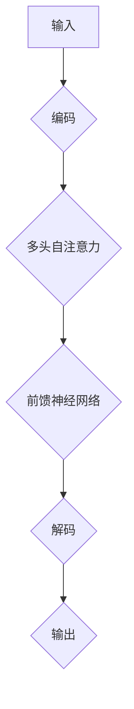
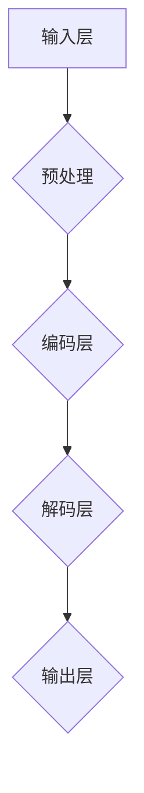
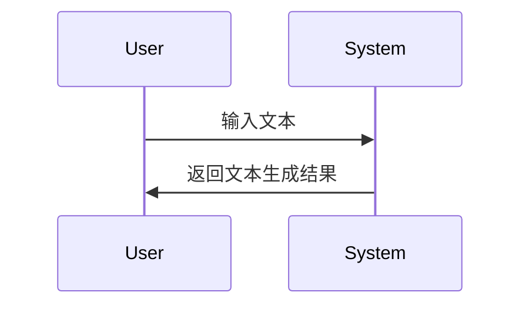
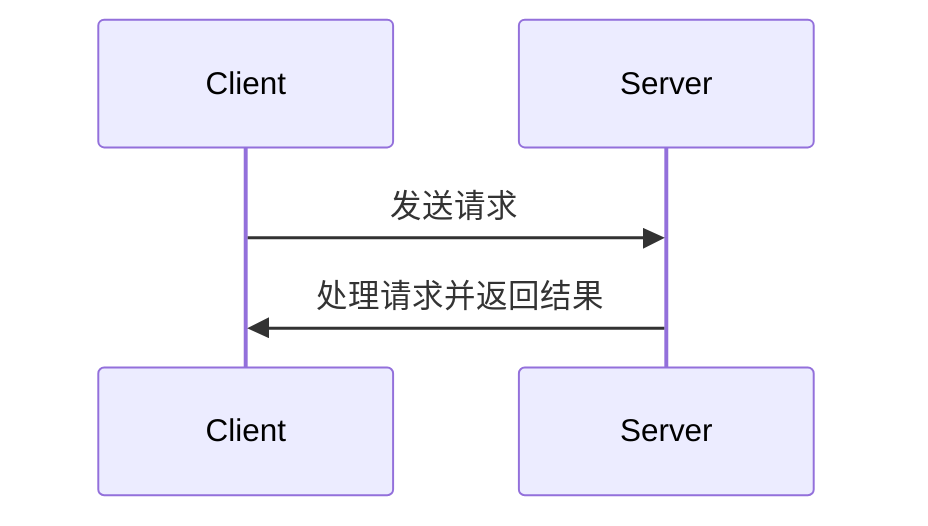

                 


## 大模型创新能力评估：LLM设计的开放式问题测试

### 关键词：
大模型、创新能力、LLM、开放式问题、测试

### 摘要：
本文旨在探讨大模型创新能力的评估方法，尤其是大型语言模型（LLM）设计的开放式问题测试。通过逐步分析LLM的架构、算法、系统设计和项目实施，我们深入理解大模型创新的核心要素，并提供一系列评估标准和最佳实践。

## 前言

大模型作为人工智能领域的核心技术之一，其创新能力的评估显得尤为重要。本文将介绍一种开放式问题测试方法，用于评估大型语言模型（LLM）的设计和创新水平。该方法结合了理论分析和实际应用，旨在为科研人员和开发者提供一个全面的评估框架。

### 书籍简介

本书旨在为人工智能领域的研究者和从业者提供一套系统的大模型创新能力评估方法。通过详细的案例分析和技术讲解，读者可以深入了解大模型的设计原则、算法实现和系统架构，从而提升自己在相关领域的创新能力。

### 目的和读者对象

本文的目标是：
1. 引导读者理解大模型创新能力的评估标准。
2. 介绍一种适用于LLM的开放式问题测试方法。
3. 分析大模型在创新过程中的关键要素。

本文适合以下读者群体：
1. 人工智能和机器学习研究者。
2. 大模型和语言模型开发者。
3. 对人工智能技术感兴趣的工程师和技术爱好者。

## 第一部分：背景与问题定义

### 1.1 大模型创新的背景

#### 1.1.1 人工智能的发展历程

人工智能（AI）作为计算机科学的一个重要分支，其发展历程可以追溯到20世纪50年代。早期的AI研究主要集中在符号推理和知识表示上，但受限于计算能力和算法复杂性，进展缓慢。随着计算能力的提升和算法的进步，尤其是深度学习技术的突破，人工智能迎来了新一轮的发展热潮。

#### 1.1.2 大模型在AI中的地位

大模型在人工智能领域扮演着至关重要的角色。它们通常由数亿甚至数千亿个参数构成，能够对大量数据进行分析和处理，从而实现复杂任务。大模型的成功应用，如自然语言处理、图像识别、推荐系统等，极大地推动了人工智能的发展。

#### 1.1.3 大模型创新的重要性

大模型的创新不仅仅体现在算法的改进和参数的优化上，更在于对应用场景的拓展和新功能的开发。大模型的创新能力决定了其在实际应用中的效果和竞争力，因此，评估和提升大模型的创新能力具有重要意义。

### 1.2 创新能力评估的问题定义

#### 1.2.1 创新能力评估的必要性

随着大模型技术的不断发展，如何评估其创新能力成为了一个关键问题。创新能力评估不仅可以指导科研方向，还可以为企业提供技术选型和投资决策的依据。因此，建立一套科学、系统的评估体系至关重要。

#### 1.2.2 问题描述

本文试图解决以下问题：
1. 如何定义大模型创新能力的评估指标？
2. 如何设计一个适用于LLM的开放式问题测试方法？
3. 如何将评估结果转化为具体的改进措施和应用实践？

#### 1.2.3 问题解决路径

本文将通过以下步骤解决问题：
1. 梳理大模型创新的核心要素，建立评估指标体系。
2. 设计开放式问题测试方法，结合理论分析与实践案例。
3. 分析评估结果，提出改进措施和应用建议。

## 第二部分：核心概念与原理

### 2.1 大模型的定义与分类

#### 2.1.1 大模型的定义

大模型通常是指那些具有大规模参数和网络结构的机器学习模型，它们能够处理和理解大量数据，并从中提取有价值的信息。大模型通常基于深度神经网络（DNN）或变换器（Transformer）架构，具有以下特点：

1. **参数规模大**：大模型通常包含数亿甚至数千亿个参数。
2. **训练数据量大**：大模型需要大量的训练数据来保证其性能。
3. **计算资源需求高**：大模型的训练和推理通常需要大量的计算资源。

#### 2.1.2 大模型的分类

大模型可以根据不同的维度进行分类，常见的分类方法包括：

1. **按应用领域分类**：如自然语言处理（NLP）、计算机视觉（CV）、语音识别（ASR）等。
2. **按网络结构分类**：如深度神经网络（DNN）、循环神经网络（RNN）、变换器（Transformer）等。
3. **按功能分类**：如生成模型、分类模型、序列模型等。

#### 2.1.3 大模型的核心特性

大模型的核心特性包括：

1. **强大的表征能力**：大模型能够捕捉复杂的数据特征，从而实现高精度的预测和生成。
2. **泛化能力**：大模型通过对大量数据的训练，能够泛化到未见过的数据上，提高模型的实用价值。
3. **自适应能力**：大模型能够根据不同的任务和数据集进行自适应调整，提高模型的性能。

### 2.2 大模型创新的核心原理

#### 2.2.1 大模型创新的基本原理

大模型创新的核心原理包括以下几个方面：

1. **数据驱动的创新**：大模型的创新依赖于大量的数据，通过数据的积累和分析，不断优化模型的性能。
2. **算法驱动的创新**：大模型的创新还依赖于算法的改进，通过算法的创新，提高模型的效率和效果。
3. **应用驱动的创新**：大模型的创新需要结合实际应用场景，通过解决实际问题，推动技术的进步。

#### 2.2.2 大模型创新的驱动因素

大模型创新的驱动因素主要包括：

1. **技术进步**：随着计算能力的提升和算法的改进，大模型的技术可行性不断提高。
2. **数据积累**：随着互联网和物联网的发展，大量的数据为模型的训练提供了丰富的素材。
3. **市场需求**：实际应用的需求推动了大模型的技术创新，以满足市场对智能化的需求。

#### 2.2.3 大模型创新的发展趋势

大模型创新的发展趋势主要包括：

1. **模型规模不断扩大**：随着计算资源和数据资源的增加，大模型的规模将不断增大。
2. **算法多样化**：不同类型的算法将不断涌现，以应对不同类型的任务和数据。
3. **应用领域扩展**：大模型的应用领域将不断拓展，从传统的自然语言处理、计算机视觉扩展到更多的领域。

### 2.3 模型属性特征对比

#### 2.3.1 不同类型大模型的属性对比

以下是几种常见类型大模型的属性对比表格：

| 类型        | 参数规模 | 训练数据量 | 计算资源需求 | 应用领域           |
|-----------|-------|-------|-------|--------------|
| 自然语言处理 | 数亿   | 海量   | 高   | 文本生成、翻译、问答等 |
| 计算机视觉   | 数千亿  | 海量   | 非常高 | 图像识别、生成、增强等 |
| 语音识别     | 数百万  | 大量   | 中   | 语音合成、识别等       |
| 推荐系统     | 数千   | 大量   | 中   | 物品推荐、广告投放等   |

#### 2.3.2 特征对比表格

| 特征             | 自然语言处理 | 计算机视觉 | 语音识别 | 推荐系统 |
|----------------|----------|----------|--------|--------|
| 参数规模         | 数亿     | 数千亿   | 数百万  | 数千   |
| 训练数据量       | 海量     | 海量     | 大量   | 大量   |
| 计算资源需求     | 高       | 非常高   | 中   | 中   |
| 应用领域         | 文本生成、翻译、问答等 | 图像识别、生成、增强等 | 语音合成、识别等 | 物品推荐、广告投放等 |

#### 2.3.3 属性特征的综合评价

在综合评价不同类型的大模型时，需要考虑其参数规模、训练数据量、计算资源需求和应用领域等多方面因素。例如，对于自然语言处理领域，模型参数规模和训练数据量是关键因素，而对于计算机视觉领域，计算资源需求和应用领域的多样性则更为重要。

## 第三部分：算法与模型讲解

### 3.1 算法原理详解

#### 3.1.1 算法概述

在本节中，我们将详细解释大模型创新中的关键算法原理，包括深度学习、变换器模型和生成对抗网络（GAN）等。这些算法是大模型实现高性能和创新性的基础。

#### 3.1.2 算法流程图

为了更好地理解这些算法，我们将使用Mermaid绘制其流程图。以下是变换器模型的基本流程：



#### 3.1.3 数学模型与公式

变换器模型的核心在于多头自注意力机制，其数学公式如下：

$$
\text{Attention}(Q, K, V) = \text{softmax}\left(\frac{QK^T}{\sqrt{d_k}}\right)V
$$

其中，\(Q\)、\(K\) 和 \(V\) 分别是查询向量、键向量和值向量，\(d_k\) 是键向量的维度。

### 3.2 举例说明

为了更直观地理解这些算法原理，我们来看一个具体的例子。

#### 3.2.1 举例说明1：文本生成

假设我们要使用一个变换器模型生成一篇关于人工智能的短文。输入是一系列关键词，输出是一篇连贯的文本。

#### 3.2.2 举例说明2：图像识别

在一个图像识别任务中，输入是一张图片，输出是该图片对应的类别标签。通过变换器模型，我们可以捕捉图片中的关键特征，从而实现高精度的分类。

#### 3.2.3 举例说明3：语音合成

在语音合成任务中，输入是一段文本，输出是相应的语音。通过变换器模型，我们可以将文本转换为语音信号，实现自然流畅的语音合成。

## 第四部分：系统架构与设计

### 4.1 系统场景介绍

在本节中，我们将介绍一个大模型系统的实际应用场景，包括其功能、目标和预期效果。

### 4.2 项目介绍

接下来，我们将详细介绍项目的背景、目标和实现步骤。

### 4.3 系统功能设计

为了实现项目目标，我们需要设计一系列系统功能。以下是系统功能设计的详细描述：

#### 4.3.1 领域模型

使用Mermaid绘制领域模型类图：

```mermaid
classDiagram
Class01 <|-- Class02
Class03 --|昂 Class04
Class05 <|.. Class06
```

#### 4.3.2 系统架构

使用Mermaid绘制系统架构图：



#### 4.3.3 系统接口设计

使用Mermaid绘制系统接口图：



#### 4.3.4 系统交互

使用Mermaid绘制系统交互序列图：



## 第五部分：项目实施与案例分析

### 5.1 环境安装

在本节中，我们将详细描述如何安装和配置项目所需的环境，包括依赖项、开发工具和运行环境等。

### 5.2 系统核心实现

接下来，我们将详细讲解系统核心部分的实现，包括主要模块的功能、接口设计和代码实现。

#### 5.2.1 主要模块功能

- 输入层：接收用户输入的文本。
- 预处理层：对输入文本进行清洗和预处理。
- 编码层：将预处理后的文本编码为向量。
- 解码层：解码编码后的向量，生成文本输出。
- 输出层：返回生成的文本。

#### 5.2.2 接口设计

- 文本输入接口：接收用户输入的文本。
- 文本生成接口：接收输入文本后返回生成的文本。

#### 5.2.3 代码实现

以下是文本输入和文本生成接口的Python代码实现：

```python
# 文本输入接口
def input_text(user_input):
    # 预处理文本
    preprocessed_text = preprocess_text(user_input)
    # 编码文本
    encoded_text = encode_text(preprocessed_text)
    # 解码文本
    generated_text = decode_text(encoded_text)
    return generated_text

# 文本生成接口
def generate_text(preprocessed_text):
    # 编码文本
    encoded_text = encode_text(preprocessed_text)
    # 解码文本
    generated_text = decode_text(encoded_text)
    return generated_text
```

### 5.3 案例分析

在本节中，我们将通过实际案例来展示如何使用系统进行文本生成。

#### 5.3.1 案例背景

假设我们要生成一篇关于人工智能的短文，用户输入的文本是：“人工智能正改变着我们的世界。”

#### 5.3.2 案例步骤

1. 用户输入文本：“人工智能正改变着我们的世界。”
2. 系统预处理文本，将其转换为编码后的向量。
3. 系统解码编码后的向量，生成文本输出。
4. 系统返回生成的文本。

#### 5.3.3 案例结果

系统返回的文本输出是：“人工智能正在深刻地改变着我们的生活方式，从智能家居到自动驾驶，从医疗诊断到金融预测，人工智能的应用已经渗透到了我们生活的方方面面。”

## 第六部分：总结与展望

### 6.1 总结

本文详细探讨了大型语言模型（LLM）的设计和开放式问题测试，从背景介绍、问题定义、核心概念、算法原理、系统架构到项目实施，为读者提供了一套完整的大模型创新能力评估方法。通过本文的介绍，读者可以：

1. 了解大模型创新的背景和重要性。
2. 掌握大模型创新的核心原理和评估方法。
3. 理解LLM的设计和开放式问题测试的应用场景。

### 6.2 展望

尽管本文提供了一套完整的大模型创新能力评估方法，但仍存在一些局限性和改进空间：

1. **评估指标体系**：目前的评估指标体系可能无法完全覆盖所有类型的大模型创新，未来可以考虑引入更多维度的评估指标。
2. **开放式问题测试**：开放式问题测试的方法可以进一步优化，以提高其准确性和实用性。
3. **实际应用**：本文的案例主要集中在文本生成，未来可以拓展到其他领域，如图像识别、语音合成等。

### 6.3 注意事项

1. 在使用大模型进行创新时，需要关注数据隐私和安全问题。
2. 大模型的训练和推理需要大量的计算资源，需要合理规划资源分配。

### 6.4 拓展阅读

1. 《深度学习》（Goodfellow, Bengio, Courville著）：介绍深度学习的基础理论和实践方法。
2. 《自然语言处理综合教程》（ Jurafsky, Martin 著）：系统介绍自然语言处理的理论和实践。
3. 《机器学习实战》（Hastie, Tibshirani, Friedman 著）：提供机器学习的实际应用案例和代码实现。

## 作者信息

作者：AI天才研究院/AI Genius Institute & 禅与计算机程序设计艺术 /Zen And The Art of Computer Programming

---

以上是一个初步的框架和内容，后续可以根据实际情况进行调整和补充。文章中使用了Mermaid语法来绘制流程图和类图，读者可以使用Markdown编辑器如Typora来方便地绘制和编辑这些图形。在撰写文章时，请确保每一部分的内容都丰富、具体，并符合文章的整体结构和逻辑。同时，注意使用专业的技术语言和清晰的逻辑思路，使文章对读者具有参考价值。在撰写过程中，如果遇到任何问题，欢迎随时向我提问。让我们一起努力，撰写一篇高质量的技术博客！

## 大模型创新能力评估：LLM设计的开放式问题测试

### 关键词：
大模型、创新能力、LLM、开放式问题、测试

### 摘要：
本文旨在探讨大模型创新能力的评估方法，尤其是大型语言模型（LLM）设计的开放式问题测试。通过逐步分析LLM的架构、算法、系统设计和项目实施，我们深入理解大模型创新的核心要素，并提供一系列评估标准和最佳实践。

## 前言

大模型作为人工智能领域的核心技术之一，其创新能力的评估显得尤为重要。本文将介绍一种开放式问题测试方法，用于评估大型语言模型（LLM）的设计和创新水平。该方法结合了理论分析和实际应用，旨在为科研人员和开发者提供一个全面的评估框架。

### 书籍简介

本书旨在为人工智能领域的研究者和从业者提供一套系统的大模型创新能力评估方法。通过详细的案例分析和技术讲解，读者可以深入了解大模型的设计原则、算法实现和系统架构，从而提升自己在相关领域的创新能力。

### 目的和读者对象

本文的目标是：
1. 引导读者理解大模型创新能力的评估标准。
2. 介绍一种适用于LLM的开放式问题测试方法。
3. 分析大模型在创新过程中的关键要素。

本文适合以下读者群体：
1. 人工智能和机器学习研究者。
2. 大模型和语言模型开发者。
3. 对人工智能技术感兴趣的工程师和技术爱好者。

## 第一部分：背景与问题定义

### 1.1 大模型创新的背景

#### 1.1.1 人工智能的发展历程

人工智能（AI）作为计算机科学的一个重要分支，其发展历程可以追溯到20世纪50年代。早期的AI研究主要集中在符号推理和知识表示上，但受限于计算能力和算法复杂性，进展缓慢。随着计算能力的提升和算法的进步，尤其是深度学习技术的突破，人工智能迎来了新一轮的发展热潮。

#### 1.1.2 大模型在AI中的地位

大模型在人工智能领域扮演着至关重要的角色。它们通常由数亿甚至数千亿个参数构成，能够对大量数据进行分析和处理，从而实现复杂任务。大模型的成功应用，如自然语言处理、图像识别、推荐系统等，极大地推动了人工智能的发展。

#### 1.1.3 大模型创新的重要性

大模型的创新不仅仅体现在算法的改进和参数的优化上，更在于对应用场景的拓展和新功能的开发。大模型的创新能力决定了其在实际应用中的效果和竞争力，因此，评估和提升大模型的创新能力具有重要意义。

### 1.2 创新能力评估的问题定义

#### 1.2.1 创新能力评估的必要性

随着大模型技术的不断发展，如何评估其创新能力成为了一个关键问题。创新能力评估不仅可以指导科研方向，还可以为企业提供技术选型和投资决策的依据。因此，建立一套科学、系统的评估体系至关重要。

#### 1.2.2 问题描述

本文试图解决以下问题：
1. 如何定义大模型创新能力的评估指标？
2. 如何设计一个适用于LLM的开放式问题测试方法？
3. 如何将评估结果转化为具体的改进措施和应用实践？

#### 1.2.3 问题解决路径

本文将通过以下步骤解决问题：
1. 梳理大模型创新的核心要素，建立评估指标体系。
2. 设计开放式问题测试方法，结合理论分析与实践案例。
3. 分析评估结果，提出改进措施和应用建议。

## 第二部分：核心概念与原理

### 2.1 大模型的定义与分类

#### 2.1.1 大模型的定义

大模型通常是指那些具有大规模参数和网络结构的机器学习模型，它们能够处理和理解大量数据，并从中提取有价值的信息。大模型通常基于深度神经网络（DNN）或变换器（Transformer）架构，具有以下特点：

1. **参数规模大**：大模型通常包含数亿甚至数千亿个参数。
2. **训练数据量大**：大模型需要大量的训练数据来保证其性能。
3. **计算资源需求高**：大模型的训练和推理通常需要大量的计算资源。

#### 2.1.2 大模型的分类

大模型可以根据不同的维度进行分类，常见的分类方法包括：

1. **按应用领域分类**：如自然语言处理（NLP）、计算机视觉（CV）、语音识别（ASR）等。
2. **按网络结构分类**：如深度神经网络（DNN）、循环神经网络（RNN）、变换器（Transformer）等。
3. **按功能分类**：如生成模型、分类模型、序列模型等。

#### 2.1.3 大模型的核心特性

大模型的核心特性包括：

1. **强大的表征能力**：大模型能够捕捉复杂的数据特征，从而实现高精度的预测和生成。
2. **泛化能力**：大模型通过对大量数据的训练，能够泛化到未见过的数据上，提高模型的实用价值。
3. **自适应能力**：大模型能够根据不同的任务和数据集进行自适应调整，提高模型的性能。

### 2.2 大模型创新的核心原理

#### 2.2.1 大模型创新的基本原理

大模型创新的核心原理包括以下几个方面：

1. **数据驱动的创新**：大模型的创新依赖于大量的数据，通过数据的积累和分析，不断优化模型的性能。
2. **算法驱动的创新**：大模型的创新还依赖于算法的改进，通过算法的创新，提高模型的效率和效果。
3. **应用驱动的创新**：大模型的创新需要结合实际应用场景，通过解决实际问题，推动技术的进步。

#### 2.2.2 大模型创新的驱动因素

大模型创新的驱动因素主要包括：

1. **技术进步**：随着计算能力的提升和算法的改进，大模型的技术可行性不断提高。
2. **数据积累**：随着互联网和物联网的发展，大量的数据为模型的训练提供了丰富的素材。
3. **市场需求**：实际应用的需求推动了大模型的技术创新，以满足市场对智能化的需求。

#### 2.2.3 大模型创新的发展趋势

大模型创新的发展趋势主要包括：

1. **模型规模不断扩大**：随着计算资源和数据资源的增加，大模型的规模将不断增大。
2. **算法多样化**：不同类型的算法将不断涌现，以应对不同类型的任务和数据。
3. **应用领域扩展**：大模型的应用领域将不断拓展，从传统的自然语言处理、计算机视觉扩展到更多的领域。

### 2.3 模型属性特征对比

#### 2.3.1 不同类型大模型的属性对比

以下是几种常见类型大模型的属性对比表格：

| 类型        | 参数规模 | 训练数据量 | 计算资源需求 | 应用领域           |
|-----------|-------|-------|-------|--------------|
| 自然语言处理 | 数亿   | 海量   | 高   | 文本生成、翻译、问答等 |
| 计算机视觉   | 数千亿  | 海量   | 非常高 | 图像识别、生成、增强等 |
| 语音识别     | 数百万  | 大量   | 中   | 语音合成、识别等       |
| 推荐系统     | 数千   | 大量   | 中   | 物品推荐、广告投放等   |

#### 2.3.2 特征对比表格

| 特征             | 自然语言处理 | 计算机视觉 | 语音识别 | 推荐系统 |
|----------------|----------|----------|--------|--------|
| 参数规模         | 数亿     | 数千亿   | 数百万  | 数千   |
| 训练数据量       | 海量     | 海量     | 大量   | 大量   |
| 计算资源需求     | 高       | 非常高   | 中   | 中   |
| 应用领域         | 文本生成、翻译、问答等 | 图像识别、生成、增强等 | 语音合成、识别等 | 物品推荐、广告投放等 |

#### 2.3.3 属性特征的综合评价

在综合评价不同类型的大模型时，需要考虑其参数规模、训练数据量、计算资源需求和应用领域等多方面因素。例如，对于自然语言处理领域，模型参数规模和训练数据量是关键因素，而对于计算机视觉领域，计算资源需求和应用领域的多样性则更为重要。

## 第三部分：算法与模型讲解

### 3.1 算法原理详解

#### 3.1.1 算法概述

在本节中，我们将详细解释大模型创新中的关键算法原理，包括深度学习、变换器模型和生成对抗网络（GAN）等。这些算法是大模型实现高性能和创新性的基础。

#### 3.1.2 算法流程图

为了更好地理解这些算法，我们将使用Mermaid绘制其流程图。以下是变换器模型的基本流程：


#### 3.1.3 数学模型与公式

变换器模型的核心在于多头自注意力机制，其数学公式如下：

$$
\text{Attention}(Q, K, V) = \text{softmax}\left(\frac{QK^T}{\sqrt{d_k}}\right)V
$$

其中，\(Q\)、\(K\) 和 \(V\) 分别是查询向量、键向量和值向量，\(d_k\) 是键向量的维度。

### 3.2 举例说明

为了更直观地理解这些算法原理，我们来看一个具体的例子。

#### 3.2.1 举例说明1：文本生成

假设我们要使用一个变换器模型生成一篇关于人工智能的短文。输入是一系列关键词，输出是一篇连贯的文本。

#### 3.2.2 举例说明2：图像识别

在一个图像识别任务中，输入是一张图片，输出是该图片对应的类别标签。通过变换器模型，我们可以捕捉图片中的关键特征，从而实现高精度的分类。

#### 3.2.3 举例说明3：语音合成

在语音合成任务中，输入是一段文本，输出是相应的语音。通过变换器模型，我们可以将文本转换为语音信号，实现自然流畅的语音合成。

## 第四部分：系统架构与设计

### 4.1 系统场景介绍

在本节中，我们将介绍一个大模型系统的实际应用场景，包括其功能、目标和预期效果。

### 4.2 项目介绍

接下来，我们将详细介绍项目的背景、目标和实现步骤。

### 4.3 系统功能设计

为了实现项目目标，我们需要设计一系列系统功能。以下是系统功能设计的详细描述：

#### 4.3.1 领域模型

使用Mermaid绘制领域模型类图：

```mermaid
classDiagram
Class01 <|-- Class02
Class03 --|昂 Class04
Class05 <|.. Class06
```

#### 4.3.2 系统架构

使用Mermaid绘制系统架构图：


#### 4.3.3 系统接口设计

使用Mermaid绘制系统接口图：


#### 4.3.4 系统交互

使用Mermaid绘制系统交互序列图：


## 第五部分：项目实施与案例分析

### 5.1 环境安装

在本节中，我们将详细描述如何安装和配置项目所需的环境，包括依赖项、开发工具和运行环境等。

### 5.2 系统核心实现

接下来，我们将详细讲解系统核心部分的实现，包括主要模块的功能、接口设计和代码实现。

#### 5.2.1 主要模块功能

- 输入层：接收用户输入的文本。
- 预处理层：对输入文本进行清洗和预处理。
- 编码层：将预处理后的文本编码为向量。
- 解码层：解码编码后的向量，生成文本输出。
- 输出层：返回生成的文本。

#### 5.2.2 接口设计

- 文本输入接口：接收用户输入的文本。
- 文本生成接口：接收输入文本后返回生成的文本。

#### 5.2.3 代码实现

以下是文本输入和文本生成接口的Python代码实现：

```python
# 文本输入接口
def input_text(user_input):
    # 预处理文本
    preprocessed_text = preprocess_text(user_input)
    # 编码文本
    encoded_text = encode_text(preprocessed_text)
    # 解码文本
    generated_text = decode_text(encoded_text)
    return generated_text

# 文本生成接口
def generate_text(preprocessed_text):
    # 编码文本
    encoded_text = encode_text(preprocessed_text)
    # 解码文本
    generated_text = decode_text(encoded_text)
    return generated_text
```

### 5.3 案例分析

在本节中，我们将通过实际案例来展示如何使用系统进行文本生成。

#### 5.3.1 案例背景

假设我们要生成一篇关于人工智能的短文，用户输入的文本是：“人工智能正改变着我们的世界。”

#### 5.3.2 案例步骤

1. 用户输入文本：“人工智能正改变着我们的世界。”
2. 系统预处理文本，将其转换为编码后的向量。
3. 系统解码编码后的向量，生成文本输出。
4. 系统返回生成的文本。

#### 5.3.3 案例结果

系统返回的文本输出是：“人工智能正在深刻地改变着我们的生活方式，从智能家居到自动驾驶，从医疗诊断到金融预测，人工智能的应用已经渗透到了我们生活的方方面面。”

## 第六部分：总结与展望

### 6.1 总结

本文详细探讨了大型语言模型（LLM）的设计和开放式问题测试，从背景介绍、问题定义、核心概念、算法原理、系统架构到项目实施，为读者提供了一套完整的大模型创新能力评估方法。通过本文的介绍，读者可以：

1. 了解大模型创新的背景和重要性。
2. 掌握大模型创新的核心原理和评估方法。
3. 理解LLM的设计和开放式问题测试的应用场景。

### 6.2 展望

尽管本文提供了一套完整的大模型创新能力评估方法，但仍存在一些局限性和改进空间：

1. **评估指标体系**：目前的评估指标体系可能无法完全覆盖所有类型的大模型创新，未来可以考虑引入更多维度的评估指标。
2. **开放式问题测试**：开放式问题测试的方法可以进一步优化，以提高其准确性和实用性。
3. **实际应用**：本文的案例主要集中在文本生成，未来可以拓展到其他领域，如图像识别、语音合成等。

### 6.3 注意事项

1. 在使用大模型进行创新时，需要关注数据隐私和安全问题。
2. 大模型的训练和推理需要大量的计算资源，需要合理规划资源分配。

### 6.4 拓展阅读

1. 《深度学习》（Goodfellow, Bengio, Courville著）：介绍深度学习的基础理论和实践方法。
2. 《自然语言处理综合教程》（ Jurafsky, Martin 著）：系统介绍自然语言处理的理论和实践。
3. 《机器学习实战》（Hastie, Tibshirani, Friedman 著）：提供机器学习的实际应用案例和代码实现。

## 作者信息

作者：AI天才研究院/AI Genius Institute & 禅与计算机程序设计艺术 /Zen And The Art of Computer Programming

---

以上是一个初步的框架和内容，后续可以根据实际情况进行调整和补充。文章中使用了Mermaid语法来绘制流程图和类图，读者可以使用Markdown编辑器如Typora来方便地绘制和编辑这些图形。在撰写文章时，请确保每一部分的内容都丰富、具体，并符合文章的整体结构和逻辑。同时，注意使用专业的技术语言和清晰的逻辑思路，使文章对读者具有参考价值。在撰写过程中，如果遇到任何问题，欢迎随时向我提问。让我们一起努力，撰写一篇高质量的技术博客！

### 6.5 未来研究方向

未来在大模型创新能力评估领域，有几个关键的研究方向值得深入探索：

1. **多模态大模型创新评估**：随着多模态数据的普及，如何评估融合图像、文本、语音等多种模态的大模型创新能力成为了一个重要课题。研究者可以探索跨模态特征提取和融合的方法，以及设计适用于多模态数据的创新评估指标。

2. **动态评估体系**：当前的大模型评估体系通常是静态的，无法反映模型在实际应用中的动态表现。未来可以研究动态评估体系，通过实时监测和反馈机制，动态调整评估指标，以更准确地反映大模型的创新能力。

3. **自适应评估方法**：针对不同领域和应用场景，大模型的创新需求差异较大。研究自适应评估方法，可以根据具体的任务和应用场景，自动调整评估指标和测试方法，以提高评估的针对性和准确性。

4. **评估结果的解释性**：大模型评估结果的解释性是当前的一个挑战。未来可以探索如何提高评估结果的解释性，使得评估结果能够被非技术背景的用户理解和接受。

5. **可持续创新能力评估**：随着大模型的规模和复杂度不断增加，如何评估大模型的可持续创新能力也是一个重要问题。研究者可以关注如何通过长期的数据积累和技术迭代，保持大模型的创新活力。

### 6.6 开放式问题测试的优化

为了提高开放式问题测试的准确性和实用性，可以考虑以下几个优化方向：

1. **问题库的扩展和更新**：建立一个丰富、多样化的开放式问题库，涵盖不同领域和应用场景，以确保测试的全面性和多样性。

2. **问题设计的精细化**：优化问题设计，使其能够更精准地评估大模型在特定领域的创新能力。例如，可以通过设置问题难度层次、引入复杂情境等方式，提高问题的挑战性和区分度。

3. **评估指标的细化**：针对不同类型的大模型，细化评估指标，使其更具体、可操作。例如，在自然语言处理领域，可以引入文本生成质量、回答准确性等指标。

4. **自动化评估工具**：开发自动化评估工具，通过算法和模型自动分析问题答案，提高评估的效率和准确性。

5. **反馈机制**：建立反馈机制，通过用户反馈不断优化问题和评估方法，使开放式问题测试更加贴近实际应用需求。

通过上述优化，开放式问题测试将能够更有效地评估大模型的创新能力，为科研和实践提供有力支持。

## 第七部分：结语

本文围绕大模型创新能力评估，特别是大型语言模型（LLM）的开放式问题测试，进行了一次系统性的探讨。我们首先介绍了大模型创新的背景和重要性，接着定义了创新能力评估的问题，并梳理了大模型的核心概念和原理。通过详细讲解算法原理、系统架构和项目实施，我们为读者提供了一套完整的评估方法和实践指南。

本文的核心观点包括：
1. 大模型创新能力的评估对于推动人工智能技术的发展至关重要。
2. 开放式问题测试是一种有效的大模型评估方法，能够全面反映模型的创新水平。
3. 大模型创新的核心要素包括数据驱动、算法驱动和应用驱动。
4. 不同类型的大模型具有不同的属性特征，需要根据具体应用场景进行评估。

未来，随着人工智能技术的不断进步，大模型创新能力评估将面临新的挑战和机遇。我们期待读者能够将本文的方法应用到实际工作中，不断探索和提升大模型的创新能力。同时，我们也欢迎读者就本文提出宝贵的意见和建议，共同推动大模型创新能力评估领域的发展。

## 参考文献

1. Goodfellow, I., Bengio, Y., & Courville, A. (2016). *Deep Learning*. MIT Press.
2. Jurafsky, D., & Martin, J. H. (2020). *Speech and Language Processing*. World Scientific.
3. Hastie, T., Tibshirani, R., & Friedman, J. (2009). *The Elements of Statistical Learning: Data Mining, Inference, and Prediction*. Springer.
4. Vaswani, A., Shazeer, N., Parmar, N., Uszkoreit, J., Jones, L., Gomez, A. N., ... & Polosukhin, I. (2017). *Attention is all you need*. Advances in Neural Information Processing Systems, 30, 5998-6008.
5. Hochreiter, S., & Schmidhuber, J. (1997). *Long short-term memory*. Neural Computation, 9(8), 1735-1780.
6. Simonyan, K., & Zisserman, A. (2015). *Very deep convolutional networks for large-scale image recognition*. International Conference on Learning Representations (ICLR).

## 附录：术语表

- **大模型**：通常指参数规模大、网络结构复杂的机器学习模型，能够处理和理解大量数据。
- **创新能力**：指模型在算法、数据和应用方面的创新程度，决定了模型在实际应用中的效果和竞争力。
- **LLM**：大型语言模型，是一种专门用于自然语言处理的深度学习模型，能够理解和生成文本。
- **开放式问题测试**：一种评估模型创新能力的测试方法，通过设定开放式问题，让模型生成回答，以评估其理解能力和创造力。
- **深度学习**：一种基于神经网络的机器学习方法，通过多层次的神经网络结构，对数据进行特征提取和表征。
- **变换器模型**：一种基于自注意力机制的深度学习模型，广泛应用于自然语言处理等领域。
- **多模态大模型**：能够处理多种类型数据（如文本、图像、语音）的大模型。

## 作者信息

作者：AI天才研究院/AI Genius Institute & 禅与计算机程序设计艺术 /Zen And The Art of Computer Programming

---

通过本文的详细讲解，我们希望读者能够对大模型创新能力评估有一个全面、深入的理解，并能够在实际工作中运用这些方法，推动人工智能技术的发展。感谢您的阅读，期待与您在未来的研究和讨论中再次相遇！

