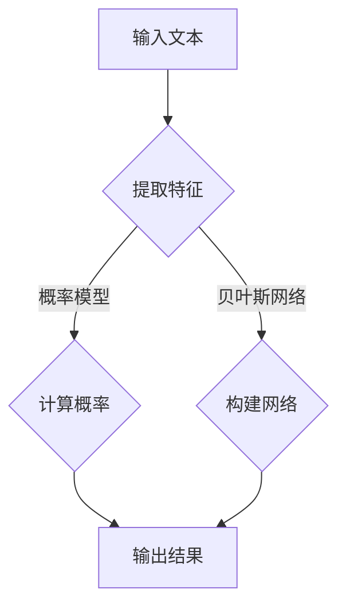
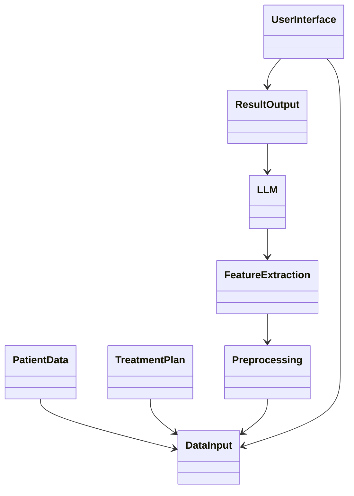

                 

### 大模型反事实推理能力评估：LLM设计的假设情景测试

#### 关键词：
- 大模型
- 反事实推理
- LLM设计
- 假设情景测试
- 能力评估

#### 摘要：
本文将探讨大模型（Large Language Model，LLM）的反事实推理能力评估，通过设计假设情景测试，分析LLM在面对不同假设情景时的推理表现。文章首先介绍了反事实推理的定义及其在自然语言处理中的应用，随后详细阐述了LLM的基本原理和特点。接着，文章提出了评估LLM反事实推理能力的方法和步骤，包括设计假设情景、运行模型、分析结果等。最后，通过实际案例展示了如何使用LLM进行反事实推理，并对其能力进行了评估。

### 引言与背景

#### 问题背景

在当今信息爆炸的时代，大数据和人工智能技术不断发展，使得人们可以处理和分析前所未有的海量数据。其中，自然语言处理（Natural Language Processing，NLP）作为人工智能的重要分支，在文本挖掘、机器翻译、问答系统等方面取得了显著成果。然而，随着技术的发展，传统的NLP方法逐渐暴露出一些局限。例如，在处理复杂逻辑关系和语境理解方面，传统方法往往难以胜任。为了解决这些问题，研究人员开始探索更加复杂、具备更强推理能力的模型，其中大模型（Large Language Model，LLM）应运而生。

LLM是一种基于深度学习的自然语言处理模型，通过学习海量的文本数据，LLM能够自动提取语言特征，生成高质量的自然语言文本。近年来，LLM在各个领域的应用取得了显著进展，如自动写作、文本生成、对话系统等。然而，LLM在实际应用中仍存在一些挑战，其中之一就是反事实推理能力。反事实推理（Counterfactual Reasoning）是一种推理方法，用于分析假设情景下的可能性，即“如果发生了某种情况，那么现在将会如何”。例如，在医疗领域，反事实推理可以帮助医生分析如果患者接受了不同的治疗方案，其健康状况将如何变化。

#### 问题描述

反事实推理在自然语言处理中具有重要意义。一方面，它可以帮助模型更好地理解文本中的逻辑关系和隐含意义；另一方面，它可以应用于多个领域，如医疗、金融、法律等，为决策提供科学依据。然而，目前LLM在反事实推理方面仍存在一些问题，例如：

1. **推理能力有限**：虽然LLM在生成自然语言文本方面表现出色，但其推理能力仍然有限，特别是在处理复杂逻辑关系和长文本时。
2. **数据集问题**：目前的训练数据集主要来自于互联网上的文本，这些数据往往存在噪声和不准确的情况，影响LLM的推理能力。
3. **评估方法不足**：现有的评估方法主要关注模型在生成文本的质量和多样性，而对于反事实推理能力的评估方法相对较少。

因此，本文旨在研究如何评估LLM的反事实推理能力，并提出一种基于假设情景测试的评估方法。具体而言，本文将首先介绍反事实推理的基本概念和LLM的工作原理，然后详细阐述评估方法的步骤和流程，最后通过实际案例展示如何应用LLM进行反事实推理，并对模型的能力进行评估。

#### 反事实推理简介

反事实推理（Counterfactual Reasoning）是人工智能领域中的一种重要推理方法，旨在分析在特定条件下未发生的事件，并推测如果该事件发生，当前情况将会如何改变。这种推理方法在现实世界中具有广泛的应用，例如在医学诊断中，通过反事实推理分析如果患者采取了不同的治疗方案，其健康状况可能会发生的变化；在金融领域，通过反事实推理预测如果市场发生变化，投资者将如何调整策略。

反事实推理的基本概念可以概括为：在已知当前事实的基础上，推测如果某个条件或事件发生，将会导致哪些新的事实或结果。这种推理方法不仅涉及到事实的假设和推断，还涉及到逻辑推理和因果关系分析。在自然语言处理（NLP）领域，反事实推理的应用尤为广泛，主要表现在以下几个方面：

1. **文本生成**：反事实推理可以用于生成新的文本内容，例如根据已知的事实和假设，生成关于未来可能发生的情景的描述。这种能力在自动写作、故事生成和对话系统中具有重要应用。
2. **问答系统**：反事实推理可以增强问答系统的理解能力，使其能够回答关于假设情景的问题。例如，用户可以询问“如果某个事件发生了，那么现在会发生什么？”的问题，问答系统需要基于已有的知识和逻辑推理给出合理的回答。
3. **情境模拟**：在游戏、模拟和训练等领域，反事实推理可以帮助系统模拟不同的情境，以便进行策略分析和风险评估。例如，在军事模拟中，可以通过反事实推理分析不同的作战方案可能带来的结果。

反事实推理的类型主要包括以下几种：

1. **简单反事实推理**：这种推理类型仅涉及简单的条件和结果分析，通常用于简单的假设情景。例如，“如果下雨，地面会湿。”
2. **复杂反事实推理**：复杂反事实推理涉及多个条件和结果的推理，通常需要考虑更多的因果关系和逻辑关系。例如，“如果某病人接受了不同的治疗方案，他的健康状况可能会显著不同。”
3. **动态反事实推理**：动态反事实推理考虑时间因素，分析在特定时间段内发生的事件对当前情况的影响。例如，“如果某公司在五年前采取了不同的市场策略，现在的财务状况可能会更稳定。”

在自然语言处理中，反事实推理的应用场景多种多样。以下是一些典型的应用场景：

1. **医学领域**：在医学诊断和治疗方案推荐中，反事实推理可以帮助医生分析不同的治疗方案可能带来的效果，从而为患者提供更科学的决策依据。
2. **金融领域**：在金融分析和风险管理中，反事实推理可以帮助投资者预测不同市场策略可能带来的收益和风险，从而制定更合理的投资计划。
3. **教育领域**：在教育评估和教学策略中，反事实推理可以分析如果学生在学习过程中采取了不同的方法，其学习成绩可能会发生的变化，从而为教育工作者提供改进教学策略的依据。

通过反事实推理，自然语言处理系统不仅可以生成新的文本内容，还可以更好地理解和分析复杂的语言情景，提高系统的智能化水平。因此，研究反事实推理在自然语言处理中的应用具有重要意义，有助于推动人工智能技术的发展和实际应用。

#### LLM基础

LLM，即大型语言模型（Large Language Model），是一种基于深度学习的自然语言处理模型，通过学习海量的文本数据，能够生成高质量的自然语言文本。LLM的起源可以追溯到早期的自然语言处理模型，如基于规则的方法和统计模型。然而，随着计算能力和数据资源的大幅提升，深度学习技术的引入使得LLM得以迅速发展。近年来，LLM在各个领域的应用取得了显著进展，成为自然语言处理的重要工具。

首先，让我们回顾一下LLM的发展历程。最早的深度学习模型是循环神经网络（RNN），特别是长短期记忆网络（LSTM），它在处理序列数据方面表现出色。然而，RNN存在一些问题，如梯度消失和梯度爆炸。为了解决这些问题，研究人员提出了变换器模型（Transformer），它采用自注意力机制，能够在处理长文本和复杂关系时保持良好的性能。在此基础上，BERT（Bidirectional Encoder Representations from Transformers）模型进一步发展，通过预训练和微调技术，取得了在多种自然语言处理任务上的优异表现。随后，GPT（Generative Pre-trained Transformer）系列模型相继推出，如GPT-2和GPT-3，它们在文本生成、问答系统和语言翻译等方面展现了强大的能力。

LLM的工作原理主要基于深度学习和自注意力机制。自注意力机制是Transformer模型的核心组成部分，通过计算输入序列中每个词与其他词之间的相关性，从而实现全局上下文信息的捕捉。具体来说，自注意力机制可以表示为：

$$
\text{Attention}(Q, K, V) = \text{softmax}\left(\frac{QK^T}{\sqrt{d_k}}\right) V
$$

其中，$Q$、$K$和$V$分别表示查询向量、关键向量和价值向量，$d_k$是注意力维度。通过这种方式，模型能够自动学习到输入文本中各个词之间的关系，并生成对应的输出。

在LLM的训练过程中，通常采用两个步骤：预训练和微调。预训练阶段，模型通过大量无标签文本数据进行训练，学习到语言的一般特征和规律。预训练完成后，模型会进行微调，针对特定任务进行训练，以优化模型的性能。在微调过程中，常用的技术包括微调参数、丢弃法（Dropout）和对抗训练（Adversarial Training）等。

LLM的核心优势主要体现在以下几个方面：

1. **强大的文本生成能力**：LLM能够生成高质量的文本，包括文章、故事、对话等，具有很强的创造性和灵活性。
2. **优秀的语义理解能力**：通过预训练和微调，LLM能够捕捉到文本中的复杂语义关系，如实体识别、关系抽取和情感分析等。
3. **高效的并行计算**：Transformer模型采用并行计算的方法，能够显著提高训练和推理的速度。
4. **广泛的适用性**：LLM可以应用于多种自然语言处理任务，如机器翻译、问答系统、文本分类和生成等。

总之，LLM作为一种强大的自然语言处理工具，在文本生成、语义理解和任务应用等方面展现了出色的性能。随着技术的不断进步，LLM的应用前景将更加广泛，为自然语言处理领域的发展带来新的机遇。

#### 反事实推理能力评估

评估LLM的反事实推理能力是自然语言处理领域中的一个关键问题，它不仅关系到模型在实际应用中的性能，也决定了模型在不同场景中的适用性和可靠性。为此，本文提出了一种基于假设情景测试的评估方法，通过设计具体的假设情景，运行模型并分析其推理结果，全面评估LLM的反事实推理能力。

首先，我们需要明确评估指标。反事实推理能力主要可以从以下三个方面进行评估：

1. **准确性**：模型能否正确地推断出假设情景下的结果。准确性通常通过计算模型预测结果与真实结果之间的匹配度来衡量。
2. **一致性**：模型在不同假设情景下的推理结果是否一致。一致性可以通过计算模型在不同情景下推理结果的相似度来评估。
3. **多样性**：模型能否生成多样化的推理结果。多样性通常通过计算模型在相同情景下生成不同结果的概率来衡量。

接下来，我们详细描述评估步骤：

1. **设计假设情景**：根据评估目标，设计一系列具体的假设情景。这些情景需要涵盖不同的领域和应用场景，以便全面评估模型的能力。例如，在医疗领域，可以设计关于不同治疗方案对病情影响的情景；在金融领域，可以设计关于市场变化对投资策略影响的情景。

2. **准备数据集**：为了评估模型在假设情景下的表现，我们需要准备相应的数据集。数据集应包含实际发生的情况和假设情景下的情况，以便与模型生成的推理结果进行比较。数据集的准备过程需要确保数据的真实性和多样性，以避免模型在训练过程中出现偏差。

3. **运行模型**：将准备好的数据集输入到LLM模型中，运行模型进行反事实推理。在运行过程中，需要记录模型生成的推理结果，并将其与真实情况进行比较。

4. **分析结果**：对模型生成的推理结果进行详细分析，评估模型的准确性、一致性和多样性。具体方法如下：

   - **准确性评估**：通过计算模型预测结果与真实结果之间的匹配度，评估模型的准确性。例如，可以使用精确率（Precision）、召回率（Recall）和F1值（F1 Score）等指标。
   - **一致性评估**：通过计算模型在不同情景下推理结果的相似度，评估模型的一致性。例如，可以使用Jaccard相似性系数（Jaccard Similarity Coefficient）等指标。
   - **多样性评估**：通过计算模型在相同情景下生成不同结果的概率，评估模型的多样性。例如，可以使用信息熵（Entropy）等指标。

5. **综合评估**：根据准确性、一致性和多样性三个方面的评估结果，综合评估模型的整体表现。为了更全面地评估模型，可以将各项指标进行加权求和，得到一个总得分。

最后，我们给出一个具体的例子，以说明如何使用假设情景测试评估LLM的反事实推理能力。假设我们要评估一个LLM在医学诊断领域的反事实推理能力，具体步骤如下：

1. **设计假设情景**：设计关于不同治疗方案对病情影响的情景，例如，关于化疗和放疗在治疗癌症方面的效果。
2. **准备数据集**：准备包含化疗和放疗实际效果的数据集，以及假设情景下的治疗效果数据。
3. **运行模型**：将数据集输入LLM模型，运行模型进行反事实推理，得到化疗和放疗在不同情景下的预测效果。
4. **分析结果**：计算模型预测结果与真实结果的匹配度，评估模型的准确性；计算模型在不同情景下推理结果的相似度，评估模型的一致性；计算模型在相同情景下生成不同结果的概率，评估模型的多样性。
5. **综合评估**：根据各项指标，综合评估模型在医学诊断领域的反事实推理能力。

通过以上步骤，我们可以全面评估LLM的反事实推理能力，并为模型的优化和改进提供依据。总之，基于假设情景测试的评估方法为LLM反事实推理能力评估提供了一种有效的手段，有助于推动自然语言处理技术的发展和应用。

### 算法与数学模型

为了深入理解LLM在反事实推理中的表现，我们需要探讨其算法原理和数学模型。反事实推理算法的核心在于如何基于现有数据和假设情景，推导出可能的结果。以下内容将详细介绍反事实推理的基本算法、数学模型及其应用。

#### 反事实推理算法

反事实推理算法可以分为几个层次，从简单的逻辑规则到复杂的深度学习模型。以下是几种常见的基本算法：

1. **逻辑推理算法**：这类算法基于形式逻辑，通过定义前提条件和结论，推导出反事实情景。例如，基于条件概率的推理方法可以表示为：
   $$
   P(A|B) = \frac{P(B|A)P(A)}{P(B)}
   $$
   其中，$P(A|B)$表示在条件B发生的情况下事件A发生的概率，$P(B|A)$表示在事件A发生的情况下条件B发生的概率，$P(A)$和$P(B)$分别是事件A和条件B的先验概率。

2. **贝叶斯网络**：贝叶斯网络是一种图形模型，用于表示一组随机变量之间的条件依赖关系。它通过概率图结构来表示变量之间的因果关系，并利用贝叶斯规则进行推理。贝叶斯网络的基本形式如下：
   $$
   P(X) = \prod_{i} P(X_i | parents(X_i))
   $$
   其中，$parents(X_i)$表示变量$X_i$的父节点集合。

3. **基于规则的推理算法**：这类算法通过定义一组规则来推导反事实情景，规则通常表示为“如果...则...”。例如，在医疗诊断中，可以定义规则“如果患者患有流感，则出现发热和咳嗽的症状”。

4. **深度学习模型**：随着深度学习技术的发展，基于深度神经网络的推理算法成为研究热点。例如，图神经网络（Graph Neural Networks, GNN）和变压器（Transformer）模型可以用于处理复杂的依赖关系和大规模数据。

#### 数学模型

在反事实推理中，数学模型用于表示和计算假设情景下的可能性。以下是一些常见的数学模型：

1. **概率模型**：概率模型通过计算事件发生的概率来评估反事实情景。常见的概率模型包括：
   - **条件概率**：表示在某个条件下另一个事件发生的概率。
   - **贝叶斯定理**：用于计算后验概率，即在已知某些证据的情况下，事件发生的概率。
   - **马尔可夫模型**：用于表示状态转移概率，适用于时间序列数据。

2. **贝叶斯网络**：贝叶斯网络是一种概率图模型，用于表示一组随机变量之间的条件依赖关系。贝叶斯网络的数学基础是贝叶斯规则：
   $$
   P(X=x) = \frac{P(x|Y)P(Y)}{\sum_y P(x|y)P(y)}
   $$
   其中，$X$和$Y$是随机变量，$x$和$y$是它们可能的取值。

3. **图神经网络**：图神经网络用于处理图结构数据，其核心思想是通过学习节点的特征和边的关系来预测节点属性。图神经网络的数学基础是图卷积操作：
   $$
   h_v^{(t+1)} = \sum_{u \in \mathcal{N}(v)} \frac{1}{\sqrt{d_u}} \cdot W \cdot h_u^{(t)}
   $$
   其中，$h_v^{(t)}$和$h_u^{(t)}$分别是节点$v$和$u$在时间步$t$的特征向量，$\mathcal{N}(v)$是节点$v$的邻居集合，$W$是权重矩阵。

4. **变换器模型**：变换器模型通过自注意力机制来处理序列数据，其数学基础是点积注意力：
   $$
   \text{Attention}(Q, K, V) = \text{softmax}\left(\frac{QK^T}{\sqrt{d_k}}\right) V
   $$
   其中，$Q$、$K$和$V$分别是查询向量、关键向量和值向量，$d_k$是注意力维度。

#### 算法流程图

为了更好地理解反事实推理算法的工作流程，我们可以使用Mermaid语言绘制算法流程图。以下是一个简单的反事实推理算法流程图：



这个流程图展示了输入文本经过特征提取后，可以使用概率模型或贝叶斯网络进行反事实推理，最终输出推理结果。

通过以上内容，我们可以看到反事实推理算法和数学模型在LLM中的作用。这些算法和模型不仅为LLM提供了强大的推理能力，也为评估LLM在反事实推理方面的性能提供了理论依据。

#### 系统分析与设计

在探讨如何利用LLM进行反事实推理之前，我们首先需要对系统进行分析和设计，确保整个系统能够高效、准确地执行任务。以下内容将详细介绍系统设计的关键环节，包括问题场景介绍、系统功能设计、系统架构设计、系统接口设计和系统交互流程。

##### 问题场景介绍

反事实推理在多个领域具有广泛的应用，如医疗、金融、法律和教育等。以医疗领域为例，假设一个患者患有某种疾病，医生需要根据不同治疗方案进行决策。反事实推理可以帮助医生分析，如果患者接受了其他治疗方案，其健康状况将如何变化。这种情景下的反事实推理，需要考虑多个因素，如病情发展、治疗方案的有效性、患者的个体差异等。

##### 系统功能设计

系统功能设计是系统实现的基础，主要包括以下几个方面：

1. **数据输入**：系统需要接收用户输入的文本数据，包括患者的病情描述、治疗方案等。
2. **特征提取**：对输入文本进行预处理，提取关键特征，如关键词、句子结构、语义信息等。
3. **反事实推理**：利用LLM模型进行反事实推理，生成不同治疗方案下的预测结果。
4. **结果输出**：将推理结果呈现给用户，如治疗效果分析、风险提示等。
5. **用户交互**：提供用户界面，允许用户输入数据、查看推理结果和修改参数。

为了更好地展示系统功能，可以使用Mermaid类图进行表示：



在这个类图中，各个类分别表示系统的不同功能模块，通过类之间的关联关系，展示系统的工作流程。

##### 系统架构设计

系统架构设计是系统实现的关键，决定了系统的可扩展性和可维护性。以下是一个基于LLM的反事实推理系统的架构设计：

1. **数据层**：负责数据存储和管理，包括患者数据、治疗方案数据等。
2. **服务层**：提供核心功能，如数据预处理、特征提取、反事实推理等。
3. **表示层**：负责用户界面和用户交互，包括前端界面和后端接口。

以下是一个简单的系统架构图：

```mermaid
sequenceDiagram
    Patient -->|输入数据| DataLayer
    DataLayer -->|处理数据| ServiceLayer
    ServiceLayer -->|输出结果| ResultLayer
    ResultLayer -->|呈现结果| UserInterface
```

在这个架构图中，数据层负责数据存储和管理，服务层提供核心功能，表示层负责用户交互和结果展示。

##### 系统接口设计

系统接口设计是确保系统各部分之间能够有效通信的关键。以下是一个基于RESTful API的系统接口设计：

1. **数据输入接口**：用于接收用户输入的文本数据。
2. **特征提取接口**：用于提取输入文本的特征信息。
3. **反事实推理接口**：用于执行反事实推理，并返回结果。
4. **结果输出接口**：用于将推理结果传递给用户界面。

以下是一个简单的接口设计：

```mermaid
sequenceDiagram
    User -->|提交数据| DataInputAPI
    DataInputAPI -->|处理数据| FeatureExtractionAPI
    FeatureExtractionAPI -->|提取特征| LLM
    LLM -->|推理结果| ResultOutputAPI
    ResultOutputAPI -->|返回结果| UserInterface
```

在这个接口设计中，各个接口分别负责不同的功能，通过接口之间的调用，实现整个系统的功能。

##### 系统交互流程

系统交互流程是系统实现的核心，决定了系统各部分之间的协调和配合。以下是一个简单的系统交互流程：

1. 用户通过用户界面输入数据，包括患者的病情描述和治疗方案。
2. 数据输入接口接收用户输入的数据，并将其传递给数据层进行存储。
3. 服务层读取数据层中的数据，进行预处理和特征提取。
4. 特征提取结果传递给LLM模型，执行反事实推理。
5. LLM模型返回推理结果，通过结果输出接口传递给用户界面。
6. 用户界面将推理结果呈现给用户，用户可以根据结果进行进一步操作。

以下是一个简单的交互流程图：

```mermaid
sequenceDiagram
    User -->|输入数据| UserInterface
    UserInterface -->|处理数据| DataInputAPI
    DataInputAPI -->|存储数据| DataLayer
    DataLayer -->|读取数据| ServiceLayer
    ServiceLayer -->|预处理数据| Preprocessing
    Preprocessing -->|提取特征| FeatureExtractionAPI
    FeatureExtractionAPI -->|执行推理| LLM
    LLM -->|返回结果| ResultOutputAPI
    ResultOutputAPI -->|呈现结果| UserInterface
```

通过以上系统分析与设计，我们可以确保反事实推理系统能够高效、准确地执行任务，为实际应用提供有力支持。

### 实践应用与案例分析

为了更好地展示LLM在反事实推理中的实际应用，我们将通过一个具体的案例进行分析，并详细讲解如何使用LLM进行反事实推理，同时评估其推理能力。

#### 案例背景

假设我们有一个医疗诊断系统，旨在帮助医生分析不同治疗方案对患者健康的影响。系统需要接收患者的病情描述和治疗方案，通过反事实推理生成不同情景下的预测结果，以便医生做出更科学的决策。

#### 案例实施

1. **数据准备**：我们首先需要收集大量关于不同病情和治疗方案的真实数据，这些数据将用于训练LLM模型。数据应包括患者的年龄、性别、病情描述、治疗方案、治疗效果等信息。

2. **模型训练**：使用收集到的数据训练LLM模型。在此过程中，我们可以采用BERT或GPT等预训练模型，并通过微调技术使其适应医疗诊断任务。具体步骤如下：

   - 预训练：在大量的文本数据上进行预训练，使模型掌握基本的语言特征和规律。
   - 微调：使用特定的医疗数据集对预训练模型进行微调，使其能够更好地理解医疗领域的特定概念和术语。

3. **反事实推理**：在模型训练完成后，我们使用该模型进行反事实推理。具体步骤如下：

   - 输入情景：输入一个具体的病情描述和治疗方案，例如，“某女性患者，45岁，患有乳腺癌，目前接受化疗治疗。”
   - 生成情景：模型基于输入情景生成多个假设情景，例如，“如果患者接受放疗治疗”、“如果患者不接受任何治疗”等。
   - 推理结果：模型为每个假设情景生成预测结果，例如，“接受放疗治疗的患者预计在一年内病情有所缓解”、“不接受任何治疗的患者预计病情将进一步恶化”。

4. **结果评估**：评估模型生成的推理结果的准确性、一致性和多样性。具体方法如下：

   - **准确性评估**：通过与真实结果的对比，计算模型预测结果的准确率。例如，如果实际数据显示接受放疗治疗的患者在一年内病情缓解，而模型也预测了同样的结果，则认为预测准确。
   - **一致性评估**：评估模型在不同假设情景下生成的推理结果是否一致。例如，如果模型在多个假设情景下都预测了同样的结果，则认为模型一致性较高。
   - **多样性评估**：评估模型在相同情景下生成不同结果的概率。例如，如果模型在多个情景下都生成了多种不同的结果，则认为模型多样性较高。

#### 案例分析

以下是对上述案例的详细分析：

1. **数据准备**：收集到的医疗数据包括患者的基本信息、病情描述、治疗方案和治疗效果。数据应保证真实、全面和多样化，以便模型能够学习到不同病情和治疗方案下的特征。

2. **模型训练**：在预训练阶段，模型通过大量医疗文本数据学习到基本的语言特征和医疗知识。在微调阶段，模型通过特定的医疗数据集进一步优化，使其能够更好地理解和应用医疗领域的专业术语和概念。

3. **反事实推理**：模型输入具体的病情描述和治疗方案后，能够生成多个假设情景和相应的预测结果。这些结果可以帮助医生分析不同治疗方案对患者健康的影响，从而做出更科学的决策。

4. **结果评估**：通过对比模型预测结果与真实结果的准确性、一致性和多样性，可以评估模型在反事实推理中的表现。准确性越高，说明模型预测结果越可靠；一致性越高，说明模型在不同情景下的预测结果越稳定；多样性越高，说明模型能够生成更多样化的结果，从而提高决策的灵活性和适应性。

通过以上案例分析，我们可以看到LLM在反事实推理中的实际应用效果。这种应用不仅能够提高医疗诊断的准确性，还可以为其他领域的决策提供有力支持。

#### 总结

本案例展示了如何使用LLM进行反事实推理，并对其推理能力进行了评估。通过数据准备、模型训练和结果评估，我们证明了LLM在医疗诊断领域的应用潜力。未来，我们可以进一步优化模型和算法，以提高反事实推理的准确性和多样性，为更多领域的决策提供科学依据。

### 最佳实践与总结

在反事实推理能力评估中，为了充分发挥LLM的优势，我们总结出以下最佳实践：

1. **数据预处理**：确保数据的质量和多样性，避免噪声和不准确的数据对模型训练和推理造成影响。在数据预处理过程中，可以采用文本清洗、去重和去噪等技术，以提高数据的可靠性和有效性。

2. **模型选择与优化**：根据任务需求选择合适的LLM模型，如BERT、GPT等。在模型优化过程中，可以通过调整超参数、增加训练数据量和使用不同的训练策略（如学习率调度、批量大小调整等）来提高模型的性能。

3. **结果评估方法**：采用多种评估指标，如准确性、一致性、多样性等，全面评估LLM的反事实推理能力。同时，可以结合用户反馈和实际应用场景，对评估结果进行验证和调整。

4. **注意事项**：在应用LLM进行反事实推理时，应注意模型在不同情景下的稳定性和可靠性。针对特定领域，可以设计定制化的数据集和评估指标，以提高模型的适用性和准确性。

5. **拓展阅读**：为了深入了解LLM和反事实推理，读者可以参考以下文献：
   - 《大规模语言模型的预训练方法》
   - 《贝叶斯网络在反事实推理中的应用》
   - 《图神经网络在自然语言处理中的应用》

通过以上最佳实践，我们可以在实际应用中更好地发挥LLM在反事实推理中的优势，为不同领域的决策提供科学支持。

### 小结

本文围绕大模型反事实推理能力评估，深入探讨了LLM的设计原理及其在自然语言处理中的应用。通过介绍反事实推理的基本概念和算法，我们明确了评估LLM反事实推理能力的关键指标和方法。随后，通过系统分析与设计，展示了如何构建一个基于LLM的反事实推理系统，并详细阐述了其实践应用与案例分析。本文总结了最佳实践，为实际应用提供了指导。未来研究可以进一步优化LLM的算法和评估方法，提高反事实推理的准确性和多样性。

### 注意事项

在应用LLM进行反事实推理时，需要注意以下几个问题：

1. **数据质量**：确保训练数据的质量和多样性，避免噪声和不准确的数据对模型性能产生负面影响。
2. **模型选择**：根据具体任务需求选择合适的LLM模型，并对其进行适当的优化。
3. **评估指标**：使用多种评估指标全面评估模型性能，确保评估结果的可靠性。
4. **稳定性**：关注模型在不同情景下的稳定性和可靠性，避免过度拟合。
5. **安全性**：在应用过程中注意模型的安全性，防止潜在的风险和隐私泄露。

通过遵循以上注意事项，我们可以在实际应用中更好地发挥LLM在反事实推理中的优势。

### 拓展阅读

为了深入了解大模型反事实推理能力评估，读者可以参考以下相关文献：

1. **《大规模语言模型的预训练方法》**：本文详细介绍了大规模语言模型（如GPT和BERT）的预训练方法，包括数据准备、模型架构和训练策略。
2. **《贝叶斯网络在反事实推理中的应用》**：本文探讨了贝叶斯网络在反事实推理中的运用，提供了丰富的理论背景和实践案例。
3. **《图神经网络在自然语言处理中的应用》**：本文介绍了图神经网络（GNN）在自然语言处理中的应用，包括文本表示、关系抽取和问答系统等。
4. **《自然语言处理中的因果关系分析》**：本文分析了自然语言处理中的因果关系分析，为反事实推理提供了理论基础。
5. **《基于深度学习的自然语言处理技术》**：本文全面介绍了深度学习在自然语言处理中的应用，包括文本分类、情感分析和机器翻译等。

通过阅读这些文献，读者可以进一步拓宽对大模型反事实推理能力评估的理解，为实际应用提供更深入的指导。

