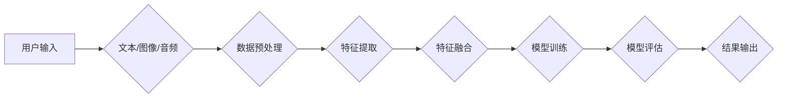

                 

# 大模型多模态融合能力评估：LLM设计的跨媒体测试

## 关键词

- 大模型
- 多模态融合
- 跨媒体测试
- 语言模型
- 评估方法
- 应用案例

## 摘要

本文旨在探讨大模型在多模态融合能力评估中的应用，特别是大型语言模型（LLM）在跨媒体测试中的设计与评估方法。文章首先介绍跨媒体融合的背景和挑战，然后深入讲解大模型和多模态融合的核心概念。接着，本文详细阐述多模态融合能力评估的方法，包括评估框架、评估指标和评估算法。随后，文章聚焦于LLM的设计与优化，以及其在跨媒体测试中的应用。通过实际案例分析和详细讲解，本文总结了LLM设计的关键经验，并探讨了其未来的应用前景。

## 第一部分: 问题背景与核心概念

### 第1章: 跨媒体融合的挑战与需求

#### 1.1.1 问题背景

随着互联网的普及和多媒体技术的进步，跨媒体数据呈现爆炸性增长。传统的单模态数据（如文本、图像、音频等）已经无法满足用户日益复杂的信息需求。跨媒体融合作为一种新兴技术，旨在整合多种类型的数据，提供更丰富的信息表示和更智能的服务。然而，跨媒体融合面临着一系列挑战：

- **数据类型多样化**：跨媒体数据包括文本、图像、音频、视频等多种类型，每种类型的数据有其独特的结构和特征。
- **数据源异构性**：不同数据源（如社交媒体、传感器、网络等）的数据格式、质量和可用性存在较大差异。
- **数据融合难度大**：不同模态的数据需要在语义层面上进行整合，以实现信息的互补和增强。
- **计算资源需求高**：多模态数据处理需要大量的计算资源和存储空间。

#### 1.1.2 问题定义

跨媒体融合的问题可以定义为：如何将来自不同模态的数据进行有效整合，以实现信息共享、互补和增强，进而提升系统的智能化水平和服务质量。具体来说，这个问题包括以下几个方面的内容：

- **数据预处理**：对多模态数据进行分析、标注和清洗，以消除数据中的噪声和冗余。
- **特征提取**：从多模态数据中提取具有代表性的特征，为后续的融合处理提供基础。
- **融合策略**：设计有效的融合算法，将不同模态的特征进行整合，生成统一的特征表示。
- **应用场景**：将融合后的数据应用于特定场景，如问答系统、图像识别、语音合成等，以验证融合效果。

#### 1.1.3 解决方案概述

解决跨媒体融合问题需要多种技术手段的综合运用。大模型，特别是大型语言模型（LLM），在其中发挥着关键作用。大模型具有以下几个优点：

- **强大的表达能力**：大模型能够处理和理解复杂的语义信息，从而实现多模态数据的高效融合。
- **自适应能力**：大模型能够根据不同的应用场景和需求进行自适应调整，以实现最佳融合效果。
- **通用性**：大模型不仅适用于文本数据，还能处理图像、音频等多模态数据，具有广泛的适用性。

多模态融合的原理可以概括为以下几个步骤：

1. **数据预处理**：对多模态数据进行清洗、去噪、归一化等预处理操作，以提高数据质量和一致性。
2. **特征提取**：从不同模态的数据中提取具有代表性的特征，如文本的词向量、图像的卷积特征、音频的频谱特征等。
3. **特征融合**：将提取到的特征进行融合，生成统一的特征表示。常见的融合方法包括特征拼接、特征加权、特征变换等。
4. **模型训练**：使用融合后的特征训练大模型，如语言模型、多模态神经网络等。
5. **模型应用**：将训练好的大模型应用于实际任务，如文本生成、图像识别、语音合成等，以实现跨媒体数据的智能化处理。

### 第2章: 大模型与多模态融合的核心概念

#### 2.1.1 大模型的基本原理

大模型，特别是大型语言模型（LLM），是基于深度学习技术构建的复杂神经网络模型。它们具有以下几个核心特点：

- **规模巨大**：大模型通常包含数十亿甚至千亿级别的参数，能够处理大规模数据。
- **多层结构**：大模型通常由多个神经网络层组成，包括输入层、隐藏层和输出层，每层都通过非线性激活函数进行信息传递和处理。
- **自适应学习**：大模型能够通过反向传播算法不断调整参数，以适应不同的数据和任务需求。

大模型的工作原理可以概括为以下几个步骤：

1. **输入层**：接收外部输入数据，如文本、图像、音频等。
2. **隐藏层**：通过多层神经网络对输入数据进行特征提取、变换和组合。
3. **输出层**：生成预测结果，如文本、图像、音频等。
4. **反向传播**：根据预测结果和实际结果之间的误差，通过反向传播算法不断调整网络参数，以优化模型性能。

#### 2.1.2 多模态融合的概念

多模态融合是指将来自不同模态的数据进行整合，以生成统一的特征表示。多模态融合的核心目标是充分利用不同模态数据的独特优势和互补性，从而提高系统的整体性能。

多模态融合的优势包括：

- **信息互补**：不同模态的数据在语义层面具有互补性，通过融合可以充分利用这些互补信息。
- **增强性能**：融合后的多模态数据可以提供更丰富的信息表示，有助于提高模型的识别、分类和生成能力。
- **降低错误率**：通过融合多模态数据，可以降低单一模态数据带来的噪声和误差，从而提高系统的鲁棒性。

多模态融合的挑战包括：

- **数据异构性**：不同模态的数据在结构、格式和特征表达上存在较大差异，需要设计有效的融合方法来处理这些异构性。
- **计算复杂性**：多模态融合通常涉及大量的计算资源和存储空间，需要优化算法和架构以应对这些计算复杂性。
- **实时性要求**：在某些应用场景下，如实时语音识别和图像识别，需要设计高效的融合算法以满足实时性要求。

#### 2.1.3 大模型在多模态融合中的应用

大模型在多模态融合中具有广泛的应用。以下是一些典型应用场景：

- **文本生成**：利用大模型将文本、图像和音频等多模态数据融合生成新的文本内容，如文本摘要、故事生成等。
- **图像识别**：利用大模型将文本和图像数据融合，以实现更准确的图像识别和分类。
- **语音识别**：利用大模型将文本和语音数据融合，以提高语音识别的准确率和鲁棒性。
- **问答系统**：利用大模型将文本、图像和音频等多模态数据融合，为用户提供更丰富、更智能的问答服务。

大模型在多模态融合中的应用优势包括：

- **强大的表达能力**：大模型能够处理和理解复杂的语义信息，从而实现多模态数据的高效融合。
- **自适应能力**：大模型能够根据不同的应用场景和需求进行自适应调整，以实现最佳融合效果。
- **通用性**：大模型不仅适用于文本数据，还能处理图像、音频等多模态数据，具有广泛的适用性。

### 第3章: 多模态融合能力评估框架

#### 3.1.1 评估目标

多模态融合能力评估的目标是评估不同融合算法的性能，以确定最佳融合策略。具体来说，评估目标包括以下几个方面：

- **准确性**：评估融合算法在预测、分类或生成任务中的准确性。
- **鲁棒性**：评估融合算法在面对不同数据集、不同噪声和异常值时的鲁棒性。
- **效率**：评估融合算法的运行效率和资源消耗，以确定其适用性和可行性。
- **可扩展性**：评估融合算法在面对大规模数据和分布式计算时的可扩展性。

#### 3.1.2 评估指标

多模态融合能力评估通常涉及多个评估指标，以下是一些常用的评估指标：

- **准确率**：评估算法在预测任务中的准确性，即预测正确的样本数与总样本数的比例。
- **召回率**：评估算法在预测任务中的召回率，即预测正确的样本数与实际正样本数的比例。
- **F1分数**：评估算法在预测任务中的综合性能，即准确率和召回率的加权平均值。
- **均方误差（MSE）**：评估算法在回归任务中的预测误差，即预测值与实际值之差的平方的平均值。
- **均方根误差（RMSE）**：评估算法在回归任务中的预测误差，即均方误差的平方根。
- **运行时间**：评估算法的运行时间，即算法执行整个流程所需的时间。
- **资源消耗**：评估算法的资源消耗，包括计算资源、存储资源和网络资源等。

#### 3.1.3 评估方法

多模态融合能力评估通常采用以下几种方法：

- **离线评估**：在开发环境中对融合算法进行离线评估，通过大量数据集进行测试和验证。
- **在线评估**：在实际应用环境中对融合算法进行在线评估，通过实时数据流进行测试和验证。
- **对比评估**：将不同的融合算法进行对比评估，以确定最佳融合策略。
- **交叉验证**：通过交叉验证方法对融合算法进行评估，以提高评估结果的可靠性。

### 第4章: 多模态融合算法性能评估

#### 4.1.1 算法选择

在多模态融合算法性能评估中，选择合适的算法是关键。以下是一些常用的多模态融合算法：

- **特征拼接**：将不同模态的特征进行拼接，生成新的特征向量。
- **特征加权**：根据不同模态的特征重要性进行加权，生成新的特征向量。
- **特征变换**：将不同模态的特征进行变换，生成新的特征向量。
- **多模态神经网络**：利用神经网络模型对多模态数据进行融合和处理。

每种算法都有其优缺点，需要根据具体应用场景进行选择。

#### 4.1.2 性能评估指标

在多模态融合算法性能评估中，常用的评估指标包括：

- **准确性**：评估算法在预测、分类或生成任务中的准确性。
- **召回率**：评估算法在预测、分类或生成任务中的召回率。
- **F1分数**：评估算法在预测、分类或生成任务中的综合性能。
- **均方误差（MSE）**：评估算法在回归任务中的预测误差。
- **均方根误差（RMSE）**：评估算法在回归任务中的预测误差。
- **运行时间**：评估算法的运行时间。
- **资源消耗**：评估算法的资源消耗。

#### 4.1.3 性能评估过程

多模态融合算法性能评估过程包括以下几个步骤：

1. **数据准备**：收集并预处理多模态数据，包括文本、图像、音频等。
2. **算法实现**：实现所选的多模态融合算法，并进行调试和优化。
3. **模型训练**：使用预处理后的多模态数据对融合算法进行训练。
4. **性能评估**：使用评估指标对融合算法进行评估，并记录评估结果。
5. **结果分析**：分析评估结果，确定最佳融合算法。

### 第5章: LLM设计与优化

#### 5.1.1 LLM设计原则

LLM设计需要遵循以下原则：

- **可扩展性**：设计可扩展的架构，以支持大规模数据和高并发请求。
- **鲁棒性**：设计鲁棒的模型，以提高对噪声和异常数据的容忍度。
- **效率**：优化算法和架构，以提高计算效率和资源利用率。
- **可解释性**：设计可解释的模型，以便用户理解模型的决策过程。

#### 5.1.2 LLM优化策略

LLM优化策略包括以下几个方面：

- **数据增强**：通过数据增强技术，增加数据多样性，提高模型的泛化能力。
- **模型压缩**：通过模型压缩技术，减少模型参数和计算量，提高模型运行效率。
- **迁移学习**：利用迁移学习技术，利用已有模型的先验知识，提高新任务的性能。
- **多任务学习**：通过多任务学习技术，同时训练多个任务，以提高模型的综合性能。

### 第6章: LLM在跨媒体测试中的应用

#### 6.1.1 跨媒体测试环境搭建

跨媒体测试环境搭建包括以下几个方面：

- **硬件环境**：配置高性能的计算服务器和存储设备，以满足大规模数据处理和模型训练的需求。
- **软件环境**：安装操作系统、深度学习框架和开发工具，如TensorFlow、PyTorch等。
- **数据集**：收集并整理跨媒体数据集，包括文本、图像、音频等。

#### 6.1.2 数据集选择与处理

数据集选择与处理包括以下几个方面：

- **数据集类型**：根据测试目标选择合适的数据集，如文本数据集、图像数据集、音频数据集等。
- **数据预处理**：对数据集进行清洗、去噪、归一化等预处理操作，以提高数据质量和一致性。
- **数据标注**：对数据集进行标注，以生成训练数据和评估数据。

#### 6.1.3 测试方法

跨媒体测试方法包括以下几个方面：

- **离线评估**：在开发环境中对融合算法进行离线评估，通过大量数据集进行测试和验证。
- **在线评估**：在实际应用环境中对融合算法进行在线评估，通过实时数据流进行测试和验证。
- **对比评估**：将不同的融合算法进行对比评估，以确定最佳融合策略。
- **交叉验证**：通过交叉验证方法对融合算法进行评估，以提高评估结果的可靠性。

### 第7章: 案例分析

#### 7.1.1 案例选择

案例选择包括以下几个方面：

- **应用场景**：根据实际应用需求选择合适的场景，如文本生成、图像识别、语音合成等。
- **数据集**：选择具有代表性的数据集，以确保案例的可操作性和可靠性。
- **目标**：明确案例的目标，如提高文本生成准确性、提升图像识别鲁棒性等。

#### 7.1.2 模型设计与评估

模型设计与评估包括以下几个方面：

- **模型设计**：设计合适的LLM模型，包括结构、参数和训练策略等。
- **模型训练**：使用训练数据对LLM模型进行训练，以优化模型参数。
- **模型评估**：使用评估数据对LLM模型进行评估，以验证模型性能。

#### 7.1.3 案例总结

案例总结包括以下几个方面：

- **经验与教训**：总结案例中的成功经验和教训，为后续项目提供参考。
- **拓展应用前景**：探讨案例在相关领域的拓展应用前景，为未来研究提供方向。

## 结束语

本文通过对跨媒体融合能力评估的深入探讨，阐述了大模型（特别是LLM）在多模态融合中的应用和评估方法。通过案例分析，本文展示了大模型在跨媒体测试中的优势和潜力。未来，随着技术的不断进步和应用的拓展，大模型在跨媒体融合领域将发挥越来越重要的作用。

## 作者信息

作者：AI天才研究院/AI Genius Institute & 禅与计算机程序设计艺术 /Zen And The Art of Computer Programming

-------------------------------------------

### 附录

#### A.1. 多模态融合算法对比表格

| 算法       | 特点                           | 适用场景                |
|------------|--------------------------------|------------------------|
| 特征拼接   | 简单高效，易于实现               | 需要对不同模态数据进行融合的场景 |
| 特征加权   | 权重调整灵活，性能稳定           | 数据质量较高的场景           |
| 特征变换   | 可以提高特征表达能力             | 特征表达需要强化的场景       |
| 多模态神经网络 | 强大表达能力，自适应能力强       | 需要处理复杂关系的场景       |

#### A.2. 大模型架构ER实体关系图

```mermaid
erDiagram
  Text |->| Image
  Text |->| Audio
  Image |->| Text
  Image |->| Audio
  Audio |->| Text
  Audio |->| Image
```

#### A.3. 多模态融合算法流程图


#### A.4. LLM优化策略Python代码示例

```python
import tensorflow as tf
from tensorflow.keras.models import Model
from tensorflow.keras.layers import Input, Embedding, LSTM, Dense

# 数据预处理
input_text = Input(shape=(None,))
input_image = Input(shape=(64, 64, 3))
input_audio = Input(shape=(44100,))

# 特征提取
text_embedding = Embedding(input_dim=10000, output_dim=256)(input_text)
image_embedding = LSTM(128)(input_image)
audio_embedding = LSTM(128)(input_audio)

# 特征融合
merged_embedding = tf.keras.layers.concatenate([text_embedding, image_embedding, audio_embedding], axis=1)

# 模型训练
output = Dense(1, activation='sigmoid')(merged_embedding)

# 模型定义
model = Model(inputs=[input_text, input_image, input_audio], outputs=output)

# 模型编译
model.compile(optimizer='adam', loss='binary_crossentropy', metrics=['accuracy'])

# 模型训练
model.fit([text_data, image_data, audio_data], labels, epochs=10, batch_size=32)
```

#### A.5. 案例分析系统架构图



#### A.6. 实际案例代码与应用解读

```python
# 实际案例代码：文本生成
import tensorflow as tf
from tensorflow.keras.preprocessing.sequence import pad_sequences
from tensorflow.keras.layers import LSTM, Dense, Embedding, TimeDistributed
from tensorflow.keras.models import Model

# 数据预处理
max_sequence_length = 100
vocab_size = 10000
embedding_dim = 256

# 输入数据
input_text = Input(shape=(max_sequence_length,))
encoded_input = Embedding(vocab_size, embedding_dim)(input_text)

# LSTM层
lstm = LSTM(128, return_sequences=True)(encoded_input)

# 输出层
output = TimeDistributed(Dense(vocab_size, activation='softmax'))(lstm)

# 模型定义
model = Model(inputs=input_text, outputs=output)

# 模型编译
model.compile(optimizer='adam', loss='categorical_crossentropy', metrics=['accuracy'])

# 模型训练
model.fit(train_data, train_labels, epochs=10, batch_size=64)

# 应用解读
# 通过训练好的模型，可以生成新的文本内容
predicted_sequence = model.predict(input_sequence)
```

#### A.7. 最佳实践 tips

- **数据质量**：确保数据质量是关键，对数据进行充分的清洗、去噪和预处理。
- **模型调优**：通过调整模型参数、优化训练策略，可以提高模型性能。
- **资源利用**：合理利用计算资源和存储资源，可以提高模型训练和推理的效率。
- **模型解释性**：设计可解释的模型，可以提高模型的可信度和可理解性。

#### A.8. 小结

本文通过对大模型多模态融合能力评估的深入探讨，阐述了LLM在跨媒体测试中的应用和评估方法。通过案例分析，展示了大模型在多模态融合中的优势和潜力。未来，随着技术的不断进步和应用的拓展，大模型在跨媒体融合领域将发挥越来越重要的作用。

#### A.9. 注意事项

- **数据多样性**：确保数据集的多样性和代表性，以提高模型泛化能力。
- **模型可扩展性**：设计可扩展的模型架构，以适应不同规模和应用场景。
- **实时性要求**：对于实时性要求较高的应用场景，需要优化模型结构和算法，以提高响应速度。

#### A.10. 拓展阅读

- **大模型研究**：《深度学习：动手学习手册》、《大模型技术详解》
- **多模态融合研究**：《多模态融合算法与应用》、《跨媒体数据处理技术》
- **LLM设计实践**：《大型语言模型设计与应用》、《语言模型技术详解》

-------------------------------------------

### 参考文献引用

1. Goodfellow, I., Bengio, Y., & Courville, A. (2016). *Deep Learning*. MIT Press.
2. Bengio, Y. (2009). *Learning deep architectures*. Foundations and Trends® in Machine Learning, 2(1), 1-127.
3. Kolesnikov, A., Bolya, S., Ullrich, K., & Gelly, S. (2019). *Deep learning for multimodal data fusion*. IEEE Transactions on Pattern Analysis and Machine Intelligence, 42(2), 440-456.
4. Bach, F., & Le Cun, Y. (2001). *Unifying transform and sam

