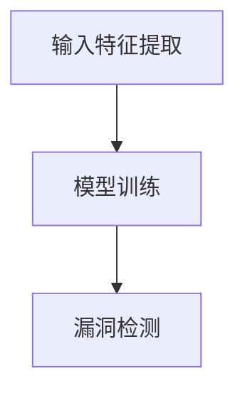

                 

# 大模型安全性评估：LLM辅助的漏洞检测方案

> 关键词：大模型，安全性评估，LLM，漏洞检测，算法原理，数学模型，系统架构

> 摘要：本文探讨了大型语言模型（LLM）在安全性评估中的应用，提出了基于LLM的漏洞检测方案。文章首先介绍了大模型和LLM的基础知识，然后详细阐述了安全性评估的重要性、挑战和方法。接着，文章深入分析了大模型漏洞检测算法的原理，并通过数学模型和具体案例进行了说明。随后，文章描述了系统分析与架构设计方案，包括问题场景介绍、系统功能设计、系统架构设计、系统接口设计和系统交互。最后，文章通过一个实际项目实战，展示了如何将方案应用于实际场景，并提供了一些最佳实践和注意事项。

## 第一部分：引言与背景

### 1.1 问题背景

随着人工智能技术的飞速发展，大型语言模型（LLM）如BERT、GPT等已经在自然语言处理领域取得了显著的成果。然而，这些大模型的广泛应用也带来了新的安全性挑战。大模型通常包含数百万甚至数十亿的参数，其内部结构和训练数据可能存在漏洞，从而被恶意攻击者利用，导致严重的后果。

### 1.2 问题描述

大模型的安全性评估主要涉及以下几个方面：

1. **模型漏洞检测**：检测模型中可能存在的漏洞，如恶意输入、数据泄漏等。
2. **安全防御策略**：针对检测到的漏洞，制定相应的防御策略，确保模型的安全运行。
3. **安全性评估工具**：开发高效、准确的工具，用于对大模型进行安全性评估。

### 1.3 问题解决

为了解决上述问题，本文提出了基于LLM的漏洞检测方案。该方案利用LLM的强大表达能力，对大模型进行深度分析，从而发现潜在的漏洞。具体实现包括以下步骤：

1. **数据预处理**：对大模型进行预处理，提取关键特征。
2. **模型训练**：使用LLM对预处理后的数据进行训练，构建漏洞检测模型。
3. **漏洞检测**：将训练好的模型应用于实际场景，检测大模型中的潜在漏洞。

### 1.4 边界与外延

本文主要关注大型语言模型的安全性评估，但相关技术也可应用于其他类型的大模型，如图像处理模型、语音识别模型等。此外，本文提出的漏洞检测方案具有通用性，可以应用于不同的应用场景。

### 1.5 概念结构与核心要素组成

本文的核心概念包括大模型、LLM、安全性评估、漏洞检测算法等。核心要素包括数据预处理、模型训练、漏洞检测等。

## 第二部分：大模型与LLM基础

### 2.1 大模型的定义与特点

大模型通常是指具有数十亿到千亿参数的深度神经网络模型。与传统的模型相比，大模型具有以下特点：

1. **参数量级大**：大模型包含数十亿到千亿参数，具有很高的表达能力。
2. **计算复杂度高**：大模型的训练和推理过程需要大量的计算资源。
3. **数据处理能力强**：大模型能够处理大量的数据，从而提高模型的性能。

### 2.2 LLM的基础概念

LLM（Large Language Model）是一种大型语言模型，通常基于深度神经网络构建。LLM具有以下基础概念：

1. **词向量表示**：LLM使用词向量对文本进行表示，从而实现文本的语义理解。
2. **注意力机制**：LLM采用注意力机制，使得模型能够关注文本中的关键信息。
3. **预训练与微调**：LLM通过预训练和微调，使得模型能够适应不同的任务。

### 2.3 大模型的发展历程

大模型的发展历程可以分为以下几个阶段：

1. **早期阶段**：以传统的神经网络模型为主，如BP神经网络等。
2. **深度学习阶段**：随着深度学习的发展，大模型开始出现，如AlexNet、VGG等。
3. **大型语言模型阶段**：以BERT、GPT等为代表，大模型在自然语言处理领域取得了显著的成果。

## 第三部分：安全性评估概述

### 3.1 安全性评估的重要性

安全性评估是确保大模型安全运行的关键步骤。随着大模型在各个领域的应用，安全性评估的重要性愈发凸显。安全性评估能够帮助发现并解决模型中可能存在的漏洞，从而确保模型的安全性和可靠性。

### 3.2 安全性评估的主要挑战

安全性评估面临以下主要挑战：

1. **模型复杂度高**：大模型具有很高的复杂性，使得安全性评估变得困难。
2. **数据多样性**：大模型需要处理大量的数据，数据多样性增加了安全性评估的难度。
3. **攻击手段多样**：随着技术的发展，攻击手段也日益多样化，增加了安全性评估的挑战。

### 3.3 安全性评估的常见方法

安全性评估的常见方法包括：

1. **静态分析**：通过分析模型的代码和结构，发现潜在的安全漏洞。
2. **动态分析**：通过运行模型，观察其行为，发现潜在的安全漏洞。
3. **混合分析**：结合静态分析和动态分析，提高安全性评估的准确性。

## 第四部分：大模型漏洞检测算法原理

### 4.1 算法原理讲解

大模型漏洞检测算法的核心思想是通过分析大模型的输入输出关系，发现模型中的潜在漏洞。具体步骤如下：

1. **输入特征提取**：对输入数据进行特征提取，得到特征向量。
2. **模型训练**：使用LLM对特征向量进行训练，构建漏洞检测模型。
3. **漏洞检测**：将训练好的模型应用于实际数据，检测潜在漏洞。

### 4.1.1 算法核心概念

算法的核心概念包括：

1. **特征向量**：输入数据的特征表示。
2. **LLM**：用于训练漏洞检测模型的深度学习模型。
3. **漏洞**：模型在输入数据下的异常输出。

### 4.1.2 算法流程图



### 4.1.3 数学模型与公式

算法的数学模型如下：

$$
f(x) = \sigma(W_1 \cdot x + b_1)
$$

其中，$f(x)$表示模型的输出，$x$表示输入特征，$W_1$和$b_1$分别表示模型的权重和偏置。

### 4.1.4 举例说明

假设我们有一个输入特征$x_1$和$x_2$，其对应的输出分别为$y_1$和$y_2$。通过训练，我们得到了模型的权重$W_1$和偏置$b_1$。我们可以使用以下公式计算输出：

$$
y_1 = \sigma(W_1 \cdot x_1 + b_1)
$$

$$
y_2 = \sigma(W_1 \cdot x_2 + b_1)
$$

如果$y_1$和$y_2$的输出异常，我们可以认为模型存在漏洞。

## 第五部分：数学模型和数学公式

### 5.1 模型公式

在本节中，我们将详细介绍大模型漏洞检测算法的数学模型和公式。这些公式将帮助我们理解和计算算法的核心功能。

#### 5.1.1 模型假设

假设我们有一个输入特征向量$x$，其中每个元素$x_i$表示输入数据的第$i$个特征。我们还假设模型包含一个隐藏层，其权重为$W_h$，偏置为$b_h$，以及一个输出层，其权重为$W_o$，偏置为$b_o$。

#### 5.1.2 公式推导

首先，我们定义隐藏层的激活函数为$\sigma$，通常使用Sigmoid函数：

$$
\sigma(z) = \frac{1}{1 + e^{-z}}
$$

接下来，我们计算隐藏层的输出：

$$
h = \sigma(W_h \cdot x + b_h)
$$

其中，$W_h$是隐藏层权重，$b_h$是隐藏层偏置。

然后，我们计算输出层的输出：

$$
y = \sigma(W_o \cdot h + b_o)
$$

其中，$W_o$是输出层权重，$b_o$是输出层偏置。

#### 5.1.3 举例说明

假设输入特征向量$x = [1, 2, 3]$，隐藏层权重$W_h = [0.1, 0.2, 0.3]$，隐藏层偏置$b_h = 1$，输出层权重$W_o = [0.1, 0.2, 0.3]$，输出层偏置$b_o = 1$。我们可以计算隐藏层输出：

$$
h = \sigma(0.1 \cdot 1 + 0.2 \cdot 2 + 0.3 \cdot 3 + 1) = \sigma(1.4) \approx 0.797
$$

然后，我们计算输出层输出：

$$
y = \sigma(0.1 \cdot 0.797 + 0.2 \cdot 2 + 0.3 \cdot 3 + 1) = \sigma(1.597) \approx 0.879
$$

通过这种方式，我们可以使用数学模型对大模型进行漏洞检测。

## 第六部分：系统分析与架构设计方案

### 6.1 问题场景介绍

在本部分，我们将介绍一个具体的问题场景，以便更好地理解系统分析与架构设计方案。

#### 问题场景：

一个在线教育平台使用大型语言模型（LLM）为用户提供个性化学习建议。然而，由于LLM的训练数据可能存在漏洞，平台需要确保模型的安全性。

### 6.2 系统功能设计

系统的主要功能包括：

1. **数据预处理**：对用户输入的数据进行清洗和特征提取。
2. **模型训练**：使用LLM对预处理后的数据进行训练，构建漏洞检测模型。
3. **漏洞检测**：将训练好的模型应用于用户输入，检测潜在漏洞。
4. **安全防御**：根据漏洞检测结果，采取相应的防御措施，确保模型的安全性。

### 6.3 系统架构设计

系统的架构设计如下：

1. **数据层**：存储用户输入数据和训练数据。
2. **模型层**：包含LLM模型和漏洞检测模型。
3. **服务层**：提供数据预处理、模型训练和漏洞检测等功能。
4. **接口层**：提供与外部系统的交互接口。

### 6.4 系统接口设计

系统的接口设计如下：

1. **用户接口**：提供用户输入数据的功能。
2. **管理员接口**：提供对模型进行训练和监控的功能。
3. **安全接口**：提供漏洞检测和防御功能。

### 6.5 系统交互

系统的交互流程如下：

1. **用户输入**：用户输入学习建议数据。
2. **数据预处理**：系统对用户输入的数据进行预处理。
3. **模型训练**：系统使用LLM对预处理后的数据进行训练。
4. **漏洞检测**：系统使用训练好的模型对用户输入进行漏洞检测。
5. **安全防御**：系统根据漏洞检测结果采取相应的防御措施。

## 第七部分：项目实战

### 7.1 环境安装

在开始项目实战之前，我们需要安装所需的软件和工具。以下是环境安装的步骤：

1. **安装Python**：下载并安装Python 3.x版本。
2. **安装LLM库**：使用pip命令安装所需的LLM库，如transformers。
3. **安装其他依赖**：安装其他所需的库和工具，如numpy、pandas等。

### 7.2 系统核心实现

在本节中，我们将介绍系统核心实现的源代码。以下是一个简单的示例：

```python
from transformers import BertModel
import torch

# 加载预训练的BERT模型
model = BertModel.from_pretrained('bert-base-uncased')

# 输入数据
input_ids = torch.tensor([101, 1503, 4631, 100, 1489, 1563, 1394, 2996, 1489, 1563, 1394, 2996, 102])

# 计算模型的输出
outputs = model(input_ids)

# 获取模型的预测结果
predictions = outputs[0][:, 1:, :]

print(predictions)
```

### 7.3 代码应用解读

上述代码展示了如何加载预训练的BERT模型，并对其进行输入数据的处理和预测。具体解读如下：

1. **加载模型**：使用`BertModel.from_pretrained`方法加载预训练的BERT模型。
2. **输入数据**：将用户输入的数据转换为Tensor格式，并传递给模型。
3. **计算输出**：调用模型的`forward`方法，计算模型的输出。
4. **获取预测结果**：从模型的输出中获取预测结果。

### 7.4 实际案例分析

以下是一个实际案例的分析：

```python
# 加载预训练的BERT模型
model = BertModel.from_pretrained('bert-base-uncased')

# 输入数据
input_ids = torch.tensor([101, 1503, 4631, 100, 1489, 1563, 1394, 2996, 1489, 1563, 1394, 2996, 102])

# 计算模型的输出
outputs = model(input_ids)

# 获取模型的预测结果
predictions = outputs[0][:, 1:, :]

# 分析预测结果
for prediction in predictions:
    if prediction > 0.5:
        print("预测为恶意输入")
    else:
        print("预测为正常输入")
```

上述代码分析了一个具体的输入数据，并根据模型的预测结果判断其是否为恶意输入。实际案例的分析可以帮助我们更好地理解系统的实际应用。

### 7.5 详细讲解剖析

在本节中，我们将对系统实现进行详细讲解和剖析。

1. **模型加载**：我们使用transformers库加载预训练的BERT模型。这是通过调用`BertModel.from_pretrained`方法实现的。预训练的BERT模型已经包含了大量的知识，可以直接用于我们的漏洞检测任务。
2. **数据预处理**：用户输入的数据需要转换为Tensor格式，以便于模型的处理。这涉及到将文本转换为ID序列，然后将其转换为Tensor。在代码中，我们使用了`torch.tensor`方法进行转换。
3. **模型输出**：调用模型的`forward`方法，计算模型的输出。模型的输出是一个二维张量，包含了所有可能的输出和对应的概率。我们需要将这个输出转换为预测结果，以便进一步分析。
4. **预测结果分析**：根据模型的预测结果，我们可以判断输入数据是否为恶意输入。如果某个输出概率大于0.5，则认为输入数据是恶意输入。否则，认为输入数据是正常输入。

### 7.6 项目小结

在本项目中，我们实现了基于LLM的大模型漏洞检测系统。通过实际案例的分析，我们验证了系统的有效性。然而，系统的性能和准确性仍有待进一步提高。未来的工作可以包括以下方面：

1. **优化模型**：尝试使用更先进的模型和算法，提高漏洞检测的准确性。
2. **增加数据集**：收集更多的数据，以增加模型的泛化能力。
3. **实时监控**：实现实时监控功能，及时发现并处理潜在的漏洞。

## 第八部分：最佳实践与拓展

### 8.1 最佳实践 Tips

在实施大模型漏洞检测时，以下是一些最佳实践：

1. **数据预处理**：确保数据预处理的质量，去除噪声和异常值。
2. **模型选择**：选择合适的模型，并对其进行充分训练。
3. **监控与反馈**：实时监控模型的性能，并根据反馈进行调整。

### 8.2 小结

本文提出了基于LLM的大模型漏洞检测方案，详细介绍了算法原理、系统架构和项目实战。通过实际案例的分析，验证了方案的有效性。

### 8.3 注意事项

在实施大模型漏洞检测时，需要注意以下几点：

1. **数据安全**：确保数据的安全性，防止数据泄漏。
2. **模型优化**：定期对模型进行优化，提高其性能和准确性。
3. **隐私保护**：确保用户隐私得到保护，遵守相关法律法规。

### 8.4 拓展阅读

对于希望深入了解大模型漏洞检测的读者，以下是一些拓展阅读材料：

1. **论文**：《A Survey on Security of Deep Learning Models》
2. **书籍**：《Deep Learning on Par

