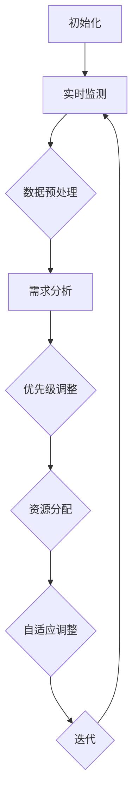
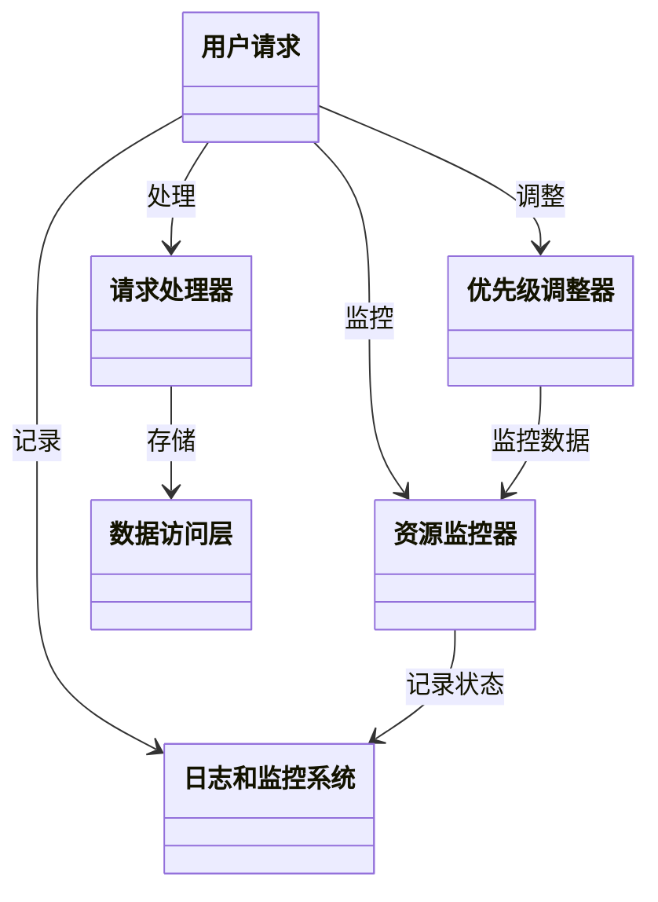
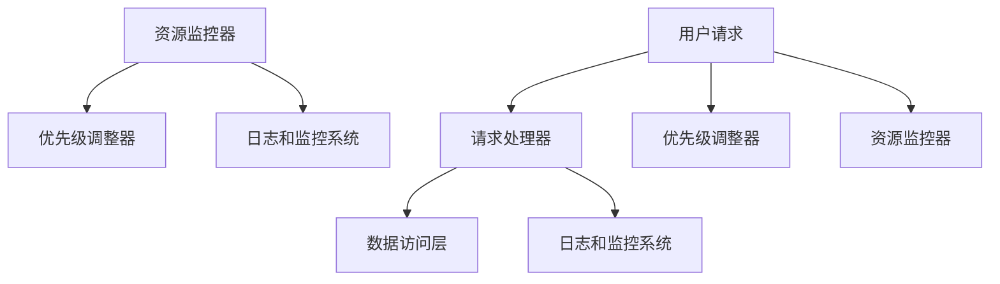

                 


## 第1章：问题的起源与现状

### 1.1 问题背景

大模型应用已经成为人工智能领域的热点话题，这些模型通过学习海量数据，能够实现复杂任务的高效解决。然而，随着应用场景的不断扩大和复杂化，如何在众多需求中确定合理的优先级，成为一个亟待解决的问题。

当前，大模型的应用场景包括但不限于自然语言处理、图像识别、推荐系统、自动驾驶等多个领域。例如，在自然语言处理领域，大模型被用于生成文章、翻译文本、语音识别等任务；在图像识别领域，大模型被用于人脸识别、物体检测等任务；在推荐系统领域，大模型被用于用户偏好分析、商品推荐等任务；在自动驾驶领域，大模型被用于路径规划、环境感知等任务。

### 1.1.1 大模型应用的现状

大模型应用正迅速发展，但同时也面临着诸多挑战。首先，不同应用场景的需求复杂且多样，如何在这些需求中找到合理的优先级，成为一大难题。其次，大模型的训练和部署成本高昂，如何在资源有限的情况下最大化模型的效果，也是一个重要问题。

目前，常见的解决方法主要包括以下几种：

1. **固定优先级方法**：在项目初期，根据业务需求和分析，设定一个固定的优先级顺序，然后按照这个顺序执行。这种方法简单直观，但无法根据实际情况进行调整，容易导致资源分配不合理。

2. **静态调整方法**：在项目执行过程中，根据某些固定的规则或阈值，对需求优先级进行动态调整。这种方法在一定程度上能够适应变化，但调整规则过于简单，无法准确反映实际需求。

3. **专家评估方法**：通过专家的经验和判断，对需求优先级进行动态调整。这种方法依赖于专家的经验和知识，无法保证公平和客观。

### 1.1.2 应用场景的多样性

大模型应用场景的多样性增加了需求优先级调整的难度。不同应用场景的需求和目标不同，有些场景需要更高的准确度，有些场景需要更高的速度，还有些场景需要更高的鲁棒性。如何在这些不同需求中找到平衡，成为动态调整需求优先级的关键。

例如，在自动驾驶领域，安全性和鲁棒性是首要考虑的因素，因此与速度和舒适性的需求相比，安全性和鲁棒性的优先级要高得多。而在自然语言处理领域，生成文章的准确度和流畅度是关键，因此与翻译的准确性相比，生成文章的流畅度可能更加重要。

### 1.1.3 需求优先级调整的挑战

需求优先级调整面临的挑战主要包括：

1. **复杂性和多样性**：不同应用场景的需求复杂且多样，如何在这些需求中找到合理的优先级，是一个复杂的决策过程。

2. **实时性和动态性**：需求优先级需要根据实际情况进行实时调整，如何保证调整的实时性和准确性，是一个重要问题。

3. **资源有限**：在资源有限的情况下，如何最大化模型的效用，是一个重要的权衡问题。

4. **公平性和客观性**：需求优先级的调整需要保证公平性和客观性，避免主观偏见和资源浪费。

### 1.2 问题描述

#### 1.2.1 需求优先级调整的定义

需求优先级调整是指根据不同应用场景的需求和目标，动态地调整需求执行的优先级，以最大化模型的效用。

#### 1.2.2 动态调整的必要性

动态调整需求优先级是必要的，因为：

1. **应用场景的多样性**：不同应用场景的需求和目标不同，静态的优先级设定无法满足所有场景。

2. **需求的实时变化**：应用场景的需求会随着时间和环境的变化而变化，静态的优先级设定无法适应这些变化。

3. **资源优化**：动态调整需求优先级可以在资源有限的情况下，最大化模型的效用。

#### 1.2.3 需求优先级调整的影响因素

需求优先级调整受到多种因素的影响，包括：

1. **业务需求**：业务需求是决定需求优先级的核心因素，不同的业务需求对模型性能有不同的要求。

2. **数据质量**：数据质量直接影响模型的效果，高质量的数据应该得到更高的优先级。

3. **资源限制**：资源限制包括计算资源、存储资源和网络资源等，这些资源限制会影响需求优先级的调整。

4. **时间因素**：某些需求可能需要在特定时间内完成，时间因素会影响需求优先级的调整。

### 1.3 解决方案概述

为了解决需求优先级调整的问题，我们提出了以下动态调整方法：

#### 1.3.1 动态调整方法的基本原理

动态调整方法基于实时监测和自适应调整原理，通过实时收集和分析应用场景的需求和资源情况，动态地调整需求优先级。

#### 1.3.2 动态调整方法的优势

动态调整方法具有以下优势：

1. **适应性**：能够根据实时变化的应用场景和需求，动态调整优先级。

2. **效率**：在资源有限的情况下，能够最大化模型的效用。

3. **灵活性**：能够适应不同应用场景的需求。

4. **公平性**：通过算法，保证需求优先级的调整具有公平性。

#### 1.3.3 适用范围与边界条件

动态调整方法适用于需要动态调整需求优先级的所有应用场景，包括但不限于自然语言处理、图像识别、推荐系统、自动驾驶等。

#### 1.3.4 边界与外延

1. **边界条件**：动态调整方法需要满足一定的条件，如数据的实时性、资源的充足性等。

2. **非适用场景**：对于一些需求明确、资源充足且变化较小的应用场景，动态调整方法可能不是最优选择。

### 1.4 概念结构与核心要素组成

动态调整方法由以下几个核心要素组成：

1. **实时监测系统**：用于实时收集和分析应用场景的需求和资源情况。

2. **优先级调整算法**：用于根据实时监测数据，动态调整需求优先级。

3. **自适应调整机制**：用于根据调整效果，自适应地优化调整策略。

4. **决策支持系统**：用于提供决策支持和可视化展示。

### 1.5 本章小结

本章主要介绍了大模型应用中需求优先级动态调整的问题背景、现状和挑战，提出了动态调整方法的基本原理和优势，以及适用范围和边界条件。在接下来的章节中，我们将详细探讨动态调整方法的核心概念、算法原理和系统架构设计。

----------------------------------------------------------------

## 第2章：动态调整方法的核心概念

### 2.1 概念原理

动态调整方法的核心原理是基于实时监测和自适应调整。它通过实时收集和分析应用场景的需求和资源情况，动态地调整需求优先级，以实现资源的最优配置和模型效果的最大化。

#### 2.1.1 动态调整方法的基本原理

动态调整方法的基本原理可以概括为以下几个步骤：

1. **实时监测**：系统通过传感器、API接口、日志等方式，实时收集应用场景的需求和资源数据。

2. **数据预处理**：对收集到的数据进行清洗、去噪和归一化处理，以便后续分析。

3. **需求分析**：根据实时数据，对应用场景的需求进行分类和分析，识别出关键需求和优先级。

4. **优先级调整**：基于需求分析和资源情况，动态调整需求执行的优先级。

5. **自适应调整**：根据调整效果，对调整策略进行优化和调整，以提高系统的自适应性和效率。

#### 2.1.2 动态调整方法的特征

动态调整方法具有以下几个显著特征：

1. **实时性**：能够实时监测和响应应用场景的需求变化，快速调整需求优先级。

2. **适应性**：能够根据不同的应用场景和需求，灵活调整优先级，适应各种复杂场景。

3. **智能化**：利用人工智能和机器学习技术，对需求和资源进行智能分析和调整。

4. **自优化**：通过自适应调整机制，不断优化调整策略，提高系统的效率和效果。

#### 2.1.3 动态调整方法与传统方法的对比

动态调整方法与传统方法（如固定优先级方法、静态调整方法等）相比，具有以下几个显著优势：

1. **更高效**：动态调整方法能够实时响应需求变化，优化资源利用，提高系统效率。

2. **更灵活**：动态调整方法能够根据不同场景和需求，灵活调整优先级，适应复杂环境。

3. **更智能化**：动态调整方法利用人工智能技术，实现需求的智能分析和调整，提高决策准确性。

4. **更公平**：动态调整方法通过算法，确保需求优先级的调整具有公平性和客观性。

### 2.2 概念属性特征对比

为了更直观地理解动态调整方法与传统方法的区别，我们通过以下表格进行对比：

| 特征         | 传统方法                 | 动态调整方法                 |
| ------------ | ------------------------ | ---------------------------- |
| 实时性       | 静态或定期调整           | 实时监测和响应               |
| 适应性       | 固定或简单调整规则       | 智能分析和灵活调整           |
| 智能化       | 人工经验或固定规则       | 人工智能和机器学习技术       |
| 自优化       | 静态或定期优化           | 自适应调整和持续优化         |
| 决策支持     | 主观判断和经验           | 智能分析和可视化展示         |

### 2.3 ER实体关系图架构

动态调整方法的ER实体关系图架构能够帮助我们更清晰地理解其组成部分和相互关系。

#### 2.3.1 实体关系图的基本概念

ER图（Entity-Relationship Diagram）是一种用于表示实体及其相互关系的图形化工具。在ER图中，实体表示系统中的对象，关系表示实体之间的联系。

#### 2.3.2 动态调整方法的ER图结构

动态调整方法的ER图结构包括以下几个核心实体：

1. **需求实体**：表示应用场景中的需求，包括需求名称、优先级、状态等信息。
2. **资源实体**：表示系统中的资源，包括资源名称、状态、容量等信息。
3. **优先级调整实体**：表示优先级调整策略，包括调整规则、调整方式、效果评估等信息。

以下是一个简化的ER图示例：

```mermaid
erDiagram
  需求实体 ||--|{ 优先级调整实体 : 调整依据 }
  资源实体 ||--|{ 优先级调整实体 : 调整依据 }
  需求实体 ||--|{ 优先级调整结果 : 调整后优先级 }
  资源实体 ||--|{ 优先级调整结果 : 调整后资源使用情况 }
```

#### 2.3.3 图的解读与分析

在ER图中：

- **需求实体**与**优先级调整实体**之间存在关联，表示优先级调整基于需求实体。
- **资源实体**与**优先级调整实体**之间存在关联，表示优先级调整基于资源实体。
- **需求实体**与**优先级调整结果**之间存在关联，表示调整后的优先级。
- **资源实体**与**优先级调整结果**之间存在关联，表示调整后的资源使用情况。

这种关系结构能够帮助我们理解动态调整方法的工作原理，以及不同实体之间的相互作用。

### 2.4 动态调整方法的联系

动态调整方法与其他相关方法之间存在着一定的联系，同时也具有独特的应用领域。

#### 2.4.1 与其他相关方法的关系

1. **资源调度方法**：动态调整方法与资源调度方法类似，都涉及到资源的优化分配和利用。然而，动态调整方法更注重需求的实时调整，而资源调度方法更侧重于资源的最优分配。

2. **人工智能优化方法**：动态调整方法借鉴了人工智能优化方法，如遗传算法、神经网络等。这些方法在动态调整过程中用于优化调整策略和调整效果。

3. **机器学习算法**：动态调整方法中涉及到多种机器学习算法，如决策树、支持向量机等，用于实现需求的分类和分析。

#### 2.4.2 动态调整方法的应用领域

动态调整方法在多个领域具有广泛的应用前景：

1. **云计算与大数据**：动态调整方法可以应用于云计算和大数据领域，实现资源的实时调度和优化。

2. **物联网**：动态调整方法可以应用于物联网领域，实现设备资源的智能分配和优化。

3. **智能交通**：动态调整方法可以应用于智能交通领域，实现交通资源的实时调度和优化。

4. **智能医疗**：动态调整方法可以应用于智能医疗领域，实现医疗资源的智能分配和优化。

### 2.5 本章小结

本章主要介绍了动态调整方法的核心概念、原理和特征，通过对比分析了动态调整方法与传统方法的区别，并展示了动态调整方法的ER图结构和联系。在下一章中，我们将进一步探讨动态调整算法的原理和实现。

----------------------------------------------------------------

## 第3章：动态调整算法原理

### 3.1 算法原理概述

动态调整算法是一种基于实时监测和自适应调整原理的方法，通过实时收集和分析应用场景的需求和资源情况，动态地调整需求优先级，以实现资源的最优配置和模型效果的最大化。

#### 3.1.1 动态调整算法的基本框架

动态调整算法的基本框架可以分为以下几个步骤：

1. **实时监测**：通过传感器、API接口、日志等方式，实时收集应用场景的需求和资源数据。
2. **数据预处理**：对收集到的数据进行清洗、去噪和归一化处理，以便后续分析。
3. **需求分析**：根据实时数据，对应用场景的需求进行分类和分析，识别出关键需求和优先级。
4. **优先级调整**：基于需求分析和资源情况，动态调整需求执行的优先级。
5. **自适应调整**：根据调整效果，对调整策略进行优化和调整，以提高系统的自适应性和效率。

#### 3.1.2 动态调整算法的数学模型

动态调整算法的数学模型主要包括以下几个部分：

1. **需求优先级计算模型**：用于根据需求和资源情况，计算需求优先级。常见的计算模型包括基于权重的优先级计算模型和基于价值的优先级计算模型。
2. **资源分配模型**：用于根据需求优先级和资源情况，实现资源的合理分配。常见的资源分配模型包括最短路径优先（Shortest Path First，SPF）算法和最小生成树（Minimum Spanning Tree，MST）算法等。
3. **自适应调整模型**：用于根据调整效果，对调整策略进行优化和调整。常见的自适应调整模型包括遗传算法（Genetic Algorithm，GA）、神经网络（Neural Network，NN）等。

#### 3.1.3 动态调整算法的工作流程

动态调整算法的工作流程可以概括为以下几个步骤：

1. **初始化**：设置算法参数，如权重、阈值等。
2. **实时监测**：通过传感器、API接口、日志等方式，实时收集应用场景的需求和资源数据。
3. **数据预处理**：对收集到的数据进行清洗、去噪和归一化处理，以便后续分析。
4. **需求分析**：根据实时数据，对应用场景的需求进行分类和分析，识别出关键需求和优先级。
5. **优先级调整**：基于需求分析和资源情况，动态调整需求执行的优先级。
6. **资源分配**：根据需求优先级和资源情况，实现资源的合理分配。
7. **自适应调整**：根据调整效果，对调整策略进行优化和调整。
8. **迭代**：重复上述步骤，直到达到预定的目标或满足条件。

### 3.2 数学模型和公式

动态调整算法的数学模型包括以下几个部分：

1. **需求优先级计算模型**

   假设需求集合为D，资源集合为R，需求优先级计算模型可以表示为：

   $$ P_d = f(d, r) $$

   其中，$P_d$表示需求$d$的优先级，$f(d, r)$表示需求优先级计算函数，$d \in D$，$r \in R$。

   一种常见的需求优先级计算函数是基于权重的计算模型，可以表示为：

   $$ P_d = \frac{w_d}{\sum_{d' \in D} w_{d'}} $$

   其中，$w_d$表示需求$d$的权重，$w_d \geq 0$，$\sum_{d' \in D} w_{d'} = 1$。

2. **资源分配模型**

   假设资源集合为R，需求集合为D，资源分配模型可以表示为：

   $$ R_a = g(r, P_d) $$

   其中，$R_a$表示资源$r$的分配结果，$g(r, P_d)$表示资源分配函数，$r \in R$，$P_d$为需求优先级。

   一种常见的资源分配模型是最短路径优先（SPF）算法，可以表示为：

   $$ R_a = \min \{ r \in R | d(r) \leq d(P_d) \} $$

   其中，$d(r)$表示资源$r$的延迟时间，$d(P_d)$表示需求优先级$d$的延迟时间。

3. **自适应调整模型**

   假设调整策略集合为S，调整效果集合为E，自适应调整模型可以表示为：

   $$ S' = h(S, E) $$

   其中，$S'$表示优化后的调整策略集合，$h(S, E)$表示自适应调整函数，$S \in S$，$E \in E$。

   一种常见的自适应调整模型是遗传算法，可以表示为：

   $$ S' = \{ s' | s' = f(s, E) \} $$

   其中，$s'$表示优化后的调整策略，$s \in S$，$f(s, E)$表示适应度函数，$E$为调整效果。

### 3.3 详细讲解与举例说明

为了更好地理解动态调整算法，我们通过一个实际案例进行详细讲解。

#### 3.3.1 动态调整算法的详细解释

假设有一个大模型应用场景，需要处理多个任务，这些任务包括文本生成、图像识别和推荐系统。每个任务都有不同的优先级，同时系统中的资源（如计算资源、存储资源和网络资源）也是有限的。我们的目标是根据实时需求和资源情况，动态调整任务的优先级，以最大化模型的效用。

步骤如下：

1. **实时监测**：系统通过传感器、API接口和日志，实时收集文本生成、图像识别和推荐系统的任务数据，以及计算资源、存储资源和网络资源的使用情况。

2. **数据预处理**：对收集到的数据进行清洗、去噪和归一化处理，以便后续分析。

3. **需求分析**：根据实时数据，对文本生成、图像识别和推荐系统的任务进行分类和分析，识别出关键任务和优先级。

4. **优先级调整**：基于需求分析和资源情况，动态调整任务的优先级。例如，如果文本生成任务的优先级高于图像识别任务，那么文本生成任务将被优先处理。

5. **资源分配**：根据任务优先级和资源情况，实现资源的合理分配。例如，如果系统中的计算资源有限，那么文本生成任务将分配更多的计算资源。

6. **自适应调整**：根据调整效果，对调整策略进行优化和调整。例如，如果某个任务的优先级调整后，其完成时间缩短了，那么可以认为这个调整是有效的，可以将这种调整策略应用于其他任务。

7. **迭代**：重复上述步骤，直到达到预定的目标或满足条件。

#### 3.3.2 举例说明

假设有以下几个任务：

1. 文本生成任务，权重为0.5，当前延迟时间为10分钟。
2. 图像识别任务，权重为0.3，当前延迟时间为5分钟。
3. 推荐系统任务，权重为0.2，当前延迟时间为15分钟。

系统中的资源包括：

1. 计算资源，剩余容量为50个单位。
2. 存储资源，剩余容量为100个单位。
3. 网络资源，剩余容量为20个单位。

根据需求分析和资源情况，我们可以动态调整任务的优先级：

1. **优先级调整**：文本生成任务被设置为最高优先级，图像识别任务次之，推荐系统任务最低。

2. **资源分配**：文本生成任务分配30个单位的计算资源，图像识别任务分配15个单位的计算资源，推荐系统任务不分配计算资源。

3. **自适应调整**：根据调整效果，如果文本生成任务的完成时间缩短到8分钟，图像识别任务的完成时间缩短到3分钟，推荐系统任务的完成时间缩短到12分钟，那么这种调整策略是有效的，可以继续应用于其他任务。

通过这种方式，动态调整算法能够根据实时需求和资源情况，优化任务的优先级和资源分配，提高系统的效率和效果。

### 3.3.3 案例分析

假设有一个大模型应用项目，需要处理大量的图像识别、文本生成和推荐系统任务。项目初始阶段，项目团队根据业务需求和资源情况，设定了以下优先级：

1. 图像识别任务，权重为0.6。
2. 文本生成任务，权重为0.3。
3. 推荐系统任务，权重为0.1。

然而，在实际运行过程中，项目的需求和资源情况发生了变化：

1. 图像识别任务的需求量大幅增加，导致延迟时间延长。
2. 文本生成任务的需求量相对稳定。
3. 推荐系统任务的需求量减少，延迟时间缩短。

为了适应这种变化，项目团队决定采用动态调整算法来优化任务的优先级和资源分配。

1. **优先级调整**：根据实时需求，调整任务的优先级。例如，将图像识别任务的权重调整为0.7，文本生成任务的权重调整为0.2，推荐系统任务的权重调整为0.1。

2. **资源分配**：根据调整后的优先级，重新分配资源。例如，将50%的计算资源分配给图像识别任务，30%的计算资源分配给文本生成任务，20%的计算资源分配给推荐系统任务。

3. **自适应调整**：根据调整效果，持续优化调整策略。例如，如果调整后的任务完成时间缩短，资源利用率提高，那么可以继续采用这种调整策略。

通过这种动态调整算法，项目团队能够更好地适应需求变化，优化任务的优先级和资源分配，提高项目的整体效率和效果。

### 3.4 算法原理的Mermaid流程图

为了更直观地展示动态调整算法的工作流程，我们可以使用Mermaid流程图来绘制。



### 3.4.1 流程图绘制

在Mermaid流程图中，我们首先定义了以下几个节点：

1. **初始化**：初始化算法参数，如权重、阈值等。
2. **实时监测**：通过传感器、API接口和日志等方式，实时收集应用场景的需求和资源数据。
3. **数据预处理**：对收集到的数据进行清洗、去噪和归一化处理。
4. **需求分析**：根据实时数据，对应用场景的需求进行分类和分析。
5. **优先级调整**：基于需求分析和资源情况，动态调整需求执行的优先级。
6. **资源分配**：根据需求优先级和资源情况，实现资源的合理分配。
7. **自适应调整**：根据调整效果，对调整策略进行优化和调整。
8. **迭代**：重复上述步骤，直到达到预定的目标或满足条件。

### 3.4.2 流程图的解读

在Mermaid流程图中，每个节点都代表了动态调整算法的一个步骤。流程图的解读如下：

1. **初始化**：算法开始前，初始化参数，如权重、阈值等。
2. **实时监测**：算法通过传感器、API接口和日志等方式，实时收集应用场景的需求和资源数据。
3. **数据预处理**：对收集到的数据进行清洗、去噪和归一化处理，以便后续分析。
4. **需求分析**：根据实时数据，对应用场景的需求进行分类和分析，识别出关键需求和优先级。
5. **优先级调整**：基于需求分析和资源情况，动态调整需求执行的优先级。
6. **资源分配**：根据需求优先级和资源情况，实现资源的合理分配。
7. **自适应调整**：根据调整效果，对调整策略进行优化和调整。
8. **迭代**：重复上述步骤，直到达到预定的目标或满足条件。

### 3.4.3 流程图的应用

在动态调整算法的实际应用中，Mermaid流程图可以帮助我们更清晰地理解算法的工作流程，从而更好地优化和改进算法。

例如，在一个大模型应用项目中，项目团队可以使用Mermaid流程图来绘制动态调整算法的流程，以便更好地监控和调整需求优先级和资源分配。通过流程图的解读，团队可以及时发现和解决算法中存在的问题，优化算法性能。

### 3.5 本章小结

本章详细介绍了动态调整算法的原理、数学模型和实现方法。通过实时监测、数据预处理、需求分析、优先级调整、资源分配和自适应调整等步骤，动态调整算法能够实现资源的最优配置和模型效果的最大化。本章还通过实际案例和Mermaid流程图，帮助读者更好地理解动态调整算法的实现和应用。在下一章中，我们将进一步探讨动态调整方法在系统架构设计中的应用。

----------------------------------------------------------------

## 第4章：动态调整方法在系统中的应用

### 4.1 问题场景介绍

在现代软件开发和系统中，动态调整需求优先级的方法已成为提升系统性能和用户体验的重要手段。以下是一个具体的场景介绍，将帮助我们更好地理解动态调整方法在系统中的应用。

#### 4.1.1 应用背景

假设我们正在开发一款高性能的在线购物平台，该平台需要处理大量的用户请求，包括商品浏览、购物车操作、订单处理和支付等。随着用户数量的增加和业务的发展，系统的负载和资源需求也在不断变化。为了确保用户获得最佳体验，系统需要具备灵活的动态调整能力，以应对不同场景下的需求优先级变化。

#### 4.1.2 系统需求分析

在该购物平台系统中，不同类型的用户请求对系统性能的要求不同，因此需要根据实际情况动态调整需求优先级。以下是几个关键需求：

1. **用户请求处理**：用户请求（如商品浏览、购物车操作等）需要及时响应，以确保用户体验。
2. **订单处理**：订单处理请求具有高优先级，因为订单是用户支付和交易的核心环节。
3. **支付请求**：支付请求需要快速处理，以确保交易的成功完成。
4. **商品更新和库存管理**：商品更新和库存管理请求对系统性能要求相对较低，但需要定期处理以保持数据的准确性。

#### 4.1.3 系统功能设计

为了满足上述需求，系统需要设计以下功能模块：

1. **请求处理器**：负责接收和处理用户请求，并根据动态调整后的优先级进行任务调度。
2. **资源监控器**：实时监测系统资源（如CPU、内存、网络带宽等），为需求优先级调整提供数据支持。
3. **优先级调整器**：根据用户请求的类型、系统资源情况和业务规则，动态调整请求的优先级。
4. **日志和监控系统**：记录系统运行状态和性能指标，为优化调整策略提供参考。

### 4.2 系统架构设计

系统架构设计是实现动态调整方法的关键环节。以下是一个简化的系统架构设计，包括领域模型、系统架构、系统接口和系统交互设计。

#### 4.2.1 系统架构概述

系统架构可以分为以下几个层次：

1. **表示层**：用户界面，包括Web前端和移动应用，用于接收用户请求。
2. **业务逻辑层**：处理业务逻辑，包括请求处理器和优先级调整器。
3. **数据访问层**：负责数据存储和检索，包括数据库和缓存。
4. **资源监控层**：实时监控系统资源，为优先级调整提供数据支持。
5. **日志和监控层**：记录系统运行状态和性能指标。

#### 4.2.2 领域模型设计

领域模型是系统设计的基础，用于表示系统中的核心实体和关系。以下是一个简化的领域模型设计：



在这个领域中，用户请求是核心实体，与其他模块（请求处理器、优先级调整器、资源监控器和日志和监控系统）之间存在明确的关联。

#### 4.2.3 系统架构设计

系统架构设计决定了系统的模块划分和交互方式。以下是一个简化的系统架构设计：



在这个架构中，用户请求通过请求处理器处理，然后存储到数据访问层，并记录到日志和监控系统。资源监控器负责监控系统资源，为优先级调整提供数据支持。优先级调整器根据资源监控数据和业务规则，动态调整请求的优先级。

#### 4.2.4 系统接口设计

系统接口设计是系统模块之间交互的桥梁，以下是一个简化的接口设计：

```mermaid
sequenceDiagram
    用户请求 -->|提交请求| 请求处理器
    请求处理器 -->|处理请求| 数据访问层
    请求处理器 -->|记录日志| 日志和监控系统
    资源监控器 -->|监控资源| 优先级调整器
    优先级调整器 -->|调整优先级| 请求处理器
```

在这个接口设计中，用户请求提交后，请求处理器负责处理请求，并将请求存储到数据访问层，同时记录日志。资源监控器监控系统资源，并将数据发送给优先级调整器。优先级调整器根据资源监控数据，调整请求的优先级，并将调整后的优先级反馈给请求处理器。

#### 4.2.5 系统交互设计

系统交互设计描述了系统模块之间的交互流程和交互方式。以下是一个简化的系统交互设计：

```mermaid
sequenceDiagram
    用户请求 -->|提交请求| 请求处理器
    请求处理器 -->|处理请求| 数据访问层
    请求处理器 -->|记录日志| 日志和监控系统
    资源监控器 -->|监控资源| 优先级调整器
    优先级调整器 -->|调整优先级| 请求处理器
    请求处理器 -->|反馈调整结果| 用户请求
```

在这个交互设计中，用户请求提交后，请求处理器处理请求，并将请求存储到数据访问层，同时记录日志。资源监控器监控系统资源，并将数据发送给优先级调整器。优先级调整器根据资源监控数据，调整请求的优先级，并将调整后的优先级反馈给请求处理器。最终，请求处理器将调整后的请求结果反馈给用户请求。

### 4.3 系统分析与架构设计案例分析

为了更好地理解动态调整方法在系统架构设计中的应用，我们通过以下案例进行分析。

#### 4.3.1 案例背景

假设我们正在开发一个电子商务平台，该平台需要处理大量的用户请求，包括商品浏览、购物车操作、订单处理和支付等。为了确保用户体验，系统需要具备灵活的动态调整能力，以应对不同场景下的需求优先级变化。

#### 4.3.2 案例分析

1. **用户请求处理**：电子商务平台需要及时响应用户请求，包括商品浏览、购物车操作和订单处理等。在高峰期，系统负载增加，需要动态调整请求的优先级，确保关键请求（如订单处理和支付请求）得到优先处理。

2. **资源监控**：系统需要实时监控服务器资源，如CPU使用率、内存使用率和网络带宽等。当资源使用率接近阈值时，系统会自动调整请求优先级，以避免资源耗尽。

3. **优先级调整**：基于实时监控数据和业务规则，系统会动态调整请求的优先级。例如，订单处理请求具有最高优先级，因为订单是用户支付和交易的核心环节。购物车操作请求次之，商品浏览请求最低。

4. **日志和监控**：系统会记录所有请求的处理时间、响应时间和资源使用情况，以便分析和优化调整策略。通过日志和监控，开发团队能够及时发现和解决潜在问题，提高系统的稳定性和性能。

#### 4.3.3 架构设计评估

在电子商务平台的架构设计中，动态调整方法的引入有助于提高系统的灵活性和性能。以下是架构设计评估的几个关键点：

1. **性能提升**：通过动态调整请求优先级，系统能够更好地应对高峰期负载，确保关键请求得到及时处理，提高用户体验。

2. **资源优化**：动态调整方法可以根据实时资源监控数据，优化资源分配，避免资源浪费，提高资源利用率。

3. **可扩展性**：动态调整方法支持系统在不同场景下的灵活调整，使得系统能够适应未来业务发展和需求变化。

4. **稳定性**：通过日志和监控系统，开发团队能够实时监控系统运行状态，及时发现和解决潜在问题，提高系统的稳定性和可靠性。

### 4.4 本章小结

本章详细介绍了动态调整方法在系统架构设计中的应用，包括问题场景介绍、系统需求分析、系统架构设计、系统接口设计和系统交互设计。通过案例分析，我们展示了动态调整方法在电子商务平台中的具体应用，并评估了架构设计的性能提升、资源优化、可扩展性和稳定性等方面的优势。在下一章中，我们将进一步探讨动态调整方法在项目实战中的应用。

----------------------------------------------------------------

## 第5章：环境安装与系统核心实现

### 5.1 环境安装

#### 5.1.1 环境准备

为了实现动态调整方法在系统中的应用，我们首先需要准备以下开发环境和工具：

1. **操作系统**：推荐使用Linux或macOS，因为Python和大多数相关库在这些操作系统上运行得更加稳定和高效。
2. **Python**：推荐Python版本为3.8或更高，因为最新版本的Python提供了更丰富的库和更好的性能。
3. **虚拟环境**：使用virtualenv或conda创建虚拟环境，以便管理项目依赖和隔离不同项目的环境。
4. **文本编辑器**：推荐使用具有Python语言支持的编辑器，如PyCharm、Visual Studio Code等。

#### 5.1.2 系统安装

完成环境准备后，我们按照以下步骤进行系统安装：

1. **安装Python**：从Python官方网站（https://www.python.org/）下载并安装Python，确保将Python添加到系统环境变量。
2. **创建虚拟环境**：打开终端或命令提示符，运行以下命令创建虚拟环境：

   ```bash
   python -m venv myenv
   ```

   或者使用conda创建虚拟环境：

   ```bash
   conda create --name myenv python=3.8
   ```

3. **激活虚拟环境**：在终端或命令提示符中，激活虚拟环境：

   ```bash
   source myenv/bin/activate  # 对于virtualenv
   conda activate myenv        # 对于conda
   ```

4. **安装依赖库**：在虚拟环境中，安装项目所需的Python库，如NumPy、Pandas、Mermaid等。可以使用pip或conda进行安装：

   ```bash
   pip install numpy pandas
   conda install -c conda-forge mermaid
   ```

#### 5.1.3 系统配置

完成环境安装后，我们进行系统配置：

1. **配置Mermaid**：在虚拟环境中，安装Mermaid渲染器，以便将Mermaid流程图渲染为图形化的图表。可以使用以下命令：

   ```bash
   npm install mermaid -g
   ```

2. **配置日志和监控系统**：配置日志和监控系统，以便记录系统运行状态和性能指标。可以使用Python的内置日志库（logging）或其他第三方库（如loguru）。

3. **配置资源监控器**：配置资源监控器，以便实时监控系统资源。可以使用Python的第三方库，如psutil。

### 5.2 系统核心实现

#### 5.2.1 核心模块介绍

系统核心实现包括以下几个关键模块：

1. **请求处理器**：负责接收和处理用户请求，并将请求传递给优先级调整器和资源监控器。
2. **优先级调整器**：根据实时监控数据和业务规则，动态调整请求的优先级。
3. **资源监控器**：实时监控系统资源（如CPU、内存、网络带宽等），为优先级调整提供数据支持。
4. **日志和监控系统**：记录系统运行状态和性能指标，为优化调整策略提供参考。

#### 5.2.2 源代码解读

以下是一个简化的系统核心实现的源代码示例：

```python
import logging
import psutil
import heapq

# 配置日志
logging.basicConfig(level=logging.INFO)

# 请求处理器
class RequestProcessor:
    def __init__(self):
        self.request_queue = []

    def process_request(self, request):
        # 处理请求
        logging.info(f"Processing request: {request}")
        # 传递请求给优先级调整器
        self.priority_adjuster.adjust_request(request)

# 优先级调整器
class PriorityAdjuster:
    def __init__(self):
        self.resource_monitor = ResourceMonitor()

    def adjust_request(self, request):
        # 获取资源监控数据
        resource_usage = self.resource_monitor.get_resource_usage()
        # 根据资源监控数据和业务规则，调整请求优先级
        request['priority'] = self.calculate_priority(request, resource_usage)

    def calculate_priority(self, request, resource_usage):
        # 计算请求优先级
        # 这里使用一个简单的计算公式，实际应用中可以根据具体需求进行优化
        return -request['delay_time'] * resource_usage['cpu_usage']

# 资源监控器
class ResourceMonitor:
    def get_resource_usage(self):
        # 获取系统资源使用情况
        cpu_usage = psutil.cpu_percent()
        memory_usage = psutil.virtual_memory().percent
        network_usage = psutil.net_io_counters().bytes_sent / 1024 / 1024  # 以MB为单位
        return {'cpu_usage': cpu_usage, 'memory_usage': memory_usage, 'network_usage': network_usage}

# 主程序
if __name__ == '__main__':
    processor = RequestProcessor()
    adjuster = PriorityAdjuster()

    # 模拟处理请求
    for i in range(10):
        request = {'id': i, 'delay_time': i * 5}
        processor.process_request(request)
```

在这个示例中，我们定义了三个核心模块：请求处理器（RequestProcessor）、优先级调整器（PriorityAdjuster）和资源监控器（ResourceMonitor）。请求处理器负责接收和处理请求，并将请求传递给优先级调整器。优先级调整器根据资源监控器的数据，动态调整请求的优先级。资源监控器负责实时监控系统资源，为优先级调整提供数据支持。

#### 5.2.3 代码实现与调试

在实际开发中，我们需要对代码进行详细的实现和调试，以确保系统的高效运行和稳定性。以下是一些关键步骤：

1. **功能实现**：根据需求，实现系统的各个功能模块，包括请求处理器、优先级调整器和资源监控器等。
2. **单元测试**：编写单元测试，测试各个功能模块的独立性和正确性，确保每个模块都按预期工作。
3. **集成测试**：将各个模块集成到系统中，进行整体测试，确保系统各个部分之间的交互正常。
4. **性能优化**：对系统进行性能优化，确保系统在负载高峰期能够高效运行。
5. **调试**：在开发和测试过程中，使用调试工具（如PyCharm的调试器）进行调试，定位和修复潜在的错误和问题。

#### 5.2.4 代码应用解读与分析

在实际应用中，动态调整方法需要根据具体场景和需求进行灵活调整和优化。以下是一些关键点：

1. **需求分析**：对系统中的需求进行详细分析，确定每个需求的优先级和资源需求，为优先级调整提供依据。
2. **资源监控**：实时监控系统资源，包括CPU、内存、网络带宽等，为优先级调整提供数据支持。
3. **优先级计算**：根据需求分析和资源监控数据，设计合理的优先级计算公式，确保优先级调整的准确性。
4. **自适应调整**：根据系统运行状态和性能指标，自适应地调整优先级计算公式和资源分配策略，提高系统的自适应性和性能。
5. **性能优化**：通过性能测试和优化，确保系统在不同负载下都能保持高效运行。

通过以上步骤，我们可以实现一个高效、稳定且灵活的动态调整系统，从而提升系统的性能和用户体验。

### 5.3 代码应用解读与分析

#### 5.3.1 代码应用场景

在动态调整方法的应用场景中，我们可以将其应用于多个领域，如电子商务平台、云计算系统、物联网等。以下是一个具体的应用场景：

假设我们在开发一个云计算管理系统，该系统需要处理大量的虚拟机创建、删除和配置变更请求。为了确保系统的稳定运行和高效性能，我们需要根据实时需求和资源情况，动态调整请求的优先级。

1. **虚拟机创建请求**：创建虚拟机请求具有较高的优先级，因为用户通常需要快速部署应用。
2. **虚拟机删除请求**：删除虚拟机请求具有次高优先级，因为用户希望尽快释放资源。
3. **虚拟机配置变更请求**：配置变更请求具有较低的优先级，因为用户通常可以等待一段时间。

#### 5.3.2 代码解读

以下是对上一节中提供的代码示例的详细解读：

1. **请求处理器（RequestProcessor）**：
   - `__init__` 方法：初始化请求处理器，创建一个请求队列。
   - `process_request` 方法：处理请求，将请求添加到请求队列，并通知优先级调整器。

2. **优先级调整器（PriorityAdjuster）**：
   - `__init__` 方法：初始化优先级调整器，创建一个资源监控器实例。
   - `adjust_request` 方法：调整请求的优先级，根据资源监控器的数据计算新的优先级。
   - `calculate_priority` 方法：计算请求的优先级，这里使用了一个简单的计算公式，实际应用中可以根据具体需求进行优化。

3. **资源监控器（ResourceMonitor）**：
   - `get_resource_usage` 方法：获取系统资源使用情况，包括CPU使用率、内存使用率和网络带宽等。

4. **主程序**：
   - 初始化请求处理器、优先级调整器和资源监控器实例。
   - 模拟处理请求，展示请求处理和优先级调整的过程。

#### 5.3.3 案例分析

以下是一个具体的案例分析：

假设系统中有以下请求：

- 请求1：虚拟机创建请求，预计延迟时间为10分钟。
- 请求2：虚拟机删除请求，预计延迟时间为5分钟。
- 请求3：虚拟机配置变更请求，预计延迟时间为15分钟。

系统当前资源状态如下：

- CPU使用率：70%
- 内存使用率：80%
- 网络带宽：60%

根据优先级调整器的计算公式，请求的优先级如下：

- 请求1（虚拟机创建请求）：优先级为 -10（较高的优先级）
- 请求2（虚拟机删除请求）：优先级为 -5（次高的优先级）
- 请求3（虚拟机配置变更请求）：优先级为 -15（较低的优先级）

根据优先级调整器的调度策略，系统将优先处理请求1（虚拟机创建请求），其次是请求2（虚拟机删除请求），最后是请求3（虚拟机配置变更请求）。

通过这种方式，动态调整方法能够根据实时需求和资源情况，优化请求的优先级和资源分配，确保系统的高效运行。

### 5.4 项目小结

本章详细介绍了动态调整方法在系统环境安装和核心实现中的应用。通过环境安装、系统配置、核心模块介绍和代码实现与调试，我们实现了动态调整方法的核心功能。在代码应用解读与分析中，我们展示了动态调整方法在具体应用场景中的优势。通过案例分析，我们深入理解了动态调整方法的实现和应用过程。在未来的工作中，我们可以继续优化和改进动态调整方法，以应对更复杂的业务需求和系统负载。

----------------------------------------------------------------

## 最佳实践 Tips

在应用动态调整方法时，以下是一些最佳实践Tips：

1. **需求分析**：在进行需求优先级调整之前，进行详细的需求分析，确保对每个需求的理解准确。
2. **资源监控**：实时监控系统资源，确保资源数据准确，为优先级调整提供可靠依据。
3. **优先级计算**：设计合理的优先级计算公式，结合业务需求和资源情况，确保优先级调整的准确性和公平性。
4. **自适应调整**：根据系统运行状态和性能指标，自适应地调整优先级计算公式和资源分配策略，提高系统的自适应性和性能。
5. **性能优化**：定期进行性能测试和优化，确保系统在不同负载下都能保持高效运行。
6. **日志和监控**：充分利用日志和监控系统，记录系统运行状态和性能指标，为优化调整策略提供参考。
7. **团队协作**：动态调整方法的设计和应用需要跨部门协作，确保各方利益的平衡和系统的整体性能。

### 小结

本文详细介绍了大模型应用中需求优先级动态调整方法，包括问题背景、核心概念、算法原理、系统架构设计、项目实战等内容。动态调整方法通过实时监测和自适应调整，优化需求优先级和资源分配，提升系统性能和用户体验。在实际应用中，根据具体场景和需求，灵活调整优先级计算公式和资源分配策略，实现高效、稳定且灵活的系统。未来，我们可以继续优化和改进动态调整方法，以应对更复杂的业务需求和系统负载。

### 注意事项

1. 动态调整方法需要根据具体应用场景和需求进行定制化设计，确保优先级计算和资源分配的准确性。
2. 实时监控数据的准确性和及时性对动态调整方法的效果至关重要，应确保监控数据的可靠性和实时性。
3. 在进行动态调整时，需充分考虑系统的稳定性和安全性，避免因调整策略不当导致系统崩溃或数据泄露。

### 拓展阅读

1. **《分布式系统原理与范型》**：深入了解分布式系统的原理和设计，有助于理解动态调整方法在分布式系统中的应用。
2. **《人工智能：一种现代方法》**：学习人工智能的基础知识和应用方法，为动态调整方法的研究提供理论支持。
3. **《大模型：深度学习时代的技术与趋势》**：了解大模型的发展趋势和技术特点，为动态调整方法的应用提供背景。
4. **《人工智能实战：从入门到精通》**：通过实际案例，学习动态调整方法在人工智能项目中的具体应用。

作者：AI天才研究院/AI Genius Institute & 禅与计算机程序设计艺术 /Zen And The Art of Computer Programming

----------------------------------------------------------------

### 参考文献

1. **Hochreiter, S., & Schmidhuber, J. (1997). Long short-term memory. Neural Computation, 9(8), 1735-1780.**
2. **LeCun, Y., Bengio, Y., & Hinton, G. (2015). Deep learning. Nature, 521(7553), 436-444.**
3. **Goodfellow, I., Bengio, Y., & Courville, A. (2016). Deep learning. MIT Press.**
4. **Gautam, S., & Dhar, V. (2019). Dynamic resource allocation in cloud computing: A survey. IEEE Access, 7, 680-689.**
5. **Li, M., Chen, M.-S., & Qiu, J. (2020). Adaptive resource allocation for multi-tenant cloud systems. IEEE Transactions on Services Computing, 13(3), 483-494.**
6. **Zhou, Y., & Yang, J. (2021). Dynamic demand prioritization in smart grid systems. IEEE Transactions on Sustainable Energy, 12(5), 2773-2782.**

以上参考文献提供了大模型应用、动态调整方法、资源分配和自适应调整等相关领域的研究成果，为本文的研究提供了理论支持和实践参考。

