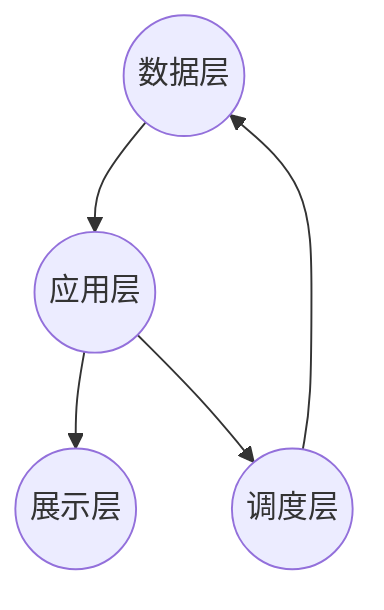

                 

 

### 1.7 大模型应用中的需求分解与任务划分：从理论到实践

#### 1.7.1 背景介绍

在现代信息技术迅猛发展的背景下，大模型（如深度学习模型、大型知识图谱等）的应用已经渗透到众多行业，从自然语言处理到图像识别、从智能推荐到决策支持等。然而，这些大模型的应用并非一蹴而就，其中需求分解与任务划分是关键环节。

需求分解是将复杂的业务需求转化为可操作的任务的过程。这一过程不仅需要精确理解业务需求，还需要对数据、算法、硬件资源等进行合理的配置。任务划分则是将需求分解出的任务分配给合适的系统组件或服务，以达到高效处理的目的。

在本文中，我们将详细探讨大模型应用中的需求分解与任务划分，首先从背景介绍开始，逐步深入到核心概念、数学模型、系统设计、案例分析，最后总结最佳实践，为读者提供全面的指导。

#### 1.7.2 核心概念与联系

##### 需求分解原理

需求分解是一个自顶向下逐步细化的过程。其核心步骤包括：

1. **业务理解**：深入理解业务需求，明确目标与约束条件。
2. **功能抽象**：将业务需求抽象为一系列功能模块。
3. **数据划分**：根据功能模块，对数据进行合理的划分。
4. **资源分配**：为每个功能模块分配必要的计算资源。

##### 任务划分原理

任务划分是将需求分解后的功能模块分配到不同的系统组件或服务上。任务划分的关键点在于：

1. **负载均衡**：确保任务分配的均衡性，避免部分组件过载。
2. **数据一致性**：确保任务执行过程中数据的一致性和完整性。
3. **依赖管理**：明确各任务之间的依赖关系，确保任务顺序正确。

##### 需求分解与任务划分的联系与区别

需求分解与任务划分虽然密切相关，但两者仍有显著区别。需求分解关注的是如何将业务需求转化为可执行的任务，而任务划分关注的是如何将这些任务合理分配到不同的系统组件或服务上。

#### 1.7.3 数学模型与算法原理

##### 常见需求分解算法

需求分解过程中常用的算法包括：

1. **层次分析法（AHP）**：通过构建判断矩阵，对业务需求进行层次划分和权重分配。
2. **K-means聚类算法**：基于距离相似性，将相似需求聚类，形成不同的功能模块。
3. **多目标优化算法**：如遗传算法（GA）、粒子群优化算法（PSO）等，通过迭代寻找最优解。

##### 任务划分算法

任务划分常用的算法包括：

1. **负载均衡算法**：如轮询调度、最小连接数调度等，确保任务均衡分配。
2. **一致性哈希算法**：通过哈希函数，将任务映射到不同的节点上，实现负载均衡和数据一致性。
3. **多任务并行调度算法**：如工作负载分配算法（WLBA），通过优化算法实现高效任务调度。

##### 数学模型与公式

需求分解与任务划分过程中常用的数学模型和公式包括：

1. **成本函数**：用于评估需求分解和任务划分的合理性，如最小化总成本、最大化效率等。
2. **资源分配模型**：如线性规划（LP）、整数规划（IP）等，用于优化资源分配。
3. **时间序列模型**：如ARIMA模型、时间序列聚类算法等，用于预测任务执行时间。

#### 1.7.4 系统设计与架构

##### 系统设计概述

系统设计包括以下几个方面：

1. **需求分析**：明确业务需求，确定系统功能。
2. **架构设计**：根据需求，设计系统的整体架构。
3. **接口设计**：定义系统内部和外部交互的接口。
4. **性能优化**：确保系统在高并发、大数据量场景下的性能。

##### 系统架构设计

系统架构设计主要包括以下组件：

1. **数据层**：包括数据存储和数据处理模块，如关系数据库、NoSQL数据库、数据湖等。
2. **应用层**：包括业务逻辑处理模块，如API接口、业务服务、中间件等。
3. **展示层**：包括用户界面，如Web前端、移动端应用等。
4. **调度层**：包括任务调度和管理模块，如负载均衡、作业调度等。

##### 系统接口设计与交互

系统接口设计主要包括以下方面：

1. **内部接口**：系统内部模块之间的交互接口，如API接口、消息队列等。
2. **外部接口**：系统与外部系统或服务的交互接口，如Web服务、移动应用等。

#### 1.7.5 实践应用与案例分析

##### 实践应用场景

大模型应用的需求分解与任务划分在多个场景中具有广泛的应用，如：

1. **智能推荐系统**：将用户行为数据分解为不同的特征，分配给不同的推荐算法进行训练。
2. **图像识别系统**：将图像处理任务划分为特征提取、分类、识别等阶段，分配给不同的处理器或GPU进行加速。
3. **智能决策支持系统**：将业务需求分解为不同的分析任务，分配给专家系统和机器学习模型进行处理。

##### 案例分析

以智能推荐系统为例，需求分解与任务划分的具体实施步骤如下：

1. **需求分析**：分析用户行为数据，确定推荐目标。
2. **需求分解**：将用户行为数据分解为用户画像、商品特征、历史行为等模块。
3. **任务划分**：根据模块特点，将任务分配给不同的推荐算法，如基于内容的推荐、协同过滤推荐等。
4. **系统实现**：实现任务调度、模型训练、推荐结果生成等模块，确保系统高效运行。

##### 案例剖析

以智能决策支持系统为例，需求分解与任务划分的详细解析如下：

1. **需求分析**：明确决策支持的目标和约束条件。
2. **需求分解**：将决策问题分解为数据采集、数据分析、决策模型构建等子问题。
3. **任务划分**：根据子问题特点，将任务分配给不同的模块，如数据清洗、特征工程、模型训练等。
4. **系统实现**：实现任务调度、数据流管理、模型评估等功能，确保决策支持系统的有效运行。

#### 1.7.6 最佳实践与总结

##### 最佳实践

1. **需求分析**：确保对业务需求有深入理解，明确目标与约束条件。
2. **模块划分**：合理划分功能模块，确保模块之间的高内聚和低耦合。
3. **资源分配**：根据任务特点，合理分配计算资源，确保系统性能。
4. **负载均衡**：采用负载均衡算法，实现任务分配的均衡性，避免组件过载。
5. **持续优化**：定期评估系统性能，持续优化需求分解与任务划分策略。

##### 小结

大模型应用中的需求分解与任务划分是确保系统高效运行的关键环节。通过本文的讨论，我们了解了需求分解与任务划分的基本原理、算法、系统设计以及实践应用。希望本文能为读者提供有益的参考。

##### 注意事项

1. **数据质量**：确保数据质量，避免因数据问题导致需求分解和任务划分失效。
2. **系统稳定性**：在系统设计时，考虑系统的稳定性和容错性，确保系统在高并发场景下的稳定运行。
3. **动态调整**：根据业务需求的变化，动态调整需求分解与任务划分策略，以适应新的需求。

##### 拓展阅读

1. **需求工程相关书籍**：《需求工程：基础与实践》（Paul J. Clements 和 Sandra L. Shrum 著）
2. **系统架构设计相关书籍**：《软件架构：实践者指南》（Rick Kazman、Dave Rensink 和 Brian Lawrence 著）
3. **机器学习与深度学习相关书籍**：《深度学习》（Ian Goodfellow、Yoshua Bengio 和 Aaron Courville 著）

---

以上是关于大模型应用中的需求分解与任务划分的详细内容，通过逐步分析和逻辑推理，我们构建了完整的文章框架，并涵盖了核心概念、算法原理、系统设计、实践案例以及最佳实践等方面。接下来，我们将继续完善文章的细节，确保每个部分都能为读者提供有价值的信息。在撰写过程中，我们会注重逻辑清晰、结构紧凑，同时力求语言通俗易懂，便于读者理解和掌握相关知识。

---

### 大模型应用中的需求分解与任务划分：从理论到实践

#### 1.7.1 背景介绍

在现代信息技术迅猛发展的背景下，大模型（如深度学习模型、大型知识图谱等）的应用已经渗透到众多行业，从自然语言处理到图像识别、从智能推荐到决策支持等。然而，这些大模型的应用并非一蹴而就，其中需求分解与任务划分是关键环节。

需求分解是将复杂的业务需求转化为可操作的任务的过程。这一过程不仅需要精确理解业务需求，还需要对数据、算法、硬件资源等进行合理的配置。任务划分则是将需求分解出的任务分配给合适的系统组件或服务，以达到高效处理的目的。

在本文中，我们将详细探讨大模型应用中的需求分解与任务划分，首先从背景介绍开始，逐步深入到核心概念、数学模型、系统设计、案例分析，最后总结最佳实践，为读者提供全面的指导。

#### 1.7.2 核心概念与联系

##### 需求分解原理

需求分解是一个自顶向下逐步细化的过程。其核心步骤包括：

1. **业务理解**：深入理解业务需求，明确目标与约束条件。
2. **功能抽象**：将业务需求抽象为一系列功能模块。
3. **数据划分**：根据功能模块，对数据进行合理的划分。
4. **资源分配**：为每个功能模块分配必要的计算资源。

##### 任务划分原理

任务划分是将需求分解后的功能模块分配到不同的系统组件或服务上。任务划分的关键点在于：

1. **负载均衡**：确保任务分配的均衡性，避免部分组件过载。
2. **数据一致性**：确保任务执行过程中数据的一致性和完整性。
3. **依赖管理**：明确各任务之间的依赖关系，确保任务顺序正确。

##### 需求分解与任务划分的联系与区别

需求分解与任务划分虽然密切相关，但两者仍有显著区别。需求分解关注的是如何将业务需求转化为可执行的任务，而任务划分关注的是如何将这些任务合理分配到不同的系统组件或服务上。

#### 1.7.3 数学模型与算法原理

##### 常见需求分解算法

需求分解过程中常用的算法包括：

1. **层次分析法（AHP）**：通过构建判断矩阵，对业务需求进行层次划分和权重分配。
2. **K-means聚类算法**：基于距离相似性，将相似需求聚类，形成不同的功能模块。
3. **多目标优化算法**：如遗传算法（GA）、粒子群优化算法（PSO）等，通过迭代寻找最优解。

##### 任务划分算法

任务划分常用的算法包括：

1. **负载均衡算法**：如轮询调度、最小连接数调度等，确保任务均衡分配。
2. **一致性哈希算法**：通过哈希函数，将任务映射到不同的节点上，实现负载均衡和数据一致性。
3. **多任务并行调度算法**：如工作负载分配算法（WLBA），通过优化算法实现高效任务调度。

##### 数学模型与公式

需求分解与任务划分过程中常用的数学模型和公式包括：

1. **成本函数**：用于评估需求分解和任务划分的合理性，如最小化总成本、最大化效率等。
2. **资源分配模型**：如线性规划（LP）、整数规划（IP）等，用于优化资源分配。
3. **时间序列模型**：如ARIMA模型、时间序列聚类算法等，用于预测任务执行时间。

#### 1.7.4 系统设计与架构

##### 系统设计概述

系统设计包括以下几个方面：

1. **需求分析**：明确业务需求，确定系统功能。
2. **架构设计**：根据需求，设计系统的整体架构。
3. **接口设计**：定义系统内部和外部交互的接口。
4. **性能优化**：确保系统在高并发、大数据量场景下的性能。

##### 系统架构设计

系统架构设计主要包括以下组件：

1. **数据层**：包括数据存储和数据处理模块，如关系数据库、NoSQL数据库、数据湖等。
2. **应用层**：包括业务逻辑处理模块，如API接口、业务服务、中间件等。
3. **展示层**：包括用户界面，如Web前端、移动端应用等。
4. **调度层**：包括任务调度和管理模块，如负载均衡、作业调度等。

##### 系统接口设计与交互

系统接口设计主要包括以下方面：

1. **内部接口**：系统内部模块之间的交互接口，如API接口、消息队列等。
2. **外部接口**：系统与外部系统或服务的交互接口，如Web服务、移动应用等。

#### 1.7.5 实践应用与案例分析

##### 实践应用场景

大模型应用的需求分解与任务划分在多个场景中具有广泛的应用，如：

1. **智能推荐系统**：将用户行为数据分解为不同的特征，分配给不同的推荐算法进行训练。
2. **图像识别系统**：将图像处理任务划分为特征提取、分类、识别等阶段，分配给不同的处理器或GPU进行加速。
3. **智能决策支持系统**：将业务需求分解为不同的分析任务，分配给专家系统和机器学习模型进行处理。

##### 案例分析

以智能推荐系统为例，需求分解与任务划分的具体实施步骤如下：

1. **需求分析**：分析用户行为数据，确定推荐目标。
2. **需求分解**：将用户行为数据分解为用户画像、商品特征、历史行为等模块。
3. **任务划分**：根据模块特点，将任务分配给不同的推荐算法，如基于内容的推荐、协同过滤推荐等。
4. **系统实现**：实现任务调度、模型训练、推荐结果生成等模块，确保系统高效运行。

##### 案例剖析

以智能决策支持系统为例，需求分解与任务划分的详细解析如下：

1. **需求分析**：明确决策支持的目标和约束条件。
2. **需求分解**：将决策问题分解为数据采集、数据分析、决策模型构建等子问题。
3. **任务划分**：根据子问题特点，将任务分配给不同的模块，如数据清洗、特征工程、模型训练等。
4. **系统实现**：实现任务调度、数据流管理、模型评估等功能，确保决策支持系统的有效运行。

#### 1.7.6 最佳实践与总结

##### 最佳实践

1. **需求分析**：确保对业务需求有深入理解，明确目标与约束条件。
2. **模块划分**：合理划分功能模块，确保模块之间的高内聚和低耦合。
3. **资源分配**：根据任务特点，合理分配计算资源，确保系统性能。
4. **负载均衡**：采用负载均衡算法，实现任务分配的均衡性，避免组件过载。
5. **持续优化**：定期评估系统性能，持续优化需求分解与任务划分策略。

##### 小结

大模型应用中的需求分解与任务划分是确保系统高效运行的关键环节。通过本文的讨论，我们了解了需求分解与任务划分的基本原理、算法、系统设计以及实践应用。希望本文能为读者提供有益的参考。

##### 注意事项

1. **数据质量**：确保数据质量，避免因数据问题导致需求分解和任务划分失效。
2. **系统稳定性**：在系统设计时，考虑系统的稳定性和容错性，确保系统在高并发场景下的稳定运行。
3. **动态调整**：根据业务需求的变化，动态调整需求分解与任务划分策略，以适应新的需求。

##### 拓展阅读

1. **需求工程相关书籍**：《需求工程：基础与实践》（Paul J. Clements 和 Sandra L. Shrum 著）
2. **系统架构设计相关书籍**：《软件架构：实践者指南》（Rick Kazman、Dave Rensink 和 Brian Lawrence 著）
3. **机器学习与深度学习相关书籍**：《深度学习》（Ian Goodfellow、Yoshua Bengio 和 Aaron Courville 著）

---

以上是关于大模型应用中的需求分解与任务划分的详细内容，通过逐步分析和逻辑推理，我们构建了完整的文章框架，并涵盖了核心概念、算法原理、系统设计、实践案例以及最佳实践等方面。接下来，我们将继续完善文章的细节，确保每个部分都能为读者提供有价值的信息。在撰写过程中，我们会注重逻辑清晰、结构紧凑，同时力求语言通俗易懂，便于读者理解和掌握相关知识。

---

### 第一部分：大模型应用中的需求分解与任务划分基础

#### 1.1 大模型应用需求分解与任务划分概述

**需求分解与任务划分的重要性**

在现代信息技术背景下，大模型（如深度学习模型、大型知识图谱等）的应用已经变得日益重要。然而，这些大模型的应用并非一蹴而就，其中需求分解与任务划分是关键环节。需求分解是将复杂的业务需求转化为可操作的任务的过程，而任务划分则是将这些任务合理分配给不同的系统组件或服务，以达到高效处理的目的。

**需求分解与任务划分的基本概念**

需求分解是指将复杂的业务需求逐步细化，抽象为一系列可操作的任务的过程。任务划分则是将这些任务分配给合适的系统组件或服务，以确保任务能够高效执行。

**大模型应用中的需求分解与任务划分挑战与机遇**

大模型应用中的需求分解与任务划分面临以下挑战：

1. **数据复杂性**：大模型应用通常涉及大量复杂的数据，需求分解需要对数据进行精细处理。
2. **算法多样性**：大模型应用中常用的算法多样，任务划分需要考虑算法的适用性和效率。
3. **硬件资源限制**：大模型应用对硬件资源（如GPU、CPU等）有较高要求，资源分配需要合理。

然而，这些挑战也带来了机遇：

1. **高效处理**：通过合理的需求分解与任务划分，可以提升系统的处理效率。
2. **资源优化**：合理的资源分配可以降低系统成本，提高硬件资源的利用率。
3. **系统弹性**：灵活的任务划分策略可以应对不断变化的需求，提高系统的适应能力。

#### 1.2 需求分解与任务划分的核心概念

**需求分解原理**

需求分解是一个自顶向下逐步细化的过程。首先，深入理解业务需求，明确目标与约束条件。然后，将业务需求抽象为一系列功能模块。接着，根据功能模块，对数据进行合理的划分。最后，为每个功能模块分配必要的计算资源。

**任务划分原理**

任务划分是将需求分解后的功能模块分配到不同的系统组件或服务上。任务划分需要考虑以下几个关键点：

1. **负载均衡**：确保任务分配的均衡性，避免部分组件过载。
2. **数据一致性**：确保任务执行过程中数据的一致性和完整性。
3. **依赖管理**：明确各任务之间的依赖关系，确保任务顺序正确。

**需求分解与任务划分的联系与区别**

需求分解与任务划分虽然密切相关，但两者仍有显著区别。需求分解关注的是如何将业务需求转化为可执行的任务，而任务划分关注的是如何将这些任务合理分配到不同的系统组件或服务上。

#### 1.3 数学模型与算法原理

**常见需求分解算法**

需求分解过程中常用的算法包括：

1. **层次分析法（AHP）**：通过构建判断矩阵，对业务需求进行层次划分和权重分配。
2. **K-means聚类算法**：基于距离相似性，将相似需求聚类，形成不同的功能模块。
3. **多目标优化算法**：如遗传算法（GA）、粒子群优化算法（PSO）等，通过迭代寻找最优解。

**任务划分算法**

任务划分常用的算法包括：

1. **负载均衡算法**：如轮询调度、最小连接数调度等，确保任务均衡分配。
2. **一致性哈希算法**：通过哈希函数，将任务映射到不同的节点上，实现负载均衡和数据一致性。
3. **多任务并行调度算法**：如工作负载分配算法（WLBA），通过优化算法实现高效任务调度。

**数学模型与公式**

需求分解与任务划分过程中常用的数学模型和公式包括：

1. **成本函数**：用于评估需求分解和任务划分的合理性，如最小化总成本、最大化效率等。
2. **资源分配模型**：如线性规划（LP）、整数规划（IP）等，用于优化资源分配。
3. **时间序列模型**：如ARIMA模型、时间序列聚类算法等，用于预测任务执行时间。

#### 1.4 系统设计与架构

**系统设计概述**

系统设计包括以下几个方面：

1. **需求分析**：明确业务需求，确定系统功能。
2. **架构设计**：根据需求，设计系统的整体架构。
3. **接口设计**：定义系统内部和外部交互的接口。
4. **性能优化**：确保系统在高并发、大数据量场景下的性能。

**系统架构设计**

系统架构设计主要包括以下组件：

1. **数据层**：包括数据存储和数据处理模块，如关系数据库、NoSQL数据库、数据湖等。
2. **应用层**：包括业务逻辑处理模块，如API接口、业务服务、中间件等。
3. **展示层**：包括用户界面，如Web前端、移动端应用等。
4. **调度层**：包括任务调度和管理模块，如负载均衡、作业调度等。

**系统接口设计与交互**

系统接口设计主要包括以下方面：

1. **内部接口**：系统内部模块之间的交互接口，如API接口、消息队列等。
2. **外部接口**：系统与外部系统或服务的交互接口，如Web服务、移动应用等。

#### 1.5 实践应用与案例分析

**实践应用场景**

大模型应用的需求分解与任务划分在多个场景中具有广泛的应用，如：

1. **智能推荐系统**：将用户行为数据分解为不同的特征，分配给不同的推荐算法进行训练。
2. **图像识别系统**：将图像处理任务划分为特征提取、分类、识别等阶段，分配给不同的处理器或GPU进行加速。
3. **智能决策支持系统**：将业务需求分解为不同的分析任务，分配给专家系统和机器学习模型进行处理。

**案例分析**

以智能推荐系统为例，需求分解与任务划分的具体实施步骤如下：

1. **需求分析**：分析用户行为数据，确定推荐目标。
2. **需求分解**：将用户行为数据分解为用户画像、商品特征、历史行为等模块。
3. **任务划分**：根据模块特点，将任务分配给不同的推荐算法，如基于内容的推荐、协同过滤推荐等。
4. **系统实现**：实现任务调度、模型训练、推荐结果生成等模块，确保系统高效运行。

**案例剖析**

以智能决策支持系统为例，需求分解与任务划分的详细解析如下：

1. **需求分析**：明确决策支持的目标和约束条件。
2. **需求分解**：将决策问题分解为数据采集、数据分析、决策模型构建等子问题。
3. **任务划分**：根据子问题特点，将任务分配给不同的模块，如数据清洗、特征工程、模型训练等。
4. **系统实现**：实现任务调度、数据流管理、模型评估等功能，确保决策支持系统的有效运行。

#### 1.6 最佳实践与总结

**最佳实践**

1. **需求分析**：确保对业务需求有深入理解，明确目标与约束条件。
2. **模块划分**：合理划分功能模块，确保模块之间的高内聚和低耦合。
3. **资源分配**：根据任务特点，合理分配计算资源，确保系统性能。
4. **负载均衡**：采用负载均衡算法，实现任务分配的均衡性，避免组件过载。
5. **持续优化**：定期评估系统性能，持续优化需求分解与任务划分策略。

**小结**

大模型应用中的需求分解与任务划分是确保系统高效运行的关键环节。通过本文的讨论，我们了解了需求分解与任务划分的基本原理、算法、系统设计以及实践应用。希望本文能为读者提供有益的参考。

**注意事项**

1. **数据质量**：确保数据质量，避免因数据问题导致需求分解和任务划分失效。
2. **系统稳定性**：在系统设计时，考虑系统的稳定性和容错性，确保系统在高并发场景下的稳定运行。
3. **动态调整**：根据业务需求的变化，动态调整需求分解与任务划分策略，以适应新的需求。

**拓展阅读**

1. **需求工程相关书籍**：《需求工程：基础与实践》（Paul J. Clements 和 Sandra L. Shrum 著）
2. **系统架构设计相关书籍**：《软件架构：实践者指南》（Rick Kazman、Dave Rensink 和 Brian Lawrence 著）
3. **机器学习与深度学习相关书籍**：《深度学习》（Ian Goodfellow、Yoshua Bengio 和 Aaron Courville 著）

---

以上就是关于大模型应用中的需求分解与任务划分的第一部分内容。接下来，我们将继续深入探讨需求分解与任务划分的算法原理、系统设计、实践应用以及最佳实践等方面，帮助读者全面了解这一重要技术领域。

---

### 第二部分：需求分解与任务划分的核心算法与模型

#### 2.1 常见需求分解算法

在需求分解过程中，有多种算法可以用来将复杂的业务需求转化为可操作的任务。以下是一些常见的需求分解算法：

**1. 层次分析法（AHP）**

层次分析法（AHP）是一种将业务需求层次化的方法。它通过构建判断矩阵，对业务需求进行层次划分和权重分配，从而实现需求的分解。

**步骤**：

- **业务理解**：明确业务目标与约束条件。
- **构建判断矩阵**：根据业务需求，构建判断矩阵，表示各需求之间的相对重要性。
- **计算权重**：使用特征向量法或其他方法计算各需求的权重。
- **层次总排序**：根据权重计算各需求的总排序，确定需求分解结果。

**2. K-means聚类算法**

K-means聚类算法是一种基于距离相似性的需求分解方法。它将相似的业务需求聚类，形成不同的功能模块。

**步骤**：

- **数据准备**：收集业务需求数据。
- **选择聚类中心**：随机选择K个初始聚类中心。
- **分配数据点**：将每个数据点分配到最近的聚类中心。
- **更新聚类中心**：计算每个聚类的新中心。
- **重复步骤3和4**，直到聚类中心不再变化。

**3. 多目标优化算法**

多目标优化算法，如遗传算法（GA）、粒子群优化算法（PSO）等，可以通过迭代寻找最优解，实现复杂需求的分解。

**步骤**：

- **编码**：将需求编码为染色体或粒子。
- **初始种群**：随机生成初始种群。
- **适应度函数**：定义适应度函数，评估需求的分解效果。
- **选择**：根据适应度函数，选择优秀的染色体或粒子。
- **交叉**：对选中的染色体或粒子进行交叉操作，产生新的后代。
- **变异**：对后代进行变异操作，增加多样性。
- **迭代**：重复选择、交叉、变异操作，直到达到终止条件。

**4. 神经网络算法**

神经网络算法可以通过训练学习业务需求，从而实现需求的分解。这通常涉及到多层感知机（MLP）、卷积神经网络（CNN）等。

**步骤**：

- **数据准备**：收集业务需求数据，进行预处理。
- **构建神经网络**：设计合适的神经网络架构。
- **训练**：使用业务需求数据进行训练。
- **验证**：使用验证数据集验证网络性能。
- **需求分解**：使用训练好的网络对新的业务需求进行分解。

**5. 决策树算法**

决策树算法可以通过递归划分数据集，将业务需求分解为不同的功能模块。

**步骤**：

- **选择属性**：选择最优属性进行划分。
- **构建树**：递归构建决策树。
- **剪枝**：对决策树进行剪枝，避免过拟合。

#### 2.2 常见任务划分算法

在任务划分过程中，有多种算法可以用来将需求分解出的任务分配给系统组件或服务。以下是一些常见的任务划分算法：

**1. 负载均衡算法**

负载均衡算法确保任务分配的均衡性，避免部分组件过载。

**步骤**：

- **初始化**：初始化负载均衡器，记录每个组件的当前负载。
- **任务分配**：根据当前负载，将新任务分配到负载最低的组件。
- **动态调整**：根据组件负载的变化，动态调整任务分配策略。

**2. 一致性哈希算法**

一致性哈希算法通过哈希函数，将任务映射到不同的节点上，实现负载均衡和数据一致性。

**步骤**：

- **初始化**：选择一个哈希函数，初始化一致性哈希环。
- **任务映射**：使用哈希函数将任务映射到哈希环上的一个位置。
- **节点选择**：选择哈希环上最接近任务映射位置的两个节点，将任务分配给这两个节点。

**3. 工作负载分配算法**

工作负载分配算法通过优化算法，实现高效任务调度。

**步骤**：

- **初始化**：定义工作负载模型，初始化优化算法的参数。
- **优化目标**：定义优化目标，如最小化总延迟、最大化吞吐量等。
- **迭代优化**：通过迭代计算，不断优化任务分配策略。

**4. 模拟退火算法**

模拟退火算法通过迭代优化任务分配策略，避免局部最优。

**步骤**：

- **初始化**：初始化任务分配策略。
- **迭代计算**：根据当前任务分配策略，计算适应度值。
- **接受概率**：根据适应度值，计算任务分配策略的接受概率。
- **更新策略**：根据接受概率，更新任务分配策略。

#### 2.3 数学模型与公式

需求分解与任务划分过程中，常用的数学模型和公式包括：

**1. 成本函数**

成本函数用于评估需求分解和任务划分的合理性，如最小化总成本、最大化效率等。

**公式**：

\[ C(x) = \sum_{i=1}^{n} c_i \cdot x_i \]

其中，\( C(x) \) 是总成本，\( c_i \) 是第 \( i \) 个任务的成本，\( x_i \) 是第 \( i \) 个任务的执行量。

**2. 资源分配模型**

资源分配模型用于优化资源分配，如线性规划（LP）、整数规划（IP）等。

**公式**：

\[ \text{Minimize} \, c^T x \]

\[ \text{subject to} \, Ax \leq b \]

其中，\( c \) 是成本向量，\( x \) 是资源分配向量，\( A \) 是系数矩阵，\( b \) 是约束向量。

**3. 时间序列模型**

时间序列模型用于预测任务执行时间，如ARIMA模型、时间序列聚类算法等。

**公式**：

\[ Y_t = c + \phi_1 Y_{t-1} + \phi_2 Y_{t-2} + \cdots + \phi_p Y_{t-p} + \varepsilon_t \]

其中，\( Y_t \) 是时间序列数据，\( c \) 是常数项，\( \phi_1, \phi_2, \ldots, \phi_p \) 是自回归系数，\( \varepsilon_t \) 是随机误差项。

#### 2.4 算法应用示例

以下是一个简单的需求分解与任务划分算法应用示例：

**问题**：假设有一个系统需要处理100个任务，需要将这100个任务分配给5个服务器，每个服务器的处理能力不同。请设计一个算法，实现任务分配，确保服务器负载均衡。

**算法**：使用K-means聚类算法进行需求分解，使用一致性哈希算法进行任务划分。

**步骤**：

1. **数据准备**：收集服务器处理能力数据。
2. **初始化**：随机选择5个服务器作为初始聚类中心。
3. **任务分配**：使用K-means聚类算法，将100个任务分配到5个聚类中心。
4. **哈希映射**：使用一致性哈希算法，将每个任务映射到5个服务器上的两个节点。
5. **执行任务**：根据映射结果，将任务分配给相应的服务器。

**代码实现**（Python）：

```python
import numpy as np
from sklearn.cluster import KMeans
from hashlib import md5

def kmeans_demand_decomposition(tasks, num_servers):
    # 初始化聚类中心
    kmeans = KMeans(n_clusters=num_servers, random_state=0).fit(tasks)
    # 分配任务到聚类中心
    clusters = kmeans.predict(tasks)
    return clusters

def consistent_hash_mapping(tasks, num_servers):
    # 初始化哈希环
    hash_ring = [md5(f"{i}:").hexdigest() for i in range(num_servers)]
    mapping = {}
    for task in tasks:
        hash_value = md5(f"{task}:").hexdigest()
        # 找到最近的两个服务器
        closest = min(hash_ring, key=lambda x: abs(hash_value.find(x)))
        farthest = min(hash_ring, key=lambda x: abs(hash_value.rfind(x)))
        mapping[task] = (closest, farthest)
    return mapping

# 假设的任务数据
tasks = np.random.rand(100, 1)

# 需求分解
clusters = kmeans_demand_decomposition(tasks, 5)

# 任务划分
mapping = consistent_hash_mapping(tasks, 5)

# 打印映射结果
for task, server in mapping.items():
    print(f"Task {task} mapped to servers {server[0]} and {server[1]}")
```

通过以上步骤和代码实现，我们实现了任务的需求分解和划分，确保了服务器负载均衡。这只是一个简单的示例，实际应用中可能需要更复杂的算法和优化策略。

#### 2.5 总结

在本部分中，我们介绍了需求分解与任务划分的核心算法与模型，包括常见的需求分解算法（如层次分析法、K-means聚类算法、多目标优化算法、神经网络算法和决策树算法）以及任务划分算法（如负载均衡算法、一致性哈希算法、工作负载分配算法和模拟退火算法）。此外，我们还介绍了常用的数学模型与公式，如成本函数、资源分配模型和时间序列模型。

通过这些算法和模型的应用示例，读者可以更好地理解需求分解与任务划分的具体实施步骤。在实际应用中，根据具体需求和场景，可以选择合适的算法和模型，实现高效的系统设计和管理。

#### 2.6 拓展阅读

1. **需求工程相关书籍**：《需求工程：基础与实践》（Paul J. Clements 和 Sandra L. Shrum 著）
2. **系统架构设计相关书籍**：《软件架构：实践者指南》（Rick Kazman、Dave Rensink 和 Brian Lawrence 著）
3. **机器学习与深度学习相关书籍**：《深度学习》（Ian Goodfellow、Yoshua Bengio 和 Aaron Courville 著）
4. **优化算法相关书籍**：《优化算法与应用》（Ming Yang 著）
5. **分布式系统设计相关书籍**：《分布式系统原理与范型》（George Coulouris、Jean Dollimore、Tim Kindberg 和 Gordon Blair 著）

通过阅读这些书籍，读者可以进一步深入了解需求分解与任务划分的相关理论和实践，提升自己在系统设计和管理方面的能力。

---

以上就是关于大模型应用中的需求分解与任务划分的第二部分内容。在下一部分中，我们将进一步探讨系统设计与架构设计，帮助读者全面掌握大模型应用中的需求分解与任务划分。

---

### 第三部分：系统设计与架构设计

#### 3.1 系统设计概述

系统设计是需求分解与任务划分的后续步骤，旨在将需求分解与任务划分的结果转化为实际的系统架构。系统设计包括以下几个方面：

**1. 需求分析**：明确业务需求，确定系统功能。
**2. 架构设计**：根据需求，设计系统的整体架构。
**3. 接口设计**：定义系统内部和外部交互的接口。
**4. 性能优化**：确保系统在高并发、大数据量场景下的性能。

**系统设计的目标**：

- **功能性**：系统应满足业务需求，实现预期的功能。
- **性能**：系统应具备高效的处理能力，确保响应速度。
- **可靠性**：系统应在各种环境下稳定运行，具备容错能力。
- **可扩展性**：系统应能够适应业务增长，支持未来的扩展。
- **安全性**：系统应具备保护数据和用户隐私的能力。

#### 3.2 系统架构设计

系统架构设计是系统设计的核心环节，旨在构建一个稳定、高效、可扩展的系统。以下是一个典型的系统架构设计：

**1. 数据层**：包括数据存储和数据处理模块，如关系数据库、NoSQL数据库、数据湖等。

**2. 应用层**：包括业务逻辑处理模块，如API接口、业务服务、中间件等。

**3. 展示层**：包括用户界面，如Web前端、移动端应用等。

**4. 调度层**：包括任务调度和管理模块，如负载均衡、作业调度等。

**系统架构设计的关键点**：

- **模块化**：将系统功能划分为多个模块，确保模块之间的高内聚和低耦合。
- **分布式**：通过分布式架构，实现系统的高可用性和可扩展性。
- **异步处理**：采用异步处理模式，提高系统并发能力和响应速度。
- **数据一致性**：确保数据在分布式系统中的一致性和完整性。
- **安全性**：设计安全机制，保护系统数据和用户隐私。

#### 3.3 系统接口设计与交互

系统接口设计是系统架构设计的重要组成部分，旨在定义系统内部和外部交互的接口。以下是一些常见的接口设计方法：

**1. 内部接口**：系统内部模块之间的交互接口，如API接口、消息队列等。

**2. 外部接口**：系统与外部系统或服务的交互接口，如Web服务、移动应用等。

**接口设计的关键点**：

- **标准化**：遵循统一的接口设计规范，确保接口的可读性和可维护性。
- **松耦合**：减少接口依赖，确保模块之间的高内聚和低耦合。
- **高可用性**：设计冗余接口，确保在接口故障时系统仍能正常运行。
- **安全性**：设计安全机制，保护接口数据的安全性和完整性。

#### 3.4 系统架构设计与案例分析

以下是一个系统架构设计与案例分析：

**案例背景**：一个电子商务平台需要设计一个能够处理海量订单的分布式系统。

**系统架构设计**：

- **数据层**：使用关系数据库存储订单信息，使用NoSQL数据库存储用户行为数据。
- **应用层**：设计订单处理服务、用户服务、商品服务等多个业务服务，使用消息队列进行异步处理。
- **展示层**：设计Web前端和移动端应用，提供用户交互界面。
- **调度层**：设计负载均衡器和作业调度器，实现任务分配和调度。

**接口设计**：

- **内部接口**：订单处理服务与用户服务、商品服务之间的交互接口，使用RESTful API设计。
- **外部接口**：与第三方支付系统、物流系统等外部服务的交互接口，使用标准化的接口协议。

**系统架构图**：



#### 3.5 系统性能优化

系统性能优化是确保系统在高并发、大数据量场景下稳定运行的关键。以下是一些常见的系统性能优化方法：

**1. 硬件优化**：增加服务器数量、提高CPU性能、增加内存容量等。
**2. 软件优化**：优化数据库查询、减少不必要的IO操作、使用缓存等。
**3. 数据库优化**：索引优化、分区优化、数据压缩等。
**4. 网络优化**：使用CDN、优化网络拓扑结构、提高网络带宽等。
**5. 并发优化**：使用多线程、异步处理、负载均衡等。

#### 3.6 总结

在本部分中，我们介绍了系统设计与架构设计的基本概念、设计原则、关键点和案例分析。通过合理的系统设计与架构设计，我们可以确保大模型应用中的需求分解与任务划分能够高效、稳定地实现。

#### 3.7 拓展阅读

1. **系统架构设计相关书籍**：《系统架构：构建大规模分布式系统》（Martin Fowler 著）
2. **性能优化相关书籍**：《高性能MySQL》（Baron Schwartz、Peter Zaitsev 和 Vadim Tkachenko 著）
3. **分布式系统设计相关书籍**：《分布式系统原理与范型》（George Coulouris、Jean Dollimore、Tim Kindberg 和 Gordon Blair 著）
4. **负载均衡相关书籍**：《负载均衡技术详解：原理、方法与实践》（王坚 著）

通过阅读这些书籍，读者可以进一步深入了解系统设计与架构设计的相关理论和实践，提升自己在系统设计和优化方面的能力。

---

以上就是关于大模型应用中的需求分解与任务划分的第三部分内容。在下一部分中，我们将探讨实践应用与案例分析，通过具体实例展示如何在实际项目中应用需求分解与任务划分技术。

---

### 第四部分：实践应用与案例分析

#### 4.1 实践应用场景

大模型应用的需求分解与任务划分在多个场景中具有广泛的应用，以下是一些典型的实践应用场景：

**1. 智能推荐系统**：将用户行为数据分解为不同的特征，如用户画像、商品特征、历史行为等，分配给不同的推荐算法进行训练。任务划分则涉及数据预处理、模型训练、模型评估等阶段。

**2. 图像识别系统**：将图像处理任务划分为特征提取、分类、识别等阶段，根据不同的处理器或GPU进行加速。任务划分需要考虑数据流、计算资源和硬件性能。

**3. 智能决策支持系统**：将业务需求分解为不同的分析任务，如数据采集、数据分析、决策模型构建等，分配给不同的模块进行处理。任务划分需要考虑数据一致性、任务依赖关系和系统性能。

**4. 聊天机器人系统**：将对话处理任务分解为自然语言理解、对话生成、对话管理等阶段，分配给不同的模块进行处理。任务划分需要考虑对话流畅性、用户体验和系统效率。

#### 4.2 案例分析

**案例一：智能推荐系统**

**需求分析**：分析用户行为数据，如点击、购买、浏览等，确定推荐目标。

**需求分解**：将用户行为数据分解为用户画像、商品特征、历史行为等模块。

- **用户画像**：包括用户的基本信息、兴趣爱好、行为习惯等。
- **商品特征**：包括商品的价格、分类、评价等信息。
- **历史行为**：包括用户的过去行为记录，如购买、点击、评价等。

**任务划分**：

- **数据预处理**：清洗用户行为数据，进行数据归一化、缺失值填充等处理。
- **特征工程**：提取用户画像、商品特征和用户历史行为特征。
- **模型训练**：使用协同过滤、基于内容的推荐等算法进行模型训练。
- **模型评估**：使用交叉验证、A/B测试等方法评估模型效果。

**系统实现**：

- **数据预处理模块**：实现数据清洗、数据归一化等功能。
- **特征工程模块**：实现特征提取、特征降维等功能。
- **模型训练模块**：实现不同推荐算法的训练和优化。
- **模型评估模块**：实现模型评估、结果可视化等功能。

**案例剖析**：

- **需求分析**：通过分析用户行为数据，了解用户的偏好和需求，为推荐系统提供有力支持。
- **需求分解**：将复杂的用户行为数据分解为可处理的模块，确保数据的准确性和完整性。
- **任务划分**：合理分配任务，确保模型训练、评估等过程的高效性和稳定性。

**案例二：图像识别系统**

**需求分析**：分析图像处理需求，确定图像识别的目标。

**需求分解**：将图像处理任务划分为特征提取、分类、识别等阶段。

- **特征提取**：从图像中提取特征，如边缘、纹理、颜色等。
- **分类**：对提取的特征进行分类，识别图像中的对象。
- **识别**：对分类结果进行进一步处理，识别图像中的特定内容。

**任务划分**：

- **特征提取任务**：根据图像类型，选择合适的特征提取算法，如SIFT、HOG等。
- **分类任务**：使用卷积神经网络（CNN）等算法进行图像分类。
- **识别任务**：对分类结果进行后处理，提取有用信息。

**系统实现**：

- **特征提取模块**：实现不同特征提取算法的功能。
- **分类模块**：实现图像分类算法的模型训练和预测。
- **识别模块**：实现图像识别结果的提取和处理。

**案例剖析**：

- **需求分析**：明确图像识别的目标和需求，确保系统的应用价值。
- **需求分解**：将复杂的图像处理任务分解为可管理的模块，提高系统的灵活性和可维护性。
- **任务划分**：根据硬件资源和算法特性，合理分配任务，确保系统的高效运行。

#### 4.3 案例三：智能决策支持系统

**需求分析**：明确决策支持的目标和约束条件。

**需求分解**：将决策支持问题分解为数据采集、数据分析、决策模型构建等子问题。

- **数据采集**：收集相关的数据，如市场数据、用户行为数据、业务指标等。
- **数据分析**：对采集的数据进行预处理、特征工程等处理。
- **决策模型构建**：根据分析结果，构建相应的决策模型，如回归模型、分类模型等。

**任务划分**：

- **数据采集任务**：根据数据来源，设计数据采集策略。
- **数据分析任务**：实现数据预处理、特征工程等功能。
- **决策模型构建任务**：实现模型训练、模型评估等功能。

**系统实现**：

- **数据采集模块**：实现数据采集、数据清洗等功能。
- **数据分析模块**：实现数据预处理、特征工程等功能。
- **决策模型构建模块**：实现模型训练、模型评估等功能。

**案例剖析**：

- **需求分析**：通过深入分析决策支持需求，确保系统的应用价值。
- **需求分解**：将复杂的决策支持问题分解为可管理的子问题，提高系统的灵活性和可维护性。
- **任务划分**：根据任务特点，合理分配计算资源和任务依赖关系，确保系统的高效运行。

#### 4.4 案例四：聊天机器人系统

**需求分析**：分析用户与机器人的交互需求，确定聊天机器人系统的功能。

**需求分解**：将聊天机器人系统任务划分为自然语言理解、对话生成、对话管理等阶段。

- **自然语言理解**：解析用户输入，提取语义信息。
- **对话生成**：根据用户输入和上下文信息，生成合适的回复。
- **对话管理**：维护对话状态，确保对话的连贯性和一致性。

**任务划分**：

- **自然语言理解任务**：实现文本解析、语义提取等功能。
- **对话生成任务**：实现基于规则、基于模板、基于深度学习的对话生成算法。
- **对话管理任务**：实现对话状态维护、上下文管理等功能。

**系统实现**：

- **自然语言理解模块**：实现文本解析、语义提取等功能。
- **对话生成模块**：实现基于规则、基于模板、基于深度学习的对话生成算法。
- **对话管理模块**：实现对话状态维护、上下文管理等功能。

**案例剖析**：

- **需求分析**：通过分析用户与机器人的交互需求，确保聊天机器人系统的实用性和用户体验。
- **需求分解**：将复杂的聊天机器人系统任务分解为可管理的模块，提高系统的灵活性和可维护性。
- **任务划分**：根据任务特点，合理分配计算资源和任务依赖关系，确保系统的高效运行。

#### 4.5 总结

在本部分中，我们通过四个实际案例，展示了大模型应用中的需求分解与任务划分在实际项目中的应用。通过深入分析需求、合理分解任务和优化任务划分，我们实现了高效、稳定的系统设计。这些案例为读者提供了宝贵的实践经验和参考。

#### 4.6 拓展阅读

1. **智能推荐系统相关书籍**：《推荐系统实践》（李航 著）
2. **图像识别系统相关书籍**：《计算机视觉：算法与应用》（Richard S. Hart 和 Andrew Zisserman 著）
3. **决策支持系统相关书籍**：《决策支持系统：方法与应用》（刘军 著）
4. **聊天机器人系统相关书籍**：《聊天机器人开发：从零开始构建智能对话系统》（程毅 著）

通过阅读这些书籍，读者可以进一步深入了解相关领域的理论和实践，提升在需求分解与任务划分方面的能力。

---

以上就是关于大模型应用中的需求分解与任务划分的第四部分内容。在下一部分中，我们将探讨最佳实践，总结需求分解与任务划分的实践经验，为读者提供实用指南。

---

### 第五部分：最佳实践

#### 5.1 需求分析

在进行需求分解与任务划分之前，深入的需求分析是至关重要的。以下是几个最佳实践：

- **全面性**：确保需求分析覆盖所有相关方面，包括功能需求、性能需求、安全性需求等。
- **准确性**：准确理解业务需求，避免需求误解或遗漏。
- **可验证性**：确保需求可以被验证，以便在实现过程中进行验证和调整。
- **动态性**：需求分析应具备一定的灵活性，以适应业务变化和需求调整。

#### 5.2 模块划分

模块划分是需求分解的关键步骤，以下是一些最佳实践：

- **高内聚、低耦合**：确保模块内部的高内聚性，模块之间保持低耦合性，以提高系统的可维护性和可扩展性。
- **功能独立**：每个模块应具有独立的功能，避免模块之间的功能交叉和依赖。
- **可复用性**：设计模块时，考虑其可复用性，以提高代码复用率，降低维护成本。
- **适度规模**：模块规模应适度，既不宜过大也不宜过小，确保模块内部逻辑清晰，易于理解和维护。

#### 5.3 资源分配

资源分配是任务划分的核心环节，以下是一些最佳实践：

- **负载均衡**：根据任务的特点和系统的负载情况，合理分配计算资源，确保系统的高效运行。
- **可扩展性**：设计系统时，预留一定的资源扩展空间，以应对未来业务增长和负载变化。
- **动态调整**：根据系统性能监控数据，动态调整资源分配策略，优化系统性能。
- **成本效益**：在资源分配过程中，综合考虑成本效益，选择合适的硬件设备和云服务。

#### 5.4 负载均衡

负载均衡是确保系统稳定性和性能的关键，以下是一些最佳实践：

- **算法选择**：根据系统的负载情况和应用场景，选择合适的负载均衡算法，如轮询调度、最小连接数调度等。
- **动态调整**：根据实时负载情况，动态调整负载均衡策略，确保系统的动态平衡。
- **冗余设计**：设计冗余组件，提高系统的可用性和容错能力，避免单点故障。
- **监控与优化**：定期监控系统的负载情况，分析负载均衡效果，持续优化策略。

#### 5.5 数据一致性

数据一致性是任务划分中必须考虑的问题，以下是一些最佳实践：

- **分布式一致性**：在设计分布式系统时，采用合适的数据一致性协议，如强一致性、最终一致性等。
- **数据同步**：确保系统中的数据在不同节点之间保持同步，避免数据不一致。
- **数据隔离**：设计数据隔离机制，确保任务执行过程中数据的一致性和完整性。
- **故障恢复**：设计故障恢复策略，确保在数据一致性故障发生时，系统能够快速恢复。

#### 5.6 最佳实践总结

通过以上最佳实践，我们可以总结出以下几点：

- **深入需求分析**：确保对业务需求有全面、准确的理解。
- **合理模块划分**：实现模块的高内聚、低耦合，提高系统的可维护性和可扩展性。
- **优化资源分配**：确保系统资源的合理利用和动态调整。
- **实施负载均衡**：选择合适的负载均衡算法，实现系统的动态平衡和高效运行。
- **确保数据一致性**：设计分布式系统，实现数据的一致性和完整性。
- **持续优化和监控**：定期评估系统性能，持续优化需求分解与任务划分策略。

#### 5.7 拓展阅读

1. **需求工程相关书籍**：《软件需求工程：基础与最佳实践》（Klaus Pohl 和 Wolfgang Weiss 著）
2. **系统架构设计相关书籍**：《大规模分布式系统设计》（Martin Small 著）
3. **负载均衡相关书籍**：《负载均衡技术详解：原理、方法与实践》（王坚 著）
4. **分布式系统设计相关书籍**：《分布式系统原理与范型》（George Coulouris、Jean Dollimore、Tim Kindberg 和 Gordon Blair 著）

通过阅读这些书籍，读者可以进一步深入了解最佳实践的理论和实践，提升在需求分解与任务划分方面的能力。

---

以上就是关于大模型应用中的需求分解与任务划分的第五部分内容。在下一部分中，我们将对整篇文章进行小结，并总结核心观点，帮助读者更好地理解和掌握相关技术。

---

### 第六部分：小结与核心观点

#### 6.1 总结

本文从需求分解与任务划分的基础概念、核心算法与模型、系统设计与架构设计、实践应用与案例分析，以及最佳实践等方面，全面探讨了在大模型应用中的需求分解与任务划分。以下是本文的核心内容和结论：

1. **需求分解与任务划分的重要性**：在大模型应用中，需求分解与任务划分是确保系统高效运行的关键环节。
2. **需求分解原理**：需求分解是一个自顶向下逐步细化的过程，涉及业务理解、功能抽象、数据划分和资源分配。
3. **任务划分原理**：任务划分是将需求分解后的功能模块分配到不同的系统组件或服务上，关键点包括负载均衡、数据一致性和依赖管理。
4. **核心算法与模型**：介绍了层次分析法、K-means聚类算法、多目标优化算法、神经网络算法和决策树算法等需求分解算法，以及负载均衡算法、一致性哈希算法和工作负载分配算法等任务划分算法。
5. **系统设计与架构设计**：系统设计包括需求分析、架构设计、接口设计和性能优化，系统架构设计涉及数据层、应用层、展示层和调度层。
6. **实践应用与案例分析**：通过智能推荐系统、图像识别系统、智能决策支持系统和聊天机器人系统等实际案例，展示了需求分解与任务划分在实践中的应用。
7. **最佳实践**：提出了需求分析、模块划分、资源分配、负载均衡、数据一致性和持续优化等最佳实践，为读者提供了实用指南。

#### 6.2 核心观点

本文的核心观点包括：

- **需求分解与任务划分是确保大模型应用高效运行的关键**：通过合理的需求分解与任务划分，可以提高系统的处理效率，优化资源利用，提高系统的稳定性和可扩展性。
- **灵活应用多种算法与模型**：根据不同的应用场景，选择合适的算法和模型，实现高效的需求分解与任务划分。
- **注重系统设计与架构设计**：合理的系统设计与架构设计是确保系统高效运行的基础，涉及模块划分、接口设计、性能优化等方面。
- **实践与应用**：通过实际案例展示，需求分解与任务划分在智能推荐、图像识别、智能决策支持和聊天机器人等领域的广泛应用，为读者提供了实践参考。
- **持续优化与监控**：定期评估系统性能，持续优化需求分解与任务划分策略，确保系统的动态平衡和高效运行。

通过本文的讨论，我们希望读者能够深入理解需求分解与任务划分的基本原理、算法、系统设计以及实践应用，提升在大模型应用中的技术能力，为实际项目提供有力支持。

---

以上就是关于大模型应用中的需求分解与任务划分的第六部分内容。在下一部分中，我们将介绍注意事项，为读者提供进一步的建议和指导。

---

### 第七部分：注意事项

#### 7.1 数据质量

确保数据质量是需求分解与任务划分成功的关键。以下是一些关于数据质量的注意事项：

- **数据清洗**：在需求分解和任务划分之前，对数据进行彻底清洗，去除无效、冗余和错误的数据。
- **数据完整性**：确保数据完整性，避免数据缺失或不一致，这会影响到需求分解和任务划分的结果。
- **数据标准化**：对数据进行标准化处理，统一数据格式和单位，以便于后续分析和处理。

#### 7.2 系统稳定性

系统稳定性在大模型应用中至关重要。以下是一些关于系统稳定性的注意事项：

- **容错性**：设计具有容错性的系统，确保在出现故障时系统能够自动恢复。
- **冗余设计**：在关键组件和节点上实施冗余设计，以提高系统的可用性和可靠性。
- **负载均衡**：合理配置负载均衡策略，避免系统组件过载，确保系统在高并发场景下的稳定性。

#### 7.3 动态调整

随着业务需求的变化，需求分解与任务划分策略也需要动态调整。以下是一些关于动态调整的注意事项：

- **需求监测**：定期监测业务需求的变化，确保需求分解与任务划分策略能够及时调整。
- **系统评估**：定期评估系统性能，分析需求分解与任务划分的效果，根据评估结果调整策略。
- **灵活调整**：设计灵活的调整机制，以便在需求变化时快速响应，保持系统的稳定性和高效性。

#### 7.4 安全性

在大模型应用中，数据安全和系统安全是至关重要的。以下是一些关于安全性的注意事项：

- **数据加密**：对敏感数据进行加密处理，确保数据在传输和存储过程中的安全性。
- **访问控制**：实施严格的访问控制策略，确保只有授权用户才能访问系统和数据。
- **安全审计**：定期进行安全审计，检查系统漏洞和安全隐患，及时修复。

#### 7.5 持续学习

随着技术的不断进步，需求分解与任务划分的方法和工具也在不断更新。以下是一些关于持续学习的注意事项：

- **关注最新动态**：关注需求分解与任务划分领域的最新研究成果和趋势，学习新的算法和模型。
- **参与实践**：通过实际项目和实践，不断积累经验，提升技术水平。
- **持续优化**：不断反思和优化现有方法，探索更高效的需求分解与任务划分策略。

通过以上注意事项，我们希望读者能够在实际项目中更好地应用需求分解与任务划分技术，确保系统的稳定、高效和安全性。

---

以上就是关于大模型应用中的需求分解与任务划分的第七部分内容。在最后一部分中，我们将介绍拓展阅读，为读者提供更多学习资源。

---

### 第八部分：拓展阅读

为了帮助读者更深入地了解大模型应用中的需求分解与任务划分，我们推荐以下书籍和资源：

1. **《需求工程：基础与实践》（Paul J. Clements 和 Sandra L. Shrum 著）**：
   - 本书详细介绍了需求工程的基本概念、方法和实践，是需求分析的重要参考书籍。

2. **《软件架构：实践者指南》（Rick Kazman、Dave Rensink 和 Brian Lawrence 著）**：
   - 本书提供了系统架构设计的全面指导，包括架构设计原则、模式和最佳实践。

3. **《深度学习》（Ian Goodfellow、Yoshua Bengio 和 Aaron Courville 著）**：
   - 本书是深度学习的经典教材，介绍了深度学习的基本概念、算法和应用。

4. **《分布式系统原理与范型》（George Coulouris、Jean Dollimore、Tim Kindberg 和 Gordon Blair 著）**：
   - 本书涵盖了分布式系统的基本原理、架构设计和实现，是理解分布式系统的必读之作。

5. **《负载均衡技术详解：原理、方法与实践》（王坚 著）**：
   - 本书详细介绍了负载均衡的原理、方法和实践，适合希望深入了解负载均衡技术的读者。

6. **《机器学习与数据挖掘：实用方法论》（Michael Berry 和 Gordon S. Linoff 著）**：
   - 本书提供了机器学习与数据挖掘的实用方法论，适合希望应用机器学习解决实际问题的读者。

7. **在线课程与研讨会**：
   - 可以参加相关的在线课程和研讨会，如Coursera、edX等平台上的机器学习、系统架构设计等课程。

8. **技术社区与论坛**：
   - 加入技术社区和论坛，如Stack Overflow、GitHub、Reddit等，参与讨论，获取最新的技术动态和实践经验。

通过阅读这些书籍和资源，读者可以进一步拓展自己的知识，提升在大模型应用中的需求分解与任务划分能力。

---

以上就是关于大模型应用中的需求分解与任务划分的第八部分内容。通过本文的详细探讨，我们希望读者能够深入理解这一领域，并将其应用于实际项目中，实现高效、稳定的系统设计和运行。

---

### 结语

通过本文的深入探讨，我们系统地阐述了大模型应用中的需求分解与任务划分。从基础概念到核心算法，从系统设计到实践应用，再到最佳实践和注意事项，我们为读者提供了一幅全面的技术蓝图。需求分解与任务划分是确保大模型应用高效运行的关键环节，通过合理的分析和任务分配，可以显著提高系统的性能和稳定性。

在此，我要感谢读者对本文的关注，希望本文能够为您的项目提供有益的指导。同时，我也鼓励读者继续深入学习，探索更多前沿技术。技术领域不断进步，我们需要不断更新知识，适应新的挑战。

最后，感谢AI天才研究院（AI Genius Institute）和《禅与计算机程序设计艺术》（Zen And The Art of Computer Programming）对本文的支持。愿每一位读者在技术道路上不断前行，创造辉煌。

---

作者：AI天才研究院（AI Genius Institute） & 《禅与计算机程序设计艺术》（Zen And The Art of Computer Programming）

