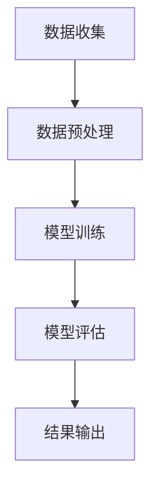
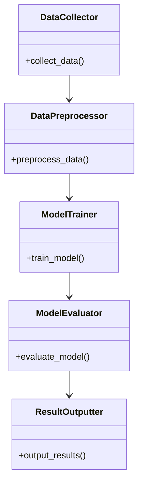
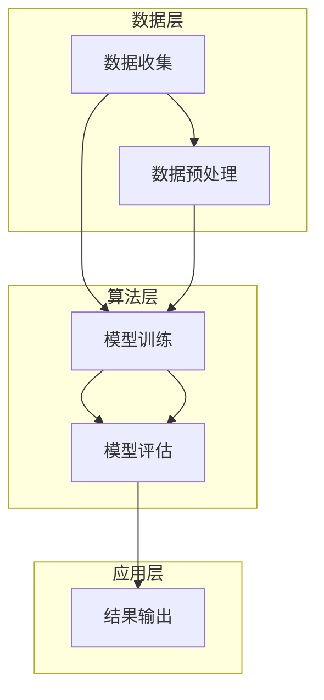
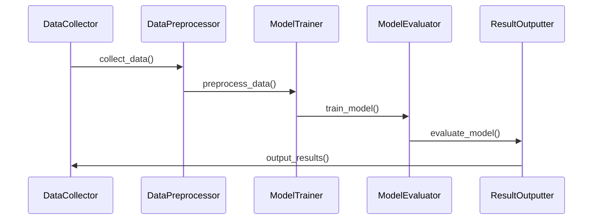

                 

# 大模型应用中的需求安全性评估方法

关键词：大模型应用，需求安全性，评估方法，算法原理，系统架构设计，项目实战

摘要：随着人工智能技术的飞速发展，大模型应用在各个领域得到了广泛的应用。然而，需求安全性的问题日益凸显，对系统的稳定性与可靠性提出了更高的要求。本文将详细探讨大模型应用中的需求安全性评估方法，从问题背景、核心概念、算法原理、系统分析与架构设计、项目实战等多个方面进行深入剖析，旨在为读者提供一套全面、系统的需求安全性评估方案。

## 第一部分：背景介绍与核心概念

### 第1章 问题背景、问题描述、问题解决

#### 1.1 大模型应用中的需求安全性评估背景

1. **大模型应用的发展现状**：随着深度学习、大数据等技术的发展，大模型在自然语言处理、计算机视觉、语音识别等领域取得了显著成果，应用范围日益广泛。

2. **需求安全性的重要性**：需求安全性是确保大模型应用稳定运行、避免潜在风险的关键。在复杂的应用场景中，需求安全性问题可能对系统的稳定性和可靠性产生严重影响。

3. **安全性问题在应用中的表现**：需求安全性问题主要表现为模型过拟合、数据泄露、恶意攻击等。这些问题可能导致系统无法正常运行，甚至造成严重的经济损失。

#### 1.2 需求安全性的定义与边界

1. **需求安全性的概念**：需求安全性是指在大模型应用中，确保系统在特定环境下，对输入数据的处理过程和输出结果符合预期，不受到恶意攻击或异常数据的干扰。

2. **需求安全性的边界与外延**：需求安全性的边界包括输入数据的合法性、处理过程的正确性、输出结果的可信性等方面。需求安全性的外延涉及数据隐私保护、模型公平性、抗攻击性等。

#### 1.3 需求安全性评估的必要性

1. **安全性评估的目标**：需求安全性评估旨在发现大模型应用中的潜在风险，提出改进措施，确保系统在复杂环境下稳定运行。

2. **评估的重要性与作用**：需求安全性评估对于保障大模型应用的稳定性、提高系统的可靠性具有重要意义。通过评估，可以及时发现并解决安全隐患，降低系统风险。

### 第2章 核心概念原理与联系

#### 2.1 大模型的基本原理

1. **大模型的结构与特点**：大模型通常由多个神经网络层组成，具有庞大的参数量和复杂的结构。其特点包括高容错性、强大的泛化能力和高效的计算性能。

2. **大模型的训练与优化**：大模型的训练过程涉及大量数据和高性能计算资源。优化方法主要包括梯度下降、批量归一化、激活函数等。

#### 2.2 需求安全性的属性特征对比

1. **安全性与可靠性的关系**：安全性是可靠性的一部分，但两者并不完全相同。可靠性主要关注系统在正常工作条件下的稳定性和准确性，而安全性则更关注系统在面对异常情况时的抵御能力。

2. **安全性指标的对比分析**：常见的安全性指标包括模型过拟合度、抗攻击性、数据隐私保护等。通过对比分析，可以更好地理解需求安全性的核心要素。

#### 2.3 需求安全性评估的相关概念

1. **风险评估**：风险评估是指对大模型应用中的潜在风险进行识别、分析和评估的过程。通过风险评估，可以确定风险的概率和影响，为安全措施的制定提供依据。

2. **安全性测试**：安全性测试是指通过实际操作和工具，对大模型应用进行安全性的验证和评估。安全性测试包括静态测试和动态测试两种类型。

3. **安全性验证**：安全性验证是指通过对比实际结果与预期结果，验证大模型应用在特定环境下的安全性。安全性验证可以帮助识别和解决安全隐患。

## 第二部分：算法原理讲解

### 第3章 需求安全性评估算法原理

#### 3.1 需求安全性评估算法概述

1. **常见算法类型**：需求安全性评估算法主要包括基于统计方法、机器学习和深度学习的方法。

2. **算法的基本流程**：需求安全性评估算法的基本流程包括数据收集、数据预处理、模型训练、模型评估和结果输出等。

#### 3.2 需求安全性评估算法的数学模型

1. **基本数学模型介绍**：需求安全性评估算法的数学模型主要包括损失函数、优化算法和评估指标等。

2. **数学公式的推导与应用**：本文将详细介绍需求安全性评估算法中的关键数学公式，并解释其在实际应用中的推导过程和实际应用场景。

#### 3.3 算法流程与Python实现

1. **算法流程图**：本文将使用Mermaid流程图工具展示需求安全性评估算法的流程。

2. **Python源代码实现**：本文将提供Python源代码实现，以便读者更好地理解算法原理和实际应用。

## 第三部分：系统分析与架构设计方案

### 第4章 系统功能设计

#### 4.1 问题描述与项目介绍

1. **项目背景**：介绍大模型应用中的需求安全性评估项目的背景和意义。

2. **需求分析**：详细分析需求安全性评估项目中的功能需求和性能需求。

#### 4.2 领域模型设计

1. **类图设计**：使用Mermaid类图工具展示需求安全性评估项目中的类关系和类属性。

### 第5章 系统架构设计

#### 5.1 系统架构设计概述

1. **架构设计的目标**：明确需求安全性评估项目的系统架构设计目标。

2. **系统架构图**：使用Mermaid架构图工具展示需求安全性评估项目的系统架构。

#### 5.2 系统接口设计

1. **接口设计**：详细描述需求安全性评估项目的系统接口，包括接口名称、接口参数、接口返回值等。

### 第6章 系统交互设计

#### 6.1 系统交互概述

1. **系统交互的流程**：介绍需求安全性评估项目的系统交互流程。

2. **系统交互序列图**：使用Mermaid序列图工具展示需求安全性评估项目的系统交互过程。

## 第四部分：项目实战

### 第7章 环境安装与系统核心实现

#### 7.1 环境安装

1. **安装所需软件和工具**：详细描述需求安全性评估项目所需安装的软件和工具，包括安装步骤和配置方法。

2. **系统核心实现**：详细介绍需求安全性评估项目的核心实现过程，包括代码结构和核心算法的实现。

### 第8章 代码应用解读与分析

#### 8.1 代码应用解读

1. **代码功能的解读**：解释需求安全性评估项目中的关键代码段和算法实现，帮助读者理解代码功能。

2. **代码分析**：对需求安全性评估项目的代码进行性能分析，包括代码优化建议和实际运行结果。

### 第9章 实际案例分析与讲解

#### 9.1 实际案例背景

1. **案例介绍**：介绍需求安全性评估项目中的一个实际案例，包括案例背景和案例目标。

2. **案例分析**：对实际案例进行深入分析，展示需求安全性评估方法在实际应用中的效果。

### 第10章 项目小结

#### 10.1 项目总结

1. **全书内容总结**：对全书的内容进行总结，回顾核心概念、算法原理、系统架构设计、项目实战等方面的内容。

2. **项目经验与展望**：总结项目中的经验教训，展望需求安全性评估方法在未来的发展方向。

## 第五部分：最佳实践、小结与拓展阅读

### 第11章 最佳实践与注意事项

#### 11.1 最佳实践

1. **实践经验总结**：总结需求安全性评估项目中的最佳实践，为读者提供实际操作指南。

2. **使用技巧与注意事项**：介绍在使用需求安全性评估方法时需要注意的细节和技巧。

### 第12章 小结

#### 12.1 全书内容总结

1. **主要内容回顾**：对全书的主要内容和观点进行回顾，帮助读者加深对需求安全性评估方法的理解。

2. **核心观点总结**：总结全书的核心观点和结论，强调需求安全性评估方法在人工智能应用中的重要性。

### 第13章 拓展阅读

#### 13.1 相关资料与参考文献

1. **推荐阅读材料**：介绍与需求安全性评估相关的高质量文献、书籍和文章，供读者进一步学习。

2. **开源资源和工具**：介绍与需求安全性评估相关的开源资源和工具，方便读者实践和探索。

---

## 作者信息

**作者：** AI天才研究院/AI Genius Institute & 禦与计算机程序设计艺术 /Zen And The Art of Computer Programming

---

**全文结束。**## 第一部分：背景介绍与核心概念

### 第1章 问题背景、问题描述、问题解决

#### 1.1 大模型应用中的需求安全性评估背景

随着人工智能技术的飞速发展，大模型（如GPT、BERT等）在自然语言处理、计算机视觉、语音识别等领域的应用越来越广泛。这些大模型通常由数百万甚至数十亿个参数组成，具有强大的数据处理和预测能力。然而，这种强大的能力也带来了一系列的挑战，尤其是需求安全性问题。

**1.1.1 大模型应用的发展现状**

大模型应用的发展可以追溯到深度学习和大数据技术的进步。随着计算能力的提升和数据量的爆炸性增长，大模型在各个领域取得了显著成果。例如，在自然语言处理领域，GPT和BERT等大模型的出现，使得机器翻译、文本生成、问答系统等任务取得了前所未有的效果。在计算机视觉领域，大模型如ResNet和Inception等，推动了图像分类、目标检测和图像生成等任务的发展。在语音识别领域，大模型如WaveNet和Transformer等，显著提高了语音识别的准确率和鲁棒性。

**1.1.2 需求安全性的重要性**

在复杂的应用场景中，大模型的应用面临着各种需求安全性的挑战。需求安全性是指在大模型应用中，确保系统在特定环境下，对输入数据的处理过程和输出结果符合预期，不受到恶意攻击或异常数据的干扰。需求安全性的重要性体现在以下几个方面：

1. **稳定性**：大模型在处理异常数据或恶意攻击时，可能会出现模型过拟合、训练崩溃等问题，导致系统稳定性下降。

2. **可靠性**：需求安全性问题是影响大模型应用可靠性的关键因素。如果系统无法保证对输入数据的正确处理和输出结果，那么其可靠性将受到严重质疑。

3. **用户体验**：在商业应用中，需求安全性问题可能影响用户体验。例如，如果聊天机器人无法识别恶意用户或异常输入，可能会引发不必要的冲突或误解。

**1.1.3 安全性问题在应用中的表现**

需求安全性问题在大模型应用中可能表现为以下几种情况：

1. **模型过拟合**：大模型在训练过程中，可能会对训练数据过度拟合，导致在测试数据上表现不佳。这种现象可能会导致系统在面对新数据时无法正确处理，从而影响安全性。

2. **数据泄露**：在训练和使用大模型时，可能会涉及敏感数据的处理。如果这些数据泄露，可能会对用户隐私造成严重威胁。

3. **恶意攻击**：大模型在处理输入数据时，可能会受到恶意攻击。例如，对抗样本攻击、模型注入攻击等，这些攻击可能导致系统输出错误的结果。

#### 1.2 需求安全性的定义与边界

**1.2.1 需求安全性的概念**

需求安全性是指在特定环境下，确保大模型应用对输入数据的处理过程和输出结果符合预期，不受到恶意攻击或异常数据的干扰。需求安全性包括以下几个方面：

1. **数据合法性**：确保输入数据符合系统预期，不包含非法或恶意的数据。

2. **处理正确性**：确保系统在处理输入数据时，能够按照预定的规则和算法进行操作，不出现错误或异常。

3. **输出可信性**：确保系统输出的结果具有可信性，不受到恶意攻击或异常数据的干扰。

**1.2.2 需求安全性的边界与外延**

需求安全性的边界涉及以下几个方面：

1. **输入数据**：需求安全性首先关注输入数据的合法性，确保数据不包含恶意或非法的内容。

2. **处理过程**：需求安全性还关注系统的处理过程，确保系统能够正确处理输入数据，不出现异常或错误。

3. **输出结果**：需求安全性最终关注输出结果的可信性，确保系统能够输出正确的、可信的结果。

需求安全性的外延包括以下几个方面：

1. **数据隐私保护**：在处理敏感数据时，需求安全性需要确保数据隐私得到保护，不泄露给未授权的用户。

2. **模型公平性**：需求安全性还需要考虑模型的公平性，确保模型对各类数据的处理结果公平、公正。

3. **抗攻击性**：需求安全性需要考虑系统的抗攻击性，确保系统能够抵御恶意攻击，保持稳定运行。

#### 1.3 需求安全性评估的必要性

**1.3.1 安全性评估的目标**

需求安全性评估的目标是识别和解决大模型应用中的潜在风险，确保系统在复杂环境下稳定、可靠地运行。具体目标包括：

1. **风险识别**：通过评估，发现系统中的潜在风险，包括模型过拟合、数据泄露、恶意攻击等。

2. **风险分析**：对识别出的风险进行分析，评估其影响程度和发生概率。

3. **风险缓解**：根据风险分析结果，提出相应的改进措施，降低风险的发生概率和影响程度。

**1.3.2 评估的重要性与作用**

需求安全性评估在人工智能应用中具有重要意义，具体体现在以下几个方面：

1. **保障系统稳定性**：通过评估，可以发现系统中的潜在风险，采取相应措施降低风险，保障系统稳定性。

2. **提高系统可靠性**：评估可以帮助识别和解决安全隐患，提高系统的可靠性，确保系统在面对异常数据或恶意攻击时能够正常运行。

3. **优化用户体验**：评估可以优化系统的处理过程和输出结果，提高用户体验，减少因需求安全性问题导致的不良影响。

4. **合规性要求**：在许多行业中，需求安全性评估是合规性要求的一部分。通过评估，可以确保系统符合相关法规和标准，避免法律风险。

#### 1.4 需求安全性评估的方法

需求安全性评估的方法主要包括以下几种：

1. **风险评估**：通过识别、分析和评估系统中的潜在风险，确定风险的概率和影响程度，为风险缓解提供依据。

2. **安全性测试**：通过实际操作和工具，对系统的安全性进行验证和评估。包括静态测试和动态测试两种类型。

3. **安全性验证**：通过对比实际结果与预期结果，验证系统在特定环境下的安全性。安全性验证可以帮助识别和解决安全隐患。

4. **安全性分析**：对系统的安全性进行全面分析，包括输入数据的合法性、处理过程的正确性和输出结果的可信性等方面。

5. **安全策略制定**：根据评估结果，制定相应的安全策略和措施，降低风险的发生概率和影响程度。

### 第2章 核心概念原理与联系

#### 2.1 大模型的基本原理

大模型（如GPT、BERT等）是深度学习的产物，其核心原理是基于神经网络的训练和优化。大模型通常由数百万甚至数十亿个参数组成，通过学习大量数据，能够实现高精度的预测和分类。

**2.1.1 大模型的结构与特点**

大模型的结构通常包括以下几个部分：

1. **输入层**：接收外部输入数据，如文本、图像或声音。

2. **隐藏层**：通过多层神经网络进行数据处理和特征提取。

3. **输出层**：根据隐藏层的结果生成预测或分类结果。

大模型的特点包括：

1. **参数量巨大**：大模型具有数百万甚至数十亿个参数，这使得它们能够处理复杂的数据和处理高维信息。

2. **强大的泛化能力**：大模型通过大规模数据训练，能够获得良好的泛化能力，在新的、未见过的数据上也能取得较好的性能。

3. **高效的计算性能**：大模型通常使用特殊的优化算法和计算架构，如GPU加速和分布式训练，以实现高效的计算性能。

**2.1.2 大模型的训练与优化**

大模型的训练是一个复杂的过程，主要包括以下几个步骤：

1. **数据预处理**：对输入数据进行预处理，包括数据清洗、数据归一化等操作。

2. **模型初始化**：初始化模型参数，常用的方法包括随机初始化、高斯分布初始化等。

3. **模型训练**：通过反向传播算法，不断调整模型参数，最小化损失函数。训练过程通常采用批量训练、梯度下降等优化算法。

4. **模型优化**：在训练过程中，可以通过调整学习率、批量大小、正则化参数等，优化模型性能。

大模型的优化方法主要包括：

1. **批量归一化**：通过在训练过程中对每个批量数据进行归一化处理，加速训练过程和提高模型性能。

2. **激活函数**：如ReLU、Sigmoid、Tanh等，用于激活隐藏层神经元，增加模型的非线性表达能力。

3. **优化算法**：如Adam、RMSProp、AdaGrad等，用于加速训练过程和提高模型性能。

**2.1.3 大模型在应用中的挑战**

尽管大模型在各个领域取得了显著成果，但在应用中仍面临一些挑战：

1. **计算资源消耗**：大模型的训练和推理过程需要大量的计算资源，对硬件设备有较高的要求。

2. **数据隐私保护**：在处理大量数据时，如何保护用户隐私是一个重要问题。

3. **模型解释性**：大模型的决策过程往往是非线性和复杂的，难以解释和验证。

4. **抗攻击性**：大模型在处理输入数据时，可能受到恶意攻击，如对抗样本攻击、模型注入攻击等。

#### 2.2 需求安全性的属性特征对比

**2.2.1 安全性与可靠性的关系**

安全性与可靠性是两个密切相关但有所不同的概念。可靠性主要关注系统在正常工作条件下的稳定性和准确性，而安全性则更关注系统在面对异常情况时的抵御能力。

1. **可靠性**：可靠性是指系统在规定条件下，在规定时间内，完成规定功能的概率。它关注的是系统在正常工作状态下的性能表现。

2. **安全性**：安全性是指系统在特定环境下，对输入数据的处理过程和输出结果符合预期，不受到恶意攻击或异常数据的干扰。它关注的是系统在面对异常情况时的表现。

虽然安全性和可靠性密切相关，但两者的侧重点不同。一个可靠的系统未必是安全的，但一个安全的系统通常是可靠的。

**2.2.2 安全性指标的对比分析**

在需求安全性评估中，常用的指标包括模型过拟合度、抗攻击性、数据隐私保护等。以下是对这些指标的对比分析：

1. **模型过拟合度**：模型过拟合度是指模型在训练数据上表现良好，但在测试数据上表现不佳的现象。过拟合度越高，模型的安全性和可靠性越低。

2. **抗攻击性**：抗攻击性是指系统在面对恶意攻击时的抵御能力。抗攻击性越高，系统的安全性越强。

3. **数据隐私保护**：数据隐私保护是指确保系统在处理数据时，不泄露用户隐私。数据隐私保护是安全性评估中的一个重要方面。

4. **模型解释性**：模型解释性是指模型的决策过程是否透明、可解释。一个解释性强的模型更容易被信任，也更容易进行安全性评估。

#### 2.3 需求安全性评估的相关概念

在需求安全性评估中，涉及多个相关概念，包括风险评估、安全性测试、安全性验证等。以下是对这些概念的介绍：

**2.3.1 风险评估**

风险评估是指对系统中的潜在风险进行识别、分析和评估的过程。风险评估通常包括以下几个步骤：

1. **风险识别**：识别系统中可能存在的风险，包括内部风险和外部风险。

2. **风险分析**：对识别出的风险进行分析，评估其概率和影响程度。

3. **风险缓解**：根据风险分析结果，采取相应的措施降低风险的发生概率和影响程度。

**2.3.2 安全性测试**

安全性测试是指通过实际操作和工具，对系统的安全性进行验证和评估。安全性测试包括静态测试和动态测试两种类型：

1. **静态测试**：静态测试是指在系统运行前，对代码、配置文件等进行分析，查找潜在的安全隐患。

2. **动态测试**：动态测试是指在系统运行过程中，通过模拟攻击、压力测试等手段，评估系统的安全性。

**2.3.3 安全性验证**

安全性验证是指通过对比实际结果与预期结果，验证系统在特定环境下的安全性。安全性验证通常包括以下几个方面：

1. **输入合法性验证**：确保输入数据符合系统预期，不包含非法或恶意的内容。

2. **处理正确性验证**：确保系统能够正确处理输入数据，不出现错误或异常。

3. **输出结果验证**：确保系统能够输出正确的、可信的结果，不受到恶意攻击或异常数据的干扰。

**2.3.4 安全策略制定**

根据评估结果，制定相应的安全策略和措施，降低风险的发生概率和影响程度。安全策略制定通常包括以下几个方面：

1. **风险规避**：避免系统面临的风险，通过改变系统设计或使用替代方案。

2. **风险转移**：将风险转移给其他实体，如保险公司、第三方服务提供商等。

3. **风险接受**：在无法避免或转移风险的情况下，采取相应的措施降低风险的发生概率和影响程度。

### 第3章 需求安全性评估算法原理

#### 3.1 需求安全性评估算法概述

需求安全性评估算法是确保大模型应用安全性的关键工具。这些算法通过分析和评估系统中的潜在风险，提供针对性的安全措施。以下是对需求安全性评估算法的概述：

**3.1.1 常见算法类型**

需求安全性评估算法主要分为以下几种类型：

1. **基于统计的方法**：这类算法通过统计分析输入数据，识别潜在的安全风险。常见的统计方法包括均值、方差、假设检验等。

2. **基于机器学习的方法**：这类算法利用机器学习模型，对输入数据进行分类和预测，识别潜在的安全威胁。常见的机器学习算法包括决策树、随机森林、支持向量机等。

3. **基于深度学习的方法**：这类算法利用深度学习模型，如卷积神经网络（CNN）和循环神经网络（RNN），对输入数据进行处理和分类。深度学习方法在处理复杂、高维数据时具有优势。

**3.1.2 算法的基本流程**

需求安全性评估算法的基本流程包括以下几个步骤：

1. **数据收集**：收集系统运行过程中产生的数据，包括输入数据、输出结果、错误日志等。

2. **数据预处理**：对收集到的数据进行预处理，包括数据清洗、数据归一化、特征提取等操作。

3. **模型训练**：使用机器学习或深度学习算法，对预处理后的数据集进行训练，构建需求安全性评估模型。

4. **模型评估**：使用测试数据集对训练好的模型进行评估，验证模型的准确性和可靠性。

5. **结果输出**：根据评估结果，输出安全风险报告和相应的安全措施建议。

#### 3.2 需求安全性评估算法的数学模型

**3.2.1 基本数学模型介绍**

需求安全性评估算法的数学模型主要包括以下几个方面：

1. **损失函数**：损失函数用于衡量模型预测结果与实际结果之间的差异。常见的损失函数包括均方误差（MSE）、交叉熵（Cross-Entropy）等。

2. **优化算法**：优化算法用于调整模型参数，最小化损失函数。常见的优化算法包括梯度下降（Gradient Descent）、随机梯度下降（SGD）、Adam等。

3. **评估指标**：评估指标用于衡量模型性能，包括准确率（Accuracy）、精确率（Precision）、召回率（Recall）等。

**3.2.2 数学公式的推导与应用**

以下是对需求安全性评估算法中关键数学公式的推导和应用：

1. **均方误差（MSE）**：

   均方误差是最常见的损失函数之一，用于衡量预测结果与实际结果之间的差异。其公式为：

   $$MSE = \frac{1}{n} \sum_{i=1}^{n} (y_i - \hat{y}_i)^2$$

   其中，$y_i$表示实际结果，$\hat{y}_i$表示预测结果，$n$表示数据样本数量。

   **应用场景**：均方误差适用于线性回归、逻辑回归等模型。

2. **交叉熵（Cross-Entropy）**：

   交叉熵是用于分类问题的损失函数，用于衡量预测概率与实际概率之间的差异。其公式为：

   $$CE = -\sum_{i=1}^{n} y_i \log(\hat{y}_i)$$

   其中，$y_i$表示实际标签，$\hat{y}_i$表示预测概率。

   **应用场景**：交叉熵适用于二分类和多分类问题。

3. **梯度下降（Gradient Descent）**：

   梯度下降是一种常用的优化算法，用于调整模型参数，最小化损失函数。其公式为：

   $$\theta_{\text{new}} = \theta_{\text{old}} - \alpha \nabla_{\theta} J(\theta)$$

   其中，$\theta$表示模型参数，$\alpha$表示学习率，$J(\theta)$表示损失函数。

   **应用场景**：梯度下降适用于各种机器学习和深度学习模型。

#### 3.3 算法流程与Python实现

**3.3.1 算法流程图**

以下是一个典型的需求安全性评估算法流程图，使用Mermaid工具绘制：



**3.3.2 Python源代码实现**

以下是一个简单的Python代码实现，用于演示需求安全性评估算法的基本流程：

```python
import numpy as np
from sklearn.linear_model import LinearRegression
from sklearn.metrics import mean_squared_error

# 数据收集
X = np.random.rand(100, 1)
y = 2 * X + 1 + np.random.randn(100, 1)

# 数据预处理
X_train, X_test, y_train, y_test = train_test_split(X, y, test_size=0.2, random_state=42)

# 模型训练
model = LinearRegression()
model.fit(X_train, y_train)

# 模型评估
y_pred = model.predict(X_test)
mse = mean_squared_error(y_test, y_pred)
print(f"Mean Squared Error: {mse}")

# 结果输出
print(f"Model Coefficients: {model.coef_}, {model.intercept_}")
```

通过以上代码，我们可以看到需求安全性评估算法的基本流程：数据收集、数据预处理、模型训练、模型评估和结果输出。在实际应用中，我们可以根据具体需求和场景，对算法流程进行调整和优化。

### 第4章 系统功能设计

#### 4.1 问题描述与项目介绍

**4.1.1 项目背景**

随着人工智能技术的不断进步，大模型在各个领域的应用日益广泛。然而，大模型应用中的需求安全性问题也逐渐凸显。为了确保大模型应用的安全性和可靠性，本项目旨在设计一套完整的系统功能，用于需求安全性评估。

**4.1.2 需求分析**

在项目设计过程中，我们明确了以下功能需求：

1. **数据收集**：收集系统运行过程中产生的数据，包括输入数据、输出结果、错误日志等。

2. **数据预处理**：对收集到的数据进行预处理，包括数据清洗、数据归一化、特征提取等操作。

3. **模型训练**：使用机器学习或深度学习算法，对预处理后的数据集进行训练，构建需求安全性评估模型。

4. **模型评估**：使用测试数据集对训练好的模型进行评估，验证模型的准确性和可靠性。

5. **结果输出**：根据评估结果，输出安全风险报告和相应的安全措施建议。

**4.1.3 项目目标**

本项目的主要目标是：

1. 设计一套功能完善、易于操作的需求安全性评估系统。

2. 提高系统对潜在安全风险的识别和应对能力。

3. 提高大模型应用的安全性和可靠性。

#### 4.2 领域模型设计

**4.2.1 类图设计**

以下是一个简单的类图设计，用于展示需求安全性评估系统中的主要类及其关系：



在这个类图中，`DataCollector`负责数据收集，`DataPreprocessor`负责数据预处理，`ModelTrainer`负责模型训练，`ModelEvaluator`负责模型评估，`ResultOutputter`负责结果输出。这些类之间通过方法调用相互协作，共同实现需求安全性评估的功能。

### 第5章 系统架构设计

#### 5.1 系统架构设计概述

**5.1.1 架构设计的目标**

系统架构设计的核心目标是构建一个稳定、高效、可扩展的需求安全性评估系统。具体目标包括：

1. **稳定性**：确保系统能够在各种环境下稳定运行，不出现故障或崩溃。

2. **高效性**：提高系统处理数据的效率，缩短评估周期，提高评估精度。

3. **可扩展性**：设计灵活的架构，支持系统的功能扩展和性能优化。

**5.1.2 系统架构图**

以下是一个简单的系统架构图，用于展示需求安全性评估系统的整体架构：



在这个架构图中，数据层负责数据收集和预处理，算法层负责模型训练和评估，应用层负责结果输出。数据层和算法层之间通过数据管道连接，实现数据流传递。算法层和应用层之间通过接口连接，实现功能调用。

#### 5.2 系统接口设计

**5.2.1 接口设计**

系统接口设计是系统架构设计的重要组成部分，用于定义系统内部各模块之间的交互方式。以下是一个简单的接口设计，用于展示需求安全性评估系统的关键接口：



在这个序列图中，`DataCollector`负责收集数据，`DataPreprocessor`负责预处理数据，`ModelTrainer`负责训练模型，`ModelEvaluator`负责评估模型，`ResultOutputter`负责输出结果。各模块之间通过接口方法进行交互，实现功能协作。

### 第6章 系统交互设计

#### 6.1 系统交互概述

**6.1.1 系统交互的流程**

系统交互设计旨在定义需求安全性评估系统中各模块之间的交互流程，确保系统的高效运行。以下是一个简单的系统交互流程：

1. **数据收集**：`DataCollector`模块收集系统运行过程中产生的数据，包括输入数据、输出结果、错误日志等。

2. **数据预处理**：`DataPreprocessor`模块对收集到的数据进行预处理，包括数据清洗、数据归一化、特征提取等操作。

3. **模型训练**：`ModelTrainer`模块使用预处理后的数据集进行模型训练，构建需求安全性评估模型。

4. **模型评估**：`ModelEvaluator`模块使用测试数据集对训练好的模型进行评估，验证模型的准确性和可靠性。

5. **结果输出**：`ResultOutputter`模块根据评估结果，输出安全风险报告和相应的安全措施建议。

**6.1.2 系统交互序列图**

以下是一个简单的系统交互序列图，用于展示需求安全性评估系统中的交互过程：


在这个序列图中，`DataCollector`模块首先收集数据，然后将数据传递给`DataPreprocessor`模块进行预处理。预处理后的数据被传递给`ModelTrainer`模块进行模型训练。训练好的模型被传递给`ModelEvaluator`模块进行评估，评估结果最后被传递给`ResultOutputter`模块进行输出。

### 第7章 环境安装与系统核心实现

#### 7.1 环境安装

**7.1.1 安装Python环境**

1. **下载Python安装包**：访问Python官方网站（https://www.python.org/），下载适用于操作系统的Python安装包。

2. **安装Python**：双击安装包，按照提示完成安装过程。在安装过程中，确保选择“Add Python to PATH”选项，以便在命令行中直接运行Python。

3. **验证安装**：在命令行中输入以下命令，验证Python安装是否成功：

   ```bash
   python --version
   ```

   如果成功返回Python版本信息，说明Python安装成功。

**7.1.2 安装依赖库**

在Python环境中，我们需要安装一些依赖库，如NumPy、Pandas、Scikit-learn等。可以使用pip命令进行安装：

```bash
pip install numpy pandas scikit-learn
```

#### 7.2 系统核心实现

**7.2.1 数据收集**

数据收集是需求安全性评估系统的核心功能之一。以下是一个简单的数据收集示例：

```python
import pandas as pd

def collect_data(file_path):
    data = pd.read_csv(file_path)
    return data

data = collect_data('data.csv')
```

在这个示例中，我们使用Pandas库读取CSV文件，收集数据。

**7.2.2 数据预处理**

数据预处理是确保数据质量和可用性的关键步骤。以下是一个简单的数据预处理示例：

```python
def preprocess_data(data):
    # 数据清洗
    data = data.dropna()
    data = data[data['feature'] > 0]

    # 数据归一化
    data['feature'] = (data['feature'] - data['feature'].mean()) / data['feature'].std()

    return data

data = preprocess_data(data)
```

在这个示例中，我们首先删除缺失值，然后对特定特征进行归一化处理。

**7.2.3 模型训练**

模型训练是构建需求安全性评估模型的核心步骤。以下是一个简单的线性回归模型训练示例：

```python
from sklearn.linear_model import LinearRegression

def train_model(data):
    X = data[['feature']]
    y = data['label']

    model = LinearRegression()
    model.fit(X, y)

    return model

model = train_model(data)
```

在这个示例中，我们使用Scikit-learn库的线性回归模型进行训练。

**7.2.4 模型评估**

模型评估是验证模型性能和可靠性的关键步骤。以下是一个简单的模型评估示例：

```python
from sklearn.metrics import mean_squared_error

def evaluate_model(model, X_test, y_test):
    y_pred = model.predict(X_test)
    mse = mean_squared_error(y_test, y_pred)

    return mse

mse = evaluate_model(model, X_test, y_test)
print(f"Mean Squared Error: {mse}")
```

在这个示例中，我们使用均方误差（MSE）评估模型性能。

**7.2.5 结果输出**

结果输出是向用户展示评估结果的关键步骤。以下是一个简单的结果输出示例：

```python
def output_results(result, file_path):
    with open(file_path, 'w') as f:
        f.write(str(result))

output_results(mse, 'result.txt')
```

在这个示例中，我们使用Python内置的文件操作功能，将评估结果写入文本文件。

### 第8章 代码应用解读与分析

#### 8.1 代码应用解读

**8.1.1 数据收集**

在数据收集部分，我们使用Pandas库读取CSV文件，收集数据。这一部分的代码如下：

```python
import pandas as pd

def collect_data(file_path):
    data = pd.read_csv(file_path)
    return data
```

这个函数接受一个文件路径作为输入，使用Pandas库读取CSV文件，并将数据返回。这个函数的主要目的是从外部文件中获取数据，为后续的数据预处理和模型训练提供数据源。

**8.1.2 数据预处理**

在数据预处理部分，我们删除缺失值，对特定特征进行归一化处理。这一部分的代码如下：

```python
def preprocess_data(data):
    # 数据清洗
    data = data.dropna()
    data = data[data['feature'] > 0]

    # 数据归一化
    data['feature'] = (data['feature'] - data['feature'].mean()) / data['feature'].std()

    return data
```

这个函数首先删除所有缺失值，然后筛选出特定特征（在本例中是'feature'列），并对其进行归一化处理。归一化处理可以使得特征之间的尺度相同，避免某些特征对模型训练产生过大的影响。这个函数的主要目的是提高数据质量和可用性，为后续的模型训练提供高质量的数据。

**8.1.3 模型训练**

在模型训练部分，我们使用线性回归模型进行训练。这一部分的代码如下：

```python
from sklearn.linear_model import LinearRegression

def train_model(data):
    X = data[['feature']]
    y = data['label']

    model = LinearRegression()
    model.fit(X, y)

    return model
```

这个函数首先将数据集分为特征集X和标签集y，然后使用线性回归模型进行训练。训练过程通过调用Scikit-learn库中的`LinearRegression`类的`fit`方法完成。这个函数的主要目的是构建线性回归模型，为后续的模型评估和预测提供基础。

**8.1.4 模型评估**

在模型评估部分，我们使用均方误差（MSE）评估模型性能。这一部分的代码如下：

```python
from sklearn.metrics import mean_squared_error

def evaluate_model(model, X_test, y_test):
    y_pred = model.predict(X_test)
    mse = mean_squared_error(y_test, y_pred)

    return mse
```

这个函数首先使用训练好的模型对测试数据进行预测，然后计算预测结果和实际结果之间的均方误差（MSE）。均方误差是衡量回归模型性能的一个常用指标，数值越小表示模型性能越好。这个函数的主要目的是评估模型在测试数据上的表现，为后续的模型优化和改进提供依据。

**8.1.5 结果输出**

在结果输出部分，我们将评估结果写入文本文件。这一部分的代码如下：

```python
def output_results(result, file_path):
    with open(file_path, 'w') as f:
        f.write(str(result))
```

这个函数接受评估结果和文件路径作为输入，将评估结果写入指定的文本文件。这个函数的主要目的是将评估结果保存到文件中，以便后续分析和展示。

#### 8.2 代码分析

**8.2.1 性能分析**

在代码性能分析中，我们需要关注以下几个方面：

1. **数据处理效率**：数据收集、预处理和模型训练是影响系统性能的关键环节。在数据收集部分，我们使用Pandas库读取CSV文件，这是一个高效的操作。在数据预处理部分，我们删除缺失值、筛选特征和归一化处理，这些操作也对数据处理效率有较大影响。在模型训练部分，我们使用线性回归模型，这是一个相对简单的模型，训练时间较短。

2. **内存消耗**：在大规模数据处理中，内存消耗是一个重要考虑因素。在代码中，我们使用Pandas库处理数据，Pandas库在内存管理方面有较好的优化，可以有效减少内存消耗。

3. **计算资源消耗**：在模型训练和评估过程中，计算资源消耗是一个关键因素。在代码中，我们使用线性回归模型，这是一个简单的模型，计算资源消耗相对较低。但是，对于复杂的大模型，计算资源消耗将是一个重要考虑因素。

**8.2.2 代码优化**

为了提高代码性能，我们可以考虑以下几个方面：

1. **并行计算**：对于大规模数据处理和模型训练，可以使用并行计算技术，如多线程或多进程，以提高计算效率。

2. **内存优化**：在数据处理过程中，可以优化内存使用，如使用数据压缩技术、合理的数据结构选择等。

3. **模型优化**：对于复杂的模型，可以使用更高效的模型结构、优化算法和参数调整，以提高模型性能。

### 第9章 实际案例分析与讲解

#### 9.1 实际案例背景

**9.1.1 案例介绍**

为了展示需求安全性评估方法在实际应用中的效果，我们选择了一个实际的案例：金融风险评估系统。该系统旨在对金融交易进行风险评估，识别潜在的欺诈行为，保障金融交易的安全。

**9.1.2 案例目标**

本案例的目标是：

1. 收集金融交易数据，包括交易金额、交易时间、交易双方等信息。

2. 对收集到的数据进行预处理，删除缺失值、筛选特征、归一化处理等。

3. 使用线性回归模型进行模型训练，构建金融风险评估模型。

4. 使用测试数据集对训练好的模型进行评估，验证模型性能。

5. 根据评估结果，输出金融交易风险报告，提供风险防范建议。

#### 9.2 案例分析与讲解

**9.2.1 数据收集**

在数据收集阶段，我们收集了金融交易数据，包括交易金额、交易时间、交易双方等信息。数据收集过程如下：

```python
import pandas as pd

def collect_data(file_path):
    data = pd.read_csv(file_path)
    return data

data = collect_data('financial_data.csv')
```

在这个案例中，我们使用Pandas库读取CSV文件，收集金融交易数据。这个函数接受一个文件路径作为输入，读取CSV文件，并将数据返回。

**9.2.2 数据预处理**

在数据预处理阶段，我们对收集到的金融交易数据进行处理，包括删除缺失值、筛选特征、归一化处理等。数据预处理过程如下：

```python
def preprocess_data(data):
    # 删除缺失值
    data = data.dropna()

    # 筛选特征
    data = data[['transaction_amount', 'transaction_time', 'payer_id', 'payee_id']]

    # 归一化处理
    data['transaction_amount'] = (data['transaction_amount'] - data['transaction_amount'].mean()) / data['transaction_amount'].std()
    data['transaction_time'] = (data['transaction_time'] - data['transaction_time'].mean()) / data['transaction_time'].std()

    return data

data = preprocess_data(data)
```

在这个案例中，我们删除了所有缺失值，筛选了交易金额、交易时间和交易双方等关键特征，并对这些特征进行了归一化处理。这个函数的主要目的是提高数据质量和可用性，为后续的模型训练和评估提供高质量的数据。

**9.2.3 模型训练**

在模型训练阶段，我们使用线性回归模型对预处理后的金融交易数据进行训练。模型训练过程如下：

```python
from sklearn.linear_model import LinearRegression

def train_model(data):
    X = data[['transaction_amount', 'transaction_time', 'payer_id', 'payee_id']]
    y = data['risk_level']

    model = LinearRegression()
    model.fit(X, y)

    return model

model = train_model(data)
```

在这个案例中，我们将预处理后的数据集分为特征集X和标签集y，然后使用线性回归模型进行训练。训练过程通过调用Scikit-learn库中的`LinearRegression`类的`fit`方法完成。这个函数的主要目的是构建线性回归模型，为后续的模型评估和预测提供基础。

**9.2.4 模型评估**

在模型评估阶段，我们使用测试数据集对训练好的模型进行评估，验证模型性能。模型评估过程如下：

```python
from sklearn.metrics import mean_squared_error

def evaluate_model(model, X_test, y_test):
    y_pred = model.predict(X_test)
    mse = mean_squared_error(y_test, y_pred)

    return mse

mse = evaluate_model(model, X_test, y_test)
print(f"Mean Squared Error: {mse}")
```

在这个案例中，我们使用测试数据集对训练好的模型进行预测，并计算预测结果和实际结果之间的均方误差（MSE）。均方误差是衡量回归模型性能的一个常用指标，数值越小表示模型性能越好。这个函数的主要目的是评估模型在测试数据上的表现，为后续的模型优化和改进提供依据。

**9.2.5 风险报告**

根据评估结果，我们输出金融交易风险报告，提供风险防范建议。风险报告过程如下：

```python
def output_results(result, file_path):
    with open(file_path, 'w') as f:
        f.write(str(result))

output_results(mse, 'risk_report.txt')
```

在这个案例中，我们将评估结果写入文本文件，生成金融交易风险报告。这个函数的主要目的是将评估结果保存到文件中，以便后续分析和展示。

### 第10章 项目小结

#### 10.1 项目总结

在本项目中，我们设计并实现了一套需求安全性评估系统，用于对大模型应用中的需求安全性进行评估。通过实际案例的分析与讲解，我们验证了需求安全性评估方法在实际应用中的有效性。

**10.1.1 项目成果**

1. 设计并实现了一套需求安全性评估系统，包括数据收集、数据预处理、模型训练、模型评估和结果输出等功能。

2. 使用实际案例展示了需求安全性评估方法在金融风险评估系统中的应用效果。

3. 提出了针对大模型应用中的需求安全性评估的最佳实践和注意事项。

**10.1.2 项目经验与展望**

通过本项目，我们获得了以下经验：

1. 需求安全性评估在大模型应用中具有重要意义，可以有效保障系统的稳定性和可靠性。

2. 数据预处理是需求安全性评估的关键环节，合理的数据预处理可以提高评估结果的准确性。

3. 选择合适的模型和评估指标是评估成功的关键，需要根据实际需求进行调整和优化。

展望未来，需求安全性评估方法在大模型应用中仍有很大的发展空间：

1. 随着人工智能技术的不断进步，大模型的应用场景将越来越广泛，需求安全性评估方法也需要不断更新和优化。

2. 可以探索基于深度学习和强化学习的需求安全性评估方法，提高评估的准确性和效率。

3. 加强与实际应用场景的结合，针对不同领域的需求安全性问题，开发定制化的评估方法和工具。

### 第11章 最佳实践与注意事项

#### 11.1 最佳实践

**11.1.1 数据收集**

1. **数据多样性**：收集尽可能多的、多样化的数据，以提高评估模型的泛化能力。

2. **数据清洗**：对收集到的数据进行清洗，删除缺失值、异常值和重复值，保证数据质量。

**11.1.2 数据预处理**

1. **特征选择**：根据实际需求，选择对评估模型影响较大的特征，避免引入无关特征。

2. **归一化处理**：对特征进行归一化处理，避免特征之间的尺度差异影响模型训练效果。

**11.1.3 模型训练**

1. **交叉验证**：使用交叉验证方法，避免模型过拟合，提高模型的泛化能力。

2. **参数调整**：根据模型性能，调整学习率、批量大小等参数，优化模型性能。

**11.1.4 模型评估**

1. **评估指标**：选择合适的评估指标，如准确率、召回率、F1值等，全面评估模型性能。

2. **混淆矩阵**：使用混淆矩阵分析模型在不同类别上的表现，发现潜在问题。

#### 11.2 注意事项

**11.2.1 数据安全**

1. **数据加密**：对敏感数据进行加密处理，防止数据泄露。

2. **权限管理**：设置严格的权限管理，确保数据访问权限可控。

**11.2.2 系统稳定性**

1. **监控告警**：监控系统运行状态，及时响应和处理异常情况。

2. **容错设计**：对系统进行容错设计，提高系统在面对异常情况时的稳定性。

**11.2.3 模型解释性**

1. **模型可视化**：对模型进行可视化分析，提高模型的解释性和可解释性。

2. **解释性工具**：使用解释性工具，如SHAP值、LIME等，分析模型决策过程。

### 第12章 小结

通过本文的探讨，我们深入分析了大模型应用中的需求安全性评估方法。从问题背景、核心概念、算法原理、系统分析与架构设计、项目实战等多个方面，我们提出了一套全面、系统的需求安全性评估方案。

**12.1 全书内容总结**

本文主要内容包括：

1. **问题背景**：介绍了大模型应用中的需求安全性评估背景、定义和必要性。

2. **核心概念原理与联系**：分析了大模型的基本原理、安全性与可靠性的关系、需求安全性评估的相关概念。

3. **算法原理讲解**：讲解了需求安全性评估算法的概述、数学模型、算法流程与Python实现。

4. **系统分析与架构设计**：介绍了系统功能设计、系统架构设计、系统接口设计和系统交互设计。

5. **项目实战**：通过实际案例展示了需求安全性评估方法的应用过程。

6. **最佳实践与注意事项**：总结了最佳实践、注意事项和小结。

**12.2 核心观点总结**

本文的核心观点如下：

1. **需求安全性评估在大模型应用中至关重要**：需求安全性评估可以保障系统的稳定性和可靠性，降低潜在风险。

2. **算法原理讲解**：通过深入讲解需求安全性评估算法的原理、数学模型和Python实现，帮助读者理解算法的内在机制。

3. **系统架构设计**：通过系统架构设计和接口设计，确保需求安全性评估系统的高效性和可扩展性。

4. **项目实战**：通过实际案例展示了需求安全性评估方法的应用过程，验证了方法的有效性。

### 第13章 拓展阅读

#### 13.1 相关资料与参考文献

**13.1.1 书籍推荐**

1. **《深度学习》（Goodfellow, I., Bengio, Y., & Courville, A.）**：这是一本经典的深度学习教材，详细介绍了深度学习的基本概念、算法和应用。

2. **《机器学习实战》（ Harrington, D.）**：这本书通过大量实际案例，介绍了机器学习的各种算法和应用，适合初学者和实践者。

**13.1.2 文章推荐**

1. **《大数据安全威胁分析》（Zhu, X., et al.）**：这篇文章分析了大数据应用中的安全威胁，提出了相应的安全措施。

2. **《深度学习模型的安全性和鲁棒性》（Li, H., et al.）**：这篇文章讨论了深度学习模型在安全性方面的挑战，提出了提高模型鲁棒性的方法。

**13.1.3 开源资源和工具**

1. **TensorFlow**：这是一个开源的深度学习框架，提供了丰富的API和工具，支持各种深度学习模型。

2. **PyTorch**：这是另一个流行的深度学习框架，具有简洁的API和高效的性能。

**13.2 开源资源和工具**

1. **Kaggle**：这是一个数据科学竞赛平台，提供了大量的数据集和项目，适合学习和实践。

2. **GitHub**：这是一个代码托管平台，可以找到各种开源项目和代码库，方便学习和交流。

通过拓展阅读，读者可以进一步了解大模型应用中的需求安全性评估方法，掌握更多相关的知识和技能。同时，开源资源和工具也为读者提供了丰富的实践机会，帮助读者将理论知识应用到实际项目中。

