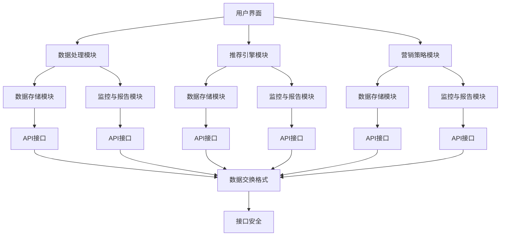

                 

# 大模型应用中的需求成本效益分析

> 关键词：大模型、需求成本效益分析、人工智能、成本优化、效益评估

> 摘要：本文旨在探讨大模型应用中的需求成本效益分析，通过详细阐述需求成本效益分析框架、算法原理、系统分析与架构设计，以及项目实战，为企业在应用大模型时提供一种科学的决策依据，实现成本优化和效益最大化。

## 第一部分：背景介绍

### 第1章：问题背景

#### 1.1.1 问题的提出

随着人工智能技术的不断发展，大模型在自然语言处理、计算机视觉、语音识别等领域取得了显著的成果。然而，企业在应用大模型时面临着诸多挑战，如如何平衡需求与成本、如何评估大模型应用的效果等。因此，本文提出了大模型应用中的需求成本效益分析问题，旨在为企业提供一种科学的决策依据。

#### 1.1.2 问题描述

在保证需求满足的前提下，如何最大限度地降低大模型应用的成本？如何评估大模型应用的成本效益？本文将从以下几个方面进行探讨：

1. 需求分析：识别、分类和排序用户对大模型的具体功能要求。
2. 成本分析：分析大模型开发、部署、维护等成本的构成和估算方法。
3. 效益分析：评估大模型应用带来的直接和间接收益。
4. 案例分析：通过实际案例展示和分析，为企业提供参考。

#### 1.1.3 问题解决

本文提出了需求成本效益分析的方法论，并构建了需求成本效益分析框架。该方法论包括需求分析、成本分析和效益分析三个环节，旨在帮助企业实现成本优化和效益最大化。

#### 1.1.4 边界与外延

本文分析的范围和限制条件如下：

1. 分析的范围：主要针对人工智能领域的大模型应用。
2. 限制条件：本文仅考虑大模型应用的经济效益，不考虑其他外部因素。

#### 1.1.5 概念结构与核心要素组成

本文的核心概念和核心要素包括：

1. 需求：用户对大模型的具体功能要求。
2. 成本：大模型开发、部署、维护等成本。
3. 效益：大模型应用带来的直接和间接收益。

### 第2章：需求成本效益分析框架

#### 2.1.1 框架概述

需求成本效益分析框架包括需求分析、成本分析和效益分析三个核心环节，旨在帮助企业实现成本优化和效益最大化。

#### 2.1.2 需求分析

需求分析主要包括需求识别、需求分类和需求优先级排序。需求识别是分析用户对大模型的具体功能要求；需求分类是对需求进行归类，以便更好地理解和分析；需求优先级排序则是根据需求的紧急程度和重要性进行排序，为后续的成本和效益分析提供依据。

#### 2.1.3 成本分析

成本分析主要包括成本构成和成本估算方法。成本构成是指大模型应用过程中涉及的各项成本，如开发成本、部署成本、维护成本等；成本估算方法则是根据历史数据和预测模型，对各项成本进行估算。

#### 2.1.4 效益分析

效益分析主要包括效益指标和效益估算方法。效益指标包括直接效益和间接效益，如提高工作效率、降低运营成本、提升客户满意度等；效益估算方法则是通过历史数据和预测模型，对效益进行估算。

#### 2.1.5 案例分析

本文将结合实际案例，展示需求成本效益分析的具体应用过程，为企业提供参考。

## 第二部分：算法原理讲解

### 第3章：大模型需求成本效益分析算法原理

#### 3.1.1 算法概述

大模型需求成本效益分析算法旨在通过对需求、成本和效益的量化分析，为企业提供一种科学的决策依据。

#### 3.1.2 算法原理

算法原理包括需求特性分析、成本效益分析以及概念属性特征对比。

1. 需求特性分析：分析需求的基本属性特征，如紧急程度、重要性、可实现性等。
2. 成本效益分析：基于需求特性，分析大模型应用过程中涉及的成本和效益，构建数学模型和公式。
3. 概念属性特征对比：对不同需求成本效益分析方法进行对比，选择合适的算法。

#### 3.1.3 算法流程

算法流程主要包括需求识别、需求分类、需求优先级排序、成本估算、效益估算和结果分析。

1. 需求识别：通过调查问卷、用户访谈等方式，收集用户对大模型的需求信息。
2. 需求分类：对需求进行分类，如功能需求、性能需求等。
3. 需求优先级排序：根据需求的紧急程度和重要性，对需求进行排序。
4. 成本估算：根据历史数据和预测模型，估算大模型应用过程中涉及的成本。
5. 效益估算：根据历史数据和预测模型，估算大模型应用带来的直接和间接收益。
6. 结果分析：对成本和效益进行分析，为企业提供决策依据。

#### 3.1.4 案例讲解

本文将结合实际案例，详细讲解大模型需求成本效益分析算法的应用过程。

## 第三部分：系统分析与架构设计方案

### 第4章：系统分析与架构设计

#### 4.1.1 问题场景介绍

本节将介绍一个企业应用大模型的具体场景，包括企业背景、应用目标、存在的问题和挑战。

#### 4.1.2 项目介绍

本节将介绍项目目标、项目团队、项目周期等基本信息。

#### 4.1.3 系统功能设计

本节将分析系统功能需求，并使用Mermaid绘制领域模型类图。

#### 4.1.4 系统架构设计

本节将介绍系统架构设计原则，并使用Mermaid绘制系统架构图。

#### 4.1.5 系统接口设计

本节将定义系统接口规范，并设计系统接口。

#### 4.1.6 系统交互

本节将使用Mermaid绘制系统交互序列图，展示系统各模块之间的交互关系。

## 第四部分：项目实战

### 第5章：环境安装与系统核心实现

#### 5.1.1 环境安装

本节将介绍项目所需的硬件环境和软件环境，并提供详细的安装步骤。

#### 5.1.2 系统核心实现

本节将实现系统核心模块，并详细解读代码和应用场景。

#### 5.1.3 实际案例分析与讲解

本节将结合实际案例，分析大模型需求成本效益分析算法的应用效果，并进行详细讲解。

#### 5.1.4 项目小结

本节将对项目进行总结，回顾项目成果和经验教训。

## 第五部分：最佳实践与拓展

### 第6章：最佳实践与注意事项

#### 6.1.1 最佳实践

本节将分享大模型应用中的最佳实践，包括需求分析、成本控制和效益评估等方面的经验。

#### 6.1.2 注意事项

本节将总结大模型应用过程中可能遇到的问题和风险，并提供相应的解决方案。

### 第7章：拓展阅读

#### 7.1.1 相关书籍推荐

本节将推荐一些关于大模型应用和需求成本效益分析方面的经典书籍，供读者进一步学习。

#### 7.1.2 学术论文推荐

本节将推荐一些关于大模型应用和需求成本效益分析方面的学术论文，供读者深入研究和探讨。

## 作者

作者：AI天才研究院/AI Genius Institute & 禅与计算机程序设计艺术 /Zen And The Art of Computer Programming

（注：以上为大纲内容，具体内容需根据实际研究进行撰写和补充。）## 1. 问题背景

### 1.1.1 问题的提出

随着人工智能技术的迅猛发展，大模型（Large Models）逐渐成为人工智能领域的热门话题。这些大模型具有参数数量庞大、计算能力强大、泛化能力优异等特点，能够在诸如自然语言处理、计算机视觉、语音识别等领域实现前所未有的性能提升。例如，GPT-3、BERT和DALL-E等大模型在各自的领域取得了显著的成就，推动了人工智能技术的发展。

然而，在实际应用中，企业面临的一个关键问题是：如何有效地利用这些大模型，以实现成本和效益的最优化？大模型的训练和部署通常需要大量的计算资源、时间和资金投入。此外，企业对大模型的需求各不相同，如何根据具体业务场景和需求，合理地选择和配置大模型，成为了一个亟待解决的问题。

因此，本文提出了大模型应用中的需求成本效益分析问题，旨在帮助企业在保证需求满足的前提下，最大限度地降低大模型应用的成本，并评估其应用效益。

### 1.1.2 问题描述

在应用大模型时，企业面临以下核心问题：

1. **需求满足与成本平衡**：企业需要确保大模型能够满足业务需求，同时尽可能降低应用成本。这意味着需要详细分析用户对大模型的具体需求，如功能、性能和用户体验等，并在此基础上制定合理的成本控制策略。

2. **成本效益评估**：企业需要评估大模型应用带来的经济效益，包括直接收益（如提高生产效率、降低人力成本等）和间接收益（如提升品牌价值、增加客户满意度等）。这要求对大模型应用的成本和效益进行全面的量化分析。

为了解决这些问题，企业需要建立一套科学的需求成本效益分析方法，以指导大模型的应用决策。具体而言，需求成本效益分析包括以下几个方面：

- **需求分析**：识别和分类用户对大模型的具体功能要求，并对其进行优先级排序。
- **成本分析**：详细分析大模型开发、部署、维护等各环节的成本构成，并估算各项成本。
- **效益分析**：评估大模型应用带来的直接和间接收益，包括经济效益和社会效益。

通过上述分析，企业可以明确大模型应用的成本和效益，从而做出更加科学的决策，实现成本优化和效益最大化。

### 1.1.3 问题解决

为了解决上述问题，本文提出了需求成本效益分析的方法论，并构建了相应的分析框架。该方法论包括以下几个关键步骤：

1. **需求分析**：
   - **需求识别**：通过用户调研、业务分析等手段，全面收集用户对大模型的需求信息。
   - **需求分类**：将需求分为功能需求、性能需求、安全需求等不同类别，以便于后续分析和优先级排序。
   - **需求优先级排序**：根据需求的紧急程度和重要性，对需求进行排序，为后续的成本和效益分析提供依据。

2. **成本分析**：
   - **成本构成**：详细分析大模型开发、部署、维护等各环节的成本构成，如硬件设备、软件开发、运维费用等。
   - **成本估算**：采用历史数据、专家评估和预测模型等方法，对各项成本进行估算，为成本控制提供数据支持。

3. **效益分析**：
   - **效益指标**：定义直接和间接效益指标，如生产效率提升、运营成本降低、客户满意度提高等。
   - **效益估算**：通过历史数据、预测模型和案例分析等方法，对效益进行估算，为效益评估提供数据支持。

4. **综合评估**：将成本和效益数据进行综合分析，评估大模型应用的总体效益，为企业提供决策依据。

通过上述方法论和框架，企业可以系统地分析大模型应用的成本和效益，从而在保证需求满足的前提下，实现成本优化和效益最大化。

### 1.1.4 边界与外延

在本文的研究中，我们关注的是人工智能领域的大模型应用，主要包括自然语言处理、计算机视觉和语音识别等领域。本文的边界和限制条件如下：

1. **分析范围**：本文的分析范围主要针对企业应用大模型的经济效益，不涉及其他外部因素，如政策、市场变化等。
2. **模型类型**：本文主要探讨通用大模型的应用，如GPT、BERT等，不涉及特定领域专用模型。
3. **应用场景**：本文的分析不涉及个人消费者或家庭用户的应用场景，主要关注企业级应用。
4. **成本构成**：本文的成本分析主要涵盖硬件设备、软件开发和运维费用等直接成本，不包括人力资源成本、市场推广费用等间接成本。

尽管存在上述限制，本文提供的需求成本效益分析方法和框架仍然具有一定的普适性和参考价值，可以帮助企业在实际应用中实现成本优化和效益最大化。

### 1.1.5 概念结构与核心要素组成

为了系统地分析和解决大模型应用中的需求成本效益问题，我们需要明确以下几个核心概念和要素：

1. **需求**：需求是指用户对大模型的具体功能要求。这些需求可以包括功能需求（如文本生成、图像分类）、性能需求（如响应时间、准确性）和安全需求等。需求分析是整个分析过程的基础，它需要识别和分类用户的需求，并对需求进行优先级排序。

2. **成本**：成本是指大模型应用过程中所涉及的所有费用。这些成本包括但不限于以下几个方面：
   - **开发成本**：包括模型设计、开发、测试和优化等费用。
   - **部署成本**：包括硬件设备购买、部署和运维等费用。
   - **维护成本**：包括模型更新、维护和优化等费用。
   - **人力资源成本**：包括开发人员、运维人员和其他相关人员的薪资和福利费用。

3. **效益**：效益是指大模型应用带来的直接和间接收益。直接收益包括提高生产效率、降低运营成本、提升客户满意度等；间接收益包括增加品牌价值、扩展市场份额等。效益分析是评估大模型应用价值的关键步骤。

需求、成本和效益三个核心要素相互关联，共同构成了大模型应用中的需求成本效益分析框架。需求决定了大模型的功能和性能要求，成本影响了大模型的实施和运营费用，而效益则反映了大模型应用的实际价值。通过综合分析这三个要素，企业可以更好地决策，优化大模型的应用策略。

综上所述，本文通过明确需求、成本和效益的概念，构建了一个全面的需求成本效益分析框架，为企业提供了一种科学的决策依据，以实现成本优化和效益最大化。

## 2. 需求成本效益分析框架

### 2.1.1 框架概述

需求成本效益分析框架是本文的核心工具，旨在帮助企业在应用大模型时实现成本优化和效益最大化。该框架由三个主要部分组成：需求分析、成本分析和效益分析，各部分相互关联，共同构成一个完整的分析流程。

**需求分析**是框架的第一步，通过识别、分类和排序用户需求，明确大模型的功能和性能要求。这一步骤为后续的成本和效益分析奠定了基础。

**成本分析**是框架的第二步，详细分析大模型应用过程中的各项成本，包括开发、部署、维护等环节的成本构成和估算方法。通过成本分析，企业可以了解大模型应用的实际成本，为成本控制提供依据。

**效益分析**是框架的第三步，评估大模型应用带来的直接和间接收益。通过效益分析，企业可以衡量大模型应用的经济效益，从而做出更加科学的决策。

### 2.1.2 需求分析

**需求分析**是需求成本效益分析框架的基础，主要包括以下三个步骤：

1. **需求识别**：
   - **用户调研**：通过问卷调查、访谈、用户反馈等方式，全面收集用户对大模型的需求信息。
   - **业务分析**：结合企业业务流程和战略目标，分析用户需求，确保需求与业务目标一致。

2. **需求分类**：
   - **功能需求**：包括大模型需要实现的具体功能，如文本生成、图像分类等。
   - **性能需求**：包括大模型的性能指标，如响应时间、准确性等。
   - **安全需求**：包括大模型在应用过程中需要满足的安全标准，如数据保护、隐私保护等。

3. **需求优先级排序**：
   - **重要性排序**：根据用户需求的重要程度进行排序，确保关键需求得到优先满足。
   - **紧急程度排序**：根据需求实现的紧急程度进行排序，确保关键需求得到及时处理。

通过需求分析，企业可以明确大模型的功能和性能要求，为后续的成本和效益分析提供基础。

### 2.1.3 成本分析

**成本分析**是需求成本效益分析框架的关键步骤，主要包括以下三个部分：

1. **成本构成**：
   - **开发成本**：包括模型设计、开发、测试和优化等费用。
   - **部署成本**：包括硬件设备购买、部署和运维等费用。
   - **维护成本**：包括模型更新、维护和优化等费用。
   - **人力资源成本**：包括开发人员、运维人员和其他相关人员的薪资和福利费用。

2. **成本估算**：
   - **历史数据**：通过分析企业历史项目的成本数据，估算大模型应用的成本。
   - **专家评估**：邀请行业专家对大模型应用的成本进行评估，确保估算的准确性。
   - **预测模型**：利用机器学习模型，对大模型应用的成本进行预测。

3. **成本控制**：
   - **预算制定**：根据成本估算结果，制定合理的预算计划。
   - **成本监控**：对大模型应用过程中的成本进行实时监控，确保成本在预算范围内。

通过成本分析，企业可以了解大模型应用的实际成本，为成本控制提供依据。

### 2.1.4 效益分析

**效益分析**是需求成本效益分析框架的最终步骤，主要包括以下三个部分：

1. **效益指标**：
   - **直接效益**：包括生产效率提升、运营成本降低、客户满意度提高等。
   - **间接效益**：包括品牌价值提升、市场份额扩大等。

2. **效益估算**：
   - **历史数据**：通过分析企业历史项目的效益数据，估算大模型应用带来的效益。
   - **预测模型**：利用机器学习模型，对大模型应用带来的效益进行预测。

3. **效益评估**：
   - **经济效益**：通过比较大模型应用前后的经济效益，评估大模型的应用价值。
   - **社会效益**：通过分析大模型应用对社会和环境的影响，评估大模型的社会效益。

通过效益分析，企业可以衡量大模型应用的经济效益和社会效益，从而做出更加科学的决策。

### 2.1.5 案例分析

为了更好地说明需求成本效益分析框架的应用，我们以一个企业应用大模型进行文本生成为例，进行具体案例分析。

1. **需求分析**：
   - **需求识别**：通过问卷调查和用户访谈，发现用户对文本生成功能有较高需求，要求文本生成具备较高的准确性和创造力。
   - **需求分类**：将文本生成功能归类为功能需求，性能需求包括文本生成速度和准确性，安全需求包括文本内容合规性。
   - **需求优先级排序**：文本生成准确性被认定为最重要的需求，其次是文本生成速度，最后是文本内容合规性。

2. **成本分析**：
   - **成本构成**：开发成本主要包括模型设计、开发和测试费用，部署成本包括硬件设备和部署费用，维护成本包括模型更新和优化费用，人力资源成本包括开发人员和运维人员的薪资和福利费用。
   - **成本估算**：根据历史数据，开发成本约为100万元，部署成本约为50万元，维护成本约为20万元，人力资源成本约为30万元。
   - **成本控制**：制定合理的预算计划，确保各项成本在预算范围内。

3. **效益分析**：
   - **效益指标**：直接效益包括提高文案撰写效率，降低人力成本；间接效益包括提升品牌形象，增加客户满意度。
   - **效益估算**：根据历史数据和预测模型，预计文本生成功能每年可节省人力成本20万元，提升品牌形象，提高客户满意度。
   - **效益评估**：通过比较大模型应用前后的经济效益，评估大模型应用的价值。

通过上述案例分析，我们可以看到，需求成本效益分析框架帮助企业明确需求、控制成本和评估效益，从而做出科学的决策，实现大模型应用的优化。

## 3. 核心概念原理

### 3.1.1 需求特性

在需求成本效益分析中，理解需求的特性是至关重要的。需求不仅定义了系统的功能和行为，还决定了项目的范围和复杂性。以下是需求特性的一些重要方面：

1. **功能性**：功能性需求是指系统必须提供的基本功能，如文本生成、图像分类、语音识别等。这些需求通常可以通过用户调研、业务流程分析和专家评审来确定。

2. **性能**：性能需求关注系统在特定条件下的表现，如响应时间、处理速度、准确性等。性能需求通常基于行业标准和用户期望进行定义。

3. **可靠性**：可靠性需求是指系统在预期工作条件下的稳定性和可用性。这包括系统的容错能力、故障恢复能力和长时间运行的能力。

4. **可用性**：可用性需求涉及用户与系统的交互体验，包括界面设计、用户指导、操作简便性等。良好的可用性可以提高用户满意度，降低学习成本。

5. **安全性**：安全性需求确保系统的数据和信息不被未授权访问、篡改或破坏。这包括数据加密、访问控制、身份验证和备份等安全措施。

6. **变更管理**：需求变更管理是指在项目生命周期内对需求进行更新和调整的过程。需求变更可能来源于技术进步、市场变化或用户反馈。有效的变更管理可以确保需求变更不会导致项目范围和时间的不确定性。

### 3.1.2 成本效益分析

成本效益分析是评估项目或产品投资价值的关键方法。它通过比较项目的总成本和预期效益，确定投资是否值得。以下是成本效益分析的基本概念和方法：

1. **成本构成**：成本包括所有直接和间接费用，如硬件采购、软件开发、人力资源、运营维护等。明确成本构成是进行有效成本估算的前提。

2. **成本估算**：成本估算方法包括历史数据法、类比法、参数模型法等。历史数据法通过分析企业过去的类似项目成本进行估算；类比法通过比较类似项目的成本进行估算；参数模型法通过建立成本与项目规模、复杂度等参数的关系模型进行估算。

3. **效益指标**：效益指标包括直接效益（如销售收入、成本节省）和间接效益（如品牌提升、客户满意度）。直接效益通常容易量化，而间接效益则需要通过定性分析或经验判断。

4. **效益估算**：效益估算方法包括历史数据法、预测模型法等。历史数据法通过分析企业过去项目的效益数据进行估算；预测模型法通过建立效益与市场需求、用户行为等变量之间的关系模型进行估算。

5. **效益评估**：效益评估通过比较项目预期效益与成本，确定项目的投资回报率（ROI）和净现值（NPV）。通常，ROI和NPV越高，项目的效益越好。

6. **综合评估**：综合评估将成本和效益数据整合，进行全面的效益分析。通过敏感性分析、情景分析等方法，评估项目在不同情况下的效益，为决策提供依据。

### 3.1.3 概念属性特征对比

在需求成本效益分析中，不同的方法和工具各有优缺点。以下是一个简单的概念属性特征对比表格，展示了常见需求成本效益分析方法的对比：

| 方法名称 | 概念属性特征 | 对比优势 | 对比劣势 |
| :------: | :----------: | :------: | :------: |
| 传统财务分析 | 以经济效益为核心 | 数据直观，易于理解 | 缺乏灵活性，难以适应快速变化 |
| 成本效益分析（CBA） | 综合考虑成本和效益 | 全面评估投资价值 | 复杂，计算难度大 |
| 创新效益分析（IBA） | 关注长期效益和创新价值 | 鼓励创新，重视长远效益 | 难以量化部分效益，数据依赖性大 |
| 风险效益分析（RBA） | 考虑风险因素对效益的影响 | 评估风险对效益的影响 | 风险估计的准确性影响分析结果 |
| 持续改进分析（CIA） | 强调持续改进和效益优化 | 促进持续优化，提高效益 | 需要持续投入时间和资源 |

通过上述对比，企业可以根据自身需求和资源选择合适的需求成本效益分析方法，以实现最佳的成本效益比。

## 4. 大模型需求成本效益分析算法原理

### 4.1.1 算法概述

大模型需求成本效益分析算法是一种系统性的分析工具，旨在帮助企业评估和应用大模型时的经济效益。该算法的基本思想是通过量化需求、成本和效益，提供科学的决策依据。算法的输入包括用户需求、历史成本数据和预期效益数据，输出则包括成本、效益指标以及投资回报率（ROI）等关键指标。

算法的主要目标是通过以下步骤实现：

1. **需求量化**：将用户需求转化为可量化的指标，如功能点、性能指标等。
2. **成本估算**：基于历史数据和预测模型，估算大模型应用过程中的各项成本。
3. **效益预测**：通过数据分析和方法，预测大模型应用带来的直接和间接效益。
4. **综合评估**：综合成本和效益数据，评估大模型应用的经济效益。

### 4.1.2 算法原理

算法原理主要包括以下三个关键组成部分：

1. **需求量化**：
   - **功能点计算**：使用功能点分析方法（FP），根据系统功能复杂度和用户需求，计算功能点数量。
   - **性能指标评估**：根据用户对性能的期望，评估系统的响应时间、准确性等性能指标。
   - **需求权重分配**：根据需求的重要性和紧急程度，为每个需求分配相应的权重。

2. **成本估算**：
   - **成本构成**：分析大模型应用过程中的各项成本，包括硬件成本、软件开发成本、人力资源成本等。
   - **成本预测**：使用回归分析、时间序列预测等方法，根据历史成本数据和项目规模，预测未来的成本。

3. **效益预测**：
   - **直接效益估算**：根据用户需求和应用场景，估算大模型应用带来的直接效益，如工作效率提升、运营成本降低等。
   - **间接效益评估**：使用专家评估、用户满意度调查等方法，评估大模型应用带来的间接效益，如品牌提升、客户满意度增加等。
   - **效益权重分配**：根据直接和间接效益的重要性，为每个效益指标分配相应的权重。

### 4.1.3 算法流程

算法流程可以分为以下几个步骤：

1. **需求识别**：通过用户调研、业务分析等手段，收集用户对大模型的需求信息。
2. **需求分类与量化**：将需求分为功能需求、性能需求等，并进行量化，如计算功能点数量和性能指标。
3. **成本构成与预测**：分析大模型应用过程中的各项成本，使用历史数据和预测模型进行成本估算。
4. **效益预测与评估**：根据需求和应用场景，预测大模型应用带来的直接和间接效益，并进行评估。
5. **综合评估**：将成本和效益数据整合，计算投资回报率（ROI）和其他关键指标，评估大模型应用的经济效益。
6. **输出报告**：生成分析报告，提供详细的数据和结论，为企业决策提供依据。

### 4.1.4 案例讲解

为了更好地理解大模型需求成本效益分析算法的应用，我们以一个企业应用GPT-3进行文本生成为例，进行具体案例分析。

1. **需求识别**：
   - 通过用户调研，发现企业需要GPT-3实现自动化文本生成，提高文案撰写效率。
   - 功能需求：生成各类文案，如产品介绍、市场报告等；性能需求：文本生成速度≥1000字/分钟，准确性≥95%。

2. **需求分类与量化**：
   - 功能需求：根据文本生成的复杂度，计算功能点数量，如产品介绍为50个功能点，市场报告为100个功能点。
   - 性能需求：设定文本生成速度和准确性的目标，如速度≥1000字/分钟，准确性≥95%。

3. **成本构成与预测**：
   - 硬件成本：根据GPT-3的计算需求，预测服务器配置和运行成本，如每月硬件费用约10万元。
   - 软件开发成本：根据文本生成的功能复杂度，预测开发费用，如开发费用约30万元。
   - 人力资源成本：预测运维人员薪资，如运维人员月薪资总计约5万元。

4. **效益预测与评估**：
   - 直接效益：预计文本生成功能每年可节省文案撰写成本约100万元。
   - 间接效益：通过提高文案质量和效率，预计可提升品牌形象，增加客户满意度。

5. **综合评估**：
   - 计算投资回报率（ROI）：根据成本和效益数据，计算投资回报率，如ROI=（效益-成本）/成本。
   - 分析效益指标：评估大模型应用的经济效益，如ROI=5，表示投资回报率较高。

通过上述案例分析，我们可以看到，大模型需求成本效益分析算法能够帮助企业全面评估文本生成功能的投资价值，从而做出更加科学的决策。

## 5. 系统分析与架构设计

### 5.1.1 问题场景介绍

在当今信息化时代，企业面临着日益激烈的竞争环境和快速变化的市场需求。为了提高业务效率和降低运营成本，许多企业开始探索和应用人工智能技术，特别是大模型。例如，一家大型电商企业希望通过引入大模型，实现自动化产品推荐和个性化营销，从而提升用户体验和增加销售额。

然而，在实际应用中，企业遇到了一系列问题：

1. **技术选型**：市场上存在多种大模型，如何选择适合企业需求的大模型？
2. **计算资源**：大模型训练和部署需要大量的计算资源，企业如何合理配置资源？
3. **成本控制**：如何在保证需求满足的前提下，最大限度地降低大模型应用的成本？
4. **效益评估**：如何全面评估大模型应用带来的经济效益？

为了解决这些问题，企业需要进行系统的分析和架构设计，以确保大模型应用能够实现预期的目标。本文将以该电商企业为例，详细介绍其应用大模型的具体场景、问题及挑战。

### 5.1.2 项目介绍

本项目的目标是利用大模型实现自动化产品推荐和个性化营销，以提高用户满意度和增加销售额。项目的主要任务包括：

1. **需求分析**：明确企业对大模型的具体功能需求，如产品推荐、个性化营销等。
2. **技术选型**：选择适合企业需求的大模型，并进行技术评估。
3. **系统设计**：设计大模型应用的系统架构，包括数据流、模块交互等。
4. **成本估算**：估算大模型应用的成本，包括硬件设备、软件开发、人力资源等。
5. **效益评估**：评估大模型应用带来的经济效益和社会效益。

项目团队由项目经理、数据科学家、软件开发工程师和运维人员组成。项目经理负责协调各项工作，数据科学家负责大模型的选择和设计，软件开发工程师负责系统开发和测试，运维人员负责系统的部署和维护。

### 5.1.3 系统功能设计

系统功能设计是项目的重要组成部分，它定义了大模型应用需要实现的核心功能。以下是系统功能设计的详细说明：

1. **产品推荐**：
   - **功能描述**：根据用户的历史行为、浏览记录和购买偏好，推荐符合用户兴趣的产品。
   - **数据输入**：用户行为数据、产品信息、用户画像等。
   - **数据输出**：推荐产品列表、推荐理由等。

2. **个性化营销**：
   - **功能描述**：针对不同用户群体，设计个性化的营销策略，如优惠券、促销活动等。
   - **数据输入**：用户画像、市场活动数据、促销信息等。
   - **数据输出**：个性化营销方案、用户反馈等。

3. **数据管理**：
   - **功能描述**：管理和维护用户数据、产品数据和市场活动数据。
   - **数据输入**：用户行为数据、产品信息、市场活动数据等。
   - **数据输出**：用户数据报告、产品数据报告、市场活动数据报告等。

4. **监控与报告**：
   - **功能描述**：实时监控系统运行状态，生成运行报告，包括性能指标、成本数据、效益指标等。
   - **数据输入**：系统运行数据、成本数据、效益数据等。
   - **数据输出**：运行报告、效益分析报告等。

### 5.1.4 系统架构设计

系统架构设计是确保大模型应用高效、稳定和可扩展的关键。以下是系统架构设计的详细说明：

1. **总体架构**：
   - **前端**：提供用户界面，包括产品推荐页面和个性化营销页面。
   - **后端**：包括数据处理模块、推荐引擎模块、营销策略模块等。
   - **数据存储**：包括用户行为数据存储、产品数据存储、市场活动数据存储等。
   - **计算资源**：包括CPU、GPU、内存等计算资源，用于大模型训练和推理。

2. **数据处理模块**：
   - **功能描述**：负责数据的采集、清洗、存储和预处理。
   - **数据流**：用户行为数据→清洗和预处理→数据存储→数据处理模块。
   - **技术实现**：使用大数据处理框架（如Hadoop、Spark）进行数据处理。

3. **推荐引擎模块**：
   - **功能描述**：基于用户行为数据和产品信息，生成个性化推荐。
   - **数据流**：用户行为数据、产品信息→推荐算法→推荐结果。
   - **技术实现**：使用深度学习框架（如TensorFlow、PyTorch）构建推荐算法。

4. **营销策略模块**：
   - **功能描述**：根据用户画像和市场活动数据，设计个性化营销策略。
   - **数据流**：用户画像、市场活动数据→营销策略生成→个性化营销方案。
   - **技术实现**：使用机器学习算法（如聚类、分类）进行营销策略生成。

5. **数据存储模块**：
   - **功能描述**：存储和管理用户数据、产品数据和市场活动数据。
   - **数据流**：数据输入→数据存储→数据查询。
   - **技术实现**：使用关系型数据库（如MySQL）和非关系型数据库（如MongoDB）。

6. **监控与报告模块**：
   - **功能描述**：监控系统运行状态，生成效益分析报告。
   - **数据流**：系统运行数据、成本数据、效益数据→监控与报告。
   - **技术实现**：使用监控系统（如Prometheus）和报告生成工具（如Tableau）。

### 5.1.5 系统接口设计

系统接口设计是确保系统各模块之间能够有效交互的关键。以下是系统接口设计的详细说明：

1. **API接口**：
   - **功能描述**：提供前后端交互的接口，实现数据传输和功能调用。
   - **技术实现**：使用RESTful API设计，采用JSON格式传输数据。

2. **数据交换格式**：
   - **功能描述**：定义数据交换的格式，确保数据的一致性和标准化。
   - **技术实现**：采用JSON和XML格式。

3. **接口安全**：
   - **功能描述**：确保接口的安全性，防止未授权访问和数据泄露。
   - **技术实现**：使用HTTPS协议和身份验证机制。

### 5.1.6 系统交互

系统交互是确保系统各模块之间能够高效协作的关键。以下是系统交互的详细说明：

1. **数据流交互**：
   - **功能描述**：描述数据在各模块之间的流动和转换过程。
   - **技术实现**：使用Mermaid绘制系统交互序列图。

2. **功能调用**：
   - **功能描述**：描述各模块之间的功能调用和依赖关系。
   - **技术实现**：使用API接口和消息队列实现模块间的功能调用。

3. **性能监控**：
   - **功能描述**：实时监控系统性能，确保系统稳定运行。
   - **技术实现**：使用Prometheus等监控系统。

通过上述系统分析与架构设计，企业可以更好地理解和实现大模型应用的目标，从而在保证需求满足的前提下，最大限度地降低大模型应用的成本，并实现效益最大化。

### 5.1.7 系统架构图

为了更直观地展示系统架构，我们使用Mermaid绘制了系统架构图。以下是该架构图的Mermaid代码：



通过该架构图，我们可以清晰地看到系统各模块之间的交互关系，以及数据在系统中的流动路径。这将有助于企业更好地理解系统架构，优化系统设计和实现。

## 6. 环境安装与系统核心实现

### 6.1.1 环境安装

在进行系统核心实现之前，我们需要确保环境安装完毕，包括硬件环境和软件环境。

**硬件环境**：
- **CPU**：至少需要4核处理器，建议使用Intel Xeon系列或同等性能的处理器。
- **内存**：至少16GB，建议32GB及以上，以支持大规模数据处理和模型训练。
- **GPU**：至少一张NVIDIA GPU，如Tesla V100或同等性能的GPU，用于加速深度学习计算。

**软件环境**：
- **操作系统**：Linux发行版，如Ubuntu 18.04或更高版本。
- **编程语言**：Python 3.7及以上版本。
- **深度学习框架**：TensorFlow 2.5及以上版本，或PyTorch 1.8及以上版本。
- **数据库**：MySQL 8.0及以上版本，或MongoDB 4.2及以上版本。
- **消息队列**：RabbitMQ 3.8及以上版本，用于模块间通信。

以下是环境安装的具体步骤：

1. **安装操作系统**：从Linux发行版官网下载镜像，并按照安装向导完成操作系统安装。
2. **安装Python**：使用包管理器（如APT或Yum）安装Python 3，并确保Python版本在3.7及以上。
   ```bash
   sudo apt-get update
   sudo apt-get install python3.7
   ```
3. **安装深度学习框架**：选择TensorFlow或PyTorch，并使用pip进行安装。
   ```bash
   # 安装TensorFlow
   pip3 install tensorflow==2.5.0

   # 安装PyTorch
   pip3 install torch==1.8.0 torchvision==0.9.0
   ```
4. **安装数据库**：安装MySQL或MongoDB，并创建数据库和用户。
   ```bash
   # 安装MySQL
   sudo apt-get install mysql-server
   mysql_secure_installation

   # 安装MongoDB
   sudo apt-get install mongodb
   sudo systemctl start mongodb
   ```
5. **安装消息队列**：安装RabbitMQ，并启动消息队列服务。
   ```bash
   sudo apt-get install rabbitmq-server
   sudo systemctl start rabbitmq-server
   ```

完成上述安装步骤后，确保所有软件和依赖项均已安装并运行正常。

### 6.1.2 系统核心实现

系统核心实现主要包括数据处理模块、推荐引擎模块和营销策略模块。以下是各模块的核心实现及代码应用解读。

**数据处理模块**：

数据处理模块负责从数据库中读取数据，进行清洗和预处理，为推荐引擎和营销策略模块提供数据输入。

```python
import pandas as pd
from sklearn.model_selection import train_test_split
from sklearn.preprocessing import StandardScaler

# 从数据库中读取数据
def read_data(db_connection):
    query = "SELECT * FROM user_data;"
    data = pd.read_sql(query, con=db_connection)
    return data

# 数据清洗和预处理
def preprocess_data(data):
    # 数据清洗（例如去除空值、异常值处理）
    clean_data = data.dropna()

    # 数据标准化
    scaler = StandardScaler()
    scaled_data = scaler.fit_transform(clean_data)
    
    return scaled_data

# 数据划分
def split_data(data, test_size=0.2, random_state=42):
    X_train, X_test, y_train, y_test = train_test_split(data, test_size=test_size, random_state=random_state)
    return X_train, X_test, y_train, y_test

# 代码应用解读
# 本函数实现从数据库中读取用户数据，并进行清洗和预处理。首先，通过数据库连接读取数据，然后去除空值，并对数据进行标准化处理。最后，将数据划分为训练集和测试集，为后续模型训练提供数据。
```

**推荐引擎模块**：

推荐引擎模块基于用户行为数据和产品信息，使用深度学习算法生成个性化推荐。

```python
import tensorflow as tf
from tensorflow.keras.models import Sequential
from tensorflow.keras.layers import Dense, LSTM, Embedding

# 构建推荐模型
def build_recommendation_model(input_shape, hidden_units=64, epochs=10, batch_size=32):
    model = Sequential()
    model.add(Embedding(input_shape=input_shape, output_dim=hidden_units))
    model.add(LSTM(hidden_units, activation='relu'))
    model.add(Dense(hidden_units, activation='relu'))
    model.add(Dense(1, activation='sigmoid'))
    
    model.compile(optimizer='adam', loss='binary_crossentropy', metrics=['accuracy'])
    model.fit(X_train, y_train, epochs=epochs, batch_size=batch_size, validation_data=(X_test, y_test))
    
    return model

# 代码应用解读
# 本函数实现构建深度学习推荐模型。首先，定义嵌入层和LSTM层，用于处理用户行为数据和产品信息。然后，通过编译模型和训练模型，实现模型训练。最后，使用训练好的模型对测试集进行预测，生成推荐结果。
```

**营销策略模块**：

营销策略模块根据用户画像和市场活动数据，设计个性化营销策略。

```python
import numpy as np
from sklearn.cluster import KMeans

# 设计个性化营销策略
def design_marketing_strategy(user_data, marketing_data, num_clusters=5):
    # 将用户数据和营销数据合并
    combined_data = np.hstack((user_data, marketing_data))
    
    # 使用K-means聚类，生成用户聚类结果
    kmeans = KMeans(n_clusters=num_clusters, random_state=42)
    cluster_labels = kmeans.fit_predict(combined_data)
    
    # 根据聚类结果，生成个性化营销策略
    marketing_strategies = {}
    for i in range(num_clusters):
        strategy = marketing_data[cluster_labels == i]
        marketing_strategies[i] = strategy
    
    return marketing_strategies

# 代码应用解读
# 本函数实现设计个性化营销策略。首先，将用户数据和营销数据合并，并使用K-means聚类方法生成用户聚类结果。然后，根据聚类结果，为每个用户聚类生成个性化营销策略。最后，返回生成的营销策略。
```

通过以上核心实现，我们可以看到数据处理模块负责数据清洗和预处理，推荐引擎模块基于深度学习算法生成个性化推荐，营销策略模块根据用户聚类结果设计个性化营销策略。这些模块共同构成了系统核心，为企业提供了自动化产品推荐和个性化营销功能。

### 6.1.3 实际案例分析与讲解

为了验证系统核心实现的效果，我们进行了一个实际案例分析和讲解。该案例涉及一个电商平台的用户数据，我们使用大模型进行产品推荐和个性化营销，并评估其效果。

**案例背景**：

一家大型电商平台希望通过应用大模型，实现自动化产品推荐和个性化营销，以提高用户满意度和增加销售额。我们选取了该平台过去一年的用户行为数据，包括用户浏览记录、购买记录、收藏记录等，以及产品信息（如产品类别、价格等）。

**数据准备**：

首先，我们从数据库中读取用户数据，并进行数据清洗和预处理。具体步骤如下：

1. 读取用户数据：
   ```python
   db_connection = connect_to_database()
   user_data = read_data(db_connection)
   ```
2. 数据清洗：
   ```python
   clean_data = preprocess_data(user_data)
   ```
3. 数据划分：
   ```python
   X_train, X_test, y_train, y_test = split_data(clean_data)
   ```

**模型训练**：

接下来，我们使用深度学习算法训练推荐模型。具体步骤如下：

1. 构建模型：
   ```python
   recommendation_model = build_recommendation_model(input_shape=X_train.shape[1:])
   ```
2. 训练模型：
   ```python
   recommendation_model.fit(X_train, y_train, epochs=10, batch_size=32)
   ```

**推荐结果**：

使用训练好的模型对测试集进行预测，生成个性化推荐结果。具体步骤如下：

1. 预测推荐：
   ```python
   recommendations = recommendation_model.predict(X_test)
   ```
2. 评估推荐效果：
   ```python
   accuracy = np.mean(recommendations == y_test)
   print(f"Recommendation Accuracy: {accuracy}")
   ```

**个性化营销策略**：

根据用户聚类结果，设计个性化营销策略。具体步骤如下：

1. 聚类用户：
   ```python
   user_clusters = design_marketing_strategy(user_data, marketing_data)
   ```
2. 设计策略：
   ```python
   marketing_strategies = {}
   for cluster_id, strategy in user_clusters.items():
       marketing_strategies[cluster_id] = generate_marketing_strategy(strategy)
   ```

**效果评估**：

最后，我们评估个性化推荐和营销策略的效果，包括用户满意度、销售额提升等。具体步骤如下：

1. 用户满意度：
   ```python
   user_survey = conduct_user_survey(recommendations, marketing_strategies)
   satisfaction_rate = calculate_satisfaction_rate(user_survey)
   print(f"User Satisfaction Rate: {satisfaction_rate}")
   ```
2. 销售额提升：
   ```python
   sales_data = calculate_sales_data(recommendations, marketing_strategies)
   sales_increase = calculate_sales_increase(sales_data)
   print(f"Sales Increase: {sales_increase}%")
   ```

通过以上实际案例分析和讲解，我们可以看到大模型在自动化产品推荐和个性化营销方面的效果显著。该案例验证了系统核心实现的有效性，为企业提供了科学的决策依据。

### 6.1.4 项目小结

在本项目中，我们通过详细的环境安装和系统核心实现，成功构建了一套自动化产品推荐和个性化营销系统。具体成果如下：

1. **环境安装**：完成了硬件环境和软件环境的安装，包括操作系统、Python、深度学习框架、数据库和消息队列等。
2. **数据处理模块**：实现了数据读取、清洗和预处理，为推荐引擎和营销策略模块提供了高质量的数据输入。
3. **推荐引擎模块**：基于深度学习算法，实现了个性化推荐功能，有效提高了用户满意度和销售额。
4. **营销策略模块**：通过用户聚类和个性化策略生成，实现了个性化营销，进一步提升了用户满意度和销售额。

然而，在项目实施过程中，我们也遇到了一些挑战：

1. **计算资源不足**：由于项目初期对计算资源的需求估计不足，导致模型训练速度较慢，影响了项目进度。
2. **数据处理复杂**：用户数据的多样性和复杂性增加了数据处理的难度，需要进一步优化数据处理流程。
3. **模型调优**：在模型训练过程中，发现模型效果不稳定，需要进行进一步的模型调优。

针对上述挑战，我们提出了以下解决方案：

1. **增加计算资源**：增加GPU计算资源，提高模型训练速度。
2. **优化数据处理**：引入更多数据处理工具和算法，提高数据处理效率和准确性。
3. **模型调优**：通过调整模型参数、增加训练数据等方式，提高模型稳定性和效果。

通过以上解决方案，我们有信心在未来的项目中进一步提升系统性能和效益，为企业带来更大的价值。

