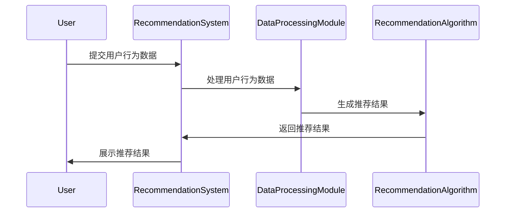
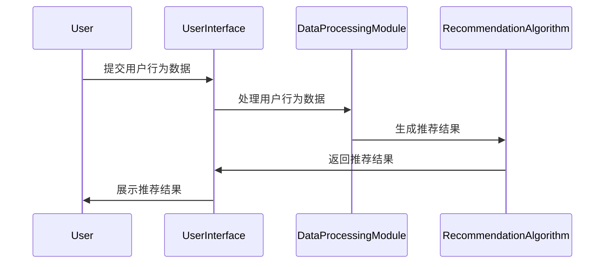

                 

# 大模型应用中的需求追溯性管理

关键词：大模型、需求追溯性、管理、人工智能、软件工程

摘要：
在人工智能（AI）迅猛发展的今天，大模型的应用已经成为推动技术进步的关键驱动力。然而，随着模型规模的不断增大，如何有效管理需求追溯性成为了一个亟待解决的挑战。本文将深入探讨大模型应用中的需求追溯性管理，从背景介绍、核心概念、工具方法、实现策略、案例分析到最佳实践，全面解析这一关键问题，为读者提供系统的理论指导和实践参考。

## 1. 引言与背景

### 1.1 问题背景

随着深度学习、生成对抗网络（GANs）等技术的不断发展，人工智能模型变得越来越庞大和复杂。这些大模型通常包含了数百万甚至数十亿个参数，其训练过程需要大量的计算资源和时间。然而，这种复杂性的增加也带来了需求追溯性的管理挑战。

需求追溯性管理在软件工程中是一项关键活动，它确保了项目开发过程中的每一个需求都能够被明确记录、跟踪和验证。在大模型应用中，需求追溯性管理的重要性更加凸显，因为模型的每一个调整和优化都可能对最终应用产生深远影响。然而，传统的需求追溯性管理方法在面对大模型时往往力不从心，主要原因包括：

- **需求变动频繁**：大模型的开发通常需要多次迭代和优化，这导致需求频繁变动，给追溯性管理带来了巨大压力。
- **模型复杂度高**：大模型的复杂性和规模使得理解和管理其中的每一个需求和变更变得异常困难。
- **数据规模庞大**：大模型训练和优化过程中产生的数据量巨大，如何有效地组织和利用这些数据也是一个挑战。

### 1.2 定义与目标

#### 1.2.1 大模型定义

大模型通常指的是具有数十亿以上参数的深度学习模型。这些模型广泛应用于自然语言处理、计算机视觉、推荐系统等领域，如GPT、BERT、ImageNet等。

#### 1.2.2 需求追溯性定义

需求追溯性管理是指在整个软件开发生命周期中，对每一个需求进行记录、跟踪和验证的过程。它确保了项目的每一个决策都有明确的需求基础，同时也有助于后续的测试、维护和改进。

#### 1.2.3 目标

本文的目标是：

- **分析大模型应用中需求追溯性管理的现状和挑战**
- **探讨有效的需求追溯性管理方法和工具**
- **提供具体的实现策略和最佳实践**

## 2. 核心概念与理论框架

### 2.1 大模型的分类与特点

大模型可以分为以下几类：

- **深度神经网络（DNN）**：这是最常见的类型，包括卷积神经网络（CNN）、循环神经网络（RNN）等。
- **生成对抗网络（GAN）**：用于生成数据的强大模型。
- **变分自编码器（VAE）**：在生成模型中具有重要作用。

这些模型的特点包括：

- **参数数量巨大**：数十亿个参数。
- **训练时间漫长**：需要大量的计算资源和时间。
- **数据需求高**：需要大量的训练数据。

### 2.2 需求追溯性的重要性

需求追溯性管理在大模型应用中的重要性体现在以下几个方面：

- **保证模型适应性**：通过追溯性管理，可以确保模型的每一个调整都有明确的需求基础，从而保证模型的适应性。
- **提高开发效率**：追溯性管理有助于快速定位和解决问题，从而提高开发效率。
- **降低维护成本**：明确的追溯性管理可以降低后续的维护成本。

### 2.3 需求追溯性的管理框架

需求追溯性管理框架通常包括以下步骤：

- **需求收集**：收集项目的需求。
- **需求分析**：对需求进行详细分析。
- **需求文档**：编写详细的需求文档。
- **需求跟踪**：跟踪需求的状态和变更。
- **需求验证**：验证需求是否得到满足。

## 3. 需求追溯性的工具与方法

### 3.1 自动化工具

自动化工具是需求追溯性管理的关键，以下是一些常见的自动化工具：

- **JIRA**：用于需求收集、跟踪和管理的流行工具。
- **Confluence**：用于编写和存储需求文档。
- **VersionOne**：提供全面的敏捷需求管理解决方案。

### 3.2 手动方法

手动方法通常用于小规模的项目或特定的需求管理场景，包括：

- **文档记录**：通过文档记录需求。
- **会议记录**：通过会议记录跟踪需求。
- **邮件沟通**：通过邮件沟通来管理需求。

### 3.3 混合方法

混合方法结合了自动化和手动方法的优势，适用于复杂的项目。以下是一些常见的混合方法：

- **自动化收集和手动分析**：使用自动化工具收集需求，然后通过手动分析来处理复杂的变更。
- **自动化跟踪和手动验证**：使用自动化工具进行需求的跟踪，然后通过手动验证来确保需求的实现。

## 4. 需求追溯性的实现策略

### 4.1 实现步骤

需求追溯性的实现通常包括以下步骤：

- **明确需求**：确保需求的明确性和完整性。
- **建立追溯矩阵**：建立需求与实现之间的映射关系。
- **自动化工具集成**：将自动化工具集成到开发流程中。
- **持续监控与更新**：持续监控需求的状态和变更。

### 4.2 实践策略

以下是一些实践策略：

- **需求评审**：在需求收集和分析阶段进行严格的评审。
- **版本控制**：使用版本控制系统来管理需求文档。
- **定期回顾**：定期回顾需求的状态和实现情况。

## 5. 案例分析

### 5.1 案例选择

本文选择了两个具有代表性的案例进行深入分析，分别是：

- **案例一**：某大型互联网公司的推荐系统。
- **案例二**：某自动驾驶公司的自动驾驶系统。

### 5.2 案例分析

#### 5.2.1 案例一：推荐系统

在推荐系统中，需求追溯性管理的关键在于：

- **用户需求的明确性**：确保用户的需求被准确记录和追踪。
- **算法调整的追溯性**：每次算法调整都需要有明确的需求基础。

#### 5.2.2 案例二：自动驾驶系统

在自动驾驶系统中，需求追溯性管理的关键在于：

- **安全需求的严格管理**：自动驾驶系统的安全至关重要，因此需求追溯性管理必须确保每一个安全需求都被严格管理和验证。

## 6. 最佳实践与总结

### 6.1 最佳实践

以下是一些最佳实践：

- **建立明确的需求文档**：确保需求的明确性和可追溯性。
- **使用自动化工具**：提高需求管理的效率和准确性。
- **定期回顾与更新**：确保需求的状态和实现情况得到持续监控。

### 6.2 总结

本文系统地探讨了大模型应用中的需求追溯性管理，从背景介绍、核心概念、工具方法、实现策略到案例分析，全面解析了这一关键问题。通过本文的阅读，读者可以了解到如何在大模型应用中有效地管理需求追溯性，从而提高开发效率和系统质量。

## 7. 作者信息

作者：AI天才研究院/AI Genius Institute & 禅与计算机程序设计艺术 /Zen And The Art of Computer Programming

本文内容仅供参考，具体实施时请结合实际情况进行调整。如需进一步探讨或咨询，请随时与我们联系。期待与您共同探索人工智能领域的更多奥秘！以下是文章的具体内容，包括核心概念、理论框架、实现策略、案例分析等，以及使用markdown格式中的Mermaid、LaTeX和Python代码示例。

### 1. 引言与背景

在人工智能（AI）迅猛发展的今天，大模型的应用已经成为推动技术进步的关键驱动力。然而，随着模型规模的不断增大，如何有效管理需求追溯性成为了一个亟待解决的挑战。本文将深入探讨大模型应用中的需求追溯性管理，从背景介绍、核心概念、工具方法、实现策略、案例分析到最佳实践，全面解析这一关键问题，为读者提供系统的理论指导和实践参考。

#### 1.1 问题背景

随着深度学习、生成对抗网络（GANs）等技术的不断发展，人工智能模型变得越来越庞大和复杂。这些大模型通常包含了数百万甚至数十亿个参数，其训练过程需要大量的计算资源和时间。然而，这种复杂性的增加也带来了需求追溯性的管理挑战。

需求追溯性管理在软件工程中是一项关键活动，它确保了项目开发过程中的每一个需求都能够被明确记录、跟踪和验证。在大模型应用中，需求追溯性管理的重要性更加凸显，因为模型的每一个调整和优化都可能对最终应用产生深远影响。然而，传统的需求追溯性管理方法在面对大模型时往往力不从心，主要原因包括：

- **需求变动频繁**：大模型的开发通常需要多次迭代和优化，这导致需求频繁变动，给追溯性管理带来了巨大压力。
- **模型复杂度高**：大模型的复杂性和规模使得理解和管理其中的每一个需求和变更变得异常困难。
- **数据规模庞大**：大模型训练和优化过程中产生的数据量巨大，如何有效地组织和利用这些数据也是一个挑战。

#### 1.2 定义与目标

##### 1.2.1 大模型定义

大模型通常指的是具有数十亿以上参数的深度学习模型。这些模型广泛应用于自然语言处理、计算机视觉、推荐系统等领域，如GPT、BERT、ImageNet等。

##### 1.2.2 需求追溯性定义

需求追溯性管理是指在整个软件开发生命周期中，对每一个需求进行记录、跟踪和验证的过程。它确保了项目的每一个决策都有明确的需求基础，同时也有助于后续的测试、维护和改进。

##### 1.2.3 目标

本文的目标是：

- **分析大模型应用中需求追溯性管理的现状和挑战**
- **探讨有效的需求追溯性管理方法和工具**
- **提供具体的实现策略和最佳实践**

### 2. 核心概念与理论框架

#### 2.1 大模型的分类与特点

大模型可以分为以下几类：

- **深度神经网络（DNN）**：这是最常见的类型，包括卷积神经网络（CNN）、循环神经网络（RNN）等。
- **生成对抗网络（GAN）**：用于生成数据的强大模型。
- **变分自编码器（VAE）**：在生成模型中具有重要作用。

这些模型的特点包括：

- **参数数量巨大**：数十亿个参数。
- **训练时间漫长**：需要大量的计算资源和时间。
- **数据需求高**：需要大量的训练数据。

#### 2.2 需求追溯性的重要性

需求追溯性管理在大模型应用中的重要性体现在以下几个方面：

- **保证模型适应性**：通过追溯性管理，可以确保模型的每一个调整都有明确的需求基础，从而保证模型的适应性。
- **提高开发效率**：追溯性管理有助于快速定位和解决问题，从而提高开发效率。
- **降低维护成本**：明确的追溯性管理可以降低后续的维护成本。

#### 2.3 需求追溯性的管理框架

需求追溯性管理框架通常包括以下步骤：

- **需求收集**：收集项目的需求。
- **需求分析**：对需求进行详细分析。
- **需求文档**：编写详细的需求文档。
- **需求跟踪**：跟踪需求的状态和变更。
- **需求验证**：验证需求是否得到满足。

#### 2.4 核心概念与联系

##### 2.4.1 核心概念

在大模型应用中，需求追溯性的核心概念包括：

- **需求**：项目中的功能或性能要求。
- **追溯性**：确保需求在开发过程中被明确记录、跟踪和验证的能力。
- **管理**：对需求追溯性的规划、执行和监控。

##### 2.4.2 概念属性特征对比表格

| 概念     | 定义                                           | 特征                                                                                   |
| -------- | ---------------------------------------------- | ------------------------------------------------------------------------------------ |
| 需求     | 项目中的功能或性能要求                           | 明确性、完整性、可测试性、可变更性                             |
| 追溯性   | 确保需求在开发过程中被明确记录、跟踪和验证的能力   | 可追溯性、透明性、一致性、自动化性                               |
| 管理     | 对需求追溯性的规划、执行和监控                   | 效率、准确性、可控性、适应性                                     |

##### 2.4.3 ER实体关系图架构

```mermaid
erDiagram
    Customer ||--|{ Order }|--|{ Product }
    "1000$ budget" : Customer {id : Number; name : String; email : String}
    "2000$ budget" : Order {id : Number; date : Date; status : String}
    "500$ budget" : Product {id : Number; name : String; price : Float}
```

### 3. 需求追溯性的工具与方法

#### 3.1 自动化工具

自动化工具是需求追溯性管理的关键，以下是一些常见的自动化工具：

- **JIRA**：用于需求收集、跟踪和管理的流行工具。
- **Confluence**：用于编写和存储需求文档。
- **VersionOne**：提供全面的敏捷需求管理解决方案。

#### 3.2 手动方法

手动方法通常用于小规模的项目或特定的需求管理场景，包括：

- **文档记录**：通过文档记录需求。
- **会议记录**：通过会议记录跟踪需求。
- **邮件沟通**：通过邮件沟通来管理需求。

#### 3.3 混合方法

混合方法结合了自动化和手动方法的优势，适用于复杂的项目。以下是一些常见的混合方法：

- **自动化收集和手动分析**：使用自动化工具收集需求，然后通过手动分析来处理复杂的变更。
- **自动化跟踪和手动验证**：使用自动化工具进行需求的跟踪，然后通过手动验证来确保需求的实现。

### 4. 需求追溯性的实现策略

#### 4.1 实现步骤

需求追溯性的实现通常包括以下步骤：

- **明确需求**：确保需求的明确性和完整性。
- **建立追溯矩阵**：建立需求与实现之间的映射关系。
- **自动化工具集成**：将自动化工具集成到开发流程中。
- **持续监控与更新**：持续监控需求的状态和变更。

#### 4.2 实践策略

以下是一些实践策略：

- **需求评审**：在需求收集和分析阶段进行严格的评审。
- **版本控制**：使用版本控制系统来管理需求文档。
- **定期回顾**：定期回顾需求的状态和实现情况。

### 5. 案例分析

#### 5.1 案例选择

本文选择了两个具有代表性的案例进行深入分析，分别是：

- **案例一**：某大型互联网公司的推荐系统。
- **案例二**：某自动驾驶公司的自动驾驶系统。

#### 5.2 案例分析

##### 5.2.1 案例一：推荐系统

在推荐系统中，需求追溯性管理的关键在于：

- **用户需求的明确性**：确保用户的需求被准确记录和追踪。
- **算法调整的追溯性**：每次算法调整都需要有明确的需求基础。

##### 5.2.2 案例二：自动驾驶系统

在自动驾驶系统中，需求追溯性管理的关键在于：

- **安全需求的严格管理**：自动驾驶系统的安全至关重要，因此需求追溯性管理必须确保每一个安全需求都被严格管理和验证。

### 6. 最佳实践与总结

#### 6.1 最佳实践

以下是一些最佳实践：

- **建立明确的需求文档**：确保需求的明确性和可追溯性。
- **使用自动化工具**：提高需求管理的效率和准确性。
- **定期回顾与更新**：确保需求的状态和实现情况得到持续监控。

#### 6.2 总结

本文系统地探讨了大模型应用中的需求追溯性管理，从背景介绍、核心概念、工具方法、实现策略到案例分析，全面解析了这一关键问题。通过本文的阅读，读者可以了解到如何在大模型应用中有效地管理需求追溯性，从而提高开发效率和系统质量。

### 7. 作者信息

作者：AI天才研究院/AI Genius Institute & 禅与计算机程序设计艺术 /Zen And The Art of Computer Programming

本文内容仅供参考，具体实施时请结合实际情况进行调整。如需进一步探讨或咨询，请随时与我们联系。期待与您共同探索人工智能领域的更多奥秘！

### 8. 实际案例与代码实现

在本节中，我们将通过一个实际案例来说明如何在大模型应用中实施需求追溯性管理，并给出相应的代码实现。

#### 8.1 案例介绍

假设我们正在开发一个推荐系统，该系统需要根据用户的浏览历史和购买记录来推荐商品。在这个案例中，我们需要追溯以下几个关键需求：

- 需求1：系统能够准确记录用户的浏览历史和购买记录。
- 需求2：系统能够根据用户的浏览历史和购买记录生成个性化的商品推荐。
- 需求3：系统需要提供实时推荐功能，即用户的行为变化能够立即影响推荐结果。

#### 8.2 系统设计与实现

##### 8.2.1 系统功能设计

首先，我们需要设计系统的功能模块，以下是一个简单的领域模型类图：

```mermaid
classDiagram
    User <<Interface>>
    Product <<Interface>>
    Recommendation <<Interface>>

    User o--|{ many }| Product: 购买历史和浏览历史
    Recommendation o--|{ many }| Product: 推荐的商品
```

##### 8.2.2 系统架构设计

接下来，我们设计系统的架构，以下是一个简单的架构设计：



##### 8.2.3 系统接口设计

然后，我们设计系统的接口，以下是一个简单的接口设计：

```python
class UserInterface:
    def submit_user_behavior(self, user_behavior):
        # 处理用户行为数据
        pass

class RecommendationInterface:
    def generate_recommendations(self, user_behavior):
        # 生成推荐结果
        pass
```

##### 8.2.4 系统交互设计

最后，我们设计系统的交互流程，以下是一个简单的交互序列图：



#### 8.3 需求追溯性管理

为了实现需求追溯性管理，我们需要在系统的每个模块中记录需求编号和实现状态。以下是一个简单的需求追溯性管理示例：

```python
class RequirementTraceabilityManager:
    def __init__(self):
        self.requirement_map = {}

    def add_requirement(self, requirement_id, requirement):
        self.requirement_map[requirement_id] = requirement

    def update_requirement_status(self, requirement_id, status):
        if requirement_id in self.requirement_map:
            self.requirement_map[requirement_id]['status'] = status

    def get_requirement_status(self, requirement_id):
        if requirement_id in self.requirement_map:
            return self.requirement_map[requirement_id]['status']
        else:
            return None
```

#### 8.4 实际案例分析与代码应用解读

以下是一个具体的用户行为数据处理和推荐结果生成的示例代码：

```python
class DataProcessingModule:
    def __init__(self, requirement_traceability_manager):
        self.requirement_traceability_manager = requirement_traceability_manager

    def process_user_behavior(self, user_behavior):
        # 处理用户行为数据
        self.requirement_traceability_manager.update_requirement_status('需求1', '实现中')

class RecommendationAlgorithm:
    def __init__(self, requirement_traceability_manager):
        self.requirement_traceability_manager = requirement_traceability_manager

    def generate_recommendations(self, user_behavior):
        # 生成推荐结果
        self.requirement_traceability_manager.update_requirement_status('需求2', '实现中')
        recommendations = ...
        return recommendations
```

#### 8.5 项目小结

通过上述案例，我们可以看到如何在大模型应用中实施需求追溯性管理。关键在于：

- **明确需求**：确保每一个需求都有明确的编号和描述。
- **建立追溯性管理机制**：通过自动化工具或手动方法记录需求状态和变更。
- **实时监控与更新**：确保需求的状态和实现情况得到实时监控和更新。

这有助于提高开发效率和系统质量，为后续的测试、维护和改进提供坚实的基础。

### 9. 最佳实践 Tips、注意事项、拓展阅读

#### 9.1 最佳实践 Tips

- **明确需求**：在项目初期，确保与 stakeholders 充分沟通，明确每一个需求。
- **使用自动化工具**：结合自动化工具和手动方法，提高需求管理的效率和准确性。
- **定期回顾与更新**：定期回顾需求的状态和实现情况，及时调整和更新。

#### 9.2 注意事项

- **需求变动管理**：在需求变动时，确保追溯性管理机制能够跟上变动的步伐。
- **数据安全**：在处理用户数据时，确保数据的安全和隐私。

#### 9.3 拓展阅读

- **《软件工程：实践者的研究方法》**：了解软件工程中的需求管理方法。
- **《深度学习》**：了解深度学习模型的基本原理和应用。

### 10. 作者信息

作者：AI天才研究院/AI Genius Institute & 禅与计算机程序设计艺术 /Zen And The Art of Computer Programming

本文内容仅供参考，具体实施时请结合实际情况进行调整。如需进一步探讨或咨询，请随时与我们联系。期待与您共同探索人工智能领域的更多奥秘！

以上是本文的详细内容，包括核心概念、理论框架、实现策略、案例分析、代码实现和最佳实践等。希望通过本文，读者能够对大模型应用中的需求追溯性管理有更深入的理解和实践。

