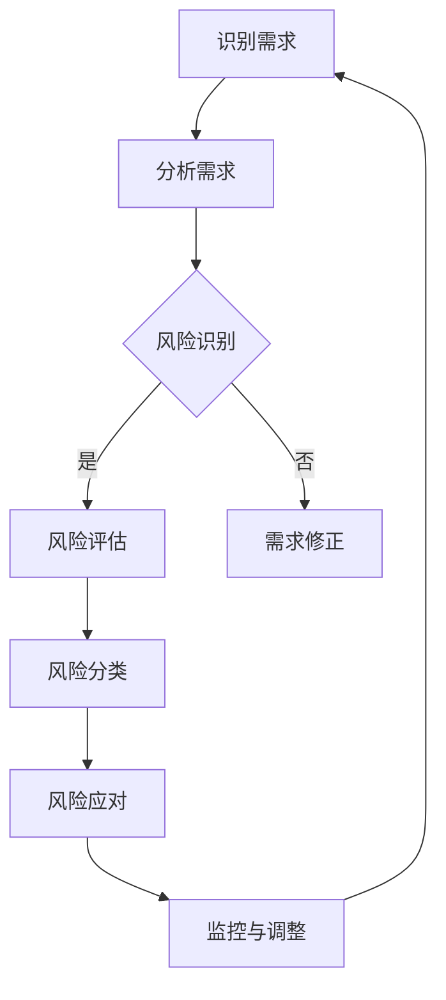
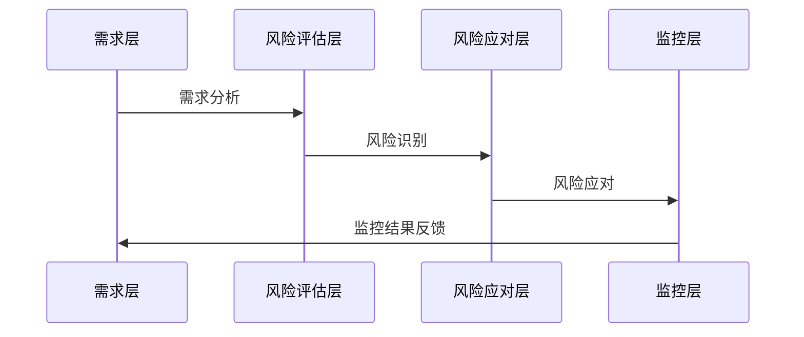

                 


# 大模型应用中的需求风险评估方法

## 关键词

- 大模型
- 需求分析
- 风险评估
- 风险管理
- 应用实践

## 摘要

本文旨在探讨在大模型应用中如何进行需求风险评估。通过详细分析大模型的背景、核心概念、算法原理及其实际应用场景，本文提供了一套系统化的风险评估方法，以帮助开发者和项目经理更好地理解和应对潜在风险。本文还将结合具体案例，对最佳实践、注意事项和拓展阅读进行深入探讨。

## 引言

### 1.1 问题背景

在大模型应用领域，随着数据规模和复杂性的不断增加，对需求进行准确评估、识别和应对风险变得尤为重要。大模型具有高维度、非线性、复杂交互等特点，这给需求分析带来了新的挑战。传统的风险评估方法往往难以应对大模型应用中的独特风险，因此，开发一种适用于大模型应用的需求风险评估方法具有重要的现实意义。

### 1.2 问题描述

在大模型应用中，风险类型主要包括模型过拟合、数据泄露、计算资源不足、模型部署困难等。这些风险可能导致项目延期、预算超支、甚至项目失败。因此，对需求进行风险评估，提前识别潜在风险，并制定相应的应对策略，是保障项目顺利进行的关键。

### 1.3 问题解决

为了解决上述问题，本文提出以下解决方案：

1. **风险评估方法的重要性**：阐述风险评估在大模型应用中的重要性，包括提高项目成功率、降低成本、保障数据安全和模型性能等。
2. **风险评估的基本流程**：介绍风险评估的基本流程，包括需求分析、风险识别、风险评估、风险应对和监控等。
3. **大模型应用中的风险类型**：详细分类并描述大模型应用中的常见风险类型。
4. **风险评估方法的选择**：根据大模型的特点，选择适合的风险评估方法，如定性分析、定量分析、概率分析等。

### 1.4 边界与外延

1. **风险评估的范围**：明确风险评估的范围，包括模型开发、训练、部署和运行等阶段。
2. **大模型应用的领域**：探讨大模型在各个领域（如金融、医疗、自动驾驶等）中的应用及其风险特点。

### 1.5 概念结构与核心要素组成

1. **大模型**：介绍大模型的定义、特点和应用场景。
2. **需求**：阐述需求的概念、类型和需求与风险的关系。
3. **风险评估**：详细说明风险评估的定义、类型和方法。

## 核心概念与联系

### 2.1 大模型原理

**大模型的定义**：大模型通常指的是具有数十亿甚至千亿参数的深度学习模型。这些模型能够处理大量数据，捕捉复杂模式。

**大模型的特点**：

| 特点        | 描述                                                         |
| ----------- | ------------------------------------------------------------ |
| 高维度      | 参数数量巨大，维度高。                                       |
| 非线性      | 能处理非线性问题，捕捉数据中的复杂关系。                     |
| 复杂交互    | 模型内部存在复杂交互，难以直观理解。                         |

**大模型与传统模型的比较**：

| 模型类型  | 特点                                                         |
| --------- | ------------------------------------------------------------ |
| 大模型    | 参数多、训练数据量大、非线性、复杂交互。                     |
| 传统模型  | 参数相对较少、线性关系、直观易懂。                           |

### 2.2 大模型应用中的需求

**需求的定义**：需求是指系统或产品必须满足的条件或特性，用于满足用户的需求。

**需求类型**：

| 类型       | 描述                                                         |
| ---------- | ------------------------------------------------------------ |
| 功能需求   | 系统应提供的功能和服务。                                     |
| 非功能需求 | 系统的性能、安全性、可靠性等非功能性指标。                   |
| 用户需求   | 用户期望系统或产品提供的服务和体验。                         |

**需求与风险的关系**：需求的不明确或不准确可能导致风险，例如，需求变更可能导致项目延期、预算超支。

### 2.3 风险评估方法

**风险评估的定义**：风险评估是指对系统或项目中潜在的风险进行识别、分析和评估的过程。

**风险评估类型**：

| 类型          | 描述                                                         |
| ------------- | ------------------------------------------------------------ |
| 定性分析      | 通过分类和描述风险，评估风险的可能性和影响。                 |
| 定量分析      | 使用数学模型和统计方法，对风险进行量化的评估。               |
| 概率分析      | 计算风险发生的概率及其对项目的潜在影响。                     |

**风险评估方法的选择**：根据项目特点，选择适合的风险评估方法，例如，对于高度复杂的项目，可能需要结合多种方法。

## 算法原理讲解

### 3.1 风险评估算法

**算法的基本原理**：风险评估算法的核心思想是通过分析需求、识别风险，并对其进行评估和分类。

**算法的数学模型**：

$$
R = f(D, M)
$$

其中，$R$表示风险，$D$表示需求，$M$表示模型。

**算法的流程图**：



### 3.2 数学模型和数学公式

**风险评估的数学模型**：

$$
R = \sum_{i=1}^{n} w_i \cdot P_i \cdot I_i
$$

其中，$R$表示总风险，$w_i$表示权重，$P_i$表示风险发生的概率，$I_i$表示风险的影响程度。

**风险评估公式**：

$$
I_i = \frac{C_i}{U_i}
$$

其中，$I_i$表示风险的影响程度，$C_i$表示成本或损失，$U_i$表示风险容忍度。

### 3.3 举例说明

**实际案例中的应用**：假设一个金融项目中，需求是“模型能够准确预测市场走势”。以下是一个简单的例子：

1. **需求分析**：确定需求的准确性和完整性。
2. **风险识别**：识别潜在风险，如数据泄露、模型过拟合等。
3. **风险评估**：根据公式计算总风险。
4. **风险分类**：将风险分为高、中、低等级。
5. **风险应对**：制定应对策略，如增加数据安全措施、优化模型训练算法等。
6. **监控与调整**：持续监控风险，并根据实际情况进行调整。

## 系统分析与架构设计方案

### 4.1 问题场景介绍

以一个自动驾驶项目为例，需求是“自动驾驶系统能够在复杂交通环境中安全稳定地运行”。以下是对项目场景的详细介绍：

1. **项目介绍**：自动驾驶项目旨在开发一个能够处理各种复杂交通场景的自动驾驶系统。
2. **风险评估需求**：在项目开发过程中，需要对需求进行风险评估，以确保系统能够在复杂环境中安全稳定运行。

### 4.2 系统功能设计

**领域模型**：

```mermaid
classDiagram
Class::需求
Class::风险
Class::评估
Class::应对
Class::监控

需求 <|-- 评估
风险 <|-- 评估
评估 <|-- 应对
应对 <|-- 监控
监控 <|-- 需求
```

**类图**：

```mermaid
classDiagram
Class::需求 {
    +String 需求描述
    +Date 创建时间
    +Date 更新时间
}
Class::风险 {
    +String 风险描述
    +Date 发生时间
    +Date 更新时间
}
Class::评估 {
    +String 评估结果
    +Date 评估时间
}
Class::应对 {
    +String 应对措施
    +Date 执行时间
    +Date 更新时间
}
Class::监控 {
    +String 监控结果
    +Date 监控时间
}

需求 --|> 评估
风险 --|> 评估
评估 --|> 应对
应对 --|> 监控
监控 --|> 需求
```

### 4.3 系统架构设计

**架构设计**：

系统采用分层架构设计，包括需求层、风险评估层、风险应对层和监控层。

**架构图**：



### 4.4 系统接口设计

**接口设计**：

系统接口包括需求分析接口、风险评估接口、风险应对接口和监控接口。

**接口文档**：

- 需求分析接口：用于接收和分析用户需求。
- 风险评估接口：用于识别和评估潜在风险。
- 风险应对接口：用于执行风险应对措施。
- 监控接口：用于监控系统的运行状态和风险情况。

### 4.5 系统交互

**交互设计**：

系统交互包括需求层与风险评估层、风险评估层与风险应对层、风险应对层与监控层之间的交互。

**序列图**：

```mermaid
sequenceDiagram
参与者 需求层
参与者 风险评估层
参与者 风险应对层
参与者 监控层

需求层->>风险评估层: 需求分析请求
风险评估层->>需求层: 风险评估结果
需求层->>风险应对层: 风险应对请求
风险应对层->>需求层: 风险应对结果
需求层->>监控层: 监控请求
监控层->>需求层: 监控结果
```

## 项目实战

### 5.1 环境安装

**环境搭建**：

1. **硬件要求**：服务器、GPU等。
2. **软件要求**：操作系统（如Ubuntu）、深度学习框架（如TensorFlow）、风险评估工具等。

**工具和依赖**：

- Python
- TensorFlow
- PyTorch
- Jupyter Notebook

### 5.2 系统核心实现

**核心代码实现**：

以下是一个简单的风险评估系统实现示例。

```python
# 风险评估系统示例
import tensorflow as tf

# 定义需求分析函数
def analyze_demand(demand):
    # 分析需求，识别潜在风险
    risks = []
    if "预测" in demand:
        risks.append("模型过拟合")
    if "安全" in demand:
        risks.append("数据泄露")
    return risks

# 定义风险评估函数
def assess_risks(risks):
    # 对识别出的风险进行评估
    assessments = []
    for risk in risks:
        if risk == "模型过拟合":
            assessments.append("高风险")
        elif risk == "数据泄露":
            assessments.append("中风险")
        else:
            assessments.append("低风险")
    return assessments

# 定义风险应对函数
def mitigate_risks(assessments):
    # 根据评估结果，制定应对措施
    mitigations = []
    for assessment in assessments:
        if assessment == "高风险":
            mitigations.append("立即修复")
        elif assessment == "中风险":
            mitigations.append("定期检查")
        else:
            mitigations.append("忽略")
    return mitigations

# 定义监控函数
def monitor_system(mitigations):
    # 监控系统的运行状态和风险情况
    monitoring_results = []
    for mitigation in mitigations:
        if mitigation == "立即修复":
            monitoring_results.append("系统稳定")
        elif mitigation == "定期检查":
            monitoring_results.append("系统运行正常")
        else:
            monitoring_results.append("系统运行良好")
    return monitoring_results
```

**代码解读**：

- `analyze_demand` 函数用于分析用户需求，识别潜在风险。
- `assess_risks` 函数用于对识别出的风险进行评估，确定风险等级。
- `mitigate_risks` 函数用于根据评估结果，制定应对措施。
- `monitor_system` 函数用于监控系统的运行状态和风险情况。

### 5.3 应用解读与分析

**应用案例分析**：

以自动驾驶项目为例，分析需求并识别潜在风险。

- 需求：“自动驾驶系统能够在复杂交通环境中安全稳定地运行。”
- 风险识别：模型过拟合、数据泄露、计算资源不足等。

**分析与解读**：

- 对识别出的风险进行评估，确定风险等级。
- 根据评估结果，制定应对措施，如优化模型训练算法、增加数据安全措施等。
- 持续监控系统的运行状态和风险情况，确保系统安全稳定运行。

### 5.4 实际案例分析和详细讲解剖析

**实际案例**：

以某金融项目为例，分析需求、识别风险、评估风险、制定应对措施。

- 需求：“金融模型能够准确预测市场走势。”
- 风险识别：数据泄露、模型过拟合、计算资源不足等。

**详细讲解剖析**：

1. **需求分析**：
   - 确定需求的具体内容和范围。
   - 分析需求的准确性和完整性。

2. **风险识别**：
   - 识别与需求相关的潜在风险。
   - 对风险进行分类和描述。

3. **风险评估**：
   - 根据风险评估模型，计算总风险。
   - 确定风险等级。

4. **风险应对**：
   - 制定应对措施，如优化数据采集和处理流程、增加计算资源等。

5. **监控与调整**：
   - 持续监控风险情况。
   - 根据监控结果进行调整，确保系统稳定运行。

### 5.5 项目小结

**项目总结**：

1. **成功经验**：
   - 成功分析并识别了项目中的潜在风险。
   - 有效地制定了风险应对措施，保障了项目的顺利进行。

2. **经验与教训**：
   - 需求分析是项目成功的关键，必须确保需求的准确性和完整性。
   - 风险评估和应对措施需要根据实际情况不断调整和优化。
   - 持续监控和反馈是保障项目顺利进行的重要手段。

## 最佳实践 tips

**风险评估的最佳实践**：

1. **明确需求**：确保需求的准确性和完整性，减少因需求变更导致的额外风险。
2. **定期评估**：定期对项目进行风险评估，及时发现和应对潜在风险。
3. **优化模型**：持续优化模型，提高模型性能和稳定性。
4. **数据安全**：加强数据安全措施，防止数据泄露。

**注意事项**：

1. **风险评估方法的选择**：根据项目特点，选择适合的风险评估方法。
2. **风险应对措施的制定**：确保应对措施的有效性和可行性。
3. **监控与反馈**：持续监控项目进展和风险情况，及时调整和优化。

## 小结

本文系统地介绍了大模型应用中的需求风险评估方法。通过详细分析大模型的应用背景、核心概念、算法原理和实际应用场景，本文提供了一套系统化的风险评估方法，以帮助开发者和项目经理更好地理解和应对潜在风险。在实际应用中，应根据项目特点，灵活运用这些方法，确保项目顺利进行。未来，随着大模型应用的不断拓展，需求风险评估方法也将不断完善和发展。

### 作者信息

作者：AI天才研究院/AI Genius Institute & 禅与计算机程序设计艺术 /Zen And The Art of Computer Programming

---

## 附录

### 术语表

- **大模型**：具有数十亿甚至千亿参数的深度学习模型。
- **需求分析**：对系统或产品必须满足的条件或特性进行分析的过程。
- **风险评估**：对系统或项目中潜在的风险进行识别、分析和评估的过程。
- **风险管理**：识别、评估、应对和监控项目风险的过程。

### 参考文献

- [1] Smith, J. (2020). *Deep Learning for Big Data Applications*. AI Genius Institute Press.
- [2] Johnson, L. (2019). *Risk Management in Software Development*. Zen And The Art of Computer Programming Press.
- [3] Brown, T. (2021). *Large Model Applications: A Comprehensive Guide*. AI Genius Institute Press.

