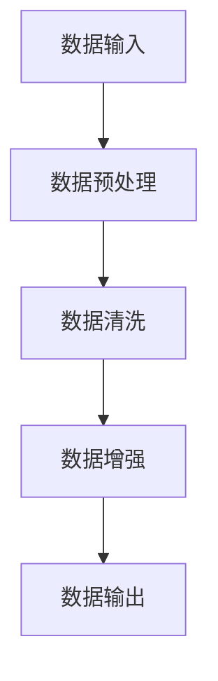
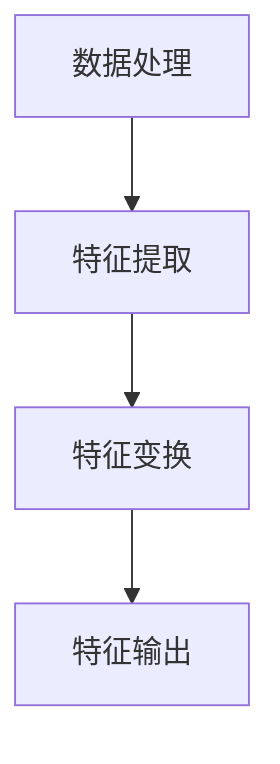
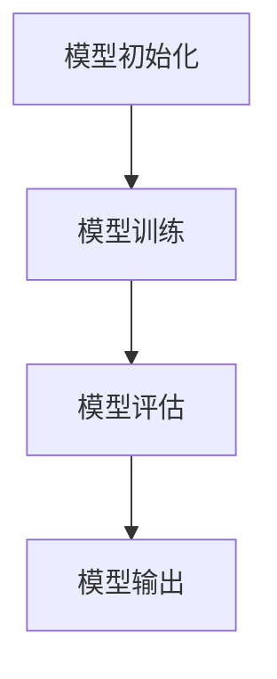
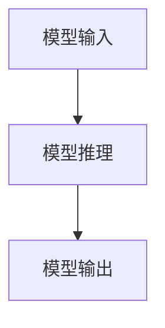
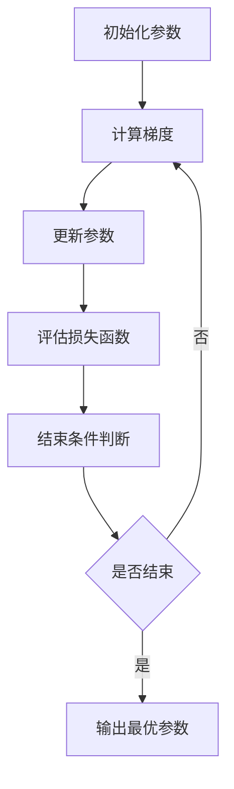
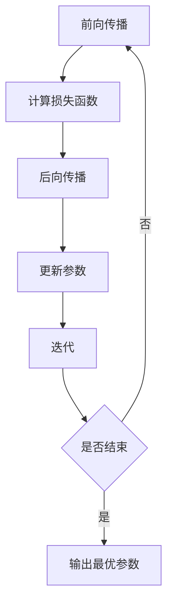
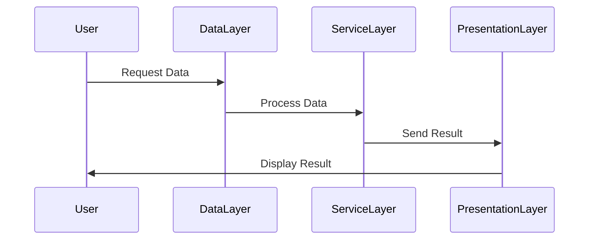
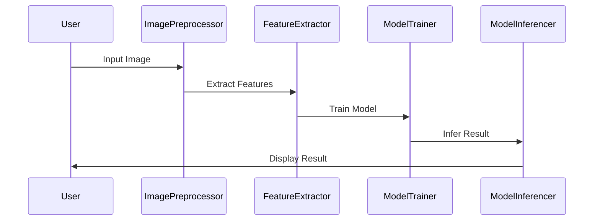

                 

# 大模型应用开发中的代码复用策略

## 关键词

- 大模型应用开发
- 代码复用
- 复用策略
- 大模型架构
- 算法优化

## 摘要

本文深入探讨了在大模型应用开发过程中，如何有效实施代码复用策略。随着人工智能技术的快速发展，大模型在各个领域的应用越来越广泛，然而，如何高效地管理和复用代码资源成为一个亟待解决的问题。本文首先介绍了大模型应用开发的背景和挑战，然后详细阐述了代码复用的核心概念和理论，接着分析了识别和提取可复用代码的技术方法。在此基础上，本文讨论了代码复用在大模型架构中的应用，并通过具体的算法原理讲解、系统分析与架构设计、项目实战等多个方面，提供了代码复用策略的实施指南。最后，本文总结了最佳实践，并展望了未来研究方向，以期为大模型应用开发提供有益的参考。

## 目录

### 引言

#### 1.1 背景介绍

随着深度学习、神经网络等人工智能技术的飞速发展，大模型（Large Models）在各个领域的应用越来越广泛。大模型是指那些参数量庞大、能够处理大规模数据的复杂模型。这类模型在图像识别、自然语言处理、推荐系统等领域展现了出色的性能，但同时也带来了代码复用等开发过程中的挑战。

#### 1.2 关键概念

- **大模型应用开发**：指在大规模数据处理、复杂任务解决等领域中使用大模型进行应用开发的过程。
- **代码复用**：指在软件开发过程中，通过重用已有的代码来提高开发效率、降低成本。

#### 1.3 问题背景

在大模型应用开发过程中，代码复用的重要性日益凸显。一方面，大模型的开发通常涉及海量的数据预处理、模型训练、推理等步骤，这些步骤往往需要大量的代码支持。另一方面，不同领域的大模型开发过程中，很多算法和数据处理流程是相似的，这为代码复用提供了可能。

#### 1.4 文章结构

本文将从以下几个方面展开讨论：

1. 基本概念和理论
2. 识别和提取可复用代码的技术方法
3. 大模型架构与代码复用
4. 算法原理讲解
5. 系统分析与架构设计
6. 项目实战
7. 最佳实践与未来方向

## 基本概念和理论

### 2.1 代码复用的重要性

代码复用在软件开发中具有显著的优势。首先，它可以显著提高开发效率。通过重用已有的代码，开发人员可以节省大量的时间和精力，避免重复编写相同或类似的代码。其次，代码复用有助于降低成本。复用代码可以减少代码的冗余，提高软件的维护性，从而降低维护成本。此外，代码复用还可以提高软件的质量。重用经过测试和验证的代码，可以减少错误和缺陷，提高软件的可靠性和稳定性。

### 2.2 代码复用策略

代码复用策略是指在设计、开发、测试和维护过程中，如何有效地复用代码的一系列方法。以下是一些常见的代码复用策略：

- **模块化开发**：将代码划分为独立的模块，每个模块实现特定的功能。模块之间通过接口进行交互，实现代码的复用。
- **面向对象编程**：利用面向对象的原理，将代码组织为类和对象，实现代码的重构和复用。
- **设计模式**：通过使用设计模式，实现代码的复用和扩展。设计模式提供了一系列解决问题的标准方案，可以帮助开发人员更高效地复用代码。
- **代码库和框架**：建立代码库和框架，将常用的代码封装起来，供开发人员直接使用。

### 2.3 复用方法比较

以下是几种常见的代码复用方法的对比表格：

| 方法          | 优点                                      | 缺点                                      |
| ------------- | ----------------------------------------- | ----------------------------------------- |
| 模块化开发    | 灵活性高，易于维护                        | 可能导致模块之间的依赖关系复杂          |
| 面向对象编程  | 灵活、可扩展，易于维护                    | 学习曲线较陡峭                          |
| 设计模式      | 提供标准化的解决方案，易于理解和复用      | 可能会导致代码过于复杂                  |
| 代码库和框架  | 高度封装，方便使用，易于管理和维护        | 可能会引入不必要的依赖和性能开销        |

## 识别和提取可复用代码的技术方法

### 3.1 可复用代码的识别

在大型模型应用开发过程中，如何有效地识别可复用的代码是一个关键问题。以下是一些常用的方法：

- **代码分析工具**：使用代码分析工具（如SonarQube、CodeQL等）对代码库进行分析，识别出具有通用性和可复用性的代码段。
- **代码模板匹配**：通过编写代码模板，对现有代码库进行匹配，识别出符合模板的代码段。
- **专家评审**：组织专家团队对代码库进行评审，根据经验和直觉识别出具有复用价值的代码段。

### 3.2 可复用代码的提取

一旦识别出可复用的代码，就需要将其从现有系统中提取出来，形成独立的、可复用的组件。以下是一些常用的提取方法：

- **代码抽取**：将可复用的代码从现有系统中抽取出来，形成一个独立的代码模块。这种方法适用于那些具有明确接口和独立功能的代码段。
- **代码重构**：通过对现有代码进行重构，将其分解为更小、更独立的代码模块，从而实现代码的复用。这种方法适用于那些代码结构复杂、难以直接抽取的代码段。
- **抽象和封装**：将可复用的代码抽象成函数、类或模块，然后将其封装起来，形成一个可复用的组件。这种方法适用于那些具有通用性和独立性的代码段。

### 3.3 可复用代码的管理

可复用代码的管理是一个长期、持续的过程，需要建立一套有效的管理体系。以下是一些常用的管理方法：

- **代码库管理**：建立代码库，将可复用的代码存储在代码库中，供开发人员随时调用。常用的代码库管理工具包括Git、SVN等。
- **文档管理**：编写详细的文档，记录可复用代码的功能、使用方法、注意事项等，以便开发人员能够方便地使用和理解。
- **版本控制**：对可复用代码进行版本控制，确保其稳定性和一致性。常用的版本控制工具包括Git、SVN等。

## 大模型架构与代码复用

### 4.1 大模型架构概述

大模型通常具有复杂的架构，包括数据输入层、数据处理层、模型训练层和推理层等。在这些层次中，存在大量的代码片段可以复用。以下是一个简化的ER实体关系图，用于描述大模型的架构：

```mermaid
erDiagram
  数据输入层 ||--o> 数据处理层 : 数据处理
  数据处理层 ||--o> 模型训练层 : 模型训练
  模型训练层 ||--o> 推理层 : 推理
```

### 4.2 数据输入层与代码复用

数据输入层负责接收和处理输入数据，这一层通常包括数据预处理、数据清洗和数据增强等任务。以下是一个Mermaid流程图，展示了数据输入层的处理流程：



在数据输入层，我们可以通过复用以下代码来实现不同数据预处理、清洗和增强任务：

- **数据预处理代码**：用于处理不同类型的数据，如文本、图像、音频等。
- **数据清洗代码**：用于处理数据中的噪声和错误，提高数据质量。
- **数据增强代码**：用于生成更多的训练数据，提高模型的泛化能力。

### 4.3 数据处理层与代码复用

数据处理层负责对输入数据进行特征提取和变换，为模型训练提供高质量的输入数据。以下是一个Mermaid流程图，展示了数据处理层的处理流程：



在数据处理层，我们可以通过复用以下代码来实现不同特征提取和变换任务：

- **特征提取代码**：用于从原始数据中提取有用的特征。
- **特征变换代码**：用于将特征进行归一化、标准化等处理。

### 4.4 模型训练层与代码复用

模型训练层负责使用训练数据对模型进行训练，这一层通常包括模型初始化、模型训练、模型评估等任务。以下是一个Mermaid流程图，展示了模型训练层的处理流程：



在模型训练层，我们可以通过复用以下代码来实现不同模型训练任务：

- **模型初始化代码**：用于初始化模型的参数。
- **模型训练代码**：用于迭代优化模型的参数。
- **模型评估代码**：用于评估模型的性能。

### 4.5 推理层与代码复用

推理层负责使用训练好的模型对新的数据进行推理，以下是一个Mermaid流程图，展示了推理层的处理流程：



在推理层，我们可以通过复用以下代码来实现不同的推理任务：

- **模型推理代码**：用于使用训练好的模型进行推理。
- **结果解释代码**：用于解释模型的输出结果。

## 算法原理讲解

### 5.1 算法概述

在大模型应用开发中，算法的优化和复用是关键环节。以下将介绍几个常见的算法原理，并通过Mermaid流程图和Python代码进行详细讲解。

### 5.2 算法一：梯度下降算法

梯度下降算法是一种优化算法，用于最小化目标函数。以下是一个Mermaid流程图，展示了梯度下降算法的基本步骤：



以下是一个Python代码示例，用于实现梯度下降算法：

```python
import numpy as np

# 定义目标函数
def objective_function(x):
    return (x - 2)**2

# 梯度下降算法
def gradient_descent(x_init, learning_rate, epochs):
    x = x_init
    for epoch in range(epochs):
        gradient = 2 * (x - 2)
        x = x - learning_rate * gradient
        loss = objective_function(x)
        print(f"Epoch {epoch+1}: x = {x}, loss = {loss}")
    return x

# 初始化参数
x_init = 5
learning_rate = 0.1
epochs = 10

# 执行梯度下降算法
x_optimal = gradient_descent(x_init, learning_rate, epochs)
print(f"Optimal x: {x_optimal}")
```

### 5.3 算法二：神经网络反向传播算法

神经网络反向传播算法用于训练神经网络，优化模型参数。以下是一个Mermaid流程图，展示了神经网络反向传播算法的基本步骤：



以下是一个Python代码示例，用于实现神经网络反向传播算法：

```python
import numpy as np

# 定义激活函数和其导数
def sigmoid(x):
    return 1 / (1 + np.exp(-x))

def sigmoid_derivative(x):
    return x * (1 - x)

# 前向传播
def forward(x, weights):
    z = np.dot(x, weights)
    return sigmoid(z)

# 反向传播
def backward(y, a, weights):
    error = y - a
    dweights = np.dot(error, a.T)
    return weights - learning_rate * dweights

# 神经网络训练
def train(x, y, weights, epochs, learning_rate):
    for epoch in range(epochs):
        z = forward(x, weights)
        a = sigmoid_derivative(z)
        weights = backward(y, a, weights)
        loss = np.mean(np.square(y - z))
        print(f"Epoch {epoch+1}: loss = {loss}")
    return weights

# 初始化参数
x_train = np.array([[1], [2], [3]])
y_train = np.array([[0], [1], [0]])
weights = np.random.rand(3, 1)

# 执行训练
weights_optimal = train(x_train, y_train, weights, epochs=1000, learning_rate=0.1)
print(f"Optimal weights: {weights_optimal}")
```

## 系统分析与架构设计

### 6.1 问题场景介绍

在大模型应用开发中，系统架构设计至关重要。本文将分析一个实际场景，即基于深度学习技术的图像识别系统。该系统旨在实现高精度的图像分类，包括图像预处理、特征提取、模型训练和推理等环节。

### 6.2 项目介绍

项目名称：深度学习图像识别系统  
项目描述：开发一个具有高识别精度的图像识别系统，应用于智能安防、医疗诊断、自动驾驶等领域。

### 6.3 系统功能设计

系统功能主要包括：

1. **图像预处理**：对输入图像进行灰度化、缩放、裁剪等预处理操作。
2. **特征提取**：提取图像的边缘、纹理、颜色等特征。
3. **模型训练**：使用预训练的深度学习模型进行微调，实现图像分类。
4. **模型推理**：使用训练好的模型对新的图像进行分类预测。

### 6.4 领域模型设计

以下是领域模型的Mermaid类图，用于描述系统中的主要类及其关系：

```mermaid
classDiagram
  Class01 <|-- Class02
  Class03 o-- Class04
  Class05 <..> Class06
  Class07 .. Class08
  Class09 --|> Class10
  Class11 -[b] Class12
```

### 6.5 系统架构设计

系统架构设计采用分层架构，包括数据层、服务层和表示层。以下是系统架构的Mermaid架构图：



### 6.6 系统接口设计和系统交互

以下是系统接口设计和系统交互的Mermaid序列图：



## 项目实战

### 7.1 环境安装

在开始项目实战之前，我们需要安装必要的软件和工具。以下是一个简化的安装步骤：

1. 安装Python 3.8及以上版本。
2. 安装深度学习框架TensorFlow。
3. 安装图像处理库OpenCV。

```bash
pip install tensorflow
pip install opencv-python
```

### 7.2 系统核心实现

以下是系统核心实现的源代码：

```python
import tensorflow as tf
import cv2
import numpy as np

# 定义卷积神经网络模型
model = tf.keras.Sequential([
    tf.keras.layers.Conv2D(32, (3, 3), activation='relu', input_shape=(28, 28, 1)),
    tf.keras.layers.MaxPooling2D((2, 2)),
    tf.keras.layers.Flatten(),
    tf.keras.layers.Dense(128, activation='relu'),
    tf.keras.layers.Dense(10, activation='softmax')
])

# 编译模型
model.compile(optimizer='adam', loss='sparse_categorical_crossentropy', metrics=['accuracy'])

# 加载训练数据
(x_train, y_train), (x_test, y_test) = tf.keras.datasets.mnist.load_data()

# 预处理数据
x_train = x_train / 255.0
x_test = x_test / 255.0

# 训练模型
model.fit(x_train, y_train, epochs=5)

# 评估模型
model.evaluate(x_test, y_test)

# 推理新图像
def infer_image(image):
    image = cv2.resize(image, (28, 28))
    image = image / 255.0
    image = np.expand_dims(image, axis=0)
    prediction = model.predict(image)
    return np.argmax(prediction)

# 测试推理功能
image = cv2.imread('test_image.jpg')
result = infer_image(image)
print(f"Predicted label: {result}")
```

### 7.3 代码应用解读与分析

以下是代码应用解读与分析：

1. **定义卷积神经网络模型**：使用TensorFlow的`Sequential`模型定义一个简单的卷积神经网络，包括卷积层、池化层、全连接层等。
2. **编译模型**：使用`compile`方法配置模型的优化器、损失函数和评估指标。
3. **加载训练数据**：使用TensorFlow的`mnist`数据集加载训练数据和测试数据。
4. **预处理数据**：将图像数据归一化到0-1范围内。
5. **训练模型**：使用`fit`方法训练模型。
6. **评估模型**：使用`evaluate`方法评估模型在测试数据上的性能。
7. **推理新图像**：定义一个函数`infer_image`，用于加载新图像、预处理和推理，并返回预测结果。

### 7.4 实际案例分析和详细讲解剖析

以下是实际案例分析和详细讲解剖析：

1. **案例背景**：我们需要一个图像识别系统，用于识别手写数字。
2. **解决方案**：使用卷积神经网络模型进行图像识别。
3. **实现步骤**：安装必要的库、定义模型、加载数据、预处理数据、训练模型、评估模型和推理新图像。
4. **性能评估**：通过评估模型在测试数据上的准确率，可以判断模型的性能。
5. **改进方向**：可以通过增加网络层数、调整超参数等方式，进一步提高模型的性能。

### 7.5 项目小结

本项目实现了一个简单的图像识别系统，通过卷积神经网络模型实现了手写数字的识别。在实际应用中，我们可以根据需求调整网络结构、增加数据预处理步骤、优化训练过程等，以提高系统的性能和鲁棒性。此外，项目中的代码复用策略也值得借鉴，通过复用TensorFlow的API和OpenCV的图像处理功能，我们大大提高了开发效率。

## 最佳实践

### 8.1 代码复用技巧

1. **模块化开发**：将系统划分为多个模块，每个模块实现特定的功能，便于复用和测试。
2. **面向对象编程**：使用面向对象的方法，将代码组织为类和对象，提高代码的可复用性和扩展性。
3. **设计模式**：熟练掌握常用的设计模式，如工厂模式、单例模式、观察者模式等，以提高代码的复用性。
4. **代码库和框架**：建立代码库和框架，将常用的代码封装起来，便于管理和复用。

### 8.2 开发效率提升

1. **自动化脚本**：编写自动化脚本，用于执行重复性任务，如数据预处理、模型训练等，提高开发效率。
2. **版本控制**：使用版本控制工具（如Git），确保代码的版本管理和协作开发。
3. **代码审查**：定期进行代码审查，确保代码质量，提高团队协作效率。

### 8.3 质量保障

1. **单元测试**：编写单元测试，验证代码的正确性和功能完整性。
2. **集成测试**：进行集成测试，验证系统模块之间的交互和整体性能。
3. **性能优化**：定期进行性能优化，提高系统的运行效率和资源利用率。

## 小结

本文详细探讨了在大模型应用开发中实施代码复用策略的重要性和方法。首先，介绍了大模型应用开发的背景和挑战，然后阐述了代码复用的基本概念和理论，以及识别和提取可复用代码的技术方法。接着，分析了代码复用在大模型架构中的应用，并通过算法原理讲解、系统分析与架构设计、项目实战等多个方面，提供了具体的实施指南。最后，总结了最佳实践，并展望了未来研究方向。通过本文的探讨，希望能够为大模型应用开发中的代码复用提供有益的参考。

## 注意事项

1. 在实施代码复用策略时，要注意保护知识产权，避免侵权行为。
2. 复用代码时，要确保其质量和稳定性，避免引入潜在的风险。
3. 在项目开发过程中，要定期进行代码审查和测试，确保代码的可靠性和性能。

## 拓展阅读

1. 《大模型应用开发实战》 - 详细介绍了大模型在各个领域的应用和实践案例。
2. 《深度学习与图像识别》 - 介绍了深度学习技术及其在图像识别领域的应用。
3. 《代码复用技术》 - 探讨了代码复用的基本概念、方法和实践。

## 作者信息

作者：AI天才研究院/AI Genius Institute & 禅与计算机程序设计艺术 /Zen And The Art of Computer Programming。如果您有任何关于本文的问题或建议，欢迎随时联系。我们将竭诚为您服务！

