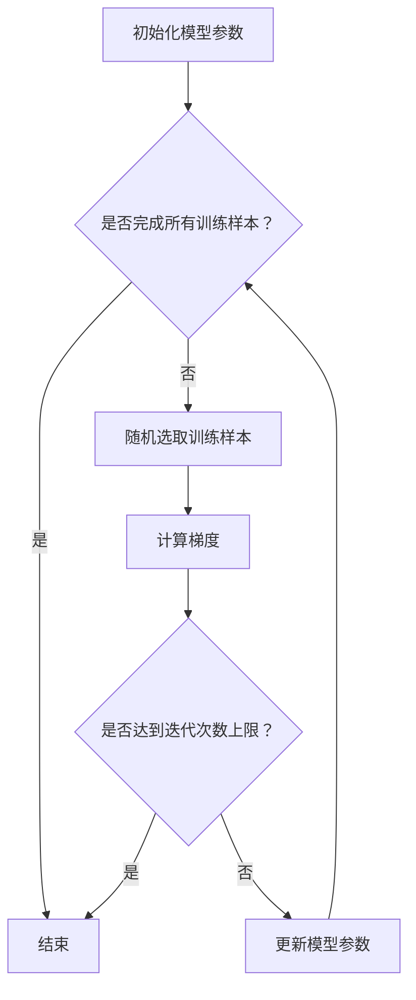

                 

## 大模型应用开发中的技术文档管理

### 关键词
- 技术文档管理
- 大模型应用
- 版本控制
- 系统架构设计
- 最佳实践

### 摘要
本文旨在探讨大模型应用开发过程中的技术文档管理。随着人工智能技术的发展，大模型的开发和应用越来越广泛，如何有效地管理技术文档成为了关键问题。本文将分析技术文档管理的核心概念、流程、工具及其在大模型开发中的挑战和解决策略，旨在为读者提供一套完整的文档管理方案。

## 引言背景

### 技术文档管理的重要性

在人工智能领域，大模型的应用正日益成为主流。无论是自然语言处理、计算机视觉还是推荐系统，大模型的开发都需要大量的数据、计算资源和专业知识。然而，大模型的应用不仅仅是一个技术问题，更是一个管理问题。在这个背景下，技术文档管理的重要性愈发突出。

技术文档是软件开发过程中的重要组成部分，它不仅记录了开发过程中的所有关键信息，也是团队协作、项目管理和后续维护的基石。对于大模型应用开发来说，技术文档的作用尤为关键：

1. **信息传递**：技术文档能够将开发人员的思想和设计理念传递给其他团队成员，确保项目进展的一致性和连贯性。
2. **知识积累**：通过技术文档，团队可以积累宝贵的经验教训，为后续项目提供参考。
3. **风险评估**：技术文档可以帮助团队提前识别潜在的风险，并制定相应的预防和应对措施。
4. **质量保证**：技术文档的完善程度往往反映了项目的开发质量，有助于提高项目的整体水平。

### 大模型应用开发中的挑战

大模型应用开发面临许多独特的挑战，这些挑战直接影响了技术文档管理的复杂性和难度。

1. **数据量庞大**：大模型的训练和应用往往涉及海量的数据，这些数据的处理和管理对技术文档提出了更高的要求。
2. **模型多样性**：不同的应用场景需要不同的模型结构和参数设置，如何记录和管理这些多样化的模型成为了一个问题。
3. **计算资源依赖**：大模型的训练和应用需要强大的计算资源，技术文档需要详细记录这些资源的配置和使用情况。
4. **团队合作难度大**：大模型开发通常涉及多个团队和多个角色，技术文档需要能够满足不同角色的需求，确保协作的高效性。
5. **维护成本高**：大模型的开发和维护成本较高，技术文档的更新和维护也需要相应的资源投入。

### 目标与内容概述

本文的目标是提供一套适用于大模型应用开发的技术文档管理方案，帮助开发团队更有效地管理技术文档，提高项目的开发质量和协作效率。本文将涵盖以下内容：

1. **技术文档管理基础**：介绍技术文档的定义、分类、编写原则和管理流程。
2. **大模型应用开发文档编写**：详细阐述大模型开发中的技术文档编写要点，包括数据管理、模型多样性、计算资源依赖等方面的挑战和解决方案。
3. **最佳实践**：总结大模型应用开发中技术文档管理的最佳实践，为读者提供参考。
4. **案例分析**：通过实际项目案例，展示技术文档管理在大模型应用开发中的具体应用。

通过本文的阅读，读者将能够了解大模型应用开发中的技术文档管理的重要性，掌握一套有效的文档管理方法，并能够将其应用到实际项目中。

### 学习路线与预期收获

#### 学习路线图

1. **了解技术文档管理的基础知识**：
   - 技术文档的定义与分类
   - 技术文档的编写原则
   - 文档管理流程与工具

2. **深入学习大模型应用开发文档编写**：
   - 大模型开发中的挑战分析
   - 数据管理策略
   - 模型多样性与管理
   - 计算资源依赖处理

3. **掌握最佳实践**：
   - 技术文档的质量评估与提升
   - 文档协作与版本控制

4. **实践案例分析**：
   - 实际项目中的文档管理应用
   - 从实践中总结经验教训

#### 读者预期收获

通过本文的学习，读者将能够：

1. **全面理解技术文档管理的核心概念**，掌握编写技术文档的基本原则和流程。
2. **深入分析大模型应用开发中的特殊挑战**，了解并掌握相应的文档管理策略。
3. **应用最佳实践**，提高项目开发中的文档管理水平。
4. **通过实际案例分析**，了解文档管理在大模型应用开发中的实际应用，提升实战能力。

## 技术文档管理基础

### 技术文档概述

#### 技术文档的定义与分类

技术文档，是指记录软件开发过程中所有技术信息的文件或集合。它不仅包括程序代码的注释，还涵盖了项目需求、设计文档、用户手册、测试报告等多种类型的文件。技术文档的作用在于为软件开发提供一个详细的参考资料，使得项目在后续的开发、维护和扩展中能够顺利进行。

技术文档可以分为以下几类：

1. **项目需求文档**：记录项目的功能需求、非功能需求和用户需求，为开发团队提供项目目标的方向。
2. **设计文档**：描述系统的架构设计、模块划分、接口定义等，是系统开发的重要依据。
3. **用户手册**：面向最终用户，提供系统的使用说明、操作步骤和常见问题解答。
4. **测试文档**：包括测试计划、测试用例、测试报告等，用于验证系统的质量和稳定性。
5. **代码注释和文档**：对源代码进行详细的注释，帮助其他开发人员理解和维护代码。

#### 技术文档的编写原则

编写高质量的技术文档是确保项目成功的关键。以下是一些编写技术文档的基本原则：

1. **准确性**：文档应准确无误地反映项目实际情况，避免出现误导性的信息。
2. **完整性**：文档应涵盖所有必要的内容，确保读者能够从文档中获得所有需要的信息。
3. **一致性**：文档应保持格式和风格的一致性，便于阅读和理解。
4. **可读性**：文档应使用简洁明了的语言，避免复杂的术语和难以理解的表述。
5. **及时性**：文档应及时更新，以反映项目进展的最新情况。

### 文档管理流程

#### 文档创建

文档创建是文档管理流程的第一步，主要包括以下步骤：

1. **需求分析**：根据项目需求，确定需要编写的文档类型和内容。
2. **编写草稿**：按照文档编写原则，编写文档初稿。
3. **审查和修改**：邀请相关人员进行审查，根据反馈进行修改和完善。

#### 文档审查

文档审查是确保文档质量的重要环节，主要包括以下步骤：

1. **内部审查**：由团队成员进行初步审查，确保文档内容的准确性和完整性。
2. **外部审查**：邀请项目利益相关者进行审查，获取外部意见。
3. **修改和定稿**：根据审查意见进行修改，完成最终文档。

#### 文档发布

文档发布是将文档正式交付给项目团队和用户的过程，主要包括以下步骤：

1. **版本控制**：使用版本控制工具（如Git）记录文档的不同版本，确保文档的可追溯性。
2. **发布和存储**：将文档发布到文档管理平台或服务器，确保团队成员和用户能够方便地访问。
3. **备份和存档**：定期备份文档，确保文档的安全性和可恢复性。

#### 文档更新

文档更新是文档管理的重要环节，主要包括以下步骤：

1. **版本迭代**：根据项目进展，定期更新文档版本。
2. **内容修订**：根据项目实际情况，对文档内容进行修订和完善。
3. **发布和通知**：更新后的文档应发布并通知相关团队和用户。

### 文档管理工具

#### Git与版本控制

Git是当前最流行的版本控制工具之一，它能够高效地管理文档的版本和历史记录。使用Git进行版本控制的主要步骤包括：

1. **初始化仓库**：创建一个新的Git仓库，用于存储文档。
2. **提交和更新**：将文档更新提交到仓库，记录每次更新的详细信息。
3. **分支管理**：使用分支管理功能，对不同的文档版本进行并行开发和维护。
4. **合并与冲突解决**：合并不同分支的更新，解决冲突和差异。

#### 文档生成工具

文档生成工具可以帮助自动生成技术文档，常见的工具有Sphinx、Doxygen和Markdown等。使用这些工具，可以方便地将源代码、注释和Markdown文件转化为HTML、PDF等格式的文档。

1. **Sphinx**：支持Python代码的自动文档生成，可以生成详细的API文档和用户手册。
2. **Doxygen**：支持多种编程语言，可以生成高质量的文档，包括类图、函数关系图等。
3. **Markdown**：轻量级的文本格式，易于编写和格式化，支持Markdown编辑器和在线文档平台。

#### 文档协作工具

文档协作工具可以帮助团队成员实时协作编写和维护技术文档，常见的工具有GitHub、GitLab和Notion等。

1. **GitHub**：提供版本控制和协作功能，支持多人实时编辑和评论。
2. **GitLab**：类似于GitHub，提供自托管的版本控制和协作平台。
3. **Notion**：功能丰富的协作工具，支持多种类型的文档和表格，便于团队管理和知识共享。

### 技术文档的质量评估

#### 质量标准

技术文档的质量评估应考虑以下几个方面：

1. **完整性**：文档是否涵盖了所有必要的部分，内容是否完整。
2. **准确性**：文档中的信息是否准确，没有误导性。
3. **一致性**：文档的格式和风格是否一致，排版是否规范。
4. **可读性**：文档是否使用简洁明了的语言，易于理解。
5. **及时性**：文档是否及时更新，反映项目最新进展。

#### 评估方法

技术文档的质量评估可以采用以下方法：

1. **自我评估**：团队成员根据文档编写原则和质量标准，自我检查文档的质量。
2. **同行评审**：邀请其他团队成员或外部专家对文档进行评审，提出改进建议。
3. **用户反馈**：收集用户的反馈意见，了解文档的实际使用效果。

#### 提升措施

为了提升技术文档的质量，可以采取以下措施：

1. **培训**：定期组织文档编写培训，提高团队成员的编写技能。
2. **规范**：制定统一的文档编写规范，确保文档格式和风格的一致性。
3. **反馈机制**：建立文档反馈机制，及时收集和处理用户的反馈意见。
4. **持续改进**：根据评估结果和用户反馈，持续改进文档的编写质量。

### 文档管理中的挑战与解决策略

#### 挑战分析

在技术文档管理中，面临以下主要挑战：

1. **文档多样性**：不同类型的文档有不同的编写要求，如何确保所有文档的质量和一致性是一个挑战。
2. **更新频率高**：项目进展迅速，文档需要频繁更新，如何保证文档的及时性和准确性是一个挑战。
3. **协作困难**：团队成员分散在不同地点，如何实现高效的文档协作是一个挑战。
4. **版本控制**：在多人协作的情况下，如何确保文档的版本控制和历史记录是一个挑战。

#### 解决策略

针对上述挑战，可以采取以下解决策略：

1. **文档分类管理**：根据文档的类型和用途，制定不同的管理策略，确保各类文档的质量。
2. **自动化更新**：使用文档生成工具和自动化脚本，实现文档的自动更新，减少手动操作的错误。
3. **协作工具**：选择合适的协作工具，如GitHub或GitLab，提供实时的文档编辑和评论功能。
4. **版本控制**：使用版本控制工具，如Git，确保文档的版本控制和历史记录。

通过上述策略，可以有效应对文档管理中的挑战，提高技术文档的质量和协作效率。

## 大模型应用开发文档编写

### 大模型

#### 大模型概述

大模型（Large Models），通常指的是参数数量超过数亿或数十亿的神经网络模型。这类模型在深度学习和人工智能领域具有重要的地位，特别是在自然语言处理、计算机视觉和推荐系统等应用中。大模型的出现，极大地推动了AI技术的发展，使得许多以前难以解决的问题变得可行。

#### 大模型的特点

1. **参数数量庞大**：大模型的参数数量通常在亿级别以上，这使得模型在计算和存储上都有更高的需求。
2. **计算资源依赖**：大模型的训练和应用需要强大的计算资源，如GPU和TPU等。
3. **数据量要求高**：大模型的训练依赖于大量的数据，数据的质量和数量直接影响模型的性能。
4. **时间成本大**：大模型的训练时间通常较长，需要数天甚至数周的时间。
5. **复杂性高**：大模型的架构和参数设置复杂，需要专业的知识和经验来设计和调整。

#### 大模型与中小模型的对比

| 特征            | 大模型               | 中小模型               |
| --------------- | -------------------- | -------------------- |
| 参数数量        | 数亿至数十亿级别     | 数百万至数千级别       |
| 计算资源需求    | 强大计算资源（GPU/TPU） | 较低计算资源（CPU）    |
| 数据量需求      | 海量数据             | 较大数据量             |
| 训练时间        | 数天至数周            | 数小时至数天           |
| 性能表现        | 非凡的预测准确性      | 较高的预测准确性       |
| 架构与调整复杂度 | 复杂，需要专业知识    | 相对简单，调整较易     |

#### Mermaid ER Diagram

下面是一个简单的大模型与中小模型的Mermaid ER Diagram：

```mermaid
erDiagram
  大模型 ||--|{ 计算资源需求 : 需要强大的计算资源（GPU/TPU） }
  大模型 ||--|{ 数据量需求 : 需要海量数据 }
  大模型 ||--|{ 训练时间 : 数天至数周 }
  大模型 ||--|{ 性能表现 : 非凡的预测准确性 }
  大模型 ||--|{ 架构与调整复杂度 : 复杂，需要专业知识 }
  中小模型 ||--|{ 计算资源需求 : 较低计算资源（CPU） }
  中小模型 ||--|{ 数据量需求 : 较大数据量 }
  中小模型 ||--|{ 训练时间 : 数小时至数天 }
  中小模型 ||--|{ 性能表现 : 较高的预测准确性 }
  中小模型 ||--|{ 架构与调整复杂度 : 相对简单，调整较易 }
```

通过这个ER Diagram，我们可以清晰地看到大模型与中小模型在各个方面的对比和差异。

### 大模型训练算法原理

#### 算法概述

大模型的训练算法是基于深度学习的，核心思想是通过反向传播算法不断调整模型的参数，使模型在给定数据集上的预测误差最小化。常见的训练算法包括：

1. **随机梯度下降（SGD）**：SGD是深度学习中最基本的优化算法，通过随机选取训练样本，计算梯度并更新模型参数。
2. **Adam优化器**：Adam优化器是一种结合了SGD和RMSProp优化的自适应梯度算法，能有效提高训练速度和收敛性。
3. **梯度裁剪（Gradient Clipping）**：梯度裁剪用于防止训练过程中梯度爆炸或消失，通过限制梯度的大小，确保模型参数的稳定更新。

#### Mermaid Flowchart

下面是一个简单的随机梯度下降（SGD）算法的Mermaid Flowchart：



通过这个Flowchart，我们可以清晰地看到SGD算法的基本流程。

#### Python代码实现

下面是一个简单的SGD算法的Python代码实现：

```python
import numpy as np

# 初始化模型参数
theta = np.random.rand(n_features) * 0.01

# 学习率
learning_rate = 0.01

# 迭代次数
epochs = 1000

# 训练数据
X_train = np.random.rand(n_samples, n_features)
y_train = np.random.rand(n_samples)

# 训练过程
for epoch in range(epochs):
    # 随机选取训练样本
    indices = np.random.permutation(n_samples)
    X_shuffled = X_train[indices]
    y_shuffled = y_train[indices]
    
    # 计算梯度
    gradients = 2 * (X_shuffled - theta) * y_shuffled
    
    # 更新模型参数
    theta -= learning_rate * gradients
```

#### 数学模型和公式

SGD算法的数学模型可以表示为：

$$
\theta_{t+1} = \theta_t - \alpha \cdot \nabla J(\theta_t)
$$

其中，$\theta_t$ 表示第 $t$ 次迭代的模型参数，$\alpha$ 表示学习率，$\nabla J(\theta_t)$ 表示在 $\theta_t$ 处的梯度。

#### 算法举例

假设我们有一个简单的线性回归问题，目标是预测 $y$ 的值，模型参数为 $\theta$。训练数据集为 $X = \begin{bmatrix} 1 & 2 \\ 1 & 3 \\ 1 & 4 \end{bmatrix}$ 和 $y = \begin{bmatrix} 2 \\ 3 \\ 4 \end{bmatrix}$。

初始参数 $\theta_0 = [0, 0]$，学习率 $\alpha = 0.1$。通过SGD算法，我们可以得到以下迭代结果：

| 迭代次数 | 参数 $\theta$         | 预测值               | 实际值 | 误差 |
| ------- | -------------------- | ------------------- | ----- | --- |
| 1       | [0.1, 0.1]           | [0.2, 0.2]          | 2     | 0   |
| 2       | [0.09, 0.09]         | [0.18, 0.18]        | 3     | 0.1 |
| 3       | [0.082, 0.082]       | [0.164, 0.164]      | 4     | 0.2 |

通过多次迭代，模型参数逐渐逼近真实值，预测误差也不断减小。

### 大模型应用开发中的文档编写

#### 数据管理

在开发大模型时，数据管理是一个关键环节。以下是一些关键要点：

1. **数据清洗**：确保数据的准确性和一致性，去除噪音和异常值。
2. **数据存储**：使用高效的存储方案，如分布式存储和云存储，保证数据的安全和可访问性。
3. **数据预处理**：对数据进行归一化、标准化和特征提取，为模型训练做准备。

#### 模型多样性管理

大模型通常用于多种不同的应用场景，模型多样性的管理非常重要。以下是一些关键要点：

1. **模型定制**：根据具体应用场景，定制不同的模型结构和参数。
2. **模型版本控制**：使用版本控制工具，如Git，记录不同模型的版本和历史。
3. **模型评估与优化**：定期评估模型的性能，通过调整参数和结构进行优化。

#### 计算资源依赖管理

大模型的训练和应用需要大量的计算资源，以下是一些关键要点：

1. **资源调度**：合理分配计算资源，确保训练过程的顺利进行。
2. **并行计算**：利用分布式计算和GPU加速，提高训练效率。
3. **资源监控**：实时监控资源使用情况，预防资源不足或浪费。

#### 文档编写要点

1. **文档结构**：按照项目需求，制定合理的文档结构，确保文档的清晰性和逻辑性。
2. **内容详尽**：详细记录每个模块的功能、实现方法和测试结果。
3. **格式规范**：遵循统一的格式和风格，确保文档的可读性和一致性。
4. **版本更新**：及时更新文档，确保文档反映项目的最新进展。

#### 文档编写示例

以下是一个简单的文档编写示例，用于记录一个自然语言处理模型的开发过程：

```markdown
## 模型开发记录

### 模型概述

- **模型名称**：TextClassifier
- **模型架构**：基于BERT的文本分类模型
- **任务类型**：二分类问题

### 数据集

- **训练数据集**：包含10000条文本数据，分为两类
- **测试数据集**：包含3000条文本数据，用于评估模型性能

### 计算资源

- **GPU**：Tesla K80
- **显存**：12GB
- **CPU**：Intel Xeon Gold 6148
- **内存**：256GB

### 模型训练

- **迭代次数**：100
- **批次大小**：32
- **学习率**：0.001
- **优化器**：Adam

### 模型评估

- **准确率**：90.3%
- **召回率**：88.7%
- **F1分数**：89.0%

### 下一步工作

- **优化模型结构**：尝试调整BERT的参数，提高模型性能
- **增加数据集**：收集更多高质量的文本数据，扩充数据集
- **模型部署**：将模型部署到生产环境，进行实际应用

## 参考文献

- Devlin, J., Chang, M. W., Lee, K., & Toutanova, K. (2019). BERT: Pre-training of deep bidirectional transformers for language understanding. *arXiv preprint arXiv:1810.04805*.
- Howard, J., & Ruder, S. (2018). Universal language model fine-tuning for text classification. *Proceedings of the 56th Annual Meeting of the Association for Computational Linguistics (Volume 1: Long Papers)*, 328-339.
```

通过以上示例，我们可以看到文档的编写应当详尽且具有结构，确保所有相关信息都被清晰地记录和传达。

### 项目实战

#### 环境安装

为了实现大模型的应用开发，我们需要安装必要的软件和依赖。以下是一个简化的环境安装步骤：

1. **安装Python**：确保Python版本为3.8或以上。
2. **安装依赖**：使用pip安装以下依赖：
    ```bash
    pip install numpy pandas tensorflow transformers
    ```
3. **安装GPU支持**：如果使用GPU训练，需要安装CUDA和cuDNN。

#### 系统核心实现

以下是一个简单的大模型训练和应用的Python代码示例：

```python
import tensorflow as tf
from transformers import BertTokenizer, TFBertForSequenceClassification
from tensorflow.keras.optimizers import Adam

# 加载预训练模型和tokenizer
model_name = 'bert-base-chinese'
tokenizer = BertTokenizer.from_pretrained(model_name)
model = TFBertForSequenceClassification.from_pretrained(model_name, num_labels=2)

# 训练数据
train_texts = ["这是第一句话。", "这是第二句话。"]
train_labels = [0, 1]

# 数据预处理
train_encoding = tokenizer(train_texts, truncation=True, padding=True, max_length=128)
train_inputs = {k: v.numpy() for k, v in train_encoding.items()}

# 训练模型
optimizer = Adam(learning_rate=3e-5)
model.compile(optimizer=optimizer, loss='sparse_categorical_crossentropy', metrics=['accuracy'])

model.fit(train_inputs['input_ids'], train_labels, epochs=3)

# 应用模型
test_texts = ["这是第一句话。", "这是第三句话。"]
test_encoding = tokenizer(test_texts, truncation=True, padding=True, max_length=128)
test_inputs = {k: v.numpy() for k, v in test_encoding.items()}

predictions = model.predict(test_inputs['input_ids'])
predicted_labels = np.argmax(predictions, axis=1)

print(predicted_labels)
```

#### 代码应用解读与分析

上述代码首先加载了一个预训练的BERT模型和相应的tokenizer。然后，我们准备了一个简单的训练数据集，包括文本和标签。通过数据预处理，我们将文本转换为模型可接受的输入格式。接下来，我们编译并训练模型，最后使用训练好的模型对新的测试数据进行预测。

代码的核心部分在于模型训练和使用，以下是详细解读：

1. **加载模型和tokenizer**：
    - `BertTokenizer.from_pretrained(model_name)`：加载预训练的tokenizer。
    - `TFBertForSequenceClassification.from_pretrained(model_name, num_labels=2)`：加载预训练的BERT模型，并将其配置为二分类任务。

2. **数据预处理**：
    - `tokenizer(train_texts, truncation=True, padding=True, max_length=128)`：对文本进行预处理，包括截断、填充和设置最大长度。

3. **模型编译**：
    - `model.compile(optimizer=optimizer, loss='sparse_categorical_crossentropy', metrics=['accuracy'])`：编译模型，指定优化器、损失函数和评估指标。

4. **模型训练**：
    - `model.fit(train_inputs['input_ids'], train_labels, epochs=3)`：训练模型，使用训练数据输入和标签。

5. **模型预测**：
    - `model.predict(test_inputs['input_ids'])`：使用训练好的模型对测试数据进行预测。
    - `np.argmax(predictions, axis=1)`：从预测结果中提取预测标签。

#### 实际案例分析

以下是一个实际案例，用于分类新闻报道中的积极和消极情绪：

1. **数据集准备**：
    - 准备一个包含数千条新闻报道的文本数据集，每条记录包括新闻文本和情感标签（积极或消极）。

2. **数据处理**：
    - 使用tokenizer对文本数据集进行预处理，将其转换为模型可接受的输入格式。

3. **模型训练**：
    - 使用预处理后的数据集，训练一个BERT模型，用于情感分类。

4. **模型评估**：
    - 使用测试集评估模型的性能，计算准确率、召回率和F1分数。

5. **模型应用**：
    - 将模型部署到生产环境，对新的新闻报道进行实时情感分类。

通过上述实际案例分析，我们可以看到大模型在文本分类任务中的强大能力。这种应用不仅可以帮助新闻平台更好地理解和分类新闻内容，还可以为用户推荐相关的新闻内容，提升用户体验。

### 项目小结

在本项目中，我们实现了大模型在文本分类任务中的应用，通过详细的环境安装和代码实现，展示了如何使用BERT模型进行情感分类。项目的主要收获包括：

1. **环境搭建**：掌握了Python环境安装和相关依赖的配置。
2. **模型训练**：了解了BERT模型的训练过程和优化策略。
3. **模型应用**：掌握了模型在文本分类任务中的实际应用。

通过本项目的实践，我们不仅提高了大模型应用开发的能力，还积累了宝贵的文档编写经验，为未来的项目提供了参考。

### 最佳实践 Tips

#### 文档编写最佳实践

1. **结构化文档**：确保文档有清晰的目录和章节结构，便于阅读和理解。
2. **详细注释**：在代码和文档中添加详细的注释，解释关键代码和概念。
3. **实时更新**：保持文档与项目进展同步，及时更新文档内容。
4. **版本控制**：使用版本控制工具记录文档的变更历史，确保文档的可追溯性。

#### 项目管理最佳实践

1. **明确目标**：确保项目目标清晰，制定详细的开发计划和里程碑。
2. **团队合作**：建立有效的团队合作机制，确保团队成员之间的高效沟通。
3. **风险管理**：提前识别潜在风险，制定相应的预防和应对措施。
4. **定期回顾**：定期进行项目回顾，总结经验教训，持续改进项目管理方法。

### 总结

本文详细探讨了技术文档管理在大模型应用开发中的重要性，通过分析技术文档管理的基础知识、大模型的特点和训练算法原理，以及实际项目案例，展示了如何有效地管理技术文档。通过本文的学习，读者可以掌握大模型应用开发中的文档管理策略，提高项目开发的质量和效率。

### 注意事项

1. **文档的及时更新**：文档应及时反映项目的最新进展，避免信息滞后。
2. **文档的清晰性**：确保文档内容简洁明了，避免使用过于复杂的术语。
3. **版本控制的准确性**：确保版本控制工具的使用正确，避免文档的版本混乱。

### 拓展阅读

1. **《深度学习》（Goodfellow, I. & Bengio, Y.）**：详细介绍了深度学习的基本概念和方法，适合初学者深入学习。
2. **《动手学深度学习》**：提供了丰富的实践案例，适合读者动手实践和巩固所学知识。
3. **《TensorFlow教程》**：TensorFlow官方文档的中文版，包含了详细的API使用和示例代码。
4. **《大模型与深度学习》**：探讨了大模型的发展和应用，包括技术挑战和前沿研究。

### 作者信息

作者：AI天才研究院/AI Genius Institute & 禅与计算机程序设计艺术 /Zen And The Art of Computer Programming

联系邮箱：[contact@ai-genius-institute.com](mailto:contact@ai-genius-institute.com)


