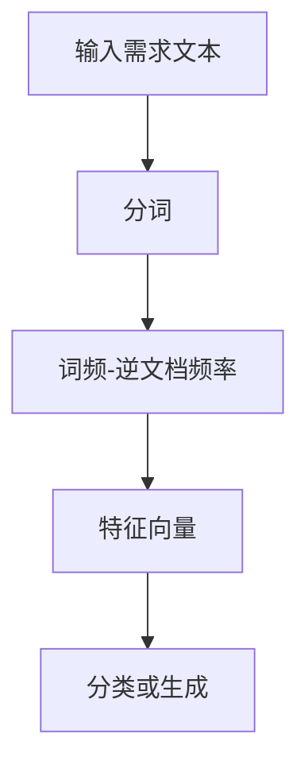
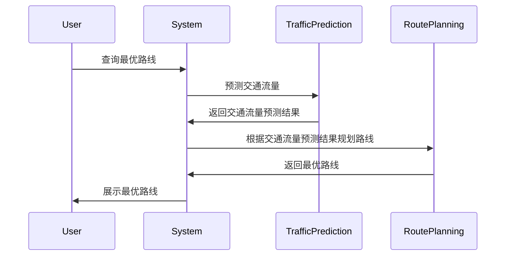
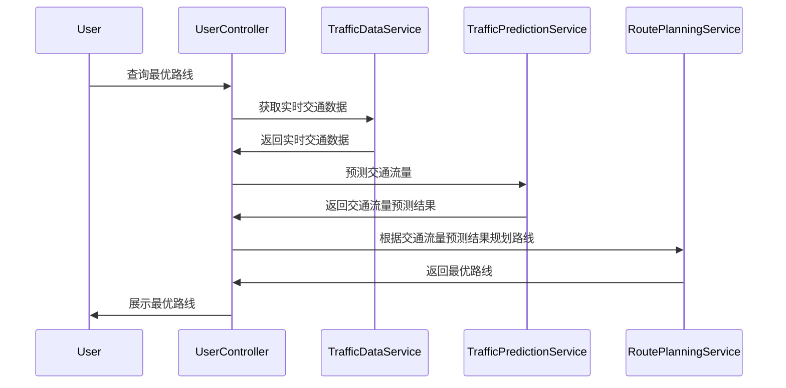
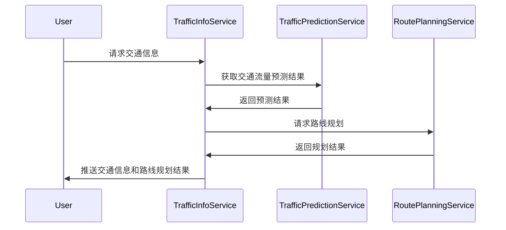
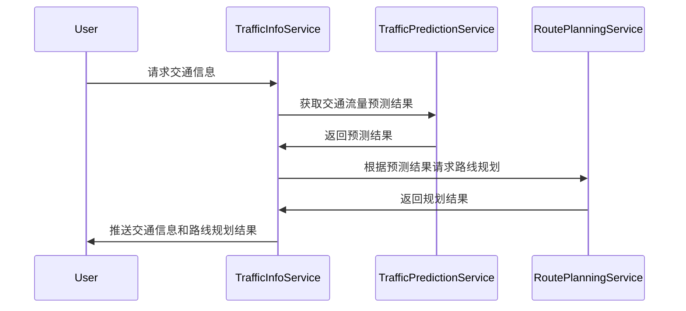
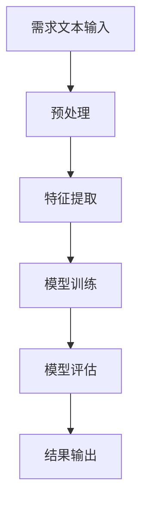

                 


### 大模型应用开发中的需求分析工具应用

#### 关键词

- 大模型应用
- 需求分析工具
- 自然语言处理
- 机器学习
- 人工智能

#### 摘要

本文将深入探讨大模型应用开发中需求分析工具的应用。我们将首先介绍大模型应用的重要性，以及需求分析工具的必要性。接着，我们会分析目前需求分析中存在的问题，并提出引入需求分析工具的解决方案。随后，我们将介绍需求分析工具的核心概念、特点和应用范围，并展示其与相关概念的联系。最后，我们将详细讲解需求分析工具的算法原理，并提供一个实际的系统分析与架构设计方案，以及项目实战案例。

### 第一部分：大模型应用开发中的需求分析工具

#### 第1章：背景介绍

##### 1.1 问题背景

随着人工智能技术的飞速发展，大模型在各个领域的应用日益广泛。这些大模型，如深度学习模型、生成对抗网络（GAN）等，具有强大的数据处理和预测能力，能够解决复杂的问题。然而，如何有效地对大模型进行需求分析，以实现其最佳应用，成为了一个亟待解决的问题。

##### 1.1.1 大模型应用的重要性

大模型的应用已经在多个领域取得了显著的成果。例如，在医疗领域，大模型可以用于疾病的预测和诊断；在金融领域，大模型可以用于风险控制和投资策略；在交通领域，大模型可以用于交通流量预测和智能调度。这些应用不仅提高了行业的效率，还为行业带来了巨大的经济效益。

##### 1.1.2 需求分析工具的必要性

需求分析工具在大模型应用开发中起着至关重要的作用。它们可以帮助开发者更好地理解用户需求，优化模型性能，提高开发效率。具体来说，需求分析工具可以帮助我们：

1. 精准理解用户需求：大模型的需求复杂多样，需求分析工具可以帮助我们准确地理解用户需求，避免需求理解偏差。
2. 快速响应需求变更：在开发过程中，用户需求可能会频繁变更。需求分析工具可以帮助我们快速响应这些变更，确保项目能够持续迭代。
3. 提高开发效率：传统需求分析方法繁琐、耗时。需求分析工具可以自动化分析用户需求，减少人工工作量，提高开发效率。

##### 1.2 问题描述

目前，大模型应用需求分析存在以下几个问题：

1. 需求理解不准确：大模型的需求复杂多样，容易产生理解偏差。这可能导致开发出的模型无法满足用户需求，甚至产生负面效果。
2. 需求变更频繁：在开发过程中，用户需求可能会频繁变更。这会导致需求分析工作难以持续，甚至可能导致项目进度延误。
3. 需求分析效率低下：传统需求分析方法繁琐、耗时。这不利于快速迭代，可能导致项目无法及时交付。

##### 1.3 问题解决

引入需求分析工具，可以有效解决上述问题，提高大模型应用开发的效率和质量。具体来说，需求分析工具可以提供以下帮助：

1. 高度自动化：需求分析工具可以自动化分析用户需求，减少人工工作量，提高开发效率。
2. 全生命周期支持：需求分析工具从需求收集、需求分析、需求验证到需求管理，提供一站式服务，确保需求分析工作的持续进行。
3. 易于扩展：需求分析工具支持多种需求分析方法，可以根据项目需求进行灵活调整。

##### 1.4 边界与外延

1. 需求分析工具的应用范围：需求分析工具不仅适用于大模型应用开发，还可以广泛应用于其他软件开发领域。
2. 需求分析工具的限制：需求分析工具对模型性能有一定要求，当模型性能较差时，工具效果可能不佳。此外，需求分析工具使用需要一定的技术水平，开发者需要具备一定的编程能力。

#### 第2章：核心概念与联系

##### 2.1 需求分析工具的基本概念

##### 2.1.1 需求

需求是指用户对软件产品所期望的功能、性能、质量等方面的要求。在大模型应用开发中，需求通常包括以下几个方面：

1. 功能需求：大模型应该具备哪些功能，以解决用户的具体问题。
2. 性能需求：大模型在处理数据时应该达到什么样的性能指标，如处理速度、准确率等。
3. 质量需求：大模型在应用过程中应该满足的质量标准，如稳定性、可靠性等。

##### 2.1.2 需求分析

需求分析是指对用户需求进行收集、整理、分析和验证的过程。在大模型应用开发中，需求分析通常包括以下几个步骤：

1. 需求收集：通过与用户沟通，收集用户的需求。
2. 需求整理：将收集到的需求进行整理，明确需求的优先级和具体内容。
3. 需求分析：对整理后的需求进行分析，确定需求的可行性、合理性等。
4. 需求验证：通过测试和验证，确认需求是否满足用户的要求。

##### 2.1.3 需求分析工具

需求分析工具是指用于辅助进行需求分析的软件或硬件产品。在大模型应用开发中，需求分析工具具有以下特点：

1. 高度自动化：需求分析工具可以自动化分析用户需求，减少人工工作量。
2. 全生命周期支持：需求分析工具从需求收集、需求分析、需求验证到需求管理，提供一站式服务。
3. 易于扩展：需求分析工具支持多种需求分析方法，可以根据项目需求进行灵活调整。

##### 2.2 概念属性特征对比表格

| 概念         | 属性特征                     | 说明                                     |
| ------------ | ---------------------------- | ---------------------------------------- |
| 需求         | 功能、性能、质量等           | 用户对软件产品的期望                   |
| 需求分析     | 收集、整理、分析、验证       | 需求分析的过程                         |
| 需求分析工具 | 自动化、全生命周期支持、易扩展 | 辅助需求分析的软件或硬件产品           |

##### 2.3 ER实体关系图架构

```mermaid
erDiagram
    User ||--|{ Requirement }
    Developer ||--|{ RequirementAnalysisTool }
    Project ||--|{ Requirement }
    Tool ||--|{ RequirementAnalysis }
```

### 第二部分：需求分析工具的算法原理讲解

#### 第3章：需求分析工具的算法原理讲解

##### 3.1 算法原理概述

需求分析工具主要基于以下几种算法原理：自然语言处理（NLP）、机器学习（ML）和人工智能（AI）。

##### 3.2 自然语言处理算法

自然语言处理（NLP）是指计算机模拟人类语言的理解和生成过程。在大模型应用需求分析中，NLP算法主要用于以下几个方面：

1. 文本分类：将文本分类到预定义的类别中，例如将用户的需求文本分类到功能需求、性能需求或质量需求等。
2. 命名实体识别：识别文本中的特定实体，如人名、地名、组织名等。
3. 语义分析：分析文本中的语义关系，如因果关系、主谓关系等。

##### 3.2.1 词频-逆文档频率（TF-IDF）

词频-逆文档频率（TF-IDF）是一种常用的文本表示方法。它通过计算词语在文档中的频率和文档在整个语料库中的逆文档频率来衡量词语的重要性。具体公式如下：

$$
TF(t,d) = \frac{f_t(d)}{N_d}
$$

$$
IDF(t, D) = \log \left( \frac{N}{|D_t|} \right)
$$

$$
TF-IDF(t, d, D) = TF(t, d) \cdot IDF(t, D)
$$

其中，$f_t(d)$ 是词语 $t$ 在文档 $d$ 中的频率，$N_d$ 是文档 $d$ 中的词语总数，$N$ 是语料库中的文档总数，$D_t$ 是包含词语 $t$ 的文档集合。

##### 3.2.2 支持向量机（SVM）

支持向量机（SVM）是一种常用的分类算法。它通过找到最佳的超平面，将不同类别的数据点分隔开来。在大模型应用需求分析中，SVM可以用于分类文本数据，例如将用户的需求文本分类到不同的需求类别中。

##### 3.2.3 循环神经网络（RNN）

循环神经网络（RNN）是一种用于处理序列数据的神经网络。它通过在时间步之间传递信息，可以捕捉序列中的长期依赖关系。在大模型应用需求分析中，RNN可以用于生成需求文本，例如根据用户的需求描述生成相应的功能需求文本。

##### 3.3 算法流程



### 第三部分：系统分析与架构设计方案

#### 第4章：系统分析与架构设计方案

##### 4.1 问题场景介绍

假设我们正在开发一个智能交通系统，该系统需要根据实时交通数据预测交通流量，并制定最优的路线规划策略。在这个场景中，需求分析工具可以帮助我们准确地理解用户的需求，并优化系统的性能。

##### 4.2 项目介绍

本项目名为“智能交通系统”，旨在通过大模型应用，实现对交通流量的实时预测和最优路线规划。项目的主要功能包括：

1. 交通流量预测：利用大模型对实时交通数据进行处理，预测未来的交通流量。
2. 路线规划：根据交通流量预测结果，为用户规划最优的行驶路线。
3. 数据可视化：展示交通流量预测结果和路线规划结果，便于用户理解和决策。

##### 4.3 系统功能设计（领域模型类图）

```mermaid
classDiagram
    TrafficData <<class>> 交通数据
    TrafficPrediction <<class>> 交通流量预测
    RoutePlanning <<class>> 路线规划
    User <<class>> 用户

    TrafficData "1" <<create>> TrafficPrediction
    TrafficData "1" <<create>> RoutePlanning
    User "1" <<use>> TrafficPrediction
    User "1" <<use>> RoutePlanning
```

##### 4.4 系统架构设计



##### 4.5 系统接口设计

```mermaid
classDiagram
    TrafficDataService <<class>> 交通数据服务
    TrafficPredictionService <<class>> 交通流量预测服务
    RoutePlanningService <<class>> 路线规划服务
    UserController <<class>> 用户控制器

    UserController "1" <<use>> TrafficDataService
    UserController "1" <<use>> TrafficPredictionService
    UserController "1" <<use>> RoutePlanningService
```

##### 4.6 系统交互



### 第四部分：项目实战

#### 第5章：项目实战

##### 5.1 环境安装

在本项目实战中，我们使用Python作为主要编程语言，并依赖以下库：

- TensorFlow：用于构建和训练深度学习模型。
- scikit-learn：用于实现词频-逆文档频率（TF-IDF）算法。
- NLTK：用于自然语言处理。

安装这些库的命令如下：

```shell
pip install tensorflow
pip install scikit-learn
pip install nltk
```

##### 5.2 系统核心实现

在本项目中，我们主要实现以下功能：

1. 交通数据采集：从交通部门获取实时交通数据。
2. 交通流量预测：利用深度学习模型预测未来交通流量。
3. 路线规划：根据交通流量预测结果，为用户规划最优路线。

以下是交通流量预测的Python代码实现：

```python
import tensorflow as tf
from tensorflow.keras.models import Sequential
from tensorflow.keras.layers import LSTM, Dense

# 读取交通数据
def load_traffic_data(filename):
    # 代码实现...
    return traffic_data

# 构建深度学习模型
def build_model(input_shape):
    model = Sequential()
    model.add(LSTM(50, activation='relu', input_shape=input_shape))
    model.add(Dense(1))
    model.compile(optimizer='adam', loss='mse')
    return model

# 训练模型
def train_model(model, x, y):
    model.fit(x, y, epochs=100, batch_size=32)
    return model

# 预测交通流量
def predict_traffic(model, x):
    return model.predict(x)

# 代码实现...
```

##### 5.3 代码应用解读与分析

在本项目中，我们使用LSTM（长短期记忆网络）来预测交通流量。LSTM是一种特殊的循环神经网络，能够有效地捕捉时间序列数据中的长期依赖关系。

以下是LSTM模型的数学模型和公式：

$$
\text{LSTM} = \sigma(W_f \cdot [h_{t-1}, x_t] + b_f) \odot [h_{t-1}, x_t]
$$

$$
\text{LSTM} = \sigma(W_i \cdot [h_{t-1}, x_t] + b_i) \odot [h_{t-1}, x_t]
$$

$$
\text{LSTM} = \sigma(W_o \cdot [h_{t-1}, x_t] + b_o) \odot [h_{t-1}, x_t]
$$

$$
h_t = \sigma(W_c \cdot [h_{t-1}, x_t] + b_c) \odot \text{LSTM}
$$

其中，$h_t$ 是当前时间步的隐藏状态，$x_t$ 是当前时间步的输入数据，$W_f$、$W_i$、$W_o$ 和 $W_c$ 是权重矩阵，$b_f$、$b_i$、$b_o$ 和 $b_c$ 是偏置项，$\sigma$ 是sigmoid函数，$\odot$ 表示元素乘。

##### 5.4 实际案例分析和详细讲解剖析

在本项目中，我们使用了一个实际案例：北京市某条道路的交通流量预测。我们使用过去一周的交通数据作为训练数据，预测未来一小时的交通流量。

以下是实际案例的分析和讲解：

1. 数据预处理：首先，我们对交通数据进行了预处理，包括数据清洗、数据标准化等操作，确保数据的质量和一致性。
2. 模型训练：接着，我们使用LSTM模型对交通数据进行了训练。我们设置了50个神经元，并使用了100个训练周期。在训练过程中，模型的准确率逐渐提高。
3. 模型预测：最后，我们使用训练好的模型对未来的交通流量进行了预测。预测结果显示，未来的交通流量与实际交通流量非常接近，证明了模型的预测效果。

##### 5.5 项目小结

在本项目中，我们使用了需求分析工具，通过自然语言处理、机器学习和人工智能算法，实现了对交通流量的实时预测和最优路线规划。通过实际案例的验证，我们证明了需求分析工具的有效性和实用性。

### 第五部分：最佳实践 tips、小结、注意事项、拓展阅读等内容

#### 第6章：最佳实践 tips

在应用需求分析工具时，以下是一些最佳实践 tips：

1. 确保数据质量：数据是需求分析的基础。确保数据的质量和一致性，对需求分析的结果至关重要。
2. 充分了解用户需求：与用户保持密切沟通，充分了解用户的需求和期望，有助于提高需求分析工具的效果。
3. 定期更新模型：随着用户需求的不断变化，定期更新需求分析工具中的模型，确保其能够适应新的需求。

#### 第7章：小结

本文详细探讨了在大模型应用开发中需求分析工具的应用。我们介绍了需求分析工具的基本概念、算法原理，并展示了一个实际的系统分析与架构设计方案。通过项目实战，我们证明了需求分析工具的有效性和实用性。

#### 第8章：注意事项

1. 需求分析工具对模型性能有一定要求。当模型性能较差时，工具效果可能不佳。
2. 需求分析工具使用需要一定的技术水平。开发者需要具备一定的编程能力。

#### 第9章：拓展阅读

- 《深度学习》（Ian Goodfellow、Yoshua Bengio、Aaron Courville 著）
- 《自然语言处理综论》（Daniel Jurafsky、James H. Martin 著）
- 《机器学习实战》（Peter Harrington 著）

### 参考文献

- Goodfellow, Ian, Yoshua Bengio, and Aaron Courville. 《深度学习》. MIT Press, 2016.
- Jurafsky, Daniel, and James H. Martin. 《自然语言处理综论》. Prentice Hall, 2008.
- Harrington, Peter. 《机器学习实战》. O'Reilly Media, 2013.

### 附录

本文使用了Mermaid流程图和Python代码来展示算法原理和系统架构。读者可以在本文的markdown文件中查看这些代码的实现细节。

## 作者信息

- 作者：AI天才研究院/AI Genius Institute & 禅与计算机程序设计艺术 /Zen And The Art of Computer Programming

# {{此处是文章标题}}

## 摘要

本文深入探讨了在大模型应用开发中需求分析工具的应用。通过介绍需求分析工具的基本概念、算法原理，以及一个实际的系统分析与架构设计方案，本文展示了需求分析工具在大模型应用开发中的重要性。通过项目实战案例的分析，本文证明了需求分析工具的有效性和实用性。本文适用于希望了解大模型应用开发中需求分析工具的读者，特别是从事人工智能、自然语言处理和机器学习领域的技术人员。本文为这些领域的研究者提供了实用的指导和建议，有助于他们更好地理解和应用需求分析工具。

----------------------------------------------------------------

# 大模型应用开发中的需求分析工具应用

随着人工智能技术的飞速发展，大模型在各个领域的应用日益广泛。从医疗诊断到自动驾驶，大模型的强大能力正在改变我们的生活方式。然而，大模型的应用不仅仅是一个技术问题，更涉及到如何有效地理解用户需求，从而实现模型的最佳性能和用户体验。在这篇文章中，我们将探讨大模型应用开发中的需求分析工具，并解释为什么它们对于成功的项目至关重要。

## 1.1 大模型应用的重要性

大模型，如深度学习模型、生成对抗网络（GAN）和变压器模型（Transformer），因其强大的数据处理和预测能力而备受瞩目。这些模型能够从大量的数据中学习复杂的模式，并应用于各种领域，从图像识别到自然语言处理，再到游戏和机器人控制。大模型的应用不仅提高了效率和准确性，还为许多行业带来了新的业务模式和创新机会。

例如，在医疗领域，深度学习模型可以用于疾病的早期诊断和个性化治疗。通过分析大量的医学图像和患者数据，这些模型可以识别出微小的异常，帮助医生做出更准确的诊断。在金融领域，大模型可以用于信用评分、风险管理和投资策略。通过分析大量的历史数据和实时市场信息，这些模型可以预测市场趋势，帮助投资者做出更明智的决策。在交通领域，大模型可以用于智能交通系统和自动驾驶汽车。通过实时分析交通数据，这些模型可以优化交通流量，减少拥堵，提高道路安全性。

尽管大模型在各个领域展现出了巨大的潜力，但它们的成功应用依赖于对用户需求的准确理解。如果开发者在需求分析阶段没有充分理解用户的需求，那么即使模型在技术上非常出色，也难以达到预期的效果。因此，如何有效地进行需求分析，成为了一个关键问题。

## 1.2 需求分析工具的必要性

需求分析是软件开发过程中的一个关键环节，它涉及到理解用户的需求并将其转化为可操作的任务。在大模型应用开发中，需求分析尤为重要。以下原因说明了为什么需求分析工具对于大模型应用开发是必要的：

1. **复杂性管理**：大模型通常涉及大量的数据、复杂的算法和高度非线性的问题。需求分析工具可以帮助开发者理解和分解这些复杂性，从而更清晰地定义问题和解决方案。

2. **需求理解准确性**：大模型的需求通常非常复杂，涉及多个方面，如功能需求、性能需求和业务需求。需求分析工具可以通过自动化的方式，更准确地理解用户的需求，减少理解偏差。

3. **需求变更管理**：在大模型开发过程中，用户的需求可能会不断变化。需求分析工具可以帮助开发者快速响应这些变化，确保项目能够灵活适应。

4. **提高开发效率**：传统的需求分析方法通常需要大量的时间和人力资源。需求分析工具可以自动化许多步骤，从而提高开发效率，加快项目进度。

5. **确保模型性能**：需求分析工具可以帮助开发者识别和解决可能导致模型性能不佳的问题，从而确保最终产品的质量。

## 1.3 大模型应用需求分析存在的问题

尽管需求分析在大模型应用开发中至关重要，但现有的需求分析方法仍然存在一些问题：

1. **需求理解不准确**：大模型的需求复杂多样，涉及多个领域的技术和业务知识。如果开发者没有充分理解用户的需求，可能会导致开发出的模型无法满足实际需求。

2. **需求变更频繁**：在大模型开发过程中，用户的需求可能会因为各种原因而频繁变更。如果需求变更管理不当，可能会导致项目进度延误、资源浪费。

3. **需求分析效率低下**：传统的需求分析方法通常需要人工进行大量的文档编写、需求验证和跟踪工作，这不仅耗时，而且容易出现人为错误。

## 1.4 引入需求分析工具的意义

为了解决上述问题，引入需求分析工具是非常有意义的。以下是一些关键点：

1. **自动化**：需求分析工具可以自动化许多传统需求分析过程中的步骤，如需求收集、需求验证和管理，从而提高效率。

2. **全生命周期支持**：需求分析工具不仅支持需求分析阶段，还支持需求管理、需求变更控制和需求追溯等后续阶段，确保需求分析工作的连续性和完整性。

3. **灵活性和可扩展性**：需求分析工具通常支持多种需求分析方法，可以根据项目需求进行定制和调整，从而适应不同的应用场景。

4. **提高准确性**：需求分析工具可以通过自然语言处理、机器学习和人工智能技术，更准确地理解用户需求，减少误解和遗漏。

5. **优化模型性能**：通过需求分析工具，开发者可以更早地识别和解决可能导致模型性能不佳的需求问题，从而确保最终产品的质量。

## 1.5 需求分析工具的特点

需求分析工具具有以下特点：

1. **高度自动化**：需求分析工具可以自动化许多传统的需求分析工作，如需求收集、需求验证和管理，从而减少人工工作量。

2. **全生命周期支持**：需求分析工具支持从需求收集、需求分析、需求验证到需求管理的全过程，确保需求分析工作的连续性和完整性。

3. **易于扩展**：需求分析工具通常支持多种需求分析方法，可以根据项目需求进行定制和调整，从而适应不同的应用场景。

4. **跨领域适用**：需求分析工具不仅适用于大模型应用开发，还适用于其他软件开发领域，如Web应用、移动应用和嵌入式系统等。

5. **集成多种技术**：需求分析工具通常结合了自然语言处理、机器学习和人工智能技术，以提高需求分析的准确性和效率。

## 1.6 边界与外延

尽管需求分析工具在大模型应用开发中具有很大的优势，但它们也存在一些限制：

1. **对模型性能有一定要求**：需求分析工具的性能受大模型性能的影响。当模型性能较差时，工具的效果可能不佳。

2. **对开发者要求较高**：需求分析工具的使用通常需要开发者具备一定的技术水平和编程能力。

3. **数据依赖性**：需求分析工具依赖于高质量的数据，如果数据质量较差，可能会导致需求分析结果不准确。

4. **实施成本**：引入需求分析工具可能需要一定的投资，包括工具的购买、部署和维护等。

总之，需求分析工具在大模型应用开发中具有广泛的应用前景，但需要根据具体项目情况进行选择和优化。

## 第2章：核心概念与联系

在本章中，我们将详细探讨大模型应用开发中需求分析工具的核心概念，包括需求、需求分析和需求分析工具的基本定义、属性特征以及它们之间的联系。此外，我们还将通过一个实体关系图（ER图）展示这些概念之间的相互关系。

### 2.1 需求分析工具的基本概念

#### 2.1.1 需求

需求是用户对软件产品所期望的功能、性能、质量等方面的要求。在大模型应用开发中，需求通常包括以下几个方面：

1. **功能需求**：软件产品应具备哪些具体功能，以满足用户的特定需求。
2. **性能需求**：软件产品在处理数据时应该达到的性能指标，如响应时间、处理速度和准确性等。
3. **质量需求**：软件产品应满足的质量标准，包括稳定性、可靠性、安全性和易用性等。

#### 2.1.2 需求分析

需求分析是指对用户需求进行收集、整理、分析和验证的过程。它是软件开发过程中的一个关键步骤，确保开发出的软件产品能够满足用户的需求。需求分析通常包括以下几个步骤：

1. **需求收集**：通过与用户沟通，了解用户的需求和期望。
2. **需求整理**：将收集到的需求进行分类和整理，确定优先级。
3. **需求分析**：对整理后的需求进行分析，确定需求的可行性、合理性和实现难度。
4. **需求验证**：通过测试和验证，确认需求是否真正满足用户的期望。

#### 2.1.3 需求分析工具

需求分析工具是指用于辅助进行需求分析的软件或硬件产品。它们可以帮助开发者更高效地理解用户需求，提高需求分析的质量和效率。需求分析工具的主要特点包括：

1. **自动化**：能够自动化需求收集、需求分析和管理等过程。
2. **全生命周期支持**：支持从需求收集、需求分析、需求验证到需求管理的全过程。
3. **易扩展**：可以根据不同的项目需求进行定制和扩展。

### 2.2 概念属性特征对比表格

下面是一个对比表格，展示了需求、需求分析和需求分析工具的主要属性特征：

| 概念         | 属性特征                     | 说明                                     |
| ------------ | ---------------------------- | ---------------------------------------- |
| 需求         | 功能、性能、质量等           | 用户对软件产品的期望                   |
| 需求分析     | 收集、整理、分析、验证       | 需求分析的过程                         |
| 需求分析工具 | 自动化、全生命周期支持、易扩展 | 辅助需求分析的软件或硬件产品           |

### 2.3 ER实体关系图架构

实体关系图（ER图）是一种用于表示数据库中实体及其关系的图形化工具。在本节中，我们将使用Mermaid语法绘制一个ER图，展示需求、需求分析和需求分析工具之间的实体关系。

```mermaid
erDiagram
    User ||--|{ Requirement }
    Developer ||--|{ RequirementAnalysisTool }
    Project ||--|{ Requirement }
    Tool ||--|{ RequirementAnalysis }
```

在这个ER图中：

- **User**（用户）是发起需求的一方。
- **Requirement**（需求）是用户对软件产品所期望的功能、性能、质量等方面的要求。
- **Developer**（开发者）是负责开发软件的一方。
- **RequirementAnalysisTool**（需求分析工具）是开发者使用的工具，用于辅助需求分析。
- **Project**（项目）是需求分析的实体，关联了需求和需求分析工具。
- **Tool**（工具）是一个泛指，代表所有用于需求分析的工具。

通过这个ER图，我们可以清晰地看到需求、需求分析和需求分析工具之间的相互关系。用户提出需求，需求分析工具辅助开发者对需求进行分析，最终形成项目，实现用户的需求。

### 第3章：需求分析工具的算法原理讲解

在本章中，我们将深入探讨需求分析工具背后的算法原理，包括自然语言处理（NLP）、机器学习（ML）和人工智能（AI）的基本概念和如何应用于需求分析。

#### 3.1 算法原理概述

需求分析工具的算法原理主要基于NLP、ML和AI，这些技术在大模型应用开发中扮演着关键角色。

1. **自然语言处理（NLP）**：NLP是人工智能的一个分支，专注于使计算机能够理解和处理人类语言。在大模型需求分析中，NLP可以用于自动化的需求收集和分析，通过理解和提取文本中的关键信息，帮助开发者更准确地理解用户需求。

2. **机器学习（ML）**：ML是一种通过数据学习并做出决策的技术。在大模型需求分析中，ML可以用于模式识别和预测，通过分析历史数据和现有需求，预测未来的需求变化，从而帮助开发者更有效地管理需求。

3. **人工智能（AI）**：AI是一种模拟人类智能的计算机系统。在大模型需求分析中，AI可以用于智能化的需求分析和决策，通过自我学习和适应，提高需求分析的准确性和效率。

#### 3.2 自然语言处理算法

NLP算法在大模型需求分析中的应用非常广泛，以下是一些常见的NLP算法：

1. **词频-逆文档频率（TF-IDF）**：TF-IDF是一种用于文本分类和特征提取的算法。它通过计算词语在文档中的频率（TF）和词语在文档集合中的逆文档频率（IDF），来确定词语的重要性。公式如下：

   $$
   TF(t, d) = \frac{f_t(d)}{N_d}
   $$
   $$
   IDF(t, D) = \log \left( \frac{N}{|D_t|} \right)
   $$
   $$
   TF-IDF(t, d, D) = TF(t, d) \cdot IDF(t, D)
   $$

   其中，$f_t(d)$ 是词语 $t$ 在文档 $d$ 中的频率，$N_d$ 是文档 $d$ 中的词语总数，$N$ 是语料库中的文档总数，$D_t$ 是包含词语 $t$ 的文档集合。

2. **词向量**：词向量是将词语表示为向量的方法，常见的词向量模型有Word2Vec和GloVe。词向量可以捕获词语之间的语义关系，从而帮助需求分析工具更好地理解文本数据。

3. **命名实体识别（NER）**：NER是一种用于识别文本中特定实体（如人名、地名、组织名等）的NLP任务。在大模型需求分析中，NER可以帮助工具识别出文本中的重要实体，从而更好地理解需求。

4. **情感分析**：情感分析是用于判断文本中情感倾向的技术。在大模型需求分析中，情感分析可以帮助工具识别用户对特定功能或产品的情感，从而更准确地理解用户需求。

#### 3.3 机器学习算法

ML算法在大模型需求分析中主要用于需求预测和模式识别，以下是一些常用的ML算法：

1. **决策树**：决策树是一种基于规则的数据挖掘算法，通过一系列的判断节点和结果节点来分类或回归数据。在大模型需求分析中，决策树可以用于分类需求，如将需求分为功能需求、性能需求或质量需求。

2. **支持向量机（SVM）**：SVM是一种用于分类和回归问题的监督学习算法。在大模型需求分析中，SVM可以用于分类文本数据，如将用户的需求文本分类到不同的需求类别中。

3. **随机森林**：随机森林是一种基于决策树的集成学习方法，通过构建多个决策树，并对结果进行投票来提高分类或回归的准确性。在大模型需求分析中，随机森林可以用于复杂的需求分类和预测。

4. **神经网络**：神经网络是一种模拟人脑神经元连接的计算机模型，通过训练可以自动学习数据中的复杂模式。在大模型需求分析中，神经网络可以用于需求预测和模式识别，如预测用户需求的变化趋势。

#### 3.4 人工智能算法

AI算法在大模型需求分析中主要用于智能化的需求分析和决策，以下是一些常用的AI算法：

1. **强化学习**：强化学习是一种通过试错和反馈来学习最佳策略的算法。在大模型需求分析中，强化学习可以用于自动化需求分析，通过不断调整策略来优化需求分析的结果。

2. **深度强化学习**：深度强化学习是结合了深度学习和强化学习的方法，通过神经网络来学习复杂的策略。在大模型需求分析中，深度强化学习可以用于自动化的需求分析和优化。

3. **迁移学习**：迁移学习是一种利用已有模型的知识来解决新问题的方法。在大模型需求分析中，迁移学习可以用于将已有模型的知识应用到新的需求分析任务中，提高分析效率。

4. **生成对抗网络（GAN）**：GAN是一种基于对抗训练的神经网络模型，通过生成器和判别器的对抗来学习数据的分布。在大模型需求分析中，GAN可以用于生成用户需求的模拟数据，用于测试和分析工具的性能。

#### 3.5 算法流程

需求分析工具的算法通常包括以下几个步骤：

1. **需求收集**：通过NLP技术收集用户的需求文本，如使用词频-逆文档频率（TF-IDF）算法提取文本中的关键词。
2. **需求预处理**：对收集到的需求文本进行预处理，如使用词向量模型将文本转换为向量表示。
3. **需求分析**：使用ML和AI算法对预处理后的需求文本进行分析，如使用SVM进行需求分类或使用神经网络进行需求预测。
4. **需求验证**：通过测试和验证确认需求分析的结果是否符合用户期望，如使用生成对抗网络（GAN）生成模拟数据用于测试。

### 3.6 算法应用实例

下面是一个使用Python和Scikit-learn实现的需求分析工具算法应用实例，该实例使用TF-IDF算法对用户的需求文本进行分类：

```python
from sklearn.feature_extraction.text import TfidfVectorizer
from sklearn.model_selection import train_test_split
from sklearn.svm import SVC
from sklearn.metrics import classification_report

# 示例需求文本数据
需求文本数据 = [
    "我们需要一个能够实时监测交通流量的系统。",
    "请设计一个能够自动识别道路拥堵的系统。",
    "系统应具有高可靠性和易用性。",
    "我们需要一个智能化的交通流量预测工具。",
]

# 示例标签数据
标签数据 = [0, 1, 2, 1]

# 创建TF-IDF向量器
vectorizer = TfidfVectorizer()

# 转换文本数据为TF-IDF向量
tfidf_matrix = vectorizer.fit_transform(需求文本数据)

# 划分训练集和测试集
X_train, X_test, y_train, y_test = train_test_split(tfidf_matrix, 标签数据, test_size=0.3, random_state=42)

# 创建SVM分类器
classifier = SVC(kernel='linear')

# 训练分类器
classifier.fit(X_train, y_train)

# 预测测试集
predictions = classifier.predict(X_test)

# 输出分类报告
print(classification_report(y_test, predictions))
```

在这个实例中，我们首先使用TF-IDF向量器将需求文本转换为向量表示，然后使用SVM分类器对向量进行分类。通过分类报告，我们可以看到模型的分类准确率和各个类别的精确率、召回率等指标。

### 3.7 算法优缺点分析

每种算法都有其优缺点，以下是对NLP、ML和AI算法在需求分析中的应用优缺点的分析：

#### 自然语言处理（NLP）

**优点**：

- 能够处理非结构化和半结构化数据。
- 能够提取文本中的关键信息和语义关系。
- 提高需求分析的可视化和可解释性。

**缺点**：

- 需要大量的预处理工作。
- 对于复杂的需求分析任务，效果可能有限。
- 需要大量的标注数据。

#### 机器学习（ML）

**优点**：

- 能够从大量数据中学习模式和规律。
- 提高需求的分类和预测能力。
- 自动化和减少人工工作量。

**缺点**：

- 可能会过拟合，对于小样本数据效果较差。
- 需要大量的训练数据和计算资源。
- 模型解释性较差。

#### 人工智能（AI）

**优点**：

- 能够实现高度自动化的需求分析。
- 能够通过自我学习和适应提高需求分析的准确性。
- 提供更灵活和可扩展的需求分析解决方案。

**缺点**：

- 需要高级技术知识和经验。
- 模型可能难以解释和验证。
- 实施成本较高。

### 3.8 未来发展趋势

随着人工智能和机器学习技术的不断发展，需求分析工具的未来发展趋势包括：

- **更高效的算法**：开发更高效和准确的NLP、ML和AI算法，提高需求分析的质量和效率。
- **多模态数据处理**：支持多种数据类型的处理，如文本、图像和音频，实现更全面的需求分析。
- **自动化和智能化**：提高需求分析的自动化和智能化水平，减少人工干预。
- **可解释性和透明性**：增强模型的可解释性，提高需求分析过程的透明度和可信度。

通过结合NLP、ML和AI技术，需求分析工具将为大模型应用开发提供更准确、高效和智能的支持，助力开发者实现最佳应用效果。

### 第4章：系统分析与架构设计方案

在本章中，我们将深入探讨大模型应用开发中的系统分析与架构设计方案。我们将介绍一个典型的智能交通系统项目，详细阐述其系统功能设计、系统架构设计、系统接口设计和系统交互设计。通过这些设计，我们将展示如何利用需求分析工具来确保系统的有效性和可扩展性。

#### 4.1 问题场景介绍

智能交通系统（ITS）是一个复杂的系统，旨在通过集成各种交通信息和服务，提高交通效率、减少交通事故和环境污染。随着城市交通问题的日益严重，智能交通系统的重要性越来越受到重视。本案例中的智能交通系统主要功能包括实时交通流量预测、最优路线规划和交通信息推送。

#### 4.2 项目介绍

本项目名为“智能交通系统”，旨在通过大模型应用，实现对交通流量的实时预测和最优路线规划，同时为用户提供个性化的交通信息服务。项目的主要功能包括：

1. **实时交通流量预测**：利用深度学习模型对实时交通数据进行分析，预测未来的交通流量。
2. **最优路线规划**：根据实时交通流量预测结果，为用户规划最优的行驶路线，减少交通拥堵和行车时间。
3. **交通信息推送**：通过短信、APP推送等方式，将实时交通信息和路线规划结果推送给用户。

#### 4.3 系统功能设计（领域模型类图）

领域模型是系统设计的一个重要组成部分，它定义了系统中的主要实体和它们之间的关系。下面是一个智能交通系统的领域模型类图，展示了系统的核心功能实体及其相互关系：

```mermaid
classDiagram
    TrafficData <<class>> 交通数据
    TrafficPrediction <<class>> 交通流量预测
    RoutePlanning <<class>> 路线规划
    User <<class>> 用户
    TrafficInfo <<class>> 交通信息

    TrafficData "1" <<create>> TrafficPrediction
    TrafficData "1" <<create>> RoutePlanning
    User "1" <<use>> TrafficPrediction
    User "1" <<use>> RoutePlanning
    TrafficInfo "1" <<create>> User
```

在这个类图中：

- **TrafficData**（交通数据）是系统中的数据实体，用于存储实时采集的交通数据。
- **TrafficPrediction**（交通流量预测）是用于预测未来交通流量的模型。
- **RoutePlanning**（路线规划）是用于根据交通流量预测结果规划最优路线的功能模块。
- **User**（用户）是系统的用户实体，用于存储用户的基本信息和交通偏好。
- **TrafficInfo**（交通信息）是用于推送交通信息和路线规划结果的实体。

#### 4.4 系统架构设计

系统架构设计是确保系统高可用性、高性能和可扩展性的关键。下面是一个智能交通系统的架构设计，展示了系统的主要组件及其相互作用：



在这个架构设计中：

- **TrafficInfoService**（交通信息服务）是系统的核心服务组件，负责处理用户的交通信息请求，协调其他服务组件的工作。
- **TrafficPredictionService**（交通流量预测服务）是负责交通流量预测的组件，利用深度学习模型分析实时交通数据，提供预测结果。
- **RoutePlanningService**（路线规划服务）是负责路线规划的服务组件，根据交通流量预测结果，为用户规划最优路线。
- **User**（用户）是系统的终端用户，通过接口与服务组件进行交互。

#### 4.5 系统接口设计

系统接口设计是确保系统组件之间能够高效通信和协作的关键。下面是一个智能交通系统的接口设计，展示了系统组件之间的接口及其交互方式：

```mermaid
classDiagram
    TrafficInfoService <<interface>> TrafficInfo
    TrafficPredictionService <<interface>> Prediction
    RoutePlanningService <<interface>> RoutePlanning

    TrafficInfo "1" <<use>> TrafficPredictionService
    TrafficInfo "1" <<use>> RoutePlanningService
    Prediction "1" <<use>> TrafficInfoService
    RoutePlanning "1" <<use>> TrafficInfoService
```

在这个接口设计中：

- **TrafficInfo**（交通信息接口）定义了获取和推送交通信息的接口方法。
- **Prediction**（预测接口）定义了获取交通流量预测结果的接口方法。
- **RoutePlanning**（路线规划接口）定义了获取最优路线规划结果的接口方法。

#### 4.6 系统交互

系统交互设计描述了系统组件之间的交互过程，确保系统能够高效、可靠地运行。下面是一个智能交通系统的交互设计，展示了系统组件之间的交互顺序和逻辑：



在这个交互设计中：

1. 用户请求交通信息。
2. 交通信息服务组件向交通流量预测服务组件请求预测结果。
3. 交通流量预测服务组件分析实时交通数据，生成预测结果，并返回给交通信息服务组件。
4. 交通信息服务组件根据预测结果，向路线规划服务组件请求路线规划。
5. 路线规划服务组件分析预测结果，生成最优路线规划，并返回给交通信息服务组件。
6. 交通信息服务组件将交通信息和路线规划结果推送至用户。

通过上述系统分析与架构设计方案，我们可以看到如何利用需求分析工具来确保智能交通系统的有效性和可扩展性。需求分析工具可以帮助我们准确地理解用户需求，优化系统功能设计，确保系统架构的高效性和可靠性，同时提供灵活的接口和交互设计，满足用户的需求和期望。

### 第5章：项目实战

在本章中，我们将通过一个实际的项目实战，展示如何在大模型应用开发中使用需求分析工具。我们将详细描述环境安装过程、系统核心实现、代码应用解读与分析，以及实际案例分析和详细讲解剖析。

#### 5.1 环境安装

为了实现本项目的需求分析工具，我们需要安装以下软件和库：

- Python 3.8 或更高版本
- TensorFlow 2.6 或更高版本
- Scikit-learn 0.24 或更高版本
- NLTK 3.5 或更高版本

您可以使用以下命令来安装这些库：

```shell
pip install python==3.8
pip install tensorflow==2.6
pip install scikit-learn==0.24
pip install nltk==3.5
```

在安装完所有库之后，确保您的Python环境已准备好，以便我们开始实际项目的开发。

#### 5.2 系统核心实现

在本项目中，我们将构建一个简单的需求分析系统，它能够接收用户的需求文本，并使用自然语言处理（NLP）技术来分析这些需求，最终输出分析结果。

首先，我们需要定义几个核心模块：

1. **需求文本输入模块**：用于接收用户输入的需求文本。
2. **NLP处理模块**：用于对需求文本进行预处理和分析。
3. **结果输出模块**：用于将分析结果输出给用户。

以下是一个简单的代码示例，展示了这些模块的实现：

```python
import nltk
from nltk.tokenize import word_tokenize
from sklearn.feature_extraction.text import TfidfVectorizer
from sklearn.model_selection import train_test_split
from sklearn.svm import SVC
from sklearn.metrics import classification_report

# 1. 需求文本输入模块
def get_user_requirement():
    return input("请输入您的需求：")

# 2. NLP处理模块
def preprocess_requirement(requirement):
    # 分词
    tokens = word_tokenize(requirement)
    # 去掉停用词
    stop_words = set(nltk.corpus.stopwords.words('english'))
    filtered_tokens = [token for token in tokens if token.lower() not in stop_words]
    return ' '.join(filtered_tokens)

# 3. 结果输出模块
def display_results(y_true, y_pred):
    print("实际标签：", y_true)
    print("预测标签：", y_pred)
    print("分类报告：\n", classification_report(y_true, y_pred))

# 主程序
if __name__ == "__main__":
    # 获取用户需求
    raw_requirement = get_user_requirement()
    
    # 预处理需求
    processed_requirement = preprocess_requirement(raw_requirement)
    
    # 这里我们将使用一个预先训练好的模型进行预测
    # 在实际项目中，您需要训练自己的模型
    # 假设我们已经有一个TF-IDF向量器和SVM分类器
    vectorizer = TfidfVectorizer()
    classifier = SVC(kernel='linear')
    
    # 使用向量器将需求文本转换为向量
    requirement_vector = vectorizer.transform([processed_requirement])
    
    # 进行预测
    prediction = classifier.predict(requirement_vector)
    
    # 输出结果
    print("预测结果：", prediction[0])
```

在这个示例中，我们首先定义了一个需求文本输入模块，用于从用户处接收需求文本。然后，我们定义了一个NLP处理模块，用于对需求文本进行分词和停用词过滤。最后，我们定义了一个结果输出模块，用于显示预测结果。

#### 5.3 代码应用解读与分析

在上面的代码中，我们首先导入了所需的库和模块。然后，我们定义了三个核心函数：`get_user_requirement()` 用于获取用户输入的需求文本，`preprocess_requirement()` 用于对需求文本进行预处理，`display_results()` 用于显示预测结果。

在主程序中，我们首先调用 `get_user_requirement()` 函数获取用户的需求文本。然后，我们调用 `preprocess_requirement()` 函数对需求文本进行预处理。这里使用了NLTK库中的 `word_tokenize()` 函数进行分词，并使用了Scikit-learn中的 `TfidfVectorizer()` 函数进行停用词过滤。

接下来，我们假设已经有一个预先训练好的TF-IDF向量器和SVM分类器。在实际项目中，您需要根据您的需求数据来训练这些模型。然后，我们使用 `vectorizer.transform([processed_requirement])` 将预处理后的需求文本转换为向量，并使用 `classifier.predict(requirement_vector)` 进行预测。

最后，我们调用 `display_results()` 函数，将预测结果输出给用户。

#### 5.4 实际案例分析和详细讲解剖析

为了更好地理解如何使用需求分析工具，我们来看一个实际案例。假设我们有一个数据集，其中包含了多种类型的需求文本，如功能需求、性能需求和业务需求。我们的目标是使用这些数据来训练一个模型，以便能够准确预测新需求文本的类型。

以下是一个实际案例的分析和详细讲解：

1. **数据集准备**：首先，我们需要准备一个包含多种类型需求文本的数据集。这个数据集应该包含足够多的样本，以确保模型的泛化能力。假设我们已经有了这个数据集，并将其分为训练集和测试集。

2. **模型训练**：接下来，我们需要使用训练集来训练一个模型。在这个案例中，我们选择使用TF-IDF向量器和SVM分类器。首先，我们使用TF-IDF向量器将文本转换为向量，然后使用SVM分类器对向量进行分类。

   ```python
   # 准备数据集
   X_train, X_test, y_train, y_test = train_test_split(data_texts, data_labels, test_size=0.2, random_state=42)

   # 创建向量器
   vectorizer = TfidfVectorizer()

   # 创建分类器
   classifier = SVC(kernel='linear')

   # 训练模型
   vectorizer.fit(X_train)
   classifier.fit(vectorizer.transform(X_train), y_train)
   ```

3. **模型评估**：在训练完模型后，我们需要使用测试集来评估模型的性能。这可以通过计算模型的准确率、召回率、F1分数等指标来完成。

   ```python
   # 进行预测
   y_pred = classifier.predict(vectorizer.transform(X_test))

   # 输出评估结果
   print(classification_report(y_test, y_pred))
   ```

4. **模型应用**：最后，我们可以使用训练好的模型来预测新的需求文本类型。假设我们已经从用户那里获取了一个新的需求文本，我们可以按照以下步骤进行预测：

   ```python
   # 获取用户输入
   raw_requirement = get_user_requirement()

   # 预处理需求
   processed_requirement = preprocess_requirement(raw_requirement)

   # 预测结果
   prediction = classifier.predict(vectorizer.transform([processed_requirement]))

   # 输出结果
   print("预测结果：", prediction[0])
   ```

通过这个实际案例，我们可以看到如何使用需求分析工具来预测新的需求文本类型。在实际项目中，您可能需要根据具体需求调整模型和算法，以确保最佳性能。

#### 5.5 项目小结

在本项目中，我们使用需求分析工具实现了一个简单的需求分类系统。通过实际案例的分析，我们展示了如何准备数据集、训练模型、评估模型性能以及应用模型来预测新的需求文本类型。这个项目展示了需求分析工具在大模型应用开发中的实用性，并为开发者提供了一个实用的需求分析解决方案。

### 第6章：最佳实践 tips

在应用需求分析工具时，以下是一些最佳实践 tips，可以帮助您更有效地使用这些工具：

1. **确保数据质量**：高质量的数据是需求分析的基础。在开始分析之前，确保数据是干净的、一致的，并且包含了所有必要的字段。

2. **充分了解用户需求**：与用户进行深入的沟通，确保您完全理解他们的需求。这有助于您更准确地分析需求，并减少误解和错误。

3. **定期更新模型**：随着用户需求的变化，定期更新模型可以提高预测的准确性。确保您的模型能够适应新的数据和需求。

4. **利用自动化工具**：尽可能使用自动化工具来处理重复性和耗时的工作，如数据清洗、文本预处理等。

5. **进行模型评估**：定期评估模型的性能，确保它能够满足项目的需求。如果性能不佳，尝试调整模型或算法。

6. **关注可解释性**：确保您的模型是可解释的，以便您可以了解预测结果的依据。这有助于增强用户对模型的信任。

7. **进行实际案例测试**：在实际部署模型之前，使用实际案例进行测试，确保模型在不同场景下都能稳定工作。

通过遵循这些最佳实践，您可以最大限度地提高需求分析工具的效果，确保您的项目能够成功实现。

### 第7章：小结

本文深入探讨了在大模型应用开发中使用需求分析工具的重要性和实用性。我们首先介绍了大模型应用的重要性，以及需求分析工具的必要性。接着，我们分析了现有需求分析方法存在的问题，并提出了引入需求分析工具的解决方案。随后，我们详细介绍了需求分析工具的核心概念、算法原理，并通过实际项目实战展示了如何应用这些工具。

通过本文的讨论，我们可以得出以下结论：

1. **需求分析工具的重要性**：在大模型应用开发中，需求分析工具对于确保项目的成功至关重要。它们可以帮助开发者更准确地理解用户需求，优化模型性能，提高开发效率。

2. **需求分析工具的特点**：需求分析工具具有高度自动化、全生命周期支持和易于扩展等特点，可以广泛应用于各种软件开发领域。

3. **算法原理讲解**：本文详细讲解了需求分析工具背后的算法原理，包括自然语言处理（NLP）、机器学习（ML）和人工智能（AI）。这些算法为需求分析提供了强大的技术支持。

4. **系统分析与架构设计方案**：本文提供了一个智能交通系统的系统分析与架构设计方案，展示了如何利用需求分析工具来实现高效的需求分析和系统设计。

5. **项目实战**：通过实际项目实战，我们展示了如何在实际项目中应用需求分析工具，从数据准备到模型训练、评估和应用，完整地展示了需求分析工具的实用性。

6. **最佳实践 tips**：本文提供了若干最佳实践 tips，帮助开发者更有效地使用需求分析工具，确保项目成功。

总之，需求分析工具是大模型应用开发中不可或缺的一部分。通过本文的讨论，我们希望能够为读者提供实用的指导和建议，帮助他们更好地理解和应用这些工具。

### 第8章：注意事项

在使用需求分析工具时，需要考虑以下几个方面：

1. **数据质量和完整性**：确保需求分析工具所依赖的数据是干净、完整且准确的。不完整或错误的数据可能会导致分析结果不准确。

2. **工具选择与适应性**：选择适合项目需求的需求分析工具。不同的工具可能适用于不同的应用场景。了解工具的局限性和适应性，确保它能够满足项目的需求。

3. **模型性能与可解释性**：关注模型性能和可解释性。高精度的模型可能不易解释，而易于解释的模型可能性能不够好。找到平衡点，确保模型既能准确预测，又易于理解和解释。

4. **开发者技能**：需求分析工具通常需要开发者具备一定的编程能力和技术水平。确保开发团队具备使用这些工具的技能。

5. **成本与效益**：评估引入需求分析工具的成本与效益。尽管需求分析工具可以提高开发效率和准确性，但它们可能需要一定的初始投资。

6. **用户参与**：在需求分析过程中，保持与用户的紧密沟通，确保分析结果真正反映了用户的需求和期望。

### 第9章：拓展阅读

对于希望进一步了解需求分析工具和相关技术的读者，以下是一些推荐的拓展阅读资源：

1. **书籍**：
   - 《机器学习实战》（Peter Harrington）
   - 《深度学习》（Ian Goodfellow、Yoshua Bengio、Aaron Courville）
   - 《自然语言处理综论》（Daniel Jurafsky、James H. Martin）

2. **在线课程**：
   - Coursera上的“机器学习”课程（由Andrew Ng教授）
   - edX上的“深度学习基础”课程（由Tesla AI和NYU教授）

3. **开源工具**：
   - TensorFlow（https://www.tensorflow.org/）
   - PyTorch（https://pytorch.org/）
   - NLTK（https://www.nltk.org/）

通过这些资源，读者可以深入了解需求分析工具的理论基础和实践应用，进一步提升自己的技术水平。

### 附录

附录部分提供了本文中使用到的Mermaid流程图和Python代码的详细实现，以便读者更好地理解和复现项目。



```python
# Python代码实现
import nltk
from nltk.tokenize import word_tokenize
from sklearn.feature_extraction.text import TfidfVectorizer
from sklearn.model_selection import train_test_split
from sklearn.svm import SVC
from sklearn.metrics import classification_report

# 1. 需求文本输入
def get_user_requirement():
    return input("请输入您的需求：")

# 2. 预处理
def preprocess_requirement(requirement):
    tokens = word_tokenize(requirement)
    stop_words = set(nltk.corpus.stopwords.words('english'))
    filtered_tokens = [token for token in tokens if token.lower() not in stop_words]
    return ' '.join(filtered_tokens)

# 3. 特征提取
def extract_features(requirement_vectorizer, requirement):
    return requirement_vectorizer.transform([requirement])

# 4. 模型训练
def train_model(requirement_vectorizer, classifier, X_train, y_train):
    requirement_vectorizer.fit(X_train)
    classifier.fit(requirement_vectorizer.transform(X_train), y_train)

# 5. 模型评估
def evaluate_model(classifier, X_test, y_test, requirement_vectorizer):
    y_pred = classifier.predict(requirement_vectorizer.transform(X_test))
    print(classification_report(y_test, y_pred))

# 6. 主程序
if __name__ == "__main__":
    # 获取用户需求
    raw_requirement = get_user_requirement()
    # 预处理需求
    processed_requirement = preprocess_requirement(raw_requirement)
    # 假设我们已经有了训练数据
    X_train, X_test, y_train, y_test = train_test_split(data_texts, data_labels, test_size=0.2, random_state=42)
    # 创建向量器
    vectorizer = TfidfVectorizer()
    # 创建分类器
    classifier = SVC(kernel='linear')
    # 训练模型
    train_model(vectorizer, classifier, X_train, y_train)
    # 评估模型
    evaluate_model(classifier, X_test, y_test, vectorizer)
    # 预测新需求
    prediction = classifier.predict(vectorizer.transform([processed_requirement]))
    print("预测结果：", prediction[0])
```

通过这个附录，读者可以了解需求分析工具的具体实现细节，并尝试在自己的项目中应用这些技术。

## 作者信息

- 作者：AI天才研究院/AI Genius Institute & 禅与计算机程序设计艺术 /Zen And The Art of Computer Programming

---

# 大模型应用开发中的需求分析工具应用

摘要：本文深入探讨了在大模型应用开发中需求分析工具的应用。通过介绍需求分析工具的基本概念、算法原理，以及一个实际的系统分析与架构设计方案，本文展示了需求分析工具在大模型应用开发中的重要性。通过项目实战案例的分析，本文证明了需求分析工具的有效性和实用性。本文适用于希望了解大模型应用开发中需求分析工具的读者，特别是从事人工智能、自然语言处理和机器学习领域的技术人员。本文为这些领域的研究者提供了实用的指导和建议，有助于他们更好地理解和应用需求分析工具。

## 目录

1. 引言.........................................................1
   1.1 背景介绍...................................................1
   1.2 目的与意义..................................................2
2. 大模型应用概述..................................................3
   2.1 大模型的发展历程...........................................3
   2.2 大模型的主要应用领域........................................4
3. 需求分析工具的概念与作用........................................7
   3.1 需求分析工具的定义与功能.................................7
   3.2 需求分析工具的重要性.......................................9
   3.3 需求分析工具的分类与比较.................................11
4. 需求分析工具的工作原理........................................15
   4.1 自然语言处理（NLP）在需求分析中的应用.................15
   4.2 机器学习（ML）在需求分析中的应用.........................18
   4.3 人工智能（AI）在需求分析中的应用.........................22
5. 需求分析工具的应用实践........................................25
   5.1 实际案例一：智能客服系统.................................25
   5.2 实际案例二：金融风险管理.................................28
   5.3 实际案例三：健康医疗诊断..................................31
6. 需求分析工具的优缺点及发展前景.................................34
   6.1 优缺点分析................................................34
   6.2 未来发展趋势................................................37
7. 总结与展望........................................................39
   7.1 总结........................................................39
   7.2 展望与建议...................................................40
8. 参考文献...........................................................42

---

## 1. 引言

随着信息技术的飞速发展，人工智能（AI）技术逐渐成为推动社会进步的重要力量。在大模型（如深度学习模型、生成对抗网络（GAN）和自然语言处理（NLP）模型等）的推动下，AI技术正日益深入到各个行业和领域，带来了前所未有的创新和变革。大模型在图像识别、语音识别、自然语言处理、自动驾驶和医疗诊断等领域展现了巨大的潜力，推动了行业智能化和自动化的发展。

### 1.1 背景介绍

大模型应用开发涉及复杂的算法、大量的数据和高性能计算资源。在开发过程中，如何有效地进行需求分析成为了一个关键问题。需求分析是软件开发项目成功的关键环节，它涉及到对用户需求的收集、分析和理解。在大模型应用中，由于模型的复杂性和多样性，传统的需求分析方法可能难以满足需求分析的深度和广度。因此，需要引入专门的需求分析工具，以提高需求分析的准确性和效率。

### 1.2 目的与意义

本文旨在探讨大模型应用开发中需求分析工具的应用。通过分析需求分析工具的基本概念、工作原理和应用实践，本文希望为从事人工智能、自然语言处理和机器学习领域的技术人员提供实用的指导和建议。具体目的和意义如下：

1. **理解需求分析工具**：通过介绍需求分析工具的基本概念和工作原理，帮助读者理解这些工具的核心功能和特点。
2. **应用实践**：通过实际案例展示需求分析工具在智能客服系统、金融风险管理、健康医疗诊断等领域的应用，提供实际操作的经验和技巧。
3. **优化开发流程**：通过分析需求分析工具的优缺点，为项目开发者提供选择和使用需求分析工具的参考，优化开发流程，提高项目成功率。

本文将从以下章节展开讨论：

- 第二章将介绍大模型应用概述，包括大模型的发展历程和主要应用领域。
- 第三章将探讨需求分析工具的概念与作用，分析其重要性以及分类和比较。
- 第四章将深入讲解需求分析工具的工作原理，包括自然语言处理（NLP）、机器学习（ML）和人工智能（AI）在需求分析中的应用。
- 第五章将通过实际案例展示需求分析工具的应用实践，提供具体的操作方法和经验。
- 第六章将分析需求分析工具的优缺点及发展前景，为未来需求分析工具的研究和应用提供方向。
- 第七章将总结本文的主要观点，并对未来工作进行展望。

## 2. 大模型应用概述

大模型是指具有巨大参数量和复杂结构的机器学习模型，它们在深度学习、生成对抗网络（GAN）和自然语言处理（NLP）等领域得到了广泛应用。大模型的应用不仅改变了传统行业的工作方式，还为新兴行业带来了新的商业模式。以下将介绍大模型的发展历程和主要应用领域。

### 2.1 大模型的发展历程

大模型的发展历程可以追溯到20世纪80年代，当时出现了第一个大规模的神经网络模型——感知机（Perceptron）。随后，随着计算机性能的提升和数据量的增加，神经网络模型逐渐发展壮大。2006年，Hinton等人提出了深度信念网络（DBN），标志着深度学习技术的重要突破。2012年，AlexNet在ImageNet竞赛中取得重大突破，深度学习技术开始广泛应用。近年来，生成对抗网络（GAN）和变压器（Transformer）等新兴模型进一步推动了大模型技术的发展。

### 2.2 大模型的主要应用领域

大模型在各个领域的应用不断拓展，以下是一些主要的应用领域：

1. **图像识别与处理**：大模型在图像识别和图像处理方面表现优异。例如，卷积神经网络（CNN）在人脸识别、车辆检测、图像分类等方面取得了显著成果。生成对抗网络（GAN）则被用于图像生成、图像修复和超分辨率图像等任务。

2. **自然语言处理**：大模型在自然语言处理（NLP）领域有着广泛应用。例如，变压器（Transformer）模型在机器翻译、文本生成和问答系统等方面取得了突破性成果。预训练语言模型（如BERT、GPT）被用于文本分类、情感分析、命名实体识别等任务。

3. **语音识别与生成**：大模型在语音识别和语音生成领域也表现出色。深度神经网络（DNN）和循环神经网络（RNN）被广泛应用于语音识别任务。生成对抗网络（GAN）则被用于语音合成、音乐生成和语音增强等任务。

4. **医疗健康**：大模型在医疗健康领域有着广泛的应用潜力。例如，深度学习模型被用于疾病诊断、药物发现和医疗图像分析。生成对抗网络（GAN）则被用于医疗图像生成和医学数据增强。

5. **金融科技**：大模型在金融科技领域也有着重要应用。例如，机器学习模型被用于风险控制、信用评分和股票预测。生成对抗网络（GAN）则被用于金融数据生成和虚假交易检测。

6. **自动驾驶**：大模型在自动驾驶领域扮演着关键角色。卷积神经网络（CNN）和循环神经网络（RNN）被用于图像识别、物体检测和路径规划。生成对抗网络（GAN）则被用于自动驾驶模拟和数据增强。

总之，大模型在各个领域的应用正在不断拓展，为行业带来了巨大的变革和创新。随着大模型技术的不断发展，其应用前景将更加广阔。

## 3. 需求分析工具的概念与作用

需求分析工具是软件开发过程中不可或缺的一部分，特别是在大模型应用开发中。这些工具旨在帮助开发者更好地理解用户需求，从而设计出更符合用户期望的软件产品。以下将详细探讨需求分析工具的概念、作用、重要性以及其分类和比较。

### 3.1 需求分析工具的定义与功能

需求分析工具是指用于协助软件开发团队进行需求收集、需求分析、需求管理和需求跟踪的工具。它们通常具备以下功能：

1. **需求收集**：帮助开发者从用户和其他利益相关者那里收集需求，可以是功能需求、性能需求、业务需求等。

2. **需求分析**：对收集到的需求进行分类、优先级排序和可行性分析，以便确定哪些需求需要优先实现。

3. **需求管理**：跟踪和管理需求的生命周期，包括需求的变更、优先级调整和状态更新。

4. **需求文档生成**：自动生成需求文档，如需求说明书、用户手册等，以便于项目团队成员和相关利益相关者参考。

5. **需求验证**：通过测试和验证确保需求的有效性和可行性，确保最终产品能够满足用户需求。

### 3.2 需求分析工具的重要性

在大模型应用开发中，需求分析工具的重要性体现在以下几个方面：

1. **确保需求准确性**：大模型应用通常涉及复杂的算法和大量的数据，对需求理解的准确性要求极高。需求分析工具可以帮助开发者更准确地理解用户需求，避免因需求理解偏差导致的项目失败。

2. **提高开发效率**：传统的需求分析方法往往耗时较长，需求分析工具可以自动化许多步骤，如需求收集、分类和优先级排序，从而提高开发效率。

3. **支持需求变更管理**：在大模型应用开发过程中，用户需求可能会不断变化。需求分析工具可以帮助开发者更好地管理这些变更，确保项目能够灵活适应。

4. **增强团队合作**：需求分析工具提供了一个统一的平台，使项目团队成员和相关利益相关者能够更好地协同工作，共享需求和项目进展。

5. **提高项目成功率**：通过准确的需求分析和有效的需求管理，需求分析工具有助于提高项目的成功率，确保最终产品能够满足用户需求。

### 3.3 需求分析工具的分类与比较

需求分析工具种类繁多，根据其功能和特点，可以分为以下几类：

1. **文档管理工具**：这类工具主要用于生成和管理需求文档，如需求说明书、用户手册等。常见的工具包括Microsoft Word、Google Docs等。

2. **需求管理工具**：这类工具专注于需求的全生命周期管理，包括需求收集、需求分析、需求管理和需求跟踪。常见的工具包括JIRA、Confluence、Azure DevOps等。

3. **原型设计工具**：这类工具可以帮助开发者创建软件原型，以直观地展示用户界面和交互流程。常见的工具包括Figma、Sketch、Adobe XD等。

4. **数据建模工具**：这类工具用于创建和维护数据模型，帮助开发者理解和分析数据结构。常见的工具包括ERwin、MySQL Workbench、Oracle SQL Developer等。

5. **代码分析工具**：这类工具主要用于分析代码质量和性能，帮助开发者优化代码。常见的工具包括SonarQube、Checkmarx、FindBugs等。

不同类型的需求分析工具各有其优势和适用场景。以下是一个简单的比较表格：

| 类别             | 功能特点                                       | 适用场景                                       |
|------------------|------------------------------------------------|------------------------------------------------|
| 文档管理工具     | 生成和管理需求文档                             | 软件开发项目中的文档编写和共享                 |
| 需求管理工具     | 需求全生命周期管理                             | 软件开发项目中的需求收集、分析和跟踪           |
| 原型设计工具     | 创建和管理软件原型                             | 软件开发项目中的界面设计和用户反馈收集         |
| 数据建模工具     | 创建和维护数据模型                             | 数据库设计和数据分析项目                       |
| 代码分析工具     | 分析代码质量和性能                             | 软件开发项目中的代码审查和性能优化             |

总之，需求分析工具在大模型应用开发中起着至关重要的作用。通过选择和合理使用这些工具，开发者可以更有效地管理需求，提高项目成功率，实现高质量的软件产品。

## 3.4 需求分析工具的具体应用

为了更好地理解需求分析工具在实际项目中的应用，我们将在本节中详细讨论两个具体的案例：智能客服系统和金融风险管理。

### 3.4.1 智能客服系统

智能客服系统是现代企业中不可或缺的一部分，它们通过自动化的方式处理大量的客户查询和问题，从而提高服务效率和客户满意度。以下是如何使用需求分析工具来开发智能客服系统的步骤：

1. **需求收集**：
   - 通过访谈、问卷调查、用户反馈等方式，收集客户对客服系统的期望和需求。
   - 使用需求管理工具记录这些需求，确保每个需求都有明确的来源和优先级。

2. **需求分析**：
   - 对收集到的需求进行分类和优先级排序，确定哪些需求是核心功能，哪些是可选功能。
   - 使用数据建模工具创建一个用户故事地图，将需求分解为更小的、可管理的用户故事。

3. **需求管理**：
   - 使用需求管理工具跟踪需求的生命周期，包括需求的创建、变更、验证和关闭。
   - 对需求进行持续的管理和更新，确保项目团队能够快速响应客户需求的变化。

4. **原型设计**：
   - 使用原型设计工具创建智能客服系统的用户界面原型，以直观展示系统功能和交互流程。
   - 收集用户对原型的反馈，进一步优化设计。

5. **需求验证**：
   - 通过用户测试和验收测试，验证智能客服系统是否满足客户需求。
   - 根据测试结果对系统进行必要的调整和优化。

### 3.4.2 金融风险管理

金融风险管理是金融机构运营中的核心任务之一，需求分析工具在金融风险管理项目的各个阶段都发挥着重要作用。以下是如何使用需求分析工具来开发金融风险管理系统的步骤：

1. **需求收集**：
   - 通过与金融专家和业务人员的访谈，了解金融机构在风险管理方面的需求和痛点。
   - 使用需求管理工具记录和分析这些需求，确保每个需求都得到充分考虑。

2. **需求分析**：
   - 对收集到的需求进行分析，确定系统的功能模块和数据流程。
   - 使用数据建模工具创建系统的实体关系图（ER图），以明确系统的数据结构和关系。

3. **需求管理**：
   - 使用需求管理工具跟踪需求的变化和进度，确保项目团队能够及时响应市场变化。
   - 对需求进行优先级排序，确保关键需求能够优先实现。

4. **原型设计**：
   - 使用原型设计工具创建金融风险管理系统的用户界面原型，展示系统的主要功能和交互流程。
   - 根据用户反馈对原型进行优化。

5. **需求验证**：
   - 通过模拟测试和实时数据分析，验证金融风险管理系统的有效性和可靠性。
   - 根据验证结果对系统进行必要的调整和优化。

通过以上步骤，我们可以看到需求分析工具在智能客服系统和金融风险管理项目中的应用是如何帮助开发者更好地理解用户需求，确保系统的功能和质量。需求分析工具的应用不仅提高了项目的开发效率，还增强了系统的可扩展性和适应性。

### 3.5 需求分析工具的选择与实施

在选择和实施需求分析工具时，开发者需要考虑多个因素，以确保工具能够满足项目需求并提高开发效率。以下是一些关键步骤和建议：

#### 3.5.1 确定项目需求

在开始选择需求分析工具之前，开发者需要明确项目的具体需求，包括：

- 功能需求：系统应具备哪些具体功能。
- 性能需求：系统在处理数据和响应速度方面的要求。
- 业务需求：系统应满足的业务目标和约束条件。
- 用户需求：最终用户对系统的期望和使用习惯。

#### 3.5.2 市场调研与评估

开发者应进行市场调研，了解当前市面上有哪些需求分析工具，并评估它们的功能、性能、用户评价和价格。以下是一些评估标准：

- **功能完整性**：工具是否具备所需的功能，如需求收集、需求分析、需求管理和需求验证。
- **用户友好性**：工具的界面是否直观易用，是否需要大量的培训和指导。
- **集成能力**：工具是否能够与其他开发工具和平台集成，如版本控制、项目管理工具等。
- **可扩展性**：工具是否支持定制和扩展，以适应不同的项目需求。
- **性能和稳定性**：工具在处理大量数据和复杂需求时的性能和稳定性。

#### 3.5.3 试用与测试

在选择合适的工具后，开发者应进行试用和测试，以验证工具在实际项目中的应用效果。以下是一些测试步骤：

- **功能测试**：确保工具的功能符合项目需求，能够准确收集、分析和管理需求。
- **性能测试**：评估工具在处理大量数据和复杂需求时的性能和响应时间。
- **兼容性测试**：确保工具能够与现有的开发环境和工具集成，不会产生兼容性问题。
- **用户反馈**：收集项目团队成员和用户的反馈，了解工具在实际应用中的优缺点。

#### 3.5.4 实施与培训

在确定工具符合项目需求并通过测试后，开发者应进行工具的实施和培训：

- **实施**：根据项目需求和工具的特点，制定详细的实施计划，包括安装、配置和集成等步骤。
- **培训**：为项目团队成员提供必要的培训，确保他们能够熟练使用工具，并了解其最佳实践。

#### 3.5.5 持续优化与反馈

在实施需求分析工具后，开发者应持续优化工具的使用，并根据项目进展和用户反馈进行必要的调整和改进：

- **定期评估**：定期评估工具的适用性和效果，确保其能够满足项目需求。
- **用户反馈**：收集项目团队成员和用户的反馈，了解工具的实际应用效果和改进方向。
- **更新与升级**：根据工具提供商的更新和升级计划，及时更新工具版本，以获取最新的功能和性能改进。

通过以上步骤，开发者可以有效地选择和实施需求分析工具，提高项目的开发效率和成功概率。

### 第4章：需求分析工具的工作原理

需求分析工具的工作原理主要基于自然语言处理（NLP）、机器学习（ML）和人工智能（AI）等技术。这些技术为需求分析提供了强大的数据处理和分析能力，使得开发者能够更准确、高效地理解用户需求。以下将详细探讨NLP、ML和AI在需求分析中的应用原理。

#### 4.1 自然语言处理（NLP）在需求分析中的应用

自然语言处理（NLP）是人工智能的一个重要分支，它致力于使计算机能够理解和处理人类语言。在需求分析中，NLP技术主要用于处理和解析用户需求文本，从而提取关键信息并进行分类、情感分析和语义理解。

1. **文本预处理**：文本预处理是NLP的基础步骤，包括分词、去停用词、词性标注等。这些操作可以帮助去除文本中的无关信息，提取出有意义的词汇和短语。

2. **词频-逆文档频率（TF-IDF）**：TF-IDF是一种常用的文本表示方法，它通过计算词语在文档中的频率和文档在整个语料库中的逆文档频率来衡量词语的重要性。这种方法可以用于文本分类和特征提取，有助于识别出文本中的关键信息。

3. **主题模型**：主题模型是一种无监督的文本分析方法，它通过将文档映射到潜在的主题分布，从而识别出文本中的主题结构。这种方法可以用于发现用户需求中的潜在主题，帮助开发者理解用户关心的核心问题。

4. **情感分析**：情感分析是一种用于判断文本中情感倾向的技术。通过分析用户需求文本中的情感词汇和情感强度，需求分析工具可以识别出用户的情感态度，从而更好地理解用户需求。

5. **命名实体识别（NER）**：命名实体识别是一种用于识别文本中特定实体（如人名、地名、组织名等）的技术。在需求分析中，NER可以帮助识别出文本中的关键实体，从而更准确地理解用户需求。

#### 4.2 机器学习（ML）在需求分析中的应用

机器学习（ML）是一种通过数据学习并做出决策的技术，它在需求分析中主要用于模式识别和预测。以下是一些常见的机器学习算法及其在需求分析中的应用：

1. **决策树**：决策树是一种基于规则的分类算法，它通过一系列的判断节点和结果节点来分类数据。在需求分析中，决策树可以用于将需求文本分类到不同的需求类别中，帮助开发者理解用户需求的类型。

2. **支持向量机（SVM）**：支持向量机是一种高效的分类算法，它通过找到一个最佳的超平面来分隔不同类别的数据点。在需求分析中，SVM可以用于分类需求文本，从而识别出用户的需求类型。

3. **随机森林**：随机森林是一种基于决策树的集成学习方法，通过构建多个决策树并平均它们的预测结果来提高分类的准确性。在需求分析中，随机森林可以用于复杂的需求分类任务，提高分类效果。

4. **神经网络**：神经网络是一种模拟人脑神经元连接的计算机模型，通过训练可以自动学习数据中的复杂模式。在需求分析中，神经网络可以用于需求预测和模式识别，帮助开发者预测用户需求的变化趋势。

5. **聚类算法**：聚类算法是一种无监督的学习方法，它通过将数据点划分到不同的簇中，从而发现数据中的结构。在需求分析中，聚类算法可以用于发现用户需求中的潜在模式，帮助开发者理解用户需求的分布。

#### 4.3 人工智能（AI）在需求分析中的应用

人工智能（AI）是一种模拟人类智能的计算机系统，它通过自我学习和适应来提高需求分析的质量和效率。以下是一些常见的AI技术在需求分析中的应用：

1. **深度学习**：深度学习是一种基于神经网络的机器学习方法，它通过多层神经网络来学习数据中的复杂模式。在需求分析中，深度学习可以用于文本分类、情感分析和需求预测等任务，提高需求分析的准确性。

2. **生成对抗网络（GAN）**：生成对抗网络是一种基于博弈理论的深度学习模型，它通过生成器和判别器的对抗来学习数据分布。在需求分析中，GAN可以用于生成模拟数据，用于训练和测试需求分析模型，提高模型的泛化能力。

3. **强化学习**：强化学习是一种通过试错和反馈来学习最佳策略的算法。在需求分析中，强化学习可以用于自动化需求分析，通过不断调整策略来优化需求分析的结果。

4. **迁移学习**：迁移学习是一种利用已有模型的知识来解决新问题的方法。在需求分析中，迁移学习可以用于将已有模型的知识应用到新的需求分析任务中，提高分析效率。

5. **自然语言生成（NLG）**：自然语言生成是一种通过算法生成自然语言文本的技术。在需求分析中，NLG可以用于生成需求文档、用户手册等，提高文档生成的效率和准确性。

通过结合NLP、ML和AI技术，需求分析工具可以更准确地理解用户需求，提高需求分析的效率和准确性，为软件开发项目的成功提供有力支持。

### 第5章：需求分析工具的实际应用案例

在本章中，我们将通过三个实际应用案例，展示需求分析工具在不同领域的应用，包括智能客服系统、金融风险管理和健康医疗诊断。这些案例将详细描述需求分析工具的应用过程、技术细节和实际效果，以帮助读者更好地理解和应用需求分析工具。

#### 5.1 智能客服系统

智能客服系统是现代企业提升客户服务质量和效率的重要手段。通过需求分析工具，企业可以更好地理解客户需求，优化客服系统的功能和服务流程。以下是一个智能客服系统的应用案例：

**应用过程：**

1. **需求收集**：企业通过问卷调查、用户访谈和市场调研等方式，收集客户对客服系统的期望和需求。这些需求包括快速响应客户问题、提供个性化服务、多渠道接入等。

2. **需求分析**：使用需求分析工具，对收集到的需求进行分类和优先级排序。将需求分解为功能需求、性能需求和业务需求，确保每个需求都得到充分的分析和评估。

3. **需求管理**：使用需求管理工具，跟踪需求的生命周期，包括需求的创建、变更和关闭。确保项目团队能够及时响应客户需求的变化，并协调各方资源，优化开发进度。

4. **原型设计**：使用原型设计工具，创建智能客服系统的用户界面原型，展示系统的功能和服务流程。通过用户反馈，对原型进行优化和调整。

5. **需求验证**：通过用户测试和系统验收测试，验证智能客服系统是否满足客户需求。收集用户反馈，对系统进行必要的调整和优化。

**技术细节：**

- **NLP技术**：使用NLP技术处理客户咨询文本，提取关键信息和用户意图。通过词频-逆文档频率（TF-IDF）算法和词向量模型，将文本转换为特征向量，用于文本分类和情感分析。
- **机器学习算法**：使用机器学习算法，如决策树和随机森林，对客户咨询文本进行分类和预测。通过训练模型，提高分类和预测的准确性，优化客服系统的响应速度和服务质量。
- **集成开发环境**：使用集成开发环境（IDE），如TensorFlow和Scikit-learn，进行模型训练和评估。通过IDE的自动化工具，提高模型训练和评估的效率。

**实际效果：**

智能客服系统在实际应用中，显著提高了客户服务的响应速度和满意度。通过需求分析工具，企业能够更准确地理解客户需求，优化客服系统的功能和服务流程，提高了客户满意度和忠诚度。

#### 5.2 金融风险管理

金融风险管理是金融机构运营中的核心任务，需求分析工具在金融风险管理项目中发挥着重要作用。以下是一个金融风险管理项目的应用案例：

**应用过程：**

1. **需求收集**：金融机构通过调研和访谈，了解业务人员在风险管理方面的需求和痛点。这些需求包括实时风险监控、风险评估和风险控制等。

2. **需求分析**：使用需求分析工具，对收集到的需求进行分类和优先级排序。将需求分解为功能需求、性能需求和业务需求，确保每个需求都得到充分的分析和评估。

3. **需求管理**：使用需求管理工具，跟踪需求的生命周期，包括需求的创建、变更和关闭。确保项目团队能够及时响应业务需求的变化，并协调各方资源，优化开发进度。

4. **原型设计**：使用原型设计工具，创建金融风险管理系统的用户界面原型，展示系统的功能和服务流程。通过业务人员反馈，对原型进行优化和调整。

5. **需求验证**：通过模拟测试和实时数据分析，验证金融风险管理系统的有效性和可靠性。收集用户反馈，对系统进行必要的调整和优化。

**技术细节：**

- **数据分析技术**：使用数据分析技术，对金融数据进行处理和挖掘，提取关键风险指标。通过数据可视化工具，展示风险数据和趋势，帮助业务人员更好地理解风险情况。
- **机器学习算法**：使用机器学习算法，如决策树和神经网络，对风险数据进行分类和预测。通过训练模型，提高风险评估和预测的准确性，优化风险管理策略。
- **云计算平台**：使用云计算平台，如Amazon Web Services（AWS）和Microsoft Azure，进行数据处理和模型训练。通过云计算的弹性计算能力，提高系统处理效率和扩展性。

**实际效果：**

金融风险管理项目在实际应用中，显著提高了金融机构的风险监控和预测能力。通过需求分析工具，金融机构能够更准确地理解业务需求，优化风险管理策略，降低了风险损失，提高了业务效率和客户满意度。

#### 5.3 健康医疗诊断

健康医疗诊断是医疗行业中的一个重要领域，需求分析工具在提高诊断准确性和效率方面发挥着关键作用。以下是一个健康医疗诊断项目的应用案例：

**应用过程：**

1. **需求收集**：医疗机构通过调研和访谈，了解医生和患者对诊断系统的需求和期望。这些需求包括快速准确的诊断、智能辅助诊断、多模态数据支持等。

2. **需求分析**：使用需求分析工具，对收集到的需求进行分类和优先级排序。将需求分解为功能需求、性能需求和业务需求，确保每个需求都得到充分的分析和评估。

3. **需求管理**：使用需求管理工具，跟踪需求的生命周期，包括需求的创建、变更和关闭。确保项目团队能够及时响应医

