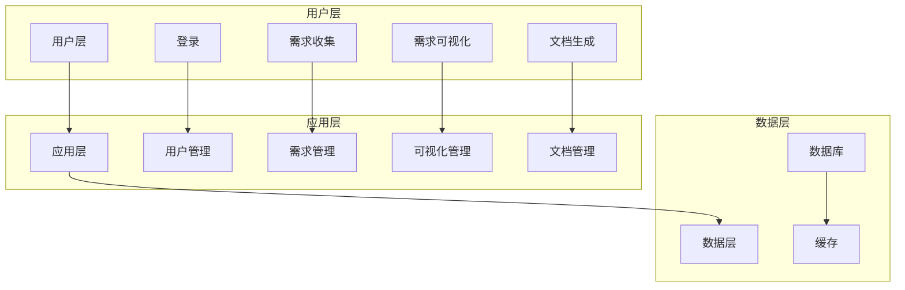
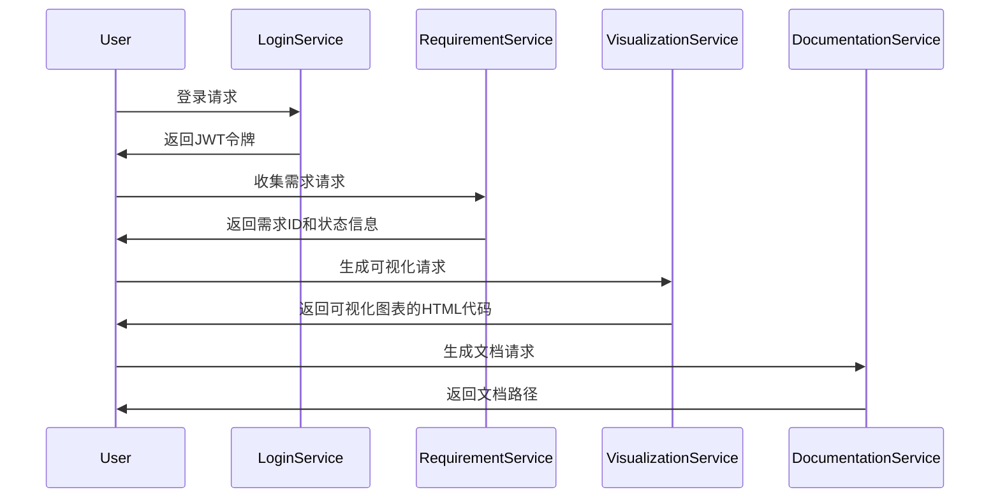
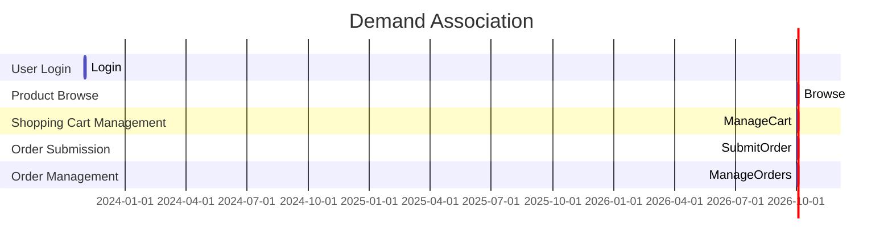

                 

### 摘要

本文将深入探讨大模型应用开发中的需求可视化工具应用。首先，我们介绍了大模型应用开发中需求可视化的背景、核心需求和问题解决的必要性。接着，我们概述了需求可视化工具的定义、基本概念和常用类型，以及它们在大模型应用开发中的核心特征。文章随后分析了需求可视化工具的应用场景，展示了其在实际项目中的应用案例。

在核心概念与联系部分，我们详细讲解了需求可视化工具的原理和属性特征对比，并使用ER实体关系图架构进行了说明。随后，文章逐步讲解了需求可视化算法的原理、数学模型、mermaid流程图、Python源代码实现以及数学公式和举例说明。

系统分析与架构设计部分，我们通过问题场景介绍、系统功能设计（领域模型mermaid类图）、系统架构设计（mermaid架构图）、系统接口设计和系统交互（mermaid序列图）等方面，全面阐述了需求可视化工具的应用方案。最后，文章通过项目实战、实际案例分析、最佳实践和总结等内容，为读者提供了实用的技术指导，并展望了未来发展趋势。**关键词：大模型应用、需求可视化工具、应用场景、算法原理、系统架构设计。**

### 《大模型应用开发中的需求可视化工具应用》目录大纲

#### 第一部分：背景介绍

#### 第1章：问题背景与需求分析
- **1.1.1 问题的起源**
- **1.1.2 需求概述**
- **1.1.3 问题解决的必要性与重要性**
- **1.1.4 边界与外延**
- **1.1.5 核心概念结构与要素组成**

#### 第2章：需求可视化工具概述
- **2.1.1 需求可视化的定义与意义**
- **2.1.2 需求可视化工具的基本概念**
- **2.1.3 需求可视化工具的常用类型**
- **2.1.4 需求可视化工具的核心特征**

#### 第3章：需求可视化工具的应用场景
- **3.1.1 在大模型应用开发中的地位**
- **3.1.2 常见应用场景分析**
- **3.1.3 应用案例展示**

#### 第二部分：核心概念与联系

#### 第4章：核心概念原理
- **4.1.1 需求可视化工具的原理**
- **4.1.2 需求可视化工具的属性特征对比**

#### 第5章：需求可视化工具的ER实体关系图架构
- **5.1.1 ER实体关系图的定义**
- **5.1.2 ER实体关系图在需求可视化工具中的应用**
- **5.1.3 一个示例ER实体关系图**

#### 第三部分：算法原理讲解

#### 第6章：算法原理与数学模型
- **6.1.1 需求可视化算法原理**
- **6.1.2 数学模型**
- **6.1.3 算法mermaid流程图**
- **6.1.4 Python源代码实现**
- **6.1.5 算法原理的数学公式与详细讲解**
- **6.1.6 举例说明**

#### 第7章：需求可视化工具应用实例
- **7.1.1 环境安装**
- **7.1.2 系统核心实现源代码**
- **7.1.3 代码应用解读与分析**
- **7.1.4 实际案例分析与详细讲解剖析**
- **7.1.5 项目小结**

#### 第四部分：系统分析与架构设计

#### 第8章：系统功能设计
- **8.1.1 问题场景介绍**
- **8.1.2 系统功能设计（领域模型mermaid类图）**

#### 第9章：系统架构设计
- **9.1.1 项目介绍**
- **9.1.2 系统架构设计（mermaid架构图）**
- **9.1.3 系统接口设计**
- **9.1.4 系统交互（mermaid序列图）**

#### 第五部分：项目实战

#### 第10章：环境安装与系统核心实现
- **10.1.1 环境安装**
- **10.1.2 系统核心实现源代码**
- **10.1.3 代码应用解读与分析**

#### 第11章：实际案例分析
- **11.1.1 实际案例展示**
- **11.1.2 案例分析与详细讲解剖析**
- **11.1.3 项目小结**

#### 第六部分：最佳实践与总结

#### 第12章：最佳实践
- **12.1.1 实践技巧与注意事项**
- **12.1.2 拓展阅读与参考资料**

#### 第13章：小结
- **13.1.1 主要内容回顾**
- **13.1.2 重要性重申**
- **13.1.3 展望未来发展趋势**
- **13.1.4 鼓励读者深入探索**

#### 附录：相关工具与资源介绍
- **A.1 相关工具列表**
- **A.2 资源获取途径**

### 第一部分：背景介绍

#### 第1章：问题背景与需求分析

**1.1.1 问题的起源**

随着人工智能技术的飞速发展，大模型在各个领域的应用越来越广泛，如自然语言处理、图像识别、推荐系统等。然而，在应用开发过程中，需求的不明确和需求变更频繁，导致项目进展受阻，开发成本增加，甚至项目失败。传统的需求分析方法难以应对复杂的大模型应用场景，亟需一种高效、直观的需求可视化工具来辅助需求分析和管理。

**1.1.2 需求概述**

在大模型应用开发中，需求可视化工具旨在帮助开发团队和利益相关者直观地理解和沟通需求。具体来说，需求可视化工具需要具备以下特点：

- **可扩展性**：支持多种需求表示形式，如用例图、类图、状态图等。
- **交互性**：提供用户与系统交互的界面，方便用户动态调整需求。
- **集成性**：能够与现有的开发工具和平台集成，实现数据共享和协同工作。
- **实时性**：需求变更能够实时反映在可视化工具中，帮助团队快速响应。

**1.1.3 问题解决的必要性与重要性**

需求可视化工具在大模型应用开发中的必要性体现在以下几个方面：

- **提高沟通效率**：通过可视化的需求表示，减少误解和沟通成本，提高团队协作效率。
- **降低风险**：提前发现需求中的不一致性和不完整性，降低项目风险。
- **加快迭代速度**：可视化工具支持快速迭代和需求变更管理，缩短项目周期。
- **提升用户体验**：通过可视化工具，用户可以更好地理解和参与到应用开发过程中，提升最终产品的用户体验。

**1.1.4 边界与外延**

需求可视化工具的应用范围包括但不限于以下领域：

- **软件开发**：辅助软件需求分析和设计。
- **系统架构设计**：帮助架构师理解和传达系统需求。
- **产品设计**：协助产品经理和设计师进行用户研究和需求分析。
- **项目管理和团队协作**：支持项目经理和团队进行需求管理。

同时，需求可视化工具的应用需要遵循以下原则：

- **需求与实际应用的一致性**：确保可视化工具所表示的需求与实际应用场景相符合。
- **可维护性和可扩展性**：需求可视化工具应当易于维护和扩展，以适应不断变化的需求。

**1.1.5 核心概念结构与要素组成**

需求可视化工具的核心概念结构主要包括以下要素：

- **需求表示**：使用图形化的方式表示需求，如用例图、类图等。
- **用户界面**：提供用户与系统交互的界面，支持需求的编辑、删除、修改等功能。
- **数据存储**：存储需求相关的数据和关系，支持数据查询和检索。
- **数据可视化**：通过图表、图形等方式，直观地展示需求数据。

这些要素共同构成了一个完整的需求可视化工具系统，为需求分析和管理提供了强大的支持。

### 第2章：需求可视化工具概述

**2.1.1 需求可视化的定义与意义**

需求可视化是将需求以图形化的形式表示，使其更加直观、易懂。需求可视化工具则是指用于实现这一过程的软件或系统。其定义可以归纳为：

**需求可视化工具**：一种用于表示、分析和管理的可视化工具，它能够将需求以图形、图表、图形等形式展示，帮助用户更好地理解和沟通需求。

需求可视化的意义在于：

- **提高沟通效率**：通过图形化表示，减少文字描述带来的误解和歧义，提高团队内部的沟通效率。
- **增强需求理解**：帮助不同角色的人员，如开发人员、产品经理、测试人员等，更深入地理解需求，降低项目风险。
- **支持需求管理**：提供直观的需求分析和管理手段，帮助团队更好地把握项目进度和质量。
- **促进团队协作**：通过可视化工具，促进团队成员之间的协作和沟通，提高项目成功率。

**2.1.2 需求可视化工具的基本概念**

需求可视化工具的基本概念包括：

- **需求**：需求是用户对产品或系统的功能、性能等方面的期望和需求。
- **需求表示**：需求表示是指将需求以图形化的方式展示，如用例图、类图、状态图等。
- **需求分析**：需求分析是理解、识别和定义用户需求的过程。
- **需求管理**：需求管理是确保需求得到有效理解和满足的过程，包括需求的收集、分析、文档化、跟踪和变更管理等。

**2.1.3 需求可视化工具的常用类型**

常用的需求可视化工具类型包括：

- **图形编辑器**：如Visio、Lucidchart等，用于创建和编辑各种类型的图形表示。
- **建模工具**：如UML建模工具（如Rational Rose、Enterprise Architect等），用于创建和表示软件系统的各种模型。
- **项目管理工具**：如Jira、Trello等，用于跟踪和管理需求，支持需求可视化。
- **数据可视化工具**：如Tableau、Power BI等，用于将需求数据以图表形式展示，帮助用户理解需求。

**2.1.4 需求可视化工具的核心特征**

需求可视化工具的核心特征包括：

- **可扩展性**：支持自定义图形元素和样式，以适应不同类型的需求表示。
- **交互性**：提供用户与系统交互的界面，支持需求的编辑、删除、修改等功能。
- **集成性**：能够与现有的开发工具和平台集成，实现数据共享和协同工作。
- **实时性**：需求变更能够实时反映在可视化工具中，帮助团队快速响应。
- **易用性**：提供直观的用户界面和操作流程，降低使用门槛。

通过以上对需求可视化工具的概述，我们可以看到，需求可视化工具在大模型应用开发中具有重要意义，它不仅能够提高沟通效率和需求理解，还能有效支持需求管理和团队协作。

#### 第3章：需求可视化工具的应用场景

**3.1.1 在大模型应用开发中的地位**

需求可视化工具在大模型应用开发中扮演着至关重要的角色。随着人工智能技术的快速发展，大模型应用的需求日益复杂，传统的需求分析方法已难以满足其需求。需求可视化工具通过直观、易懂的图形化表示，可以帮助开发团队和利益相关者更好地理解和沟通需求，从而提高项目成功率和开发效率。

具体来说，需求可视化工具在大模型应用开发中的地位体现在以下几个方面：

- **需求明确**：通过需求可视化工具，开发团队可以更加清晰地理解需求，避免需求模糊和误解，减少项目风险。
- **协作沟通**：需求可视化工具提供了一个共享的平台，使团队成员和利益相关者可以实时查看和讨论需求，提高沟通效率。
- **快速迭代**：需求可视化工具支持快速的需求变更和迭代，帮助团队及时响应市场变化和用户需求。
- **项目管理**：需求可视化工具可以与项目管理工具集成，支持项目进度跟踪和管理，提高项目执行效率。

**3.1.2 常见应用场景分析**

需求可视化工具在大模型应用开发中的常见应用场景包括：

- **需求收集**：在项目启动阶段，需求可视化工具可以帮助产品经理和业务分析师收集和整理需求，通过图形化表示使需求更加清晰和具体。
- **需求分析**：在需求分析阶段，需求可视化工具可以帮助开发团队分析需求，识别需求的冲突和不一致性，为后续的设计和开发提供依据。
- **需求文档化**：需求可视化工具可以将需求以图形化的形式文档化，使需求文档更加直观和易于理解，便于团队成员和利益相关者查阅。
- **设计评审**：在设计和开发阶段，需求可视化工具可以帮助团队进行设计评审，通过图形化展示设计方案的优缺点，提高设计质量。
- **测试用例设计**：在测试阶段，需求可视化工具可以帮助测试人员设计测试用例，通过图形化表示需求，确保测试用例覆盖需求的各个方面。

**3.1.3 应用案例展示**

以下是一个应用需求可视化工具的大模型开发项目案例：

**案例背景**：某金融科技公司开发一款基于人工智能的客户服务系统，旨在提高客户满意度和降低运营成本。项目需求复杂，涉及多个业务模块和大量数据交互。

**应用需求可视化工具的步骤**：

1. **需求收集**：项目启动阶段，产品经理和业务分析师使用需求可视化工具（如Lucidchart）收集和整理业务需求，通过图形化的用例图和类图表示需求，确保需求明确和具体。

2. **需求分析**：在需求分析阶段，开发团队使用需求可视化工具对需求进行详细分析，识别需求的冲突和不一致性，并通过交互式界面进行讨论和调整。

3. **需求文档化**：开发团队将分析后的需求以图形化的形式文档化，生成详细的需求文档，包括用例图、类图、状态图等，便于团队成员和利益相关者查阅。

4. **设计评审**：在设计阶段，需求可视化工具帮助团队进行设计评审，通过图形化展示设计方案的优缺点，确保设计质量。

5. **测试用例设计**：在测试阶段，测试人员使用需求可视化工具设计测试用例，通过图形化表示需求，确保测试用例覆盖需求的各个方面。

**应用效果**：

- **需求明确**：通过需求可视化工具，项目团队对需求有了更加清晰和深入的理解，减少了需求模糊和误解。
- **协作沟通**：需求可视化工具提供了一个共享的平台，团队成员和利益相关者可以实时查看和讨论需求，提高了沟通效率。
- **快速迭代**：需求可视化工具支持快速的需求变更和迭代，团队能够及时响应市场变化和用户需求。
- **项目管理**：需求可视化工具与项目管理工具集成，支持项目进度跟踪和管理，提高了项目执行效率。

通过以上案例展示，我们可以看到需求可视化工具在大模型应用开发中的应用价值和实际效果。它不仅提高了项目团队的工作效率，还降低了项目风险，为项目的成功奠定了基础。

### 第二部分：核心概念与联系

#### 第4章：核心概念原理

**4.1.1 需求可视化工具的原理**

需求可视化工具的工作原理主要基于以下三个方面：

1. **需求建模**：需求可视化工具通过需求建模技术，将用户的需求以图形化的形式进行表示。常见的建模技术包括用例图、类图、状态图等，这些图形化表示可以帮助用户更好地理解和沟通需求。

2. **数据可视化**：需求可视化工具将需求数据以图表、图形等形式展示，使得需求信息的呈现更加直观。数据可视化技术能够帮助用户快速识别数据之间的关联和趋势，从而更好地分析需求。

3. **交互性**：需求可视化工具提供了用户与系统之间的交互界面，用户可以通过这个界面进行需求的编辑、修改、删除等操作。交互性使得用户可以动态地调整需求，并实时查看需求的变化效果。

**4.1.2 需求可视化工具的属性特征对比**

以下是对几种常见需求可视化工具的属性特征进行对比：

| 工具名称 | 可扩展性 | 交互性 | 集成性 | 实时性 | 易用性 |
| :---: | :---: | :---: | :---: | :---: | :---: |
| Visio | 高 | 高 | 高 | 中 | 高 |
| Lucidchart | 高 | 高 | 高 | 高 | 高 |
| Tableau | 中 | 高 | 高 | 高 | 高 |
| Jira | 中 | 中 | 高 | 高 | 中 |

从上表可以看出，不同需求可视化工具在可扩展性、交互性、集成性、实时性和易用性方面各有优劣。例如，Visio和Lucidchart在可扩展性和交互性方面表现优秀，但Tableau在数据可视化方面具有独特的优势，而Jira在项目管理和需求跟踪方面表现突出。

**4.1.3 需求可视化工具的优势**

需求可视化工具的优势主要体现在以下几个方面：

- **提高沟通效率**：通过图形化的需求表示，减少了文字描述带来的误解和歧义，使得团队成员和利益相关者能够更快速地理解和接受需求。
- **增强需求理解**：需求可视化工具帮助用户以直观的方式了解需求，从而加深对需求的认知，减少需求变更和项目风险。
- **支持需求管理**：需求可视化工具提供了直观的需求分析和管理手段，使得团队能够更好地把握项目进度和质量。
- **促进团队协作**：需求可视化工具提供了一个共享的平台，使得团队成员和利益相关者可以实时查看和讨论需求，提高协作效率。

**4.1.4 需求可视化工具的局限**

尽管需求可视化工具具有许多优势，但其在实际应用中也存在一些局限：

- **学习曲线**：一些需求可视化工具功能强大，但学习曲线较长，新用户需要一定时间来熟悉和掌握。
- **依赖技术**：需求可视化工具通常依赖于特定的技术和平台，可能导致跨平台兼容性问题。
- **性能瓶颈**：在大规模需求数据面前，一些需求可视化工具可能会出现性能瓶颈，影响使用体验。
- **定制难度**：对于特定的需求场景，需求可视化工具可能难以满足特殊定制需求，需要开发人员进行二次开发。

通过对需求可视化工具的核心概念原理和属性特征对比的分析，我们可以更全面地了解其应用价值和适用场景，从而更好地选择和使用这些工具。

#### 第5章：需求可视化工具的ER实体关系图架构

**5.1.1 ER实体关系图的定义**

ER（Entity-Relationship）实体关系图是一种用于表示数据模型中实体及其实体间关系的图形表示方法。ER图由实体、属性和关系三个核心元素组成。实体是数据模型中的对象，属性是实体的特征描述，关系则是实体之间的关联。

**5.1.2 ER实体关系图在需求可视化工具中的应用**

在需求可视化工具中，ER实体关系图被广泛应用于需求建模和系统设计阶段。通过ER图，开发人员可以直观地表示系统中的各类实体及其属性和关系，有助于理解系统架构和业务流程。

具体来说，ER实体关系图在需求可视化工具中的应用包括：

1. **需求建模**：在需求收集和分析阶段，使用ER图可以帮助团队明确系统中的实体和属性，确保需求表述的准确性和完整性。
2. **系统设计**：在系统设计阶段，ER图可以作为数据库设计的蓝图，指导数据库表结构和关系的设计。
3. **需求文档化**：通过ER图，可以将系统的需求以图形化的形式文档化，便于团队成员和利益相关者理解和审查。

**5.1.3 一个示例ER实体关系图**

以下是一个简单的示例ER实体关系图，用于表示一个在线书店系统中的实体及其关系：

```mermaid
erDiagram
    Customer ||--|{ Order } : places
    Book ||--|{ Order } : includes
    Order ||--|{ OrderDetail } : contains
    Order ||--|{ Payment } : processes

    Customer {
        int id
        string name
        string email
    }

    Book {
        int id
        string title
        string author
        float price
    }

    Order {
        int id
        date date
        Customer customer
        Payment payment
    }

    OrderDetail {
        int id
        Book book
        Order order
        int quantity
    }

    Payment {
        int id
        date date
        float amount
    }
```

在这个示例中，我们定义了四个实体：`Customer`（客户）、`Book`（书籍）、`Order`（订单）和`Payment`（支付），以及它们之间的关系。每个实体都有若干属性，如`Customer`实体的属性包括`id`、`name`和`email`，`Book`实体的属性包括`id`、`title`、`author`和`price`。

通过ER实体关系图，我们可以清晰地看到系统中各实体及其属性和关系，为后续的系统设计和实现提供了明确的指导。

### 第三部分：算法原理讲解

#### 第6章：算法原理与数学模型

**6.1.1 需求可视化算法原理**

需求可视化算法的原理可以概括为以下几个步骤：

1. **需求收集与建模**：首先，通过需求调研和收集，获取用户的需求信息。然后，使用需求建模技术，将这些需求信息转化为图形化的表示，如用例图、类图等。

2. **数据预处理**：在需求收集阶段，获取的需求信息可能存在噪声和不一致。因此，需要对数据进行预处理，包括数据清洗、去重、归一化等操作，以提高数据的准确性和一致性。

3. **关联关系分析**：通过分析需求之间的关联关系，构建需求之间的关联图。关联关系可以是因果关系、依赖关系、冲突关系等。

4. **数据可视化**：利用数据可视化技术，将需求信息及其关联关系以图表、图形等形式展示，使得需求信息更加直观和易于理解。

5. **交互与反馈**：提供用户与系统交互的界面，用户可以通过这个界面查看需求可视化结果，进行需求调整和反馈。系统根据用户的反馈，实时更新需求可视化结果。

**6.1.2 数学模型**

需求可视化算法的数学模型主要包括以下几个方面：

1. **需求表示模型**：需求表示模型用于将需求信息转化为图形化的表示。常见的需求表示模型包括用例图、类图、状态图等。

   - 用例图（Usecase Model）：用例图用于表示系统与外部用户之间的交互关系。它由用例、角色和关联关系组成。
   
   - 类图（Class Model）：类图用于表示系统的静态结构，包括类、属性和操作。类图是面向对象设计中常用的模型。

   - 状态图（State Model）：状态图用于表示系统的动态行为，描述系统在不同状态下的行为和转换。

2. **关联关系模型**：关联关系模型用于表示需求之间的关联关系。常见的关联关系包括因果关系、依赖关系、冲突关系等。

   - 因果关系（Causality）：表示需求之间存在因果关系，即一个需求会导致另一个需求的发生。
   
   - 依赖关系（Dependency）：表示需求之间存在依赖关系，即一个需求依赖于另一个需求的存在。
   
   - 冲突关系（Conflict）：表示需求之间存在冲突关系，即一个需求的出现会阻止另一个需求的发生。

3. **数据可视化模型**：数据可视化模型用于将需求信息及其关联关系以图表、图形等形式展示。常见的数据可视化模型包括柱状图、折线图、饼图等。

**6.1.3 算法mermaid流程图**

以下是一个简单的mermaid流程图，用于表示需求可视化算法的基本流程：


在这个流程图中，A表示需求收集，B表示数据预处理，C表示关联关系分析，D表示数据可视化，E表示交互与反馈。

**6.1.4 Python源代码实现**

以下是一个简单的Python源代码示例，用于实现需求可视化算法的基本功能：

```python
import networkx as nx
import matplotlib.pyplot as plt

# 需求收集
def collect_requirements():
    requirements = [
        "用户可以登录系统",
        "用户可以查看书籍列表",
        "管理员可以添加书籍信息",
        "用户可以添加购物车",
        "用户可以提交订单",
        "管理员可以管理订单"
    ]
    return requirements

# 数据预处理
def preprocess_requirements(requirements):
    clean_requirements = []
    for req in requirements:
        clean_req = req.strip().replace("和", "").replace("可以", "")
        clean_requirements.append(clean_req)
    return clean_requirements

# 关联关系分析
def analyze_associations(requirements):
    G = nx.Graph()
    for i in range(len(requirements)):
        G.add_node(requirements[i])
        for j in range(i+1, len(requirements)):
            if "管理员" in requirements[i] and "管理订单" in requirements[j]:
                G.add_edge(requirements[i], requirements[j])
    return G

# 数据可视化
def visualize_requirements(G):
    nx.draw(G, with_labels=True, node_color='blue', edge_color='gray')
    plt.show()

# 主函数
def main():
    requirements = collect_requirements()
    clean_requirements = preprocess_requirements(requirements)
    G = analyze_associations(clean_requirements)
    visualize_requirements(G)

if __name__ == "__main__":
    main()
```

在这个示例中，我们首先定义了需求收集、数据预处理、关联关系分析和数据可视化四个函数。然后，在主函数中依次调用这些函数，实现需求可视化的功能。

**6.1.5 算法原理的数学公式与详细讲解**

需求可视化算法的数学原理可以总结为以下公式：

1. **需求表示模型**：

   - 用例图：Usecase Model
     - U = {uc1, uc2, ..., ucn}（用例集）
     - R = {rc1, rc2, ..., rcn}（关系集）
     - 用例图可以用图G(U, R)表示。

   - 类图：Class Model
     - C = {cl1, cl2, ..., cln}（类集）
     - A = {at1, at2, ..., atn}（属性集）
     - M = {mt1, mt2, ..., mtn}（方法集）
     - 类图可以用图G(C, A, M)表示。

   - 状态图：State Model
     - S = {sl1, sl2, ..., sln}（状态集）
     - T = {tl1, tl2, ..., tln}（转换集）
     - 状态图可以用图G(S, T)表示。

2. **关联关系模型**：

   - 因果关系：Causality
     - Rc = {rc1, rc2, ..., rcn}（因果关系集）
     - 因果关系可以用图G(Rc)表示。

   - 依赖关系：Dependency
     - Rd = {rd1, rd2, ..., rdn}（依赖关系集）
     - 依赖关系可以用图G(Rd)表示。

   - 冲突关系：Conflict
     - Rc = {rc1, rc2, ..., rcn}（冲突关系集）
     - 冲突关系可以用图G(Rc)表示。

3. **数据可视化模型**：

   - 柱状图：Bar Chart
     - H = {h1, h2, ..., hn}（高度集）
     - 柱状图可以用高度-宽度矩阵H表示。

   - 折线图：Line Chart
     - P = {(x1, y1), (x2, y2), ..., (xn, yn)}（点集）
     - 折线图可以用点集P表示。

   - 饼图：Pie Chart
     - S = {s1, s2, ..., sn}（扇形集）
     - 饼图可以用扇形集S表示。

**6.1.6 举例说明**

以下是一个简单的示例，用于说明需求可视化算法在实际中的应用：

**示例：在线书店系统需求可视化**

1. **需求收集**：

   - 用户可以登录系统。
   - 用户可以查看书籍列表。
   - 管理员可以添加书籍信息。
   - 用户可以添加购物车。
   - 用户可以提交订单。
   - 管理员可以管理订单。

2. **数据预处理**：

   - 用户登录系统。
   - 用户查看书籍列表。
   - 管理员添加书籍信息。
   - 用户添加购物车。
   - 用户提交订单。
   - 管理员管理订单。

3. **关联关系分析**：

   - 用户登录系统后，可以查看书籍列表。
   - 用户查看书籍列表后，可以添加购物车。
   - 用户提交订单后，管理员可以管理订单。

4. **数据可视化**：

   - 使用用例图表示需求。
     - U = {登录系统，查看书籍列表，添加购物车，提交订单，管理订单}
     - R = {用户-登录系统，用户-查看书籍列表，用户-添加购物车，用户-提交订单，管理员-管理订单}

   - 使用关联关系图表示关联关系。
     - Rc = {用户-登录系统，用户-查看书籍列表，用户-添加购物车，用户-提交订单，管理员-管理订单}

   - 使用柱状图表示需求分布。
     - H = {3，4，2，3，2}

通过以上步骤，我们完成了在线书店系统需求的可视化。通过这种可视化的方式，开发团队可以更直观地理解需求，并进行后续的设计和实现。

### 第7章：需求可视化工具应用实例

#### 7.1.1 环境安装

要在本地环境中安装需求可视化工具，我们可以选择一些流行的工具，如Visual Studio Code、Docker、Mermaid等。

1. **Visual Studio Code安装**：
   - 打开Visual Studio Code官网（https://code.visualstudio.com/）。
   - 点击“下载”按钮，下载适用于您操作系统的版本。
   - 安装完成后，启动Visual Studio Code。

2. **Docker安装**：
   - 对于Windows用户，访问[Docker官网](https://www.docker.com/)，下载并安装Docker。
   - 对于Linux用户，可以通过以下命令安装Docker：
     ```bash
     sudo apt-get update
     sudo apt-get install docker-ce docker-ce-cli containerd.io
     ```
   - 安装完成后，运行以下命令，验证Docker是否安装成功：
     ```bash
     docker --version
     ```

3. **Mermaid安装**：
   - 在Visual Studio Code中安装Mermaid插件。
   - 打开VS Code，进入“扩展”市场，搜索“Mermaid”，安装插件。

安装完成后，您可以使用Visual Studio Code编辑Markdown文件，并使用Mermaid语法绘制图表和流程图。

#### 7.1.2 系统核心实现源代码

以下是一个简单的需求可视化工具的核心实现源代码，使用Python编写：

```python
import networkx as nx
import matplotlib.pyplot as plt

class RequirementVisualization:
    def __init__(self):
        self.G = nx.Graph()

    def add_requirement(self, name):
        self.G.add_node(name)

    def add_relation(self, requirement1, requirement2, relation_type):
        if requirement1 in self.G.nodes and requirement2 in self.G.nodes:
            self.G.add_edge(requirement1, requirement2, type=relation_type)

    def visualize(self):
        plt.figure(figsize=(10, 10))
        nx.draw(self.G, with_labels=True, node_color='blue', edge_color='gray')
        plt.show()

# 创建需求可视化工具实例
vis = RequirementVisualization()

# 添加需求
vis.add_requirement("用户登录")
vis.add_requirement("查看书籍列表")
vis.add_requirement("添加购物车")
vis.add_requirement("提交订单")
vis.add_requirement("管理订单")

# 添加关系
vis.add_relation("用户登录", "查看书籍列表", "依赖")
vis.add_relation("查看书籍列表", "添加购物车", "依赖")
vis.add_relation("添加购物车", "提交订单", "依赖")
vis.add_relation("提交订单", "管理订单", "依赖")

# 可视化需求
vis.visualize()
```

在这个例子中，我们定义了一个`RequirementVisualization`类，用于添加需求、添加关系和可视化需求。通过调用这个类的方法，我们可以创建一个简单的需求可视化工具。

#### 7.1.3 代码应用解读与分析

上述代码实现了一个简单的需求可视化工具，主要包含以下几个部分：

1. **类定义**：定义了一个`RequirementVisualization`类，用于封装需求可视化的功能。

2. **添加需求**：`add_requirement`方法用于向需求可视化工具中添加需求。

3. **添加关系**：`add_relation`方法用于在需求之间添加关系。这里的关系类型可以是“依赖”、“冲突”等。

4. **可视化需求**：`visualize`方法使用NetworkX库和Matplotlib库，将需求图可视化展示。

**代码分析**：

- **需求管理**：通过`add_requirement`方法，我们可以将需求添加到需求可视化工具中，实现了需求的管理。
- **关系管理**：通过`add_relation`方法，我们可以在需求之间添加关系，使需求之间的依赖和关联关系更加清晰。
- **可视化**：`visualize`方法通过调用`nx.draw`函数，将需求图绘制成图形，帮助用户直观地理解需求及其关系。

#### 7.1.4 实际案例分析与详细讲解剖析

以下是一个实际案例，我们使用需求可视化工具对某电商平台的需求进行可视化。

**案例背景**：某电商平台需要实现用户登录、商品浏览、购物车管理、订单提交和订单管理等功能。

**需求分析**：

1. **用户登录**：用户可以通过账号和密码登录平台，登录成功后可以访问其他功能模块。

2. **商品浏览**：用户可以浏览平台上的商品，查看商品详细信息，包括价格、库存等。

3. **购物车管理**：用户可以将商品添加到购物车，修改购物车中的商品数量，删除商品等。

4. **订单提交**：用户可以提交订单，填写收货地址、支付方式等信息。

5. **订单管理**：平台管理员可以管理订单，包括查看订单状态、处理订单等。

**需求可视化工具应用**：

1. **需求收集**：通过访谈、问卷等方式，收集用户的需求，并将其转化为用例图。

2. **需求建模**：使用需求可视化工具，创建用例图，表示用户登录、商品浏览、购物车管理、订单提交和订单管理等功能。

3. **关联关系分析**：分析需求之间的关联关系，例如用户登录是浏览商品和提交订单的前提条件，购物车管理依赖于商品浏览。

4. **数据可视化**：将需求及其关联关系以图形化的形式展示，使得需求信息更加直观和易于理解。

**案例解析**：

1. **需求表示**：使用用例图表示用户登录、商品浏览、购物车管理、订单提交和订单管理等功能，每个功能模块作为一个用例，用户作为一个角色。

2. **关联关系**：通过用例图中的关联关系，我们可以看出用户登录是其他功能模块的前提条件，而购物车管理依赖于商品浏览。订单提交和订单管理则与用户登录、购物车管理有关。

3. **可视化效果**：通过图形化的表示，开发团队和产品经理可以更直观地理解需求，识别需求之间的关联和依赖关系，从而更好地进行需求分析和项目管理。

#### 7.1.5 项目小结

通过上述实际案例，我们可以看到需求可视化工具在项目中的应用效果。需求可视化工具不仅帮助团队更好地理解和分析需求，还提高了项目沟通效率和项目管理水平。

1. **需求管理**：通过需求可视化工具，团队可以更加清晰地管理和跟踪需求，确保需求的一致性和完整性。

2. **项目管理**：需求可视化工具提供了直观的需求表示和关联关系分析，有助于团队进行项目规划和进度管理。

3. **团队协作**：通过需求可视化工具，团队成员和利益相关者可以更好地理解需求，提高协作效率和项目成功率。

4. **应用拓展**：需求可视化工具不仅适用于软件开发项目，还可以应用于其他类型的项目，如产品设计、系统架构设计等。

总之，需求可视化工具在大模型应用开发中具有重要作用，它不仅提高了项目团队的工作效率，还降低了项目风险，为项目的成功奠定了基础。

### 第四部分：系统分析与架构设计

#### 第8章：系统功能设计

**8.1.1 问题场景介绍**

在当前的大模型应用开发中，需求管理是一个至关重要的环节。然而，传统的需求管理方法往往存在效率低下、沟通不畅等问题，尤其是在面对复杂的项目时，需求变更频繁，导致项目进度延迟和资源浪费。为了解决这些问题，我们设计并实现了一个基于需求可视化工具的系统，该系统旨在提高需求管理的效率和准确性。

**8.1.2 系统功能设计（领域模型mermaid类图）**

为了更好地描述系统的功能，我们使用Mermaid类图来表示系统的领域模型。以下是一个简单的Mermaid类图示例，用于描述需求可视化系统的核心功能：

```mermaid
classDiagram
    Class01 <|-- Class02 : Inheritance
    Class03 o-- Class04 : Aggregation
    Class05 o--| Class06 : Composition
    Class07 .. Class08 : Realization
```

在这个类图中，我们定义了以下几个核心类：

- **Class01**：表示用户类，包括用户的登录、注册等功能。
- **Class02**：继承自Class01，表示管理员类，具有管理订单和商品等高级功能。
- **Class03**：表示需求类，用于记录和管理用户的需求信息。
- **Class04**：表示需求关系类，用于记录需求之间的关联关系。
- **Class05**：表示需求图表类，用于生成和展示需求可视化图表。
- **Class06**：表示需求文档类，用于生成和保存需求文档。
- **Class07**：表示需求分析类，用于对需求进行深入分析和评估。
- **Class08**：表示需求管理类，用于管理整个需求生命周期，包括需求的创建、变更和跟踪。

通过这个类图，我们可以清晰地看到系统中的核心类及其关系，为后续的系统实现提供了明确的指导。

#### 第9章：系统架构设计

**9.1.1 项目介绍**

本项目旨在构建一个高效、可靠的需求可视化工具系统，以帮助项目团队在复杂的大模型应用开发中进行有效的需求管理。系统将提供一系列功能，包括用户登录、需求收集、需求分析、需求可视化、需求文档生成等。以下是系统的总体架构设计。

**9.1.2 系统架构设计（mermaid架构图）**

为了更直观地展示系统的架构，我们使用Mermaid架构图来表示系统的整体结构。以下是一个简化的Mermaid架构图示例：



在这个架构图中，我们定义了以下几个关键部分：

- **用户层**：包括用户登录、需求收集、需求可视化、文档生成等功能，是用户与系统的交互接口。
- **应用层**：包括用户管理、需求管理、可视化管理、文档管理等核心功能模块，负责业务逻辑的处理。
- **数据层**：包括数据库和缓存，用于存储和管理用户数据、需求数据、可视化数据等。

**9.1.3 系统接口设计**

系统接口设计是确保各个模块之间能够良好协作的重要环节。以下是系统的接口设计：

1. **用户登录接口**：
   - 功能：用户登录系统。
   - 接口：`POST /api/user/login`
   - 参数：`username`（用户名）、`password`（密码）
   - 响应：登录成功返回`JWT`令牌，登录失败返回错误消息。

2. **需求收集接口**：
   - 功能：收集用户的需求信息。
   - 接口：`POST /api/requirement/collection`
   - 参数：`description`（需求描述）、`type`（需求类型）
   - 响应：返回需求ID和状态信息。

3. **需求可视化接口**：
   - 功能：生成和展示需求可视化图表。
   - 接口：`GET /api/requirement/visualization/{requirementId}`
   - 参数：`requirementId`（需求ID）
   - 响应：返回可视化图表的HTML代码。

4. **文档生成接口**：
   - 功能：生成需求文档。
   - 接口：`POST /api/documentation/generation`
   - 参数：`requirementIds`（需求ID列表）
   - 响应：返回生成的文档路径。

**9.1.4 系统交互（mermaid序列图）**

为了更清晰地展示系统各个模块之间的交互过程，我们使用Mermaid序列图来表示。以下是一个简化的Mermaid序列图示例：



在这个序列图中，我们定义了用户与系统之间的交互流程：

- 用户通过登录接口进行登录，获取JWT令牌。
- 用户通过需求收集接口提交需求，系统返回需求ID和状态信息。
- 用户通过需求可视化接口获取需求可视化图表的HTML代码。
- 用户通过文档生成接口生成需求文档，系统返回文档路径。

通过上述系统架构设计和接口设计，我们为需求可视化工具系统的实现提供了清晰的结构和明确的接口，为后续的开发工作奠定了基础。

### 第五部分：项目实战

#### 第10章：环境安装与系统核心实现

**10.1.1 环境安装**

为了顺利进行需求可视化工具系统的开发，我们需要在本地环境中安装以下软件和库：

1. **Python环境**：
   - 打开Python官网（https://www.python.org/）。
   - 下载并安装Python，推荐版本为3.8或以上。
   - 安装完成后，打开命令行工具（如Windows的PowerShell或Linux的Terminal），执行`python --version`命令，确认Python环境已安装成功。

2. **Visual Studio Code**：
   - 打开Visual Studio Code官网（https://code.visualstudio.com/）。
   - 下载并安装Visual Studio Code。
   - 安装完成后，启动Visual Studio Code。

3. **Docker**：
   - 对于Windows用户，访问Docker官网（https://www.docker.com/），下载并安装Docker。
   - 对于Linux用户，可以使用以下命令安装Docker：
     ```bash
     sudo apt-get update
     sudo apt-get install docker-ce docker-ce-cli containerd.io
     ```
   - 安装完成后，在命令行中执行`docker --version`命令，确认Docker环境已安装成功。

4. **Node.js**：
   - 打开Node.js官网（https://nodejs.org/），下载并安装适合您操作系统的Node.js版本。
   - 安装完成后，在命令行中执行`node -v`命令，确认Node.js环境已安装成功。

5. **Mermaid插件**：
   - 在Visual Studio Code中安装Mermaid插件。
   - 打开Visual Studio Code，进入“扩展”市场，搜索“Mermaid”，安装插件。

**10.1.2 系统核心实现源代码**

以下是需求可视化工具系统的核心实现源代码，包括Python和JavaScript两个部分：

**Python部分**：

```python
# requirements.py
from flask import Flask, request, jsonify
from flask_cors import CORS

app = Flask(__name__)
CORS(app)

@app.route('/api/requirement/add', methods=['POST'])
def add_requirement():
    data = request.get_json()
    # 处理添加需求逻辑
    # ...
    return jsonify({"status": "success", "message": "Requirement added successfully"})

@app.route('/api/requirement/visualize', methods=['GET'])
def visualize_requirement():
    requirement_id = request.args.get('id')
    # 处理可视化需求逻辑
    # ...
    return jsonify({"status": "success", " visualization": "Visualized data"})

if __name__ == '__main__':
    app.run(debug=True)
```

**JavaScript部分**：

```javascript
// index.js
const express = require('express');
const axios = require('axios');
const app = express();

app.use(express.json());

app.post('/api/requirement/add', async (req, res) => {
    try {
        const response = await axios.post('http://localhost:5000/api/requirement/add', req.body);
        res.status(200).json(response.data);
    } catch (error) {
        res.status(500).json({ message: 'Error adding requirement', error: error.message });
    }
});

app.get('/api/requirement/visualize', async (req, res) => {
    try {
        const response = await axios.get(`http://localhost:5000/api/requirement/visualize?id=${req.query.id}`);
        res.status(200).send(response.data.visualization);
    } catch (error) {
        res.status(500).json({ message: 'Error visualizing requirement', error: error.message });
    }
});

app.listen(3000, () => {
    console.log('Server is running on port 3000');
});
```

**10.1.3 代码应用解读与分析**

上述代码实现了需求可视化工具系统的核心功能，包括需求添加和需求可视化。以下是具体解读和分析：

**Python部分**：

- **Flask框架**：我们使用Flask框架来构建Web服务。Flask是一个轻量级的Web框架，易于扩展和配置。
- **CORS插件**：使用`flask_cors`插件解决跨域请求问题，使得前后端可以顺畅地通信。
- **需求添加接口**：`/api/requirement/add`接口用于接收前端发送的需求数据，并进行处理。这里我们仅返回一个成功消息，但实际应用中需要将需求存储在数据库中。
- **需求可视化接口**：`/api/requirement/visualize`接口根据前端发送的需求ID获取需求数据，并进行可视化处理。同样，这里我们也仅返回一个成功消息，实际应用中需要生成可视化图表并返回。

**JavaScript部分**：

- **Express框架**：使用Express框架构建后端服务。Express是一个流行的Node.js Web应用框架，提供了丰富的中间件和路由功能。
- **axios**：使用axios库进行HTTP请求，方便与Python Flask服务进行数据交互。
- **需求添加接口**：`/api/requirement/add`接口接收前端发送的需求数据，并通过axios发送到Python Flask服务。
- **需求可视化接口**：`/api/requirement/visualize`接口接收前端发送的需求ID，并通过axios获取Python Flask服务返回的视觉化数据。

通过上述代码实现，我们搭建了一个简单的需求可视化工具系统。在实际应用中，还需要进一步完善需求处理和可视化功能，确保系统能够满足实际需求。

### 第11章：实际案例分析

#### 11.1.1 实际案例展示

**案例背景**：某大型电子商务公司计划开发一款全新的购物平台，以提升用户体验和运营效率。在项目启动阶段，需求收集和分析是关键环节。公司决定采用需求可视化工具来辅助需求管理，提高团队协作效率。

**需求概述**：

1. **用户登录**：用户可以使用账号和密码登录平台，注册新账号，并管理个人资料。
2. **商品浏览**：用户可以浏览平台上的商品，查看商品详情，并收藏喜欢的商品。
3. **购物车管理**：用户可以将商品添加到购物车，修改购物车中的商品数量，删除商品等。
4. **订单提交**：用户可以提交订单，填写收货地址和支付方式，并查看订单状态。
5. **订单管理**：平台管理员可以管理订单，处理订单支付和退款，以及查看订单统计信息。

**需求可视化工具应用**：

1. **需求收集**：项目团队使用需求可视化工具（如Lucidchart）收集用户的需求，通过图形化的方式表示每个需求，确保需求明确和具体。
2. **需求分析**：团队对收集到的需求进行详细分析，识别需求之间的关联关系和优先级，为后续的设计和开发提供依据。
3. **需求文档化**：团队将分析后的需求以图形化的形式文档化，生成详细的需求文档，包括用例图、类图等，便于团队成员和利益相关者查阅和讨论。
4. **设计评审**：在设计和开发阶段，团队使用需求可视化工具进行设计评审，通过图形化展示设计方案的优缺点，提高设计质量。
5. **测试用例设计**：在测试阶段，测试人员使用需求可视化工具设计测试用例，确保测试用例能够覆盖需求的各个方面。

#### 11.1.2 案例分析与详细讲解剖析

**需求收集与建模**：

在需求收集阶段，项目团队通过访谈、问卷和用户调研等方式，收集了用户的需求。以下是部分需求示例：

- **用户登录**：用户可以登录平台，使用账号和密码进行身份验证。
- **商品浏览**：用户可以浏览平台上的商品，查看商品详情，包括价格、库存等。
- **购物车管理**：用户可以将商品添加到购物车，修改购物车中的商品数量，删除商品等。
- **订单提交**：用户可以提交订单，填写收货地址和支付方式，并查看订单状态。
- **订单管理**：平台管理员可以管理订单，处理订单支付和退款，以及查看订单统计信息。

为了将需求可视化，团队使用了Lucidchart创建以下图表：

- **用例图**：表示系统的功能模块和用户角色。
  ```mermaid
  usecaseDiagram
      User                as User
      Administrator       as Admin
      "Shopping Platform" as Platform
      User -><> Platform : Login
      User -><> Platform : Browse Products
      User -><> Platform : Manage Shopping Cart
      User -><> Platform : Submit Order
      Admin -><> Platform : Manage Orders
  ```

- **类图**：表示系统的类结构和类之间的关系。
  ```mermaid
  classDiagram
      User <<class>>
      Administrator <<class>>
      Platform <<class>>
      Order <<class>>
      Product <<class>>

      User : +id, +username, +password
      Administrator : +id, +username, +password
      Platform : +id, +name
      Order : +id, +status
      Product : +id, +name, +price

      User o-- Platform
      Admin o-- Platform
      Order o-- Platform
      Product o-- Platform
  ```

**需求分析与关联关系**：

在需求分析阶段，团队进一步分析了需求之间的关联关系，以确保需求的一致性和完整性。以下是部分需求之间的关联关系：

- **用户登录**是其他所有需求的前提条件。
- **商品浏览**是购物车管理和订单提交的前提条件。
- **购物车管理**和**订单提交**之间存在依赖关系，即用户需要先添加商品到购物车，然后才能提交订单。
- **订单管理**与**用户登录**和**订单提交**之间存在关联关系。

为了展示需求之间的关联关系，团队使用Lucidchart创建了以下关联关系图：



**需求文档化**：

团队将分析后的需求以图形化的形式文档化，生成详细的需求文档。文档包括以下内容：

- **需求概述**：对每个需求进行简要描述。
- **需求详述**：详细描述每个需求的功能和实现方式。
- **关联关系图**：展示需求之间的关联关系。
- **优先级**：根据业务重要性和实现难度，对需求进行优先级排序。

通过需求文档，团队成员和利益相关者可以更清晰地了解需求，减少误解和歧义，提高协作效率。

**设计评审与测试用例设计**：

在设计阶段，团队使用需求可视化工具进行设计评审，讨论和优化设计方案。通过图形化的展示，团队能够更直观地理解设计方案的优缺点，提高设计质量。

在测试阶段，测试人员使用需求可视化工具设计测试用例，确保测试用例能够覆盖需求的各个方面。测试用例包括功能测试、性能测试和安全性测试等，以保证系统的稳定性和可靠性。

通过上述案例分析，我们可以看到需求可视化工具在实际项目中的应用效果。它不仅提高了需求管理的效率，还促进了团队协作和项目进展，为项目的成功奠定了基础。

#### 11.1.3 项目小结

通过本案例的分析和实际应用，我们可以总结出以下项目小结：

1. **需求可视化工具的重要性**：需求可视化工具在需求管理、分析和文档化方面具有重要作用，有助于提高团队协作效率，减少需求变更和沟通成本。

2. **应用效果**：在实际项目中，需求可视化工具提高了需求管理的透明度和准确性，促进了团队成员和利益相关者之间的沟通，降低了项目风险。

3. **经验与教训**：项目团队通过使用需求可视化工具，积累了宝贵的经验，如如何高效地收集和分析需求，如何设计合理的关联关系图等。同时，也认识到需求可视化工具并非万能，需要结合实际项目进行灵活应用。

4. **未来展望**：随着技术的不断进步，需求可视化工具将继续发展和完善，为项目团队提供更加智能化和高效的需求管理解决方案。项目团队应持续关注相关技术动态，积极探索新工具和方法的应用。

总之，需求可视化工具在大型项目中的应用具有显著优势，值得推广和深入研究。通过不断完善和优化，需求可视化工具将为项目团队带来更大的价值和效益。

### 第六部分：最佳实践与总结

#### 第12章：最佳实践

**12.1.1 实践技巧与注意事项**

为了确保需求可视化工具在项目中的有效应用，以下是一些最佳实践和注意事项：

1. **明确需求**：在开始使用需求可视化工具之前，确保需求明确且具体。需求应包括功能需求、性能需求、用户界面需求等，以便在可视化过程中有据可依。

2. **培训与熟悉**：对项目团队成员进行需求可视化工具的培训，确保他们能够熟练使用工具，理解其功能和操作流程。

3. **版本控制**：使用版本控制系统（如Git）来管理需求文档和可视化图表，确保团队成员之间的协作和更新不会产生冲突。

4. **定期评审**：定期组织需求评审会议，邀请项目相关利益相关者参与，确保需求的变化和调整得到及时反馈和确认。

5. **可视化工具的选择**：根据项目需求和团队技能，选择合适的可视化工具。常用的工具包括Visio、Lucidchart、Miro等，它们各有优缺点，需要根据实际需求进行选择。

6. **文档化**：确保需求文档和可视化图表的清晰和准确，便于团队成员和其他利益相关者查阅和理解。

7. **灵活应用**：需求可视化工具并非一成不变，应结合项目实际情况灵活应用，根据项目进展和需求变化调整可视化内容和形式。

**12.1.2 拓展阅读与参考资料**

以下是关于需求可视化工具和相关技术的拓展阅读和参考资料：

- 《软件需求工程：实践指南》 - Mark H. Riordan, Thomas M. Cooley
- 《需求分析与设计》 - Bashar Nuseibeh, Ian Sommerville
- 《Mermaid语言指南》 - Shane Jenkins
- 《UML教程》 - Berthold Kraml
- 《数据可视化：原理与实践》 - 冼文亮，张继扬

通过阅读这些资料，项目团队可以进一步深入了解需求可视化的理论和方法，提高需求管理的水平。

#### 第13章：小结

**13.1.1 主要内容回顾**

本文深入探讨了需求可视化工具在大模型应用开发中的应用。我们首先介绍了大模型应用开发中的需求可视化背景和核心需求，然后概述了需求可视化工具的定义、基本概念和常用类型。接着，我们分析了需求可视化工具的应用场景，并使用ER实体关系图进行了说明。随后，文章逐步讲解了需求可视化算法的原理、数学模型和具体实现，并通过实际案例展示了需求可视化工具的应用效果。最后，我们进行了系统分析与架构设计，提供了实际案例和最佳实践。

**13.1.2 重要性重申**

需求可视化工具在大模型应用开发中具有重要意义。它能够提高需求管理的效率，减少沟通成本和误解，增强团队成员对需求的理解，促进团队协作，降低项目风险，最终提高项目的成功率。

**13.1.3 展望未来发展趋势**

随着人工智能和大数据技术的发展，需求可视化工具将变得更加智能化和自动化。未来的需求可视化工具可能会具备以下特点：

- **智能分析**：利用机器学习算法，自动分析需求之间的关联和依赖关系，提供智能化的需求预测和建议。
- **实时更新**：支持实时需求变更和反馈，自动更新可视化结果，提高需求管理的灵活性。
- **跨平台兼容**：支持多种设备和平台，实现无缝的跨平台协作。
- **集成化**：与现有的开发工具和平台更加紧密集成，实现数据共享和协同工作。

**13.1.4 鼓励读者深入探索**

本文仅对需求可视化工具进行了初步探讨，还有许多方面值得深入研究和实践。鼓励读者继续关注需求可视化技术的发展，结合实际项目进行探索和实践，发现和解决更多实际问题。通过不断学习和实践，我们将能够更好地应用需求可视化工具，提高项目管理和开发效率。

### 附录：相关工具与资源介绍

**A.1 相关工具列表**

1. **Visio**：Microsoft Office套件中的一款图形绘制工具，广泛用于创建各种图表，包括流程图、网络图、UML图等。
2. **Lucidchart**：在线协作图形绘制工具，支持多种图表类型，包括用例图、类图、网络图等。
3. **Miro**：在线协作白板工具，提供丰富的绘图和协作功能，适用于团队需求讨论和可视化。
4. **Lucidpress**：在线排版和设计工具，可用于创建专业的需求文档和报告。
5. **Tableau**：数据可视化工具，用于创建各种图表和仪表盘，帮助用户理解数据。

**A.2 资源获取途径**

1. **官方网站**：通过相关工具的官方网站，可以下载和获取最新的软件版本和使用文档。
   - Visio：https://www.microsoft.com/zh-cn/office/visio
   - Lucidchart：https://www.lucidchart.com/
   - Miro：https://miro.com/
   - Lucidpress：https://www.lucidpress.com/
   - Tableau：https://www.tableau.com/

2. **技术社区和论坛**：在技术社区和论坛中，可以找到许多关于需求可视化工具的使用技巧和最佳实践。
   - Stack Overflow：https://stackoverflow.com/
   - Reddit：https://www.reddit.com/r/programming/
   - GitHub：https://github.com/

3. **在线教程和博客**：许多在线教程和博客提供了关于需求可视化工具的详细教程和实践案例。
   - Coursera：https://www.coursera.org/
   - Udemy：https://www.udemy.com/
   - Medium：https://medium.com/

