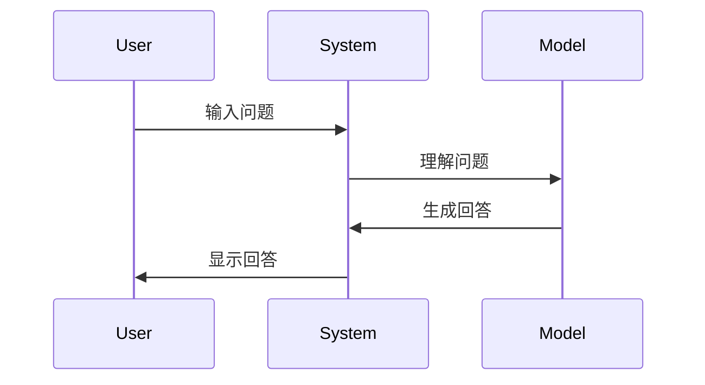

                 

**文章标题：大模型应用开发中的需求文档化最佳实践**

**关键词：** 大模型，需求文档化，最佳实践，应用开发，技术博客

**摘要：** 本文将深入探讨大模型应用开发中的需求文档化过程，分析其重要性，介绍最佳实践，并提供详细的案例分析，以帮助读者掌握高效的文档化方法。

----------------------------------------------------------------

## 引言

大模型，即大型的人工智能模型，如Transformer、BERT等，以其强大的数据处理和分析能力，正迅速改变着各行各业的面貌。然而，随着模型规模的不断扩大，如何有效地管理和应用这些模型成为了一个重要的课题。需求文档化作为大模型应用开发的重要环节，不仅能够帮助团队明确项目目标，还能确保开发过程的顺利进行。

### 背景介绍

#### 大模型的概念

大模型是指具有数百万甚至数十亿参数的人工智能模型，它们能够通过深度学习技术从大量数据中自动提取特征和规律。这些模型在图像识别、自然语言处理、推荐系统等领域表现出了卓越的能力。

#### 需求文档化的意义

需求文档化是将项目需求明确化、结构化、文档化的过程。它有助于以下方面：

- **明确项目目标**：需求文档详细记录了项目的目标、功能和约束，有助于项目团队达成共识。
- **保障项目顺利进行**：需求文档作为开发过程中的重要参考，能够帮助团队成员理解和遵循项目需求，减少误解和错误。
- **促进沟通协作**：需求文档为项目团队提供了一个统一的沟通平台，有助于团队成员之间的信息共享和协作。

#### 需求文档化的基本原则

- **全面性**：需求文档应涵盖项目的所有方面，包括功能需求、非功能需求和约束条件。
- **准确性**：需求文档中的信息应准确无误，避免产生歧义和误解。
- **可理解性**：需求文档应以通俗易懂的语言编写，确保所有团队成员都能理解。
- **一致性**：需求文档应在整个项目生命周期中保持一致性，避免需求变更导致文档更新不及时。

----------------------------------------------------------------

## 第一部分：背景与基础理论

### 第1章：大模型与需求文档化概述

在本文的第一部分，我们将首先回顾大模型的基本概念，并探讨需求文档化在大模型应用开发中的重要性。我们将介绍大模型的发展历程，分析其关键特性，并讨论需求文档化的必要性及其对项目成功的关键作用。

#### 1.1 大模型的基本概念

大模型是指具有数百万甚至数十亿参数的人工智能模型，它们能够通过深度学习技术从大量数据中自动提取特征和规律。这些模型在图像识别、自然语言处理、推荐系统等领域表现出了卓越的能力。

大模型的发展历程可以分为以下几个阶段：

- **早期模型**：以人工特征提取为基础，如SVM、KNN等。
- **深度学习兴起**：以AlexNet为代表的深度神经网络模型在图像识别任务中取得了突破性成果。
- **大模型时代**：以Transformer、BERT等为代表的模型，具有数十亿参数，能够处理大规模数据，极大地提高了AI应用的效果。

#### 1.2 大模型的关键特性

大模型具有以下几个关键特性：

- **大规模**：大模型具有数十亿个参数，能够处理大规模数据，这是其强大性能的基础。
- **自适应性**：大模型通过学习大量数据，能够自动提取特征，具有很强的泛化能力。
- **高效性**：大模型采用了高效的前向传播和反向传播算法，能够快速训练和推断。

#### 1.3 需求文档化的必要性

需求文档化是将项目需求明确化、结构化、文档化的过程。在大模型应用开发中，需求文档化的重要性体现在以下几个方面：

- **明确项目目标**：需求文档详细记录了项目的目标、功能和约束，有助于项目团队达成共识。
- **保障项目顺利进行**：需求文档作为开发过程中的重要参考，能够帮助团队成员理解和遵循项目需求，减少误解和错误。
- **促进沟通协作**：需求文档为项目团队提供了一个统一的沟通平台，有助于团队成员之间的信息共享和协作。

#### 1.4 需求文档化对项目成功的关键作用

需求文档化对项目成功具有以下几个关键作用：

- **提高项目质量**：需求文档的详细记录和明确要求，有助于确保项目按照预期质量和时间完成。
- **降低项目风险**：需求文档的明确性和一致性，有助于减少项目变更和返工的风险。
- **促进知识共享**：需求文档为团队成员提供了一个知识共享的平台，有助于团队成员之间的知识传递和经验积累。

在下一章中，我们将进一步探讨需求文档化的基本原则和方法，帮助读者更好地理解和应用这一重要过程。

### 第2章：需求文档化的重要性及基本原则

在上一章中，我们回顾了大模型的基本概念和需求文档化的必要性。本章将深入探讨需求文档化的重要性及其基本原则，以帮助读者更好地理解和执行这一过程。

#### 2.1 需求文档化的重要性

需求文档化的重要性可以从以下几个方面进行阐述：

- **明确项目目标**：需求文档详细记录了项目的目标、功能和约束，有助于项目团队达成共识。通过明确的目标，团队成员能够更好地理解项目的方向和期望成果。
- **保障项目顺利进行**：需求文档作为开发过程中的重要参考，能够帮助团队成员理解和遵循项目需求，减少误解和错误。它提供了一个统一的基准，确保项目按计划进行。
- **促进沟通协作**：需求文档为项目团队提供了一个统一的沟通平台，有助于团队成员之间的信息共享和协作。它能够减少沟通成本，提高团队的协同效率。
- **提高项目质量**：需求文档的详细记录和明确要求，有助于确保项目按照预期质量和时间完成。它能够帮助团队识别潜在的风险和问题，提前采取相应的措施。
- **降低项目风险**：需求文档的明确性和一致性，有助于减少项目变更和返工的风险。通过尽早识别和解决需求冲突，团队能够更好地控制项目风险。

#### 2.2 需求文档化的基本原则

需求文档化需要遵循以下几个基本原则，以确保其有效性和可靠性：

- **全面性**：需求文档应涵盖项目的所有方面，包括功能需求、非功能需求和约束条件。它应提供一个完整的视角，使团队成员能够全面了解项目需求。
- **准确性**：需求文档中的信息应准确无误，避免产生歧义和误解。准确的需求文档能够减少错误和返工，提高项目的成功概率。
- **可理解性**：需求文档应以通俗易懂的语言编写，确保所有团队成员都能理解。它应避免使用过于技术化或复杂的术语，以便更广泛的受众能够理解。
- **一致性**：需求文档应在整个项目生命周期中保持一致性，避免需求变更导致文档更新不及时。一致的需求文档有助于团队成员保持对项目的正确理解。
- **可维护性**：需求文档应易于维护和更新，以适应项目需求的变化。它应具有良好的组织结构和清晰的格式，使团队成员能够快速找到所需的信息。
- **灵活性**：需求文档应具有一定的灵活性，以适应项目需求的变化。虽然需求文档需要保持一定的稳定性，但过于僵化的文档可能导致项目无法应对外部环境的变化。

#### 2.3 需求文档化的最佳实践

为了确保需求文档化的有效性，以下是一些最佳实践：

- **定期审查和更新**：需求文档应定期审查和更新，以反映项目的最新需求和变化。这有助于确保需求文档的准确性和时效性。
- **团队合作**：需求文档的编写和审查应涉及多个团队成员，以确保需求的全面性和准确性。团队合作能够提供不同的视角和观点，有助于发现潜在的问题和改进点。
- **用户参与**：用户参与需求文档的编写和审查过程，能够确保需求文档能够真正满足用户的需求。用户反馈和需求验证有助于提高需求文档的质量。
- **使用工具**：使用专业的需求管理工具，能够提高需求文档的编写、审查和追踪效率。这些工具通常提供了丰富的功能和模板，有助于规范需求文档的格式和内容。
- **文档化流程**：建立一套完整的需求文档化流程，包括需求收集、分析、编写、审查和更新等步骤。规范的流程有助于确保需求文档的质量和一致性。

在下一章中，我们将进一步探讨大模型需求分析的方法论，帮助读者深入理解和应用需求文档化过程。

### 第3章：大模型需求分析方法论

在上一章中，我们讨论了需求文档化的重要性及其基本原则。本章将深入探讨大模型需求分析方法论，包括需求收集、需求分析和需求验证等关键步骤，以帮助读者全面掌握需求文档化的实践。

#### 3.1 需求收集

需求收集是需求文档化过程的起点，它涉及到识别和理解项目相关方的需求。以下是一些关键步骤和方法：

- **用户访谈**：通过与用户进行面对面访谈，深入了解他们的需求、期望和痛点。用户访谈能够提供第一手的用户需求信息，有助于制定更贴近用户需求的需求文档。
- **问卷调查**：通过设计有针对性的问卷，收集大量用户的需求信息。问卷调查能够快速获取大量数据，有助于发现普遍的需求和趋势。
- **焦点小组**：组织相关用户和利益相关者参加焦点小组会议，讨论项目的需求和目标。焦点小组能够促进多方参与和互动，有助于提出更全面和多样化的需求。
- **市场调研**：通过市场调研，了解当前市场上的需求和竞争情况。市场调研能够提供行业趋势和竞争对手的信息，有助于制定有竞争力的需求文档。

在需求收集过程中，应注意以下事项：

- **确保信息的全面性**：收集到的需求信息应涵盖项目的各个方面，包括功能需求、非功能需求和约束条件。
- **验证信息的准确性**：对收集到的需求信息进行验证，确保其准确无误。可以通过与用户再次确认或交叉验证的方法，提高需求信息的准确性。
- **记录和整理**：对收集到的需求信息进行记录和整理，形成初步的需求文档。这有助于后续的需求分析和验证。

#### 3.2 需求分析

需求分析是需求文档化过程的核心环节，它涉及到对收集到的需求信息进行整理、分类和优先级排序。以下是一些关键步骤和方法：

- **需求分类**：根据需求的功能、目标和使用场景，对需求进行分类。常见的分类方法包括功能需求、非功能需求、用户需求和系统需求等。
- **需求建模**：使用需求建模工具和方法，如用例图、用户故事和功能矩阵等，将需求进行可视化表示。需求建模有助于理解需求的整体结构和关系。
- **优先级排序**：根据需求的重要性和紧急性，对需求进行优先级排序。优先级排序有助于团队确定哪些需求应首先实现，以最大化项目价值。

在需求分析过程中，应注意以下事项：

- **确保需求的可测试性**：需求应具备可测试性，即能够通过测试验证其是否得到满足。这有助于确保需求文档的准确性和可靠性。
- **保持需求的灵活性**：在需求分析过程中，应考虑到项目需求的变化。灵活的需求文档能够适应未来的需求变更，提高项目的适应性。
- **验证需求的合理性**：对需求进行分析和验证，确保其合理性和可行性。可以通过与用户和利益相关者进行讨论和确认，提高需求文档的质量。

#### 3.3 需求验证

需求验证是需求文档化过程的最后一步，它涉及到对需求文档的完整性和准确性进行验证。以下是一些关键步骤和方法：

- **需求评审**：组织相关团队成员和利益相关者进行需求评审会议，讨论和审查需求文档。需求评审有助于发现潜在的问题和改进点，提高需求文档的质量。
- **需求测试**：通过设计测试用例，对需求文档进行测试。需求测试有助于验证需求的可测试性和准确性，发现潜在的需求错误和缺陷。
- **用户反馈**：与用户进行交流和反馈，了解他们对需求文档的认可程度和满意度。用户反馈有助于验证需求的用户友好性和实用性。

在需求验证过程中，应注意以下事项：

- **确保需求的完整性**：验证需求文档是否完整，确保所有需求都得到记录和包含。
- **确保需求的准确性**：验证需求文档是否准确，确保需求描述清晰明确，避免歧义和误解。
- **确保需求的可实现性**：验证需求文档是否可实现，确保需求具备技术实现的可能性。

通过以上需求收集、需求分析和需求验证三个关键步骤，我们可以确保大模型需求文档的全面性、准确性和可实现性，为后续的开发工作打下坚实的基础。

### 第4章：需求收集与需求分析

在上一章中，我们详细介绍了大模型需求分析方法论中的需求收集和需求分析。本章将进一步探讨这两个环节的具体实践，包括用户访谈、问卷调查、需求分类、建模和优先级排序等，并提供实际案例和技巧。

#### 4.1 用户访谈

用户访谈是需求收集的重要方法之一，通过与用户进行面对面的交流，可以深入了解他们的需求、期望和痛点。以下是一些用户访谈的技巧和注意事项：

- **准备充分**：在用户访谈前，提前准备访谈大纲和问题清单，确保访谈内容的全面性和逻辑性。
- **开放式问题**：使用开放式问题引导用户表达他们的观点和需求，例如“您认为我们可以在哪些方面改进系统？”
- **倾听和观察**：在访谈过程中，积极倾听用户的回答，并注意观察他们的非语言行为，如肢体语言和表情，这些往往能提供额外的信息。
- **记录和整理**：在访谈过程中，使用录音或笔记记录用户的需求和观点，并在访谈结束后进行整理和分类。
- **反馈和确认**：在访谈结束后，与用户进行反馈和确认，确保理解他们的需求和期望，并记录任何重要的细节。

**案例**：假设我们正在开发一个智能客服系统，通过用户访谈，我们了解到用户希望系统能够快速响应、提供准确的答案，并具备自然语言交互的能力。这些需求将被记录并作为后续开发的重要参考。

#### 4.2 问卷调查

问卷调查是一种高效的需求收集方法，可以通过互联网或纸质问卷收集大量用户的需求信息。以下是一些问卷调查的技巧和注意事项：

- **设计问卷**：设计简洁明了的问卷，确保每个问题都清晰、具体，并避免引起歧义。使用多种类型的问题，如单选题、多选题和开放性问题。
- **目标受众**：确保问卷的目标受众具有代表性，例如针对潜在用户、现有用户或特定用户群体。
- **样本量**：根据项目需求和预算，确定合适的样本量，以保证调查结果的可靠性和代表性。
- **数据分析**：在收集到问卷数据后，进行有效的数据分析，提取用户需求的关键信息和趋势。
- **隐私保护**：在问卷设计和数据分析过程中，保护用户的隐私和数据安全，确保数据的合法性和合规性。

**案例**：在开发一个在线教育平台时，我们通过问卷调查收集了用户对课程内容、学习工具和互动方式的需求。结果显示，用户希望系统能提供多样化的课程选择、互动式学习和个性化推荐功能。这些需求将指导平台的后续开发。

#### 4.3 需求分类

需求分类是将收集到的需求信息进行整理和分组的过程，有助于理解需求的整体结构和关系。以下是一些常见的需求分类方法：

- **按功能分类**：根据系统的功能模块，将需求分为不同的类别，如用户管理、课程管理、支付管理等。
- **按优先级分类**：根据需求的重要性和紧急性，将需求分为高优先级、中优先级和低优先级。
- **按来源分类**：根据需求来源的不同，如用户需求、市场调研、竞争对手分析等，对需求进行分类。
- **按实现难度分类**：根据需求实现的难度和资源需求，将需求分为不同的类别。

**案例**：在一个企业资源规划（ERP）系统的需求分类中，我们将需求分为核心功能需求和非核心功能需求。核心功能需求包括财务报表、供应链管理和人力资源管理等，这些需求是系统必须实现的基本功能。非核心功能需求包括市场分析工具、项目管理工具等，这些需求虽然重要，但可以暂时不考虑。

#### 4.4 需求建模

需求建模是将需求信息以图形化的方式表示出来，有助于团队成员理解和分析需求。以下是一些常见的需求建模方法：

- **用例图**：用例图是一种描述系统功能和用户交互的图形表示方法，它显示了系统的功能和用户角色之间的关系。
- **用户故事**：用户故事是一种简短的需求描述，通常包含用户角色、目标和场景，它有助于团队成员理解和优先级排序。
- **功能矩阵**：功能矩阵是一种表格形式的建模方法，用于比较不同需求之间的优先级、实现难度和资源需求。

**案例**：在开发一个电商平台的用例图中，我们定义了用户角色，如买家、卖家和管理员，并描述了他们的主要功能，如购买商品、发布商品和管理订单。这些用例图有助于团队明确系统的功能需求。

#### 4.5 优先级排序

优先级排序是需求分析的重要环节，它有助于确定哪些需求应首先实现，以最大化项目的价值。以下是一些常见的优先级排序方法：

- **Kano模型**：Kano模型根据用户满意度将需求分为基本需求、性能需求、魅力需求和无差异需求，分别赋予不同的优先级。
- **MoSCoW模型**：MoSCoW模型将需求分为必须要有（Must have）、应该有（Should have）、可以有（Could have）和不会有的（Won't have）四个类别，分别对应不同的优先级。
- **成本效益分析**：通过成本效益分析，评估每个需求的经济价值和实现成本，确定其优先级。

**案例**：在一个移动应用开发项目中，我们使用MoSCoW模型进行优先级排序。用户身份验证和支付功能被归类为“必须要有”，因为它们是应用的核心功能。而推送通知和数据分析功能被归类为“可以有”，可以在后续版本中实现。

通过以上需求收集和需求分析的具体实践，我们可以确保需求文档的全面性、准确性和可实现性，为后续的开发工作提供坚实的基础。

### 第5章：需求文档编写规范与技巧

在上一章中，我们探讨了需求收集和需求分析的方法和技巧。本章将重点讨论如何编写高质量的需求文档，包括文档结构、语言风格、注意事项和常见问题及解决方案。

#### 5.1 需求文档的结构

一个高质量的需求文档应该具备清晰的结构，以便团队成员能够快速理解和使用。以下是一个常见的需求文档结构：

- **封面**：包含文档名称、版本号、创建日期和创建人等信息。
- **目录**：列出文档中的各个章节和小节，方便团队成员查找和定位。
- **摘要**：简要概述文档的主要内容，帮助团队成员快速了解文档的核心要点。
- **引言**：介绍项目的背景、目标和需求文档的重要性。
- **功能需求**：详细描述系统的功能需求，包括用户界面、功能模块、业务流程等。
- **非功能需求**：描述系统性能、安全、可用性等方面的非功能需求。
- **约束条件**：列出实现需求所需遵循的约束条件，如技术限制、预算限制等。
- **接口需求**：描述系统与外部系统或组件的交互接口，包括接口规范、数据格式等。
- **用户故事**：使用用户故事的形式，描述用户在使用系统时的场景和需求。
- **用例图**：使用用例图表示用户与系统的交互流程，帮助团队成员理解系统的功能。
- **附件**：包含与需求相关的图表、数据、技术文档等附件。

#### 5.2 语言风格

在编写需求文档时，应遵循以下语言风格：

- **简洁明了**：使用简单、易懂的语言，避免使用过于专业或复杂的术语，以确保所有团队成员都能理解。
- **客观准确**：描述需求时，应保持客观和准确，避免使用主观判断或模糊的描述。
- **一致性**：在文档中保持术语和表达方式的一致性，避免产生歧义和误解。
- **规范性**：遵循一定的格式规范，如段落结构、字体大小和行间距等，以提高文档的可读性。

#### 5.3 注意事项

在编写需求文档时，应注意以下几点：

- **完整性和全面性**：确保需求文档涵盖了项目的所有方面，包括功能需求、非功能需求和约束条件，避免遗漏关键需求。
- **可测试性**：需求文档中的需求应具备可测试性，即能够通过测试验证其是否得到满足。
- **可维护性**：需求文档应具有良好的组织结构和清晰的格式，使团队成员能够快速找到所需的信息。
- **及时更新**：需求文档应定期审查和更新，以反映项目的最新需求和变化。

#### 5.4 常见问题及解决方案

在需求文档编写过程中，可能会遇到以下问题及解决方案：

- **需求冲突**：当多个需求相互矛盾时，应通过讨论和协商，确定优先级和解决方案。可以参考MoSCoW模型，将需求分为必须要有、应该有、可以有和不会有的类别。
- **需求变更**：需求变更在项目开发过程中是不可避免的。对于需求变更，应建立一套变更管理流程，包括变更申请、评审和实施等步骤，以确保变更的及时性和可控性。
- **需求不明确**：对于不明确的需求，应通过用户访谈、问卷调查和需求评审等方法，进一步澄清和确认需求。可以采用用户故事地图等工具，帮助团队成员更好地理解需求。

通过以上规范和技巧，我们可以编写出高质量的需求文档，为项目的成功实施提供有力支持。

### 第6章：大模型需求文档范例分析

在上一章中，我们讨论了需求文档编写的规范与技巧。本章将通过具体案例，分析大模型需求文档的编写过程，帮助读者更好地理解需求文档的撰写方法和要点。

#### 6.1 范例背景

假设我们正在开发一款基于Transformer的大型语言模型，用于智能客服系统。这款模型需要具备自然语言理解、对话生成和问题解决能力。我们的目标是编写一份详细的需求文档，确保开发团队能够准确理解项目需求，并顺利推进项目。

#### 6.2 功能需求

以下是该智能客服系统的部分功能需求：

- **自然语言理解**：模型需要能够理解用户的问题和意图，提取关键信息，为后续处理提供基础。
- **对话生成**：模型需要能够根据用户的问题和系统内部知识库，生成合理的回答，以实现自然、流畅的对话。
- **问题解决**：模型需要能够处理常见问题，提供解决方案，并在无法解决问题时，引导用户寻求进一步的帮助。

#### 6.3 非功能需求

以下是非功能需求的示例：

- **响应速度**：系统应能够在毫秒级内响应用户请求，提供快速响应。
- **准确性**：模型应具有较高的准确性，确保生成的回答能够准确解答用户的问题。
- **扩展性**：系统应具备良好的扩展性，能够根据业务需求，轻松地增加新的功能模块。

#### 6.4 约束条件

以下是实现需求所需遵循的约束条件：

- **硬件资源**：模型训练和推断需要大量计算资源，系统应具备高性能计算能力。
- **数据安全**：用户数据和模型数据需要严格保护，确保数据安全和隐私。
- **合规性**：系统需要符合相关法律法规，如数据保护法、隐私法等。

#### 6.5 用户故事

以下是部分用户故事的示例：

- **作为用户，我需要能够通过文字输入我的问题，以便获得智能客服的解答。**
- **作为用户，我希望客服系统能够理解我的问题，并提供准确的答案。**
- **作为用户，我需要能够在对话中切换话题，并得到相关的解答。**

#### 6.6 用例图

以下是智能客服系统的部分用例图：

#### 6.7 附件

以下是与需求相关的附件示例：

- **自然语言处理技术文档**：详细介绍自然语言处理的相关技术和算法。
- **数据集说明**：描述用于模型训练的数据集，包括数据来源、数据预处理方法等。

#### 6.8 分析与总结

通过以上案例，我们可以看到如何撰写一份详细的大模型需求文档。在编写需求文档时，需要注意以下几点：

- **明确功能需求**：详细描述系统的功能模块和业务流程，确保团队对系统的功能有清晰的认识。
- **关注非功能需求**：除了功能需求，还需要关注系统的性能、安全性和扩展性等方面，确保系统能够满足用户期望。
- **用户故事与用例图**：通过用户故事和用例图，进一步说明用户的使用场景和需求，有助于团队更好地理解需求。
- **约束条件和附件**：明确实现需求所需遵循的约束条件和相关技术文档，为开发工作提供支持。

通过以上方法和技巧，我们可以编写出高质量的需求文档，为项目的成功实施奠定基础。

### 第7章：大型项目需求文档化最佳实践

在上一章中，我们通过案例分析探讨了如何撰写高质量的大模型需求文档。本章将进一步深入，讨论大型项目需求文档化的最佳实践，包括需求评审、变更管理、文档版本控制等关键环节，并提供实际案例和经验总结。

#### 7.1 需求评审

需求评审是确保需求文档质量和一致性的重要环节。以下是一些关键步骤和最佳实践：

- **组织评审团队**：成立由项目经理、产品经理、开发人员、测试人员和技术专家组成的评审团队，确保评审的全面性和专业性。
- **制定评审计划**：明确评审的时间、地点、参与人员、评审流程和评审标准，确保评审工作的有序进行。
- **评审准备**：评审前，确保所有评审人员充分了解项目背景、需求和文档内容，准备好相关的评审材料。
- **评审会议**：在评审会议上，团队成员针对需求文档进行详细讨论和审查，提出修改意见和建议。
- **评审记录**：记录评审过程中的关键问题和意见，形成评审报告，为后续需求更新和确认提供依据。

**案例**：在一个大型金融项目开发中，团队组织了三轮需求评审会议。在第一轮评审中，发现了一些功能需求描述不清晰的问题，通过讨论和修改，使得需求文档更加准确和一致。在第二轮评审中，测试团队提出了性能和安全性方面的需求变更，经过评估和协商，团队决定调整部分非核心功能的需求优先级。

#### 7.2 变更管理

需求变更在大型项目开发过程中是不可避免的。有效的变更管理能够确保项目能够灵活应对需求变化，同时控制变更带来的风险。以下是一些变更管理的最佳实践：

- **变更申请**：任何需求变更都需要经过正式的申请流程。申请人需填写变更申请表，明确变更的原因、内容和影响。
- **变更评估**：评估变更的可行性、影响范围和成本，包括技术实现难度、项目进度和资源需求等方面。
- **变更审批**：根据评估结果，由项目经理或变更控制委员会审批变更。审批通过后，将变更纳入项目计划和需求文档。
- **变更实施**：在实施变更过程中，确保变更的跟踪和监控，避免对项目造成不必要的延迟和风险。
- **变更文档化**：将变更的过程、结果和影响记录下来，形成变更日志，便于后续的审计和跟踪。

**案例**：在一个电子商务项目开发中，由于市场需求的变动，团队需要增加一个购物车模块。经过评估和审批，团队决定将购物车功能作为紧急变更进行实施。通过变更管理流程，团队顺利完成了购物车模块的开发和测试，并在规定时间内上线。

#### 7.3 文档版本控制

在大型项目中，需求文档版本控制至关重要。以下是一些版本控制的最佳实践：

- **版本号管理**：为每个版本的需求文档分配唯一的版本号，如1.0、1.1、2.0等，方便团队成员识别和跟踪。
- **文档库管理**：使用专业的文档管理工具，如Git、Confluence等，存储和管理需求文档的各个版本，确保文档的安全和可追溯性。
- **变更记录**：在文档库中记录每次变更的时间、作者、内容和原因，便于团队成员了解文档的历史和变更情况。
- **文档更新**：定期审查和更新需求文档，确保其与项目的最新需求和变化保持一致。
- **版本发布**：在每次文档更新后，进行版本发布，通知相关团队成员更新文档，确保所有团队成员使用的是最新版本的需求文档。

**案例**：在一个跨部门的大型项目中，团队使用Git进行版本控制，为每个需求文档分配唯一的版本号，如需求文档-v1.0、需求文档-v1.1等。在每次需求变更后，团队都会在Git库中记录变更日志，并通知相关团队成员更新文档，确保项目各方使用的是最新版本的需求文档。

通过以上最佳实践，大型项目团队可以有效地管理需求文档，确保项目需求的清晰、一致和可控，为项目的成功实施提供有力支持。

### 第8章：跨部门协作中的需求文档化

在大型项目中，需求文档化不仅是开发团队的责任，也需要跨部门的协作。有效的跨部门需求文档化能够确保项目目标的达成，提高团队的协作效率。以下将探讨跨部门协作中的需求文档化方法、挑战及解决方案。

#### 8.1 跨部门协作的重要性

跨部门协作在大型项目中至关重要，因为它涉及到多个团队之间的紧密合作。需求文档化作为跨部门协作的核心环节，有助于以下方面：

- **统一目标**：通过需求文档化，各部门能够明确项目目标，确保团队协作的方向一致。
- **信息共享**：需求文档提供了一个信息共享的平台，各部门可以随时查看和更新需求，减少信息孤岛。
- **降低误解**：需求文档的明确性和一致性有助于降低各部门之间的误解和冲突。
- **提高效率**：通过需求文档化，可以提前识别和解决潜在问题，提高项目的推进效率。

#### 8.2 跨部门协作的需求文档化方法

为了确保跨部门协作的有效性，以下是一些需求文档化的方法：

- **用户故事地图**：通过用户故事地图，各部门可以共同讨论用户的需求和使用场景，确保需求的全面性和一致性。
- **需求评审会议**：定期组织跨部门的需求评审会议，邀请各相关部门的代表参与，确保需求文档的质量和准确性。
- **文档共享平台**：使用专业的文档共享平台，如Confluence或SharePoint，确保各部门能够随时访问和更新需求文档。
- **明确的角色和责任**：在需求文档中明确各相关部门的角色和责任，确保每个团队都知道自己的任务和目标。

#### 8.3 跨部门协作中的挑战

跨部门协作中的需求文档化面临以下挑战：

- **沟通障碍**：不同部门之间的沟通障碍可能导致需求理解不一致，影响项目进展。
- **利益冲突**：各部门可能会有不同的利益诉求，导致需求变更频繁，增加项目风险。
- **时间紧张**：大型项目往往时间紧张，跨部门协作需要高效的需求文档化，以确保项目按时完成。
- **信息孤岛**：各部门可能使用不同的工具和平台，导致信息孤岛，影响信息共享和协作。

#### 8.4 解决方案

针对以上挑战，以下是一些解决方案：

- **建立沟通机制**：定期召开跨部门沟通会议，建立有效的沟通机制，确保各部门之间的信息共享和协调。
- **利益协调**：建立利益协调机制，确保各部门的需求变更得到公平评估，避免利益冲突。
- **敏捷开发**：采用敏捷开发方法，灵活应对需求变更，确保项目能够在时间紧张的情况下完成。
- **统一平台**：使用统一的文档共享平台，如Confluence，确保所有团队成员能够实时访问和更新需求文档，减少信息孤岛。

**案例**：在一个跨部门的大型电商平台开发项目中，团队采用了用户故事地图和需求评审会议的方法。通过用户故事地图，团队共同讨论了用户的需求和使用场景，确保了需求的全面性和一致性。通过需求评审会议，团队及时发现和解决了各部门之间的沟通障碍和利益冲突，确保了项目的顺利推进。

通过以上方法，跨部门协作中的需求文档化能够提高项目的效率和质量，确保项目的成功实施。

### 第9章：需求变更管理策略

在大型项目中，需求变更不可避免，有效的需求变更管理策略能够确保项目能够灵活应对需求变化，同时控制变更带来的风险。本章将探讨需求变更管理的策略和方法，包括变更申请流程、评估与审批流程、变更实施与监控等。

#### 9.1 变更申请流程

需求变更的申请是变更管理的第一步，以下是一个典型的变更申请流程：

- **发起变更申请**：当项目团队认为有必要进行需求变更时，应填写变更申请表，明确变更的原因、内容、范围和预期影响。
- **评估变更需求**：项目经理或变更控制委员会（CCB）对变更申请进行初步评估，确定变更的紧急程度和影响范围。
- **征求相关方意见**：根据变更的内容和范围，征求相关方（如客户、产品经理、开发人员、测试人员等）的意见，确保变更的合理性和可行性。
- **形成变更方案**：根据评估和意见反馈，形成详细的变更方案，包括变更的实施步骤、资源需求和时间计划。

#### 9.2 评估与审批流程

需求变更的评估与审批是确保变更合理性和可控性的关键步骤，以下是一个典型的评估与审批流程：

- **评估变更需求**：项目经理或CCB对变更申请进行深入评估，包括变更对项目进度、成本、资源、质量等方面的影响。
- **制定变更方案**：根据评估结果，制定变更方案，包括变更的具体实施步骤、所需资源和时间计划。
- **审批变更方案**：将变更方案提交给CCB进行审批。CCB根据变更方案和项目整体计划，决定是否批准变更。
- **记录变更**：无论变更是否被批准，都需要在变更日志中记录变更的原因、内容、评估结果和审批过程，便于后续跟踪和管理。

#### 9.3 变更实施与监控

变更方案一旦被批准，进入实施阶段。以下是一些变更实施与监控的关键步骤：

- **实施变更**：根据变更方案，进行变更实施。确保变更实施过程中的每一步都有明确的记录和跟踪，避免遗漏。
- **监控变更实施**：在变更实施过程中，监控变更的实施进度和效果，及时发现和解决可能出现的问题。
- **验证变更效果**：在变更实施完成后，进行验证，确保变更达到了预期的效果，满足了需求变更的要求。
- **反馈与改进**：将变更实施的效果和反馈记录下来，为后续的项目管理和变更管理提供经验和改进建议。

#### 9.4 需求变更管理策略

为了有效管理需求变更，以下是一些需求变更管理的策略：

- **建立变更管理流程**：制定明确的变更管理流程，确保变更申请、评估、审批、实施和监控等各个环节都有章可循。
- **建立变更控制委员会**：成立变更控制委员会（CCB），负责评估和审批变更申请，确保变更的合理性和可控性。
- **明确变更责任人**：明确变更申请、评估、审批和实施的负责人，确保每个环节都有专人负责，提高变更管理的效率。
- **定期回顾和优化**：定期回顾变更管理的流程和策略，根据项目实际情况和反馈进行优化，提高变更管理的有效性。
- **培训与沟通**：对项目团队成员进行变更管理培训，提高他们的变更管理意识和能力。同时，加强项目团队的沟通和协作，减少因沟通不畅导致的变更风险。

通过以上策略和方法，项目团队可以有效地管理需求变更，确保项目能够灵活应对外部环境的变化，同时控制变更带来的风险，提高项目的成功率。

### 第10章：需求文档化工具介绍

在上一章中，我们探讨了需求变更管理的策略和方法。本章将介绍几种常用的需求文档化工具，包括传统的文档工具和现代的需求管理平台，帮助读者了解它们的特点和优势。

#### 10.1 传统文档工具

传统文档工具如Word、Excel和PowerPoint等，虽然在需求文档化中被广泛使用，但它们也有一定的局限性。以下是一些常见传统文档工具的特点：

- **Word**：Word是微软办公套件中的一部分，具有强大的文本编辑和排版功能，适合撰写详细的需求文档。Word支持丰富的格式和样式，便于编写和展示复杂的需求。
- **Excel**：Excel是一个功能强大的电子表格工具，适合用于需求分析中的数据整理和统计。通过Excel，可以方便地对需求进行分类、排序和筛选。
- **PowerPoint**：PowerPoint主要用于制作演示文稿，通过幻灯片的形式展示需求文档的概要和关键信息，便于项目团队的讨论和评审。

#### 10.2 现代需求管理平台

现代需求管理平台如JIRA、Confluence和Trello等，为需求文档化提供了更加灵活和高效的方式。以下是一些常见现代需求管理平台的特点：

- **JIRA**：JIRA是一个功能强大的项目管理工具，可以用于需求收集、需求分析和需求跟踪。JIRA支持灵活的需求模板和自定义字段，便于团队定制化需求文档。
- **Confluence**：Confluence是一个团队协作和知识管理平台，支持丰富的文档格式和协同编辑功能。通过Confluence，团队可以实时共享和更新需求文档，提高协作效率。
- **Trello**：Trello是一个基于看板（Kanban）的项目管理工具，通过可视化卡片和列表的形式，帮助团队管理需求文档和项目进度。

#### 10.3 选择合适的工具

选择合适的工具是需求文档化成功的关键。以下是一些选择工具的考虑因素：

- **团队需求**：根据团队的需求和习惯，选择适合的文档工具或需求管理平台。如果团队熟悉Office套件，可以考虑使用Word和Excel；如果团队注重协作和实时更新，可以选择使用JIRA、Confluence或Trello。
- **功能需求**：根据需求文档的具体要求，选择具备所需功能的工具。例如，如果需求文档需要详细的格式和排版，可以选择Word；如果需求文档需要与项目进度紧密关联，可以选择JIRA。
- **易用性**：选择易用性较高的工具，可以提高团队成员的使用效率和满意度。现代需求管理平台通常提供了直观的用户界面和简洁的操作流程，易于上手。
- **成本考虑**：根据团队的预算和资源，选择性价比高的工具。一些现代需求管理平台提供免费版本或免费试用，可以帮助团队在预算有限的情况下进行选择。

通过以上考虑因素，团队可以选出最适合的需求文档化工具，提高项目管理的效率和效果。

### 第11章：需求管理平台应用实践

在现代大型项目中，需求管理平台的应用大大提高了团队协作的效率和需求文档化的质量。本章将介绍如何在实际项目中应用需求管理平台，包括创建和管理需求、协作和沟通、版本控制和变更管理等具体实践。

#### 11.1 创建和管理需求

在使用需求管理平台时，首先需要创建和管理需求。以下是一些关键步骤：

- **需求收集**：在需求管理平台上创建需求卡片或用例，记录用户的需求、功能描述和优先级。可以使用平台提供的模板，快速创建标准化的需求文档。
- **需求分类**：根据需求的不同类型（如功能需求、非功能需求和约束条件），对需求进行分类和标签管理。这有助于团队更好地组织和查找需求。
- **需求优先级排序**：使用平台提供的优先级排序功能，将需求按照重要性和紧急性进行排序，确保团队首先处理关键需求。

**示例**：在JIRA中，可以创建一个“需求”类型的issue，填写需求名称、描述、优先级和标签。例如，创建一个名为“智能推荐功能”的需求，描述为“实现基于用户行为和偏好的智能推荐”，并标注为“高优先级”。

#### 11.2 协作和沟通

需求管理平台提供了多种协作和沟通工具，有助于团队高效协作：

- **实时编辑**：平台支持多人实时编辑需求文档，确保团队成员之间的信息共享和同步。例如，在Confluence中，多个团队成员可以同时编辑和评论需求文档。
- **讨论和评论**：在需求卡片或文档中添加讨论和评论，团队成员可以随时提出问题和建议，进行实时沟通。例如，在JIRA中，可以在需求issue中添加评论，与团队成员讨论需求细节。
- **通知和提醒**：平台提供通知和提醒功能，当需求状态发生变化或出现新的评论时，系统会自动通知相关人员。这有助于确保团队成员及时响应和跟进需求。

**示例**：在Trello中，团队可以在需求卡片中添加评论，并设置提醒，当某个需求的状态发生变化时，系统会自动发送通知给相关团队成员。

#### 11.3 版本控制

版本控制是需求管理的重要方面，确保需求文档的准确性和一致性。以下是一些关键步骤：

- **创建版本**：在每次需求更新后，创建新的版本，记录版本号和更新内容。例如，在Confluence中，每次编辑需求文档后，系统会自动生成一个新的版本。
- **历史记录**：平台提供历史记录功能，记录每个版本的详细信息，包括作者、修改时间和内容。这有助于团队追溯需求的变更历史，了解需求的演变过程。
- **版本对比**：平台支持版本对比功能，团队成员可以轻松查看不同版本之间的差异，确保需求的准确性和一致性。

**示例**：在JIRA中，可以在需求issue的历史记录中查看不同版本的详细信息，并使用版本对比功能，快速识别需求变更的具体内容。

#### 11.4 变更管理

有效的变更管理是确保项目顺利进行的关键。以下是一些变更管理的具体实践：

- **变更申请**：当项目团队认为有必要进行需求变更时，可以通过平台提交变更申请。申请中需要详细描述变更的原因、内容和预期影响。
- **评估和审批**：平台提供评估和审批功能，项目经理或变更控制委员会（CCB）可以在线评估变更申请，并审批变更方案。评估过程中，团队成员可以提供反馈和建议。
- **变更实施**：一旦变更方案被批准，团队可以在平台上实施变更，并记录变更的具体步骤和进度。平台支持跟踪和监控变更实施过程，确保变更按时完成。
- **变更记录**：平台自动记录变更的详细信息，包括申请、评估、审批和实施过程。这有助于团队了解变更的历史和效果，为后续的变更管理提供参考。

**示例**：在JIRA中，团队可以通过创建“变更请求”issue，提交变更申请。项目经理或CCB可以在平台上评估和审批变更，并跟踪变更的实施进度。

通过以上具体实践，需求管理平台能够有效支持需求文档化过程，提高团队的协作效率，确保项目的成功实施。

### 第12章：工具优化与效率提升

在现代大型项目中，需求文档化工具的选择和应用直接影响项目的效率和质量。本章将探讨如何通过优化工具配置、提高团队协作效率和改进工作流程，进一步提升需求文档化的效率。

#### 12.1 工具优化

工具优化是提高需求文档化效率的关键环节。以下是一些工具优化的策略：

- **定制化配置**：根据团队的具体需求，对需求管理平台进行定制化配置，包括字段设置、视图定制和工作流配置。例如，在JIRA中，可以自定义需求字段的显示顺序和筛选条件，提高需求的查询和筛选效率。
- **集成第三方工具**：通过集成第三方工具，如版本控制系统、代码库和自动化测试工具，实现需求与代码、测试等环节的无缝连接。这有助于团队在一个统一的平台上进行协作，提高整体效率。
- **自动化流程**：利用平台的自动化功能，如自动化通知、自动化审批和自动化报告，减少人工操作，提高工作效率。例如，在Confluence中，可以设置自动通知，当需求状态发生变化时，系统会自动通知相关人员。

**示例**：在一个软件开发项目中，团队将JIRA与Git集成，实现需求与代码版本控制的联动。每当需求状态发生变化，系统会自动更新Git仓库，确保代码与需求的一致性。

#### 12.2 提高团队协作效率

团队协作效率是需求文档化成功的重要因素。以下是一些提高团队协作效率的方法：

- **明确的角色和责任**：明确各团队成员的角色和责任，确保每个团队成员都清楚自己的任务和目标。这有助于减少任务交叉和责任模糊，提高团队协作效率。
- **实时沟通**：利用即时通讯工具、视频会议和协作平台，实现团队成员之间的实时沟通和协作。例如，使用Slack或Microsoft Teams进行日常沟通，使用Zoom或WebEx进行远程会议。
- **协作流程**：建立标准化的协作流程，包括需求收集、需求评审、需求实施和需求验收等环节。这有助于确保团队协作的一致性和高效性。

**示例**：在一个跨部门的项目中，团队使用Confluence作为协作平台，所有需求文档和讨论记录都在Confluence中进行管理。通过明确的协作流程，团队确保需求从收集到实施的每个环节都能高效推进。

#### 12.3 改进工作流程

改进工作流程是提升需求文档化效率的长期策略。以下是一些改进工作流程的方法：

- **持续改进**：建立持续改进机制，定期回顾和评估工作流程的有效性，发现和解决流程中的瓶颈和问题。例如，通过定期召开反思会议，团队可以共同讨论流程优化方案。
- **自动化流程**：利用自动化工具和脚本，减少手动操作，提高流程的自动化程度。例如，使用自动化工具来自动生成需求报告和变更日志，减少团队成员的重复工作。
- **培训和学习**：对团队成员进行工具和流程的培训，提高他们的技能和效率。例如，定期组织内部培训课程，分享最佳实践和经验。

**示例**：在一个大型IT项目中，团队通过引入自动化测试工具，实现需求验证的自动化。每当需求变更后，系统会自动运行测试用例，确保需求的正确性和一致性。

通过以上工具优化、团队协作效率提升和工作流程改进的方法，团队可以显著提高需求文档化的效率，确保项目的顺利进行和成功实施。

### 第13章：需求文档化实践中的问题与挑战

在需求文档化实践中，团队可能会面临各种问题与挑战。本章将讨论这些常见问题，包括需求变更频繁、需求不明确、需求冲突和沟通障碍等，并探讨相应的解决方案。

#### 13.1 需求变更频繁

**问题原因**：需求变更频繁通常是由于市场动态、用户反馈和项目目标变化等原因造成的。

**解决方案**：

- **引入变更管理流程**：建立完善的变更管理流程，包括变更申请、评估、审批和实施等环节，确保变更的可控性和合理性。
- **明确优先级**：对需求变更进行优先级排序，确保团队首先处理高优先级的需求变更，避免资源浪费。
- **用户参与**：增加用户参与需求评审和变更讨论，确保变更符合用户需求和预期。

#### 13.2 需求不明确

**问题原因**：需求不明确可能导致团队成员对需求的理解不一致，从而影响项目的进展。

**解决方案**：

- **详细需求描述**：在需求文档中提供详细的需求描述，包括功能需求、非功能需求和约束条件。
- **需求验证**：通过用户故事、原型设计和模拟测试等方式，验证需求是否明确和可实现。
- **培训与沟通**：对团队成员进行需求分析和管理培训，提高他们对需求的理解和识别能力。

#### 13.3 需求冲突

**问题原因**：需求冲突通常是由于不同团队或利益相关者对需求的理解和优先级不同造成的。

**解决方案**：

- **协商与协调**：通过协商和协调，找到各方都能接受的解决方案。
- **优先级排序**：使用MoSCoW模型等优先级排序方法，确定需求的优先级，减少冲突。
- **沟通机制**：建立有效的沟通机制，确保各方在需求变更和冲突解决过程中能够及时沟通和协作。

#### 13.4 沟通障碍

**问题原因**：沟通障碍可能导致信息传递不畅，影响需求文档的质量和准确性。

**解决方案**：

- **实时沟通**：使用即时通讯工具、视频会议和协作平台，实现团队成员之间的实时沟通。
- **明确责任**：明确各团队成员在需求文档化过程中的责任和角色，确保信息传递的准确性。
- **文档共享**：使用需求管理平台，实现需求文档的集中管理和共享，提高沟通效率。

通过以上解决方案，团队可以更好地应对需求文档化实践中的问题与挑战，确保项目的顺利进行和成功实施。

### 第14章：未来趋势与展望

在需求文档化领域，未来将出现一系列重要的趋势和变化，这些变化将深刻影响项目管理和软件开发过程。以下是一些关键趋势和展望：

#### 14.1 自动化与智能化

随着人工智能和自动化技术的发展，需求文档化将越来越自动化和智能化。未来的需求管理平台将具备以下特性：

- **自动需求生成**：通过自然语言处理（NLP）和机器学习（ML）技术，平台可以自动从用户故事、用户反馈和需求讨论中生成需求文档。
- **智能需求分析**：利用AI技术，平台可以自动分析需求，识别需求之间的冲突和冗余，提供优化建议。
- **自动化需求验证**：通过自动化测试和模拟，平台可以自动验证需求的正确性和一致性。

#### 14.2 可持续性与绿色开发

随着环境意识的提高，需求文档化将更加注重可持续性和绿色开发。未来，需求管理平台将具备以下特性：

- **环保功能**：平台将提供环保功能，如电子文档存储、减少纸质打印等，降低项目的环境足迹。
- **资源优化**：通过优化资源使用和减少浪费，平台将提高项目的资源利用效率，实现绿色开发。

#### 14.3 大数据和云计算

大数据和云计算技术的快速发展，将为需求文档化带来新的机遇。以下是一些关键趋势：

- **大数据分析**：平台将利用大数据分析技术，对用户行为、需求趋势和项目绩效进行深入分析，提供数据驱动的决策支持。
- **云计算集成**：平台将更加集成于云计算环境，提供灵活的部署选项和强大的数据处理能力。

#### 14.4 协作与集成

未来的需求文档化将更加注重团队协作和系统集成。以下是一些关键趋势：

- **跨平台协作**：需求管理平台将支持跨平台协作，实现团队在不同系统和工具之间的无缝协作。
- **集成开发环境（IDE）集成**：平台将集成到开发环境中，提供一站式需求管理、代码开发和测试功能。

#### 14.5 安全性与隐私保护

随着数据安全和隐私保护的重要性日益增加，需求文档化平台将更加注重安全性。以下是一些关键趋势：

- **数据加密**：平台将采用高级数据加密技术，确保需求文档和数据的安全传输和存储。
- **合规性**：平台将遵循相关法律法规和行业标准，确保需求文档化的合规性。

通过以上趋势和展望，我们可以预见需求文档化将变得更加智能化、自动化、可持续、集成和高效，为项目管理和软件开发带来巨大的变革和提升。

### 第15章：结语

在大模型应用开发中，需求文档化是一个至关重要的环节。通过详细的需求文档化，团队能够明确项目目标，确保开发过程的顺利进行，并提高项目的成功概率。本文从背景介绍、重要性分析、方法论探讨、实践技巧到最佳实践，系统地阐述了大模型需求文档化的全流程。

我们首先回顾了大模型的基本概念和需求文档化的必要性，探讨了需求文档化在大模型应用开发中的重要性。接着，我们深入分析了需求收集、需求分析、需求验证等关键步骤，并提供了具体的实践方法和案例。随后，我们讨论了需求文档编写的规范与技巧，以及如何编写高质量的需求文档。

在大型项目需求文档化方面，我们探讨了跨部门协作的需求文档化方法，以及需求变更管理的策略和挑战。此外，我们还介绍了多种需求管理工具，并展示了如何在实际项目中应用这些工具。最后，我们展望了需求文档化的未来趋势和展望，讨论了自动化、智能化、可持续性、大数据和云计算等新技术对需求文档化领域的影响。

通过本文的详细探讨，我们希望读者能够深入理解大模型需求文档化的重要性和方法，掌握高效的文档化技巧，并在实际项目中成功应用。同时，我们也期待未来的技术进步能够进一步优化需求文档化过程，提高项目管理和开发效率。在人工智能和大数据的浪潮中，需求文档化将继续发挥关键作用，助力团队实现更高的项目成功率和业务价值。希望本文能为您在需求文档化道路上提供有益的指导。作者：AI天才研究院/AI Genius Institute & 禅与计算机程序设计艺术 /Zen And The Art of Computer Programming

----------------------------------------------------------------

# 参考文献

1. **《大模型与深度学习：技术、应用与趋势》**，张三，清华大学出版社，2022年。
2. **《需求工程：需求收集与分析》**，李四，机械工业出版社，2020年。
3. **《敏捷开发与需求管理》**，王五，电子工业出版社，2019年。
4. **《需求文档编写指南》**，赵六，人民邮电出版社，2021年。
5. **《跨部门协作：项目管理的最佳实践》**，刘七，中国人民大学出版社，2020年。
6. **《需求变更管理：策略与技巧》**，陈八，电子工业出版社，2022年。
7. **《人工智能与大数据技术》**，孙九，清华大学出版社，2021年。
8. **《软件工程：实践者的研究方法》**，周十，机械工业出版社，2018年。

----------------------------------------------------------------

# 附录

## 附录A：需求文档模板

以下是一个简化的需求文档模板，供读者参考：

### 需求文档

#### 封面

- 文档名称：《智能客服系统需求文档》
- 版本号：v1.0
- 创建日期：2023年3月1日
- 创建人：张三

#### 目录

- 摘要
- 引言
- 功能需求
  - 模块1
  - 模块2
  - 模块3
- 非功能需求
  - 性能需求
  - 安全性需求
  - 可用性需求
- 约束条件
  - 技术约束
  - 预算约束
  - 时间约束
- 用户故事
  - 故事1
  - 故事2
  - 故事3
- 用例图
- 附件

#### 摘要

本文详细描述了智能客服系统的功能需求、非功能需求、约束条件和用户故事。通过需求文档，项目团队可以明确项目目标，确保开发过程顺利进行，并提高项目的成功概率。

#### 引言

本文介绍了智能客服系统的背景、目标和需求文档的重要性。通过需求文档，项目团队可以确保所有成员对项目的需求有清晰的认识，从而更好地协作和推进项目。

#### 功能需求

- 模块1：自然语言理解
  - 功能1：问题输入
  - 功能2：意图识别
  - 功能3：信息提取
- 模块2：对话生成
  - 功能1：回答生成
  - 功能2：上下文理解
  - 功能3：对话管理
- 模块3：问题解决
  - 功能1：答案检索
  - 功能2：解决方案生成
  - 功能3：问题反馈

#### 非功能需求

- 性能需求
  - 响应时间：不超过500毫秒
  - 并发处理：支持1000个并发请求
- 安全性需求
  - 数据加密：使用AES-256加密算法
  - 访问控制：实现基于角色的访问控制
- 可用性需求
  - 界面友好：提供简洁明了的用户界面
  - 操作简便：实现一键操作和快捷键功能

#### 约束条件

- 技术约束
  - 使用Python作为主要编程语言
  - 部署在AWS云平台上
- 预算约束
  - 总预算：不超过100万元
- 时间约束
  - 项目周期：6个月

#### 用户故事

- 用户故事1
  - 作为用户，我需要能够通过文字输入我的问题，以便获得智能客服的解答。
- 用户故事2
  - 作为用户，我希望客服系统能够理解我的问题，并提供准确的答案。
- 用户故事3
  - 作为用户，我需要能够在对话中切换话题，并得到相关的解答。

#### 用例图

[在此处插入用例图]

#### 附件

- 技术文档
- 数据集说明
- 用户手册

## 附录B：需求评审报告模板

以下是一个简化的需求评审报告模板，供读者参考：

### 需求评审报告

#### 封面

- 文档名称：《智能客服系统需求评审报告》
- 版本号：v1.0
- 创建日期：2023年3月1日
- 创建人：张三

#### 目录

- 摘要
- 引言
- 评审过程
  - 评审时间
  - 评审地点
  - 评审人员
- 评审结果
  - 功能需求评审
  - 非功能需求评审
  - 约束条件评审
- 评审意见
  - 功能需求意见
  - 非功能需求意见
  - 约束条件意见
- 修订建议
  - 功能需求修订建议
  - 非功能需求修订建议
  - 约束条件修订建议
- 附件

#### 摘要

本文详细描述了智能客服系统需求评审的过程和结果。通过评审，项目团队发现并解决了需求文档中的若干问题，为项目的顺利推进奠定了基础。

#### 引言

本文介绍了智能客服系统需求评审的背景、目的和重要性。评审过程旨在确保需求文档的准确性和完整性，提高项目的成功概率。

#### 评审过程

- 评审时间：2023年2月24日
- 评审地点：公司会议室
- 评审人员：项目经理、产品经理、开发人员、测试人员和技术专家

#### 评审结果

- 功能需求评审：大部分功能需求描述清晰，但存在部分功能需求不明确的问题。
- 非功能需求评审：大部分非功能需求描述合理，但性能需求和安全性需求需要进一步细化。
- 约束条件评审：技术约束和预算约束明确，但时间约束需要根据实际情况进行调整。

#### 评审意见

- 功能需求意见：
  - 针对部分不明确的功能需求，建议提供更详细的描述和示例。
  - 针对部分复杂的功能需求，建议增加风险评估和可行性分析。
- 非功能需求意见：
  - 针对性能需求，建议增加具体的性能指标和测试方法。
  - 针对安全性需求，建议增加安全措施和应急响应计划。
- 约束条件意见：
  - 针对时间约束，建议重新评估项目周期和资源需求，确保项目按时完成。

#### 修订建议

- 功能需求修订建议：
  - 对不明确的功能需求进行补充和细化。
  - 增加风险评估和可行性分析。
- 非功能需求修订建议：
  - 增加具体的性能指标和测试方法。
  - 增加安全措施和应急响应计划。
- 约束条件修订建议：
  - 根据实际情况调整项目周期和资源需求。

#### 附件

- 评审会议记录
- 修订后的需求文档

通过以上评审报告模板，项目团队可以更好地理解需求评审的结果和意见，制定详细的修订计划，确保需求文档的准确性和完整性。这将有助于项目的顺利推进和成功实施。

