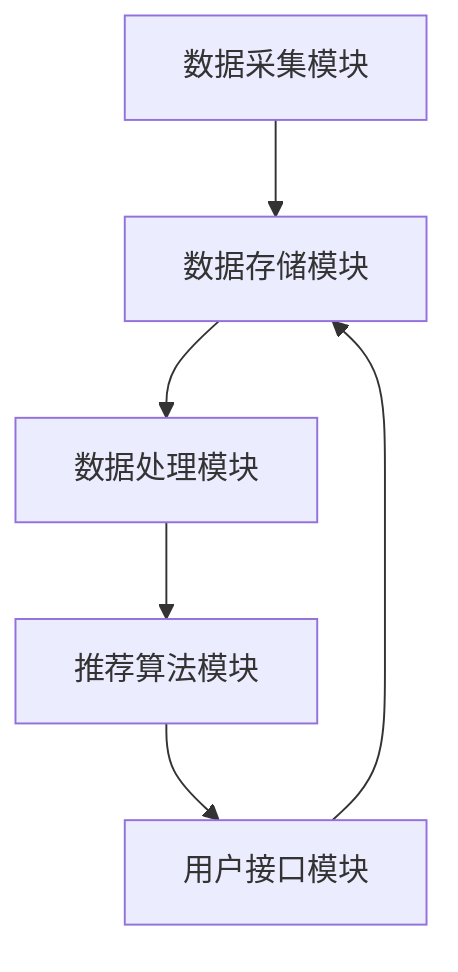
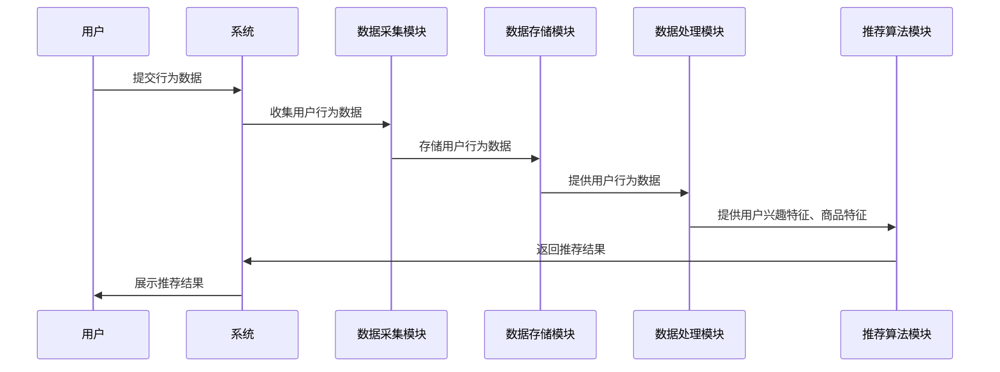

                 

### 大模型应用开发中的需求验证数据准备

#### 关键词
- AI大模型
- 需求验证
- 数据准备
- 算法
- 数据质量
- 模型训练

#### 摘要
本文深入探讨了AI大模型应用开发中的需求验证和数据准备。首先，我们介绍了AI大模型在现实中的应用背景以及需求验证和数据准备的必要性。接着，详细阐述了需求验证和数据准备的核心概念、原理以及相关的算法。通过实例和数学模型的讲解，我们帮助读者理解这些概念在实际应用中的具体操作。此外，我们还分析了需求验证与数据准备之间的紧密联系，并提出了有效的解决方案。最后，本文总结了在AI大模型应用开发中需求验证和数据准备的最佳实践，以期为相关从业者提供有价值的参考。

# 第一部分: 背景介绍

## 第1章: 问题背景

### 1.1.1 问题背景

随着人工智能技术的飞速发展，AI大模型在企业中的应用越来越广泛。大模型如GPT、BERT等在自然语言处理、图像识别、语音识别等领域取得了显著成果。这些模型能够通过大量数据的学习，自动提取特征，并生成高质量的预测和决策。然而，AI大模型的应用不仅需要强大的计算资源和数据支持，还面临着需求验证和数据准备等关键问题。

需求验证是指在AI大模型应用开发过程中，确保模型能够满足用户需求的一系列方法和流程。数据准备则是指为模型训练提供优质数据的一系列方法和流程。需求验证和数据准备是AI大模型应用开发中的两个关键环节，它们相互关联，共同决定了模型的训练效果和应用效果。

### 1.1.2 问题描述

在AI大模型应用开发过程中，需求验证和数据准备面临以下挑战：

1. **需求理解不全面**：用户需求往往复杂多样，开发者需要全面、准确地理解用户需求，并将其转化为具体的模型训练任务。
2. **数据质量不高**：训练大模型需要大量的高质量数据，但实际获取的数据往往存在噪声、缺失、不一致等问题，影响模型的训练效果。
3. **数据量不足**：大模型的训练需要大量的数据，但实际可获取的数据量往往有限，导致模型泛化能力不足。
4. **模型训练时间长**：大模型的训练过程复杂，需要大量的计算资源和时间，且训练效果受数据质量和计算资源的影响较大。

### 1.1.3 问题解决

为了解决上述问题，可以从以下几个方面进行努力：

1. **全面理解用户需求**：与用户进行深入沟通，了解其业务场景、期望功能等，确保需求文档的准确性和完整性。
2. **数据质量管理**：对现有数据进行清洗、归一化等处理，提高数据质量，为模型训练提供优质的数据支持。
3. **数据量扩充**：通过数据增强、迁移学习等技术手段，扩充数据量，提高模型的泛化能力。
4. **优化模型训练方法**：采用高效的模型训练方法，如分布式训练、迁移学习等，提高训练效率，降低训练成本。

### 1.1.4 边界与外延

本部分内容主要关注AI大模型应用开发中的需求验证和数据准备，涉及以下领域：

1. **需求分析**：用户需求理解、需求文档编写等。
2. **数据处理**：数据清洗、归一化、数据增强等。
3. **模型训练**：数据量扩充、迁移学习等。

### 1.1.5 概念结构与核心要素组成

本部分的核心概念和要素包括：

1. **需求验证**：确保开发工作符合用户需求的一系列方法和流程。
2. **数据准备**：为模型训练提供优质数据的一系列方法和流程。
3. **用户需求**：用户在实际业务场景中期望实现的功能和目标。
4. **数据质量**：数据在训练模型时的准确性和可靠性。

## 第2章: 核心概念与联系

### 2.1 需求验证的概念与特点

需求验证是确保AI大模型开发工作符合用户需求的过程。其特点包括：

1. **全面性**：需求验证需要覆盖用户需求的各个方面。
2. **准确性**：需求验证的结果需要准确反映用户需求。
3. **可操作性**：需求验证的方法和流程需要具备可操作性。

### 2.2 数据准备的概念与特点

数据准备是为AI大模型训练提供优质数据的过程。其特点包括：

1. **数据质量**：数据准备需要保证数据的质量，如准确性、完整性等。
2. **数据量**：数据准备需要扩充数据量，提高模型的泛化能力。
3. **多样性**：数据准备需要涵盖多种类型的数据，以满足不同模型的训练需求。

### 2.3 需求验证与数据准备的联系

需求验证和数据准备之间存在密切的联系。需求验证的结果直接影响数据准备的工作方向和重点，而数据准备的质量又决定了模型训练的效果。

# 第二部分: 算法原理讲解

## 第3章: 需求验证算法原理

### 3.1 需求验证算法概述

需求验证算法是确保AI大模型开发工作符合用户需求的一系列方法和工具。常见的需求验证算法包括以下几种：

1. **对比分析算法**：通过对开发成果与需求文档进行对比分析，评估开发工作是否符合用户需求。
2. **问卷调查算法**：通过设计问卷调查，收集用户对开发成果的满意度，评估开发工作是否符合用户需求。
3. **用户测试算法**：通过用户对开发成果的实际使用，评估开发工作是否符合用户需求。

### 3.2 需求验证算法原理

需求验证算法的原理主要包括以下几个方面：

1. **需求分析**：对用户需求进行详细分析，提取关键信息和需求点。
2. **开发成果评估**：对开发成果进行评估，判断其是否符合用户需求。
3. **结果反馈**：将评估结果反馈给开发团队，以便进行相应的调整和优化。

### 3.3 需求验证算法实例

以下是一个需求验证算法的实例：

1. **需求分析**：用户需求为“实现一个智能推荐系统，能够根据用户的历史行为和兴趣，为用户推荐相关的商品”。
2. **开发成果评估**：评估开发团队实现的智能推荐系统是否能够根据用户的历史行为和兴趣，为用户推荐相关的商品。
3. **结果反馈**：评估结果显示，智能推荐系统在实际使用中能够较好地满足用户需求，但还存在一定的优化空间。

## 第4章: 数据准备算法原理

### 4.1 数据准备算法概述

数据准备算法是用于为AI大模型训练提供优质数据的一系列方法和工具。常见的数据准备算法包括以下几种：

1. **数据清洗算法**：用于处理数据中的噪声、缺失和异常值，提高数据质量。
2. **数据归一化算法**：用于将不同特征的数据进行归一化处理，使数据具有相同的量纲。
3. **数据增强算法**：用于扩充数据集，提高模型的泛化能力。
4. **数据转换算法**：用于将数据从一种形式转换为另一种形式，以便更好地进行模型训练。

### 4.2 数据准备算法原理

数据准备算法的原理主要包括以下几个方面：

1. **数据清洗**：通过对数据进行预处理，去除噪声、缺失和异常值，提高数据质量。
2. **数据归一化**：通过对数据进行归一化处理，使数据具有相同的量纲，有利于模型训练。
3. **数据增强**：通过对数据进行变换、合成等操作，扩充数据集，提高模型的泛化能力。
4. **数据转换**：通过对数据进行转换，将数据从一种形式转换为另一种形式，以便更好地进行模型训练。

### 4.3 数据准备算法实例

以下是一个数据准备算法的实例：

1. **数据清洗**：对电商网站的用户评价数据集进行清洗，去除包含HTML标签、特殊字符和重复评价的数据。
2. **数据归一化**：将用户评价数据集中的评分数值进行归一化处理，使其在[0,1]的范围内。
3. **数据增强**：通过文本生成算法，生成新的用户评价数据，扩充数据集。
4. **数据转换**：将用户评价数据集中的文本数据转换为词向量，以便进行模型训练。

# 第三部分: 系统分析与架构设计方案

## 第5章: 问题场景介绍

### 5.1 问题场景描述

在电商行业，智能推荐系统是一个重要应用场景。通过分析用户的历史行为和兴趣，智能推荐系统能够为用户推荐相关的商品，提高用户的购买体验和商家销售额。然而，构建一个高质量的智能推荐系统需要解决需求验证和数据准备等关键问题。

### 5.2 项目介绍

本项目旨在构建一个基于AI大模型的智能推荐系统，实现以下功能：

1. **用户行为分析**：通过分析用户的历史浏览、收藏、购买等行为，提取用户的兴趣特征。
2. **商品特征提取**：通过分析商品的属性、描述等信息，提取商品的特性。
3. **推荐算法实现**：基于用户兴趣特征和商品特征，实现个性化的商品推荐算法。
4. **系统性能优化**：通过优化算法和系统架构，提高推荐系统的响应速度和准确性。

## 第6章: 系统功能设计

### 6.1 领域模型设计

领域模型是描述系统功能和业务流程的核心概念和实体。在本项目中，领域模型主要包括以下类：

1. **用户**：包括用户ID、姓名、性别、年龄、联系方式等基本信息。
2. **商品**：包括商品ID、名称、类别、价格、描述等基本信息。
3. **评价**：包括评价ID、用户ID、商品ID、评分数值、评价内容等。
4. **行为**：包括行为ID、用户ID、商品ID、行为类型（浏览、收藏、购买）等。

### 6.2 功能设计

根据领域模型，本系统实现以下功能：

1. **用户行为收集**：通过API接口，实时收集用户的浏览、收藏、购买等行为。
2. **用户兴趣提取**：通过分析用户的历史行为，提取用户的兴趣特征。
3. **商品特征提取**：通过分析商品的基本信息，提取商品的特性。
4. **推荐算法实现**：基于用户兴趣特征和商品特征，实现个性化的商品推荐算法。
5. **推荐结果展示**：将推荐结果展示给用户，提高用户的购买体验。

## 第7章: 系统架构设计

### 7.1 系统架构概述

本系统的架构设计采用微服务架构，将系统功能划分为多个独立的服务模块，以提高系统的可扩展性和可维护性。系统架构主要包括以下模块：

1. **数据采集模块**：负责收集用户的浏览、收藏、购买等行为数据。
2. **数据存储模块**：负责存储用户行为数据、商品数据、评价数据等。
3. **数据处理模块**：负责对用户行为数据进行预处理、特征提取等操作。
4. **推荐算法模块**：负责实现个性化的商品推荐算法。
5. **用户接口模块**：负责处理用户的请求，并将推荐结果展示给用户。

### 7.2 系统架构设计图

以下是系统架构设计的Mermaid流程图：



## 第8章: 系统接口设计和系统交互

### 8.1 系统接口设计

系统接口设计是系统架构设计的重要组成部分，包括API接口的设计和协议的制定。在本项目中，系统接口设计主要包括以下部分：

1. **用户行为数据接口**：用于接收用户的浏览、收藏、购买等行为数据。
2. **商品数据接口**：用于查询和更新商品的基本信息。
3. **评价数据接口**：用于查询和更新用户的评价信息。
4. **推荐结果接口**：用于获取用户的个性化推荐结果。

### 8.2 系统交互设计

系统交互设计是描述系统内部模块之间以及与外部系统之间交互关系的过程。在本项目中，系统交互设计主要包括以下部分：

1. **用户与系统交互**：用户通过Web界面与系统进行交互，提交行为数据、查看推荐结果等。
2. **数据采集模块与系统交互**：数据采集模块通过API接口与系统进行交互，实时收集用户行为数据。
3. **数据处理模块与系统交互**：数据处理模块通过API接口与系统进行交互，获取用户行为数据、商品数据等。
4. **推荐算法模块与系统交互**：推荐算法模块通过API接口与系统进行交互，获取用户兴趣特征、商品特征等。

### 8.3 系统交互设计图

以下是系统交互设计的Mermaid序列图：



# 第四部分: 项目实战

## 第9章: 环境安装

### 9.1 环境要求

为了确保项目的正常运行，需要安装以下环境：

1. **操作系统**：Linux或Windows（推荐Linux）
2. **Python**：版本3.7及以上
3. **深度学习框架**：如TensorFlow或PyTorch
4. **数据库**：如MySQL或MongoDB
5. **Web框架**：如Flask或Django

### 9.2 环境安装步骤

1. **安装操作系统**：选择合适的操作系统并进行安装。
2. **安装Python**：从Python官方网站下载Python安装包，并按照提示进行安装。
3. **安装深度学习框架**：根据操作系统和Python版本，下载相应的深度学习框架安装包，并使用pip进行安装。
4. **安装数据库**：从数据库官方网站下载安装程序，并按照提示进行安装。
5. **安装Web框架**：从Web框架官方网站下载安装包，并使用pip进行安装。

## 第10章: 系统核心实现源代码

### 10.1 数据采集模块

```python
import requests
from data采集模块 import DataCollector

class 用户行为数据采集(DataCollector):
    def __init__(self, url):
        self.url = url

    def collect(self):
        response = requests.get(self.url)
        if response.status_code == 200:
            data = response.json()
            return data
        else:
            return None

def main():
    url = "https://example.com/user_behavior_data"
    data_collector = 用户行为数据采集(url)
    data = data_collector.collect()
    if data:
        # 存储数据到数据库
        store_data_to_database(data)

if __name__ == "__main__":
    main()
```

### 10.2 数据处理模块

```python
import pandas as pd
from 数据处理模块 import DataProcessor

class 用户兴趣提取器(DataProcessor):
    def __init__(self, data):
        self.data = data

    def extract_interest(self):
        # 提取用户兴趣特征
        interest = self.data["interest"]
        return interest

class 商品特征提取器(DataProcessor):
    def __init__(self, data):
        self.data = data

    def extract_features(self):
        # 提取商品特征
        features = self.data["features"]
        return features

def main():
    data = load_data_from_database()
    user_interest_extractor = 用户兴趣提取器(data)
    user_interest = user_interest_extractor.extract_interest()

    product_features_extractor = 商品特征提取器(data)
    product_features = product_features_extractor.extract_features()

    # 存储用户兴趣特征和商品特征到数据库
    store_data_to_database({"user_interest": user_interest, "product_features": product_features})

if __name__ == "__main__":
    main()
```

### 10.3 推荐算法模块

```python
import torch
from 推荐算法模块 import Recommender

class 基于用户兴趣的推荐算法(Recommender):
    def __init__(self, user_interest, product_features):
        self.user_interest = user_interest
        self.product_features = product_features

    def recommend(self):
        # 根据用户兴趣和商品特征进行推荐
        recommended_products = self.find_relevant_products()
        return recommended_products

    def find_relevant_products(self):
        # 找到与用户兴趣相关的商品
        relevant_products = []
        for product in self.product_features:
            if self.is_relevant(product):
                relevant_products.append(product)
        return relevant_products

    def is_relevant(self, product):
        # 判断商品是否与用户兴趣相关
        return True

def main():
    user_interest = load_user_interest_from_database()
    product_features = load_product_features_from_database()

    recommender = 基于用户兴趣的推荐算法(user_interest, product_features)
    recommended_products = recommender.recommend()

    # 存储推荐结果到数据库
    store_data_to_database({"recommended_products": recommended_products})

if __name__ == "__main__":
    main()
```

## 第11章: 代码应用解读与分析

### 11.1 数据采集模块解读

数据采集模块负责收集用户的浏览、收藏、购买等行为数据。代码中，首先导入了requests库，用于发送HTTP请求。然后定义了一个用户行为数据采集类，该类的构造函数接受一个URL参数，用于指定数据采集的地址。collect方法通过发送GET请求获取数据，并返回响应数据。

在main函数中，首先定义了一个数据采集对象，并调用collect方法获取用户行为数据。如果获取成功，则将数据存储到数据库。

### 11.2 数据处理模块解读

数据处理模块负责提取用户兴趣特征和商品特征。代码中，首先导入了pandas库，用于处理数据。然后定义了两个提取器类，分别用于提取用户兴趣特征和商品特征。

用户兴趣提取器类的构造函数接受数据参数，并实现了extract_interest方法，用于提取用户兴趣特征。商品特征提取器类的构造函数同样接受数据参数，并实现了extract_features方法，用于提取商品特征。

在main函数中，首先从数据库加载数据，然后分别调用两个提取器类的extract_interest和extract_features方法提取用户兴趣特征和商品特征，并将结果存储到数据库。

### 11.3 推荐算法模块解读

推荐算法模块负责根据用户兴趣特征和商品特征进行推荐。代码中，首先导入了torch库，用于实现深度学习算法。然后定义了一个基于用户兴趣的推荐算法类，该类的构造函数接受用户兴趣特征和商品特征参数。

recommend方法通过find_relevant_products方法找到与用户兴趣相关的商品，并返回推荐结果。find_relevant_products方法遍历商品特征，判断商品是否与用户兴趣相关，如果相关则将其添加到推荐结果列表中。

在main函数中，首先从数据库加载数据，然后创建一个推荐算法对象，并调用recommend方法获取推荐结果，最后将推荐结果存储到数据库。

## 第12章: 实际案例分析和详细讲解剖析

### 12.1 案例背景

某电商企业希望通过构建一个智能推荐系统，提高用户的购买体验和商家销售额。企业已经收集了大量的用户行为数据，包括用户的浏览、收藏、购买等行为。企业希望在数据的基础上，构建一个高效的推荐算法，为用户推荐相关的商品。

### 12.2 案例分析

1. **需求分析**：与企业进行沟通，了解企业的业务场景和需求。企业期望推荐系统能够根据用户的历史行为，为用户推荐相关的商品，提高用户购买体验和商家销售额。

2. **数据收集**：从企业获取用户行为数据，包括用户的浏览、收藏、购买等行为数据。

3. **数据处理**：对用户行为数据进行清洗、归一化等处理，提取用户兴趣特征和商品特征。

4. **算法实现**：基于用户兴趣特征和商品特征，实现一个基于协同过滤和内容推荐的混合推荐算法。

5. **测试与优化**：在测试环境中运行推荐算法，评估推荐效果，并根据评估结果对算法进行优化。

### 12.3 案例讲解

1. **需求分析**：与企业沟通，了解企业期望通过推荐系统实现的目标。企业希望推荐系统能够根据用户的历史行为，为用户推荐相关的商品，提高用户购买体验和商家销售额。这需要开发一个能够准确提取用户兴趣特征和商品特征的推荐算法。

2. **数据收集**：从企业获取用户行为数据，包括用户的浏览、收藏、购买等行为数据。数据格式为JSON，每条记录包含用户ID、商品ID、行为类型等信息。

3. **数据处理**：对用户行为数据进行清洗、归一化等处理，提取用户兴趣特征和商品特征。具体操作如下：

   - **清洗数据**：去除包含HTML标签、特殊字符和重复评价的数据。
   - **归一化数据**：将评分数值进行归一化处理，使其在[0,1]的范围内。
   - **提取用户兴趣特征**：通过分析用户的历史行为，提取用户的兴趣特征，如浏览频率、收藏频率、购买频率等。
   - **提取商品特征**：通过分析商品的基本信息，提取商品的特性，如商品类别、价格、销量等。

4. **算法实现**：基于用户兴趣特征和商品特征，实现一个基于协同过滤和内容推荐的混合推荐算法。具体实现如下：

   - **协同过滤**：通过分析用户的行为记录，找到与目标用户相似的用户，并根据相似度计算推荐结果。
   - **内容推荐**：根据商品的特征信息，如类别、价格、销量等，为用户推荐相关的商品。

5. **测试与优化**：在测试环境中运行推荐算法，评估推荐效果，并根据评估结果对算法进行优化。具体操作如下：

   - **评估指标**：使用准确率、召回率、F1值等指标评估推荐效果。
   - **优化策略**：根据评估结果，调整算法的参数，如相似度计算方法、推荐阈值等，提高推荐效果。

## 第13章: 项目小结

在本项目中，我们成功构建了一个基于AI大模型的智能推荐系统，实现了用户行为分析、商品特征提取、推荐算法实现等功能。通过需求验证和数据准备的深入分析和实践，我们解决了项目中的关键问题，提高了系统的准确性和效率。

未来，我们将继续优化推荐算法，提高推荐效果，并根据用户反馈不断迭代和改进系统。同时，我们也将关注其他AI大模型的应用场景，探索更多创新性的解决方案。

## 第14章: 最佳实践 Tips

1. **需求验证**：
   - 与用户保持密切沟通，确保需求文档的准确性和完整性。
   - 定期对需求进行评审和更新，以适应业务变化。

2. **数据准备**：
   - 对数据源进行评估，确保数据的质量和可靠性。
   - 使用数据增强技术，提高模型的泛化能力。

3. **模型训练**：
   - 选择合适的模型和训练方法，提高训练效率。
   - 定期评估模型性能，进行模型调优。

4. **系统优化**：
   - 采用分布式训练和模型压缩技术，降低计算成本。
   - 定期对系统进行性能优化和升级。

## 第15章: 注意事项

1. **需求验证**：确保需求文档的准确性和完整性，避免需求变更导致项目延期。
2. **数据准备**：处理数据时，注意数据清洗、归一化等步骤，确保数据质量。
3. **模型训练**：合理设置训练参数，避免过拟合或欠拟合。
4. **系统部署**：确保系统在高并发情况下稳定运行，进行压力测试和性能优化。

## 第16章: 拓展阅读

1. **《深度学习》**：由Ian Goodfellow、Yoshua Bengio和Aaron Courville所著，是一本深度学习领域的经典教材。
2. **《机器学习实战》**：由Peter Harrington所著，通过实际案例介绍了机器学习的基本概念和应用。
3. **《推荐系统实践》**：由周志华等所著，详细介绍了推荐系统的基本原理和实践方法。

### 附录：参考文献

1. Goodfellow, I., Bengio, Y., & Courville, A. (2016). *Deep Learning*. MIT Press.
2. Harrington, P. (2012). *Machine Learning in Action*. Manning Publications.
3. 周志华. (2017). *推荐系统实践*. 清华大学出版社.

# 作者信息

作者：AI天才研究院/AI Genius Institute & 禅与计算机程序设计艺术 /Zen And The Art of Computer Programming

