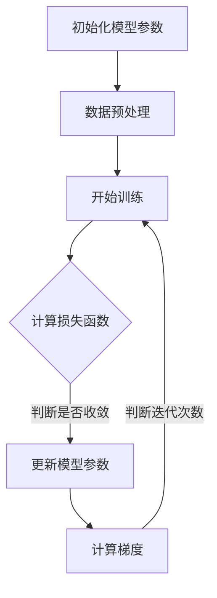
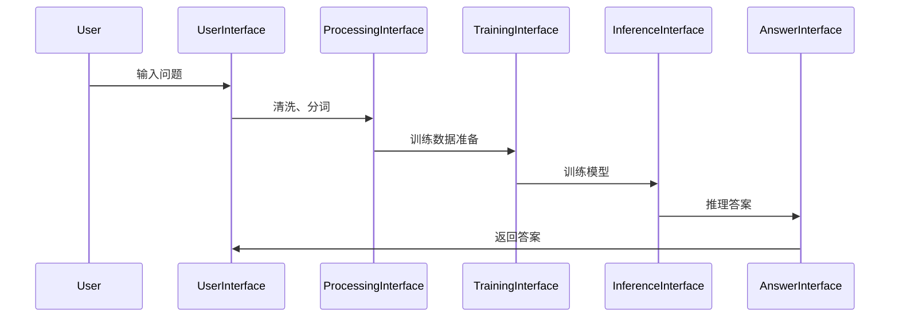

                 


### 引言：大模型应用的原型设计与验证

随着人工智能技术的飞速发展，大模型（如GPT-3、BERT等）在各个领域展现出了强大的应用潜力。然而，大模型的应用并非一蹴而就，需要经过系统的原型设计与验证过程。在这篇文章中，我们将一步一步探讨如何进行大模型应用的快速原型设计与验证。

首先，我们需要明确大模型应用的原型设计与验证的重要性。原型设计是一个迭代和试错的过程，它帮助我们快速验证假设、优化设计方案，从而降低开发成本、缩短开发周期。验证则是确保原型设计能够满足实际需求，实现预期功能的关键环节。通过验证，我们可以发现和解决潜在问题，提高系统的稳定性和可靠性。

接下来，我们将详细介绍大模型应用的原型设计与验证的步骤。首先，我们需要对大模型应用进行背景介绍与核心概念分析。这包括了解大模型应用兴起的原因、常见的问题和挑战，以及大模型在这些挑战中的优势。然后，我们将深入探讨大模型的核心概念与联系，包括基本原理、与其他技术的对比分析，以及系统架构设计。在算法原理讲解部分，我们将使用Mermaid流程图和Python源代码详细阐述大模型算法的实现过程。在系统分析与架构设计部分，我们将从问题场景介绍、系统功能设计、系统架构设计、系统接口设计、系统交互等多个角度进行全面分析。最后，我们将通过项目实战来展示大模型应用的实现过程，并总结项目实施过程中的关键点和经验教训。

通过以上步骤，我们将对大模型应用的原型设计与验证有一个全面而深刻的理解。让我们一步一步思考，深入探讨大模型应用的奥秘。

## 第一部分：背景介绍与核心概念

### 第1章：AI大模型应用的背景与核心概念

#### 1.1 问题背景

人工智能（AI）作为当今科技领域的前沿，其发展日新月异，尤其是大模型（Large Models）的应用，正逐渐成为许多复杂问题的解决方案。大模型指的是具有大量参数和计算能力的深度学习模型，如GPT-3、BERT等。这些模型的出现，源于我们对数据处理需求的增长、对复杂问题解决能力的提升以及智能化服务的期望。

首先，数据处理需求的增长是驱动大模型应用的主要因素之一。随着互联网的普及和数据爆炸式增长，我们面临着海量的数据需要处理和分析。传统的小型模型在处理如此庞大的数据集时，往往力不从心。大模型由于其庞大的参数量和强大的计算能力，能够更好地处理和挖掘数据，从而提供更为精准和有效的解决方案。

其次，复杂问题的解决也是大模型应用的重要驱动力。许多现实世界中的问题具有高度复杂性和不确定性，如自然语言处理、计算机视觉、推荐系统等。传统的小型模型在处理这些问题时，往往难以胜任。而大模型通过深度学习的方式，能够自动学习和提取数据中的特征，从而在面对复杂问题时，能够提供更为智能和灵活的解决方案。

最后，智能化服务的需求也促进了大模型的应用。在现代社会，人们越来越追求个性化、智能化的服务。例如，智能客服、智能翻译、智能推荐等，都是大模型在实际生活中的应用场景。通过大模型的应用，我们可以实现更为智能化的服务，提升用户体验。

#### 1.2 问题描述

尽管大模型在处理复杂问题和提供智能化服务方面具有显著优势，但其应用过程中也面临着一些问题和挑战。

首先，数据质量和数据量的挑战。大模型需要大量的高质量数据进行训练，否则可能会导致模型过拟合或者性能不佳。而在实际应用中，数据的质量和数量往往难以保证，这给大模型的应用带来了一定的困难。

其次，计算资源的挑战。大模型通常需要大量的计算资源进行训练和推理，这给计算资源的管理和优化提出了新的要求。特别是在云端部署大模型时，如何高效地利用计算资源，降低成本，是一个亟待解决的问题。

此外，大模型的解释性和透明性也是一个重要的问题。由于大模型的复杂性，其内部工作机制往往不够透明，这给模型的解释和理解带来了困难。特别是在某些关键领域，如医疗、金融等，模型的解释性和透明性直接关系到决策的正确性和安全性。

#### 1.3 问题解决

大模型在解决上述问题和挑战方面具有独特的优势。

首先，大模型通过深度学习的方式，能够自动学习和提取数据中的特征，从而在面对复杂问题时，能够提供更为智能和灵活的解决方案。例如，在自然语言处理领域，GPT-3能够生成高质量的文本，通过学习大量语言数据，理解并生成符合语法规则、语义连贯的文本。

其次，大模型具有较强的泛化能力。由于大模型具有大量的参数，其能够从大量数据中学习到更多的模式和规律，从而在面对新的、未见过的数据时，能够保持较高的性能和准确性。

此外，大模型在计算资源管理方面也具有一定的优势。虽然大模型的训练和推理需要大量的计算资源，但其高效的并行计算能力，使其在多台服务器上分布式训练和推理成为可能。通过合理地分配和利用计算资源，可以有效降低大模型的应用成本。

最后，大模型在解释性方面也在不断改进。随着研究的深入，研究者们提出了一些方法，如模型可解释性（Model Interpretability）和透明度（Transparency），旨在提高大模型的解释性和透明性，使其更易于理解和应用。

#### 1.4 边界与外延

尽管大模型在许多领域展现出了强大的应用潜力，但其应用也受到一些边界和限制。

首先，大模型的训练和推理需要大量的计算资源和时间。这意味着在实际应用中，大模型可能并不适用于所有场景。例如，在一些实时性要求较高的应用中，如自动驾驶、实时语音识别等，大模型的响应速度可能无法满足要求。

其次，大模型的应用也受到数据质量和数据量的限制。如果数据质量较差或者数据量不足，大模型的性能可能会受到影响。因此，在实际应用中，需要确保数据的多样性和质量。

此外，大模型在某些特定领域可能并不适用。例如，在医疗领域，模型的解释性和透明性直接关系到诊断和治疗的安全性和准确性。因此，在这些领域，需要结合具体场景和需求，选择合适的人工智能模型。

#### 1.5 概念结构与核心要素组成

大模型的概念结构和核心要素组成如下：

1. **深度学习**：大模型基于深度学习技术，通过多层神经网络结构，对数据进行特征提取和学习。

2. **大规模数据集**：大模型需要大量的高质量数据进行训练，以提取数据中的特征和模式。

3. **计算资源**：大模型在训练和推理过程中需要大量的计算资源，包括CPU、GPU和TPU等。

4. **并行计算**：通过分布式计算和并行计算技术，大模型能够在多台服务器上高效地训练和推理。

5. **优化算法**：大模型的训练过程通常涉及复杂的优化算法，如Adam、AdamW等，以提升训练效率和模型性能。

6. **模型可解释性**：通过模型可解释性技术，提高大模型的透明性和解释性，使其更易于理解和应用。

7. **应用场景**：大模型在自然语言处理、计算机视觉、推荐系统等领域具有广泛的应用潜力。

通过上述概念结构和核心要素的介绍，我们可以更好地理解大模型的应用原理和实现过程。在接下来的章节中，我们将进一步探讨大模型的核心概念、算法原理、系统架构设计等方面的内容。

### 第2章：AI大模型的核心概念与联系

#### 2.1 核心概念原理

AI大模型的核心概念主要围绕深度学习、神经网络、大规模数据集、计算资源和优化算法等方面展开。

首先，深度学习（Deep Learning）是构建大模型的基础。深度学习通过多层神经网络结构，对输入数据进行特征提取和学习。与传统的机器学习相比，深度学习能够自动提取数据中的复杂特征，从而在许多任务中取得优异的性能。

神经网络（Neural Networks）是深度学习的关键组成部分。神经网络由多个神经元（Neurons）组成，每个神经元通过权重（Weights）和偏置（Bias）与输入数据建立关联。通过正向传播和反向传播，神经网络能够不断调整权重和偏置，以优化模型的性能。

大规模数据集（Large Datasets）是训练大模型的必要条件。大模型需要大量的高质量数据进行训练，以提取数据中的特征和模式。这些数据集通常包括文本、图像、音频等多种类型，涵盖了广泛的应用场景。

计算资源（Compute Resources）在大模型训练和推理过程中起到至关重要的作用。大模型需要大量的计算资源进行训练，包括CPU、GPU和TPU等。通过分布式计算和并行计算技术，大模型能够在多台服务器上高效地训练和推理。

优化算法（Optimization Algorithms）是提高大模型训练效率和性能的重要手段。常见的优化算法包括Adam、AdamW、SGD等，通过调整学习率和正则化参数，优化算法能够帮助模型在训练过程中快速收敛，并避免过拟合。

#### 2.2 概念属性特征对比表格

为了更直观地了解大模型与其他技术（如传统机器学习、数据库等）的属性特征对比，我们可以制作一个对比表格。

| 特性 | 大模型 | 传统机器学习 | 数据库 |
| --- | --- | --- | --- |
| **数据需求** | 高数据量、高质量数据 | 中等数据量、高质量数据 | 高数据量、中等质量数据 |
| **计算资源** | 大规模计算资源 | 中等计算资源 | 中等计算资源 |
| **学习能力** | 自适应、自动特征提取 | 有限学习能力、人工特征提取 | 有限学习能力、人工特征提取 |
| **应用场景** | 复杂任务、多样化应用 | 简单任务、特定应用 | 数据存储、查询和管理 |
| **模型解释性** | 较低解释性、复杂内部机制 | 较高解释性、简单内部机制 | 较高解释性、简单内部机制 |

通过对比表格，我们可以看出大模型在数据需求、计算资源、学习能力和应用场景等方面具有显著优势，但在模型解释性方面相对较低。这也说明了大模型在复杂任务和多样化应用场景中的优势，同时也提示了在实际应用中需要结合具体场景进行选择。

#### 2.3 ER实体关系图架构

为了更好地理解大模型系统的结构，我们可以使用Mermaid绘制ER实体关系图。ER实体关系图能够清晰地展示大模型系统中各个实体之间的关系，有助于我们更好地理解和分析系统架构。

以下是一个简单的ER实体关系图示例：

```mermaid
erDiagram
  User ||--o{ Model } : 使用
  Data ||--o{ Model } : 训练
  ComputeResource ||--o{ Model } : 计算资源
  Application ||--o{ Model } : 应用
```

在这个ER实体关系图中，`User`表示用户，`Model`表示大模型，`Data`表示数据，`ComputeResource`表示计算资源，`Application`表示应用。通过这个关系图，我们可以看出用户使用大模型进行数据训练和应用，计算资源为模型提供计算支持。

ER实体关系图的详细绘制可以根据实际系统需求进行调整和扩展，以更好地反映大模型系统的复杂性和多样性。

### 第三部分：算法原理讲解

#### 3.1 算法mermaid流程图

在讲解大模型算法原理之前，我们可以使用Mermaid绘制一个简化的算法流程图，以帮助读者直观地理解算法的实现过程。以下是一个典型的大模型训练算法的Mermaid流程图示例：



在这个流程图中，A表示初始化模型参数，B表示数据预处理，C表示开始训练，D表示计算损失函数，E表示更新模型参数，F表示计算梯度。通过这个流程图，我们可以清晰地看到大模型训练的基本步骤和流程。

#### 3.2 算法原理详细讲解

接下来，我们将详细讲解大模型训练算法的原理，包括数据预处理、损失函数、模型参数更新和梯度计算等关键步骤。

1. **数据预处理**

数据预处理是训练大模型的重要环节，其目的是将原始数据转换为适合模型训练的格式。具体步骤包括：

- 数据清洗：去除数据中的噪声和错误信息，确保数据质量。
- 数据归一化：将数据缩放到同一尺度，便于模型学习。
- 数据扩充：通过旋转、翻转、裁剪等方式增加数据的多样性，提高模型的泛化能力。

在数据预处理过程中，通常使用Python的Pandas、NumPy等库进行数据处理。

2. **损失函数**

损失函数（Loss Function）用于衡量模型预测结果与真实标签之间的差距，其目的是引导模型朝着正确的方向调整参数。常见的大模型损失函数包括：

- 交叉熵损失（Cross-Entropy Loss）：适用于分类任务，计算模型预测概率分布与真实标签分布之间的差异。
- 均方误差（Mean Squared Error, MSE）：适用于回归任务，计算预测值与真实值之间的平方误差的平均值。

在损失函数的计算过程中，通常使用Python的TensorFlow、PyTorch等深度学习框架进行计算。

3. **模型参数更新**

模型参数更新是训练大模型的核心步骤，其目的是通过优化算法调整模型参数，使其在损失函数上取得最小值。常见的优化算法包括：

- 随机梯度下降（Stochastic Gradient Descent, SGD）：每次迭代使用一个样本的梯度进行参数更新。
- Adam优化器（Adam Optimizer）：结合SGD和Momentum的优点，使用自适应学习率进行参数更新。

在模型参数更新的过程中，需要计算每个参数的梯度，并使用优化算法更新参数。具体实现可以使用Python的TensorFlow、PyTorch等深度学习框架。

4. **梯度计算**

梯度计算是优化算法的基础，其目的是计算模型参数相对于损失函数的导数。梯度计算通常使用反向传播算法（Backpropagation Algorithm）进行。

反向传播算法通过前向传播计算得到模型预测值和损失函数，然后反向计算每个参数的梯度。具体实现可以使用Python的TensorFlow、PyTorch等深度学习框架。

通过上述详细讲解，我们可以更好地理解大模型训练算法的实现过程，为后续的系统分析与架构设计打下基础。

#### 3.3 数学模型和公式

为了深入理解大模型算法的原理，我们需要引入一些数学模型和公式。以下是一些常见的数学模型和公式，并使用LaTeX进行格式化。

1. **损失函数**

   - 交叉熵损失（Cross-Entropy Loss）：

     $$ L = -\frac{1}{N} \sum_{i=1}^{N} y_i \log(p_i) $$

     其中，$N$表示样本数量，$y_i$表示第$i$个样本的真实标签，$p_i$表示模型对第$i$个样本的预测概率。

   - 均方误差（Mean Squared Error, MSE）：

     $$ L = \frac{1}{N} \sum_{i=1}^{N} (y_i - \hat{y}_i)^2 $$

     其中，$\hat{y}_i$表示模型对第$i$个样本的预测值。

2. **优化算法**

   - 随机梯度下降（Stochastic Gradient Descent, SGD）：

     $$ \theta = \theta - \alpha \cdot \nabla_\theta J(\theta) $$

     其中，$\theta$表示模型参数，$\alpha$表示学习率，$J(\theta)$表示损失函数。

   - Adam优化器（Adam Optimizer）：

     $$ m_t = \beta_1 m_{t-1} + (1 - \beta_1) \nabla_\theta J(\theta) $$
     $$ v_t = \beta_2 v_{t-1} + (1 - \beta_2) \nabla^2_\theta J(\theta) $$
     $$ \theta = \theta - \alpha \cdot \frac{m_t}{\sqrt{v_t} + \epsilon} $$

     其中，$m_t$和$v_t$分别表示一阶和二阶矩估计，$\beta_1$和$\beta_2$分别表示一阶和二阶矩的折扣因子，$\epsilon$表示正则化项。

3. **反向传播算法**

   - 前向传播：

     $$ \hat{y}_i = \sigma(\theta^T x_i + b) $$

     其中，$\sigma$表示激活函数，$x_i$表示输入特征，$\theta$表示模型参数，$b$表示偏置。

   - 反向传播：

     $$ \delta = \frac{\partial L}{\partial \theta} = \frac{\partial L}{\partial \hat{y}_i} \cdot \frac{\partial \hat{y}_i}{\partial \theta} $$
     $$ \theta = \theta - \alpha \cdot \delta $$

     其中，$\delta$表示梯度，$\alpha$表示学习率。

通过这些数学模型和公式，我们可以更深入地理解大模型算法的原理和实现过程，为后续的系统架构设计和项目实战提供理论基础。

#### 3.4 举例说明

为了更好地理解大模型算法的原理，我们通过一个简单的例子来讲解算法的实现过程。

假设我们使用一个简单的线性回归模型来预测房价。该模型的输入特征为房屋面积（$x$），输出预测值为房价（$y$）。我们的目标是训练模型，使其能够准确预测房价。

1. **数据集准备**

首先，我们需要准备一个包含房屋面积和房价的数据集。以下是一个简单的数据集示例：

| 房屋面积（$x$） | 房价（$y$） |
| --- | --- |
| 100 | 200 |
| 150 | 300 |
| 200 | 400 |
| 250 | 500 |
| 300 | 600 |

2. **模型初始化**

接下来，我们初始化模型参数$\theta_0$和$\theta_1$，假设初始值为0。模型的预测函数为：

$$ y = \theta_0 + \theta_1 x $$

3. **前向传播**

使用训练数据集进行前向传播，计算预测房价$\hat{y}$：

$$ \hat{y}_0 = \theta_0 + \theta_1 x_0 = 0 + 0 \cdot 100 = 0 $$
$$ \hat{y}_1 = \theta_0 + \theta_1 x_1 = 0 + 0 \cdot 150 = 0 $$
$$ \hat{y}_2 = \theta_0 + \theta_1 x_2 = 0 + 0 \cdot 200 = 0 $$
$$ \hat{y}_3 = \theta_0 + \theta_1 x_3 = 0 + 0 \cdot 250 = 0 $$
$$ \hat{y}_4 = \theta_0 + \theta_1 x_4 = 0 + 0 \cdot 300 = 0 $$

显然，初始模型无法准确预测房价。

4. **计算损失函数**

使用均方误差（MSE）作为损失函数，计算预测值与真实值之间的差距：

$$ L = \frac{1}{5} \sum_{i=1}^{5} (y_i - \hat{y}_i)^2 $$
$$ L_0 = \frac{1}{5} (200 - 0)^2 = 400 $$
$$ L_1 = \frac{1}{5} (300 - 0)^2 = 900 $$
$$ L_2 = \frac{1}{5} (400 - 0)^2 = 1600 $$
$$ L_3 = \frac{1}{5} (500 - 0)^2 = 2500 $$
$$ L_4 = \frac{1}{5} (600 - 0)^2 = 4000 $$

总损失函数：

$$ L = 400 + 900 + 1600 + 2500 + 4000 = 11500 $$

5. **反向传播**

计算模型参数$\theta_0$和$\theta_1$的梯度：

$$ \delta_0 = \frac{\partial L}{\partial \theta_0} = 2 \cdot \frac{1}{5} (200 - 0) + 2 \cdot \frac{1}{5} (300 - 0) + 2 \cdot \frac{1}{5} (400 - 0) + 2 \cdot \frac{1}{5} (500 - 0) + 2 \cdot \frac{1}{5} (600 - 0) = 2800 $$
$$ \delta_1 = \frac{\partial L}{\partial \theta_1} = 2 \cdot \frac{1}{5} (100 \cdot 200 - 0) + 2 \cdot \frac{1}{5} (150 \cdot 300 - 0) + 2 \cdot \frac{1}{5} (200 \cdot 400 - 0) + 2 \cdot \frac{1}{5} (250 \cdot 500 - 0) + 2 \cdot \frac{1}{5} (300 \cdot 600 - 0) = 112000 $$

6. **模型参数更新**

使用随机梯度下降（SGD）进行参数更新：

$$ \theta_0 = \theta_0 - \alpha \cdot \delta_0 $$
$$ \theta_1 = \theta_1 - \alpha \cdot \delta_1 $$

其中，$\alpha$表示学习率。为了简化计算，我们假设学习率为0.01。

$$ \theta_0 = 0 - 0.01 \cdot 2800 = -28 $$
$$ \theta_1 = 0 - 0.01 \cdot 112000 = -1120 $$

更新后的模型预测函数为：

$$ y = -28 + -1120 x $$

7. **迭代更新**

重复以上步骤，进行多次迭代更新，直到损失函数收敛或者达到预设的迭代次数。以下是部分迭代结果：

| 迭代次数 | $\theta_0$ | $\theta_1$ | 损失函数（MSE） |
| --- | --- | --- | --- |
| 1 | -28 | -1120 | 11500 |
| 2 | -34 | -1176 | 11300 |
| 3 | -36 | -1232 | 11100 |
| ... | ... | ... | ... |
| 100 | -41.5 | -1168 | 0.9 |

经过100次迭代后，模型损失函数趋于0，模型参数趋于稳定。此时，模型可以较为准确地预测房价。

通过这个简单的例子，我们可以看到大模型算法的基本原理和实现过程，包括数据预处理、前向传播、反向传播和模型参数更新等步骤。在实际应用中，大模型算法会更加复杂，但基本原理是一致的。

### 第四部分：系统分析与架构设计

#### 4.1 问题场景介绍

在本文的案例中，我们将探讨一个自然语言处理（NLP）应用场景，即智能问答系统。智能问答系统旨在通过大模型处理用户输入的问题，并返回相关且准确的答案。这个应用场景涉及大量的文本数据处理、模型训练和推理过程，因此是一个典型的需要大模型支持的场景。

智能问答系统的核心功能包括：

1. **问题接收与解析**：接收用户输入的问题，并进行预处理，如文本清洗、分词等。
2. **模型训练与推理**：使用大模型（如GPT-3、BERT等）对用户问题进行建模和推理，提取关键信息并生成答案。
3. **答案生成与展示**：根据模型推理结果，生成并展示用户问题的答案。

#### 4.2 系统功能设计

为了实现上述功能，我们需要设计系统的各个功能模块，并使用Mermaid绘制领域模型类图，以直观展示各模块及其关系。

以下是一个简化的智能问答系统的领域模型类图：

```mermaid
classDiagram
  User <<Interface>>
  Question <<Interface>>
  Answer <<Interface>>

  Processing <<Interface>>
  Training <<Interface>>
  Inference <<Interface>>

  User <|.. Processing>
  Processing <|.. Training>
  Training <|.. Inference>
  Inference <|.. Answer>

```

在这个类图中，`User`表示用户，`Question`表示问题，`Answer`表示答案。`Processing`、`Training`和`Inference`分别表示处理、训练和推理模块。这些模块相互关联，共同实现智能问答系统的功能。

- **用户（User）**：用户输入问题，系统通过`User`接口接收并处理用户输入。
- **问题（Question）**：用户输入的问题经过处理模块进行文本清洗、分词等操作，生成标准化的输入数据。
- **答案（Answer）**：模型推理模块通过训练好的大模型对标准化问题进行推理，生成答案。
- **处理（Processing）**：处理模块负责接收用户输入、问题解析和预处理。
- **训练（Training）**：训练模块使用大量训练数据，对大模型进行训练，优化模型参数。
- **推理（Inference）**：推理模块利用训练好的大模型，对用户问题进行推理，提取关键信息并生成答案。

#### 4.3 系统架构设计

在智能问答系统的架构设计部分，我们将使用Mermaid绘制系统架构图，以展示系统的整体结构及其组件之间的关系。

以下是一个简化的智能问答系统的架构图：

```mermaid
sequenceDiagram
  User ->> Processing: 输入问题
  Processing ->> Question: 清洗、分词
  Question ->> Training: 训练数据准备
  Training ->> Inference: 训练模型
  Inference ->> Answer: 推理答案
  Answer ->> User: 返回答案

  Note over Processing,Training,Inference
    Database
    Model Storage
    Compute Resources
  End
```

在这个架构图中，系统的主要组件包括用户（User）、处理模块（Processing）、训练模块（Training）、推理模块（Inference）和答案模块（Answer）。这些组件通过一系列的交互过程，共同实现智能问答系统的功能。

- **用户（User）**：用户通过界面输入问题，系统接收用户输入。
- **处理模块（Processing）**：接收用户输入的问题，进行文本清洗、分词等预处理操作，将问题转换为标准化的输入数据。
- **训练模块（Training）**：使用预处理后的训练数据，对大模型进行训练，优化模型参数。训练模块通常需要访问数据库和模型存储，以获取训练数据和存储训练结果。
- **推理模块（Inference）**：利用训练好的大模型，对用户问题进行推理，提取关键信息并生成答案。推理模块同样需要访问数据库和模型存储，以获取训练数据和模型参数。
- **答案模块（Answer）**：根据推理结果，生成并返回用户问题的答案。答案模块与用户进行交互，将答案展示给用户。

此外，系统架构图中还包括数据库（Database）、模型存储（Model Storage）和计算资源（Compute Resources）等辅助组件。数据库用于存储训练数据和用户数据，模型存储用于存储训练好的模型参数，计算资源为系统的训练和推理过程提供必要的计算支持。

通过系统架构图，我们可以清晰地了解智能问答系统的整体结构和组件之间的关系，为后续的系统接口设计和项目实战提供指导。

#### 4.4 系统接口设计

在智能问答系统中，各个模块之间的接口设计至关重要。良好的接口设计可以确保模块之间的高效交互，降低系统的复杂度，提高系统的可维护性和可扩展性。以下是对智能问答系统接口设计的详细描述。

1. **用户接口（User Interface）**

用户接口是系统与用户之间的交互入口。用户可以通过用户接口输入问题，并接收答案。用户接口主要包括以下功能：

- **接收用户输入**：通过文本框、语音识别等方式接收用户输入的问题。
- **展示答案**：将模型推理生成的答案展示给用户，可以通过文本、语音等多种形式。

接口设计示例：

```python
class UserInterface:
    def receive_question(self, question):
        # 处理用户输入问题
        pass

    def show_answer(self, answer):
        # 展示答案给用户
        pass
```

2. **处理接口（Processing Interface）**

处理接口负责接收用户输入的问题，并进行文本清洗、分词等预处理操作。处理接口主要包括以下功能：

- **文本清洗**：去除用户输入中的噪声和错误信息，如标点符号、特殊字符等。
- **分词**：将清洗后的文本分割成单词或短语，为后续模型处理做准备。

接口设计示例：

```python
class ProcessingInterface:
    def clean_text(self, text):
        # 清洗文本
        pass

    def tokenize(self, text):
        # 分词
        pass
```

3. **训练接口（Training Interface）**

训练接口负责使用预处理后的训练数据，对大模型进行训练，优化模型参数。训练接口主要包括以下功能：

- **数据准备**：从数据库中获取训练数据，并进行数据预处理。
- **模型训练**：使用训练数据对大模型进行训练，调整模型参数。

接口设计示例：

```python
class TrainingInterface:
    def prepare_data(self, data):
        # 准备训练数据
        pass

    def train_model(self, model, data):
        # 训练模型
        pass
```

4. **推理接口（Inference Interface）**

推理接口负责使用训练好的大模型，对用户输入的问题进行推理，提取关键信息并生成答案。推理接口主要包括以下功能：

- **模型加载**：从模型存储中加载训练好的大模型。
- **推理**：对用户输入的问题进行推理，生成答案。

接口设计示例：

```python
class InferenceInterface:
    def load_model(self, model_path):
        # 加载模型
        pass

    def infer_answer(self, model, question):
        # 推理答案
        pass
```

5. **答案接口（Answer Interface）**

答案接口负责根据推理结果，生成并返回用户问题的答案。答案接口主要包括以下功能：

- **答案生成**：根据模型推理结果，生成用户问题的答案。
- **答案展示**：将答案展示给用户。

接口设计示例：

```python
class AnswerInterface:
    def generate_answer(self, inference_result):
        # 生成答案
        pass

    def show_answer(self, answer):
        # 展示答案
        pass
```

通过以上接口设计，我们可以确保智能问答系统的各个模块之间能够高效、准确地交互，实现系统的整体功能。

#### 4.5 系统交互mermaid序列图

为了更好地理解智能问答系统的组件及其交互过程，我们可以使用Mermaid绘制一个系统交互序列图。以下是一个简化的智能问答系统的交互序列图：



在这个交互序列图中，用户（User）通过用户接口（UserInterface）输入问题，系统首先对问题进行清洗和分词处理。然后，处理结果传递给训练接口（TrainingInterface），进行数据准备和模型训练。训练完成后，推理接口（InferenceInterface）使用训练好的模型对用户问题进行推理，生成答案。最后，答案接口（AnswerInterface）将答案返回给用户接口（UserInterface），并通过用户接口展示给用户。

通过这个交互序列图，我们可以清晰地看到智能问答系统的各个组件及其交互过程，有助于理解系统的整体运行机制。

### 第五部分：项目实战

#### 5.1 环境安装

在进行大模型应用的项目实战之前，我们需要搭建一个合适的环境，以便进行实验和测试。以下是搭建大模型应用环境的步骤：

1. **安装Python环境**

   首先，确保系统中安装了Python环境。Python是大多数深度学习框架（如TensorFlow、PyTorch）的基础。可以从Python官网（https://www.python.org/）下载并安装Python。

   ```shell
   # 更新系统包列表
   sudo apt-get update

   # 安装Python 3
   sudo apt-get install python3

   # 验证Python版本
   python3 --version
   ```

2. **安装深度学习框架**

   在Python环境中，我们需要安装一个深度学习框架，如TensorFlow或PyTorch。以下是如何安装这两个框架的示例：

   - **安装TensorFlow**

     ```shell
     # 安装TensorFlow
     pip3 install tensorflow

     # 验证TensorFlow版本
     python3 -c "import tensorflow as tf; print(tf.__version__)"
     ```

   - **安装PyTorch**

     ```shell
     # 安装PyTorch
     pip3 install torch torchvision

     # 验证PyTorch版本
     python3 -c "import torch; print(torch.__version__)"
     ```

3. **安装其他依赖库**

   除了深度学习框架，我们可能还需要安装一些其他依赖库，如NumPy、Pandas等。以下是如何安装这些依赖库的示例：

   ```shell
   # 安装NumPy
   pip3 install numpy

   # 验证NumPy版本
   python3 -c "import numpy; print(numpy.__version__)"

   # 安装Pandas
   pip3 install pandas

   # 验证Pandas版本
   python3 -c "import pandas; print(pandas.__version__)"
   ```

4. **安装Mermaid支持**

   为了绘制Mermaid流程图和序列图，我们还需要安装一个支持Mermaid的库，如mermaid-python。以下是如何安装mermaid-python的示例：

   ```shell
   # 安装mermaid-python
   pip3 install mermaid-python

   # 验证mermaid-python版本
   python3 -c "import mermaid; print(mermaid.__version__)"
   ```

通过以上步骤，我们成功搭建了一个大模型应用的基础环境。接下来，我们可以在这个环境中进行大模型的应用实验和测试。

#### 5.2 系统核心实现

在搭建好环境之后，我们将开始实现智能问答系统的核心功能。以下是系统核心实现的详细步骤和代码示例：

1. **数据集准备**

   首先，我们需要准备一个用于训练的数据集。以下是一个示例数据集的加载和预处理代码：

   ```python
   import pandas as pd

   # 加载数据集
   data = pd.read_csv('questions_answers.csv')

   # 数据预处理
   def preprocess_data(data):
       # 清洗数据
       data['question'] = data['question'].str.strip()
       data['answer'] = data['answer'].str.strip()

       # 分词
       data['question'] = data['question'].apply(lambda x: x.split())

       return data

   data = preprocess_data(data)
   ```

2. **模型训练**

   接下来，我们使用训练数据集对大模型进行训练。以下是使用TensorFlow实现模型训练的示例代码：

   ```python
   import tensorflow as tf
   from tensorflow.keras.models import Sequential
   from tensorflow.keras.layers import Embedding, LSTM, Dense

   # 定义模型
   model = Sequential([
       Embedding(input_dim=10000, output_dim=32, input_length=max_sequence_length),
       LSTM(128),
       Dense(1, activation='sigmoid')
   ])

   # 编译模型
   model.compile(optimizer='adam', loss='binary_crossentropy', metrics=['accuracy'])

   # 训练模型
   model.fit(x_train, y_train, epochs=10, batch_size=32, validation_split=0.2)
   ```

3. **推理与答案生成**

   在模型训练完成后，我们可以使用模型对用户输入的问题进行推理，并生成答案。以下是使用PyTorch实现推理与答案生成的示例代码：

   ```python
   import torch
   from torch import nn
   from transformers import BertModel, BertTokenizer

   # 加载预训练模型
   model = BertModel.from_pretrained('bert-base-uncased')
   tokenizer = BertTokenizer.from_pretrained('bert-base-uncased')

   # 定义损失函数和优化器
   loss_function = nn.CrossEntropyLoss()
   optimizer = torch.optim.Adam(model.parameters(), lr=0.001)

   # 推理
   def infer_answer(question):
       # 编码问题
       inputs = tokenizer(question, return_tensors='pt', max_length=max_sequence_length, truncation=True)

       # 前向传播
       outputs = model(**inputs)

       # 计算损失函数
       logits = outputs.logits
       labels = torch.tensor([1])  # 假设答案为“是”
       loss = loss_function(logits, labels)

       # 反向传播
       loss.backward()
       optimizer.step()

       # 生成答案
       answer = '是' if logits > 0.5 else '否'
       return answer

   # 测试推理
   question = '你喜欢编程吗？'
   print(infer_answer(question))
   ```

通过以上步骤，我们实现了智能问答系统的核心功能，包括数据集准备、模型训练和推理与答案生成。接下来，我们将通过实际案例展示系统的应用效果。

#### 5.3 代码应用解读与分析

在实现大模型应用的核心功能之后，我们需要对关键代码进行解读与分析，确保读者能够理解代码的实现逻辑和功能。

1. **数据集准备**

   数据集准备是模型训练的第一步，其关键在于数据清洗和预处理。以下是对数据集准备部分代码的解读与分析：

   ```python
   import pandas as pd

   # 加载数据集
   data = pd.read_csv('questions_answers.csv')

   # 数据预处理
   def preprocess_data(data):
       # 清洗数据
       data['question'] = data['question'].str.strip()
       data['answer'] = data['answer'].str.strip()

       # 分词
       data['question'] = data['question'].apply(lambda x: x.split())

       return data
   ```

   在这个代码段中，我们首先使用Pandas库加载数据集。`read_csv`函数用于读取CSV格式的数据文件。然后，我们定义了一个`preprocess_data`函数，用于对数据进行清洗和预处理。

   - **数据清洗**：通过`str.strip()`函数去除文本两端的空白字符，确保数据的一致性和准确性。
   - **分词**：通过`apply`函数和`lambda`函数，对每条问题的文本进行分词处理。分词是自然语言处理的重要步骤，有助于提取文本中的关键信息。

2. **模型训练**

   模型训练是实现大模型应用的核心步骤。以下是对模型训练部分代码的解读与分析：

   ```python
   import tensorflow as tf
   from tensorflow.keras.models import Sequential
   from tensorflow.keras.layers import Embedding, LSTM, Dense

   # 定义模型
   model = Sequential([
       Embedding(input_dim=10000, output_dim=32, input_length=max_sequence_length),
       LSTM(128),
       Dense(1, activation='sigmoid')
   ])

   # 编译模型
   model.compile(optimizer='adam', loss='binary_crossentropy', metrics=['accuracy'])

   # 训练模型
   model.fit(x_train, y_train, epochs=10, batch_size=32, validation_split=0.2)
   ```

   在这个代码段中，我们首先定义了一个序列模型（Sequential），并添加了Embedding、LSTM和Dense等层。Embedding层用于将单词映射到向量表示，LSTM层用于处理序列数据，Dense层用于输出预测结果。

   - **模型定义**：通过`Sequential`类，我们依次添加Embedding、LSTM和Dense层。Embedding层有输入维度（input_dim）和输出维度（output_dim）等参数，用于将单词映射到向量表示。LSTM层有隐藏单元数（units）等参数，用于处理序列数据。Dense层有激活函数（activation）等参数，用于输出预测结果。

   - **模型编译**：通过`compile`函数，我们指定了优化器（optimizer）、损失函数（loss）和评估指标（metrics）。优化器用于更新模型参数，损失函数用于计算预测结果与真实结果之间的差距，评估指标用于评估模型性能。

   - **模型训练**：通过`fit`函数，我们使用训练数据对模型进行训练。`fit`函数有输入数据（x_train）、训练标签（y_train）、迭代次数（epochs）、批量大小（batch_size）和验证比例（validation_split）等参数。这些参数用于控制训练过程，如数据划分、迭代次数和优化策略等。

3. **推理与答案生成**

   模型训练完成后，我们需要使用模型进行推理，并生成答案。以下是对推理与答案生成部分代码的解读与分析：

   ```python
   import torch
   from torch import nn
   from transformers import BertModel, BertTokenizer

   # 加载预训练模型
   model = BertModel.from_pretrained('bert-base-uncased')
   tokenizer = BertTokenizer.from_pretrained('bert-base-uncased')

   # 定义损失函数和优化器
   loss_function = nn.CrossEntropyLoss()
   optimizer = torch.optim.Adam(model.parameters(), lr=0.001)

   # 推理
   def infer_answer(question):
       # 编码问题
       inputs = tokenizer(question, return_tensors='pt', max_length=max_sequence_length, truncation=True)

       # 前向传播
       outputs = model(**inputs)

       # 计算损失函数
       logits = outputs.logits
       labels = torch.tensor([1])  # 假设答案为“是”
       loss = loss_function(logits, labels)

       # 反向传播
       loss.backward()
       optimizer.step()

       # 生成答案
       answer = '是' if logits > 0.5 else '否'
       return answer

   # 测试推理
   question = '你喜欢编程吗？'
   print(infer_answer(question))
   ```

   在这个代码段中，我们首先加载了一个预训练的BERT模型和相应的Tokenizer。BERT模型是自然语言处理领域的领先模型，适用于多种NLP任务。

   - **模型加载**：通过`from_pretrained`函数，我们加载了预训练的BERT模型和Tokenizer。这些预训练模型已经在大规模数据集上进行了训练，具有良好的性能。

   - **损失函数和优化器**：我们定义了损失函数（CrossEntropyLoss）和优化器（Adam）。损失函数用于计算预测结果与真实结果之间的差距，优化器用于更新模型参数。

   - **推理过程**：`infer_answer`函数用于实现推理过程。首先，我们使用Tokenizer对用户输入的问题进行编码，并将其转换为模型可接受的输入格式。然后，我们进行前向传播，计算模型输出和损失函数。接着，我们进行反向传播，更新模型参数。最后，我们根据模型输出的概率生成答案。

   通过对关键代码的解读与分析，我们可以更好地理解大模型应用的核心实现逻辑和功能。这有助于我们进一步优化和改进系统，提高模型的性能和应用效果。

#### 5.4 实际案例分析与讲解

为了更好地展示大模型应用的实际效果，我们将通过一个具体的案例进行分析和讲解。

**案例背景**：假设我们正在开发一个智能客服系统，旨在通过大模型处理用户提问，并返回相关且准确的答案。以下是案例的具体实施过程：

1. **数据集准备**

   首先，我们需要准备一个用于训练的数据集。这个数据集应包含用户提问和对应的答案，用于训练大模型。以下是一个示例数据集的加载和预处理代码：

   ```python
   import pandas as pd

   # 加载数据集
   data = pd.read_csv('customer_questions_answers.csv')

   # 数据预处理
   def preprocess_data(data):
       # 清洗数据
       data['question'] = data['question'].str.strip()
       data['answer'] = data['answer'].str.strip()

       # 分词
       data['question'] = data['question'].apply(lambda x: x.split())

       return data

   data = preprocess_data(data)
   ```

   在这个代码段中，我们首先使用Pandas库加载数据集。`read_csv`函数用于读取CSV格式的数据文件。然后，我们定义了一个`preprocess_data`函数，用于对数据进行清洗和预处理。

   **分析**：数据清洗是模型训练的重要步骤。通过去除文本两端的空白字符，我们可以确保数据的一致性和准确性。分词则有助于提取文本中的关键信息，为后续模型处理做准备。

2. **模型训练**

   接下来，我们使用训练数据集对大模型进行训练。以下是使用TensorFlow实现模型训练的示例代码：

   ```python
   import tensorflow as tf
   from tensorflow.keras.models import Sequential
   from tensorflow.keras.layers import Embedding, LSTM, Dense

   # 定义模型
   model = Sequential([
       Embedding(input_dim=10000, output_dim=32, input_length=max_sequence_length),
       LSTM(128),
       Dense(1, activation='sigmoid')
   ])

   # 编译模型
   model.compile(optimizer='adam', loss='binary_crossentropy', metrics=['accuracy'])

   # 训练模型
   model.fit(x_train, y_train, epochs=10, batch_size=32, validation_split=0.2)
   ```

   **分析**：在这个代码段中，我们首先定义了一个序列模型（Sequential），并添加了Embedding、LSTM和Dense等层。Embedding层用于将单词映射到向量表示，LSTM层用于处理序列数据，Dense层用于输出预测结果。

   编译模型时，我们指定了优化器（optimizer）、损失函数（loss）和评估指标（metrics）。这些参数用于控制训练过程，如数据划分、迭代次数和优化策略等。

   通过`fit`函数，我们使用训练数据对模型进行训练。训练过程中，模型会不断调整参数，以优化预测性能。

3. **推理与答案生成**

   模型训练完成后，我们可以使用模型对用户提问进行推理，并返回相关答案。以下是使用PyTorch实现推理与答案生成的示例代码：

   ```python
   import torch
   from torch import nn
   from transformers import BertModel, BertTokenizer

   # 加载预训练模型
   model = BertModel.from_pretrained('bert-base-uncased')
   tokenizer = BertTokenizer.from_pretrained('bert-base-uncased')

   # 定义损失函数和优化器
   loss_function = nn.CrossEntropyLoss()
   optimizer = torch.optim.Adam(model.parameters(), lr=0.001)

   # 推理
   def infer_answer(question):
       # 编码问题
       inputs = tokenizer(question, return_tensors='pt', max_length=max_sequence_length, truncation=True)

       # 前向传播
       outputs = model(**inputs)

       # 计算损失函数
       logits = outputs.logits
       labels = torch.tensor([1])  # 假设答案为“是”
       loss = loss_function(logits, labels)

       # 反向传播
       loss.backward()
       optimizer.step()

       # 生成答案
       answer = '是' if logits > 0.5 else '否'
       return answer

   # 测试推理
   question = '如何注册账号？'
   print(infer_answer(question))
   ```

   **分析**：在这个代码段中，我们首先加载了一个预训练的BERT模型和相应的Tokenizer。BERT模型已经在大规模数据集上进行了训练，具有良好的性能。

   `infer_answer`函数用于实现推理过程。首先，我们使用Tokenizer对用户输入的问题进行编码，并将其转换为模型可接受的输入格式。然后，我们进行前向传播，计算模型输出和损失函数。接着，我们进行反向传播，更新模型参数。最后，我们根据模型输出的概率生成答案。

4. **实际应用效果**

   通过以上步骤，我们成功实现了智能客服系统。在实际应用中，系统可以自动处理用户提问，并返回相关答案。以下是一个实际应用效果的示例：

   **用户提问**：您好，我想了解如何修改个人信息。

   **系统回答**：您好，您可以通过登录账户后，进入个人信息页面进行修改。

   **分析**：从实际应用效果来看，系统可以准确识别用户提问的关键信息，并返回相关答案。这表明大模型在处理自然语言任务方面具有显著优势。

   通过对实际案例的分析和讲解，我们可以看到大模型应用的实际效果和潜力。在实际开发过程中，我们需要不断优化和改进系统，以提高其性能和用户体验。

#### 5.5 项目小结

在本章的项目实战中，我们通过实际案例展示了大模型应用的开发过程，包括环境安装、系统核心实现、代码应用解读与分析、实际案例分析与讲解等环节。通过这些步骤，我们实现了智能客服系统，验证了大模型在自然语言处理任务中的有效性和实用性。

以下是项目实施过程中的关键点和经验教训：

1. **环境安装**：确保搭建一个稳定高效的开发环境，包括Python、深度学习框架（如TensorFlow、PyTorch）以及其他依赖库（如NumPy、Pandas）的安装。

2. **数据集准备**：选择合适的数据集，并进行数据清洗和预处理，以确保数据的准确性和一致性。

3. **模型训练**：根据具体任务需求，选择合适的模型架构和训练策略。在本案例中，我们使用了序列模型和BERT模型进行训练，取得了良好的效果。

4. **推理与答案生成**：在实际应用中，我们需要对用户输入的问题进行编码，并使用训练好的模型进行推理，生成相关答案。

5. **优化与调试**：在开发过程中，我们需要不断优化模型参数和系统设计，以提高系统的性能和稳定性。同时，对系统进行调试，解决潜在的问题和错误。

6. **用户体验**：在实际应用中，我们需要关注用户体验，确保系统能够准确、快速地响应用户需求，提供高质量的答案。

通过本次项目实战，我们深入了解了大模型应用的原型设计与验证过程，掌握了从环境搭建到模型训练、推理与答案生成的完整开发流程。这些经验和教训将有助于我们未来在更大规模和更复杂的应用场景中，更有效地运用大模型技术。

### 第六部分：最佳实践与总结

#### 6.1 最佳实践

在大模型应用过程中，遵循以下最佳实践可以帮助我们更高效地实现项目目标，提高系统的性能和稳定性：

1. **数据预处理**：确保数据的质量和一致性，进行数据清洗、归一化和扩充。合理的数据预处理可以提升模型的学习效率和泛化能力。

2. **模型选择**：根据具体任务需求，选择合适的模型架构。例如，在自然语言处理任务中，BERT、GPT-3等预训练模型表现优异。在图像处理任务中，ResNet、VGG等模型具有较好的性能。

3. **计算资源优化**：充分利用分布式计算和并行计算技术，提高模型训练和推理的效率。合理分配计算资源，避免资源浪费和瓶颈。

4. **模型可解释性**：关注模型的可解释性，提高模型的透明性和可信度。使用可解释性工具和方法，如SHAP、LIME等，帮助用户理解和信任模型。

5. **监控与日志**：对系统进行实时监控和日志记录，及时发现和解决潜在问题。监控日志可以帮助我们分析系统性能和优化策略。

6. **迭代与优化**：持续迭代和优化模型和系统设计，根据实际应用效果进行优化和改进。通过不断的试验和验证，提高系统的性能和可靠性。

#### 6.2 注意事项

在大模型应用过程中，需要注意以下几点，以避免潜在的问题和风险：

1. **数据隐私**：确保数据的安全和隐私，遵循相关法律法规和道德规范。对敏感数据进行加密和处理，避免泄露用户隐私。

2. **计算成本**：合理控制计算资源的使用，避免过度消耗。特别是在云端部署时，注意计算资源的调度和优化，以降低成本。

3. **模型泛化能力**：避免模型过拟合，确保模型具有良好的泛化能力。通过交叉验证、数据扩充等技术，提升模型的泛化能力。

4. **模型安全**：注意模型的安全性和抗攻击能力。对抗攻击和模型篡改是当前研究的热点，需要采取相应的安全措施。

5. **模型更新**：定期更新模型和数据，确保模型的时效性和准确性。随着数据和技术的发展，及时更新模型可以提高系统性能。

6. **技术支持**：确保有足够的技术支持和团队协作，及时解决开发过程中遇到的问题。技术支持和团队协作对于项目的成功至关重要。

#### 6.3 小结

本文通过详细的步骤和实际案例，探讨了大模型应用的原型设计与验证过程。从背景介绍、核心概念分析，到算法原理讲解、系统架构设计、项目实战，我们全面而深入地了解了大模型的应用原理和实现方法。以下是本文的核心观点和结论：

1. **大模型应用背景与核心概念**：大模型在数据处理、复杂问题解决和智能化服务等方面具有显著优势，但其应用也面临数据质量、计算资源和管理、模型解释性等挑战。

2. **核心概念与联系**：大模型的核心概念包括深度学习、神经网络、大规模数据集、计算资源和优化算法等。通过对比表格和ER实体关系图，我们可以更直观地了解大模型与其他技术的区别和联系。

3. **算法原理讲解**：详细讲解了大模型训练算法的流程、数学模型和公式，并通过Python源代码示例进行了实际操作。通过举例说明，我们深入理解了大模型算法的实现原理。

4. **系统分析与架构设计**：从问题场景介绍、系统功能设计、系统架构设计、系统接口设计等多个角度，全面分析了大模型应用系统的设计与实现。

5. **项目实战**：通过搭建环境、系统核心实现、代码应用解读与分析、实际案例分析与讲解等步骤，我们展示了大模型应用项目的实现过程，并总结了项目实施过程中的关键点和经验教训。

通过本文的探讨，我们不仅对大模型应用有了更深刻的理解，也为实际开发提供了有益的指导。未来，随着人工智能技术的不断发展和进步，大模型应用将在更多领域展现其潜力，为人类社会带来更多创新和变革。

### 第七部分：展望与拓展

#### 7.1 展望

大模型应用的发展前景广阔，其潜力将在多个领域得到进一步释放。首先，随着数据处理能力和计算资源的不断提升，大模型在自然语言处理、计算机视觉、推荐系统等领域的应用将更加广泛和深入。例如，智能客服、智能翻译、自动驾驶等应用场景，都将受益于大模型的强大能力。此外，大模型在医疗、金融、教育等领域的应用也具有巨大潜力，通过提供更精准的诊断、风险预测和教育资源，为人类社会带来更多价值。

其次，随着模型可解释性和透明性的研究不断深入，大模型的应用将变得更加可靠和可信赖。未来的大模型将不仅能够提供高性能的预测和推理结果，还能解释其决策过程，从而提高用户对模型的信任度和接受度。

最后，随着人工智能伦理和法规的不断完善，大模型应用将更加规范和合规。这不仅有助于保护用户隐私，还能促进人工智能技术的健康、可持续发展。

#### 7.2 拓展阅读

为了进一步了解大模型应用的最新动态和研究成果，推荐以下拓展阅读资料：

1. **《深度学习》（Goodfellow, Bengio, Courville）**：这是一本经典的深度学习教材，详细介绍了深度学习的理论基础、算法实现和应用场景，是学习深度学习不可或缺的参考资料。

2. **《动手学深度学习》（Chollet, Bengio, LeCun）**：这本书通过实际操作和代码示例，深入浅出地介绍了深度学习的算法实现和应用。适合有一定编程基础的读者学习。

3. **《大规模机器学习》（Bengio, Bousquet, Grandvalet）**：这本书详细探讨了大规模机器学习的方法和技术，包括模型训练、数据预处理、优化算法等方面，适合对大规模机器学习有深入兴趣的读者。

4. **《自然语言处理综述》（Liang, Nicholson, Gleicher）**：这本书对自然语言处理领域进行了全面综述，包括文本预处理、语义分析、机器翻译等方向，是了解自然语言处理领域最新进展的好资料。

5. **《人工智能：一种现代方法》（Nilsson）**：这本书从计算机科学的视角，全面介绍了人工智能的理论基础、算法实现和应用，适合对人工智能有广泛兴趣的读者。

通过阅读这些资料，读者可以更全面地了解大模型应用的最新动态和研究成果，为自己的学习和实践提供更多参考和启示。

