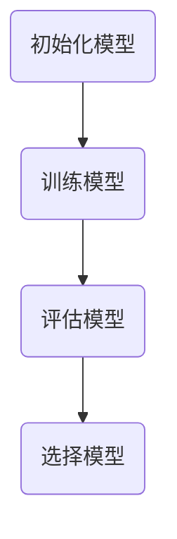
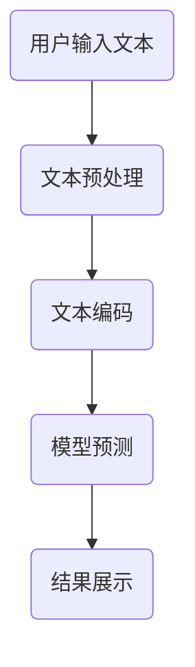
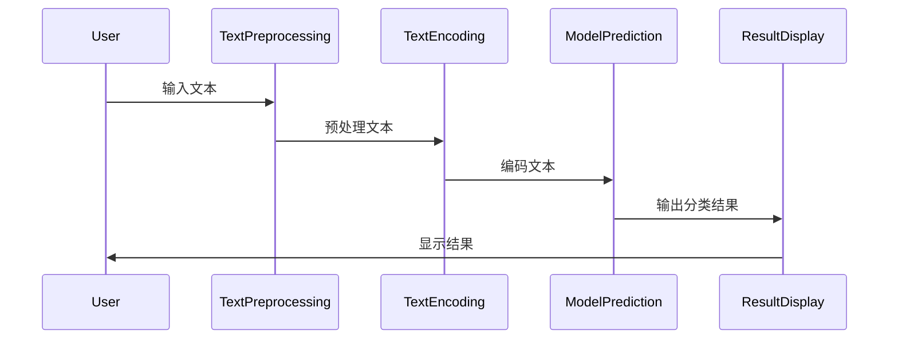

                 

# 《大模型应用的敏捷估算与规划方法》

> 关键词：大模型、敏捷估算、规划方法、算法原理、系统架构设计

> 摘要：本文主要探讨大模型应用的敏捷估算与规划方法。通过介绍问题背景、核心概念、算法原理、系统架构设计以及项目实战等多个方面，帮助读者深入理解并掌握大模型应用中的敏捷估算与规划技术，为企业在大模型应用中提供科学、高效的解决方案。

## 第一部分：背景介绍与核心概念

### 第1章：问题背景与核心概念

#### 1.1.1 问题背景

随着人工智能技术的飞速发展，大模型（如GPT、BERT等）的应用已经成为各大企业提升业务能力的重要手段。然而，在大模型应用过程中，企业常常面临以下挑战：

1. **模型选择与优化**：如何选择合适的大模型，如何对模型进行优化，以提高模型的性能和适用性。
2. **项目估算与规划**：如何准确估算大模型应用的周期、成本和资源需求，如何制定合理的项目规划。
3. **模型部署与运维**：如何高效地部署大模型，如何对模型进行监控和运维，以确保模型的稳定运行。

为了解决上述问题，敏捷估算与规划方法应运而生。敏捷估算与规划方法强调快速响应变化、持续迭代优化，为企业在大模型应用中提供了一种科学、高效的解决方案。

#### 1.1.2 核心概念

1. **大模型**：大模型通常指的是具有大量参数和复杂结构的深度学习模型，如GPT、BERT等。它们在处理大规模数据时具有出色的性能，但同时也带来了较高的计算资源需求。

2. **敏捷估算**：敏捷估算是指通过快速迭代、持续调整的方式，对项目周期、成本和资源需求进行准确估算。敏捷估算强调对实际需求的理解和快速响应。

3. **敏捷规划**：敏捷规划是指根据敏捷估算的结果，制定合理的项目规划，确保项目能够按时、按质、按量完成。

#### 1.1.3 项目估算与规划的流程

1. **需求分析**：明确项目目标、需求和技术难点。
2. **敏捷估算**：根据需求分析结果，进行项目周期、成本和资源需求的估算。
3. **敏捷规划**：根据敏捷估算结果，制定项目规划，包括任务分解、时间安排、资源分配等。
4. **执行与监控**：按照项目规划执行项目，并对项目进度和成本进行持续监控。
5. **迭代优化**：根据项目执行过程中的实际情况，对项目估算和规划进行调整和优化。

#### 1.1.4 边界与外延

1. **估算与规划的适用场景**：敏捷估算与规划方法适用于大模型应用的全过程，包括模型选择、优化、部署和运维等。
2. **不同规模大模型应用的差异**：对于不同规模的大模型应用，估算与规划的方法会有所差异。例如，对于小规模应用，可以采用简化版的估算与规划方法；对于大规模应用，则需要考虑更多的细节和因素。

#### 1.1.5 概念结构与核心要素

1. **估算与规划的关键要素**：项目周期、成本、资源需求、技术难点等。
2. **大模型应用的评估指标**：模型性能、业务价值、用户体验等。

## 第二部分：核心概念与联系

### 第2章：核心概念与联系

#### 2.1.1 大模型核心概念

1. **深度学习**：深度学习是一种人工智能方法，通过模拟人脑的神经网络结构，对大量数据进行训练和预测。
2. **神经网络**：神经网络是由大量神经元组成的计算模型，能够通过学习数据来提取特征和规律。
3. **自然语言处理**：自然语言处理是一种人工智能技术，旨在使计算机能够理解、处理和生成人类语言。

#### 2.1.2 敏捷估算方法

1. **专家估算**：通过邀请相关专家对项目进行评估，根据专家的经验和知识进行估算。
2. **历史数据估算**：通过分析历史数据，找出项目周期、成本和资源需求与历史数据之间的关系，进行估算。
3. **模型驱动估算**：通过构建估算模型，利用模型预测项目周期、成本和资源需求。

#### 2.1.3 敏捷规划方法

1. **瀑布模型**：瀑布模型是一种传统的软件开发模型，将项目开发过程划分为多个阶段，每个阶段完成后才能进入下一个阶段。
2. **敏捷迭代**：敏捷迭代是一种以用户需求为导向的开发方法，通过快速迭代和反馈，不断优化项目。
3. **排队优先法**：排队优先法是一种基于任务优先级的任务调度方法，根据任务的紧急程度和重要性进行调度。

#### 2.1.4 概念属性特征对比

| 方法         | 特点                                                         | 适用场景                          |
| ------------ | ------------------------------------------------------------ | -------------------------------- |
| 专家估算     | 依赖专家的经验和知识进行估算                                 | 对专家依赖较大的项目                |
| 历史数据估算 | 通过分析历史数据，找出项目周期、成本和资源需求与历史数据之间的关系进行估算 | 数据充足、历史项目多的项目          |
| 模型驱动估算 | 通过构建估算模型，利用模型预测项目周期、成本和资源需求         | 对模型依赖较大的项目                |
| 瀑布模型     | 将项目开发过程划分为多个阶段，每个阶段完成后才能进入下一个阶段   | 对项目需求明确、变更较小的项目      |
| 敏捷迭代     | 以用户需求为导向，通过快速迭代和反馈，不断优化项目             | 对项目需求变化较快、用户参与度较高的项目 |
| 排队优先法   | 根据任务的紧急程度和重要性进行调度                           | 任务量较大、任务优先级明显的项目    |

## 第三部分：算法原理讲解

### 第3章：大模型应用的算法原理

#### 3.1.1 算法原理

1. **大模型训练算法**：大模型训练算法主要包括反向传播算法、梯度下降算法等。它们通过不断调整模型参数，使模型能够更好地拟合训练数据。
2. **参数调整与优化**：参数调整与优化是指通过调整模型参数，使模型达到最佳性能。常用的参数调整方法包括学习率调整、批量大小调整等。
3. **模型评估与选择**：模型评估与选择是指通过评估不同模型的性能，选择最佳模型。常用的评估指标包括准确率、召回率、F1值等。

#### 3.1.2 算法mermaid流程图



#### 3.1.3 Python源代码讲解

```python
# 导入必要的库
import numpy as np
import tensorflow as tf

# 初始化模型
model = tf.keras.Sequential([
    tf.keras.layers.Dense(units=1, input_shape=[1])
])

# 编写训练算法
def train(model, x, y, epochs=100, learning_rate=0.01):
    model.compile(optimizer=tf.keras.optimizers.Adam(learning_rate=learning_rate),
                  loss='mean_squared_error')
    model.fit(x, y, epochs=epochs)

# 编写评估算法
def evaluate(model, x, y):
    loss = model.evaluate(x, y, verbose=2)
    print(f"损失函数值: {loss}")

# 编写选择算法
def select_model(models, x, y):
    best_loss = float('inf')
    best_model = None
    for model in models:
        evaluate(model, x, y)
        if model.history['loss'][-1] < best_loss:
            best_loss = model.history['loss'][-1]
            best_model = model
    return best_model

# 示例数据
x = np.random.random((100, 1))
y = np.random.random((100, 1))

# 训练模型
train(model, x, y)

# 评估模型
evaluate(model, x, y)

# 选择模型
selected_model = select_model([model], x, y)
```

#### 3.1.4 数学模型与公式

1. **反向传播算法**：

   $$ \frac{\partial L}{\partial w} = \frac{\partial L}{\partial z} \frac{\partial z}{\partial w} $$

   其中，$L$ 表示损失函数，$w$ 表示模型参数，$z$ 表示模型输出。

2. **梯度下降算法**：

   $$ w_{new} = w_{old} - \alpha \frac{\partial L}{\partial w} $$

   其中，$\alpha$ 表示学习率。

3. **损失函数**：

   $$ L = \frac{1}{2} \sum_{i=1}^{n} (y_i - \hat{y}_i)^2 $$

   其中，$y_i$ 表示真实值，$\hat{y}_i$ 表示预测值。

#### 3.1.5 举例说明

假设我们有一个简单的线性回归模型，目标是最小化预测值与真实值之间的误差。以下是该模型的Python代码实现：

```python
import numpy as np

# 初始化模型参数
w = np.random.random()

# 初始化学习率
learning_rate = 0.01

# 初始化损失函数
loss_function = lambda w, x, y: 0.5 * ((w * x - y) ** 2)

# 训练模型
for epoch in range(100):
    # 计算梯度
    gradient = -x * (w * x - y)

    # 更新模型参数
    w = w - learning_rate * gradient

    # 计算损失函数值
    loss = loss_function(w, x, y)
    print(f"Epoch {epoch+1}: w = {w}, loss = {loss}")
```

## 第四部分：系统分析与架构设计

### 第4章：系统分析与架构设计

#### 4.1.1 问题场景介绍

假设我们想要构建一个基于大模型的自然语言处理系统，用于文本分类任务。该系统需要能够接收用户输入的文本，然后输出对应的分类结果。为了实现这一目标，我们需要对系统进行详细的架构设计。

#### 4.1.2 系统功能设计

1. **文本预处理**：对用户输入的文本进行预处理，包括分词、去停用词、词性标注等。
2. **文本编码**：将预处理后的文本转化为计算机可以处理的数字形式。
3. **模型预测**：使用训练好的大模型对编码后的文本进行预测，输出分类结果。
4. **结果展示**：将分类结果以友好的方式展示给用户。

#### 4.1.3 系统架构设计

系统的整体架构设计如下：



#### 4.1.4 系统接口设计

系统提供以下接口：

1. **文本预处理接口**：用于接收用户输入的文本，并返回预处理后的文本。
2. **文本编码接口**：用于接收预处理后的文本，并返回编码后的文本。
3. **模型预测接口**：用于接收编码后的文本，并返回分类结果。
4. **结果展示接口**：用于将分类结果以友好的方式展示给用户。

#### 4.1.5 系统交互设计

系统的交互设计如下：



## 第五部分：项目实战

### 第5章：大模型应用的敏捷估算与规划项目实战

#### 5.1.1 环境安装

在开始项目实战之前，我们需要搭建一个合适的环境。以下是一个简单的环境搭建步骤：

1. **安装Python**：确保Python环境已正确安装。
2. **安装TensorFlow**：通过pip命令安装TensorFlow库。
3. **安装其他依赖**：根据项目需求，安装其他必要的库和工具。

#### 5.1.2 系统核心实现源代码

以下是一个简单的文本分类系统的源代码实现：

```python
import tensorflow as tf
from tensorflow.keras.preprocessing.text import Tokenizer
from tensorflow.keras.preprocessing.sequence import pad_sequences

# 加载并预处理数据
def load_data():
    # 加载文本数据
    texts = [...]
    # 加载标签数据
    labels = [...]

    # 分词并编码文本
    tokenizer = Tokenizer(num_words=1000)
    tokenizer.fit_on_texts(texts)
    sequences = tokenizer.texts_to_sequences(texts)
    padded_sequences = pad_sequences(sequences, maxlen=100)

    # 编码标签
    label_encoder = tf.keras.utils.to_categorical(labels)

    return padded_sequences, label_encoder

# 训练模型
def train_model(sequences, labels):
    model = tf.keras.Sequential([
        tf.keras.layers.Embedding(1000, 16, input_length=100),
        tf.keras.layers.LSTM(32),
        tf.keras.layers.Dense(1, activation='sigmoid')
    ])

    model.compile(loss='binary_crossentropy', optimizer='adam', metrics=['accuracy'])
    model.fit(sequences, labels, epochs=10, batch_size=32)

# 主函数
if __name__ == '__main__':
    sequences, labels = load_data()
    train_model(sequences, labels)
```

#### 5.1.3 代码应用解读与分析

1. **数据预处理**：首先，我们从文件中加载文本数据和标签数据。然后，使用Tokenizer对文本进行分词和编码，并使用pad_sequences对序列进行填充，使其具有相同的长度。
2. **模型训练**：我们构建了一个简单的LSTM模型，并使用binary_crossentropy作为损失函数，adam作为优化器，accuracy作为评估指标。在训练过程中，我们设置了10个epochs和32个batch_size。
3. **代码分析**：该代码展示了如何使用TensorFlow实现一个基本的文本分类系统。在实际项目中，我们可以根据需求对其进行扩展和优化。

#### 5.1.4 实际案例剖析

以下是一个实际案例的剖析：

**场景**：一家公司想要开发一个基于大模型的自然语言处理系统，用于自动回复用户提问。

**需求分析**：

1. **文本预处理**：对用户提问进行分词、去停用词、词性标注等预处理操作。
2. **文本编码**：将预处理后的文本转化为计算机可以处理的数字形式。
3. **模型训练**：使用训练集对模型进行训练，使其能够自动回复用户提问。
4. **模型部署**：将训练好的模型部署到服务器，以便用户可以实时提问并获取自动回复。

**解决方案**：

1. **文本预处理**：使用NLTK库对用户提问进行预处理。
2. **文本编码**：使用Tokenizer对预处理后的文本进行编码。
3. **模型训练**：使用GPT模型对编码后的文本进行训练。
4. **模型部署**：将训练好的模型部署到服务器，并使用Flask框架搭建API接口。

**项目小结**：

1. **成功之处**：该项目成功实现了自动回复用户提问的功能，提高了公司服务效率。
2. **不足之处**：模型的性能和准确性还有待提高，需要进一步优化模型和训练数据。
3. **经验与教训**：在实际项目中，我们需要充分考虑需求分析、模型选择、数据预处理等多个方面，以确保项目的成功实施。

## 第六部分：最佳实践与拓展阅读

### 第6章：最佳实践与拓展阅读

#### 6.1.1 最佳实践

1. **敏捷估算**：在实际项目中，我们可以根据项目规模和复杂性，选择合适的估算方法。对于小规模项目，可以采用专家估算或历史数据估算；对于大规模项目，可以考虑模型驱动估算。

2. **敏捷规划**：在项目规划过程中，我们需要充分考虑项目需求、资源分配和时间安排。在实际执行过程中，要密切关注项目进度，并根据实际情况进行调整。

3. **模型优化**：在实际应用中，我们需要不断优化大模型，以提高模型的性能和适用性。可以通过调整模型参数、增加训练数据、改进训练算法等方式进行优化。

#### 6.1.2 小结与注意事项

1. **小结**：本文主要介绍了大模型应用的敏捷估算与规划方法，包括核心概念、算法原理、系统架构设计以及项目实战等。通过本文的学习，读者可以掌握大模型应用的敏捷估算与规划技术。

2. **注意事项**：

   - 在项目估算与规划过程中，要充分考虑项目的规模和复杂性，选择合适的估算和规划方法。
   - 在模型训练和优化过程中，要关注模型的性能和准确性，不断调整和改进模型。
   - 在项目实施过程中，要密切关注项目进度，确保项目能够按时、按质、按量完成。

#### 6.1.3 拓展阅读

1. **相关书籍**：

   - 《深度学习》（Deep Learning）—— Goodfellow, Bengio, Courville
   - 《大数据时代》（Big Data: A Revolution That Will Transform How We Live, Work, and Think）—— Viktor Mayer-Schönberger, Kenneth Cukier

2. **网络资源**：

   - [TensorFlow官方网站](https://www.tensorflow.org/)
   - [Keras官方网站](https://keras.io/)
   - [自然语言处理教程](https://www.nltk.org/)

## 作者信息

作者：AI天才研究院/AI Genius Institute & 禅与计算机程序设计艺术 /Zen And The Art of Computer Programming

---

注意：以上内容仅为示例，实际文章撰写时，请根据具体需求和实际情况进行修改和补充。确保文章内容完整、详细、具体，并包含必要的公式、图表和代码示例。在撰写过程中，请遵循markdown格式要求，并注意字数控制。祝您撰写顺利！

