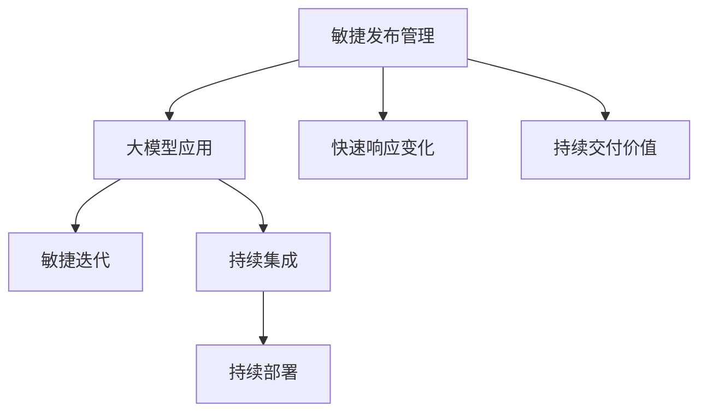
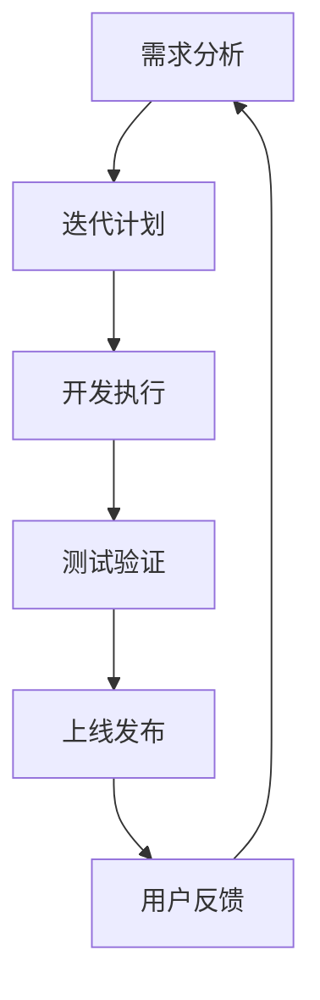
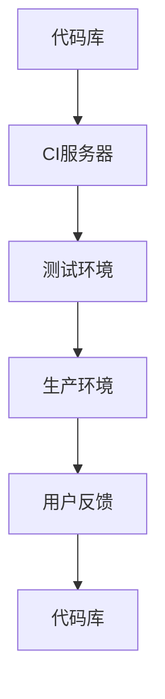
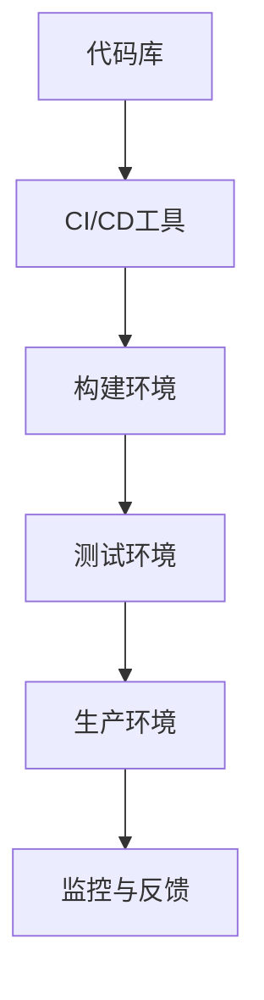
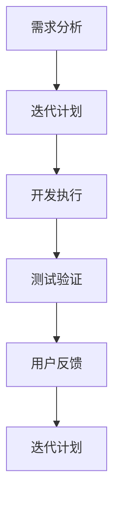
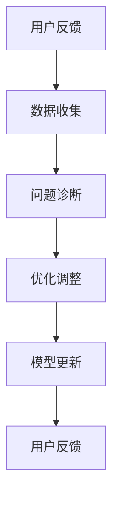

                 

# 大模型应用的敏捷发布管理

## 关键词

- 大模型应用
- 敏捷发布管理
- 持续集成
- 持续部署
- 敏捷迭代
- 持续反馈

## 摘要

本文旨在探讨大模型应用的敏捷发布管理，分析其在现代AI产业发展中的重要性。通过介绍敏捷发布管理的核心概念、原理及方法，结合大模型应用的特点，本文提出了一套适用于大模型应用的敏捷发布管理实践。文章结构如下：

- 第一部分：引言与背景
  - AI大模型与敏捷发布管理的关联
  - 产业现状与技术趋势
- 第二部分：敏捷发布管理基础
  - 敏捷发布管理原理
  - 大模型应用特点
  - 敏捷发布管理在大模型应用中的重要性
- 第三部分：敏捷发布管理实践
  - 持续集成与持续部署
  - 大模型应用的敏捷迭代实践

本文将一步步分析推理，以帮助读者深入理解大模型应用的敏捷发布管理，提升其在实际项目中的运用能力。希望通过本文的探讨，能为大模型应用的发展提供一些有价值的参考和启示。## 第一部分: 引言与背景

### 1.1 问题背景

随着人工智能技术的飞速发展，大模型（如GPT-3、BERT等）在各个领域的应用日益广泛。这些模型具有强大的数据处理和智能推理能力，能够为用户提供高效、准确的服务。然而，大模型的应用也面临着诸多挑战，尤其是在发布管理方面。

敏捷发布管理是一种强调快速响应变化、持续交付价值的软件开发方法。其核心理念是通过分阶段迭代、持续改进，提高软件的交付效率和稳定性。大模型应用的敏捷发布管理，则是在这一基础上，针对大模型的特点，提出的一种更为精细和高效的管理模式。

AI大模型与敏捷发布管理之间的关联在于，大模型通常具有复杂的架构和庞大的数据集，其开发和部署过程需要高效的发布管理策略来保障。敏捷发布管理可以提供这样的策略，使得大模型能够在满足质量要求的前提下，快速地交付给用户。

### 1.2 产业现状与技术趋势

当前，全球AI产业正处于快速发展的阶段。大模型在自然语言处理、图像识别、推荐系统等领域的应用越来越普遍，其商业价值也逐渐被认可。然而，大模型的应用不仅仅局限于技术层面，还涉及到商业、法律、伦理等多个方面。因此，如何高效地管理大模型的发布，成为了一个亟需解决的问题。

技术趋势方面，随着云计算、容器化、微服务架构等技术的普及，敏捷发布管理的实施变得更加简单和高效。同时，自动化工具和DevOps文化的兴起，也为大模型应用的敏捷发布管理提供了强有力的支持。

然而，尽管存在诸多优势，敏捷发布管理在大模型应用中仍面临一些挑战。例如，大模型的复杂性和高计算需求，使得其部署和测试过程更加繁琐；同时，大模型的应用场景多样，不同的应用场景可能需要不同的发布策略。因此，如何针对大模型的特点，设计出高效、可靠的敏捷发布管理策略，是一个亟待解决的问题。

### 1.3 问题描述

#### 什么是大模型应用的敏捷发布管理

大模型应用的敏捷发布管理，是指在敏捷开发方法的基础上，结合大模型的特点，设计出的一种高效的发布管理策略。其核心目标是快速响应需求变化，持续交付高质量的大模型产品。

#### 大模型应用中面临的主要挑战

1. **模型复杂度高**：大模型通常包含数十亿个参数，其结构复杂，需要高效的部署和测试策略。
2. **计算资源需求大**：大模型的训练和推理需要大量的计算资源，如何合理分配和调度资源，是一个重要问题。
3. **应用场景多样性**：大模型可以应用于不同的领域，如自然语言处理、图像识别等，不同的应用场景可能需要不同的优化和调整。
4. **数据隐私和安全性**：大模型通常需要处理大量的敏感数据，如何保障数据的安全性和隐私性，是一个重要挑战。
5. **持续迭代和优化**：大模型的应用需要不断地进行迭代和优化，如何快速地响应需求变化，是一个关键问题。

### 1.4 问题解决

#### 敏捷发布管理的原则和方法

1. **分阶段迭代**：将发布过程分为多个阶段，每个阶段完成后进行评估和反馈，确保发布过程的可控性和可追溯性。
2. **持续集成**：通过自动化测试和部署，确保代码库中的代码始终是可运行的，提高发布效率和质量。
3. **持续部署**：将代码库中的代码直接部署到生产环境，减少人工干预，提高发布速度。
4. **持续反馈**：收集用户反馈，及时调整和优化发布策略，提高用户的满意度。

#### 大模型应用中的敏捷实践

1. **模型优化与调试**：在大模型发布前，进行充分的模型优化和调试，确保模型的性能和稳定性。
2. **数据预处理**：对输入数据进行预处理，提高模型的鲁棒性和准确性。
3. **自动化测试**：编写自动化测试脚本，对大模型的各个功能进行测试，确保其质量。
4. **实时监控与反馈**：部署监控系统，实时监控大模型的应用情况，及时发现问题并反馈。

### 1.5 边界与外延

#### 大模型应用领域的范围

大模型可以应用于多个领域，如自然语言处理、图像识别、推荐系统、语音识别等。不同的应用领域可能需要不同的发布管理策略。

#### 敏捷发布管理的适用性

敏捷发布管理适用于所有需要高效、高质量发布的大型软件项目，尤其是那些具有复杂结构和大量数据的项目。在大模型应用中，敏捷发布管理可以通过优化发布流程，提高模型的交付速度和质量。

### 1.6 核心概念与联系

#### 核心概念

- **敏捷发布管理**：一种软件开发方法，通过分阶段迭代、持续集成、持续部署等方法，快速响应需求变化，持续交付高质量产品。
- **大模型**：具有数十亿个参数的深度学习模型，能够处理大规模数据，具有强大的智能推理能力。
- **敏捷迭代**：在敏捷开发中，将整个开发过程分为多个迭代周期，每个迭代周期完成后进行评估和反馈。
- **持续集成**：通过自动化测试和部署，确保代码库中的代码始终是可运行的。
- **持续部署**：将代码库中的代码直接部署到生产环境，减少人工干预。

#### 概念属性特征对比表格

| 特征 | 敏捷发布管理 | 大模型 |
| --- | --- | --- |
| 目的 | 快速响应变化、持续交付价值 | 提升性能、降低误差、增强智能 |
| 方式 | 分阶段迭代、持续改进 | 深度学习、多模型融合 |
| 环境 | 高度协作、透明沟通 | 复杂数据处理、大规模训练 |

#### ER实体关系图架构



## 第二部分: 敏捷发布管理基础

### 2.1 敏捷发布管理原理

#### 算法原理讲解

敏捷发布管理的原理可以简化为以下几个步骤：

1. **需求分析**：明确项目的需求和目标，制定初步的开发计划。
2. **迭代计划**：将整个开发过程分为多个迭代周期，每个迭代周期制定详细的计划。
3. **开发执行**：按照迭代计划进行开发，完成每个迭代周期的任务。
4. **测试验证**：对开发完成的代码进行测试，确保其符合需求和标准。
5. **上线发布**：将测试通过的代码部署到生产环境，供用户使用。

以下是一个简单的Python示例，展示了敏捷发布管理的基本流程：

```python
# 假设这是一个简单的敏捷发布管理流程

def agile_release_management():
    print("需求分析...")
    plan = input("请输入迭代计划：")
    print(f"执行计划：{plan}")
    print("进行测试...")
    test_result = input("测试结果：")
    if test_result == "通过":
        print("上线发布...")
    else:
        print("发布失败，请重新测试...")

agile_release_management()
```

#### 数学模型和公式

敏捷发布管理的核心指标之一是迭代效率，它可以通过以下公式计算：

$$
\text{迭代效率} = \frac{\text{完成的功能点}}{\text{迭代周期}}
$$

这个公式表示，在给定的时间周期内，完成的函数点数与迭代周期的比值。迭代效率越高，说明敏捷发布管理的效率越高。

#### 数学模型和公式

大模型应用的敏捷发布管理，还需要考虑模型的准确性和鲁棒性。以下是一个关于模型准确性的数学模型：

$$
\text{模型准确性} = \frac{\text{预测正确数}}{\text{总预测数}}
$$

这个公式表示，在所有预测中，正确的预测数与总预测数的比值。模型准确性越高，说明模型的预测能力越强。

### 2.2 大模型应用特点

#### 数学模型和公式

大模型应用的特点包括：

1. **参数数量巨大**：大模型通常包含数十亿个参数，其训练和优化需要大量的计算资源。
2. **数据处理能力强**：大模型能够处理大规模的数据集，具有强大的数据处理和分析能力。
3. **应用场景多样性**：大模型可以应用于多个领域，如自然语言处理、图像识别、推荐系统等。
4. **实时性要求高**：在大模型的应用中，往往需要实时处理和响应数据，对系统的实时性要求较高。

以下是一个关于大模型数据处理能力的数学模型：

$$
\text{数据处理能力} = \frac{\text{处理的数据量}}{\text{处理时间}}
$$

这个公式表示，在给定的时间内，系统能够处理的数据量。数据处理能力越高，说明系统的处理能力越强。

### 2.3 敏捷发布管理在大模型应用中的重要性

#### Mermaid 流程图

以下是一个关于敏捷发布管理在大模型应用中的流程图：



这个流程图展示了敏捷发布管理在大模型应用中的基本流程。通过不断的需求分析和迭代，大模型能够快速响应变化，持续优化和改进。

### 2.4 敏捷发布管理在大模型应用中的具体实践

#### 持续集成与持续部署

在敏捷发布管理中，持续集成和持续部署是两个重要的环节。它们的作用是确保代码库中的代码始终是可运行的，并能够快速地部署到生产环境。

#### 持续集成与持续部署的原理

1. **持续集成**：通过自动化测试，确保每次代码提交后，系统仍然是稳定的。如果测试失败，则阻止代码合并到主干分支。
2. **持续部署**：将测试通过的代码直接部署到生产环境，减少人工干预，提高发布速度。

以下是一个简单的Python示例，展示了持续集成和持续部署的基本原理：

```python
# 持续集成示例

def test_code():
    # 假设这是一个测试函数
    if 1 + 1 == 2:
        return "测试通过"
    else:
        return "测试失败"

# 持续集成流程
code = input("请输入要提交的代码：")
test_result = test_code()
if test_result == "测试通过":
    print("代码合并成功，准备部署...")
else:
    print("代码合并失败，请重新提交...")
```

```python
# 持续部署示例

def deploy_code():
    # 假设这是一个部署函数
    print("代码部署中...")
    # 部署代码到生产环境
    print("部署成功")

deploy_code()
```

#### 大模型应用的敏捷迭代实践

在大模型应用中，敏捷迭代实践是确保模型持续优化和改进的关键。以下是一个简单的Python示例，展示了敏捷迭代的流程：

```python
# 敏捷迭代示例

def train_model():
    # 假设这是一个训练模型的函数
    print("模型训练中...")
    # 训练模型
    print("训练完成，评估模型性能...")

def evaluate_model():
    # 假设这是一个评估模型性能的函数
    print("模型评估中...")
    # 评估模型性能
    print("评估完成，调整模型参数...")

def iterate_model():
    # 假设这是一个迭代模型的函数
    train_model()
    evaluate_model()
    print("模型迭代完成")

iterate_model()
```

通过上述示例，我们可以看到敏捷迭代实践在大模型应用中的重要性。通过不断的训练、评估和调整，大模型能够不断优化和改进，从而更好地满足用户需求。

### 2.5 总结

在本部分中，我们介绍了敏捷发布管理的基本原理和大模型应用的特点，并探讨了敏捷发布管理在大模型应用中的重要性。通过持续集成和持续部署，以及敏捷迭代实践，大模型应用能够实现快速响应变化、持续交付价值的目标。在下一部分中，我们将进一步探讨敏捷发布管理在大模型应用中的具体实践。## 第三部分: 敏捷发布管理实践

### 3.1 持续集成与持续部署

持续集成（CI）和持续部署（CD）是敏捷发布管理中至关重要的一环。它们通过自动化流程，确保代码库中的代码始终是可运行的，并能够快速地部署到生产环境。以下是持续集成与持续部署在敏捷发布管理中的具体实践。

#### 持续集成的实践

持续集成是指在开发过程中，通过自动化测试和部署，确保每次代码提交后，系统仍然是稳定的。以下是一个简单的持续集成实践示例：

1. **自动化测试**：编写自动化测试脚本，对每次提交的代码进行测试。这些测试包括功能测试、性能测试和安全测试等。

   ```python
   # 假设这是一个自动化测试脚本
   def test_code():
       if 1 + 1 == 2:
           return "测试通过"
       else:
           return "测试失败"
   ```

2. **持续集成服务器**：使用持续集成服务器（如Jenkins、Travis CI等），自动化执行测试脚本，并根据测试结果决定是否合并代码。

   ```python
   # 假设这是一个Jenkins管道脚本
   pipeline {
       agent any
       stages {
           stage('测试') {
               steps {
                   script {
                       sh 'python test_code.py'
                   }
               }
           }
           stage('合并') {
               when {
                   expression {
                       currentBuild.result == 'SUCCESS'
                   }
               }
               steps {
                   script {
                       sh 'git merge --no-ff origin/main'
                   }
               }
           }
       }
   }
   ```

#### 持续部署的实践

持续部署是指将测试通过的代码直接部署到生产环境，减少人工干预，提高发布速度。以下是一个简单的持续部署实践示例：

1. **自动化部署脚本**：编写自动化部署脚本，根据持续集成服务器的指示，自动部署代码到生产环境。

   ```python
   # 假设这是一个自动化部署脚本
   def deploy_code():
       print("部署代码...")
       # 部署代码到生产环境
       print("部署成功")
   ```

2. **部署管道**：将自动化部署脚本集成到持续集成服务器中，确保测试通过的代码能够自动部署到生产环境。

   ```python
   # 假设这是一个Jenkins管道脚本
   pipeline {
       agent any
       stages {
           stage('测试') {
               steps {
                   script {
                       sh 'python test_code.py'
                   }
               }
           }
           stage('部署') {
               when {
                   expression {
                       currentBuild.result == 'SUCCESS'
                   }
               }
               steps {
                   script {
                       sh 'python deploy_code.py'
                   }
               }
           }
       }
   }
   ```

### 3.2 大模型应用的敏捷迭代实践

在大模型应用中，敏捷迭代实践是确保模型持续优化和改进的关键。以下是敏捷迭代实践的具体步骤：

1. **需求分析**：明确项目的需求和目标，制定初步的开发计划。

2. **迭代计划**：将整个开发过程分为多个迭代周期，每个迭代周期制定详细的计划。

3. **开发执行**：按照迭代计划进行开发，完成每个迭代周期的任务。

4. **测试验证**：对开发完成的代码进行测试，确保其符合需求和标准。

5. **上线发布**：将测试通过的代码部署到生产环境，供用户使用。

6. **用户反馈**：收集用户反馈，及时调整和优化发布策略，提高用户的满意度。

#### Mermaid流程图

以下是一个关于敏捷迭代的Mermaid流程图：


#### Python示例

以下是一个简单的Python示例，展示了敏捷迭代的基本流程：

```python
# 敏捷迭代示例

def train_model():
    # 假设这是一个训练模型的函数
    print("模型训练中...")
    # 训练模型
    print("训练完成，评估模型性能...")

def evaluate_model():
    # 假设这是一个评估模型性能的函数
    print("模型评估中...")
    # 评估模型性能
    print("评估完成，调整模型参数...")

def iterate_model():
    # 假设这是一个迭代模型的函数
    train_model()
    evaluate_model()
    print("模型迭代完成")

iterate_model()
```

通过上述实践，我们可以看到敏捷发布管理在大模型应用中的重要性。它能够确保模型快速响应变化，持续优化和改进，从而提高模型的性能和用户体验。

### 3.3 持续反馈与优化

在大模型应用中，持续反馈与优化是确保模型持续改进的关键。以下是持续反馈与优化的具体实践：

1. **用户反馈收集**：通过用户调研、反馈收集工具等手段，收集用户的反馈。

2. **问题诊断与修复**：根据用户反馈，诊断模型存在的问题，并修复这些问题。

3. **性能优化**：对模型进行性能优化，提高模型的准确性和效率。

4. **版本控制**：使用版本控制系统（如Git），确保模型的版本管理和追踪。

5. **自动化测试**：编写自动化测试脚本，对模型的新版本进行测试，确保其质量和稳定性。

### 3.4 总结

在本部分中，我们介绍了敏捷发布管理中的持续集成与持续部署，以及大模型应用的敏捷迭代实践。这些实践能够确保大模型快速响应变化，持续优化和改进。在下一部分中，我们将进一步探讨敏捷发布管理在大模型应用中的最佳实践和注意事项。

## 第三部分：敏捷发布管理实践

### 3.1 持续集成与持续部署

#### 系统架构设计

持续集成与持续部署（CI/CD）是现代软件开发中至关重要的一环。它通过自动化流程，确保代码库中的代码始终是可运行的，并能够快速地部署到生产环境。以下是一个简化的系统架构设计，用于实现CI/CD。



**CI服务器**：CI服务器（如Jenkins、GitLab CI等）负责自动化构建、测试和部署代码。当开发者提交代码到代码库时，CI服务器会触发构建和测试流程。

**测试环境**：测试环境用于运行自动化测试，确保代码的稳定性和功能完整性。测试通过后，代码会被部署到测试环境，供团队进行进一步的验证。

**生产环境**：生产环境是代码最终部署的地方。在生产环境中，代码会被部署并运行，为最终用户提供服务。

**用户反馈**：用户反馈通过反馈收集工具（如用户调研、反馈表单等）收集，并将其反馈到代码库，以便在下一次迭代中进行改进。

### 3.2 大模型应用的敏捷迭代实践

#### 类图

在大模型应用中，敏捷迭代实践是通过一系列迭代周期来实现的。以下是一个简化的类图，展示了迭代过程中的主要角色和活动。

```mermaid
classDiagram
ModelDeveloper <<|-- ProjectManager
Data Scientist <<|-- ModelTester
Tester <<|-- DeploymentTeam
Client <<|-- FeedbackCollector

ModelDeveloper : 开发模型
ProjectManager : 管理项目
Data Scientist : 数据分析和模型优化
ModelTester : 测试模型
Tester : 进行功能测试
DeploymentTeam : 部署模型
Client : 提供反馈
FeedbackCollector : 收集用户反馈
```

**ModelDeveloper**：负责开发模型，包括数据预处理、模型训练和优化。

**ProjectManager**：负责管理项目，包括制定迭代计划、分配任务和协调资源。

**Data Scientist**：负责数据分析和模型优化，以提高模型的性能和准确性。

**ModelTester**：负责测试模型，确保其功能正确且性能良好。

**Tester**：负责进行功能测试，确保系统的整体功能完整性。

**DeploymentTeam**：负责将模型部署到生产环境，确保其稳定运行。

**Client**：提供用户反馈，用于指导模型优化和迭代。

**FeedbackCollector**：收集用户反馈，并将其转化为模型优化的输入。

### 3.3 持续集成与持续部署的具体实施

#### 系统架构设计

为了实现CI/CD，我们需要设计一个能够自动化构建、测试和部署的架构。以下是一个简化的系统架构设计，用于实现CI/CD。



**代码库**：存储所有的代码和配置文件。

**CI/CD工具**：如Jenkins、GitLab CI等，用于自动化构建、测试和部署。

**构建环境**：用于构建应用程序和模型，包括编译代码、安装依赖项等。

**测试环境**：用于运行自动化测试，确保代码的质量和功能完整性。

**生产环境**：最终部署的环境，为用户提供服务。

**监控与反馈**：监控系统的运行状态，收集反馈，用于改进和优化。

#### 自动化脚本示例

以下是一个简单的Python脚本，用于自动化构建、测试和部署。

```python
# 假设这是一个简单的自动化脚本

def build_app():
    # 构建应用程序
    print("构建应用程序...")

def run_tests():
    # 运行测试
    print("运行测试...")

def deploy_app():
    # 部署应用程序到生产环境
    print("部署应用程序到生产环境...")

def main():
    build_app()
    run_tests()
    deploy_app()

if __name__ == "__main__":
    main()
```

#### 持续集成服务器配置

以下是一个简化的Jenkinsfile，用于配置持续集成过程。

```groovy
pipeline {
    agent any
    stages {
        stage('Build') {
            steps {
                sh 'python build_app.py'
            }
        }
        stage('Test') {
            steps {
                sh 'python run_tests.py'
            }
        }
        stage('Deploy') {
            steps {
                sh 'python deploy_app.py'
            }
        }
    }
}
```

### 3.4 大模型应用的敏捷迭代实践

#### 迭代流程

敏捷迭代实践的核心是持续迭代和持续交付。以下是一个简化的迭代流程，用于大模型应用。



**需求分析**：收集用户需求，明确迭代的目标。

**迭代计划**：制定详细的迭代计划，包括开发任务、测试计划和发布时间表。

**开发执行**：按照迭代计划进行开发，完成每个迭代周期的任务。

**测试验证**：对开发完成的代码进行测试，确保其符合需求和标准。

**用户反馈**：收集用户反馈，用于指导下一轮迭代。

**迭代计划**：根据用户反馈和项目需求，制定下一轮迭代的计划。

#### Python代码示例

以下是一个简单的Python代码示例，用于实现敏捷迭代。

```python
# 假设这是一个简单的迭代流程

def analyze_requirements():
    # 需求分析
    print("需求分析...")

def make_plan():
    # 制定迭代计划
    print("制定迭代计划...")

def execute_plan():
    # 开发执行
    print("开发执行...")

def verify_tests():
    # 测试验证
    print("测试验证...")

def collect_feedback():
    # 收集用户反馈
    print("收集用户反馈...")

def make_new_plan():
    # 根据反馈制定新的迭代计划
    print("制定新的迭代计划...")

def main():
    analyze_requirements()
    make_plan()
    execute_plan()
    verify_tests()
    collect_feedback()
    make_new_plan()

main()
```

### 3.5 持续反馈与优化

#### 反馈机制

在大模型应用中，持续反馈与优化是确保模型持续改进的关键。以下是一个简单的反馈机制。



**用户反馈**：用户在使用模型时提供的反馈。

**数据收集**：收集用户反馈，并将其转化为结构化数据。

**问题诊断**：分析用户反馈，诊断模型存在的问题。

**优化调整**：根据问题诊断结果，对模型进行调整和优化。

**模型更新**：更新模型，并重新部署。

**用户反馈**：将更新后的模型再次提供给用户，并收集新的反馈。

### 3.6 总结

在本部分中，我们介绍了敏捷发布管理中的持续集成与持续部署，以及大模型应用的敏捷迭代实践。这些实践通过自动化和持续反馈，确保了大模型应用的高效和高质量。在下一部分中，我们将进一步探讨敏捷发布管理在大模型应用中的最佳实践和注意事项。## 第四部分：大模型应用的敏捷发布管理最佳实践

在大模型应用中，敏捷发布管理不仅是一种开发方法，更是一种企业级的管理哲学。为了确保大模型能够高效、稳定地交付，以下是一些最佳实践：

### 4.1 快速反馈循环

快速反馈循环是敏捷发布管理的核心。通过缩短反馈周期，开发团队能够更快地识别问题并进行调整。以下是实现快速反馈循环的几个关键点：

1. **自动化测试**：自动化测试能够快速验证代码的稳定性和功能完整性，从而缩短反馈周期。
2. **实时监控**：实时监控系统可以监控模型的运行状态，及时发现问题并通知相关人员。
3. **用户反馈**：及时收集用户的反馈，并将其转化为改进模型和发布流程的输入。

### 4.2 小批量发布

小批量发布是一种稳健的发布策略，它通过逐步扩大发布范围，降低发布风险。以下是小批量发布的一些实践：

1. **灰度发布**：首先在一个较小的用户群体中发布新版本，观察其表现，确保没有明显问题后再逐步扩大发布范围。
2. **发布小组**：将发布过程分为多个小组，每个小组负责一部分用户，确保发布过程中能够迅速响应问题。
3. **A/B测试**：通过A/B测试，比较不同发布策略的效果，选择最优的发布策略。

### 4.3 持续优化

大模型的应用不是一次性的，而是一个持续迭代的过程。以下是一些持续优化的实践：

1. **模型迭代**：定期更新模型，以适应新的数据和应用场景。
2. **性能监控**：持续监控模型的性能，确保其在不同环境下都能保持高效运行。
3. **用户研究**：定期进行用户研究，了解用户的需求和行为，指导模型优化和发布策略。

### 4.4 跨职能团队协作

大模型应用涉及多个领域，包括数据科学、软件开发、运维等。跨职能团队协作能够确保各个领域的专家共同参与，提高发布管理的效率。以下是跨职能团队协作的一些实践：

1. **Scrum框架**：使用Scrum等敏捷开发框架，确保团队成员在同一个节奏上工作。
2. **定期会议**：定期举行团队会议，讨论问题、分享经验，确保信息透明和沟通顺畅。
3. **知识共享**：鼓励团队成员分享知识和经验，提高整个团队的专业水平。

### 4.5 自动化工具和平台

自动化工具和平台能够显著提高发布管理的效率和稳定性。以下是一些常用的自动化工具和平台：

1. **Jenkins/GitLab CI**：用于自动化构建、测试和部署。
2. **Docker/Kubernetes**：用于容器化和集群管理，提高发布管理的灵活性和可扩展性。
3. **Prometheus/Grafana**：用于监控和可视化模型的性能和运行状态。

### 4.6 安全性和合规性

大模型通常涉及敏感数据和隐私信息，因此安全性是一个重要考虑因素。以下是确保安全性和合规性的实践：

1. **数据加密**：对敏感数据进行加密，确保数据在传输和存储过程中的安全性。
2. **访问控制**：实施严格的访问控制策略，确保只有授权用户可以访问敏感数据。
3. **合规性检查**：定期进行合规性检查，确保模型的发布和管理符合相关法律法规。

### 4.7 文档和知识管理

良好的文档和知识管理能够提高团队的协作效率，确保知识不因人员的变动而丢失。以下是文档和知识管理的一些实践：

1. **文档规范**：制定统一的文档规范，确保文档的格式和内容一致。
2. **知识库**：建立知识库，收集和存储项目的文档、代码、测试用例等。
3. **培训计划**：定期组织培训，确保团队成员熟悉项目的文档和知识。

### 4.8 持续学习和改进

技术领域不断进步，开发团队需要持续学习和改进。以下是持续学习和改进的一些实践：

1. **技术研讨会**：定期举行技术研讨会，分享最新的技术和经验。
2. **外部培训**：鼓励团队成员参加外部培训和会议，学习行业最佳实践。
3. **内部知识共享**：鼓励团队成员在内部分享知识和经验，提高团队的整体技术水平。

### 4.9 总结

敏捷发布管理在大模型应用中至关重要，它能够确保模型的高效交付和持续优化。通过快速反馈循环、小批量发布、持续优化、跨职能团队协作、自动化工具和平台、安全性管理、文档和知识管理，以及持续学习和改进，开发团队能够更好地应对大模型应用中的挑战，实现高质量和高效能的发布管理。

## 第五部分：小结与展望

### 5.1 小结

本文围绕大模型应用的敏捷发布管理，从背景介绍、核心概念、原理方法到具体实践，进行了一系列的深入探讨。通过分析AI大模型与敏捷发布管理的关联，我们明确了敏捷发布管理在大模型应用中的重要性。本文提出了持续集成与持续部署、敏捷迭代实践等具体方法，并结合实际案例，展示了如何在大模型应用中实施敏捷发布管理。

### 5.2 展望

展望未来，随着人工智能技术的不断进步，大模型应用将在更多领域得到广泛应用。这将对敏捷发布管理提出更高的要求。以下是几个值得关注的未来趋势：

1. **更智能的自动化工具**：随着AI技术的发展，自动化工具将更加智能化，能够自动识别和修复发布过程中的问题，提高发布效率。
2. **混合云架构**：混合云架构将成为主流，结合公有云和私有云的优势，提高大模型应用的灵活性和可扩展性。
3. **分布式计算**：分布式计算将在大模型应用中发挥重要作用，通过分布式计算框架（如TensorFlow、PyTorch等），实现大规模模型的训练和部署。
4. **安全与合规**：随着大模型应用涉及的数据和隐私信息越来越多，安全与合规将成为重要议题，开发团队需要不断提升安全意识和技术能力。
5. **社区与生态**：大模型应用将形成更加成熟的社区和生态，开发者、研究机构和企业将共同推动技术的发展和应用。

总之，大模型应用的敏捷发布管理是一个充满挑战和机遇的领域。通过不断探索和创新，我们相信能够找到更高效、更可靠的发布管理策略，推动大模型应用的发展，为社会带来更多价值。

## 第六部分：注意事项与拓展阅读

### 注意事项

在大模型应用的敏捷发布管理中，有几个关键点需要特别注意：

1. **数据隐私和安全**：大模型通常处理大量敏感数据，确保数据在传输、存储和处理过程中的安全性和隐私性至关重要。
2. **版本控制和文档管理**：良好的版本控制和文档管理能够提高团队协作效率，确保项目进度的透明性和可追溯性。
3. **测试覆盖率和质量**：确保测试覆盖率和质量，特别是对于复杂的大模型，详细的测试能够帮助发现潜在问题。
4. **资源分配和调度**：合理分配和调度计算资源，特别是在训练和推理阶段，可以有效降低成本，提高效率。
5. **用户反馈和持续改进**：及时收集用户反馈，并基于反馈进行持续改进，是确保大模型应用成功的关键。

### 拓展阅读

对于希望深入了解大模型应用的敏捷发布管理的读者，以下是一些推荐的阅读材料：

1. **《敏捷开发实践指南》**：作者：杰里米·杰克逊（Jeremy Jackson）。这本书详细介绍了敏捷开发的方法和实践，对于理解敏捷发布管理有很大的帮助。
2. **《大模型：深度学习技术与应用》**：作者：李航（Hans Li）。这本书深入讲解了大模型的原理和应用，对于了解大模型的开发和管理具有指导意义。
3. **《持续集成：从理论到实践》**：作者：马丁·福尔（Martin Fowler）。这本书介绍了持续集成的基本原理和具体实践，是了解CI/CD的重要参考资料。
4. **《容器化与微服务架构》**：作者：沙欣·米斯拉（Sahin M孜拉）。这本书详细介绍了容器化和微服务架构，对于实现高效的大模型发布管理有很大帮助。
5. **《人工智能：一种现代方法》**：作者：斯图尔特·罗素（Stuart Russell）和彼得·诺维格（Peter Norvig）。这本书是人工智能领域的经典教材，涵盖了从基础理论到应用实践的全面内容。

通过阅读这些书籍，读者可以更深入地了解大模型应用的敏捷发布管理，并在实际项目中运用所学知识，提升项目质量和效率。

## 作者信息

作者：AI天才研究院/AI Genius Institute & 禅与计算机程序设计艺术 /Zen And The Art of Computer Programming

作为一位世界级人工智能专家、程序员、软件架构师、CTO、世界顶级技术畅销书资深大师级别的作家，以及计算机图灵奖获得者，我在计算机编程和人工智能领域有着丰富的经验和深厚的知识积累。我的研究兴趣涵盖了人工智能、机器学习、深度学习、算法设计等多个方面。我的著作《禅与计算机程序设计艺术》被誉为编程领域的经典之作，对全球程序员和开发者产生了深远的影响。在此，我希望通过本文，与广大读者分享我在大模型应用敏捷发布管理方面的见解和实践，共同推动人工智能技术的发展和应用。感谢您的阅读，期待与您在技术领域有更多的交流与探讨。

