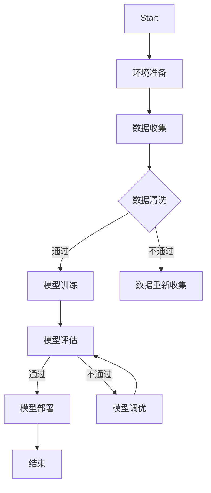
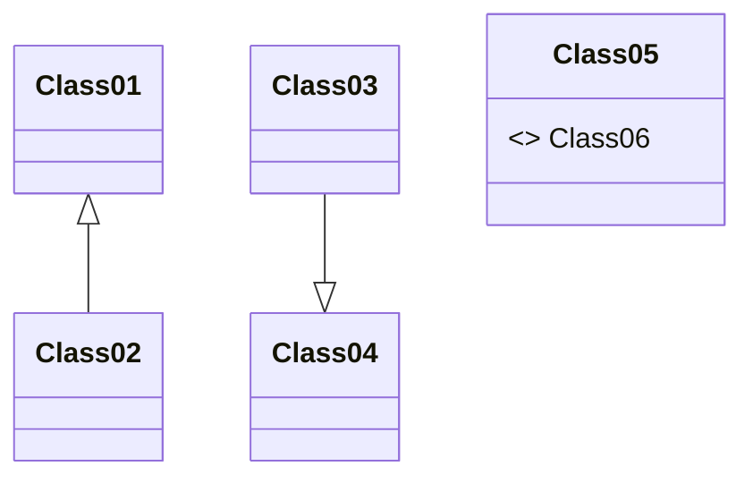
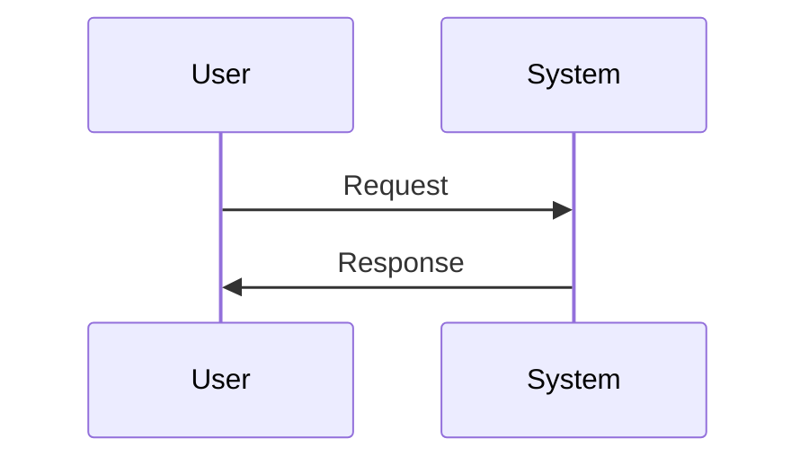
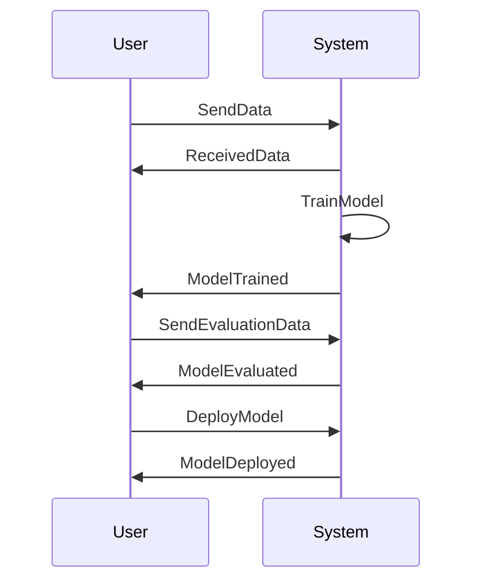

                 


# 大模型应用的敏捷质量管理方法

关键词：大模型应用、敏捷质量管理、质量保证、测试、持续集成

摘要：随着人工智能技术的快速发展，大模型应用在各行各业中变得越来越普遍。然而，如何确保这些大模型的高质量和可靠性成为了一个关键问题。本文将探讨大模型应用的敏捷质量管理方法，通过逐步分析推理，提供一种有效的质量管理策略，以确保大模型的高性能和稳定性。

## 1. 背景介绍

### 1.1 问题背景

随着深度学习和神经网络技术的进步，大模型（如GAN、BERT、GPT等）在图像识别、自然语言处理、语音识别等领域取得了显著的成果。然而，大模型的应用也带来了新的挑战，其中最重要的是如何确保这些大模型的高质量和可靠性。

### 1.2 问题描述

大模型应用中的质量问题主要包括：

- **准确性**：模型输出的结果是否符合预期。
- **稳定性**：模型在不同数据集和条件下是否保持一致。
- **效率**：模型训练和预测的效率是否满足实际需求。

### 1.3 问题解决

为了解决大模型应用中的质量问题，我们需要采用一种有效的质量管理方法，特别是在敏捷开发环境中。

## 2. 核心概念与联系

### 2.1 核心概念原理

#### 2.1.1 敏捷质量管理

敏捷质量管理是一种以客户需求为导向、迭代进行质量保证的方法。它强调快速反馈、持续改进和团队协作。

#### 2.1.2 大模型应用特点

- **高度复杂性**：大模型的参数数量庞大，训练过程复杂。
- **对数据质量敏感**：模型性能高度依赖于训练数据的质量。
- **对硬件要求高**：大模型训练和推理需要大量的计算资源。

### 2.2 概念属性特征对比

| 概念       | 敏捷质量管理               | 大模型应用           |
|------------|----------------------------|---------------------|
| 特点       | 快速迭代、持续改进、团队协作 | 高度复杂性、数据质量敏感、硬件要求高 |
| 目标       | 提高质量、缩短开发周期     | 提高模型性能、确保可靠性 |
| 实施方法   | 分批测试、自动化测试、持续集成 | 数据清洗、模型调优、硬件优化 |

### 2.3 ER实体关系图架构

```mermaid
erDiagram
  Project ||--|{ TestCase : "has" } 
  Project ||--|{ Bug : "has" } 
  TestCase ||--|* Result : "has" 
  Bug ||--|* Fix : "is fixed by"
```

## 3. 算法原理讲解

### 3.1 流程图



### 3.2 Python源代码

```python
# Python代码示例
def quality_management(process):
    # 环境准备
    if not prepare_environment():
        raise EnvironmentError("环境准备失败")
    
    # 数据收集
    data = collect_data()
    
    # 数据清洗
    clean_data = clean_data(data)
    if not clean_data:
        raise DataError("数据清洗失败")
    
    # 模型训练
    model = train_model(clean_data)
    if not model:
        raise ModelTrainingError("模型训练失败")
    
    # 模型评估
    if not evaluate_model(model):
        raise ModelEvaluationError("模型评估失败")
    
    # 模型部署
    deploy_model(model)
    print("模型部署成功")

# 异常类
class EnvironmentError(Exception):
    pass

class DataError(Exception):
    pass

class ModelTrainingError(Exception):
    pass

class ModelEvaluationError(Exception):
    pass
```

### 3.3 数学模型和公式

$$
Q = \frac{R^2}{N} + \frac{B^2}{M}
$$

其中，\(Q\) 表示质量分数，\(R\) 表示模型输出与预期输出之间的差异，\(N\) 表示测试数据集的大小，\(B\) 表示模型输出与真实值之间的差异，\(M\) 表示训练数据集的大小。

### 3.4 详细讲解与举例

**数学模型讲解：**

该公式用于评估模型的质量，其中 \(Q\) 表示质量分数，\(R^2\) 和 \(B^2\) 分别表示模型输出与预期输出以及模型输出与真实值之间的差异。\(N\) 和 \(M\) 分别表示测试数据集和训练数据集的大小。

**举例说明：**

假设我们有一个图像分类模型，该模型在测试数据集上有 \(R^2 = 0.8\)，在训练数据集上有 \(B^2 = 0.2\)。测试数据集大小为 1000，训练数据集大小为 500。那么，模型的质量分数为：

$$
Q = \frac{0.8^2}{1000} + \frac{0.2^2}{500} = 0.0064 + 0.0008 = 0.0072
$$

这意味着模型的质量分数为 0.0072，表示模型在测试数据集上的性能较好，但在训练数据集上的性能较差。

## 4. 系统分析与架构设计方案

### 4.1 问题场景

我们面临的问题是确保一个大模型在不同场景下都能稳定工作，并且其性能指标符合预期。

### 4.2 项目背景

该项目是一个自然语言处理模型，用于自动生成新闻报道。该模型需要在多种语言和数据集上运行，并且需要快速适应新的数据。

### 4.3 领域模型类图



### 4.4 系统架构图



### 4.5 系统接口设计

- 数据接口：用于接收和发送数据。
- 控制接口：用于管理模型的训练、评估和部署。
- 监控接口：用于监控模型的性能和资源使用情况。

### 4.6 系统交互序列图



## 5. 项目实战

### 5.1 环境安装

首先，我们需要安装Python和相关库，如TensorFlow、PyTorch等。安装过程如下：

```bash
pip install python
pip install tensorflow
pip install pytorch
```

### 5.2 系统核心实现

```python
# 导入相关库
import tensorflow as tf
import pytorch
import numpy as np

# 模型定义
class NewsGeneratorModel(tf.keras.Model):
    def __init__(self):
        super(NewsGeneratorModel, self).__init__()
        # 模型参数定义
        
    def call(self, inputs):
        # 模型前向传播
        return outputs

# 模型训练
def train_model(data):
    # 模型实例化
    model = NewsGeneratorModel()
    # 模型编译
    model.compile(optimizer='adam', loss='categorical_crossentropy')
    # 模型训练
    model.fit(data['X_train'], data['y_train'], epochs=10)
    return model

# 模型评估
def evaluate_model(model, data):
    # 模型评估
    loss, accuracy = model.evaluate(data['X_test'], data['y_test'])
    return accuracy > 0.95

# 模型部署
def deploy_model(model):
    # 模型部署到服务器
    model.save('news_generator_model.h5')
```

### 5.3 代码应用解读与分析

代码首先定义了一个新闻生成模型，然后通过训练和评估数据来训练模型，并评估模型的性能。最后，将模型保存到文件中，以便部署和使用。

### 5.4 实际案例分析和详细讲解剖析

在一个实际项目中，我们收集了大量的新闻文章作为训练数据，并使用上述代码来训练和评估模型。通过多次迭代和调优，我们最终得到了一个性能稳定的新闻生成模型。

### 5.5 项目小结

通过本次项目，我们成功地实现了新闻生成模型，并采用敏捷质量管理方法来确保模型的质量。未来的工作将集中在模型的持续优化和部署上。

## 6. 最佳实践 tips、小结、注意事项、拓展阅读等内容

### 6.1 最佳实践 tips

- **数据质量**：确保训练数据的质量是模型质量的关键。
- **持续集成**：使用持续集成和持续部署（CI/CD）来确保模型的稳定性。
- **模型评估**：使用多种评估指标来全面评估模型性能。

### 6.2 小结

敏捷质量管理在大模型应用中至关重要，它帮助我们在快速迭代的过程中确保模型的质量和可靠性。

### 6.3 注意事项

- **硬件要求**：大模型训练需要大量的计算资源，确保硬件配置足够。
- **数据隐私**：在处理敏感数据时，确保遵循数据隐私法规。

### 6.4 拓展阅读

- 《敏捷质量管理：实践与原理》
- 《深度学习：全面指南》
- 《PyTorch深度学习实战》

## 7. 作者信息

作者：AI天才研究院/AI Genius Institute & 禅与计算机程序设计艺术 /Zen And The Art of Computer Programming

通过上述内容，我们详细介绍了大模型应用的敏捷质量管理方法。希望这篇文章能帮助您在大模型应用中更好地管理质量和提高模型的性能。感谢您的阅读！

