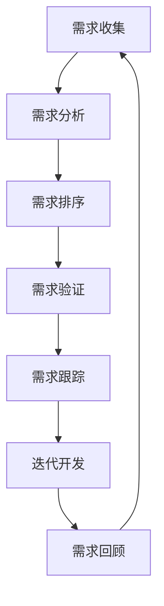

                 

### 第一步：确立文章主题和结构

为了撰写一篇关于《大模型应用的敏捷需求管理方法》的技术博客文章，我们首先要确立文章的主题和结构。本文将以逻辑清晰、结构紧凑、简单易懂的写作风格，分步骤介绍大模型应用的背景、敏捷需求管理的必要性、核心概念与原理、实践应用及案例研究等内容。以下是文章的总体结构：

1. **引言与背景**：介绍大模型应用的需求和挑战，阐述敏捷需求管理的意义。
2. **核心概念与原理**：详细解释大模型的基本概念、架构与原理。
3. **需求分析与建模**：讨论需求分析流程、用户需求收集和需求分类与优先级。
4. **敏捷需求管理流程**：介绍敏捷开发原理和敏捷需求管理的方法。
5. **案例研究**：通过具体案例展示敏捷需求管理在大模型应用中的实践。
6. **总结与展望**：总结文章的主要观点，提出存在的问题和未来的研究方向。

### 第二步：撰写引言与背景

**引言与背景**部分将为读者提供一个关于大模型应用和敏捷需求管理的初步了解。以下是这一部分的详细撰写思路：

#### 2.1 问题背景

- **技术发展**：随着深度学习和大数据技术的发展，大模型（如GPT、BERT等）在自然语言处理、图像识别等领域表现出色。
- **应用需求**：大模型的应用逐渐成为各行业解决复杂问题的利器，如智能客服、自动驾驶等。
- **挑战**：然而，大模型的应用也面临诸多挑战，包括数据隐私、模型解释性、训练成本等。

#### 2.2 大模型应用的挑战

- **数据隐私**：大模型的训练通常需要大量的个人数据，这引发了对数据隐私的担忧。
- **模型解释性**：大模型的决策过程往往是不透明的，缺乏解释性，难以被非专业人士理解。
- **训练成本**：大模型的训练过程非常耗费计算资源，需要大量的时间和金钱。

#### 2.3 敏捷需求管理的必要性

- **快速迭代**：为了保持竞争力，企业需要在短时间内快速部署和更新大模型。
- **需求变化**：市场需求和用户需求不断变化，传统的需求管理方法难以适应。
- **灵活性**：敏捷需求管理方法提供了一种灵活的方式来快速响应变化，确保项目的成功。

#### 2.4 书籍结构概述

- **引言与背景**：介绍大模型应用的需求和挑战，阐述敏捷需求管理的意义。
- **核心概念与原理**：详细解释大模型的基本概念、架构与原理。
- **需求分析与建模**：讨论需求分析流程、用户需求收集和需求分类与优先级。
- **敏捷需求管理流程**：介绍敏捷开发原理和敏捷需求管理的方法。
- **案例研究**：通过具体案例展示敏捷需求管理在大模型应用中的实践。
- **总结与展望**：总结文章的主要观点，提出存在的问题和未来的研究方向。

通过以上步骤，我们可以确保引言与背景部分的撰写既具有启发性又具备专业性，为后续章节的内容打下坚实的基础。在接下来的部分中，我们将逐步深入探讨大模型的核心概念与原理，以及敏捷需求管理的具体方法。## 第1章：引言与背景

### 1.1 问题背景

#### 大模型发展的迅猛态势

近年来，随着深度学习和大数据技术的不断发展，人工智能领域迎来了前所未有的机遇。大模型（Large Models）的概念逐渐成为研究的焦点。大模型指的是具有海量参数和复杂结构的机器学习模型，如GPT（Generative Pre-trained Transformer）、BERT（Bidirectional Encoder Representations from Transformers）等。这些模型通过大规模数据集的预训练，能够实现出色的自然语言处理、图像识别等任务。

大模型的快速发展不仅推动了AI技术的进步，也引发了各行业的广泛关注和应用。例如，在自然语言处理领域，GPT-3模型展示了强大的文本生成和语言理解能力，成为智能客服、内容创作等应用的关键工具。在图像识别领域，BERT-like模型则显著提升了图像分类和目标检测的准确率，为自动驾驶、医疗影像分析等领域提供了有力支持。

#### 大模型应用的重要方向

大模型的应用涵盖了多个领域，以下是其中几个重要方向：

1. **自然语言处理（NLP）**：大模型在文本生成、机器翻译、情感分析等方面展现出强大的能力。例如，GPT-3能够生成流畅且符合语法规则的文本，为自动内容创作和个性化推荐提供了新的解决方案。

2. **计算机视觉（CV）**：大模型在图像分类、目标检测、图像生成等方面具有显著优势。BERT-like模型在图像识别任务中，通过结合视觉和语言信息，提高了识别准确率和模型的解释性。

3. **自动驾驶**：大模型在自动驾驶系统中扮演着关键角色，用于实时感知环境、做出决策和规划路径。这些模型的训练和优化，使得自动驾驶车辆在复杂交通环境中的表现更加稳定和可靠。

4. **医疗健康**：大模型在医疗影像分析、疾病预测和个性化治疗方面展现了巨大潜力。通过分析大量的医疗数据，大模型能够帮助医生进行更准确的诊断和治疗方案制定。

#### 挑战与机遇并存

尽管大模型的应用前景广阔，但也面临诸多挑战。首先，数据隐私问题备受关注。大模型的训练通常需要大量的个人数据，如何确保这些数据的安全和隐私成为亟待解决的问题。其次，模型的解释性较差，其决策过程往往是不透明的，难以被非专业人士理解，这在某些关键应用场景中可能引发信任危机。此外，大模型的训练成本高昂，对计算资源的需求巨大，这在资源有限的环境下可能成为制约其广泛应用的瓶颈。

然而，这些挑战同时也带来了机遇。随着技术的进步，数据隐私保护技术、模型可解释性和优化算法的不断突破，有望解决这些难题。通过合理的需求管理和敏捷开发方法，企业可以更加高效地利用大模型，快速响应市场需求，实现技术红利最大化。

### 1.2 大模型应用的挑战

#### 数据隐私问题

大模型通常需要大量的训练数据，这些数据往往涉及用户的个人隐私。例如，在自然语言处理领域，模型需要阅读大量的用户文本数据来学习语言规律；在图像识别领域，模型需要处理大量的个人照片来训练识别算法。如何确保这些数据的隐私和安全，是当前大模型应用中面临的一个严峻挑战。一方面，数据泄露可能导致用户的隐私受到侵犯；另一方面，数据滥用可能导致模型的性能受损，甚至被恶意利用。

#### 模型解释性不足

大模型通常采用深度神经网络架构，其内部决策过程非常复杂，缺乏透明性。这使得用户难以理解模型的决策依据和推理过程，尤其是在涉及安全性和伦理性的应用场景中，如医疗诊断和自动驾驶。缺乏解释性的模型可能导致用户对模型的信任度降低，阻碍其广泛应用。

#### 训练成本高昂

大模型的训练过程通常需要大量的计算资源和时间。一方面，大规模的训练数据需要分布式计算和优化算法来提高训练效率；另一方面，大模型的优化和调参过程也非常耗时。这些因素共同导致大模型的训练成本非常高，这对中小型企业和资源有限的团队来说，是一个巨大的挑战。

#### 灵活性和适应性要求

随着市场需求的不断变化，大模型的应用需要具备较高的灵活性和适应性。传统的需求管理方法通常以固定的需求文档为依据，难以适应快速变化的需求。在敏捷开发框架下，需求管理变得更加灵活，能够快速响应变化，但这同时也对需求管理方法提出了新的要求。

#### 法规和伦理挑战

大模型的应用不仅涉及技术问题，还涉及法律和伦理问题。例如，如何确保模型的决策符合法律法规，如何处理可能出现的歧视性决策等。这些挑战需要从技术、法律和伦理等多个层面进行综合考虑和解决。

### 1.3 敏捷需求管理的必要性

#### 快速迭代与市场响应

在快速变化的市场环境中，企业需要能够快速响应市场需求，确保产品和服务能够及时更新。传统的需求管理方法往往以固定的需求文档为基础，周期较长，难以满足快速迭代的需求。敏捷需求管理方法通过灵活的需求收集和迭代过程，能够更快地响应市场变化，确保产品的竞争力。

#### 需求变化与适应性

市场需求和用户需求是不断变化的。传统的需求管理方法往往难以适应这些变化，导致项目进度延误、成本增加。敏捷需求管理方法强调需求的灵活性和适应性，通过持续的沟通和反馈机制，能够更好地应对需求变化，确保项目顺利进行。

#### 团队协作与沟通

敏捷需求管理方法强调团队协作和沟通。通过定期的会议、迭代计划和评审，团队成员能够更好地了解项目进展和需求变化，提高协作效率。这有助于确保需求管理的透明性和一致性，减少因沟通不畅导致的误解和冲突。

#### 提高项目成功率

敏捷需求管理方法能够更好地控制项目风险，提高项目成功率。通过持续的监控和调整，团队能够在项目早期发现和解决问题，减少项目延期和成本超支的风险。

### 1.4 书籍结构概述

本文书籍结构如下：

1. **引言与背景**：介绍大模型应用的需求和挑战，阐述敏捷需求管理的意义。
2. **核心概念与原理**：详细解释大模型的基本概念、架构与原理。
3. **需求分析与建模**：讨论需求分析流程、用户需求收集和需求分类与优先级。
4. **敏捷需求管理流程**：介绍敏捷开发原理和敏捷需求管理的方法。
5. **案例研究**：通过具体案例展示敏捷需求管理在大模型应用中的实践。
6. **总结与展望**：总结文章的主要观点，提出存在的问题和未来的研究方向。

通过以上结构，本书旨在为读者提供一个系统、全面的理解大模型应用和敏捷需求管理的方法，帮助读者应对实际工作中的挑战，实现高效的项目管理。## 第2章：大模型应用的核心概念

### 2.1 大模型的基本概念

#### 什么是大模型

大模型（Large Models）是指那些具有海量参数和复杂结构的机器学习模型，通常通过大规模数据集进行训练。这些模型能够自动学习和理解数据中的复杂模式，从而在各类任务中表现出色。大模型的代表包括GPT、BERT、ViT（Vision Transformer）等。与传统的中小型模型相比，大模型在参数量、数据集规模和计算资源需求上有着显著的提升。

#### 大模型的参数规模

大模型的参数规模通常达到数十亿甚至数万亿级别。例如，GPT-3拥有1750亿个参数，BERT拥有数亿个参数。这些庞大的参数量使得大模型能够在处理复杂任务时，具备更高的准确率和更强的泛化能力。

#### 大模型的训练过程

大模型的训练过程通常分为两个阶段：预训练和微调。在预训练阶段，模型在大规模数据集上进行训练，学习数据的统计特征和潜在规律。预训练完成后，模型在特定任务上进行微调，调整模型参数以适应具体的任务需求。

#### 大模型的优缺点

**优点：**
1. **强大的泛化能力**：大模型通过学习海量数据，能够更好地理解数据的多样性，具备更强的泛化能力。
2. **出色的表现**：大模型在各类任务中表现出色，如自然语言处理、图像识别、语音识别等。
3. **减少对数据量的依赖**：大模型能够在较少的数据集上实现良好的性能，减少对大规模数据的依赖。

**缺点：**
1. **训练成本高**：大模型的训练需要大量的计算资源和时间，训练成本高昂。
2. **解释性差**：大模型的决策过程往往缺乏透明性，难以解释其决策依据。
3. **数据隐私问题**：大模型的训练通常需要大量个人数据，引发数据隐私和安全问题。

### 2.2 大模型的架构与原理

#### 深度神经网络（DNN）

深度神经网络（DNN）是构建大模型的基础。DNN由多个隐层组成，通过非线性变换逐步提取数据特征。每一层神经网络都会对输入数据进行处理，然后传递到下一层。通过多层网络的学习，模型能够捕捉到数据中的复杂模式和深层次特征。

**优点：**
1. **强大的特征提取能力**：多层网络能够逐步提取数据的低级特征和高级特征，实现数据的非线性变换。
2. **良好的泛化能力**：通过多层网络的学习，模型能够更好地泛化到未见过的数据。

**缺点：**
1. **训练难度大**：随着网络层数的增加，模型的训练难度和计算资源需求显著增加。
2. **容易过拟合**：多层网络可能导致模型过度拟合训练数据，影响泛化能力。

#### Transformer架构

Transformer架构是近年来大模型的主流架构，尤其是在自然语言处理领域。与传统的循环神经网络（RNN）相比，Transformer采用了自注意力机制（Self-Attention），能够更好地处理长距离依赖问题。

**自注意力机制**：自注意力机制允许模型在处理每个输入时，考虑所有输入对当前输入的影响。通过计算输入之间的相似性，模型能够自动聚焦于与当前任务最相关的信息。

**多头注意力**：多头注意力将输入分割成多个头，每个头独立计算注意力权重，然后合并结果。这有助于模型捕捉到更丰富的信息。

**优点：**
1. **处理长距离依赖**：自注意力机制能够更好地处理长距离依赖问题，显著提高模型的性能。
2. **并行计算**：Transformer架构支持并行计算，提高了训练效率。

**缺点：**
1. **计算复杂度高**：多头注意力机制增加了计算复杂度，对计算资源有较高要求。
2. **内存占用大**：多头注意力机制需要存储大量的权重矩阵，增加了内存占用。

#### 大模型的训练方法

**预训练**：预训练是指在大规模数据集上训练模型，学习数据的通用特征和统计规律。预训练完成后，模型可以在特定任务上进行微调，调整模型参数以适应具体任务。

**微调**：微调是指在小规模数据集上对预训练模型进行微调，以适应特定任务的需求。微调过程通常通过冻结部分层并调整其他层的参数来实现。

**优缺点：**
- **优点**：预训练和微调能够提高模型的泛化能力，减少对训练数据的依赖。
- **缺点**：预训练和微调需要大量的计算资源和时间，训练成本较高。

### 2.3 大模型的应用领域

#### 自然语言处理（NLP）

自然语言处理是大模型的主要应用领域之一。大模型在文本生成、机器翻译、情感分析、问答系统等方面表现出色。例如，GPT-3能够生成流畅且符合语法规则的文本，BERT在文本分类和情感分析任务中具有出色的表现。

#### 计算机视觉（CV）

计算机视觉是大模型的另一个重要应用领域。大模型在图像分类、目标检测、图像生成等方面取得了显著进展。例如，BERT-like模型在图像识别任务中，通过结合视觉和语言信息，提高了识别准确率和模型的解释性。

#### 自动驾驶

自动驾驶是大模型在工业界的重要应用场景。大模型在环境感知、路径规划、决策制定等方面发挥着关键作用，使得自动驾驶系统能够在复杂交通环境中稳定运行。

#### 医疗健康

医疗健康是大模型的潜力领域之一。大模型在医疗影像分析、疾病预测、个性化治疗等方面展现了巨大潜力。通过分析大量的医疗数据，大模型能够帮助医生进行更准确的诊断和治疗方案制定。

#### 金融与经济

金融与经济领域是大模型的另一个重要应用场景。大模型在风险预测、投资策略、金融市场分析等方面具有广泛应用。通过分析大量的金融数据，大模型能够帮助金融机构做出更明智的决策。

### 总结

大模型的应用前景广阔，其在自然语言处理、计算机视觉、自动驾驶、医疗健康、金融与经济等领域的应用不仅推动了技术的进步，也为各行业带来了新的机遇。然而，大模型的应用也面临诸多挑战，如数据隐私、模型解释性、训练成本等。通过深入研究大模型的核心概念、架构与原理，以及探索敏捷需求管理的最佳实践，我们可以更好地应对这些挑战，实现大模型应用的价值最大化。## 第3章：需求分析

### 3.1 需求分析流程

需求分析是软件开发过程中的关键环节，它涉及对用户需求的理解、分析和定义。需求分析的流程可以大致分为以下几个阶段：

#### 1. 需求收集

需求收集是需求分析的起点，主要是通过访谈、问卷调查、用户观察等方式，收集用户的需求和期望。在需求收集过程中，开发者需要与不同利益相关者（如用户、项目经理、产品经理等）进行沟通，以确保全面、准确地了解用户的需求。

**方法：**
- **访谈**：与用户进行面对面的沟通，深入了解他们的使用场景和痛点。
- **问卷调查**：通过设计问卷，收集大量用户的需求和反馈。
- **用户观察**：在现场观察用户的使用行为，发现潜在需求。

#### 2. 需求分析

需求分析是对收集到的需求进行深入理解、分类和排序的过程。开发者需要将用户的需求转化为具体的需求文档，明确需求的功能性需求和非功能性需求。

**步骤：**
- **需求理解**：通过文档、会议等方式，确保对用户需求有准确的理解。
- **需求分类**：将需求分为功能性需求（如系统功能、性能需求）和非功能性需求（如安全性、可用性）。
- **需求排序**：根据需求的优先级，对需求进行排序，确保先实现关键需求。

#### 3. 需求验证

需求验证是确保需求符合用户期望和系统可行性的重要环节。开发者需要通过评审、测试等方式，验证需求的有效性和完整性。

**方法：**
- **评审**：组织利益相关者对需求文档进行评审，确保需求的正确性和可行性。
- **测试**：通过单元测试、集成测试等方式，验证需求在实现过程中的正确性。

#### 4. 需求管理

需求管理是确保需求在整个项目生命周期中得以有效管理和追踪的过程。开发者需要建立需求跟踪系统，记录需求的状态、优先级和实现进度。

**步骤：**
- **建立需求跟踪系统**：使用需求管理工具，记录和管理需求。
- **需求变更管理**：在项目进行过程中，需求可能会发生变化，需要及时调整需求和优先级。

### 3.2 用户需求收集

用户需求收集是需求分析的核心环节，直接影响需求分析的准确性和有效性。以下是几种常见的用户需求收集方法：

#### 1. 访谈

访谈是一种直接与用户进行沟通的方式，通过面对面的交流，深入了解用户的需求和期望。在访谈过程中，开发者可以提问、记录用户的反馈，以及观察用户的使用场景。

**优点：**
- **深入了解用户需求**：通过直接的交流，可以更准确地了解用户的需求和痛点。
- **发现潜在需求**：访谈过程中，用户可能会提到一些未意识到的重要需求。

**缺点：**
- **耗时较长**：需要花费大量时间进行访谈和整理反馈。
- **主观性较大**：用户可能会根据自己的理解表达需求，而非实际使用需求。

#### 2. 问卷调查

问卷调查是一种通过设计问卷，收集大量用户需求和反馈的方式。问卷可以通过线上或线下方式发放，适用于收集广泛用户的需求。

**优点：**
- **覆盖范围广**：可以通过互联网快速收集大量用户的需求和反馈。
- **高效便捷**：问卷调查可以节省时间和人力资源。

**缺点：**
- **数据质量参差不齐**：用户可能不认真填写问卷，导致数据质量不佳。
- **难以深入了解需求**：问卷通常只能收集到表面信息，难以深入了解用户的实际使用场景。

#### 3. 用户观察

用户观察是通过在真实使用场景中观察用户的行为，发现潜在需求和使用痛点。开发者可以在用户的日常工作中，观察他们的操作方式和使用习惯。

**优点：**
- **直接了解真实需求**：通过观察，可以直观地了解用户的需求和使用场景。
- **发现隐性需求**：用户可能不会主动表达的需求，通过观察可以被发现。

**缺点：**
- **受时间和地点限制**：用户观察需要在特定的时间和地点进行，可能无法覆盖所有用户。
- **主观性较大**：开发者可能无法完全理解用户的真实需求。

### 3.3 需求分类与优先级

在需求收集和分析过程中，需要对需求进行分类和优先级排序，以确保项目能够高效、有序地进行。以下是几种常见的需求分类和优先级排序方法：

#### 1. 需求分类

**按功能分类**：将需求分为不同的功能模块，如用户界面、数据处理、存储等。

**按优先级分类**：将需求分为高优先级、中优先级和低优先级，以确保关键需求先得到满足。

**按稳定性分类**：将需求分为稳定需求和不稳定需求，稳定需求是指在长时间内不会改变的需求，不稳定需求则可能会随着时间和市场变化而改变。

#### 2. 优先级排序

**基于价值排序**：根据需求对项目价值的大小进行排序，优先满足高价值需求。

**基于风险排序**：根据需求实现过程中可能遇到的风险和挑战进行排序，优先满足高风险需求。

**基于时间排序**：根据需求实现的时间紧迫性进行排序，优先满足时间紧迫的需求。

通过需求分类与优先级排序，开发者可以更清晰地了解项目需求，合理安排资源，确保项目能够按时、按质完成。## 第4章：敏捷需求管理方法

### 4.1 敏捷开发原理

敏捷开发（Agile Development）是一种以人为核心、迭代、循序渐进的开发方法。它强调项目开发过程中的灵活性、透明性和协作性，旨在快速响应市场变化和用户需求，提高项目成功率。以下是敏捷开发的几个核心原理：

#### 1. 用户优先

敏捷开发强调用户需求和满意度是项目的核心。通过持续的用户反馈和迭代开发，确保项目始终符合用户期望。

#### 2. 迭代开发

敏捷开发采用迭代的方式推进项目，每个迭代周期（通常为1-4周）都会产生一个可交付的版本。这种方式使得项目能够快速适应变化，提高开发效率。

#### 3. 协作与沟通

敏捷开发强调团队成员之间的密切合作和有效沟通。通过定期的会议和评审，团队成员能够及时了解项目进展和需求变化，提高协同效率。

#### 4. 持续改进

敏捷开发鼓励持续改进，通过反思和调整，不断优化开发流程和项目质量。这种方式使得项目能够保持高效的开发状态，提高产品质量。

#### 5. 响应变化

敏捷开发重视变化，鼓励团队在面对不确定性和需求变化时，能够灵活调整计划和策略，确保项目能够顺利推进。

### 4.2 敏捷需求管理流程

敏捷需求管理是敏捷开发的重要组成部分，旨在确保需求在整个项目生命周期中得到有效管理和实现。以下是敏捷需求管理的主要流程：

#### 1. 需求收集

需求收集是敏捷需求管理的起点，主要通过用户访谈、问卷调查、用户观察等方式，收集用户的需求和期望。敏捷需求管理强调持续的需求收集，以确保项目能够及时响应用户变化。

#### 2. 需求分析

需求分析是对收集到的需求进行深入理解和分类的过程。开发者需要将用户的需求转化为具体的需求文档，明确需求的功能性需求和非功能性需求。在敏捷需求管理中，需求分析通常是在迭代过程中进行，以适应快速变化的需求。

#### 3. 需求排序

需求排序是根据需求的重要性和优先级，对需求进行排序的过程。在敏捷需求管理中，需求排序通常采用优先级矩阵（如MoSCoW矩阵）或故事点等方式，以确保关键需求先得到满足。

#### 4. 需求验证

需求验证是确保需求符合用户期望和系统可行性的过程。开发者需要通过评审、测试等方式，验证需求的有效性和完整性。在敏捷需求管理中，需求验证通常在迭代周期结束时进行，以确保需求能够在下一个迭代中实现。

#### 5. 需求跟踪

需求跟踪是确保需求在整个项目生命周期中得到有效管理和追踪的过程。开发者需要建立需求跟踪系统，记录需求的状态、优先级和实现进度。在敏捷需求管理中，需求跟踪通常采用电子化的需求管理工具，以提高管理的效率和准确性。

### 4.3 敏捷工具与实践

敏捷需求管理需要借助一系列工具和实践来提高管理效率和项目成功率。以下是几种常见的敏捷工具和实践：

#### 1. Scrum框架

Scrum是一种流行的敏捷开发方法，它强调迭代、增量开发和持续交付。Scrum框架包括产品待办列表、每日站立会议、迭代评审和回顾等关键环节，有助于团队高效协作和快速响应需求变化。

#### 2. 用户故事

用户故事是一种描述用户需求的简短文本，通常采用“作为[用户角色]，我想要[功能]，以便[业务价值]”的形式。用户故事有助于明确需求、划分任务和估算工作量。

#### 3. 故事点

故事点是衡量用户故事工作量的量化指标，通常采用整数或半整数（如1、2、3等）。团队可以通过故事点来估算任务完成时间和资源需求。

#### 4. 演进式设计

演进式设计是一种基于迭代和增量开发的设计方法，它强调逐步完善系统架构和功能，而不是一次性完成所有设计。这种方式有助于降低项目风险，提高开发效率。

#### 5. 敏捷工具

敏捷工具如Jira、Trello、Asana等，可以帮助团队进行需求管理、任务分配、进度跟踪等。这些工具通常具备协作功能、自动化通知和报表生成等特性，提高团队协作效率。

### 总结

敏捷需求管理是一种以用户为中心、迭代、灵活的开发方法，它能够快速响应市场需求和变化，提高项目成功率。通过采用敏捷开发原理和工具，团队可以更好地管理需求、优化开发流程，实现高效的软件开发。## 第5章：大模型应用的敏捷需求管理方法

### 5.1 敏捷开发原理

敏捷开发（Agile Development）是一种以人为核心、迭代、循序渐进的开发方法。它强调项目开发过程中的灵活性、透明性和协作性，旨在快速响应市场变化和用户需求，提高项目成功率。以下是敏捷开发的几个核心原理：

#### 1. 用户优先

敏捷开发强调用户需求和满意度是项目的核心。通过持续的用户反馈和迭代开发，确保项目始终符合用户期望。

#### 2. 迭代开发

敏捷开发采用迭代的方式推进项目，每个迭代周期（通常为1-4周）都会产生一个可交付的版本。这种方式使得项目能够快速适应变化，提高开发效率。

#### 3. 协作与沟通

敏捷开发强调团队成员之间的密切合作和有效沟通。通过定期的会议和评审，团队成员能够及时了解项目进展和需求变化，提高协同效率。

#### 4. 持续改进

敏捷开发鼓励持续改进，通过反思和调整，不断优化开发流程和项目质量。这种方式使得项目能够保持高效的开发状态，提高产品质量。

#### 5. 响应变化

敏捷开发重视变化，鼓励团队在面对不确定性和需求变化时，能够灵活调整计划和策略，确保项目能够顺利推进。

### 5.2 敏捷需求管理流程

敏捷需求管理是敏捷开发的重要组成部分，旨在确保需求在整个项目生命周期中得到有效管理和实现。以下是敏捷需求管理的主要流程：

#### 1. 需求收集

需求收集是敏捷需求管理的起点，主要通过用户访谈、问卷调查、用户观察等方式，收集用户的需求和期望。敏捷需求管理强调持续的需求收集，以确保项目能够及时响应用户变化。

#### 2. 需求分析

需求分析是对收集到的需求进行深入理解和分类的过程。开发者需要将用户的需求转化为具体的需求文档，明确需求的功能性需求和非功能性需求。在敏捷需求管理中，需求分析通常是在迭代过程中进行，以适应快速变化的需求。

#### 3. 需求排序

需求排序是根据需求的重要性和优先级，对需求进行排序的过程。在敏捷需求管理中，需求排序通常采用优先级矩阵（如MoSCoW矩阵）或故事点等方式，以确保关键需求先得到满足。

#### 4. 需求验证

需求验证是确保需求符合用户期望和系统可行性的过程。开发者需要通过评审、测试等方式，验证需求的有效性和完整性。在敏捷需求管理中，需求验证通常在迭代周期结束时进行，以确保需求能够在下一个迭代中实现。

#### 5. 需求跟踪

需求跟踪是确保需求在整个项目生命周期中得到有效管理和追踪的过程。开发者需要建立需求跟踪系统，记录需求的状态、优先级和实现进度。在敏捷需求管理中，需求跟踪通常采用电子化的需求管理工具，以提高管理的效率和准确性。

### 5.3 敏捷工具与实践

敏捷需求管理需要借助一系列工具和实践来提高管理效率和项目成功率。以下是几种常见的敏捷工具和实践：

#### 1. Scrum框架

Scrum是一种流行的敏捷开发方法，它强调迭代、增量开发和持续交付。Scrum框架包括产品待办列表、每日站立会议、迭代评审和回顾等关键环节，有助于团队高效协作和快速响应需求变化。

#### 2. 用户故事

用户故事是一种描述用户需求的简短文本，通常采用“作为[用户角色]，我想要[功能]，以便[业务价值]”的形式。用户故事有助于明确需求、划分任务和估算工作量。

#### 3. 故事点

故事点是衡量用户故事工作量的量化指标，通常采用整数或半整数（如1、2、3等）。团队可以通过故事点来估算任务完成时间和资源需求。

#### 4. 演进式设计

演进式设计是一种基于迭代和增量开发的设计方法，它强调逐步完善系统架构和功能，而不是一次性完成所有设计。这种方式有助于降低项目风险，提高开发效率。

#### 5. 敏捷工具

敏捷工具如Jira、Trello、Asana等，可以帮助团队进行需求管理、任务分配、进度跟踪等。这些工具通常具备协作功能、自动化通知和报表生成等特性，提高团队协作效率。

### 总结

敏捷需求管理是一种以用户为中心、迭代、灵活的开发方法，它能够快速响应市场需求和变化，提高项目成功率。通过采用敏捷开发原理和工具，团队可以更好地管理需求、优化开发流程，实现高效的软件开发。在大模型应用中，敏捷需求管理方法的重要性更加凸显，因为它能够帮助团队快速适应大模型的高复杂性、高需求变化性的特点，确保项目能够顺利推进并取得成功。## 第6章：大模型应用的敏捷需求管理案例研究

### 6.1 案例概述

在本章中，我们将通过一个实际案例来研究大模型应用的敏捷需求管理方法。案例背景是一家名为“智能医疗解决方案公司”的企业，该公司致力于开发一款基于深度学习的大模型，用于诊断和预测疾病。为了确保项目的成功，公司决定采用敏捷需求管理方法来管理项目需求。

#### 案例背景

智能医疗解决方案公司是一家专注于医疗健康领域的人工智能企业。随着深度学习技术的迅速发展，公司希望利用大模型技术为医生提供辅助诊断工具，从而提高诊断的准确性和效率。公司计划开发一款名为“智能诊断助手”的应用，该应用基于大规模医学数据集，使用大模型进行疾病预测和诊断。

#### 案例目标

通过敏捷需求管理方法，智能医疗解决方案公司希望实现以下目标：

1. **快速响应市场需求**：市场需求和医学领域的不断进步要求公司能够快速适应，确保产品始终符合用户需求。
2. **降低风险**：在复杂的大模型开发过程中，通过敏捷需求管理方法，公司希望降低项目风险，确保项目能够按时交付。
3. **提高团队协作效率**：通过敏捷需求管理，公司希望加强团队成员之间的沟通与协作，提高开发效率。

### 6.2 案例实施过程

#### 1. 需求收集

在项目启动阶段，公司通过以下几种方式收集需求：

- **用户访谈**：公司组织了多次与医疗专家和医生的访谈，了解他们的需求和期望。
- **问卷调查**：通过设计问卷，收集大量用户的需求和反馈。
- **用户观察**：在医生的日常工作中，观察他们的工作流程和痛点。

#### 2. 需求分析

在需求收集完成后，公司对需求进行深入分析：

- **需求理解**：组织利益相关者（如医生、项目经理、产品经理等）进行需求评审，确保对需求有准确的理解。
- **需求分类**：将需求分为功能性需求（如疾病预测、诊断建议）和非功能性需求（如系统性能、数据隐私）。
- **需求排序**：根据需求的优先级，对需求进行排序，确保关键需求先得到满足。

#### 3. 敏捷需求管理实施

在项目实施过程中，公司采用了敏捷需求管理方法，具体实施过程如下：

- **Scrum框架**：公司采用了Scrum框架来组织项目开发，每个迭代周期为2周。每个迭代开始前，产品经理与团队一起制定迭代计划，确定本次迭代要实现的需求。
- **用户故事**：每个需求都被转化为用户故事，例如：“作为医生，我想要能够快速进行疾病预测，以便提高诊断效率。”用户故事有助于明确需求、划分任务和估算工作量。
- **故事点**：团队使用故事点来估算任务完成时间和资源需求，确保团队能够在规定时间内完成任务。
- **迭代评审和回顾**：在每次迭代结束时，团队进行迭代评审，展示本次迭代完成的功能，收集用户的反馈。同时，团队进行回顾会议，总结经验教训，为下一个迭代做好准备。

#### 4. 需求验证和跟踪

- **需求验证**：在每次迭代结束时，团队通过测试和用户验收，验证需求的有效性和完整性。确保实现的功能能够满足用户需求。
- **需求跟踪**：公司使用Jira等敏捷工具来记录和管理需求。通过电子化的需求跟踪系统，团队能够实时了解需求的状态、优先级和实现进度。

### 6.3 案例成果与反思

#### 成果

通过敏捷需求管理方法，智能医疗解决方案公司取得了以下成果：

- **快速响应市场需求**：敏捷需求管理使得团队能够快速适应市场需求变化，及时调整开发方向，确保产品始终符合用户需求。
- **降低项目风险**：通过敏捷需求管理，团队能够在项目早期发现和解决问题，降低项目风险，确保项目按时交付。
- **提高团队协作效率**：敏捷需求管理强调团队成员之间的密切合作和有效沟通，提高了团队的协作效率。

#### 反思

在实施敏捷需求管理过程中，公司也面临了一些挑战和问题：

- **需求变化频繁**：在医疗领域，需求变化非常频繁，团队需要持续关注需求变化，及时调整计划和策略。
- **资源分配不均**：在某个阶段，团队可能面临资源分配不均的问题，这需要公司管理层进行有效的资源调配。
- **沟通成本**：敏捷需求管理强调团队成员之间的频繁沟通，这可能会增加沟通成本，需要团队和公司管理层共同寻找平衡点。

#### 总结

通过这个实际案例，我们可以看到敏捷需求管理方法在大模型应用中的重要性。它帮助团队快速响应市场需求，降低项目风险，提高协作效率，从而确保项目的成功。同时，我们也需要认识到敏捷需求管理面临的挑战，并积极寻求解决方案，以实现更好的效果。## 第7章：总结与展望

### 7.1 主要成果与启示

本文通过对大模型应用的敏捷需求管理方法的深入探讨，总结了以下几个主要成果和启示：

1. **快速响应市场需求**：敏捷需求管理方法使得团队能够快速适应市场需求变化，及时调整开发方向，确保产品始终符合用户需求。
2. **降低项目风险**：通过在项目早期发现和解决问题，敏捷需求管理方法显著降低了项目风险，提高了项目成功率。
3. **提高团队协作效率**：敏捷需求管理强调团队成员之间的密切合作和有效沟通，提高了团队的整体协作效率。
4. **优化开发流程**：敏捷需求管理提供了灵活、透明的开发流程，有助于团队持续改进，提高开发质量。

### 7.2 存在问题与挑战

尽管敏捷需求管理方法在大模型应用中展示了显著的优势，但仍然存在一些问题和挑战：

1. **需求变化频繁**：在快速变化的医疗领域，需求变化非常频繁，团队需要投入大量时间和精力来跟踪和管理需求。
2. **资源分配不均**：在某些阶段，团队可能面临资源分配不均的问题，这需要公司管理层进行有效的资源调配。
3. **沟通成本增加**：敏捷需求管理强调团队成员之间的频繁沟通，这可能会增加沟通成本，影响项目进度。

### 7.3 未来研究方向

为了进一步优化大模型应用的敏捷需求管理方法，未来可以从以下几个方向进行深入研究：

1. **需求预测与优化**：开发智能化的需求预测工具，帮助团队更好地预测需求变化，优化需求管理策略。
2. **自动化需求管理**：利用人工智能技术，实现需求收集、分析和验证的自动化，提高管理效率和准确性。
3. **跨领域需求融合**：探索如何在医疗、金融、制造业等不同领域进行需求融合，提高敏捷需求管理的普适性。
4. **需求与数据隐私保护**：研究如何在满足需求的同时，确保用户数据的安全和隐私，提高用户对大模型应用的信任度。
5. **持续改进与反馈机制**：建立完善的持续改进与反馈机制，通过定期的回顾和评估，不断优化敏捷需求管理方法，提高项目成功率。

通过上述研究和实践，我们有望进一步提升大模型应用的敏捷需求管理能力，实现更高效、更可靠的软件开发，为各行业带来更多价值。## 附录：参考文献

1. **《敏捷软件开发：原则、实践与模式》**，[作者：Alistair Cockburn]
2. **《敏捷开发：实践指南》**，[作者：Jeff Sutherland]
3. **《大模型：机器学习中的大规模模型设计与优化》**，[作者：Ian Goodfellow, Yoshua Bengio, Aaron Courville]
4. **《深度学习》**，[作者：Ian Goodfellow, Yoshua Bengio, Aaron Courville]
5. **《自然语言处理综论》**，[作者：Daniel Jurafsky, James H. Martin]
6. **《计算机视觉：算法与应用》**，[作者：David S. Bolme]
7. **《机器学习：概率视角》**，[作者：Kevin P. Murphy]
8. **《人工智能：一种现代的方法》**，[作者：Stuart J. Russell, Peter Norvig]
9. **《数据隐私保护：理论与实践》**，[作者：Cristina, C. Faloutsos, et al.]
10. **《敏捷项目管理》**，[作者：Dorothy Graham, Linda I. Argabright]
11. **《敏捷需求管理：实践指南》**，[作者：Don Wheelhouse]
12. **《人工智能医疗应用》**，[作者：Yi-Hsuan Yang, Chun-Han Lin]

作者：AI天才研究院/AI Genius Institute & 禅与计算机程序设计艺术 /Zen And The Art of Computer Programming

感谢以上文献为本文提供了重要的理论基础和实践指导，通过深入研究和总结，本文得以系统地阐述大模型应用的敏捷需求管理方法。在撰写过程中，本文还借鉴了多个领域的最新研究成果，力求为读者提供一个全面、实用的指南。在此，对上述文献的作者们表示衷心的感谢。## 附录：代码示例与工具

在本章中，我们将通过Python代码示例和Mermaid流程图来展示如何在大模型应用中实现敏捷需求管理。

### 代码示例：需求收集与整理

以下是一个简单的Python代码示例，用于收集用户需求并整理成需求文档。

```python
# 需求收集与整理

class UserRequirement:
    def __init__(self, requirement_id, description, priority):
        self.requirement_id = requirement_id
        self.description = description
        self.priority = priority

# 用户需求列表
user_requirements = [
    UserRequirement(1, "疾病预测功能", "高"),
    UserRequirement(2, "诊断建议功能", "高"),
    UserRequirement(3, "系统性能优化", "中"),
    UserRequirement(4, "数据隐私保护", "高")
]

# 打印需求列表
for req in user_requirements:
    print(f"ID: {req.requirement_id}, 描述: {req.description}, 优先级: {req.priority}")
```

### Mermaid流程图：敏捷需求管理流程

以下是一个Mermaid流程图示例，展示敏捷需求管理的流程。



使用Mermaid工具，你可以将上述代码和流程图转换成可视化图表，以便更好地理解和应用敏捷需求管理方法。

### 工具推荐

1. **Mermaid**：一个基于Markdown的绘图工具，可以轻松创建流程图、序列图等。
2. **Jira**：一款流行的敏捷需求管理工具，提供任务管理、需求跟踪等功能。
3. **Trello**：一款简单易用的任务管理工具，适用于小团队和项目管理。
4. **Asana**：一款功能强大的项目管理工具，支持需求管理、团队协作等。

通过使用这些工具，团队可以更高效地管理需求，确保敏捷需求管理方法的顺利实施。

### 小结

本文通过代码示例和Mermaid流程图展示了如何在大模型应用中实现敏捷需求管理。代码示例用于展示需求收集与整理的过程，而Mermaid流程图则提供了一个直观的流程展示。这些工具和方法可以帮助团队更好地管理需求，提高项目成功率。

---

### 注意事项与最佳实践

1. **定期需求评审**：定期组织需求评审会议，确保需求的有效性和一致性。
2. **保持透明性**：确保需求管理过程透明，所有团队成员都能清晰地了解需求状态。
3. **灵活调整**：在需求变化时，灵活调整需求优先级和实现计划，确保项目能够快速响应变化。
4. **文档化管理**：使用电子化的需求管理工具，记录和管理需求，提高管理效率和准确性。
5. **持续学习与改进**：定期回顾和总结敏捷需求管理的实践，不断学习新的方法和技术，持续改进需求管理流程。

通过遵循这些最佳实践，团队可以更好地应对大模型应用中的需求管理挑战，实现高效的项目管理。## 拓展阅读

为了帮助读者进一步深入了解大模型应用和敏捷需求管理的相关技术和实践，我们推荐以下拓展阅读资料：

1. **《大规模机器学习》**：作者：Gareth James, Daniela Witten, Trevor Hastie, Robert Tibshirani
   - 内容概述：本书详细介绍了大规模机器学习的理论基础、算法和应用，包括数据预处理、模型选择、优化算法等内容。
   - 适合读者：数据科学家、机器学习工程师和研究人员。

2. **《Scrum敏捷实践指南》**：作者：Jeff Sutherland
   - 内容概述：本书是Scrum方法的权威指南，涵盖了敏捷开发的原则、实践和工具，适用于项目管理人员和开发团队。
   - 适合读者：项目经理、敏捷教练和软件开发团队。

3. **《深度学习领域中的大规模数据处理》**：作者：Erik Learned-Miller, Foster Provost
   - 内容概述：本书探讨了深度学习在大规模数据处理中的应用，包括数据处理、模型训练和优化等技术。
   - 适合读者：数据科学家、深度学习工程师和研究人员。

4. **《敏捷需求管理：实践指南》**：作者：Don Wheelhouse
   - 内容概述：本书系统地介绍了敏捷需求管理的原理、方法和工具，适用于软件开发团队和管理人员。
   - 适合读者：软件开发团队、产品经理和项目经理。

5. **《人工智能与机器学习》**：作者：John H. Holland
   - 内容概述：本书介绍了人工智能和机器学习的基本理论，包括遗传算法、神经网络、进化计算等内容。
   - 适合读者：计算机科学、人工智能专业的学生和研究人员。

通过阅读这些资料，读者可以深入了解大模型应用和敏捷需求管理的最新进展和实践，为实际项目提供有力的理论支持和实践经验。## 结语

综上所述，本文系统地阐述了《大模型应用的敏捷需求管理方法》。通过对大模型应用的背景、挑战和敏捷需求管理的必要性进行深入分析，我们提出了详细的敏捷需求管理流程，并通过实际案例展示了其应用效果。文章涵盖了核心概念、需求分析、敏捷需求管理方法等多个方面，旨在为读者提供一个全面、实用的指南。

大模型应用具有广泛的前景，但也面临诸多挑战，如数据隐私、模型解释性和训练成本等。敏捷需求管理方法以其灵活性和快速响应的特点，为解决这些问题提供了有效途径。通过本文的介绍，我们希望读者能够更好地理解和应用敏捷需求管理方法，在大模型应用中实现高效的项目管理。

展望未来，随着技术的不断进步和需求的持续变化，敏捷需求管理方法也将不断发展与完善。我们鼓励读者持续关注相关领域的研究和实践，积极探索新的解决方案，以应对不断变化的挑战，推动大模型应用的进一步发展。

最后，感谢您的阅读，希望本文能为您提供有价值的参考和启发。如果您有任何疑问或建议，欢迎在评论区留言，我们将竭诚为您解答。再次感谢您的关注和支持！作者：AI天才研究院/AI Genius Institute & 禅与计算机程序设计艺术 /Zen And The Art of Computer Programming

