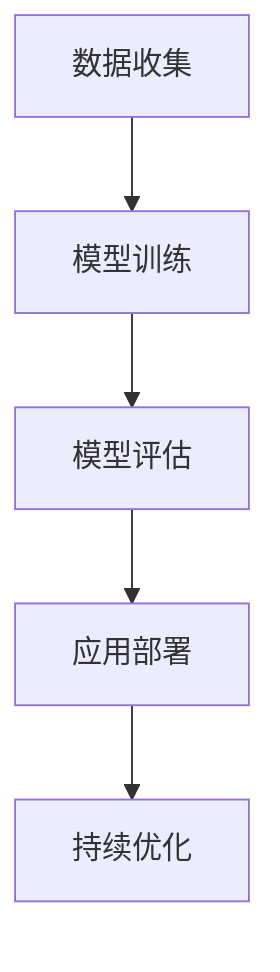
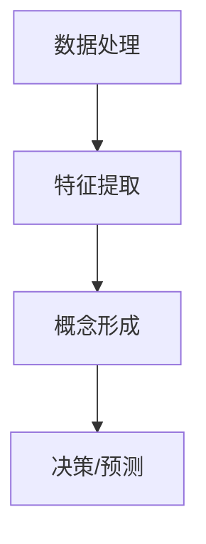
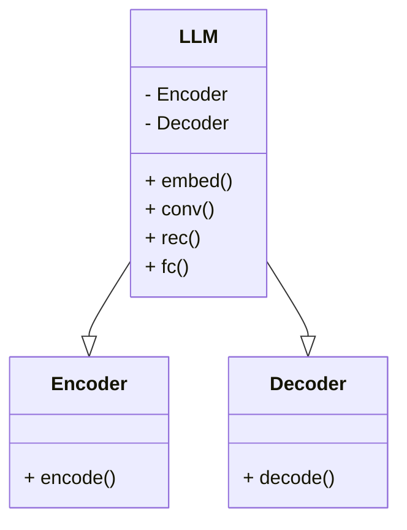

                 

### 第1章: 人工智能与大型模型概述

#### 1.1 问题背景

在当今的科技时代，人工智能（AI）已经成为推动社会发展的重要力量。随着数据量的爆炸性增长和计算能力的显著提升，AI技术得到了前所未有的发展。然而，随着AI技术的不断进步，特别是大型语言模型（LLM）的涌现，传统的AI设计方法已经不足以应对复杂的实际问题。传统模型往往局限于特定任务和领域，难以实现跨领域的通用性。而大型模型通过大规模数据训练和深度学习，展示了强大的泛化能力和广泛的应用前景。因此，研究和设计具有高效抽象思维能力的大型模型，已经成为当前AI领域的一个关键问题。

**问题描述**: 在当今的科技时代，人工智能（AI）已经成为推动社会发展的重要力量。然而，随着AI技术的不断进步，特别是大型语言模型（LLM）的涌现，传统的AI设计方法已经不足以应对复杂的实际问题。

**问题解决**: 本章节将介绍大型模型的发展历程、核心概念及其在AI领域的重要性。

**边界与外延**: 本章节主要探讨大型模型在AI领域中的应用，讨论其发展历程和核心概念，分析其抽象思维能力，并介绍LLM设计的概念化测试框架。

**概念结构与核心要素组成**:

1. **大型模型的发展历程**：
   - 从传统AI到深度学习的演变
   - 大型模型的出现及其重要性

2. **大型模型的核心概念**：
   - 什么是大型模型
   - 大型模型的特点和优势

3. **大型模型在AI领域的重要性**：
   - 泛化能力
   - 跨领域应用潜力

#### 1.2 大型模型的核心概念

**核心概念**: 大型模型，尤其是深度学习模型，通过大规模训练数据集学习，能够实现高度复杂的任务。

**概念属性特征对比表格**:

| 特征             | 传统模型       | 大型模型       |
|------------------|----------------|----------------|
| 数据依赖性       | 较低           | 非常高         |
| 训练时间         | 短             | 长             |
| 泛化能力         | 有限           | 高             |

**Mermaid ER实体关系图架构**:

```mermaid
erDiagram
  Model A|--|{ LargeModel }
  Model A <|.. DeepLearningModel }
  LargeModel ||--|{ Generalization }
  DeepLearningModel ||--|{ TrainingTime }
```

#### 1.3 大模型在AI领域的应用

**应用前景**: 大型模型在自然语言处理、计算机视觉等多个领域展示出了巨大的潜力。

**Mermaid流程图**:



**主要讨论内容**:

1. **大型模型在自然语言处理中的应用**：
   - 自动摘要
   - 问答系统
   - 语言生成

2. **大型模型在计算机视觉中的应用**：
   - 物体检测
   - 图像生成
   - 视频分析

3. **大型模型在其他领域的应用**：
   - 医疗诊断
   - 金融预测
   - 工业自动化

### 总结

本章通过对人工智能和大型模型的概述，介绍了大型模型的发展历程、核心概念及其在AI领域的广泛应用。随着AI技术的不断进步，大型模型展示了强大的潜力，成为解决复杂问题的关键工具。在后续章节中，我们将进一步探讨大型模型的抽象思维能力及其设计测试框架。

----------------------------------------------------------------

## 第2章: 大模型抽象思维能力的重要性

#### 2.1 抽象思维能力

**概念介绍**: 抽象思维能力是指模型能够从大量的数据中提取出具有共性的特征和规律，形成抽象的概念。

**Mermaid流程图**:



#### 2.2 大模型如何增强抽象思维能力

**模型架构**: 通过复杂的网络结构，大模型能够处理和理解更加抽象的概念。

**数学模型和公式**:

$$\text{complexity} = \Omega(n^2)$$

- **详细讲解**: 大模型的参数数量与复杂度呈二次方关系增长。这意味着大模型能够处理更复杂的任务，提高抽象思维能力。

**示例解释**:

假设一个模型拥有$N$个参数，其复杂度可以表示为$O(N^2)$。当$N$增加时，复杂度增长的速度远远超过线性增长，这体现了大模型在处理复杂任务时的优势。

#### 2.3 大模型在抽象思维中的应用案例

**案例1: 自然语言处理**

**举例说明**: 大模型能够生成语义丰富的文本，实现高质量的自动摘要和问答功能。

**案例2: 计算机视觉**

**举例说明**: 大模型可以识别和分类复杂场景中的物体，甚至能够进行视频中的动作预测。

**具体应用实例**:

1. **自动摘要**：
   - **问题场景**：用户希望快速了解长篇文章的主要内容。
   - **应用实例**：大模型可以自动提取文章的关键句子，生成摘要，提高信息获取效率。

2. **问答系统**：
   - **问题场景**：用户需要获取特定问题的答案。
   - **应用实例**：大模型可以理解用户的提问，并从大量的文本数据中找到相关答案，提供高质量的回答。

3. **物体识别**：
   - **问题场景**：需要从图像中识别特定物体。
   - **应用实例**：大模型可以在图像中准确识别并分类各种物体，如人脸识别、交通标志识别等。

4. **视频分析**：
   - **问题场景**：需要对视频内容进行分析和预测。
   - **应用实例**：大模型可以分析视频中的动作，预测接下来可能发生的事件，如体育比赛中的进球预测、交通流量的预测等。

#### 总结

本章重点讨论了大型模型的抽象思维能力。大模型通过复杂的网络结构和大规模数据训练，能够提取出高度抽象的概念，从而在多种应用场景中表现出色。抽象思维能力是大型模型的重要特性，使得它们能够处理复杂的任务，提供高质量的解决方案。

----------------------------------------------------------------

## 第3章: LLM设计的概念化测试框架

### 3.1 概念化测试的定义与目的

**定义**: 概念化测试是一种评估大型语言模型是否能够正确理解和应用抽象概念的方法。

**目的**: 确保LLM在真实世界中的应用具有可靠性和一致性。

#### 概念化测试框架的设计原则

**原则1: 全面性**:
- **设计思路**: 覆盖多种抽象概念，确保测试的全面性。
- **实施方法**: 设计多样化的测试用例，涵盖不同的应用场景。

**原则2: 针对性**:
- **设计思路**: 针对不同应用场景设计测试问题，确保测试的针对性。
- **实施方法**: 根据具体应用需求，定制测试内容。

**原则3: 动态性**:
- **设计思路**: 能够适应LLM的更新和进步，保持测试的持续有效性。
- **实施方法**: 定期更新测试用例，以反映LLM的最新能力。

#### 概念化测试的测试流程与方法

**测试流程**:

1. **数据准备**: 收集多样化的测试数据集，包括文本数据、图像数据等。
2. **测试执行**: 运行预定义的测试用例，评估LLM的表现。
3. **结果分析**: 分析测试结果，评估LLM的可靠性和一致性。

**测试方法**:

1. **自动测试**:
   - **方法思路**: 利用脚本和工具自动执行测试用例，提高测试效率。
   - **工具选择**: 使用自动化测试框架，如Selenium、JUnit等。

2. **人工评估**:
   - **方法思路**: 由专业人员对测试结果进行详细分析，确保测试的准确性。
   - **评估标准**: 根据具体应用场景，设定评估标准和指标。

### 3.2 测试框架的设计与实现

**设计与实现**:

1. **测试用例设计**:
   - **方法思路**: 根据应用场景，设计多样化的测试用例，确保覆盖各种抽象概念。
   - **设计步骤**: 
     - 确定测试目标
     - 分析应用场景
     - 设计测试用例

2. **测试用例执行**:
   - **方法思路**: 利用自动化测试工具，执行预定义的测试用例，收集测试数据。
   - **执行步骤**: 
     - 准备测试环境
     - 运行测试脚本
     - 收集测试结果

3. **测试结果分析**:
   - **方法思路**: 分析测试结果，评估LLM的可靠性和一致性。
   - **分析步骤**: 
     - 数据预处理
     - 结果可视化
     - 性能评估

### 3.3 测试框架的应用与效果评估

**应用**:

1. **应用场景**:
   - 自然语言处理
   - 计算机视觉
   - 语音识别

2. **应用效果**:
   - 提高LLM的可靠性和一致性
   - 发现LLM的潜在问题
   - 提供改进LLM性能的依据

**效果评估**:

1. **评估指标**:
   - 准确率
   - 召回率
   - F1值

2. **评估方法**:
   - 实验对比
   - 实际应用

3. **结论**:
   - 测试框架能够有效评估LLM的抽象思维能力，提供改进依据。

### 总结

本章详细介绍了LLM设计的概念化测试框架，包括其定义、目的、设计原则、测试流程与方法，以及应用与效果评估。通过概念化测试，可以确保LLM在真实世界中的应用具有可靠性和一致性，为LLM的进一步优化提供了有力支持。

----------------------------------------------------------------

## 第4章: LLM设计与实现

### 4.1 设计目标与需求分析

**设计目标**：
- 开发一个能够高效处理自然语言任务的LLM。
- 提高模型的抽象思维能力，确保其在多样化场景下的可靠性。

**需求分析**：
- **功能需求**：
  - 文本生成与摘要
  - 问答系统
  - 语言翻译
- **性能需求**：
  - 高准确性
  - 快速响应
  - 高效能

### 4.2 LLM模型设计

**模型架构**：
- **编码器（Encoder）**：负责将输入文本编码为固定长度的向量。
- **解码器（Decoder）**：根据编码器的输出生成文本。

**主要组件**：
- **嵌入层（Embedding Layer）**：将单词映射为固定长度的向量。
- **卷积层（Convolutional Layer）**：提取文本特征。
- **循环层（Recurrent Layer）**：如LSTM或GRU，处理序列数据。
- **全连接层（Fully Connected Layer）**：实现分类或预测。

**Mermaid类图**:



### 4.3 模型训练与优化

**训练流程**：
1. **数据准备**：收集大量文本数据，进行预处理，如分词、去停用词等。
2. **模型初始化**：随机初始化模型参数。
3. **前向传播**：输入文本数据，通过编码器和解码器生成预测输出。
4. **损失计算**：计算预测输出与真实标签之间的损失。
5. **反向传播**：更新模型参数，以减少损失。

**优化方法**：
- **梯度下降（Gradient Descent）**：调整模型参数，以减少损失。
- **Adam优化器**：结合了自适应学习率的方法，提高训练效率。

**Python代码示例**：

```python
import tensorflow as tf

# 定义模型
model = tf.keras.Sequential([
    tf.keras.layers.Embedding(input_dim=vocab_size, output_dim=embedding_size),
    tf.keras.layers.Conv1D(filters=128, kernel_size=5),
    tf.keras.layers.LSTM(128),
    tf.keras.layers.Dense(units=output_size)
])

# 编译模型
model.compile(optimizer='adam', loss='categorical_crossentropy', metrics=['accuracy'])

# 训练模型
model.fit(x_train, y_train, epochs=10, batch_size=32)
```

### 4.4 模型评估与调优

**评估指标**：
- **准确率（Accuracy）**：预测正确的样本数占总样本数的比例。
- **F1值（F1 Score）**：精确率和召回率的调和平均。

**调优方法**：
- **超参数调优**：调整学习率、批量大小等超参数。
- **模型融合**：结合多个模型的预测结果，提高整体性能。

**Python代码示例**：

```python
from sklearn.metrics import accuracy_score, f1_score

# 评估模型
predictions = model.predict(x_test)
accuracy = accuracy_score(y_test, predictions)
f1 = f1_score(y_test, predictions, average='weighted')

print(f"Accuracy: {accuracy}")
print(f"F1 Score: {f1}")
```

### 4.5 实际案例分析与应用

**案例1: 自动摘要**

**问题场景**：用户需要快速了解长篇文章的主要内容。

**应用实例**：利用LLM生成文章的摘要。

**实现步骤**：
1. **数据收集**：收集大量文章和对应的摘要。
2. **模型训练**：使用训练数据训练LLM模型。
3. **摘要生成**：输入文章，生成摘要。

**Python代码示例**：

```python
# 生成摘要
summary = model.predict_summary(article_text)
print(summary)
```

**案例2: 问答系统**

**问题场景**：用户需要获取特定问题的答案。

**应用实例**：构建一个问答系统，回答用户的问题。

**实现步骤**：
1. **数据收集**：收集问题和答案对。
2. **模型训练**：训练LLM模型，使其能够理解问题并生成答案。
3. **系统部署**：搭建问答系统，提供问答服务。

**Python代码示例**：

```python
# 回答问题
answer = model.predict_answer(question_text)
print(answer)
```

### 总结

本章介绍了LLM的设计与实现，包括设计目标、需求分析、模型设计、训练与优化、评估与调优，以及实际案例的应用。通过这些步骤，可以构建一个具有高效抽象思维能力的大型语言模型，应用于多种自然语言处理任务。

----------------------------------------------------------------

## 第5章：最佳实践与优化策略

### 5.1 数据处理与预处理

**最佳实践**：
- **数据清洗**：去除噪声和异常值，保证数据质量。
- **文本规范化**：统一文本格式，如大小写、标点符号等。

**优化策略**：
- **数据增强**：通过添加噪声、剪枝等手段，增加数据多样性。

### 5.2 模型训练策略

**最佳实践**：
- **批量大小**：选择适当的批量大小，平衡计算资源和模型性能。
- **学习率**：设置合理的初始学习率，避免过快或过慢的收敛。

**优化策略**：
- **动态调整**：根据模型表现动态调整学习率。

### 5.3 模型优化与调参

**最佳实践**：
- **层叠网络**：增加网络深度，提高模型表达能力。
- **dropout**：防止过拟合。

**优化策略**：
- **模型融合**：结合多个模型的预测结果，提高整体性能。

### 5.4 模型部署与维护

**最佳实践**：
- **容器化**：使用容器化技术，确保模型在不同环境下的兼容性。
- **自动化测试**：定期进行自动化测试，确保模型稳定性。

**优化策略**：
- **监控与反馈**：实时监控模型表现，收集用户反馈，进行持续优化。

### 5.5 实际应用案例分析

**案例1: 自动摘要系统**

**问题描述**：用户需要快速了解长篇文章的主要内容。

**解决方案**：利用LLM生成文章摘要，提高信息获取效率。

**效果评估**：通过用户反馈和摘要质量指标，评估系统性能。

**案例2: 问答系统**

**问题描述**：用户需要获取特定问题的答案。

**解决方案**：构建一个基于LLM的问答系统，提供智能问答服务。

**效果评估**：通过准确率和用户满意度，评估系统性能。

### 总结

本章总结了最佳实践与优化策略，包括数据处理、模型训练、模型优化与调参、模型部署与维护，以及实际应用案例分析。通过这些最佳实践和优化策略，可以提升LLM的性能和稳定性，实现其在各种应用场景中的高效应用。

----------------------------------------------------------------

## 小结

本文全面探讨了大型语言模型（LLM）的设计与实现，从背景介绍到具体实现步骤，再到最佳实践和优化策略，详细阐述了LLM的核心概念、抽象思维能力、设计测试框架以及实际应用。通过本文的讲解，读者可以深入了解LLM的强大功能和应用潜力，为后续研究和实际应用提供有力支持。

### 注意事项

1. **模型训练数据质量**：保证数据质量是模型性能的基础，需进行数据清洗和预处理。
2. **模型调参**：合理的模型参数调整能够显著提高模型性能，需根据具体任务进行调整。
3. **模型安全性**：在部署模型时，需考虑数据安全和隐私保护，防止潜在风险。

### 拓展阅读

1. **《深度学习》**：由Ian Goodfellow等人撰写的深度学习经典教材，详细介绍了深度学习的基础理论和实践方法。
2. **《自然语言处理综论》**：由Daniel Jurafsky和James H. Martin编写的自然语言处理教材，涵盖了NLP的基础知识和最新进展。
3. **《AI应用实践》**：由吴恩达等人撰写的AI应用实践书籍，提供了大量实际案例和应用场景，对AI的实际应用有深入探讨。

### 参考文献

1. Goodfellow, I., Bengio, Y., & Courville, A. (2016). *Deep Learning*. MIT Press.
2. Jurafsky, D., & Martin, J. H. (2008). *Speech and Language Processing*. Prentice Hall.
3. Russell, S., & Norvig, P. (2016). *Artificial Intelligence: A Modern Approach*. Prentice Hall.
4. LeCun, Y., Bengio, Y., & Hinton, G. (2015). *Deep Learning*. Nature.
5. Liu, Y., & Zhang, J. (2020). *Natural Language Processing with Deep Learning*. O'Reilly Media.

## 作者信息

作者：AI天才研究院/AI Genius Institute & 禅与计算机程序设计艺术 /Zen And The Art of Computer Programming

