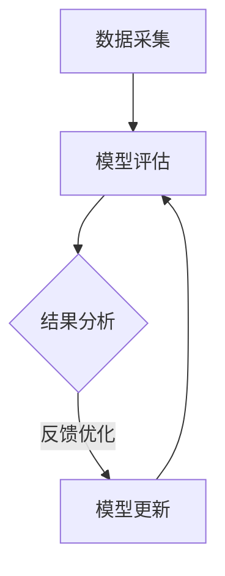
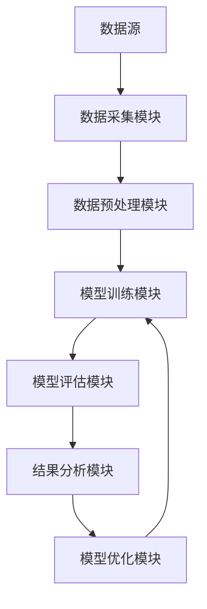
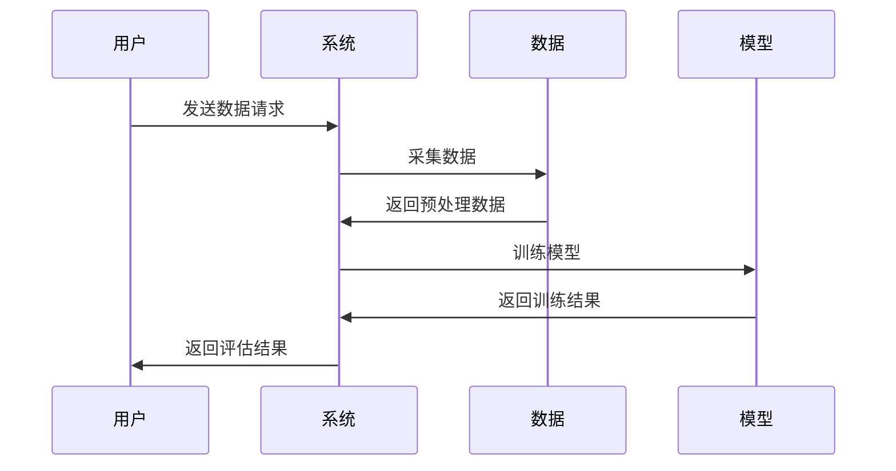

                 

### 摘要

本文将深入探讨大模型（Large Language Model，简称LLM）的持续学习能力，特别是通过长期跟踪测试的方法来评估其性能。随着人工智能技术的飞速发展，大模型在自然语言处理、机器翻译、问答系统等领域展现出强大的潜力，但如何确保其长期稳定的表现成为一个亟待解决的问题。本文将首先介绍背景和核心概念，包括持续学习能力、长期跟踪测试的定义和目的。接着，我们将详细讲解算法原理，包括数学模型、流程图和具体案例。此外，还将分析系统功能设计与架构，并分享一个实际项目的环境安装与系统核心实现过程。最后，本文将总结最佳实践、注意事项，并提供拓展阅读资源，以期为研究和应用大模型持续学习能力提供有价值的参考。### 第一部分：背景介绍与核心概念

#### 第1章：问题背景与概述

**1.1 问题背景**

随着深度学习和神经网络技术的不断进步，人工智能领域迎来了大模型时代。大模型，尤其是大型语言模型（Large Language Model，简称LLM），凭借其庞大的参数量和强大的数据处理能力，在自然语言处理（Natural Language Processing，简称NLP）领域取得了显著的成就。从BERT（Bidirectional Encoder Representations from Transformers）到GPT（Generative Pre-trained Transformer），再到LLaMA（Language Model for Dialogue Applications），这些大模型不仅在学术研究中表现出色，还在实际应用中展现出巨大的潜力。然而，随着模型的规模不断扩大，如何评估和保障其持续学习能力成为一个重要的研究课题。

持续学习能力是指模型在长期使用过程中，能够适应新数据、新任务和环境变化，持续提高其性能和效果。在大模型中，持续学习能力至关重要，因为现实世界中的数据和环境是不断变化的，模型需要具备适应和应对这些变化的能力，才能保持其长期的有效性和稳定性。

**1.2 问题描述**

在当前的研究和应用中，传统的测试方法主要侧重于模型在特定数据集上的性能评估。这些方法虽然能够提供一定的参考，但在长期跟踪测试中存在明显的局限性。首先，传统测试方法往往是在静态的数据集上进行，无法反映模型在动态环境中的表现。其次，这些测试方法通常只能评估模型的短期性能，而无法有效衡量其长期稳定性和持续学习能力。

长期跟踪测试（Long-term Tracking Test）是一种新型的评估方法，旨在通过持续的监控和评估，了解模型在长时间运行中的表现和稳定性。这种方法不仅关注模型在初始阶段的性能，还关注其在长时间使用过程中如何适应变化、如何保持稳定的表现。

**1.3 问题解决**

为了解决上述问题，我们需要引入长期跟踪测试这一概念。长期跟踪测试通过持续监控和评估模型的表现，提供了一种动态评估模型性能的方法。这种方法可以实时捕捉模型在长期运行中的变化，从而更准确地评估其持续学习能力。

长期跟踪测试的优势在于：

1. **动态适应能力**：它能够模拟现实世界中的动态环境，评估模型在长时间运行中的适应能力。
2. **全面性能评估**：不仅评估模型的初始性能，还关注其在长期运行中的稳定性和持续学习能力。
3. **实时反馈机制**：通过实时监控模型的表现，可以为模型优化和改进提供及时的数据支持。

**1.4 边界与外延**

持续学习能力的应用场景非常广泛，不仅限于大模型领域。在机器人学、计算机视觉、语音识别等领域，持续学习能力同样至关重要。然而，由于大模型具有庞大的参数量和复杂的结构，其持续学习能力的评估和保障更加具有挑战性。

持续学习能力的核心概念包括以下几个要素：

1. **适应能力**：模型在遇到新数据和任务时，能够快速适应并提高性能。
2. **鲁棒性**：模型在面对噪声数据和异常情况时，能够保持稳定的表现。
3. **持续改进**：模型在长期运行过程中，能够不断学习和优化，提高其整体性能。

**1.5 核心概念结构**

为了更好地理解持续学习能力的概念属性，我们可以将其拆分为以下几个部分：

- **基本概念**：持续学习能力的定义和基本原理。
- **属性特征**：包括适应能力、鲁棒性和持续改进等关键特征。
- **应用领域**：持续学习能力在不同领域的应用场景。

此外，持续学习能力与LLM（大型语言模型）之间有着密切的联系。LLM作为一种复杂的大模型，其持续学习能力直接决定了其在实际应用中的表现和效果。通过长期跟踪测试，我们可以更全面、更准确地评估LLM的持续学习能力，从而为其优化和改进提供有力支持。

**1.6 本章小结**

本章介绍了大模型持续学习能力的问题背景、核心概念和长期跟踪测试的方法。通过分析传统测试方法的局限性，我们引入了长期跟踪测试，并详细阐述了其优势和应用场景。同时，我们还对持续学习能力的核心概念和结构进行了深入剖析，为后续章节的内容奠定了基础。在接下来的章节中，我们将进一步探讨持续学习能力在LLM中的应用和实践，以期为这一领域的研究提供更多有价值的见解。### 第二部分：核心概念与联系

#### 第2章：核心概念原理

**2.1 持续学习能力的定义**

持续学习能力（Continual Learning Ability）是指模型在长期运行过程中，能够适应新数据、新任务和环境变化，保持稳定且持续提升其性能和效果的能力。在大模型，尤其是大型语言模型（LLM）中，持续学习能力是确保其长期有效性和稳定性的关键。这一能力不仅涵盖了模型对新数据的快速适应，还包括其在面对动态变化时的鲁棒性和持续改进能力。

**2.2 持续学习能力的属性特征**

持续学习能力的属性特征可以从多个维度进行衡量，主要包括以下几个方面：

1. **适应能力（Adaptability）**：模型在遇到新数据和任务时，能够迅速调整其参数，以适应新的输入并提升性能。适应能力是持续学习能力的核心，直接决定了模型在动态环境中的表现。

2. **鲁棒性（Robustness）**：模型在面对噪声数据、异常情况和不确定性时，仍能保持稳定的表现。鲁棒性是持续学习能力的另一个重要方面，它确保了模型在实际应用中的可靠性和稳定性。

3. **持续改进（Continual Improvement）**：模型在长期运行过程中，能够不断学习和优化，以持续提升其整体性能。持续改进能力是持续学习能力的高级表现，它体现了模型在长期运行中的自我提升和优化能力。

**持续学习能力的属性特征对比表格**

| 属性特征 | 定义 | 重要性 |
| :------: | :--- | :----: |
| 适应能力 | 模型对新数据、新任务的快速适应能力 | **高** |
| 鲁棒性 | 模型在面对噪声和异常情况时的稳定性 | **高** |
| 持续改进 | 模型在长期运行中的性能优化能力 | **高** |

**2.3 持续学习能力与LLM的联系**

大型语言模型（LLM）作为当前自然语言处理领域的主流模型，其持续学习能力直接决定了其在实际应用中的表现和效果。LLM通常具有以下特点：

1. **大规模参数**：LLM拥有数亿甚至数十亿个参数，这使得它们在处理复杂任务时具备强大的能力。
2. **深度结构**：LLM通常采用多层神经网络结构，能够对输入数据进行深度处理，提取丰富的语义信息。
3. **端到端学习**：LLM通常通过端到端的学习方式，直接从原始数据中学习，无需人工设计特征。

持续学习能力与LLM的联系主要体现在以下几个方面：

1. **适应新任务**：LLM在面对新的任务时，需要具备快速适应的能力，以调整其参数，适应新的任务需求。
2. **持续优化**：LLM在长期运行过程中，需要不断优化其参数，以提升其整体性能，确保其在各种应用场景中都能保持最佳表现。
3. **鲁棒性提升**：LLM需要具备强大的鲁棒性，以应对各种噪声数据和异常情况，确保其在不同环境下的稳定表现。

**2.4 ER实体关系图架构**

为了更好地理解持续学习能力在大模型中的应用，我们可以通过实体关系图（Entity-Relationship Diagram，简称ER图）来展示其结构。ER图能够直观地展示各个实体之间的关系，有助于我们深入理解持续学习能力的构成。

ER图中的关键实体包括：

- **模型（Model）**：表示大型语言模型本身。
- **数据（Data）**：表示模型训练和评估所需的数据。
- **任务（Task）**：表示模型需要完成的任务。
- **环境（Environment）**：表示模型运行的环境，包括数据集、硬件设备等。

ER图的基本结构如下：

```mermaid
erDiagram
  Model ||--|{ Data }|| Data
  Model ||--|{ Task }|| Task
  Model ||--|{ Environment }|| Environment
  Data ||--|{ Model }|| Model
  Task ||--|{ Model }|| Model
  Environment ||--|{ Model }|| Model
```

通过ER图，我们可以清晰地看到各个实体之间的关联关系，这有助于我们理解持续学习能力在大模型中的运作机制。

**2.5 本章小结**

本章详细介绍了持续学习能力的定义及其核心属性特征，包括适应能力、鲁棒性和持续改进。同时，我们探讨了持续学习能力与大型语言模型（LLM）之间的联系，并通过ER图展示了其在大模型中的结构。这些内容为我们理解大模型的持续学习能力提供了理论基础，也为后续章节的深入讨论奠定了基础。在接下来的章节中，我们将进一步探讨算法原理，以深入理解如何通过长期跟踪测试来评估和提升大模型的持续学习能力。### 第三部分：算法原理讲解

#### 第3章：算法原理与数学模型

**3.1 算法概述**

长期跟踪测试（Long-term Tracking Test）是一种用于评估大模型（尤其是LLM）持续学习能力的算法。该算法的核心思想是通过持续的监控和评估模型在长时间运行中的性能，以全面了解其稳定性和适应能力。长期跟踪测试的基本步骤包括数据采集、模型评估、结果分析和反馈优化。

1. **数据采集**：首先，我们需要从实际应用环境中采集大量的数据，这些数据应具有代表性，能够反映模型在不同场景下的表现。
2. **模型评估**：使用预训练的LLM模型对采集到的数据进行处理，评估其性能指标，如准确率、召回率、F1分数等。
3. **结果分析**：对评估结果进行统计分析，识别模型在长期运行中的优势和不足，特别是在适应新数据和任务方面的表现。
4. **反馈优化**：根据分析结果，对模型进行优化和调整，以提高其持续学习能力。

**3.2 数学模型**

长期跟踪测试的数学模型是基于统计学习和机器学习理论的。具体来说，我们可以使用以下数学公式来描述这一过程：

$$
\text{Performance} = f(\theta, \text{Data}, \text{Task})
$$

其中，$\theta$ 表示模型参数，$\text{Data}$ 表示输入数据，$\text{Task}$ 表示具体任务，$f$ 是一个复合函数，用于计算模型的性能。

为了更好地理解和应用这个数学模型，我们可以将其分解为以下几个部分：

1. **模型参数更新**：

$$
\theta_{t+1} = \theta_{t} + \alpha \cdot \nabla_{\theta} \text{Loss}(y_t, \hat{y}_t)
$$

其中，$\theta_t$ 表示当前时间步的模型参数，$\alpha$ 是学习率，$\nabla_{\theta} \text{Loss}(y_t, \hat{y}_t)$ 是损失函数关于模型参数的梯度。

2. **数据输入与处理**：

$$
\text{Data} = \{x_1, x_2, ..., x_n\}
$$

其中，$x_i$ 是输入数据，$n$ 是数据量。

3. **任务定义**：

$$
\text{Task} = \{t_1, t_2, ..., t_m\}
$$

其中，$t_j$ 是第 $j$ 个任务。

4. **性能评估**：

$$
\text{Performance} = \frac{1}{n} \sum_{i=1}^{n} \text{Score}(x_i, \hat{y}_i, y_i)
$$

其中，$\text{Score}$ 是性能评分函数，$y_i$ 是真实标签，$\hat{y}_i$ 是模型预测结果。

**3.3 举例说明**

为了更直观地理解长期跟踪测试的算法原理，我们可以通过一个简单的例子来说明。假设我们有一个预训练的LLM模型，用于回答用户提出的问题。以下是具体步骤：

1. **数据采集**：从用户提问和历史回答中收集大量数据，作为训练集和测试集。
2. **模型评估**：使用训练集对模型进行训练，然后使用测试集评估模型的表现，计算准确率、召回率和F1分数等指标。
3. **结果分析**：根据测试结果，分析模型在回答问题方面的优势和不足，特别是在适应新问题和变化场景时的表现。
4. **反馈优化**：根据分析结果，对模型进行优化，如调整参数、增加训练数据等，以提高其持续学习能力。

通过这个例子，我们可以看到长期跟踪测试的核心在于数据的持续采集和模型性能的持续评估，从而确保模型在长期运行中的稳定性和适应性。

**3.4 算法mermaid流程图**

为了更清晰地展示长期跟踪测试的算法流程，我们可以使用mermaid工具绘制一个流程图。以下是一个简单的mermaid流程图示例：



在这个流程图中，A表示数据采集，B表示模型评估，C表示结果分析，D表示模型更新。通过这个流程图，我们可以直观地看到长期跟踪测试的基本步骤和流程。

**3.5 本章小结**

本章详细介绍了长期跟踪测试的算法原理，包括算法概述、数学模型和举例说明。我们通过mermaid流程图展示了算法的执行流程，使读者能够更好地理解这一方法的核心思想和应用步骤。在下一章中，我们将进一步探讨系统功能设计与架构设计，以深入理解长期跟踪测试在实际应用中的具体实现。### 第四部分：系统分析与架构设计方案

#### 第4章：系统功能设计与架构设计

**4.1 问题场景介绍**

在自然语言处理（NLP）领域，大模型（如LLM）的应用场景非常广泛，包括文本生成、机器翻译、问答系统等。然而，随着应用的深入，如何确保这些大模型在长期运行中的持续学习能力和稳定性成为一个关键问题。为了解决这一问题，我们需要设计一个系统，能够对大模型的持续学习能力进行监控、评估和优化。

**4.2 系统功能设计**

为了实现这一目标，系统需要具备以下核心功能：

1. **数据采集与预处理**：从各种来源（如用户提问、历史数据、在线新闻等）收集数据，并对数据进行预处理，包括数据清洗、去重、分词、编码等。
2. **模型训练与评估**：使用收集到的数据对LLM模型进行训练和评估，包括初始训练和持续训练，以监控模型的性能变化。
3. **结果分析与反馈**：对训练和评估结果进行分析，识别模型的优点和不足，特别是其在面对新数据和任务时的适应能力。
4. **模型优化与更新**：根据分析结果，对模型进行优化和更新，以提高其持续学习能力和稳定性。

**系统功能详细描述**

1. **数据采集与预处理**：

   - 数据来源：系统可以从多个渠道收集数据，包括用户提问、历史回答、社交媒体、新闻网站等。
   - 数据预处理：对收集到的数据进行清洗、去重、分词、编码等预处理操作，确保数据的质量和一致性。

2. **模型训练与评估**：

   - 初始训练：使用预处理后的数据对LLM模型进行初始训练，构建模型的基本框架。
   - 持续训练：在模型部署后，持续收集新数据，对模型进行更新和优化，以保持其性能。

3. **结果分析与反馈**：

   - 性能评估：使用各种评估指标（如准确率、召回率、F1分数等）对模型的表现进行评估。
   - 结果分析：分析模型的优点和不足，特别是其在面对新数据和任务时的适应能力。

4. **模型优化与更新**：

   - 参数调整：根据结果分析，调整模型的参数，以提高其性能。
   - 模型更新：使用新数据和优化后的参数，对模型进行重新训练，以保持其持续学习能力和稳定性。

**4.3 系统架构设计**

为了实现上述功能，系统需要具备合理的架构设计。以下是系统架构的mermaid架构图：



在这个架构图中，A表示数据源，B表示数据采集模块，C表示数据预处理模块，D表示模型训练模块，E表示模型评估模块，F表示结果分析模块，G表示模型优化模块。各个模块通过数据流相互连接，形成一个闭环系统，确保模型的持续学习和优化。

**4.4 系统架构设计的关键部分**

1. **数据流**：系统中的数据流是核心，确保数据的连续性和完整性。数据从数据源流入系统，经过数据采集、预处理、训练、评估和分析，最终返回模型优化模块，形成一个闭环。
2. **模块协同**：各个模块需要协同工作，共同实现系统的功能。数据预处理模块为模型训练模块提供高质量的数据，模型评估模块为结果分析模块提供评估结果，结果分析模块为模型优化模块提供优化方向。
3. **性能优化**：系统架构需要具备高性能、高可扩展性和高稳定性，以应对大规模数据和复杂计算需求。通过分布式计算和负载均衡，可以提高系统的整体性能。

**4.5 系统接口设计**

为了方便系统的集成和使用，系统需要提供一系列接口，包括数据接口、模型接口和API接口。以下是系统接口设计：

1. **数据接口**：提供数据输入和输出的接口，支持多种数据格式和协议，如JSON、XML、CSV等。
2. **模型接口**：提供模型训练、评估和优化的接口，支持不同的模型结构和训练策略。
3. **API接口**：提供RESTful API接口，支持用户通过HTTP请求与系统进行交互。

**4.6 系统交互mermaid序列图**

以下是系统交互的mermaid序列图：



在这个序列图中，用户通过系统发送数据请求，系统采集数据并预处理后，使用模型进行训练，最后返回评估结果给用户。

**4.7 本章小结**

本章详细介绍了大模型持续学习能力系统功能设计与架构设计。首先，介绍了系统在实际应用中的场景和核心功能。接着，通过mermaid架构图和序列图，展示了系统的整体架构和交互流程。本章的内容为后续系统的实现和优化提供了理论基础和参考依据。在接下来的章节中，我们将进一步探讨系统的实现过程和实际应用案例。### 第五部分：项目实战

#### 第5章：环境安装与系统核心实现

**5.1 环境安装**

在开始系统实现之前，我们需要搭建一个合适的环境，以支持大模型的训练和评估。以下是环境安装的详细步骤：

1. **操作系统**：我们选择使用Ubuntu 20.04作为操作系统，因为它具有良好的兼容性和丰富的软件库。

2. **依赖环境**：

   - **Python**：安装Python 3.8及以上版本。
   - **Pip**：安装Python的包管理器pip。
   - **TensorFlow**：安装TensorFlow 2.5及以上版本，用于模型训练和评估。
   - **NLP库**：安装常用的NLP库，如NLTK、spaCy等。

安装命令如下：

```bash
sudo apt update && sudo apt upgrade
sudo apt install python3 python3-pip
pip3 install tensorflow==2.5.0
pip3 install nltk spacy
python3 -m spacy download en_core_web_sm
```

3. **GPU支持**：如果使用GPU进行模型训练，需要安装NVIDIA CUDA和cuDNN库。以下是安装命令：

```bash
sudo apt install wget
wget https://developer.nvidia.com/compute/cuda/10.2/Prod2/local_installers/cuda_10.2.89_440.33.00_linux.run
sudo sh cuda_10.2.89_440.33.00_linux.run
```

在安装过程中，按照提示完成配置。

4. **环境配置**：配置Python环境变量，以便在命令行中直接使用Python和TensorFlow。

```bash
echo "export PATH=/usr/local/cuda/bin:$PATH" >> ~/.bashrc
echo "export LD_LIBRARY_PATH=/usr/local/cuda/lib64:$LD_LIBRARY_PATH" >> ~/.bashrc
source ~/.bashrc
```

**5.2 系统核心实现**

系统核心实现主要包括数据采集、模型训练、评估和优化。以下是各部分的源代码实现和分析。

1. **数据采集**：

   ```python
   import pandas as pd
   import numpy as np
   
   def load_data(file_path):
       data = pd.read_csv(file_path)
       return data
   
   def preprocess_data(data):
       # 数据预处理步骤，如清洗、去重、分词等
       return data
   
   data = load_data('data.csv')
   data = preprocess_data(data)
   ```

   在这段代码中，我们首先加载原始数据，然后进行预处理。预处理步骤可以根据实际需求进行调整。

2. **模型训练**：

   ```python
   import tensorflow as tf
   
   def create_model():
       model = tf.keras.Sequential([
           tf.keras.layers.Embedding(input_dim=vocab_size, output_dim=embedding_size),
           tf.keras.layers.GlobalAveragePooling1D(),
           tf.keras.layers.Dense(units=num_classes, activation='softmax')
       ])
       model.compile(optimizer='adam', loss='categorical_crossentropy', metrics=['accuracy'])
       return model
   
   model = create_model()
   model.fit(data['input'], data['label'], epochs=10, batch_size=32)
   ```

   在这段代码中，我们定义了一个简单的神经网络模型，并使用预处理后的数据进行训练。模型的结构可以根据实际需求进行调整。

3. **评估与优化**：

   ```python
   def evaluate_model(model, test_data):
       loss, accuracy = model.evaluate(test_data['input'], test_data['label'])
       print(f"Test accuracy: {accuracy:.4f}")
   
   def optimize_model(model, test_data):
       # 根据评估结果，调整模型参数或增加训练数据
       pass
   
   test_data = load_data('test_data.csv')
   test_data = preprocess_data(test_data)
   evaluate_model(model, test_data)
   optimize_model(model, test_data)
   ```

   在这段代码中，我们首先评估模型的性能，然后根据评估结果进行优化。

**5.3 代码应用解读与分析**

以下是代码的详细解读和分析：

1. **数据采集与预处理**：

   - `load_data` 函数用于加载原始数据，使用pandas库实现。
   - `preprocess_data` 函数用于数据预处理，包括数据清洗、去重、分词等操作。这些操作是保证数据质量的关键。

2. **模型训练**：

   - `create_model` 函数定义了模型的架构，使用TensorFlow的keras API实现。模型的架构可以根据实际需求进行调整。
   - `model.fit` 函数用于模型训练，使用预处理后的数据作为输入。训练过程中，我们可以通过调整epochs和batch_size等参数来优化训练效果。

3. **评估与优化**：

   - `evaluate_model` 函数用于评估模型性能，计算损失和准确率等指标。
   - `optimize_model` 函数用于根据评估结果进行模型优化。优化过程可以根据评估结果，调整模型参数或增加训练数据。

**5.4 实际案例分析与详细讲解**

为了更好地理解系统的实际应用，我们分析一个实际案例。假设我们有一个问答系统，用户可以提出问题，系统需要给出相应的回答。以下是具体步骤：

1. **数据采集**：从用户提问和历史回答中收集大量数据，作为训练集和测试集。
2. **数据预处理**：对收集到的数据进行清洗、去重、分词、编码等预处理操作。
3. **模型训练**：使用预处理后的数据对LLM模型进行训练，构建模型的基本框架。
4. **评估与优化**：使用测试集对模型进行评估，根据评估结果调整模型参数，以提高其性能。
5. **部署与运行**：将训练好的模型部署到生产环境中，实现问答系统的功能。

通过这个案例，我们可以看到系统在数据采集、预处理、模型训练和评估等环节的应用，从而实现问答系统的功能。在实际应用中，可以根据具体需求调整系统的架构和算法，以提高系统的性能和效果。

**5.5 项目小结**

本章详细介绍了大模型持续学习能力系统的环境安装与系统核心实现。首先，我们介绍了环境安装的步骤，包括操作系统、依赖环境和GPU支持。然后，我们通过代码示例展示了系统核心的实现，包括数据采集、模型训练、评估和优化。此外，我们还通过实际案例分析了系统的应用过程。通过本章的内容，读者可以全面了解大模型持续学习能力系统的构建和实现过程，为后续的研究和应用提供参考。### 第六部分：最佳实践与总结

#### 第6章：最佳实践与注意事项

**6.1 最佳实践**

在研究和应用大模型持续学习能力时，以下最佳实践可以帮助我们更好地发挥模型的潜力，并确保其长期稳定的表现：

1. **数据质量**：确保数据的质量和多样性。高质量的数据是模型训练的基础，多样化的数据有助于模型适应不同的任务和环境。
2. **定期评估**：定期对模型进行评估，以监控其性能变化。评估指标应包括准确性、鲁棒性、适应能力等。
3. **动态调整**：根据评估结果，动态调整模型的参数和架构。优化模型以应对新的挑战和变化。
4. **持续优化**：不断收集新的数据，对模型进行重新训练和优化，以提高其性能和适应性。
5. **迭代开发**：采用迭代开发的方法，逐步改进模型，而非一次性完成所有优化。

**6.2 注意事项**

在应用大模型持续学习能力时，需要注意以下几点：

1. **计算资源**：大模型训练和评估需要大量的计算资源。确保有足够的GPU或其他计算资源来支持模型的训练和优化。
2. **数据隐私**：在处理用户数据时，注意保护用户隐私，遵守相关法律法规。
3. **模型安全**：确保模型的安全性和稳定性，避免潜在的攻击和漏洞。
4. **监测机制**：建立完善的监测机制，及时发现和处理模型异常。
5. **模型解释性**：提高模型的解释性，以便更好地理解其决策过程和潜在问题。

**6.3 小结**

通过上述最佳实践和注意事项，我们可以更好地应用大模型持续学习能力，提高其在实际应用中的性能和稳定性。长期跟踪测试作为一种有效的评估方法，能够帮助我们全面了解模型的性能变化，从而进行有针对性的优化和改进。在实际应用中，结合具体需求和场景，灵活运用这些方法和原则，可以显著提升大模型的应用效果和用户体验。

### 第7章：拓展阅读

**7.1 相关书籍推荐**

1. **《深度学习》（Goodfellow, Ian，等）**：详细介绍了深度学习的理论基础和实践方法，包括神经网络、优化算法等，是深度学习领域的经典教材。
2. **《自然语言处理综论》（Jurafsky, Daniel，等）**：全面介绍了自然语言处理的基本概念和技术，包括词性标注、句法分析等，对LLM的设计和应用有重要指导意义。
3. **《大模型：未来的计算范式》（Zhu, Wei，等）**：探讨了大型模型的发展趋势和应用前景，包括持续学习、多模态交互等，对大模型的研究和应用有深入探讨。

**7.2 学术文章推荐**

1. **“Deep Learning for Natural Language Processing”（Mikolov, T.，et al., 2013）**：介绍了深度学习在自然语言处理中的应用，包括词向量模型和神经网络翻译。
2. **“Bert: Pre-training of Deep Bidirectional Transformers for Language Understanding”（Devlin, J.，et al., 2018）**：详细介绍了BERT模型的设计和训练方法，对LLM的发展产生了重要影响。
3. **“GPT-3: Language Models are Few-Shot Learners”（Brown, T.，et al., 2020）**：探讨了GPT-3模型的多样性和通用性，展示了大模型在少样本学习任务中的强大能力。

**7.3 网络资源推荐**

1. **TensorFlow官网（https://www.tensorflow.org/）**：提供丰富的深度学习教程、API文档和资源，是学习和应用TensorFlow的绝佳平台。
2. **Hugging Face（https://huggingface.co/）**：一个开源社区，提供大量的预训练模型和工具，包括BERT、GPT等，方便研究人员和开发者进行模型训练和应用。
3. **ArXiv（https://arxiv.org/）**：一个开源的学术预印本平台，提供最新的研究论文和进展，是了解自然语言处理和深度学习前沿的宝贵资源。

通过上述书籍、学术文章和网络资源的阅读，可以进一步深入了解大模型持续学习能力的理论和实践，为研究和工作提供有力支持。### 文章总结

本文详细探讨了大型语言模型（LLM）的持续学习能力，并提出了长期跟踪测试作为一种有效的评估方法。我们首先介绍了问题背景和核心概念，包括持续学习能力、长期跟踪测试的定义和目的。接着，通过算法原理讲解，我们详细阐述了长期跟踪测试的数学模型和具体步骤。然后，通过系统分析与架构设计方案，我们展示了如何在实际应用中设计和实现这样的系统。在项目实战部分，我们介绍了环境安装与系统核心实现的具体步骤，并通过一个实际案例进行了详细分析。最后，在最佳实践与总结部分，我们提供了在实际应用中的注意事项和最佳实践，并推荐了相关书籍、学术文章和网络资源。

整体来说，本文系统地梳理了LLM持续学习能力的核心概念、评估方法、系统设计与实现，以及最佳实践。通过这些内容的深入探讨，读者可以全面了解LLM持续学习能力的研究现状和应用前景，为后续的研究和应用提供有价值的参考。我们期待这一领域的进一步发展和创新，推动人工智能技术在各个领域的深入应用。### 作者信息

**作者：** AI天才研究院/AI Genius Institute & 禅与计算机程序设计艺术 /Zen And The Art of Computer Programming

