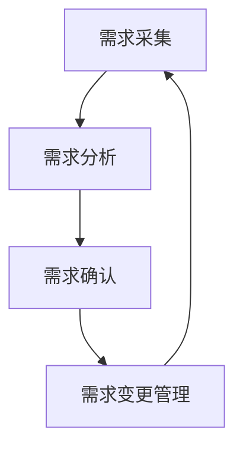
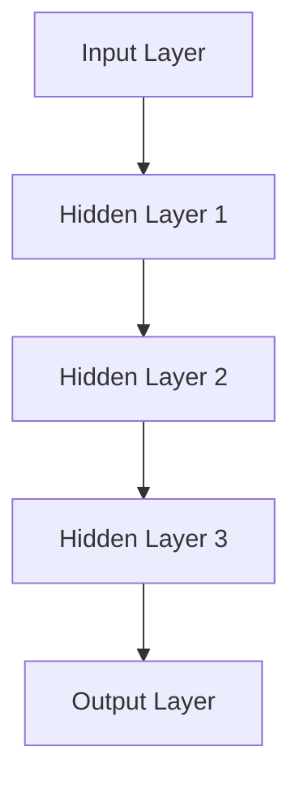
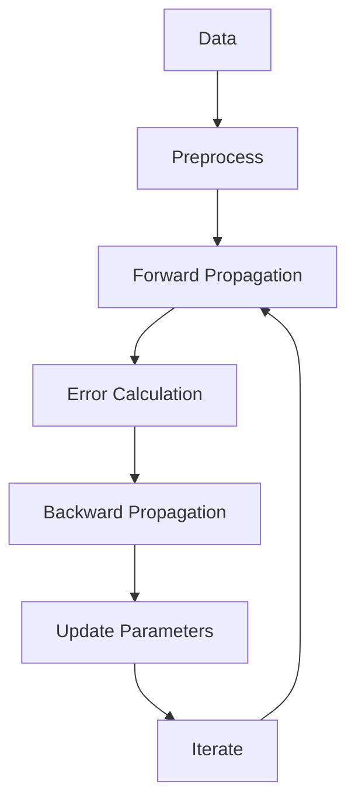
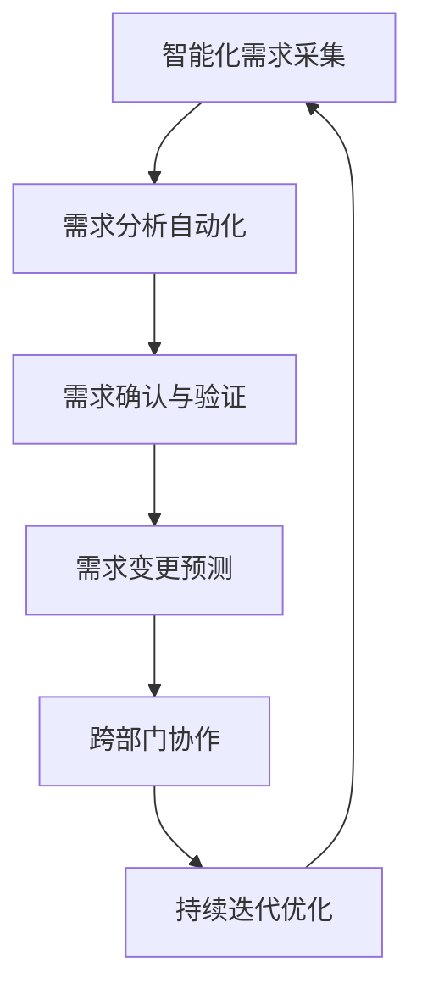
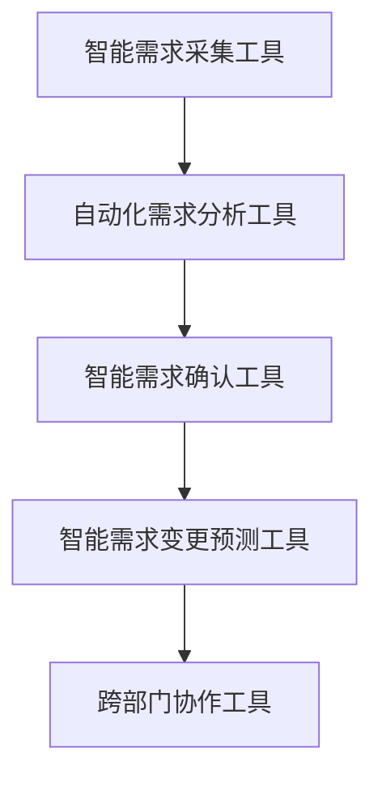

                 


### 大模型时代的需求管理新思路

> 关键词：大模型，需求管理，人工智能，流程优化，创新策略

> 摘要：本文旨在探讨大模型时代下需求管理的新思路，分析传统需求管理的局限性，介绍大模型的基本原理和特点，探讨其在需求管理中的应用，并提出大模型时代的需求管理策略和案例研究，为未来需求管理的发展提供参考。

## 引言

### 1.1 背景介绍

随着人工智能技术的快速发展，大模型逐渐成为研究与应用的热点。大模型，尤其是深度学习模型，以其卓越的性能在图像识别、自然语言处理、语音识别等领域取得了显著成果。然而，大模型的引入不仅带来了技术上的革新，也对传统的需求管理带来了新的挑战。

传统需求管理主要依赖于人类专家的经验和直觉，往往存在信息不对称、需求理解偏差、变更管理困难等问题。在大模型时代，需求管理面临着更加复杂的需求环境，如何有效地管理这些需求，成为了业界亟待解决的问题。

### 1.2 需求管理的挑战

在大模型时代，需求管理的挑战主要体现在以下几个方面：

1. **需求复杂性增加**：随着大模型的应用场景逐渐丰富，需求变得更加复杂，涵盖的技术层面更广，这对需求管理的精细化和专业化提出了更高的要求。
2. **需求变更频繁**：大模型的技术迭代速度快，需求变更频繁，如何快速响应变更，保证项目进度和质量，成为需求管理的难题。
3. **跨部门协作难度大**：大模型项目通常需要跨部门协作，不同部门的需求和利益诉求不同，如何协调和整合这些需求，实现高效合作，是需求管理的一大挑战。
4. **数据隐私和安全**：大模型在需求管理中往往涉及大量的敏感数据，如何确保数据隐私和安全，防止数据泄露，是需求管理的重要问题。

### 1.3 本书的目的与结构

本文的目的在于探讨大模型时代下需求管理的新思路，旨在为需求管理提供理论指导和实践参考。文章结构如下：

1. **第一部分：引言**：介绍大模型时代的背景和需求管理的挑战。
2. **第二部分：大模型时代的需求管理**：探讨需求管理的核心概念、流程和应用。
3. **第三部分：大模型时代的需求管理策略**：提出需求管理的策略和组织结构。
4. **第四部分：大模型时代的需求管理案例研究**：通过案例分析展示需求管理在大模型时代的应用。
5. **第五部分：大模型时代的需求管理趋势与展望**：分析未来需求管理的发展方向和机遇。

通过以上结构的安排，本文旨在为读者提供一个全面、系统的大模型时代需求管理新思路。

## 第二部分：大模型时代的需求管理

### 第2章：需求管理的核心概念

#### 2.1 问题背景

在传统需求管理中，需求通常被视为项目成功的基石。然而，随着大模型的引入，需求管理的复杂性显著增加。为了更好地理解大模型时代的需求管理，我们需要明确需求管理的核心概念，包括需求的定义、分类和属性。

#### 2.2 需求定义与分类

**需求定义**：需求是用户对产品或服务的基本要求和期望。在大模型时代，需求不仅包括功能需求，还包括性能需求、可靠性需求、安全性需求等。

**需求分类**：根据需求的性质和内容，可以将需求分为以下几类：

1. **功能需求**：指用户对产品或服务的具体功能需求，如图像识别、语音合成等。
2. **性能需求**：指用户对产品或服务性能的要求，如处理速度、响应时间等。
3. **可靠性需求**：指用户对产品或服务可靠性的要求，如系统稳定性、故障恢复能力等。
4. **安全性需求**：指用户对产品或服务安全性的要求，如数据隐私保护、防止恶意攻击等。

#### 2.3 需求属性的对比

不同类型的需求具有不同的属性，以下是一个简单的需求属性对比表格：

| 需求类型 | 功能需求 | 性能需求 | 可靠性需求 | 安全性需求 |
| :--: | :--: | :--: | :--: | :--: |
| **定义** | 用户对产品或服务的具体功能需求 | 用户对产品或服务性能的要求 | 用户对产品或服务可靠性的要求 | 用户对产品或服务安全性的要求 |
| **属性** | 功能完整性、可用性、兼容性等 | 处理速度、响应时间、负载能力等 | 系统稳定性、故障恢复能力、安全性等 | 数据隐私保护、防止恶意攻击、认证机制等 |

#### 2.4 需求管理的基本流程

需求管理的基本流程包括需求采集、需求分析、需求确认和需求变更管理。以下是一个简化的需求管理流程图，使用Mermaid工具绘制：



**需求采集**：通过用户调研、市场分析、技术评估等方式获取用户需求。

**需求分析**：对收集的需求进行筛选、分类和优先级排序，明确需求的合理性和可行性。

**需求确认**：与用户沟通，确认需求的具体细节，确保需求的完整性和准确性。

**需求变更管理**：在项目实施过程中，需求可能会发生变化，需求变更管理旨在确保变更的合理性和可控性，防止需求变更对项目进度和质量产生负面影响。

### 2.5 需求管理的边界与外延

需求管理的边界是指需求管理的范围和限制，包括需求管理的责任范围、管理流程的应用范围等。需求管理的外延则是指需求管理涉及的各个方面，如技术需求、市场需求、用户需求等。

在大模型时代，需求管理的边界与外延更加广泛，不仅涉及技术层面的需求，还包括业务需求、市场趋势、用户反馈等多方面。以下是一个需求管理边界与外延的ER实体关系图：

```mermaid
erDiagram
  User ||--|{ Requirement }
  Product ||--|{ Requirement }
  Market ||--|{ Requirement }
  Technology ||--|{ Requirement }
  User -> Product
  User -> Market
  User -> Technology
  Market -> Requirement
  Technology -> Requirement
```

通过以上分析，我们可以看到，大模型时代的需求管理不仅需要关注技术层面的需求，还需要综合考虑业务、市场和用户等多方面的因素，以实现全面的需求管理。

## 第三部分：大模型在需求管理中的应用

### 第3章：大模型在需求管理中的应用

#### 3.1 大模型的基本原理

大模型，尤其是深度学习模型，是人工智能领域的重要突破。深度学习模型通过多层神经网络对大量数据进行分析和学习，从而实现对复杂模式的识别和预测。以下是一个简化的深度学习模型架构图，使用Mermaid工具绘制：



**输入层（Input Layer）**：接收外部输入数据。

**隐藏层（Hidden Layer）**：对输入数据进行处理和转换，隐藏层可以是多层，每层都对输入数据进行更复杂的变换。

**输出层（Output Layer）**：输出模型预测结果。

#### 3.2 大模型的特点

大模型具有以下特点：

1. **高并行处理能力**：深度学习模型可以在大量数据上进行并行处理，大大提高了数据处理效率。
2. **自动特征提取**：大模型能够自动从数据中提取有用的特征，无需人工预设特征。
3. **自适应学习**：大模型可以根据新的数据不断调整模型参数，实现自适应学习。
4. **强大的预测能力**：大模型在处理复杂任务时，如图像识别、自然语言处理等，具有强大的预测能力。

#### 3.3 大模型的工作原理

大模型的工作原理基于以下几个步骤：

1. **数据预处理**：对输入数据（如图像、文本等）进行预处理，使其符合模型的输入要求。
2. **前向传播**：将预处理后的数据输入模型，通过隐藏层进行前向传播，生成输出。
3. **反向传播**：根据输出结果与实际结果的误差，通过反向传播更新模型参数。
4. **迭代训练**：重复前向传播和反向传播过程，直至模型达到预定的性能指标。

以下是一个简化的前向传播和反向传播流程图，使用Mermaid工具绘制：



#### 3.4 大模型在需求管理中的应用场景

大模型在需求管理中的应用场景主要包括以下几个方面：

1. **自动化需求采集**：大模型可以通过分析用户行为、市场数据等，自动识别用户需求。
2. **需求分析辅助**：大模型可以对复杂的需求进行分析，提供需求理解的辅助。
3. **需求确认与验证**：大模型可以通过对用户反馈的分析，验证需求是否满足用户期望。
4. **需求变更预测**：大模型可以通过对历史需求变更数据的学习，预测未来的需求变更趋势。

以下是一个大模型在需求管理中的应用场景示例：

- **场景一：自动化需求采集**  
  使用大模型分析用户在社交媒体上的互动，识别潜在的用户需求。

- **场景二：需求分析辅助**  
  使用大模型分析市场数据，为产品开发团队提供市场需求的预测和建议。

- **场景三：需求确认与验证**  
  使用大模型分析用户反馈，确认需求是否满足用户期望。

- **场景四：需求变更预测**  
  使用大模型分析历史需求变更数据，预测未来的需求变更趋势，为项目计划提供参考。

通过以上分析，我们可以看到，大模型在需求管理中的应用具有巨大的潜力，可以显著提升需求管理的效率和质量。接下来，我们将进一步探讨大模型时代的需求管理策略。

## 第四部分：大模型时代的需求管理策略

### 第4章：大模型时代的需求管理策略

#### 4.1 需求管理策略概述

在大模型时代，传统的需求管理策略已经无法满足快速变化的需求环境。因此，我们需要探索新的需求管理策略，以应对复杂的需求场景和提高需求管理的效率。以下是大模型时代的需求管理策略概述。

#### 4.2 需求管理的组织结构

为了有效地进行需求管理，我们需要建立合理的组织结构。在大模型时代，需求管理团队通常包括以下几个角色：

1. **需求分析师**：负责需求收集、分析和整理，将用户需求转化为可执行的产品或项目需求。
2. **数据科学家**：负责利用大模型和数据分析技术，对需求进行深入挖掘和分析，为需求管理提供数据支持。
3. **项目经理**：负责项目整体管理，协调需求管理团队与开发团队之间的沟通，确保项目按时按质完成。
4. **技术专家**：负责技术方案的设计和实施，为需求管理提供技术支持。

以下是一个需求管理组织结构的ER实体关系图：

```mermaid
erDiagram
  Requirement Analyst ||--|{ Requirement Management Team }
  Data Scientist ||--|{ Requirement Management Team }
  Project Manager ||--|{ Requirement Management Team }
  Technical Expert ||--|{ Requirement Management Team }
```

#### 4.3 大模型时代的需求管理策略

1. **智能化需求采集**：利用大模型进行用户行为分析和市场数据挖掘，自动识别用户需求，提高需求采集的准确性和效率。

2. **需求分析自动化**：使用大模型对需求进行自动分析，识别需求的优先级和可行性，减少人工分析的时间和错误率。

3. **需求确认与验证**：利用大模型分析用户反馈，自动确认需求是否满足用户期望，提高需求确认的效率和准确性。

4. **需求变更预测**：使用大模型分析历史需求变更数据，预测未来的需求变更趋势，为项目计划提供参考，减少需求变更带来的风险。

5. **跨部门协作**：建立跨部门的沟通和协作机制，确保不同部门的需求能够得到有效整合和协调，提高整体项目效率。

6. **持续迭代优化**：采用敏捷开发方法，不断迭代优化需求管理流程，根据实际需求和项目反馈进行调整，提高需求管理的灵活性和适应性。

以下是一个大模型时代需求管理策略的流程图：



通过以上策略，大模型时代的需求管理可以实现自动化、智能化和高效化，为项目成功提供有力保障。

### 4.4 大模型驱动的需求管理工具

在大模型时代，需求管理工具的升级和改进是关键。以下是大模型驱动的需求管理工具的几个关键特性：

1. **智能需求采集工具**：通过大模型分析用户行为和市场数据，自动识别和生成潜在需求。

2. **自动化需求分析工具**：利用大模型对需求进行自动分析，提供需求优先级、可行性评估等。

3. **智能需求确认工具**：通过大模型分析用户反馈，自动确认需求是否满足用户期望。

4. **智能需求变更预测工具**：使用大模型分析历史需求变更数据，预测未来的需求变更趋势。

5. **跨部门协作工具**：提供实时沟通和协作平台，确保需求在各部门之间得到有效传递和整合。

以下是一个大模型驱动的需求管理工具架构图：



通过这些工具，大模型时代的需求管理可以实现自动化、智能化和高效化，为项目成功提供有力保障。

### 4.5 大模型时代的需求管理挑战与机遇

在大模型时代，需求管理面临着一系列挑战和机遇：

**挑战**：

1. **技术复杂性**：大模型技术复杂，需求管理团队需要具备相应的技术能力。
2. **数据隐私和安全**：大模型在需求管理中涉及大量敏感数据，数据隐私和安全问题需要特别关注。
3. **跨部门协作难度**：大模型项目通常涉及多个部门，协调和整合需求变得更加复杂。

**机遇**：

1. **自动化与智能化**：大模型可以显著提高需求管理的自动化和智能化水平，提升管理效率。
2. **需求预测与优化**：大模型可以预测需求变更趋势，为项目计划和优化提供有力支持。
3. **跨领域应用**：大模型在需求管理中的应用不仅限于特定领域，可以广泛应用于不同行业和场景。

通过应对挑战和把握机遇，大模型时代的需求管理将迎来新的发展机遇。

### 4.6 大模型时代的需求管理案例分析

为了更好地理解大模型时代的需求管理策略，以下是一个具体的需求管理案例分析。

**案例背景**：

某金融科技公司正在开发一款智能投顾平台，旨在通过人工智能技术为用户提供个性化的投资建议。需求管理团队面临的主要挑战是：

1. **用户需求多样**：不同用户对投资产品的需求和偏好差异较大。
2. **市场需求变化快**：金融市场波动大，用户需求变化频繁。
3. **跨部门协作复杂**：项目涉及数据分析、软件开发、产品运营等多个部门。

**解决方案**：

1. **智能化需求采集**：使用大模型分析用户在社交媒体和投资论坛的互动，自动识别潜在用户需求。
2. **自动化需求分析**：利用大模型对用户需求进行分析，确定需求的优先级和可行性。
3. **智能需求确认**：通过大模型分析用户反馈，确认需求是否满足用户期望。
4. **需求变更预测**：使用大模型分析历史需求变更数据，预测未来的需求变更趋势。
5. **跨部门协作**：建立跨部门的实时沟通和协作平台，确保需求在各部门之间得到有效传递和整合。

**案例分析**：

通过大模型驱动的需求管理工具，需求管理团队在项目实施过程中实现了以下成果：

1. **需求采集效率提高**：智能化需求采集工具大大提高了需求采集的效率和准确性。
2. **需求分析准确性提升**：自动化需求分析工具减少了人工分析的时间和错误率。
3. **需求确认更加高效**：智能需求确认工具通过用户反馈分析，快速确认需求是否满足用户期望。
4. **需求变更预测准确**：需求变更预测工具帮助团队提前识别需求变更趋势，减少了需求变更对项目进度的影响。
5. **跨部门协作更加顺畅**：实时沟通和协作平台确保了需求在各部门之间得到有效传递和整合，提高了项目整体效率。

**案例小结**：

通过本案例，我们可以看到，大模型时代的需求管理策略在提高需求管理效率、准确性和跨部门协作方面具有显著优势。未来，随着大模型技术的进一步发展和应用，需求管理将迎来更加广阔的发展空间。

### 4.7 大模型时代的需求管理趋势与展望

**趋势**：

1. **智能化需求管理**：大模型将继续推动需求管理的智能化，通过自动化工具实现需求采集、分析和确认。
2. **数据驱动的需求管理**：数据将成为需求管理的重要驱动力，通过数据分析和挖掘，实现更精准的需求识别和管理。
3. **跨领域需求管理**：大模型在需求管理中的应用将跨越不同领域，为不同行业提供解决方案。

**展望**：

1. **大模型与区块链的结合**：大模型和区块链技术将结合，提供更安全、更可靠的需求管理解决方案。
2. **全球需求管理的协同**：随着全球化的发展，大模型时代的需求管理将实现全球协同，为跨国项目提供支持。
3. **持续创新**：大模型时代的需求管理将不断进行技术创新和流程优化，推动需求管理向更高水平发展。

通过以上趋势和展望，我们可以看到，大模型时代的需求管理将迎来更加智能化、数据化和全球化的未来。

### 总结

本文探讨了在大模型时代下需求管理的新思路。我们分析了大模型时代的背景和需求管理的挑战，介绍了需求管理的核心概念和流程，探讨了大模型在需求管理中的应用，提出了大模型时代的需求管理策略，并通过案例分析展示了大模型时代需求管理的实践效果。未来，随着大模型技术的不断进步和应用，需求管理将变得更加智能化、数据化和全球化，为项目的成功提供更强有力的支持。

## 第五部分：大模型时代的需求管理趋势与展望

### 第5章：大模型时代的需求管理趋势与展望

#### 5.1 需求管理的发展趋势

在大模型时代，需求管理将呈现出以下几个主要发展趋势：

1. **智能化**：随着人工智能技术的发展，需求管理的智能化水平将不断提高。大模型将用于需求采集、分析和确认，实现更高效、更准确的需求管理。

2. **数据驱动**：数据分析将成为需求管理的重要驱动力。通过大数据分析，可以更准确地识别用户需求，预测需求变化趋势，为项目提供更科学的决策依据。

3. **个性化**：随着用户需求的多样化，需求管理将更加注重个性化。大模型可以帮助识别用户的具体需求，提供个性化的产品和服务。

4. **全球化**：在全球化的背景下，需求管理将实现跨地域、跨文化的协同。大模型和先进的通信技术将助力实现全球范围内的需求管理。

#### 5.2 大模型时代的需求管理挑战

尽管大模型时代的需求管理具有诸多优势，但也面临一些挑战：

1. **技术复杂性**：大模型技术复杂，需求管理团队需要具备较高的技术能力，才能充分利用大模型的优势。

2. **数据隐私和安全**：大模型在需求管理中涉及大量敏感数据，如何保护数据隐私和安全是一个重要问题。

3. **跨部门协作**：大模型项目通常涉及多个部门，如何有效协调和整合不同部门的需求，确保项目顺利进行，是一个挑战。

4. **持续迭代**：在大模型时代，技术迭代速度快，需求管理需要不断调整和优化，以适应不断变化的需求环境。

#### 5.3 大模型时代的需求管理机遇

大模型时代为需求管理带来了许多新的机遇：

1. **效率提升**：通过自动化和智能化的需求管理，可以显著提高需求管理的效率，减少人为错误和重复劳动。

2. **精准预测**：大模型可以准确预测需求变化趋势，为项目计划和资源分配提供有力支持。

3. **创新驱动**：大模型的应用可以推动需求管理的创新，为产品和服务的改进提供新思路。

4. **跨领域应用**：大模型在需求管理中的应用不仅限于特定领域，可以广泛应用于金融、医疗、教育等不同行业。

#### 5.4 大模型时代的应用前景

随着大模型技术的不断发展和成熟，需求管理将迎来更加广阔的应用前景：

1. **智能化供应链管理**：大模型可以帮助企业实现智能化供应链管理，优化库存、降低成本。

2. **个性化医疗服务**：大模型可以根据患者的具体需求，提供个性化的医疗服务和治疗方案。

3. **智能城市治理**：大模型可以用于城市治理，通过数据分析实现交通管理、环境保护等领域的智能化。

4. **智慧教育**：大模型可以用于智慧教育，根据学生的学习情况和需求，提供个性化的学习资源和指导。

通过以上趋势和展望，我们可以看到，大模型时代的需求管理具有巨大的潜力和广阔的应用前景。未来，随着大模型技术的不断进步，需求管理将变得更加智能化、高效化和个性化，为各行各业带来深刻的变革。

## 第6章：总结与展望

### 6.1 本书重点回顾

本文从大模型时代的背景和需求管理的挑战出发，详细探讨了需求管理的核心概念、流程和应用，提出了大模型时代的需求管理策略，并通过案例分析展示了大模型在需求管理中的实际应用效果。主要内容包括：

1. **大模型时代的需求管理背景**：介绍了大模型时代的到来和需求管理面临的挑战。
2. **需求管理的核心概念**：详细分析了需求的定义、分类和属性。
3. **大模型在需求管理中的应用**：探讨了大模型的基本原理和其在需求管理中的应用场景。
4. **大模型时代的需求管理策略**：提出了智能化、数据驱动和个性化等需求管理策略。
5. **案例分析**：通过具体案例展示了大模型时代需求管理的实践效果。
6. **大模型时代的需求管理趋势与展望**：分析了需求管理的发展趋势和未来机遇。

### 6.2 未来研究方向

在大模型时代，需求管理仍有许多研究方向值得探索：

1. **大模型与区块链的结合**：如何将大模型与区块链技术结合，实现更安全、更可靠的需求管理。
2. **跨领域应用**：如何在不同领域（如金融、医疗、教育等）推广和应用需求管理新思路。
3. **持续迭代优化**：如何在大模型时代实现需求管理的持续迭代和优化，以适应快速变化的需求环境。
4. **全球协同需求管理**：如何实现全球范围内的需求管理协同，提高跨国项目的效率。

### 6.3 对读者的建议

对于希望在需求管理领域取得突破的读者，以下是一些建议：

1. **掌握大模型技术**：深入了解大模型的基本原理和应用，掌握相关技术和工具，为需求管理提供技术支持。
2. **关注行业动态**：关注大模型时代需求管理的最新研究进展和应用案例，了解行业趋势和前沿技术。
3. **实践与反思**：在实际工作中运用大模型时代的需求管理新思路，不断实践和反思，积累经验。
4. **持续学习**：随着大模型技术的不断进步，持续学习和更新知识，以适应快速变化的需求管理环境。

通过以上建议，希望读者能够在大模型时代的需求管理领域取得更好的成果。

## 作者信息

作者：AI天才研究院/AI Genius Institute & 禅与计算机程序设计艺术 /Zen And The Art of Computer Programming

感谢您的阅读，希望本文能够为您在大模型时代的需求管理领域提供有益的启发和指导。祝您在技术探索的道路上不断前行，取得更大的成就！

