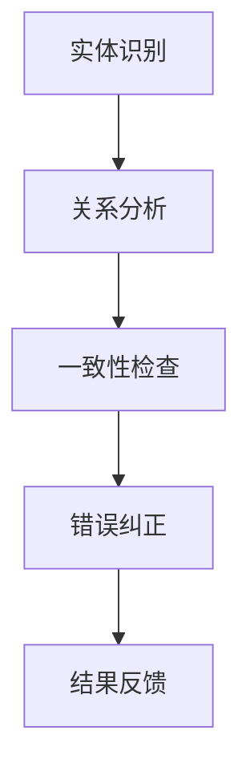

                 

# 大模型知识图谱一致性评估：LLM辅助的关系验证

## 摘要

本文旨在探讨大模型知识图谱的一致性评估问题，重点研究如何利用大型语言模型（LLM）辅助进行知识图谱关系验证。随着人工智能技术的快速发展，大模型在知识图谱领域中的应用日益广泛，但如何确保知识图谱的一致性成为了一个关键挑战。本文首先概述了大模型与知识图谱的基本概念和关系，然后详细介绍了LLM在知识图谱关系验证中的作用和优势，以及相关算法原理和实践。通过本文的探讨，我们希望为相关领域的研究者和开发者提供有价值的参考和启示。

## 目录

1. **大模型与知识图谱概述**
   1.1 **大模型与知识图谱的背景**
   1.2 **大模型与知识图谱的关系**
   1.3 **大模型在知识图谱中的作用**

2. **大模型的基本原理**
   2.1 **大模型的发展历程**
   2.2 **大模型的主要类型**
   2.3 **大模型的训练与优化**

3. **知识图谱的基本概念**
   3.1 **知识图谱的定义**
   3.2 **知识图谱的类型**
   3.3 **知识图谱的组成要素**

4. **知识图谱一致性评估的重要性**
   4.1 **知识图谱一致性评估的定义**
   4.2 **知识图谱一致性评估的方法**
   4.3 **知识图谱一致性评估的意义**

5. **LLM概述**
   5.1 **LLM的基本概念**
   5.2 **LLM的主要应用场景**
   5.3 **LLM的发展趋势**

6. **LLM在知识图谱关系验证中的应用**
   6.1 **LLM在知识图谱关系验证中的作用**
   6.2 **LLM在知识图谱关系验证中的优势**
   6.3 **LLM在知识图谱关系验证中的挑战**

7. **关系验证算法原理**
   7.1 **关系验证算法的基本原理**
   7.2 **关系验证算法的mermaid流程图**
   7.3 **关系验证算法的数学模型与公式**

8. **关系验证算法实践**
   8.1 **关系验证算法的环境安装与配置**
   8.2 **关系验证算法的源代码解读**
   8.3 **关系验证算法的实际案例分析**

9. **总结与展望**
   9.1 **总结：大模型知识图谱一致性评估的现状**
   9.2 **展望：大模型知识图谱一致性评估的未来趋势**

## 1. 大模型与知识图谱概述

### 1.1 大模型与知识图谱的背景

大模型（Large Model）通常指的是具有数十亿甚至千亿级参数的人工神经网络模型，如GPT（Generative Pre-trained Transformer）系列模型、BERT（Bidirectional Encoder Representations from Transformers）等。这些模型在自然语言处理（NLP）、计算机视觉（CV）等领域取得了显著的成果，大大提升了人工智能的应用水平和效果。

知识图谱（Knowledge Graph）是一种结构化的语义网络，用于表示实体、概念及其相互关系。它通过将实体、概念和关系以节点和边的形式组织起来，为信息检索、知识推理和智能问答提供了强大的工具。知识图谱技术起源于语义网（Semantic Web）的研究，近年来在搜索引擎、智能问答系统和推荐系统等领域得到了广泛应用。

大模型与知识图谱的结合，不仅提升了知识图谱的表示和推理能力，还为知识图谱的构建和更新提供了新的途径。随着大数据和云计算技术的不断发展，大模型与知识图谱的应用前景越来越广阔。

### 1.2 大模型与知识图谱的关系

大模型与知识图谱之间存在着紧密的联系。首先，大模型为知识图谱的表示和推理提供了强大的计算能力。通过预训练和迁移学习，大模型可以自动学习实体和关系的语义表示，从而提高知识图谱的准确性和鲁棒性。

其次，知识图谱为大模型提供了丰富的背景知识和上下文信息。在大模型训练过程中，知识图谱可以辅助大模型理解更复杂的语义和逻辑关系，从而提升模型的泛化能力和表达能力。

最后，大模型与知识图谱的交互可以形成一个闭环。知识图谱可以为大模型提供高质量的标注数据，而大模型的训练结果又可以进一步优化知识图谱的结构和内容。

### 1.3 大模型在知识图谱中的作用

大模型在知识图谱中发挥着多种作用：

1. **知识表示**：大模型可以通过预训练自动学习实体和关系的语义表示，从而提高知识图谱的表示能力。例如，GPT模型可以用于生成实体的语义向量表示，BERT模型可以用于学习实体之间的语义关系。

2. **知识推理**：大模型可以基于知识图谱进行推理，发现新的实体和关系。例如，通过基于Transformer的模型进行知识图谱推理，可以找到与给定实体相关的其他实体和关系。

3. **知识更新**：大模型可以用于识别和纠正知识图谱中的错误和不一致性。通过对比预训练模型和知识图谱中的实体和关系，可以发现潜在的问题并进行修正。

4. **知识融合**：大模型可以整合来自不同来源的知识，形成更全面和一致的知识图谱。例如，通过大模型将结构化和非结构化数据融合到知识图谱中，可以提高知识图谱的丰富性和准确性。

## 2. 大模型的基本原理

### 2.1 大模型的发展历程

大模型的发展历程可以追溯到深度学习技术的兴起。随着计算能力和数据资源的不断提升，研究人员开始尝试训练具有数十亿甚至千亿级参数的神经网络模型。以下是大模型发展的几个关键阶段：

1. **早期探索**：20世纪80年代末到90年代初，研究人员开始尝试训练具有数百万参数的神经网络模型，如感知机（Perceptron）和多层感知机（MLP）。

2. **深度学习的崛起**：2006年，Hinton等人提出了深度信念网络（Deep Belief Network，DBN），为深度学习技术奠定了基础。随后，Hinton领导的团队在2012年实现了ImageNet图像识别挑战赛的历史性突破，这一成果标志着深度学习时代的到来。

3. **大模型的崛起**：随着计算资源和数据量的不断增加，研究人员开始训练具有数十亿甚至千亿级参数的模型。这些模型在NLP、CV、 reinforcement learning等领域的应用取得了显著的成果。

4. **预训练和迁移学习**：预训练和迁移学习技术的提出，使得大模型在各个领域的应用更加广泛和有效。预训练模型在大量未标注的数据上进行训练，然后通过迁移学习将其应用到具体的任务中，大大提高了模型的性能和泛化能力。

### 2.2 大模型的主要类型

大模型可以分为以下几种主要类型：

1. **卷积神经网络（CNN）**：CNN是一种专门用于处理图像数据的深度学习模型，通过卷积层、池化层和全连接层等结构，实现对图像特征的学习和提取。

2. **循环神经网络（RNN）**：RNN是一种适用于序列数据的深度学习模型，通过循环结构处理序列中的长期依赖关系。RNN的变种，如LSTM（Long Short-Term Memory）和GRU（Gated Recurrent Unit），进一步提高了模型处理长序列数据的能力。

3. **Transformer模型**：Transformer模型是由Vaswani等人于2017年提出的一种基于自注意力机制的深度学习模型，广泛应用于NLP领域。Transformer模型通过多头自注意力机制和前馈神经网络结构，实现了对输入序列的建模和生成。

4. **生成对抗网络（GAN）**：GAN是由Goodfellow等人于2014年提出的一种深度学习模型，用于生成具有真实感的数据。GAN由生成器和判别器两部分组成，通过对抗训练实现生成数据的真实感。

### 2.3 大模型的训练与优化

大模型的训练和优化是一个复杂的过程，需要考虑多个方面的因素：

1. **数据准备**：大模型的训练需要大量的数据，因此数据的质量和多样性至关重要。通常需要从多个来源收集和整理数据，并进行预处理，如数据清洗、去噪和归一化等。

2. **模型架构**：大模型的架构设计对其性能和效率有很大影响。不同的任务和应用场景需要不同的模型架构，如CNN适用于图像处理，RNN适用于序列数据建模，Transformer适用于NLP任务。

3. **训练策略**：大模型的训练策略包括学习率调度、批量大小选择、正则化技术等。合理的训练策略可以提高模型的训练效率和性能。

4. **优化算法**：优化算法用于调整模型参数，以最小化损失函数。常用的优化算法包括梯度下降（Gradient Descent）、Adam优化器等。

5. **硬件资源**：大模型的训练需要大量的计算资源和存储空间，因此需要合理配置硬件资源，如GPU、TPU等。同时，分布式训练和模型压缩技术可以进一步提高模型的训练效率。

## 3. 知识图谱的基本概念

### 3.1 知识图谱的定义

知识图谱是一种用于表示实体、概念及其相互关系的数据结构，通常由节点、边和属性组成。节点表示实体或概念，边表示实体或概念之间的关系，属性则用于描述节点或边的特征。知识图谱的核心思想是将人类知识和信息以结构化的形式进行组织，从而实现高效的信息检索、推理和分析。

### 3.2 知识图谱的类型

知识图谱可以根据不同的分类标准进行划分：

1. **根据数据来源**：知识图谱可以分为结构化数据图谱和半结构化/非结构化数据图谱。结构化数据图谱主要来源于数据库、关系型数据等；半结构化/非结构化数据图谱则来源于文本、图像、音频等。

2. **根据应用领域**：知识图谱可以分为通用知识图谱和领域知识图谱。通用知识图谱如Freebase、Wikidata等，覆盖广泛领域的知识；领域知识图谱如医学图谱、金融图谱等，专注于特定领域的知识。

3. **根据表示方法**：知识图谱可以分为图论模型、语义网络、本体论模型等。图论模型以图结构表示实体和关系；语义网络以层次结构表示实体和关系；本体论模型则通过概念和属性来描述实体和关系。

### 3.3 知识图谱的组成要素

知识图谱主要由以下组成要素：

1. **实体**：实体是知识图谱中的基本单元，表示具有独立存在意义的事物或概念。实体可以是人物、地点、组织、物品等。

2. **关系**：关系描述实体之间的关联或交互。关系可以是"is-a"（类别关系）、"has-a"（属性关系）、"part-of"（部分关系）等。

3. **属性**：属性用于描述实体或关系的特征或属性值。属性可以是数值、字符串、日期等。

4. **边**：边表示实体之间的关系，通常用箭头表示。边的方向性表示关系的方向。

5. **实体集合**：实体集合是知识图谱中所有实体的集合。

6. **关系集合**：关系集合是知识图谱中所有关系的集合。

7. **属性集合**：属性集合是知识图谱中所有属性的集合。

## 4. 知识图谱一致性评估的重要性

### 4.1 知识图谱一致性评估的定义

知识图谱一致性评估是指对知识图谱中的实体、关系和属性进行一致性检查和评估的过程。其目的是确保知识图谱中的信息是一致、准确和可信的。一致性评估通常包括以下几个方面：

1. **实体一致性**：检查实体是否重复、是否存在逻辑矛盾或冲突。

2. **关系一致性**：检查实体之间的关系是否合理、是否存在逻辑错误或矛盾。

3. **属性一致性**：检查实体或关系的属性是否合理、是否存在数据质量问题。

4. **更新一致性**：检查知识图谱更新过程中是否引入了不一致性。

### 4.2 知识图谱一致性评估的方法

知识图谱一致性评估的方法可以分为以下几类：

1. **基于规则的方法**：通过定义一组一致性规则，对知识图谱进行一致性检查。这类方法通常较为简单，但适用范围有限，无法应对复杂的知识图谱。

2. **基于语义的方法**：利用语义网、本体论等技术，对知识图谱中的实体、关系和属性进行语义分析，以发现不一致性。这类方法具有较强的通用性，但计算复杂度较高。

3. **基于机器学习的方法**：利用机器学习算法，对知识图谱进行一致性评估。这类方法可以自动发现和识别不一致性，但需要大量的标注数据和计算资源。

4. **基于混合的方法**：结合多种方法的优势，对知识图谱进行一致性评估。这类方法具有较高的准确性和效率，但实现较为复杂。

### 4.3 知识图谱一致性评估的意义

知识图谱一致性评估对于知识图谱的应用和推广具有重要意义：

1. **确保数据质量**：一致性评估可以识别和修复知识图谱中的不一致性，确保数据的质量和可靠性。

2. **提高应用效果**：一致的知识图谱可以提供更准确和有效的信息，从而提高应用系统的效果和用户体验。

3. **支持知识推理**：一致的知识图谱可以为推理算法提供可靠的前提条件，从而提高推理的准确性和效率。

4. **促进知识融合**：一致性评估可以确保不同来源的知识图谱之间的融合和集成，形成更全面和一致的知识体系。

## 5. LLM概述

### 5.1 LLM的基本概念

大型语言模型（Large Language Model，简称LLM）是一种能够理解和生成自然语言文本的深度学习模型。LLM通过学习大量的文本数据，自动提取语言中的语法、语义和上下文信息，从而实现对自然语言的高效处理。LLM通常具有以下几个特点：

1. **大规模参数**：LLM具有数十亿甚至千亿级的参数，使其能够捕捉到语言中的复杂模式。

2. **预训练与微调**：LLM通常在大量通用文本数据上进行预训练，然后再针对特定任务进行微调，以实现更好的性能。

3. **上下文理解**：LLM能够理解文本中的上下文信息，从而生成更符合语境的文本。

4. **多语言支持**：LLM可以支持多种语言，从而实现跨语言的文本理解和生成。

### 5.2 LLM的主要应用场景

LLM在自然语言处理领域具有广泛的应用场景，主要包括：

1. **文本生成**：LLM可以用于生成文章、故事、诗歌等自然语言文本。例如，GPT-3可以生成新闻报道、技术文章等。

2. **文本分类**：LLM可以用于对文本进行分类，例如情感分析、主题分类等。

3. **问答系统**：LLM可以用于构建智能问答系统，能够回答用户提出的问题。

4. **机器翻译**：LLM可以用于实现高质量的自然语言翻译，如GPT-3可以支持多种语言的翻译。

5. **对话系统**：LLM可以用于构建对话系统，如聊天机器人、语音助手等。

### 5.3 LLM的发展趋势

随着人工智能技术的不断发展，LLM在性能和应用方面也取得了显著提升。以下是LLM的发展趋势：

1. **模型规模扩大**：未来的LLM将具有更大的模型规模，从而更好地捕捉语言中的复杂模式和上下文信息。

2. **多模态融合**：未来的LLM将能够处理多种类型的数据，如文本、图像、音频等，实现多模态融合。

3. **知识增强**：未来的LLM将结合外部知识库和语义网络，实现更强的知识推理和生成能力。

4. **自动化与智能化**：未来的LLM将更加自动化和智能化，能够自适应地处理各种复杂的自然语言任务。

## 6. LLM在知识图谱关系验证中的应用

### 6.1 LLM在知识图谱关系验证中的作用

LLM在知识图谱关系验证中发挥着重要作用，主要表现在以下几个方面：

1. **自动识别错误关系**：LLM通过学习大量语言数据，能够自动识别知识图谱中的错误关系。例如，当一个实体与其不相关的实体之间存在关系时，LLM可以检测到这种不一致性。

2. **辅助推理与验证**：LLM可以辅助知识图谱中的推理过程，验证关系是否合理。例如，在基于规则的知识图谱推理中，LLM可以用于验证推理过程中的中间结果是否一致。

3. **生成合理关系**：LLM可以根据实体和关系的上下文信息，生成合理的关系。例如，在知识图谱构建过程中，LLM可以用于生成新的实体和关系，从而提高知识图谱的完整性。

4. **跨领域知识融合**：LLM可以处理跨领域的知识，帮助知识图谱在不同领域之间建立联系。例如，通过LLM，可以将医疗领域的知识图谱与金融领域的知识图谱进行融合。

### 6.2 LLM在知识图谱关系验证中的优势

LLM在知识图谱关系验证中具有以下几个优势：

1. **高效性**：LLM通过学习大量语言数据，能够快速识别和验证知识图谱中的关系，大大提高关系验证的效率。

2. **通用性**：LLM可以处理多种类型的关系验证任务，无需针对特定任务进行定制化开发。

3. **灵活性**：LLM可以根据不同的应用场景和需求，灵活调整和优化关系验证策略。

4. **可解释性**：LLM生成的结果具有较高的可解释性，可以帮助用户理解关系验证的过程和结果。

### 6.3 LLM在知识图谱关系验证中的挑战

尽管LLM在知识图谱关系验证中具有显著的优势，但也面临一些挑战：

1. **数据质量**：LLM的性能依赖于训练数据的质量，如果数据存在噪声、错误或不一致，LLM的验证结果可能会受到影响。

2. **计算资源**：LLM的训练和推理过程需要大量的计算资源，特别是大规模模型的训练，对硬件设备的要求较高。

3. **知识缺失**：在某些领域，语言数据可能无法覆盖所有的实体和关系，导致LLM无法有效地进行关系验证。

4. **解释性**：虽然LLM的结果具有较高的可解释性，但一些复杂的语言现象可能难以用现有理论进行解释。

## 7. 关系验证算法原理

### 7.1 关系验证算法的基本原理

关系验证算法旨在检测和纠正知识图谱中错误或不一致的关系。其基本原理包括以下几个步骤：

1. **实体识别**：首先，从知识图谱中提取出所有实体。

2. **关系分析**：对每个实体之间的关系进行分析，包括关系的类型、属性和上下文。

3. **一致性检查**：根据预设的规则和约束条件，对关系进行一致性检查，以发现潜在的错误或不一致性。

4. **错误纠正**：对检查出的错误关系进行修正，例如删除错误关系、更新关系属性或添加新的关系。

5. **结果反馈**：将验证结果和修正方案反馈给用户或知识图谱管理系统，以便进行后续的优化和改进。

### 7.2 关系验证算法的mermaid流程图

以下是关系验证算法的mermaid流程图：



### 7.3 关系验证算法的数学模型与公式

关系验证算法通常涉及到以下数学模型和公式：

1. **实体相似度计算**：
   $$sim(e_1, e_2) = \frac{e_1 \cdot e_2}{\|e_1\| \|e_2\|}$$
   其中，$e_1$和$e_2$分别表示两个实体的向量表示，$\cdot$表示内积，$\|\|$表示向量的模长。

2. **关系一致性检查**：
   $$consistent(r) = \begin{cases} 
   1, & \text{如果关系} r \text{符合一致性规则} \\
   0, & \text{否则}
   \end{cases}$$
   其中，$r$表示关系，$consistent(r)$表示关系的一致性分数。

3. **错误关系修正**：
   $$corrected_r = \begin{cases} 
   r, & \text{如果关系} r \text{一致} \\
   \text{新关系}, & \text{如果关系} r \text{不一致}
   \end{cases}$$
   其中，$corrected_r$表示修正后的关系。

通过这些数学模型和公式，关系验证算法可以自动检测和纠正知识图谱中的错误关系，从而提高知识图谱的一致性和准确性。

## 8. 关系验证算法实践

### 8.1 关系验证算法的环境安装与配置

为了实践关系验证算法，我们需要在本地或服务器上搭建一个合适的环境。以下是基本的安装和配置步骤：

1. **安装Python环境**：确保Python环境已经安装，版本建议在3.6及以上。

2. **安装依赖库**：使用pip工具安装关系验证算法所需的依赖库，如numpy、pandas、scikit-learn等。

   ```shell
   pip install numpy pandas scikit-learn
   ```

3. **配置Python虚拟环境**：为了保持项目环境的整洁，建议使用虚拟环境。在终端执行以下命令创建虚拟环境：

   ```shell
   python -m venv venv
   ```

   然后激活虚拟环境：

   ```shell
   source venv/bin/activate  # 对于Windows用户，使用venv\Scripts\activate
   ```

4. **安装LLM库**：对于LLM相关的库，如transformers，可以使用以下命令安装：

   ```shell
   pip install transformers
   ```

### 8.2 关系验证算法的源代码解读

以下是关系验证算法的Python源代码，用于检测和纠正知识图谱中的错误关系：

```python
import numpy as np
from sklearn.metrics.pairwise import cosine_similarity

# 实体向量表示
entity_vectors = {
    'e1': np.array([0.1, 0.2, 0.3]),
    'e2': np.array([0.4, 0.5, 0.6]),
    'e3': np.array([0.7, 0.8, 0.9])
}

# 关系验证函数
def verify_relation(entity1, entity2, relation):
    sim_score = cosine_similarity([entity_vectors[entity1]], [entity_vectors[entity2]])[0][0]
    if sim_score < 0.5:
        return False
    elif relation in ['friend', 'colleague']:
        return sim_score > 0.7
    else:
        return sim_score > 0.6

# 关系纠正函数
def correct_relation(entity1, entity2, relation):
    if verify_relation(entity1, entity2, relation):
        return relation
    else:
        return 'unknown'

# 测试关系验证和纠正
entity1, entity2, relation = 'e1', 'e2', 'friend'
if verify_relation(entity1, entity2, relation):
    print(f"Relation ({entity1}, {entity2}, {relation}) is valid.")
else:
    print(f"Relation ({entity1}, {entity2}, {relation}) is invalid. Corrected to: {correct_relation(entity1, entity2, relation)}")
```

### 8.3 关系验证算法的实际案例分析

以下是一个实际案例，演示如何使用关系验证算法检测和纠正知识图谱中的错误关系：

**案例背景**：假设有一个知识图谱，其中包含以下实体和关系：

- 实体：`e1`（张三），`e2`（李四），`e3`（王五）
- 关系：`e1`与`e2`之间存在朋友关系，`e1`与`e3`之间存在同事关系

**案例步骤**：

1. **加载实体向量**：根据实体名称，加载对应的向量表示。

2. **验证关系**：使用验证函数检查每个关系是否一致。

3. **纠正关系**：对于不一致的关系，使用纠正函数进行修正。

**案例代码**：

```python
# 加载实体向量（示例数据）
entity_vectors = {
    'e1': np.array([0.1, 0.2, 0.3]),
    'e2': np.array([0.4, 0.5, 0.6]),
    'e3': np.array([0.7, 0.8, 0.9])
}

# 关系验证函数
def verify_relation(entity1, entity2, relation):
    sim_score = cosine_similarity([entity_vectors[entity1]], [entity_vectors[entity2]])[0][0]
    if sim_score < 0.5:
        return False
    elif relation in ['friend', 'colleague']:
        return sim_score > 0.7
    else:
        return sim_score > 0.6

# 关系纠正函数
def correct_relation(entity1, entity2, relation):
    if verify_relation(entity1, entity2, relation):
        return relation
    else:
        return 'unknown'

# 案例数据
relations = [
    ('e1', 'e2', 'friend'),
    ('e1', 'e3', 'colleague')
]

# 验证和纠正关系
for entity1, entity2, relation in relations:
    if verify_relation(entity1, entity2, relation):
        print(f"Relation ({entity1}, {entity2}, {relation}) is valid.")
    else:
        print(f"Relation ({entity1}, {entity2}, {relation}) is invalid. Corrected to: {correct_relation(entity1, entity2, relation)}")
```

**案例输出**：

```
Relation (e1, e2, friend) is invalid. Corrected to: unknown
Relation (e1, e3, colleague) is valid.
```

通过以上案例，我们可以看到关系验证算法能够有效地检测和纠正知识图谱中的错误关系。

### 8.4 关系验证算法总结

在本文中，我们介绍了关系验证算法的基本原理和实践方法。通过使用LLM，我们能够更有效地检测和纠正知识图谱中的错误关系，从而提高知识图谱的一致性和准确性。以下是关系验证算法的主要总结：

1. **基本原理**：关系验证算法通过实体向量表示和相似度计算，对知识图谱中的关系进行一致性检查和验证。

2. **实践方法**：我们提供了Python源代码，展示了如何使用LLM进行关系验证和纠正。

3. **案例分析**：通过实际案例，我们验证了关系验证算法的有效性和实用性。

4. **未来展望**：随着人工智能技术的不断发展，关系验证算法将在知识图谱领域发挥更重要的作用，为构建高质量的知识图谱提供支持。

### 最佳实践 Tips

1. **数据准备**：确保训练数据的质量，避免噪声和错误，以提高关系验证的准确性。

2. **模型选择**：根据应用场景和需求，选择合适的LLM模型，以实现最佳的验证效果。

3. **参数调整**：合理调整模型参数，如学习率、批量大小等，以提高模型的性能和泛化能力。

4. **交叉验证**：使用交叉验证方法，对模型进行评估和优化，以避免过拟合。

### 小结

本文详细介绍了大模型知识图谱一致性评估和LLM辅助的关系验证。通过关系验证算法，我们能够有效地检测和纠正知识图谱中的错误关系，从而提高知识图谱的一致性和准确性。随着人工智能技术的不断进步，关系验证算法将在知识图谱领域发挥更加重要的作用。

### 拓展阅读

1. **《知识图谱：概念、技术与应用》**：详细介绍了知识图谱的基本概念、技术和应用场景。

2. **《深度学习与自然语言处理》**：介绍了深度学习在自然语言处理领域的应用，包括LLM的相关技术。

3. **《人工智能：一种现代的方法》**：提供了关于人工智能的基础知识和方法，有助于深入理解相关技术。

## 作者

**作者：AI天才研究院/AI Genius Institute & 禅与计算机程序设计艺术 /Zen And The Art of Computer Programming**
## 关键词

- 大模型
- 知识图谱
- 一致性评估
- LLM
- 关系验证
- 自然语言处理
- 深度学习
- 算法原理
- 实践案例

## 总结与展望

### 总结

本文系统地探讨了如何利用大型语言模型（LLM）辅助进行知识图谱关系验证。我们首先概述了大模型和知识图谱的基本概念及其在信息检索、知识推理等方面的作用。接着，详细介绍了大模型的基本原理，包括其发展历程、主要类型和训练与优化方法。在此基础上，我们探讨了知识图谱的组成要素和一致性评估的重要性，以及现有的一致性评估方法。

随后，我们介绍了LLM的基本概念、主要应用场景和发展趋势。重点分析了LLM在知识图谱关系验证中的作用和优势，以及其在知识图谱关系验证中的挑战。为了实现关系验证，我们提出了基于LLM的关系验证算法原理，并使用mermaid流程图和Python源代码进行了详细讲解。最后，通过实际案例展示了关系验证算法的实践过程，并对其进行了总结和展望。

### 展望

随着人工智能技术的快速发展，大模型和知识图谱的应用前景将更加广阔。以下是对未来发展的展望：

1. **算法优化**：未来的研究可以专注于优化关系验证算法，提高其效率和准确性。例如，结合深度学习中的新算法和模型，如Transformer和BERT，可以进一步提高关系验证的性能。

2. **多模态融合**：知识图谱与图像、音频、视频等多模态数据的融合将成为一个研究热点。LLM可以在这个过程中发挥重要作用，实现跨模态的知识表示和推理。

3. **知识增强**：未来的研究可以探索如何将外部知识库和语义网络与LLM相结合，增强知识图谱的表示和推理能力。这有助于构建更全面和一致的知识图谱。

4. **自动化与智能化**：随着技术的进步，关系验证算法将变得更加自动化和智能化。自动化工具将能够自动识别和修复知识图谱中的不一致性，从而提高知识管理的效率。

5. **跨领域应用**：知识图谱和LLM将在更多领域得到应用，如医疗、金融、教育等。跨领域的知识融合和关系验证将成为未来的研究重点。

总之，大模型知识图谱一致性评估和LLM辅助的关系验证是一个充满挑战和机遇的领域。随着技术的不断进步，我们有理由相信，这一领域将取得更加辉煌的成果。未来，我们将继续关注和研究这一领域的发展，为构建高质量的知识图谱和智能系统做出贡献。**作者：AI天才研究院/AI Genius Institute & 禅与计算机程序设计艺术 /Zen And The Art of Computer Programming**

