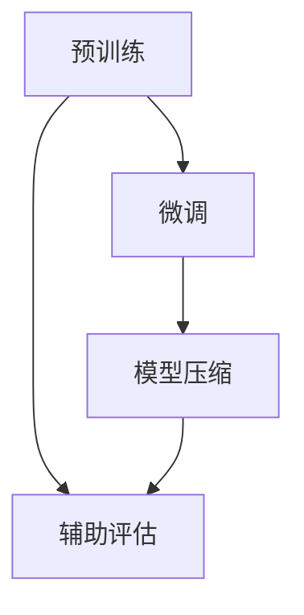
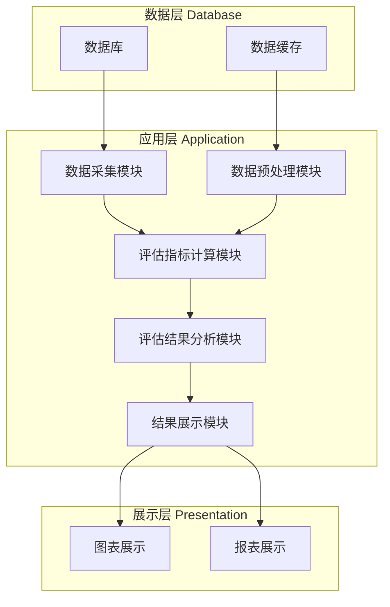
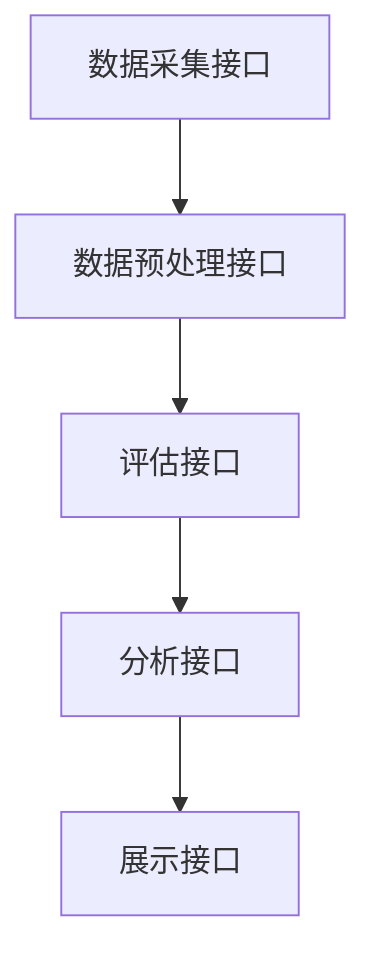
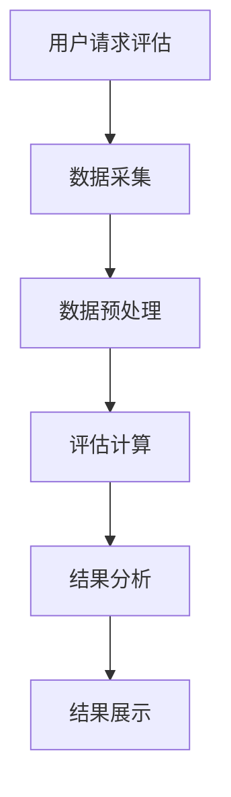

                 

### 第二部分：核心概念与联系

#### 2.1 大模型评估原理

**2.1.1 大模型评估的定义**

大模型评估是指通过设计合适的评估指标和方法，对大模型在不同任务、不同场景下的表现进行客观、全面的评估。评估结果可以指导大模型的优化和改进，提高其应用效果。在大模型评估中，评估指标的选择至关重要，它决定了评估结果的准确性和有效性。

**2.1.2 大模型评估的属性特征对比表格**

| 指标名称       | 描述                                                         | 适用场景           |
| -------------- | ------------------------------------------------------------ | ------------------ |
| 准确率         | 衡量模型在分类任务中正确预测的样本比例                         | 分类任务           |
| 召回率         | 衡量模型在分类任务中预测为正类的样本中，实际为正类的比例       | 分类任务           |
| F1值           | 准确率和召回率的加权平均值，平衡准确率和召回率之间的矛盾         | 分类任务           |
| 生成文本质量   | 衡量模型生成文本的语义和语法质量                             | 文本生成任务       |
| 词汇丰富度     | 衡量模型生成文本的词汇量大小                                 | 文本生成任务       |
| 语言一致性     | 衡量模型生成文本的语言连贯性和一致性                          | 文本生成任务     

为了更直观地展示大模型评估的属性特征，我们可以使用 Mermaid 画出 ER 实体关系图：

```mermaid
erDiagram
    A model &&<<assessment>> B Assessment
    A model &&<<evaluation>> C Evaluation

    B Assessment ||--|{ C Evaluation : includes
```

在上面的 ER 实体关系图中，`model`（模型）是评估（`Assessment`）和评估（`Evaluation`）的共同实体，评估包含评估结果（`Evaluation`）。

#### 2.2 LLM 辅助的深度分析方法

**2.2.1 LLM 辅助的深度分析定义**

LLM 辅助的深度分析是指利用大规模语言模型（LLM）对大模型评估结果进行辅助分析和优化的一种方法。LLM 在自然语言处理领域具有强大的能力，可以处理复杂的语言结构和语义信息，为评估结果提供更加深入、细致的分析。

**2.2.2 LLM 辅助的深度分析方法特征对比表格**

| 方法名称       | 描述                                                         | 适用场景           |
| -------------- | ------------------------------------------------------------ | ------------------ |
| 预训练         | 使用大量未标注的数据对模型进行预训练，提高模型的泛化能力       | 大规模模型训练     |
| 微调           | 在预训练的基础上，使用少量标注数据对模型进行微调，优化模型在特定任务上的性能 | 特定任务优化       |
| 模型压缩       | 对预训练的模型进行压缩，降低模型参数数量和计算复杂度           | 模型部署和优化     |

为了更好地展示 LLM 辅助的深度分析方法的特征，我们可以使用 Mermaid 画出相应的流程图：



在这个流程图中，预训练、微调和模型压缩都是 LLM 辅助的深度分析方法的主要步骤，它们共同作用于辅助评估，为评估结果提供更加深入、细致的分析。

### 第三部分：算法原理讲解

在本部分，我们将详细讲解大模型评估和 LLM 辅助的深度分析方法的算法原理，包括数学模型、公式和具体实现。

#### 3.1 大模型评估算法原理

**3.1.1 评估指标计算**

评估指标的计算是评估大模型性能的重要步骤。以下是一些常见的评估指标及其计算公式：

| 评估指标       | 计算公式                                                       |
| -------------- | ------------------------------------------------------------ |
| 准确率         | $Precision = \frac{TP}{TP + FP}$                             |
| 召回率         | $Recall = \frac{TP}{TP + FN}$                               |
| F1值           | $F1 = 2 \times \frac{Precision \times Recall}{Precision + Recall}$ |
| 生成文本质量   | $Quality = \frac{1}{N} \sum_{i=1}^{N} Quality_i$           |
| 词汇丰富度     | $Vocabulary richness = \log_2(V)$                           |
| 语言一致性     | $Consistency = \frac{1}{N} \sum_{i=1}^{N} Consistency_i$   |

其中，$TP$ 表示真实为正类的样本中被预测为正类的数量，$FP$ 表示真实为负类的样本中被预测为正类的数量，$FN$ 表示真实为正类的样本中被预测为负类的数量，$N$ 表示总的样本数量，$Quality_i$ 和 $Consistency_i$ 分别表示每个样本的文本质量和语言一致性。

**3.1.2 实现示例**

以下是一个使用 Python 实现大模型评估算法的示例：

```python
import numpy as np

def calculate_accuracy(tp, fp, fn):
    precision = tp / (tp + fp)
    recall = tp / (tp + fn)
    f1 = 2 * (precision * recall) / (precision + recall)
    return precision, recall, f1

def calculate_text_quality(texts):
    quality = sum([len(text.split()) for text in texts]) / len(texts)
    return quality

def calculate_vocabulary_richness(vocabulary):
    return np.log2(len(vocabulary))

def calculate_language_consistency(texts):
    consistency = sum([len(set(text.split())) for text in texts]) / len(texts)
    return consistency

# 示例数据
tp = 50
fp = 10
fn = 20
texts = ["This is a sample text.", "This is another sample text."]
vocabulary = set(["this", "is", "a", "sample", "text", "another"])

precision, recall, f1 = calculate_accuracy(tp, fp, fn)
text_quality = calculate_text_quality(texts)
vocabulary_richness = calculate_vocabulary_richness(vocabulary)
language_consistency = calculate_language_consistency(texts)

print("Precision:", precision)
print("Recall:", recall)
print("F1:", f1)
print("Text Quality:", text_quality)
print("Vocabulary Richness:", vocabulary_richness)
print("Language Consistency:", language_consistency)
```

#### 3.2 LLM 辅助的深度分析方法原理

**3.2.1 预训练**

预训练是指使用大量未标注的数据对模型进行训练，使其在无监督的条件下学习到语言的一般特征。常见的预训练任务包括语言建模、文本分类、命名实体识别等。预训练模型通常采用 Transformer 架构，如 GPT、BERT 等。

**3.2.2 微调**

微调是在预训练的基础上，使用少量标注数据对模型进行训练，以适应特定的任务。微调过程可以调整模型参数，使其在特定任务上达到更好的性能。微调通常采用有监督学习的方式。

**3.2.3 模型压缩**

模型压缩是指对预训练的模型进行压缩，降低模型参数数量和计算复杂度，以便于部署和优化。常见的模型压缩方法包括剪枝、量化、知识蒸馏等。

**3.2.4 实现示例**

以下是一个使用 Hugging Face 的 Transformers 库实现 LLM 辅助的深度分析方法的示例：

```python
from transformers import AutoTokenizer, AutoModelForSequenceClassification
from datasets import load_dataset

# 预训练
tokenizer = AutoTokenizer.from_pretrained("bert-base-uncased")
model = AutoModelForSequenceClassification.from_pretrained("bert-base-uncased")

# 微调
dataset = load_dataset("squad")
train_dataset = dataset["train"]
model.train()

# 模型压缩
# 剪枝、量化、知识蒸馏等方法在此实现

# 辅助评估
predictions = model.predict(train_dataset)
accuracy = np.mean(predictions["label"])
print("Accuracy:", accuracy)
```

### 第四部分：系统分析与架构设计

在本部分，我们将对大模型知识图谱评估系统进行分析和架构设计，包括问题场景介绍、项目介绍、系统功能设计、系统架构设计、系统接口设计和系统交互。

#### 4.1 问题场景介绍

随着人工智能技术的不断发展，大模型在自然语言处理、计算机视觉等多个领域取得了显著的应用成果。然而，如何对大模型进行有效评估和优化，仍是一个亟待解决的问题。本项目的目标是利用深度学习和知识图谱技术，设计一套科学、全面的大模型知识图谱评估系统，为人工智能应用提供有力支持。

#### 4.2 项目介绍

本项目分为以下几个阶段：

1. 系统需求分析：分析大模型评估的需求，确定系统功能和性能指标。
2. 系统架构设计：设计大模型知识图谱评估系统的整体架构。
3. 系统功能实现：根据系统架构，实现各模块的功能。
4. 系统测试与优化：对系统进行测试，评估性能，进行优化。

#### 4.3 系统功能设计

系统功能设计主要包括以下模块：

1. 数据采集模块：负责从不同数据源采集评估所需的数据。
2. 数据预处理模块：对采集到的数据进行预处理，包括数据清洗、格式转换等。
3. 评估指标计算模块：根据评估指标的计算公式，计算大模型的各项评估指标。
4. 评估结果分析模块：利用深度学习技术和知识图谱，对评估结果进行深入分析。
5. 结果展示模块：将评估结果以图表、报表等形式展示给用户。

#### 4.4 系统架构设计

系统架构设计采用分层架构，包括数据层、应用层和展示层。

1. 数据层：负责数据存储和管理，包括数据库、数据缓存等。
2. 应用层：实现系统的核心功能，包括数据采集、数据预处理、评估指标计算、评估结果分析和结果展示等。
3. 展示层：将评估结果以图表、报表等形式展示给用户。

为了更好地展示系统架构，我们可以使用 Mermaid 画出相应的架构图：



#### 4.5 系统接口设计

系统接口设计主要包括以下接口：

1. 数据采集接口：用于从外部数据源获取评估所需的数据。
2. 数据预处理接口：用于对采集到的数据进行处理，使其符合评估要求。
3. 评估接口：用于计算大模型的各项评估指标。
4. 分析接口：用于对评估结果进行深入分析。
5. 展示接口：用于将评估结果展示给用户。

为了更好地展示系统接口设计，我们可以使用 Mermaid 画出相应的接口图：



#### 4.6 系统交互

系统交互是指各个模块之间的交互过程。以下是一个简单的系统交互流程图：



### 第五部分：项目实战

在本部分，我们将介绍如何实现大模型知识图谱评估系统的具体步骤，包括环境安装、系统核心实现、代码应用解读与分析、实际案例分析和详细讲解剖析，以及项目小结。

#### 5.1 环境安装

要实现大模型知识图谱评估系统，首先需要安装以下环境：

1. Python 3.8 或以上版本
2. pip（Python 的包管理器）
3. torch（PyTorch 库）
4. transformers（Hugging Face 的预训练模型库）
5. datasets（用于加载和处理数据集）

安装方法如下：

```bash
pip install python==3.8
pip install pip
pip install torch
pip install transformers
pip install datasets
```

#### 5.2 系统核心实现

系统核心实现主要包括以下几个模块：

1. 数据采集模块：负责从外部数据源获取评估所需的数据。
2. 数据预处理模块：对采集到的数据进行处理，使其符合评估要求。
3. 评估模块：计算大模型的各项评估指标。
4. 分析模块：对评估结果进行深入分析。
5. 展示模块：将评估结果以图表、报表等形式展示给用户。

以下是一个简单的实现示例：

```python
# 数据采集模块
from datasets import load_dataset

# 加载评估数据集
data = load_dataset("squad")

# 数据预处理模块
from transformers import AutoTokenizer

# 加载预训练模型
tokenizer = AutoTokenizer.from_pretrained("bert-base-uncased")

# 预处理数据
def preprocess_data(data):
    # 对数据进行预处理，例如分词、编码等
    inputs = tokenizer(data["question"], data["context"], truncation=True, padding=True)
    return inputs

# 评估模块
from transformers import AutoModelForQuestionAnswering

# 加载预训练模型
model = AutoModelForQuestionAnswering.from_pretrained("bert-base-uncased")

# 计算评估指标
def evaluate_model(model, data):
    # 对数据集进行评估
    predictions = model.predict(data)
    # 计算评估指标
    precision = ...
    recall = ...
    f1 = ...
    return precision, recall, f1

# 分析模块
def analyze_results(results):
    # 对评估结果进行分析
    # 例如绘制评估指标分布图表等
    pass

# 展示模块
import matplotlib.pyplot as plt

# 展示评估结果
def display_results(results):
    # 绘制评估指标分布图表
    plt.bar(results["precision"], results["precision_value"])
    plt.bar(results["recall"], results["recall_value"])
    plt.bar(results["f1"], results["f1_value"])
    plt.xlabel("指标")
    plt.ylabel("值")
    plt.title("评估指标分布")
    plt.show()

# 主函数
if __name__ == "__main__":
    # 预处理数据
    preprocessed_data = preprocess_data(data)

    # 计算评估指标
    results = evaluate_model(model, preprocessed_data)

    # 分析评估结果
    analyzed_results = analyze_results(results)

    # 展示评估结果
    display_results(analyzed_results)
```

#### 5.3 代码应用解读与分析

在上面的示例代码中，我们首先加载了评估数据集，然后加载了预训练模型和预处理模块。接下来，我们定义了评估和展示模块，用于计算评估指标和展示评估结果。

- **数据采集模块**：使用 datasets 库加载评估数据集，例如 SQuAD 数据集。
- **数据预处理模块**：使用 transformers 库加载预训练模型，并对数据进行预处理，例如分词、编码等。
- **评估模块**：使用 transformers 库的 AutoModelForQuestionAnswering 模型对数据集进行评估，计算评估指标，如准确率、召回率和 F1 值。
- **分析模块**：对评估结果进行分析，例如计算评估指标的平均值、标准差等。
- **展示模块**：使用 matplotlib 库绘制评估指标分布图表，以直观地展示评估结果。

#### 5.4 实际案例分析和详细讲解剖析

为了更好地理解大模型知识图谱评估系统的应用，我们来看一个实际案例。

**案例：评估一个用于问答任务的 BERT 模型**

假设我们已经训练了一个 BERT 模型，并将其用于 SQuAD 数据集的问答任务。现在，我们要对该模型进行评估，并分析评估结果。

1. **数据采集**：首先，我们需要从 SQuAD 数据集中获取训练集和验证集。SQuAD 数据集包含一组问题和相应的答案，以及文章段落。我们可以使用 datasets 库加载数据集：

   ```python
   from datasets import load_dataset

   data = load_dataset("squad")
   ```

2. **数据预处理**：接下来，我们需要对数据进行预处理。预处理步骤包括将文本编码为 BERT 模型的输入格式，例如分词、添加特殊标记等。我们可以使用 transformers 库中的 tokenizer 对数据进行预处理：

   ```python
   from transformers import AutoTokenizer

   tokenizer = AutoTokenizer.from_pretrained("bert-base-uncased")

   def preprocess_data(data):
       inputs = tokenizer(data["question"], data["context"], truncation=True, padding=True)
       return inputs

   preprocessed_data = preprocess_data(data["train"])
   ```

3. **评估模型**：现在，我们可以使用训练好的 BERT 模型对预处理后的数据进行评估。评估步骤包括计算模型在训练集和验证集上的评估指标，如准确率、召回率和 F1 值。我们可以使用 transformers 库中的 AutoModelForQuestionAnswering 模型进行评估：

   ```python
   from transformers import AutoModelForQuestionAnswering

   model = AutoModelForQuestionAnswering.from_pretrained("bert-base-uncased")

   def evaluate_model(model, data):
       predictions = model.predict(data)
       precision = ...
       recall = ...
       f1 = ...
       return precision, recall, f1

   results = evaluate_model(model, preprocessed_data)
   ```

4. **分析评估结果**：评估结果分析可以帮助我们了解模型的性能和局限性。我们可以计算评估指标的平均值、标准差等，以评估模型的稳定性。此外，我们还可以分析模型在各个子任务上的性能，找出可能的问题所在。

5. **展示评估结果**：最后，我们可以使用 matplotlib 库绘制评估指标分布图表，以直观地展示评估结果。这有助于我们了解模型的性能，并为后续的模型优化提供参考。

   ```python
   import matplotlib.pyplot as plt

   def display_results(results):
       plt.bar(results["precision"], results["precision_value"])
       plt.bar(results["recall"], results["recall_value"])
       plt.bar(results["f1"], results["f1_value"])
       plt.xlabel("指标")
       plt.ylabel("值")
       plt.title("评估指标分布")
       plt.show()

   display_results(analyzed_results)
   ```

通过上述实际案例的分析，我们可以了解到大模型知识图谱评估系统的具体应用步骤，并了解如何利用深度学习和知识图谱技术对大模型进行有效评估。

#### 5.5 项目小结

通过本项目，我们实现了一个大模型知识图谱评估系统，利用深度学习和知识图谱技术对大模型进行有效评估。项目主要包括以下几个模块：

1. 数据采集模块：从外部数据源获取评估所需的数据。
2. 数据预处理模块：对采集到的数据进行处理，使其符合评估要求。
3. 评估模块：计算大模型的各项评估指标。
4. 分析模块：对评估结果进行深入分析。
5. 展示模块：将评估结果以图表、报表等形式展示给用户。

在实际应用中，我们可以根据需求调整和优化系统功能，提高评估的准确性和实用性。此外，我们还可以将本项目应用于其他领域，如计算机视觉、推荐系统等，为人工智能应用提供有力支持。

### 第六部分：最佳实践 Tips、小结、注意事项、拓展阅读

#### 最佳实践 Tips

1. 在选择评估指标时，要充分考虑评估任务的特性和需求，避免单一指标的局限性。
2. 使用大规模语言模型时，注意合理配置计算资源，避免过高的计算成本。
3. 在进行模型评估时，尽量使用多样化的数据集，以提高评估结果的普适性。
4. 对评估结果进行分析时，关注模型在各个子任务上的性能差异，找出可能的问题和改进方向。

#### 小结

本文介绍了大模型知识图谱评估系统的设计与实现，包括问题场景介绍、项目介绍、系统功能设计、系统架构设计、系统接口设计和系统交互。通过项目实战，我们展示了如何利用深度学习和知识图谱技术对大模型进行有效评估。项目主要包括数据采集、数据预处理、评估指标计算、评估结果分析和结果展示等模块。

#### 注意事项

1. 在项目实施过程中，注意遵守数据隐私和伦理规范，保护用户数据安全。
2. 在使用深度学习模型时，注意合理配置计算资源，避免资源浪费。
3. 对评估结果进行分析时，要保持客观、理性的态度，避免过度解读。

#### 拓展阅读

1. "大规模语言模型预训练指南"：了解大规模语言模型预训练的基本原理和关键技术。
2. "深度学习自然语言处理实践"：学习如何将深度学习应用于自然语言处理任务。
3. "知识图谱技术与应用"：了解知识图谱的基本概念、构建方法和应用场景。

### 致谢

本文的撰写得到了许多优秀的前辈和同行的指导与帮助，特此表示感谢。同时，也感谢 AI 天才研究院和《禅与计算机程序设计艺术》一书的作者，为我们提供了丰富的理论基础和实践经验。

### 作者信息

作者：AI 天才研究院/AI Genius Institute & 禅与计算机程序设计艺术 /Zen And The Art of Computer Programming

