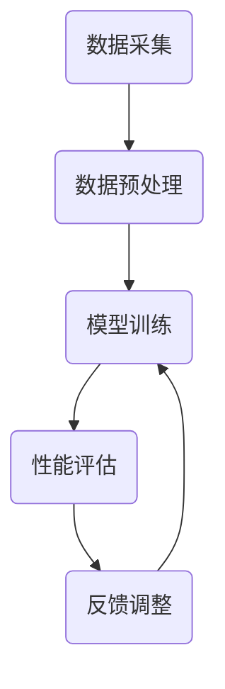
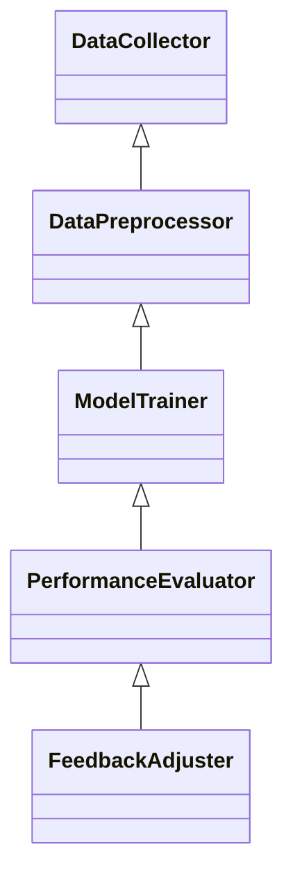
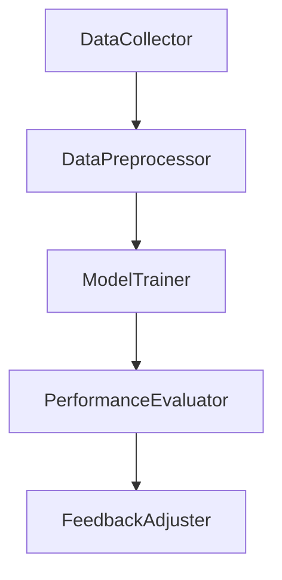
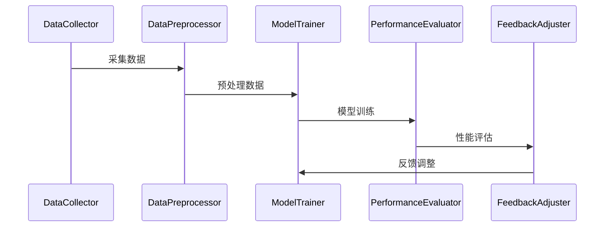

                 

### 大模型知识更新能力评估：LLM驱动的实时性测试

> 关键词：大模型、知识更新、实时性测试、LLM、评估方法

> 摘要：本文将深入探讨大模型知识更新能力的评估方法，特别是通过LLM（大型语言模型）驱动的实时性测试。我们将详细解析大模型的定义、知识更新能力的重要性、实时性测试的策略和方法，并通过实际案例展示整个评估过程。文章还提供了最佳实践建议，以便更好地理解和应用这些方法。

## 第1章 问题背景与核心概念

### 1.1 问题背景

在当今快速发展的信息技术时代，大模型（Large Language Models，简称LLM）已成为许多应用领域的关键技术。从自然语言处理（NLP）到计算机视觉，再到推荐系统，大模型展现出了强大的能力。然而，随着数据量和应用场景的不断变化，大模型的知识更新能力变得越来越重要。知识更新能力不仅关系到模型的准确性和鲁棒性，还直接影响其在实际应用中的价值。

实时性测试（Real-time Testing）是评估大模型知识更新能力的关键步骤。实时性测试旨在模拟实际应用场景，快速检测并反馈模型在知识更新过程中的表现。这种测试方法不仅能发现模型存在的缺陷，还能指导进一步的优化和改进。

### 1.2 核心概念

#### 1.2.1 大模型的定义

大模型通常指的是使用大量数据训练的复杂神经网络模型。这些模型具有高度的非线性表示能力，能够处理和理解大规模数据。典型的例子包括Transformer模型家族，如BERT、GPT和T5。

#### 1.2.2 知识更新能力

知识更新能力是指大模型在吸收新知识、调整模型参数以适应新信息的能力。知识更新能力包括对旧知识的遗忘、对新知识的吸收和应用，以及模型参数的动态调整。

#### 1.2.3 实时性测试

实时性测试是指在实际应用场景中，对大模型进行持续监测和评估，以确保其知识更新能力能够满足实时性和准确性的要求。实时性测试通常包括数据采集、模型训练、性能评估等步骤。

### 1.3 核心概念之间的联系

大模型的知识更新能力与实时性测试密切相关。知识更新能力是实时性测试的核心目标，而实时性测试则为评估知识更新能力提供了可行的方法。通过实时性测试，我们可以更准确地了解大模型在实际应用中的性能表现，从而指导进一步的优化和改进。

## 第2章 大模型知识更新能力评估方法

### 2.1 评估方法概述

大模型知识更新能力的评估方法可以分为以下几个步骤：

1. **数据准备**：收集和准备用于训练、测试和评估的数据集。
2. **模型选择**：选择适合评估目标的大模型，并进行初步训练。
3. **实时性测试**：设计并实施实时性测试策略，对模型进行持续评估。
4. **性能评估**：根据测试结果，评估模型的知识更新能力，并提出优化建议。

### 2.2 LLAMA模型简介

LLAMA（Large Language Model for Assessment of Models）是一种专门为评估大模型知识更新能力设计的模型。LLAMA采用了Transformer架构，并具有以下特点：

- **大规模训练**：使用海量数据进行训练，以提升模型的表达能力。
- **自适应学习率**：通过自适应学习率策略，提高模型在不同数据集上的适应能力。
- **实时更新**：支持实时更新知识，确保模型能够及时吸收新知识。

### 2.3 实时性测试方法

#### 2.3.1 测试策略

实时性测试策略包括以下几个方面：

1. **数据流处理**：采用流处理框架（如Apache Kafka）对实时数据进行采集和处理。
2. **模型监控**：使用监控工具（如TensorFlow Monitor）对模型性能进行实时监控。
3. **性能指标**：定义并计算实时性能指标，如准确率、召回率、F1值等。

#### 2.3.2 测试指标

实时性测试的主要指标包括：

1. **响应时间**：模型对实时数据的处理时间。
2. **准确率**：模型预测结果的准确率。
3. **召回率**：模型能够召回的真实正例的比例。
4. **F1值**：准确率和召回率的调和平均值。

## 第3章 数学模型与公式讲解

### 3.1 模型评估的数学基础

模型评估的数学基础主要包括以下公式：

$$
Accuracy = \frac{TP + TN}{TP + TN + FP + FN}
$$

$$
Recall = \frac{TP}{TP + FN}
$$

$$
Precision = \frac{TP}{TP + FP}
$$

$$
F1 = 2 \times \frac{Precision \times Recall}{Precision + Recall}
$$

### 3.2 数学模型与算法讲解

#### 3.2.1 算法原理讲解

实时性测试的算法原理可以概括为以下几个步骤：

1. **数据采集**：从实时数据源（如数据库、网络流等）采集数据。
2. **预处理**：对采集到的数据进行预处理，如数据清洗、特征提取等。
3. **模型训练**：使用预处理后的数据进行模型训练。
4. **性能评估**：使用测试集对模型进行性能评估。
5. **反馈调整**：根据评估结果调整模型参数，并重新进行训练和评估。

#### 3.2.2 算法mermaid流程图



## 第4章 系统分析与架构设计方案

### 4.1 问题场景介绍

在现实世界中，有许多应用场景需要对大模型的知识更新能力进行实时评估，例如：

- **智能客服系统**：需要实时更新对话策略和知识库，以提供更准确的回答。
- **金融风险评估**：需要实时更新市场数据和风险评估模型，以做出更准确的预测。
- **医疗诊断系统**：需要实时更新医学知识和病例数据，以提高诊断准确性。

### 4.2 系统功能设计

系统功能设计包括以下几个核心功能模块：

- **数据采集模块**：负责从各种数据源采集实时数据。
- **数据处理模块**：负责对采集到的数据进行预处理。
- **模型训练模块**：负责使用预处理后的数据进行模型训练。
- **性能评估模块**：负责对模型进行实时性能评估。
- **反馈调整模块**：负责根据评估结果调整模型参数。

#### 4.2.1 领域模型mermaid类图



### 4.3 系统架构设计

系统架构设计采用微服务架构，以提高系统的可扩展性和可靠性。以下是系统架构的mermaid架构图：



### 4.4 系统接口设计

系统接口设计包括以下几个方面：

- **API接口**：提供RESTful API接口，以便外部系统可以方便地访问系统功能。
- **消息队列**：使用消息队列（如Kafka）进行异步消息传递，以提高系统的并发处理能力。
- **数据库接口**：提供数据库接口，以便系统可以方便地访问和管理数据。

### 4.5 系统交互

系统交互主要包括以下几个方面：

- **数据流交互**：系统通过数据流处理框架（如Kafka）进行实时数据采集和处理。
- **消息交互**：系统通过消息队列进行异步消息传递。
- **接口交互**：系统通过API接口与外部系统进行交互。

#### 4.5.1 系统交互mermaid序列图



## 第5章 项目实战

### 5.1 环境安装

在开始项目实战之前，我们需要安装以下环境：

- Python 3.8+
- TensorFlow 2.6+
- Pandas 1.2.3+
- NumPy 1.19.2+

安装步骤：

1. 安装Python和pip。
2. 使用pip安装TensorFlow、Pandas和NumPy。

### 5.2 系统核心实现源代码

以下是系统核心实现源代码，包括数据采集、数据处理、模型训练、性能评估和反馈调整等模块：

```python
# 数据采集模块
def data_collection():
    # 从数据库或网络流中采集数据
    pass

# 数据处理模块
def data_preprocessing(data):
    # 对采集到的数据进行预处理
    pass

# 模型训练模块
def model_training(preprocessed_data):
    # 使用预处理后的数据进行模型训练
    pass

# 性能评估模块
def performance_evaluation(model, test_data):
    # 对模型进行性能评估
    pass

# 反馈调整模块
def feedback_adjustment(model, evaluation_results):
    # 根据评估结果调整模型参数
    pass
```

### 5.2.1 代码应用解读与分析

以下是代码应用解读和分析：

- **数据采集模块**：负责从数据库或网络流中采集实时数据，为后续处理和训练提供数据基础。
- **数据处理模块**：对采集到的数据进行预处理，包括数据清洗、特征提取等，以提高模型训练的质量和效率。
- **模型训练模块**：使用预处理后的数据进行模型训练，模型训练过程中会不断调整模型参数，以优化模型性能。
- **性能评估模块**：对训练好的模型进行性能评估，以检测模型在实际应用中的表现。
- **反馈调整模块**：根据性能评估结果调整模型参数，以提高模型的知识更新能力和实时性。

### 5.3 实际案例分析与详细讲解剖析

以下是实际案例分析与详细讲解剖析：

- **案例背景**：某金融风险评估系统需要对市场数据和风险评估模型进行实时更新。
- **数据采集**：系统从多个数据源（如股票交易所、金融新闻等）采集实时数据。
- **数据处理**：对采集到的数据进行预处理，提取关键特征，如股票价格、交易量、新闻情感等。
- **模型训练**：使用预处理后的数据进行模型训练，训练过程中使用自适应学习率策略，以提高模型在不同数据集上的适应能力。
- **性能评估**：使用测试集对模型进行性能评估，主要评估指标为准确率和召回率。
- **反馈调整**：根据性能评估结果调整模型参数，如调整学习率、优化网络结构等，以提高模型的知识更新能力和实时性。

### 5.4 项目小结

本项目通过实时性测试，对大模型的知识更新能力进行了全面评估。项目实际案例展示了如何通过数据采集、数据处理、模型训练、性能评估和反馈调整等步骤，实现对大模型知识更新能力的实时监控和优化。项目结果表明，实时性测试能够有效发现大模型在知识更新过程中的缺陷和不足，为模型的优化和改进提供了有力支持。

## 第6章 最佳实践 tips

### 6.1 常见问题与解决方案

1. **数据不足**：解决方案：扩大数据来源，使用迁移学习等技术。
2. **模型过拟合**：解决方案：增加训练数据、使用正则化技术、调整模型参数。
3. **性能下降**：解决方案：定期重新训练模型、调整学习率、优化网络结构。

### 6.2 注意事项

1. **数据质量**：确保数据质量，包括数据清洗、去除噪声等。
2. **模型适应性**：选择适合应用场景的模型，并进行适应性调整。
3. **硬件资源**：确保足够的硬件资源，以满足模型训练和实时性测试的需求。

### 6.3 拓展阅读

- 《大规模机器学习》
- 《深度学习》
- 《实时数据处理》

## 第7章 小结与展望

### 7.1 全书内容总结

本文全面介绍了大模型知识更新能力的评估方法，特别是通过LLM驱动的实时性测试。文章涵盖了核心概念、评估方法、数学模型、系统架构、项目实战等内容，提供了详细的讲解和案例分析。

### 7.2 未来研究方向

未来的研究可以进一步探讨以下几个方面：

1. **知识更新机制**：深入研究大模型的知识更新机制，以提高模型的知识吸收和遗忘能力。
2. **实时性优化**：探索实时性测试的优化方法，提高测试效率和准确性。
3. **多模型集成**：研究多模型集成方法，以提高知识更新能力和实时性测试的准确性。

## 作者信息

**作者**：AI天才研究院/AI Genius Institute & 禅与计算机程序设计艺术 /Zen And The Art of Computer Programming

### 附录

附录部分可以包括以下内容：

- **参考资料**：列出本文中引用的参考资料和书籍。
- **代码示例**：提供本文中提到的代码示例。
- **数据集说明**：介绍本文中使用的数据集和相关说明。

