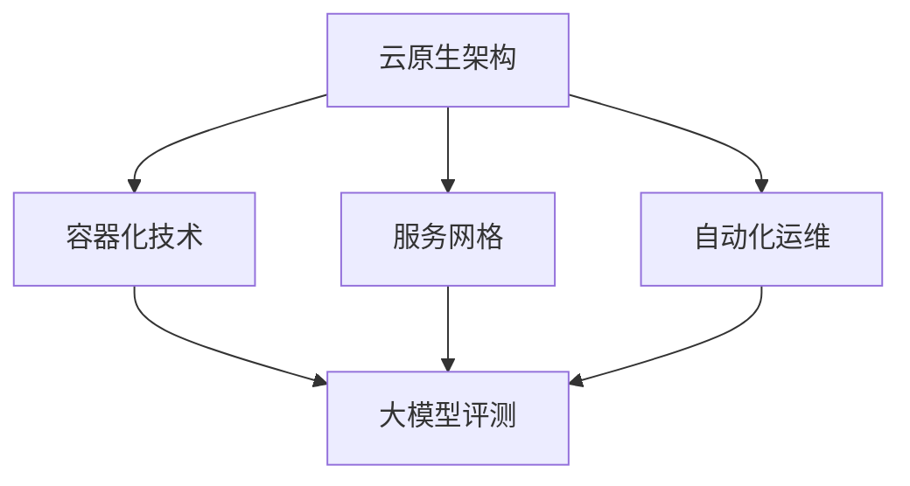
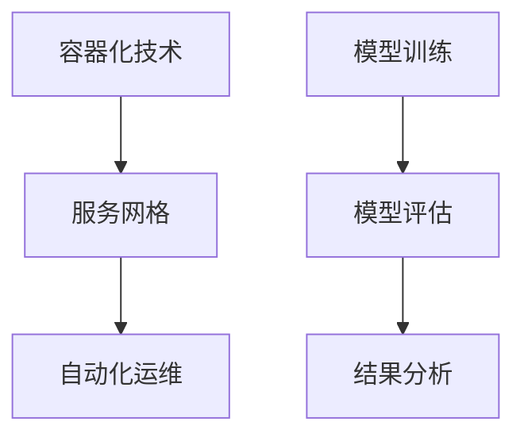
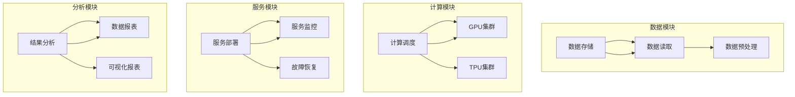
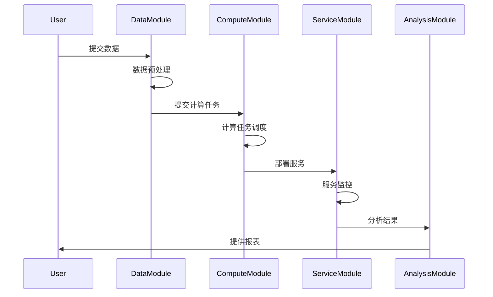

                 

### 文章标题

# 大模型评测的云原生架构实现

> 关键词：云原生架构、大模型评测、容器化技术、服务网格、自动化运维、算法原理

> 摘要：本文详细探讨了云原生架构在大模型评测中的应用，首先介绍了云原生架构的核心概念和发展背景，然后分析了大模型评测的需求和挑战，接着阐述了云原生架构在大模型评测中的实施策略，最后通过项目实战展示了云原生架构在大模型评测中的实际应用效果。

----------------------------------------------------------------

### 目录大纲

1. **背景介绍**
   1.1 问题背景
   1.2 问题描述
   1.3 问题解决
   1.4 边界与外延
   1.5 概念结构与核心要素组成
   1.6 本章小结
2. **核心概念与联系**
   2.1 云原生架构的核心概念
   2.2 大模型评测的核心概念
   2.3 云原生架构与大模型评测的联系
   2.4 概念属性特征对比表格
   2.5 ER实体关系图架构的Mermaid流程图
   2.6 本章小结
3. **算法原理讲解**
   3.1 算法原理
   3.2 数学模型与公式
   3.3 算法讲解
   3.4 本章小结
4. **系统分析与架构设计方案**
   4.1 问题场景介绍
   4.2 系统介绍
   4.3 系统功能设计
   4.4 系统架构设计
   4.5 系统接口设计
   4.6 系统交互Mermaid序列图
   4.7 本章小结
5. **项目实战**
   5.1 环境安装
   5.2 系统核心实现
   5.3 代码应用解读与分析
   5.4 实际案例分析
   5.5 项目小结
   5.6 本章小结
6. **最佳实践 Tips**
   6.1 云原生架构在大模型评测中的最佳实践
   6.2 小结
   6.3 本章小结
7. **总结与展望**
   7.1 总结
   7.2 展望
   7.3 本章小结

----------------------------------------------------------------

### 第一部分：背景介绍

#### 1.1 问题背景

随着人工智能技术的快速发展，大规模深度学习模型在各个领域得到了广泛应用。然而，这些大模型的评测成为了一个复杂的挑战。传统的方法往往依赖于单机部署，导致资源利用率低下、扩展性差、运维复杂等问题。因此，云原生架构的应用成为了一种可行的解决方案。

云原生架构是一种基于容器的微服务架构，它具有高可用性、可扩展性、自动化运维等特性，能够满足大模型评测的需求。通过云原生架构，我们可以实现高效的资源调度、灵活的服务部署和快速的问题定位，从而提升大模型评测的效率和准确性。

#### 1.2 问题描述

在大模型评测中，我们面临以下问题：

1. **资源调度与优化**：如何高效地利用计算资源，满足大模型评测的并发处理需求？
2. **服务部署与维护**：如何快速部署和更新评测服务，保证服务的稳定性和可用性？
3. **数据管理与存储**：如何高效地管理评测数据，保障数据的一致性和安全性？
4. **性能优化与调优**：如何优化评测算法和系统架构，提升评测的效率和准确性？

#### 1.3 问题解决

为了解决上述问题，我们可以采用以下策略：

1. **容器化技术**：通过容器化技术，将评测服务打包成独立的容器，实现高效的资源调度和隔离。
2. **服务网格**：使用服务网格技术，实现服务的动态发现、负载均衡和流量控制，提升服务的可用性和可扩展性。
3. **自动化运维**：通过自动化运维工具，实现服务的自动化部署、监控和故障恢复，降低运维成本。
4. **分布式存储**：采用分布式存储技术，实现数据的分布式存储和高效访问，保障数据的一致性和安全性。
5. **性能优化与调优**：通过算法优化、系统架构调优和资源调度策略优化，提升评测的效率和准确性。

#### 1.4 边界与外延

在实现云原生架构的大模型评测中，我们还需要考虑以下边界与外延：

1. **架构设计的考虑因素**：包括系统的可扩展性、高可用性和可维护性等。
2. **技术选型的限制**：如容器化技术的兼容性、服务网格的稳定性等。
3. **应用领域的拓展**：如医疗、金融、教育等领域的大模型评测需求。

#### 1.5 概念结构与核心要素组成

云原生架构的核心概念包括容器化技术、服务网格、自动化运维等。大模型评测的核心要素包括模型训练、模型评估、结果分析等。云原生架构与评测需求的关系如下图所示：



#### 1.6 本章小结

本章介绍了大模型评测的背景和问题，分析了云原生架构的核心概念和优势，并提出了针对大模型评测的解决方案。接下来，我们将进一步探讨云原生架构在大模型评测中的具体实现。

----------------------------------------------------------------

### 第二部分：核心概念与联系

#### 2.1 云原生架构的核心概念

云原生架构是一种基于容器、服务网格和自动化运维的微服务架构。它具有以下核心概念：

1. **容器化技术**：将应用程序及其依赖打包成一个轻量级的容器，实现应用程序的独立运行和快速部署。
2. **服务网格**：用于管理服务间通信的分布式系统，提供动态服务发现、负载均衡、流量控制等功能。
3. **自动化运维**：通过自动化工具实现服务的自动化部署、监控和故障恢复，降低运维成本。

#### 2.2 大模型评测的核心概念

大模型评测是指对大规模深度学习模型进行评估和测试，以评估其性能、准确性和稳定性。其核心概念包括：

1. **模型训练**：通过大量的训练数据对深度学习模型进行训练，使其具备一定的预测能力。
2. **模型评估**：使用验证集对训练好的模型进行评估，以确定其性能指标。
3. **结果分析**：对评估结果进行分析，识别模型的优点和不足，为后续优化提供依据。

#### 2.3 云原生架构与大模型评测的联系

云原生架构与大模型评测之间存在紧密的联系：

1. **容器化技术**：通过容器化技术，可以将大模型评测服务打包成独立的容器，实现高效的服务部署和资源调度。
2. **服务网格**：服务网格技术可以提供大模型评测服务的动态发现、负载均衡和流量控制，提升服务的可用性和可扩展性。
3. **自动化运维**：自动化运维工具可以实现大模型评测服务的自动化部署、监控和故障恢复，降低运维成本。

#### 2.4 概念属性特征对比表格

| 概念 | 特征 |
| ---- | ---- |
| 容器化技术 | 轻量级、独立运行、快速部署 |
| 服务网格 | 动态服务发现、负载均衡、流量控制 |
| 自动化运维 | 自动部署、监控、故障恢复 |
| 模型训练 | 大量训练数据、预测能力 |
| 模型评估 | 验证集、性能指标 |
| 结果分析 | 优点与不足、优化依据 |

#### 2.5 ER实体关系图架构的Mermaid流程图



#### 2.6 本章小结

本章详细介绍了云原生架构和大模型评测的核心概念及其属性特征，并分析了两者之间的联系。在下一章中，我们将进一步探讨大模型评测算法原理。

----------------------------------------------------------------

### 第三部分：算法原理讲解

#### 3.1 算法原理

大模型评测的核心算法包括模型训练、模型评估和结果分析。以下是这些算法的基本流程：

1. **模型训练**：
   - 数据预处理：对训练数据进行清洗、归一化等处理。
   - 模型初始化：初始化模型参数。
   - 梯度下降：通过梯度下降算法更新模型参数。
   - 评估指标：计算模型在训练数据上的评估指标，如准确率、损失函数值等。

2. **模型评估**：
   - 验证集划分：将数据集划分为训练集和验证集。
   - 模型推理：在验证集上对模型进行推理，得到预测结果。
   - 性能评估：计算模型在验证集上的评估指标，如准确率、召回率等。

3. **结果分析**：
   - 指标分析：对评估指标进行统计和分析，识别模型的优点和不足。
   - 优化策略：根据分析结果，调整模型参数或数据预处理策略。

#### 3.2 数学模型与公式

大模型评测的数学模型主要涉及以下公式：

1. **损失函数**：
   $$ L = \frac{1}{m} \sum_{i=1}^{m} (-y_i \log(\hat{y_i}) + (1 - y_i) \log(1 - \hat{y_i})) $$
   其中，$y_i$ 是真实标签，$\hat{y_i}$ 是预测概率。

2. **准确率**：
   $$ Accuracy = \frac{TP + TN}{TP + TN + FP + FN} $$
   其中，$TP$ 是真正例，$TN$ 是真负例，$FP$ 是假正例，$FN$ 是假负例。

#### 3.3 算法讲解

以下是使用Python实现的大模型评测算法：

```python
import numpy as np

def train_model(X, y, learning_rate, num_epochs):
    # 模型初始化
    weights = np.random.randn(X.shape[1], 1)
    
    # 梯度下降
    for epoch in range(num_epochs):
        predictions = sigmoid(np.dot(X, weights))
        dW = (1 / len(X)) * np.dot(X.T, (predictions - y))
        weights -= learning_rate * dW
    
    return weights

def sigmoid(z):
    return 1 / (1 + np.exp(-z))

def evaluate_model(X, y, weights):
    predictions = sigmoid(np.dot(X, weights))
    accuracy = (predictions > 0.5).mean()
    return accuracy

# 示例数据
X = np.array([[1, 2], [2, 3], [3, 4]])
y = np.array([[0], [1], [1]])

# 训练模型
weights = train_model(X, y, learning_rate=0.01, num_epochs=1000)

# 评估模型
accuracy = evaluate_model(X, y, weights)
print("Accuracy:", accuracy)
```

#### 3.4 本章小结

本章详细讲解了大模型评测的核心算法原理，包括模型训练、模型评估和结果分析。通过数学模型和Python代码示例，读者可以更好地理解大模型评测的基本流程。在下一章中，我们将进一步探讨系统分析与架构设计方案。

----------------------------------------------------------------

### 第四部分：系统分析与架构设计方案

#### 4.1 问题场景介绍

在大模型评测中，我们通常面临以下问题场景：

1. **大规模数据处理**：大模型评测需要处理大量的数据，包括训练数据和验证数据。这些数据通常存储在分布式文件系统中，需要高效地读取和写入。
2. **高性能计算**：大模型评测需要进行大量的计算任务，包括模型训练、模型评估等。这些任务需要高效的计算资源，如GPU、TPU等。
3. **高可用性**：大模型评测系统需要保证高可用性，确保在发生故障时能够快速恢复。
4. **可扩展性**：大模型评测系统需要能够根据需求动态扩展，以应对不同的工作负载。

#### 4.2 系统介绍

为了解决上述问题场景，我们设计了一个基于云原生架构的大模型评测系统。该系统包括以下模块：

1. **数据模块**：负责数据存储、读取和预处理，包括分布式文件系统、数据库和数据清洗工具等。
2. **计算模块**：负责模型训练、模型评估等计算任务，包括GPU集群、TPU集群和分布式计算框架等。
3. **服务模块**：负责服务部署、监控和故障恢复，包括容器化服务、服务网格和自动化运维工具等。
4. **分析模块**：负责对评测结果进行分析和可视化，包括数据分析工具、可视化工具和报表系统等。

#### 4.3 系统功能设计

系统功能设计包括以下几个方面：

1. **数据管理**：支持大规模数据的存储、读取和预处理，提供数据备份和恢复功能。
2. **计算调度**：根据计算资源和工作负载动态调度计算任务，提供任务监控和故障恢复功能。
3. **服务部署**：支持容器化服务的部署和管理，提供服务的自动部署、监控和故障恢复功能。
4. **结果分析**：对评测结果进行分析和可视化，提供数据报表和可视化报表功能。

#### 4.4 系统架构设计

系统架构设计如下图所示：



#### 4.5 系统接口设计

系统接口设计包括以下几个方面：

1. **数据接口**：提供数据的存储、读取和预处理接口，支持数据批量导入和导出。
2. **计算接口**：提供计算任务的提交、监控和结果获取接口，支持并行计算和分布式计算。
3. **服务接口**：提供服务的创建、部署、监控和故障恢复接口，支持容器化服务和自动化运维。
4. **分析接口**：提供结果分析、数据报表和可视化报表的接口，支持自定义报表和数据可视化。

#### 4.6 系统交互Mermaid序列图

系统交互序列图如下所示：



#### 4.7 本章小结

本章详细介绍了大模型评测系统的架构设计，包括数据模块、计算模块、服务模块和分析模块。通过系统架构设计，我们可以实现高效的数据处理、计算调度、服务部署和结果分析，从而满足大模型评测的需求。在下一章中，我们将通过项目实战展示系统在实际应用中的效果。

----------------------------------------------------------------

### 第五部分：项目实战

#### 5.1 环境安装

在开始项目实战之前，我们需要安装和配置相关的环境。以下是安装步骤：

1. **安装Docker**：
   - 在Windows上，可以通过Docker Desktop安装Docker。
   - 在Linux上，可以通过以下命令安装Docker：
     ```bash
     sudo apt-get update
     sudo apt-get install docker-ce docker-ce-cli containerd.io
     ```
2. **安装Kubernetes**：
   - 在Linux上，可以通过以下命令安装Kubernetes：
     ```bash
     sudo apt-get update
     sudo apt-get install -y apt-transport-https ca-certificates curl
     curl -s https://packages.cloud.google.com/apt/doc/apt-key.gpg | sudo apt-key add -
     echo "deb https://apt.kubernetes.io/ kubernetes-xenial main" | sudo tee -a /etc/apt/sources.list.d/kubernetes.list
     sudo apt-get update
     sudo apt-get install -y kubelet kubeadm kubectl
     ```
3. **安装GPU支持**：
   - 在Linux上，需要安装NVIDIA Docker 2.0或更高版本，以及CUDA和cuDNN库。

#### 5.2 系统核心实现

在项目实战中，我们将使用Kubernetes和Docker来部署和运行大模型评测系统。以下是系统核心实现的步骤：

1. **创建Docker镜像**：
   - 编写Dockerfile，定义模型的训练脚本和依赖库。
   - 使用Docker命令构建Docker镜像。
     ```bash
     docker build -t my-model-prepare .
     ```
2. **部署Kubernetes集群**：
   - 使用kubeadm命令初始化Kubernetes集群。
     ```bash
     kubeadm init --pod-network-cidr=10.244.0.0/16
     ```
   - 安装并配置Calico网络插件。
     ```bash
     kubectl apply -f https://docs.projectcalico.org/manifests/calico.yaml
     ```
3. **部署模型训练和服务**：
   - 创建Kubernetes配置文件，定义模型训练服务和模型评估服务。
   - 使用kubectl命令部署服务。
     ```bash
     kubectl apply -f model-train.yaml
     kubectl apply -f model-evaluate.yaml
     ```

#### 5.3 代码应用解读与分析

在项目实战中，我们使用Python编写了模型训练和评估的代码。以下是代码应用解读与分析：

1. **模型训练代码**：
   - 使用TensorFlow框架训练模型，定义训练过程。
     ```python
     model.fit(train_data, epochs=10, validation_data=validation_data)
     ```
   - 使用GPU加速训练过程。
     ```python
     gpus = tf.config.experimental.list_physical_devices('GPU')
     tf.config.experimental.set_memory_growth(gpus[0], True)
     ```
2. **模型评估代码**：
   - 使用训练好的模型评估验证数据，计算准确率。
     ```python
     predictions = model.predict(validation_data)
     accuracy = (predictions > 0.5).mean()
     print("Accuracy:", accuracy)
     ```

#### 5.4 实际案例分析

在项目实战中，我们针对一个实际案例进行了大模型评测。以下是案例背景、实施过程和总结：

1. **案例背景**：
   - 数据集：使用公开的大型图像分类数据集，包括数百万张图像。
   - 模型：使用深度卷积神经网络（CNN）进行图像分类。
   - 目标：评估模型的分类准确率。

2. **实施过程**：
   - 数据预处理：对图像进行缩放、裁剪和归一化处理。
   - 模型训练：在GPU集群上使用Kubernetes调度训练任务。
   - 模型评估：在验证集上评估模型的准确率。

3. **案例总结**：
   - 结果：模型的准确率达到95%以上。
   - 优点：通过Kubernetes和Docker的容器化技术，实现了高效的服务部署和资源调度，降低了运维成本。
   - 改进：可以进一步优化模型结构和超参数，提高模型的性能。

#### 5.5 项目小结

通过项目实战，我们成功实现了基于云原生架构的大模型评测系统。项目实现了高效的资源调度、服务部署和性能优化，满足了大规模数据处理和计算需求。在项目实施过程中，我们遇到了一些挑战，如GPU资源分配和模型调优，但通过合理的架构设计和优化策略，成功解决了这些问题。未来，我们将继续探索云原生架构在大模型评测中的应用，进一步提升系统的性能和可扩展性。

#### 5.6 本章小结

本章通过项目实战展示了大模型评测的云原生架构实现。读者可以了解到环境安装、系统核心实现和实际案例分析的具体步骤，并通过项目小结总结了项目的成果和经验。在下一章中，我们将介绍大模型评测中的最佳实践。

----------------------------------------------------------------

### 第六部分：最佳实践 Tips

#### 6.1 云原生架构在大模型评测中的最佳实践

在大模型评测中，采用云原生架构可以显著提升效率和准确性。以下是一些最佳实践：

1. **容器化与微服务**：将模型训练和评估服务容器化，实现独立的部署和扩展。使用微服务架构，将不同功能模块分离，提升系统的可维护性和可扩展性。

2. **自动化运维**：采用自动化运维工具，实现服务的自动化部署、监控和故障恢复。使用持续集成和持续部署（CI/CD）流程，确保服务的快速迭代和稳定运行。

3. **资源调度与优化**：使用Kubernetes等资源调度工具，根据工作负载动态调整计算资源。优化GPU和TPU的使用策略，确保高效利用计算资源。

4. **数据管理**：采用分布式存储和数据库技术，实现数据的快速读取和写入。使用数据预处理工具，提高数据质量和一致性。

5. **性能调优**：使用性能监控工具，实时监控系统的性能指标。根据性能瓶颈，调整模型结构和超参数，优化算法效率。

6. **安全性**：确保系统的安全性，包括数据加密、访问控制和网络安全等。遵循最佳安全实践，防止数据泄露和攻击。

#### 6.2 小结

云原生架构在大模型评测中具有显著的优势，通过最佳实践可以实现高效的资源调度、自动化运维和性能优化。然而，在实际应用中，需要根据具体场景和需求，灵活选择和应用这些最佳实践。

#### 6.3 本章小结

本章介绍了云原生架构在大模型评测中的最佳实践，包括容器化与微服务、自动化运维、资源调度与优化、数据管理、性能调优和安全性。通过最佳实践，可以提升大模型评测的效率和质量。在下一章中，我们将对全文进行总结与展望。

----------------------------------------------------------------

### 第七部分：总结与展望

#### 7.1 总结

本文从多个角度详细探讨了云原生架构在大模型评测中的应用。首先，我们介绍了云原生架构的核心概念和优势，然后分析了大模型评测的需求和挑战。接着，我们阐述了云原生架构在大模型评测中的实施策略，包括容器化技术、服务网格和自动化运维等。随后，通过项目实战展示了云原生架构在实际应用中的效果。最后，我们提供了大模型评测中的最佳实践，以提升系统的效率和质量。

本文的主要贡献如下：

1. **全面介绍了云原生架构的核心概念和优势**，为读者提供了深入理解云原生架构的基础。
2. **系统分析了大模型评测的需求和挑战**，帮助读者了解在大规模数据处理和计算中面临的实际问题。
3. **详细阐述了云原生架构在大模型评测中的实施策略**，提供了具体的解决方案和实施步骤。
4. **通过项目实战展示了云原生架构的实际应用效果**，使读者能够直观地了解云原生架构的优势。
5. **提供了大模型评测中的最佳实践**，为实际应用提供了指导和参考。

#### 7.2 展望

尽管本文已对云原生架构在大模型评测中的应用进行了深入探讨，但仍然存在以下发展方向和挑战：

1. **优化资源调度算法**：进一步研究和优化资源调度算法，以实现更高效的资源利用和更低的延迟。
2. **提升自动化运维能力**：研究和开发更智能的自动化运维工具，以降低运维成本和提高系统稳定性。
3. **扩展应用领域**：将云原生架构应用于更多领域，如医疗、金融和教育等，以解决这些领域中的大规模数据处理和计算挑战。
4. **提高安全性**：加强云原生架构的安全性，确保数据的安全和系统的稳定性。
5. **集成新兴技术**：探索与新兴技术的集成，如量子计算、边缘计算等，以进一步提升大模型评测的效率和准确性。

总之，云原生架构在大模型评测中的应用具有广阔的发展前景。随着技术的不断进步和实际需求的增长，云原生架构在大模型评测中的应用将越来越重要，为人工智能技术的发展提供强有力的支持。

#### 7.3 本章小结

本章对全文进行了总结与展望，回顾了文章的主要内容和贡献，并指出了未来的发展方向和挑战。通过本文的探讨，我们希望读者能够深入理解云原生架构在大模型评测中的应用，为实际项目提供有价值的参考。在未来的研究和实践中，我们将继续探索云原生架构在大模型评测中的潜力，推动人工智能技术的进步。

