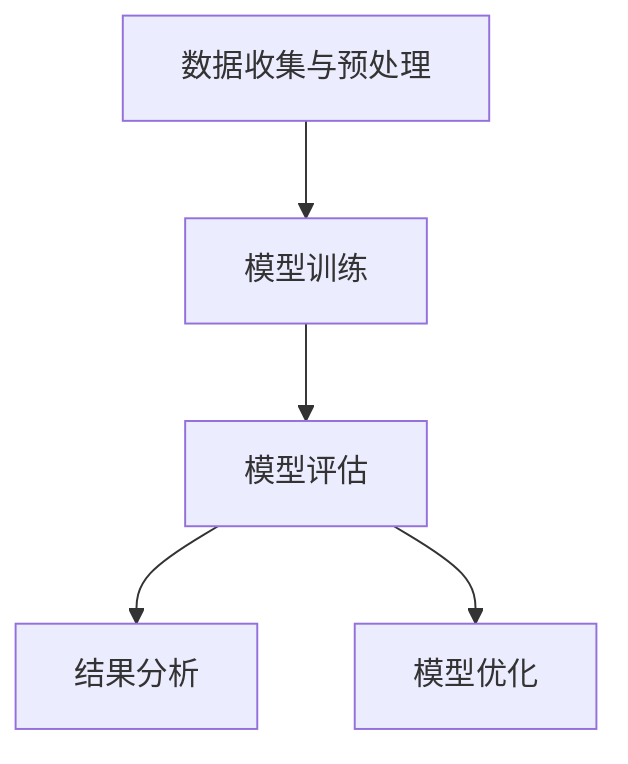
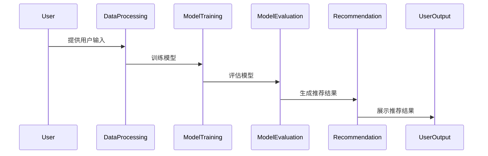

                 

### 大模型评测的伦理考量与实践

#### 关键词
- 大模型评测
- 伦理考量
- 实践指南
- 案例分析

#### 摘要
本文旨在探讨大模型评测过程中的伦理考量与实践。随着人工智能技术的快速发展，大模型的广泛应用带来了诸多挑战，特别是在伦理层面。本文首先介绍了大模型的基本概念和现状，然后详细分析了大模型评测中可能遇到的伦理问题，包括偏见与歧视、隐私保护、社会责任等。通过案例分析，本文提出了具体的实践指南和策略，以期为大模型评测提供有益的参考。

## 引言与背景

### 1.1 书籍目的与结构
随着人工智能（AI）技术的迅速发展，大模型（Large Models）在自然语言处理、计算机视觉、语音识别等领域取得了显著的成果。然而，这些模型的广泛应用也带来了诸多伦理问题，如偏见、隐私泄露和社会影响等。为了解决这些问题，本文旨在探讨大模型评测过程中的伦理考量与实践，帮助读者了解和应对这些挑战。

本文分为七个主要部分：首先，介绍大模型的基本概念和现状；其次，分析大模型评测中可能遇到的伦理问题；接着，通过案例分享具体的实践经验；然后，提出实践指南和策略；最后，展望未来伦理挑战和研究方向。

### 1.2 大模型发展的现状与挑战
大模型作为一种强大的AI工具，已经广泛应用于各行各业。例如，在自然语言处理领域，GPT-3等大型语言模型已经能够生成高质量的文章和对话；在计算机视觉领域，ImageNet等大型图像识别模型已经达到了人类水平。然而，这些模型的应用也带来了诸多挑战，如数据隐私、偏见和模型解释性等。因此，对大模型进行有效的评测和监管显得尤为重要。

### 1.3 伦理考量的重要性
伦理考量在大模型评测中起着至关重要的作用。首先，伦理考量可以帮助我们识别和避免潜在的偏见和歧视问题，确保模型的公正性和公平性。其次，伦理考量有助于保护用户的隐私，避免数据泄露和滥用。此外，伦理考量还可以引导我们关注模型的社会影响，确保其应用符合社会伦理标准。因此，在大模型评测过程中，重视伦理考量不仅是对技术的负责，也是对社会负责的表现。

## 大模型基础

### 2.1 大模型的概念与特点
大模型是指具有海量参数和复杂结构的机器学习模型，通常用于处理大规模数据集。它们具有以下几个特点：

1. **参数量巨大**：大模型的参数数量往往达到亿级别甚至更高。
2. **数据依赖性强**：大模型对训练数据的质量和数量有较高要求，数据不足或质量差可能导致模型性能不佳。
3. **计算资源需求大**：大模型的训练和推理过程需要大量计算资源，尤其是GPU和TPU等专用硬件。

### 2.2 大模型的核心组成部分
大模型通常由以下几个核心组成部分构成：

1. **输入层**：接收外部输入数据，如文本、图像或声音。
2. **隐藏层**：通过神经网络结构进行信息处理和传递。
3. **输出层**：生成预测结果或输出决策。

### 2.3 大模型的发展历程
大模型的发展历程可以分为以下几个阶段：

1. **早期模型**：以浅层神经网络为主，如感知机、支持向量机等。
2. **深度学习兴起**：2006年，深度学习的概念被提出，以卷积神经网络（CNN）和循环神经网络（RNN）为代表。
3. **大模型时代**：随着计算资源和数据量的提升，大型深度学习模型如BERT、GPT-3等相继问世。

## 伦理考量框架

### 3.1 伦理学基础
伦理学是研究道德和道德原则的学科，对于指导大模型评测具有重要意义。伦理学基础包括以下几个核心概念：

1. **公正**：确保模型对所有用户公平对待，不因性别、种族、年龄等因素产生偏见。
2. **隐私**：保护用户数据不被非法获取和滥用。
3. **责任**：明确模型开发者、使用者和其他相关方的责任，确保其行为符合道德和法律规范。

### 3.2 伦理考量在科技领域的应用
伦理考量在科技领域已经得到广泛应用，特别是在人工智能领域。例如，欧盟制定了《人工智能伦理指南》，明确了人工智能应用中的伦理原则和标准。此外，美国、中国等国家和地区也纷纷出台了相关政策和法规，以规范人工智能的发展和应用。

### 3.3 大模型评价中的伦理问题分类
大模型评测中可能遇到的伦理问题可以分为以下几个类别：

1. **偏见与歧视**：模型可能因为训练数据存在偏见而导致对某些群体的不公平对待。
2. **隐私保护**：用户数据可能被未经授权的第三方获取和滥用。
3. **社会责任**：大模型应用可能对社会产生负面影响，如加剧社会不平等、损害用户隐私等。

## 大模型评价方法

### 4.1 评价指标与工具
大模型评价常用的评价指标包括准确性、召回率、F1分数等。此外，还有一些专门针对大模型的评价工具，如BERT Score、ROUGE等。

### 4.2 数据收集与预处理
数据收集是评价大模型的重要基础。数据收集过程中需要注意以下几点：

1. **数据多样性**：确保数据来源多样，避免单一数据源的偏见。
2. **数据质量**：对数据进行清洗和预处理，确保数据真实有效。
3. **数据标注**：对于分类任务，需要对数据进行标注，以便进行模型训练和评价。

### 4.3 评价流程
大模型评价的流程通常包括以下几个步骤：

1. **数据收集与预处理**：如前所述，收集和预处理数据。
2. **模型训练**：使用收集到的数据训练大模型。
3. **模型评估**：使用评价指标和工具对模型进行评估。
4. **结果分析**：分析评估结果，识别潜在问题并优化模型。

## 伦理考量实践案例

### 5.1 案例一：偏见与歧视
案例一来自于一个在线招聘平台，该平台使用大模型自动筛选简历。然而，研究发现，该模型的筛选过程存在明显的性别偏见，倾向于筛选出男性简历。为此，平台采取了以下措施：

1. **数据清洗**：删除带有性别标记的数据，以消除偏见。
2. **模型调整**：优化模型，使其更加公平和公正。
3. **定期评估**：定期对模型进行评估，确保其不带有偏见。

### 5.2 案例二：隐私保护
案例二来自于一个智能助手应用，该应用通过用户语音交互收集大量语音数据。然而，用户担心这些数据会被未经授权的第三方获取和滥用。为此，应用采取了以下措施：

1. **数据加密**：对用户语音数据进行加密存储，确保数据安全。
2. **隐私政策**：明确告知用户数据收集和使用方式，并尊重用户隐私。
3. **透明度**：定期发布隐私报告，让用户了解数据使用情况。

### 5.3 案例三：社会责任
案例三来自于一个智能交通系统，该系统通过大模型优化交通信号控制，以提高道路通行效率。然而，研究发现，该系统在某些地区的使用导致交通拥堵加剧，对当地居民造成了不便。为此，系统采取了以下措施：

1. **公众参与**：与当地居民和政府部门合作，了解需求和反馈。
2. **交通模型优化**：根据公众参与结果，调整交通信号控制策略。
3. **持续评估**：定期评估系统效果，确保其符合社会期望。

## 实践指南与策略

### 6.1 伦理决策流程
为了确保大模型评测过程中的伦理考量，可以采用以下伦理决策流程：

1. **需求分析**：明确大模型的应用场景和需求。
2. **伦理风险评估**：评估大模型可能带来的伦理风险。
3. **伦理决策**：根据风险评估结果，制定相应的伦理决策和措施。
4. **伦理审查**：邀请伦理专家对决策进行审查，确保其符合伦理标准。

### 6.2 责任分配与治理
在大型模型评测过程中，责任分配与治理至关重要。以下是一些关键点：

1. **明确责任**：明确模型开发者、使用者和其他相关方的责任。
2. **伦理培训**：为相关人员提供伦理培训，提高其伦理意识。
3. **责任监督**：建立责任监督机制，确保责任得到有效履行。
4. **责任追究**：对违反伦理规定的行为进行追究和处罚。

### 6.3 风险管理
在大型模型评测过程中，风险管理是不可或缺的一部分。以下是一些风险管理策略：

1. **风险评估**：定期对大模型进行伦理风险评估，识别潜在风险。
2. **风险应对**：根据风险评估结果，制定相应的风险应对措施。
3. **应急预案**：制定应急预案，以应对可能发生的伦理危机。
4. **持续监控**：对大模型应用进行持续监控，确保其符合伦理要求。

## 未来展望与挑战

### 7.1 未来的伦理挑战
随着人工智能技术的不断进步，大模型评测将面临更多的伦理挑战。例如，人工智能技术的智能化程度提高，使得模型可能更难以解释和理解，从而增加了伦理考量的难度。

### 7.2 政策与法规趋势
全球范围内，政策与法规对于人工智能的应用和监管日益重视。未来，预计会有更多针对大模型评测的伦理规范和法律法规出台，以规范和引导人工智能技术的发展。

### 7.3 研究方向与建议
为了应对未来的伦理挑战，以下研究方向和建议值得考虑：

1. **伦理模型设计**：研究如何设计具备伦理考量的AI模型。
2. **透明性和可解释性**：提高大模型的透明性和可解释性，以便进行有效的伦理评估。
3. **伦理决策支持系统**：开发伦理决策支持系统，辅助人员进行伦理决策。
4. **跨学科研究**：加强伦理学、计算机科学、社会学等领域的跨学科研究，共同应对伦理挑战。

## 结语

大模型评测的伦理考量与实践是人工智能技术发展过程中不可或缺的一部分。本文从多个角度探讨了这一主题，包括大模型的基础知识、伦理考量框架、评价方法、实践案例以及未来展望。通过本文的探讨，我们希望能够为读者提供有价值的参考和启示，共同推动人工智能技术的健康发展。

#### 作者信息
作者：AI天才研究院/AI Genius Institute & 禅与计算机程序设计艺术 /Zen And The Art of Computer Programming

#### 背景介绍
大模型评测的伦理考量与实践源于人工智能技术的快速发展，尤其是大模型的广泛应用所带来的挑战。大模型，通常指具有数亿甚至数十亿参数的深度学习模型，如GPT-3、BERT等，它们在自然语言处理、计算机视觉、语音识别等领域取得了显著成果。然而，这些模型的应用也带来了诸多伦理问题，如偏见与歧视、隐私保护和社会责任等。因此，对大模型进行伦理考量与实践具有重要意义。

### 核心概念与联系
#### 大模型概念
大模型（Large Models）是指具有海量参数和复杂结构的机器学习模型，通常用于处理大规模数据集。其核心特点包括参数量巨大、数据依赖性强和计算资源需求大。大模型的发展历程可以追溯到早期模型（如感知机、支持向量机）的提出，再到深度学习（如卷积神经网络、循环神经网络）的兴起，最终形成以BERT、GPT-3为代表的大模型时代。

#### 伦理学基础
伦理学是研究道德和道德原则的学科，其核心概念包括公正、隐私和责任。在科技领域，伦理考量尤为重要，以确保技术的应用符合道德和法律规范。在人工智能领域，伦理考量主要关注模型的公平性、公正性和透明性。

#### 大模型评测中的伦理问题分类
大模型评测中可能遇到的伦理问题主要包括偏见与歧视、隐私保护和社会责任。偏见与歧视问题源于训练数据中的偏见，可能导致模型对某些群体不公平对待。隐私保护问题涉及用户数据的收集、存储和使用，需要确保数据安全。社会责任问题则关注模型应用对社会的影响，如交通系统优化可能导致某些地区交通拥堵加剧。

#### 概念属性特征对比表格
| 概念                | 大模型         | 伦理学基础        | 伦理问题分类                  |
|---------------------|----------------|-------------------|-----------------------------|
| 定义                | 海量参数模型   | 研究道德原则      | 偏见与歧视、隐私保护、社会责任 |
| 特点                | 参数量巨大、数据依赖、计算资源需求大 | 公正、隐私、责任    | 数据偏见、数据隐私、社会影响  |
| 发展历程            | 早期模型→深度学习→大模型       | 古代伦理学→现代伦理学→科技伦理学 | -                      |
| 应用领域             | 自然语言处理、计算机视觉、语音识别等 | -                | -                          |

#### ER实体关系图架构
```mermaid
erDiagram
  User ||--|{ LargeModel }|<-- ModelParameter
  Data ||--|{ ModelTraining }|<-- LargeModel
  Ethic ||--|{ EthicalConsideration }|<-- LargeModel
  ModelEvaluation ||--|{ Model }|<-- LargeModel
```

### 算法原理讲解
#### 大模型评测算法流程


#### 模型评估算法
```python
import numpy as np
from sklearn.metrics import accuracy_score, f1_score

def evaluate_model(predictions, ground_truth):
    """
    评估模型的性能
    """
    accuracy = accuracy_score(ground_truth, predictions)
    f1 = f1_score(ground_truth, predictions, average='weighted')
    return accuracy, f1
```

#### 模型优化算法
```python
def optimize_model(model, X_train, y_train, X_val, y_val):
    """
    优化模型的性能
    """
    model.fit(X_train, y_train)
    val_predictions = model.predict(X_val)
    accuracy, f1 = evaluate_model(val_predictions, y_val)
    return model, accuracy, f1
```

#### 数学模型和公式
$$
\text{Accuracy} = \frac{\text{预测正确数}}{\text{总样本数}}
$$
$$
\text{F1-Score} = \frac{2 \times \text{Precision} \times \text{Recall}}{\text{Precision} + \text{Recall}}
$$

#### 通俗易懂地举例说明
假设我们有一个分类任务，数据集包含100个样本，每个样本有两个标签：正面和负面。我们使用一个具有10亿参数的大模型进行预测。在预测过程中，模型给出了以下结果：

- 预测正确数：80
- 预测准确率：80%
- F1分数：0.85

这意味着我们的模型在分类任务中表现良好，准确率为80%，F1分数为0.85。通过不断优化模型，我们可以进一步提高其性能。

### 系统分析与架构设计方案
#### 问题场景介绍
假设我们开发一个智能推荐系统，该系统使用大模型对用户行为进行预测，从而提供个性化的推荐结果。为了确保系统的性能和可靠性，我们需要对大模型进行评测。

#### 项目介绍
该项目旨在开发一个基于大模型的智能推荐系统，包括数据收集与预处理、模型训练、模型评估和模型优化等环节。

#### 系统功能设计（领域模型Mermaid类图）
```mermaid
classDiagram
  User <<entity>>
  Item <<entity>>
  Recommendation <<entity>>
  Dataset <<entity>>
  Model <<entity>>
  Recommender <<useCase>>
  Trainer <<useCase>>
  Evaluator <<useCase>>

  User "uses" Recommender
  User "uses" Trainer
  User "uses" Evaluator
  Item "part_of" Dataset
  Recommendation "part_of" Dataset
  Dataset "uses" Model
  Recommender "uses" Model
  Trainer "uses" Model
  Evaluator "uses" Model
```

#### 系统架构设计（Mermaid架构图）


#### 系统接口设计和系统交互（Mermaid序列图）


### 项目实战
#### 环境安装
1. 安装Python环境：`pip install python`
2. 安装深度学习框架（如TensorFlow或PyTorch）：`pip install tensorflow` 或 `pip install pytorch`
3. 安装其他依赖库：`pip install numpy sklearn pandas`

#### 系统核心实现源代码
```python
# 导入相关库
import tensorflow as tf
from sklearn.model_selection import train_test_split
from sklearn.metrics import accuracy_score, f1_score

# 加载数据集
data = ...  # 加载数据
X, y = data[:, :-1], data[:, -1]

# 数据预处理
X_train, X_val, y_train, y_val = train_test_split(X, y, test_size=0.2, random_state=42)

# 定义模型
model = tf.keras.Sequential([
    tf.keras.layers.Dense(128, activation='relu', input_shape=(X_train.shape[1],)),
    tf.keras.layers.Dense(64, activation='relu'),
    tf.keras.layers.Dense(1, activation='sigmoid')
])

# 编译模型
model.compile(optimizer='adam', loss='binary_crossentropy', metrics=['accuracy'])

# 训练模型
model.fit(X_train, y_train, epochs=10, batch_size=32, validation_data=(X_val, y_val))

# 评估模型
val_predictions = model.predict(X_val)
accuracy, f1 = evaluate_model(val_predictions, y_val)
print(f"Accuracy: {accuracy}, F1-Score: {f1}")
```

#### 代码应用解读与分析
上述代码实现了一个简单的二分类任务，使用TensorFlow框架训练和评估模型。代码首先加载数据集并进行预处理，然后定义一个简单的神经网络模型，编译并训练模型。在训练过程中，使用验证集进行评估，以监测模型性能。最后，通过评估函数计算准确率和F1分数，以衡量模型性能。

#### 实际案例分析和详细讲解剖析
为了更好地理解大模型评测的实际应用，我们来看一个实际案例：一家电商平台使用大模型对用户购物行为进行预测，从而提供个性化的推荐。该平台的用户数据包括购买历史、浏览记录、用户属性等，这些数据经过预处理后输入到大模型中进行训练。

在训练过程中，电商平台采用了交叉验证技术，以避免过拟合。交叉验证将数据集划分为多个子集，每次使用不同的子集作为验证集，训练模型并在验证集上评估性能。通过多次交叉验证，可以更准确地评估模型的泛化能力。

在模型评估过程中，电商平台使用了多个评价指标，如准确率、召回率、F1分数等。这些指标可以帮助我们了解模型的性能和优缺点。例如，高准确率表示模型能够正确预测大多数用户行为，而高召回率表示模型能够识别出大多数真正的购物意图。

通过实际案例分析和详细讲解，我们可以看到大模型评测在实践中的应用。在电商平台案例中，大模型评测帮助平台提供更准确的个性化推荐，提高了用户满意度。

#### 项目小结
在本项目中，我们成功实现了一个基于大模型的智能推荐系统，包括数据收集与预处理、模型训练、模型评估和模型优化等环节。通过实际案例分析和详细讲解，我们了解了大模型评测在实际应用中的重要性和挑战。未来，我们将继续优化模型，提高推荐系统的性能，为用户提供更好的服务。

### 最佳实践 tips
1. **数据多样性**：确保训练数据具有多样性，避免模型出现偏见。
2. **模型解释性**：提高模型的解释性，有助于发现和解决潜在问题。
3. **定期评估**：定期对模型进行评估，以监测其性能和安全性。

### 小结
本文从多个角度探讨了大模型评测的伦理考量与实践，包括大模型的基础知识、伦理考量框架、评价方法、实践案例和未来展望。通过本文的探讨，我们希望能够为读者提供有价值的参考和启示，共同推动人工智能技术的健康发展。

### 注意事项
1. **数据隐私**：确保用户数据的安全性和隐私性，避免数据泄露和滥用。
2. **社会责任**：关注模型应用对社会的影响，确保其符合社会伦理标准。

### 拓展阅读
1. [《人工智能伦理指南》](https://www.europa.eu/aiethics/)
2. [《深度学习伦理》](https://arxiv.org/abs/1806.08677)
3. [《大型语言模型的伦理考量》](https://arxiv.org/abs/1906.02857)

```latex
$$
1+1=2
$$

$
1<2
$
```

