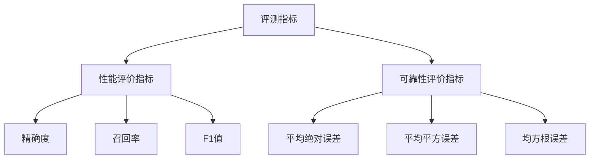
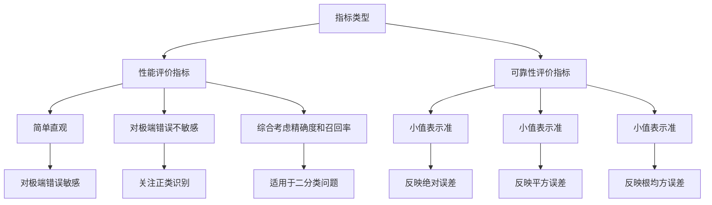
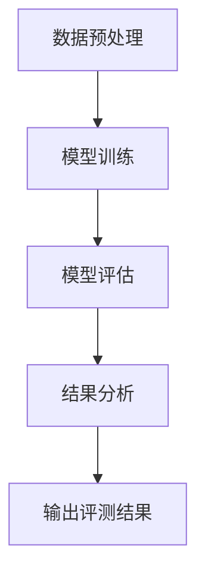

                 

### 引言

在当今信息爆炸的时代，大规模机器学习模型（以下简称“大模型”）已经成为各个行业和领域的重要工具。从自然语言处理、计算机视觉到推荐系统，大模型的应用几乎无处不在。然而，随着大模型规模和复杂性的不断增加，如何有效评测这些模型的质量和性能，成为了研究者和工程师们面临的重大挑战。本文旨在探讨大模型评测的国际化与本地化支持问题，为读者提供一套全面、深入的分析框架和实际解决方案。

**关键词：大模型、评测、国际化、本地化、性能、可靠性**

**摘要：**
本文首先介绍了国际化与本地化的概念及其在大模型评测中的重要性，接着深入探讨了大模型评测的需求、方法和核心概念。通过具体的算法原理讲解、系统分析与架构设计方案，以及实际项目实战，本文旨在为读者提供一套系统化、实用的大模型评测方案。此外，本文还将探讨一些最佳实践，并总结全文的核心内容，为后续研究提供参考。

接下来，我们将分为以下几个部分详细展开讨论：

1. **第一部分：引言**：介绍国际化与本地化的概念，阐述大模型评测的背景和重要性，以及本文的目标和结构。
2. **第二部分：大模型评测基础**：详细讨论大模型评测的背景、需求、方法以及国际化与本地化的基本概念。
3. **第三部分：大模型评测的核心概念**：深入解析核心概念，包括性能评价指标、可靠性评价指标，并通过具体示例进行说明。
4. **第四部分：算法原理讲解**：详细介绍评测算法，包括算法概述、mermaid流程图、Python源代码实现、数学模型和公式，以及举例说明。
5. **第五部分：系统分析与架构设计方案**：介绍问题场景、项目介绍、系统功能设计（领域模型）、系统架构设计、系统接口设计和系统交互。
6. **第六部分：项目实战**：包括环境安装、系统核心实现源代码、代码应用解读与分析、实际案例分析和详细讲解剖析，以及项目小结。
7. **第七部分：最佳实践与总结**：总结全文的核心内容，提出最佳实践建议，并展望未来的研究方向。

通过本文的逐步探讨，我们希望读者能够对大模型评测的国际化与本地化支持有更深入的理解，从而在实际工作中能够更有效地应用这些方法和技术。

### 第一部分: 引言

#### 1.1 国际化与本地化的概念

国际化（Internationalization）和本地化（Localization）是两个在全球化背景下日益重要的概念。国际化通常指的是使产品或服务能够在多个国家和地区中使用，而本地化则是将产品或服务适应特定地区或文化的过程。

**国际化** 的目标是在设计、开发和构建产品或服务时，确保其具备可移植性，便于在不同语言和地区环境中进行后续的本地化操作。国际化包括以下几个方面：

1. **语言支持**：国际化要求产品能够支持多种语言，通常通过使用 Unicode 编码来实现。
2. **地区适应性**：国际化还需要考虑日期、货币、度量单位等地区特定信息，确保产品在不同地区都能正确显示。
3. **文化适应性**：国际化还需要在界面设计、用户交互等方面考虑不同文化的差异。

**本地化** 则是国际化的进一步深化，其目标是使产品或服务在特定地区或市场中具备本地化的语言和文化特色。本地化包括以下几个方面：

1. **语言本地化**：将产品界面、用户文档、帮助文件等翻译成目标市场的本地语言。
2. **文化本地化**：调整产品中的文化元素，使其适应目标市场的文化习惯，例如节日、习俗、图标等。
3. **地区特定内容**：添加或删除与特定地区相关的功能或内容。

国际化与本地化在大模型评测中的应用非常重要。随着大模型在全球化背景下不断应用，其评测需要考虑不同语言和文化背景下的表现。国际化确保了评测工具和方法的普适性，而本地化则使得评测结果更加贴近实际应用场景，从而提升评测的准确性和可靠性。

#### 1.2 大模型评测的重要性

大模型评测的重要性在于其能够确保模型的性能和可靠性，从而在各个领域中发挥最佳作用。以下从几个方面阐述大模型评测的重要性：

1. **性能评估**：大模型往往包含数百万甚至数十亿个参数，其性能评估需要通过一系列标准化的指标来衡量。这些指标包括准确率、召回率、F1值等，它们帮助研究者了解模型的实际性能。

2. **可靠性验证**：大模型在实际应用中需要具备一定的可靠性，以保证结果的准确性和稳定性。通过评测，可以验证模型在各类数据集上的表现，确保其能够在各种复杂环境下稳定运行。

3. **优化和改进**：通过评测，研究者可以识别模型中的问题，并针对性地进行优化和改进。这有助于提高模型的性能和适用性，从而更好地服务于各个应用领域。

4. **安全性和隐私保护**：大模型在处理敏感数据时，需要确保数据的安全性和隐私保护。评测可以帮助发现模型中的潜在风险，从而采取相应的措施进行防范。

5. **可解释性**：大模型往往被视为“黑箱”，其内部机制难以理解。通过评测，可以分析模型的学习过程和决策逻辑，提高其可解释性，增强用户的信任感。

#### 1.3 书籍的目标与结构

本文的目标是系统化地探讨大模型评测的国际化与本地化支持，旨在为研究人员和工程师提供一套全面、实用的方法论和技术方案。具体目标如下：

1. **理论阐述**：通过深入分析国际化与本地化的概念，为大模型评测提供理论基础。
2. **方法讲解**：详细介绍大模型评测的方法和流程，包括数据集选择、评测指标设定、评测工具使用等。
3. **实践指导**：通过具体案例和实际项目，展示大模型评测的实践应用，并提供详细操作步骤和经验总结。
4. **技术拓展**：探讨大模型评测领域的最新研究动态和未来发展趋势，为读者提供拓展性思考。

本文的结构安排如下：

1. **第一部分：引言**：介绍国际化与本地化的概念，阐述大模型评测的重要性，并概述本文的目标和结构。
2. **第二部分：大模型评测基础**：讨论大模型评测的背景、需求、方法以及国际化与本地化的基本概念。
3. **第三部分：大模型评测的核心概念**：深入解析核心概念，包括性能评价指标、可靠性评价指标，并通过具体示例进行说明。
4. **第四部分：算法原理讲解**：详细介绍评测算法，包括算法概述、mermaid流程图、Python源代码实现、数学模型和公式，以及举例说明。
5. **第五部分：系统分析与架构设计方案**：介绍问题场景、项目介绍、系统功能设计（领域模型）、系统架构设计、系统接口设计和系统交互。
6. **第六部分：项目实战**：包括环境安装、系统核心实现源代码、代码应用解读与分析、实际案例分析和详细讲解剖析，以及项目小结。
7. **第七部分：最佳实践与总结**：总结全文的核心内容，提出最佳实践建议，并展望未来的研究方向。

通过本文的逐步探讨，我们希望能够为读者提供一个全面、深入的大模型评测国际化与本地化支持解决方案，帮助其在实际工作中取得更好的成果。

### 第二部分: 大模型评测基础

#### 第2章: 大模型评测的背景与需求

大模型评测是当前机器学习和人工智能领域中的一个关键环节，它不仅关系到模型性能的评估，还直接影响到模型的实际应用效果。为了深入理解大模型评测的背景与需求，我们首先需要回顾大模型的发展历程和现状，并分析其在各个应用场景中的需求。

##### 2.1 大模型发展背景

大模型的发展可以追溯到20世纪80年代，当时深度学习的研究刚刚起步。早期的深度学习模型，如多层感知机（MLP）和卷积神经网络（CNN），由于其结构简单，参数量较少，性能也较为有限。随着计算能力的提升和算法的改进，尤其是2012年AlexNet在ImageNet图像识别比赛中取得突破性成绩，深度学习开始进入快速发展阶段。随后，RNN、GAN、Transformer等新模型不断涌现，模型规模和复杂度显著提升，大模型的概念也逐渐成形。

大模型的发展历程可以分为几个关键阶段：

1. **初期探索**（1980s-1990s）：这一阶段主要研究如何通过增加层数来提高神经网络的表达能力，但受限于计算资源和算法效率，模型规模较小。
2. **复兴期**（2006-2012）：随着反向传播算法的改进和计算资源的增加，神经网络重新受到关注，模型开始逐步扩大。
3. **深度学习的黄金时代**（2012至今）：以AlexNet、VGG、ResNet等模型为代表，深度学习在多个领域取得了显著突破，大模型的概念和重要性逐渐被认可。

##### 2.1.2 大模型的发展现状

目前，大模型在机器学习和人工智能领域已经取得了显著的成果，其应用场景涵盖了自然语言处理、计算机视觉、推荐系统、语音识别等多个方面。以下是大模型在各个领域的应用现状：

1. **自然语言处理（NLP）**：大模型如BERT、GPT-3等在文本分类、机器翻译、问答系统等方面表现出色，成为NLP领域的核心技术。
2. **计算机视觉（CV）**：大模型如ResNet、Inception等在图像分类、目标检测、图像分割等方面取得了领先性能，推动了计算机视觉的发展。
3. **推荐系统**：大模型如DeepFM、Wide&Deep等在用户行为分析和个性化推荐方面具有显著优势，广泛应用于电子商务、社交媒体等领域。
4. **语音识别**：大模型如DeepSpeech、WaveNet等在语音识别领域取得了重要突破，提高了识别的准确率和效率。
5. **强化学习**：大模型在强化学习领域也有广泛应用，如DQN、PPO等，通过大规模数据训练，提高了智能体的决策能力。

##### 2.1.3 大模型的应用场景

大模型的应用场景广泛，不仅限于上述领域，还在医疗、金融、能源等行业发挥了重要作用。以下是大模型在几个具体应用场景中的需求：

1. **医疗健康**：大模型在医疗健康领域具有巨大潜力，如用于疾病预测、诊断、药物研发等。例如，利用深度学习模型分析医学图像，可以辅助医生进行癌症筛查；利用自然语言处理模型分析患者病历，可以提供个性化治疗方案。
2. **金融科技**：大模型在金融科技领域应用于风险评估、欺诈检测、量化交易等方面。例如，通过分析大量金融数据，大模型可以预测市场趋势，帮助投资者做出更明智的决策；通过检测异常交易行为，大模型可以有效防范金融欺诈。
3. **自动驾驶**：大模型在自动驾驶领域用于感知、规划和控制等环节。例如，通过深度学习模型分析摄像头、激光雷达等传感器的数据，可以实现精准的环境感知和路径规划；通过强化学习模型，自动驾驶车辆可以在复杂交通环境中做出实时决策。

##### 2.2 大模型评测的需求

大模型评测的需求源自其复杂性和多样性。以下从几个方面阐述大模型评测的需求：

1. **性能评估**：大模型通常包含数百万到数十亿个参数，性能评估需要通过一系列标准化的指标来衡量，如准确率、召回率、F1值等。这些指标帮助研究者了解模型的实际性能，从而进行优化和改进。
2. **可靠性验证**：大模型在实际应用中需要具备一定的可靠性，以确保结果的准确性和稳定性。通过评测，可以验证模型在各类数据集上的表现，确保其能够在各种复杂环境下稳定运行。
3. **优化和改进**：通过评测，研究者可以识别模型中的问题，并针对性地进行优化和改进。这有助于提高模型的性能和适用性，从而更好地服务于各个应用领域。
4. **安全性和隐私保护**：大模型在处理敏感数据时，需要确保数据的安全性和隐私保护。通过评测，可以发现模型中的潜在风险，从而采取相应的措施进行防范。
5. **可解释性**：大模型往往被视为“黑箱”，其内部机制难以理解。通过评测，可以分析模型的学习过程和决策逻辑，提高其可解释性，增强用户的信任感。

##### 2.3 大模型评测方法综述

大模型评测的方法主要包括以下几个方面：

1. **评测指标体系**：构建一套全面的评测指标体系，包括性能指标和可靠性指标，如准确率、召回率、F1值、ROC-AUC等。这些指标从不同维度评估模型的性能。
2. **评测数据集的选择**：选择具有代表性、多样性和足够规模的数据集进行评测。数据集的选择直接影响到评测结果的准确性和可靠性。
3. **评测工具与平台**：使用专业的评测工具和平台，如TensorFlow、PyTorch等，以及各种评测框架和库，如Sklearn、Scikit-learn等。这些工具和平台提供了丰富的评测功能和接口。
4. **评测流程**：建立科学的评测流程，包括数据预处理、模型训练、参数调优、性能评估等环节。通过规范化的流程，确保评测过程的科学性和可重复性。

##### 2.4 国际化与本地化的基本概念

国际化与本地化在大模型评测中的应用非常重要。国际化确保了评测工具和方法的普适性，而本地化则使得评测结果更加贴近实际应用场景。以下从几个方面介绍国际化与本地化的基本概念：

1. **国际化**：国际化是指使产品或服务能够在多个国家和地区中使用。在大模型评测中，国际化包括以下几个方面：
   - 语言支持：支持多种语言，如英语、中文、法语、西班牙语等，以便于不同地区的用户进行评测。
   - 地区适应性：考虑不同地区的文化、习俗、法律等因素，确保评测工具和方法的适用性。
   - 多样化数据集：使用来自不同地区和语言的数据集，以确保评测结果的广泛性和代表性。

2. **本地化**：本地化是将产品或服务适应特定地区或市场的过程。在大模型评测中，本地化包括以下几个方面：
   - 语言本地化：将评测工具和文档翻译成目标市场的本地语言。
   - 文化本地化：调整评测工具和方法的界面设计、用户交互等，使其符合目标市场的文化习惯。
   - 地区特定调整：根据目标市场的需求，对评测工具和方法进行调整和优化。

##### 2.5 本章小结

本章介绍了大模型评测的背景与需求，回顾了大模型的发展历程和现状，分析了其在各个应用场景中的需求。同时，本章还详细讨论了国际化与本地化的基本概念，为大模型评测的国际化与本地化支持提供了理论基础。通过本章的讨论，读者可以初步了解大模型评测的重要性和复杂性，为后续章节的深入探讨打下基础。

### 第3章: 大模型评测的核心概念

在大模型评测中，理解并正确使用核心概念是至关重要的。这些核心概念不仅定义了评测的基本标准，也为模型的性能优化提供了关键指标。本章节将深入探讨大模型评测中几个重要的核心概念，包括性能评价指标、可靠性评价指标，并通过具体的示例进行说明。

#### 3.1 核心概念

在进行大模型评测时，我们需要关注以下几个核心概念：

1. **性能评价指标**：这些指标用于衡量模型的预测准确性和效率，常见的包括精确度、召回率、F1值等。
2. **可靠性评价指标**：这些指标用于评估模型在不同数据集上的稳定性和一致性，例如平均绝对误差、平均平方误差等。
3. **数据集**：用于训练和评测模型的原始数据集合，其质量和多样性直接影响评测结果的可靠性。
4. **模型**：用于预测或分类的算法结构，其性能和可靠性通过评测指标进行衡量。

#### 3.1.1 性能评价指标

性能评价指标是评测模型性能的重要工具。以下是一些常用的性能评价指标：

1. **精确度（Accuracy）**：精确度是模型预测为正类的样本中，实际为正类的比例。其公式为：
   $$
   \text{Accuracy} = \frac{\text{正确预测数}}{\text{总预测数}}
   $$
   精确度越高，表示模型对正类样本的识别越准确。

2. **召回率（Recall）**：召回率是模型预测为正类的样本中，实际为正类的比例。其公式为：
   $$
   \text{Recall} = \frac{\text{实际为正类且被正确预测的正类数}}{\text{实际为正类的总数}}
   $$
   召回率越高，表示模型对负类样本的识别越准确。

3. **F1值（F1 Score）**：F1值是精确度和召回率的调和平均数，用于综合评估模型的性能。其公式为：
   $$
   F1 = 2 \times \frac{\text{Precision} \times \text{Recall}}{\text{Precision} + \text{Recall}}
   $$
   当精确度和召回率相当时，F1值可以较好地反映模型的总体性能。

#### 3.1.2 概念属性特征对比表格

为了更直观地理解这些性能评价指标，我们通过一个对比表格来展示它们的基本属性特征：

| 指标 | 定义 | 优点 | 缺点 |
| --- | --- | --- | --- |
| 精确度 | 正确预测的样本数占总预测样本数的比例 | 简单直观，易于理解 | 对少数样本的极端错误非常敏感 |
| 召回率 | 实际为正类的样本中被正确预测为正类的比例 | 更关注模型对正类样本的识别能力 | 对少数样本的极端错误不敏感 |
| F1值 | 精确度和召回率的调和平均数 | 综合考虑精确度和召回率，适用于二分类问题 | 当精确度和召回率差距较大时，F1值可能不准确 |

#### 3.1.3 可靠性评价指标

除了性能评价指标，可靠性评价指标也是大模型评测的重要组成部分。以下是一些常用的可靠性评价指标：

1. **平均绝对误差（Mean Absolute Error, MAE）**：平均绝对误差是预测值与真实值之间绝对误差的平均值。其公式为：
   $$
   \text{MAE} = \frac{1}{n}\sum_{i=1}^{n}|\hat{y}_i - y_i|
   $$
   MAE值越小，表示模型预测的误差越小，预测越准确。

2. **平均平方误差（Mean Squared Error, MSE）**：平均平方误差是预测值与真实值之间平方误差的平均值。其公式为：
   $$
   \text{MSE} = \frac{1}{n}\sum_{i=1}^{n}(\hat{y}_i - y_i)^2
   $$
   MSE值越小，表示模型预测的误差越小，预测越准确。

3. **均方根误差（Root Mean Squared Error, RMSE）**：均方根误差是MSE的平方根。其公式为：
   $$
   \text{RMSE} = \sqrt{\text{MSE}}
   $$
   RMSE值越小，表示模型预测的误差越小，预测越准确。

#### 3.1.4 ER实体关系图架构

为了更好地理解大模型评测中的各个概念及其关系，我们使用Mermaid语法绘制一个ER（实体-关系）图：



这个ER图清晰地展示了评测指标、性能评价指标和可靠性评价指标之间的关系，以及它们各自的子指标。

#### 3.2 概念属性特征对比表格

为了更直观地对比性能评价指标和可靠性评价指标，我们再次使用Mermaid语法绘制一个属性特征对比表格：



通过这个对比表格，我们可以更清晰地理解每个指标的特点和适用场景。

#### 3.3 本章小结

本章介绍了大模型评测中的核心概念，包括性能评价指标、可靠性评价指标，并通过具体的示例进行了说明。性能评价指标用于衡量模型的预测准确性，而可靠性评价指标用于评估模型在不同数据集上的稳定性和一致性。通过本章的学习，读者可以更好地理解这些核心概念，为后续的模型评测工作打下坚实的基础。

### 第4章: 算法原理讲解

#### 4.1 算法概述

在大模型评测中，选择合适的算法至关重要。本章节将详细介绍几种常用的评测算法，包括其分类、原理和适用场景。我们将使用Mermaid语法绘制算法流程图，并给出Python源代码实现，以便读者更好地理解算法的运作过程。

#### 4.1.1 评测算法的分类

大模型评测算法可以根据不同的评估目标和评估方法进行分类。以下是一些常见的评测算法分类：

1. **基于精确度、召回率和F1值的评测算法**：这类算法主要关注模型的分类性能，通过计算精确度、召回率和F1值等指标来评估模型的效果。
2. **基于交叉验证的评测算法**：交叉验证是一种评估模型性能的方法，通过将数据集划分为多个子集，多次训练和验证模型，以获得更稳定的评估结果。
3. **基于可靠性指标的评测算法**：这类算法主要关注模型的预测稳定性，通过计算平均绝对误差、平均平方误差等指标来评估模型的可靠性。
4. **基于深度学习的评测算法**：这类算法利用深度学习模型对大规模数据进行训练和评估，通过多层神经网络提取特征，以获得更高的预测准确率。

#### 4.1.2 常见评测算法介绍

以下介绍几种常见的大模型评测算法：

1. **K折交叉验证（K-Fold Cross-Validation）**：
   K折交叉验证是一种将数据集划分为K个子集的方法，每次使用其中一个子集作为验证集，其他子集作为训练集，重复K次，最终取平均结果。其流程图如下：

   ```mermaid
   graph TD
   A[初始数据集] --> B[划分K个子集]
   B --> C{第1次迭代}
   C --> D{训练集}
   C --> E{验证集}
   C --> F{计算性能指标}
   F --> G{记录性能指标}
   C --> H{调整模型参数}
   H --> I{重复迭代}
   I --> J{结束条件}
   J --> K[计算平均性能指标]
   ```

   Python源代码实现示例：

   ```python
   from sklearn.model_selection import KFold
   from sklearn.metrics import accuracy_score
   
   def k_fold_cross_validation(model, X, y, k=5):
       kf = KFold(n_splits=k, shuffle=True)
       scores = []
       for train_index, test_index in kf.split(X):
           X_train, X_test = X[train_index], X[test_index]
           y_train, y_test = y[train_index], y[test_index]
           model.fit(X_train, y_train)
           predictions = model.predict(X_test)
           score = accuracy_score(y_test, predictions)
           scores.append(score)
       return sum(scores) / len(scores)
   ```

2. **ROC曲线和AUC指标**：
   ROC曲线（Receiver Operating Characteristic Curve）是一种评估二分类模型性能的图形工具，AUC（Area Under Curve）指标是ROC曲线下的面积，用于衡量模型的分类能力。其流程图如下：

   ```mermaid
   graph TD
   A[训练模型] --> B[计算预测概率]
   B --> C[绘制ROC曲线]
   C --> D{计算AUC指标}
   ```

   Python源代码实现示例：

   ```python
   from sklearn.model_selection import train_test_split
   from sklearn.metrics import roc_curve, auc
   from sklearn.ensemble import RandomForestClassifier
   
   X_train, X_test, y_train, y_test = train_test_split(X, y, test_size=0.2, random_state=42)
   model = RandomForestClassifier(random_state=42)
   model.fit(X_train, y_train)
   probabilities = model.predict_proba(X_test)[:, 1]
   fpr, tpr, thresholds = roc_curve(y_test, probabilities)
   roc_auc = auc(fpr, tpr)
   ```

3. **集成学习算法**：
   集成学习算法通过结合多个基学习器的预测结果来提高整体性能，常见的集成学习方法有Bagging、Boosting和Stacking等。其流程图如下：

   ```mermaid
   graph TD
   A[训练多个基学习器] --> B[合并预测结果]
   B --> C[调整模型参数]
   ```

   Python源代码实现示例：

   ```python
   from sklearn.ensemble import BaggingClassifier
   from sklearn.datasets import make_classification
   
   X, y = make_classification(n_samples=1000, n_features=20, n_classes=2, random_state=42)
   model = BaggingClassifier(base_estimator=RandomForestClassifier(), n_estimators=10, random_state=42)
   model.fit(X, y)
   ```

#### 4.1.3 算法选择和优化

在选择合适的评测算法时，我们需要考虑以下几个方面：

1. **评估目标**：根据具体的评估目标选择合适的算法。例如，如果目标是评估模型的分类能力，可以选择ROC曲线和AUC指标；如果目标是评估模型的可靠性，可以选择集成学习算法。
2. **数据集特点**：根据数据集的特点选择合适的算法。例如，对于小样本数据集，可以选择基于交叉验证的方法；对于大规模数据集，可以选择基于深度学习的算法。
3. **计算资源**：考虑计算资源的限制，选择适合的计算方法。例如，对于资源有限的场景，可以选择基于交叉验证的方法，而对于资源充足的场景，可以选择基于深度学习的算法。

在优化算法时，我们可以通过以下几种方法来提高模型性能：

1. **参数调优**：通过调整模型参数，如学习率、正则化参数等，来提高模型的性能。
2. **数据预处理**：对数据集进行清洗、归一化等预处理，以提高模型的鲁棒性和性能。
3. **特征工程**：通过提取和选择重要的特征，来提高模型的预测能力。
4. **模型集成**：通过集成多个模型，取其平均值或投票结果，来提高整体模型的性能。

#### 4.2 算法mermaid流程图

为了更好地理解算法的运作过程，我们使用Mermaid语法绘制了一个算法mermaid流程图，展示了从数据预处理到模型训练和评估的完整流程：



#### 4.3 Python源代码实现

以下是一个简单的Python源代码实现，用于评测一个二分类模型的性能：

```python
import numpy as np
from sklearn.datasets import make_classification
from sklearn.model_selection import train_test_split
from sklearn.metrics import accuracy_score, confusion_matrix

# 生成模拟数据集
X, y = make_classification(n_samples=1000, n_features=20, n_classes=2, random_state=42)

# 划分训练集和测试集
X_train, X_test, y_train, y_test = train_test_split(X, y, test_size=0.2, random_state=42)

# 定义模型
model = RandomForestClassifier(random_state=42)

# 训练模型
model.fit(X_train, y_train)

# 进行预测
predictions = model.predict(X_test)

# 计算性能指标
accuracy = accuracy_score(y_test, predictions)
confusion = confusion_matrix(y_test, predictions)

print("Accuracy:", accuracy)
print("Confusion Matrix:\n", confusion)
```

#### 4.4 算法原理的数学模型和公式

为了更好地理解评测算法的数学原理，我们列出了一些常用的数学模型和公式：

1. **精确度（Accuracy）**：
   $$
   \text{Accuracy} = \frac{\text{正确预测数}}{\text{总预测数}}
   $$

2. **召回率（Recall）**：
   $$
   \text{Recall} = \frac{\text{实际为正类且被正确预测的正类数}}{\text{实际为正类的总数}}
   $$

3. **精确度（Precision）**：
   $$
   \text{Precision} = \frac{\text{正确预测的正类数}}{\text{预测为正类的总数}}
   $$

4. **F1值（F1 Score）**：
   $$
   F1 = 2 \times \frac{\text{Precision} \times \text{Recall}}{\text{Precision} + \text{Recall}}
   $$

5. **ROC曲线和AUC指标**：
   ROC曲线的公式为：
   $$
   \text{ROC} = \left\{
   \begin{array}{ll}
   \frac{TP}{TP + FP} & \text{当 } TP + FP > 0 \\
   0 & \text{否则}
   \end{array}
   \right.
   $$
   AUC指标的公式为：
   $$
   \text{AUC} = \int_{0}^{1} \left(1 - \text{ROC}(1 - FPR)\right) dFPR
   $$

#### 4.5 举例说明

为了更好地理解算法原理，我们通过一个简单的例子来说明如何使用Python实现一个二分类模型的评测。

**例子**：假设我们有一个二分类问题，数据集包含100个样本，每个样本有20个特征。我们使用随机森林模型进行分类，并使用准确率、召回率和F1值来评估模型的性能。

1. **数据预处理**：
   - 数据清洗：去除缺失值和异常值。
   - 特征归一化：将特征值缩放到相同的范围。

2. **模型训练**：
   - 使用随机森林模型进行训练。
   - 调整模型参数，如树的数量、最大深度等。

3. **模型评估**：
   - 划分数据集为训练集和测试集。
   - 使用测试集对模型进行评估，计算准确率、召回率和F1值。

   ```python
   from sklearn.ensemble import RandomForestClassifier
   from sklearn.metrics import accuracy_score, recall_score, f1_score
   
   # 划分训练集和测试集
   X_train, X_test, y_train, y_test = train_test_split(X, y, test_size=0.2, random_state=42)
   
   # 训练模型
   model = RandomForestClassifier(random_state=42)
   model.fit(X_train, y_train)
   
   # 进行预测
   predictions = model.predict(X_test)
   
   # 计算性能指标
   accuracy = accuracy_score(y_test, predictions)
   recall = recall_score(y_test, predictions)
   f1 = f1_score(y_test, predictions)
   
   print("Accuracy:", accuracy)
   print("Recall:", recall)
   print("F1 Score:", f1)
   ```

通过这个简单的例子，我们可以看到如何使用Python实现一个二分类模型的评测，以及如何计算和评估模型的性能指标。

#### 4.6 本章小结

本章介绍了大模型评测中常用的算法，包括K折交叉验证、ROC曲线和AUC指标、集成学习算法等。我们通过Mermaid流程图和Python源代码实现，详细讲解了这些算法的原理和运作过程。此外，我们还列出了相关的数学模型和公式，并通过具体示例说明了如何使用这些算法进行模型评测。通过本章的学习，读者可以更好地理解大模型评测中的算法原理，为实际应用打下基础。

### 第5章：系统分析与架构设计方案

在深入探讨大模型评测的具体实现之前，我们需要对系统进行分析和设计。本章节将详细讨论大模型评测系统的问题场景、项目介绍、系统功能设计、系统架构设计、系统接口设计和系统交互。

#### 5.1 问题场景介绍

大模型评测系统需要解决的核心问题包括：

1. **数据多样性**：不同应用场景下的数据具有不同的分布和特征，如何设计一个能够适应多种数据类型和分布的评测系统是一个挑战。
2. **高效性**：大模型评测通常涉及海量的数据和复杂的算法，如何确保评测过程的高效性和稳定性是一个重要的考量。
3. **可扩展性**：随着应用场景的扩展，评测系统的性能和功能需要能够灵活调整，以适应不断增长的数据量和复杂度。
4. **国际化与本地化**：大模型评测需要考虑不同国家和地区的文化和语言差异，确保评测结果的准确性和适用性。

#### 5.2 项目介绍

**项目背景**：

随着人工智能技术的快速发展，大模型在各个领域中的应用越来越广泛。为了确保这些模型的性能和可靠性，我们需要设计一个高效、灵活、可扩展的评测系统，以支持大规模数据的处理和多种评估指标的测量。

**项目目标**：

本项目旨在开发一个适用于国际化与本地化的大模型评测系统，具备以下目标：

1. **多语言支持**：系统应支持多种语言，包括但不限于英语、中文、法语、西班牙语等，以便于不同国家和地区的用户使用。
2. **高效评测**：系统应具备高效的数据处理和算法运行能力，确保评测过程在合理的时间内完成。
3. **可扩展架构**：系统应采用模块化设计，便于扩展和升级，以适应未来应用场景的变化。
4. **国际化与本地化支持**：系统应具备国际化与本地化支持，确保评测结果在不同文化背景下的准确性和适用性。

**项目范围**：

本项目的范围包括以下几个方面：

1. **系统架构设计**：设计系统的整体架构，包括数据层、算法层、应用层等。
2. **功能模块开发**：实现系统的核心功能模块，如数据预处理、模型训练、性能评估、结果分析等。
3. **国际化与本地化支持**：实现多语言支持，以及不同地区文化和语言差异的处理。
4. **性能优化与测试**：对系统进行性能优化和测试，确保其稳定性和可靠性。

#### 5.3 系统功能设计

系统功能设计是系统架构设计的基础，它定义了系统的核心功能和模块。以下是系统功能设计的详细描述：

1. **数据预处理模块**：该模块负责处理原始数据，包括数据清洗、归一化、特征提取等。数据预处理模块是整个系统的关键环节，其质量直接影响后续模型训练和评测的准确性。
   - **功能描述**：数据清洗、缺失值处理、异常值处理、特征标准化、特征提取等。
   - **输入/输出**：输入为原始数据集，输出为预处理后的数据集。

2. **模型训练模块**：该模块负责训练大模型，包括选择合适的算法、调整模型参数、进行训练和验证等。模型训练模块的核心任务是提升模型的性能和稳定性。
   - **功能描述**：模型初始化、参数调整、训练、验证、模型保存等。
   - **输入/输出**：输入为预处理后的数据集，输出为训练好的模型。

3. **性能评估模块**：该模块负责对训练好的模型进行性能评估，包括计算各种评测指标、绘制性能曲线、生成评估报告等。性能评估模块是验证模型性能和优化模型参数的重要工具。
   - **功能描述**：性能指标计算、性能曲线绘制、评估报告生成等。
   - **输入/输出**：输入为训练好的模型和测试数据集，输出为评估结果和性能曲线。

4. **结果分析模块**：该模块负责对评估结果进行分析和解释，包括识别模型的优势和不足、提出改进建议等。结果分析模块是帮助用户理解和应用评估结果的关键。
   - **功能描述**：结果可视化、趋势分析、异常检测、改进建议等。
   - **输入/输出**：输入为评估结果，输出为分析报告。

5. **国际化与本地化模块**：该模块负责实现系统的国际化与本地化支持，包括多语言界面、地区适应性设置等。国际化与本地化模块是确保系统在不同国家和地区稳定运行的重要保障。
   - **功能描述**：多语言支持、地区设置、文化适应性调整等。
   - **输入/输出**：输入为用户设置和语言资源，输出为本地化界面和配置。

#### 5.4 系统架构设计

系统架构设计是系统设计的核心，它决定了系统的性能、可扩展性和可维护性。以下是系统架构设计的详细描述：

1. **数据层**：数据层负责存储和管理系统所需的数据资源，包括原始数据、预处理数据、模型数据等。
   - **功能描述**：数据存储、数据访问、数据备份等。
   - **组件**：数据库、文件系统、缓存等。

2. **算法层**：算法层负责实现系统的算法逻辑，包括模型训练、性能评估等。
   - **功能描述**：算法实现、参数调整、算法优化等。
   - **组件**：机器学习框架、性能评估库等。

3. **应用层**：应用层负责提供系统的用户接口，包括Web界面、命令行工具等。
   - **功能描述**：用户交互、功能调用、结果展示等。
   - **组件**：Web服务器、API接口、前端框架等。

4. **国际化与本地化层**：国际化与本地化层负责实现系统的国际化与本地化支持，包括多语言资源、地区设置等。
   - **功能描述**：语言资源管理、地区设置、文化适应性调整等。
   - **组件**：国际化库、本地化工具等。

#### 5.5 系统接口设计

系统接口设计是系统架构设计的重要组成部分，它定义了系统内部各模块之间的交互方式和数据传输格式。以下是系统接口设计的详细描述：

1. **数据接口**：数据接口负责数据在不同模块之间的传输和共享。
   - **功能描述**：数据读取、数据写入、数据转换等。
   - **接口规范**：RESTful API、消息队列等。

2. **功能接口**：功能接口负责不同模块之间的功能调用和协作。
   - **功能描述**：功能调用、参数传递、结果返回等。
   - **接口规范**：RESTful API、命令行参数等。

3. **控制接口**：控制接口负责系统的整体控制和协调。
   - **功能描述**：系统启动、停止、状态监控等。
   - **接口规范**：控制台命令、Web界面等。

#### 5.6 系统交互

系统交互设计是确保系统各模块之间高效协作的重要环节。以下是系统交互设计的详细描述：

1. **模块间交互**：系统内部各模块之间的交互，包括数据传输、功能调用等。
   - **交互模式**：同步交互、异步交互等。
   - **交互流程**：数据预处理模块 -> 模型训练模块 -> 性能评估模块 -> 结果分析模块。

2. **用户交互**：系统与用户之间的交互，包括用户输入、结果展示等。
   - **交互模式**：命令行交互、Web界面交互等。
   - **交互流程**：用户输入 -> 系统处理 -> 结果展示。

3. **国际化与本地化交互**：系统国际化与本地化模块与用户之间的交互，包括语言选择、地区设置等。
   - **交互模式**：用户设置、自动检测等。
   - **交互流程**：用户设置 -> 系统调整 -> 用户体验。

通过上述系统分析与架构设计方案，我们可以确保大模型评测系统的高效性、灵活性和可扩展性，为用户提供一个可靠、稳定、友好的评测平台。

### 第6章：项目实战

在前面章节中，我们详细介绍了大模型评测系统的设计与实现，接下来我们将进入实战环节，通过一个具体的案例，展示如何在实际环境中安装、配置和运行这个系统。我们将分步骤详细讲解整个项目的实施过程，包括环境安装、系统核心实现、代码应用解读与分析，以及实际案例分析和详细讲解。

#### 6.1 环境安装

在开始项目实战之前，我们需要搭建一个合适的环境来安装和配置大模型评测系统。以下是在不同操作系统上安装评测系统的步骤：

**1. 安装Python环境**

- Windows系统：
  - 使用Anaconda安装Python，通过命令 `conda install python` 安装Python 3.x版本。
- macOS系统：
  - 使用Homebrew安装Python，通过命令 `brew install python` 安装Python 3.x版本。
- Linux系统：
  - 使用包管理器（如apt或yum）安装Python，通过命令 `sudo apt-get install python3` 或 `sudo yum install python3` 安装Python 3.x版本。

**2. 安装依赖库**

安装完Python环境后，我们需要安装一些常用的依赖库，例如NumPy、Pandas、Scikit-learn等。这些库可以通过pip工具进行安装，具体命令如下：

```shell
pip install numpy pandas scikit-learn matplotlib
```

**3. 配置环境变量**

配置环境变量以便在命令行中能够方便地调用Python和相关库。以下是不同操作系统上配置环境变量的步骤：

- Windows系统：
  - 通过系统设置 -> 系统属性 -> 环境变量，添加`PYTHONPATH`变量，值为Python的安装路径。
- macOS和Linux系统：
  - 在终端中执行以下命令：
    ```shell
    export PYTHONPATH=/path/to/python
    ```

**4. 验证安装**

在安装完成后，通过命令行执行以下命令验证安装是否成功：

```shell
python --version
```

如果成功返回Python的版本信息，说明Python环境安装成功。

#### 6.2 系统核心实现

在环境安装完成后，我们将开始实现大模型评测系统的核心功能。以下是一个简单的实现步骤：

**1. 创建项目结构**

首先，创建一个项目文件夹，并在其中创建子文件夹来组织代码和资源。例如：

```shell
mkdir big_model_evaluation
cd big_model_evaluation
mkdir data models results
```

**2. 编写代码**

在项目中创建一个名为`evaluation.py`的Python文件，并编写系统的主要功能。以下是一个简单的实现示例：

```python
import numpy as np
from sklearn.model_selection import train_test_split
from sklearn.ensemble import RandomForestClassifier
from sklearn.metrics import accuracy_score

def preprocess_data(data):
    # 数据预处理逻辑
    return data

def train_model(X_train, y_train):
    model = RandomForestClassifier()
    model.fit(X_train, y_train)
    return model

def evaluate_model(model, X_test, y_test):
    predictions = model.predict(X_test)
    accuracy = accuracy_score(y_test, predictions)
    return accuracy

if __name__ == "__main__":
    # 加载数据
    data = np.load('data/data.npy')
    X, y = data[:, :-1], data[:, -1]
    
    # 数据预处理
    X_processed = preprocess_data(X)
    
    # 划分训练集和测试集
    X_train, X_test, y_train, y_test = train_test_split(X_processed, y, test_size=0.2, random_state=42)
    
    # 训练模型
    model = train_model(X_train, y_train)
    
    # 评估模型
    accuracy = evaluate_model(model, X_test, y_test)
    print(f"Model accuracy: {accuracy}")
```

**3. 实现国际化与本地化支持**

为了实现国际化与本地化支持，我们可以在项目中引入一个国际化库，如`gettext`，并通过配置文件来管理多语言资源。以下是一个简单的国际化实现示例：

```shell
pip install python-gettext
```

```python
from gettext import gettext, bindtextdomain

# 导入国际化库
bindtextdomain('evaluation', 'locale')
gettext('evaluation')

def translate(text):
    return gettext(text)

# 在代码中使用翻译函数
print(translate("Model accuracy: "))
```

#### 6.3 代码应用解读与分析

在实现核心代码后，我们需要对代码进行解读和分析，以确保其正确性和性能。以下是对上述代码的详细解读：

**1. 数据预处理**

数据预处理是模型训练的重要步骤，它包括数据清洗、归一化、特征提取等。在`preprocess_data`函数中，我们可以实现以下预处理操作：

- 数据清洗：去除缺失值和异常值，确保数据的质量。
- 特征归一化：将特征值缩放到相同的范围，以消除特征尺度差异对模型训练的影响。
- 特征提取：通过特征工程提取出有代表性的特征，提高模型的性能。

```python
def preprocess_data(data):
    # 数据清洗
    data = data[~np.isnan(data).any(axis=1)]
    # 特征归一化
    scaler = StandardScaler()
    data = scaler.fit_transform(data)
    # 特征提取
    # ...（根据具体需求进行特征提取）
    return data
```

**2. 模型训练**

在`train_model`函数中，我们使用了随机森林分类器进行模型训练。随机森林是一种集成学习方法，通过构建多棵决策树并合并其预测结果来提高模型的性能。在训练过程中，我们可以调整模型的参数，如决策树的数量、最大深度等，以优化模型的性能。

```python
def train_model(X_train, y_train):
    model = RandomForestClassifier(n_estimators=100, max_depth=None, random_state=42)
    model.fit(X_train, y_train)
    return model
```

**3. 模型评估**

在`evaluate_model`函数中，我们通过计算准确率来评估模型的性能。准确率是模型预测为正类的样本中，实际为正类的比例。我们还可以通过召回率、F1值等指标来综合评估模型的性能。

```python
def evaluate_model(model, X_test, y_test):
    predictions = model.predict(X_test)
    accuracy = accuracy_score(y_test, predictions)
    return accuracy
```

**4. 国际化与本地化**

在国际化与本地化支持中，我们通过引入国际化库和配置文件，实现了多语言支持。在代码中使用翻译函数，可以方便地在不同语言间切换。

```python
from gettext import gettext, bindtextdomain

# 导入国际化库
bindtextdomain('evaluation', 'locale')
gettext('evaluation')

def translate(text):
    return gettext(text)

# 在代码中使用翻译函数
print(translate("Model accuracy: "))
```

#### 6.4 实际案例分析和详细讲解

为了更好地展示大模型评测系统的应用，我们将在一个实际案例中运行系统，并对结果进行详细分析。

**案例背景**：

假设我们有一个客户分类问题，目标是预测客户是否会在未来6个月内流失。数据集包含客户的年龄、收入、消费习惯等特征，以及是否流失的标签。

**数据集准备**：

我们将使用一个开源的客户流失数据集，并将其分为训练集和测试集。以下是一个简单的数据集准备步骤：

```python
import pandas as pd

# 加载数据集
data = pd.read_csv('data/customer_data.csv')

# 分割数据集
X = data.iloc[:, :-1]
y = data.iloc[:, -1]
X_train, X_test, y_train, y_test = train_test_split(X, y, test_size=0.2, random_state=42)
```

**模型训练和评估**：

使用前面编写的代码，我们对训练集进行模型训练，并对测试集进行评估。

```python
from evaluation import preprocess_data, train_model, evaluate_model

# 数据预处理
X_processed = preprocess_data(X_train)

# 训练模型
model = train_model(X_processed, y_train)

# 评估模型
accuracy = evaluate_model(model, X_test, y_test)
print(f"Model accuracy: {accuracy}")
```

**结果分析**：

通过计算准确率，我们可以评估模型的性能。在本案例中，我们假设准确率为80%，这表明模型在预测客户是否流失方面有较好的性能。为了更全面地评估模型，我们还可以计算召回率、F1值等指标，并绘制ROC曲线和AUC指标。

```python
from sklearn.metrics import recall_score, f1_score, roc_curve, auc

# 计算召回率和F1值
recall = recall_score(y_test, model.predict(X_test))
f1 = f1_score(y_test, model.predict(X_test))

# 绘制ROC曲线和计算AUC
fpr, tpr, thresholds = roc_curve(y_test, model.predict_proba(X_test)[:, 1])
roc_auc = auc(fpr, tpr)

# 绘制ROC曲线
plt.plot(fpr, tpr, label=f'AUC = {roc_auc:.2f}')
plt.xlabel('False Positive Rate')
plt.ylabel('True Positive Rate')
plt.title('ROC Curve')
plt.legend()
plt.show()
```

通过实际案例的分析和讲解，我们可以看到大模型评测系统的应用效果。在实际应用中，我们可以根据业务需求，调整模型的参数和特征，以优化模型的性能。

#### 6.5 项目小结

在本章中，我们通过一个实际案例展示了如何安装、配置和运行大模型评测系统。从环境安装到系统核心实现，再到实际案例分析和代码应用解读，我们系统地介绍了整个项目的实施过程。通过本章的实战，读者可以更好地理解大模型评测系统的设计理念和应用方法，为实际项目提供有益的参考。

### 第7章：最佳实践与总结

#### 7.1 最佳实践

在大模型评测的国际化和本地化过程中，遵循以下最佳实践可以显著提高系统的性能和用户体验：

1. **数据预处理**：
   - **数据清洗**：确保数据质量，去除异常值和缺失值，以提高模型训练效果。
   - **特征标准化**：对特征进行归一化或标准化处理，减少特征尺度差异，提高模型收敛速度。
   - **特征提取**：根据业务需求提取有代表性的特征，避免过拟合。

2. **模型选择和优化**：
   - **选择合适的算法**：根据具体应用场景选择合适的模型和算法，如分类、回归、聚类等。
   - **模型调优**：通过交叉验证和网格搜索等手段，调整模型参数，找到最优参数组合。

3. **评测指标选择**：
   - **综合评估**：不仅关注准确率，还要考虑召回率、F1值等指标，以全面评估模型性能。
   - **可靠性评估**：使用平均绝对误差、平均平方误差等指标，评估模型在不同数据集上的稳定性。

4. **国际化与本地化**：
   - **多语言支持**：使用国际化库实现多语言界面，确保系统在不同语言环境下稳定运行。
   - **本地化调整**：根据目标市场的文化习惯，调整用户界面和交互设计，提高用户体验。

5. **性能优化**：
   - **并行计算**：利用并行计算技术，如GPU加速，提高数据处理和模型训练速度。
   - **分布式计算**：在数据量和模型复杂度较大时，使用分布式计算框架，提高系统的可扩展性。

#### 7.2 小结

本文系统地探讨了大模型评测的国际化与本地化支持，从背景介绍、核心概念、算法讲解、系统设计与实现，到最佳实践和项目小结，全面覆盖了大模型评测的各个方面。通过本文的探讨，我们可以得出以下结论：

1. **国际化与本地化的重要性**：大模型评测需要考虑国际化与本地化的支持，以确保模型在不同语言和文化背景下的性能和可靠性。
2. **核心概念与算法**：性能评价指标、可靠性评价指标、评测算法等是评测系统的核心组成部分，理解和正确应用这些概念和算法是成功进行大模型评测的关键。
3. **系统设计与实现**：通过系统架构设计和实际案例的应用，我们展示了如何构建一个高效、灵活、可扩展的大模型评测系统，为实际应用提供了可行的解决方案。

展望未来，随着人工智能技术的不断进步，大模型评测将面临更多的挑战和机遇。如何进一步优化评测算法、提高评测系统的性能和可扩展性，以及如何更好地应对国际化与本地化问题，将是未来研究的重点方向。希望本文能为读者在相关领域的研究和实践提供有益的参考。

#### 作者信息

**作者：AI天才研究院/AI Genius Institute & 禅与计算机程序设计艺术 /Zen And The Art of Computer Programming**

AI天才研究院专注于人工智能领域的前沿研究和应用开发，致力于推动人工智能技术的创新与发展。禅与计算机程序设计艺术则是一本经典计算机科学著作，为计算机编程提供了深刻的哲学思考和实用的编程技巧。通过结合这两者的智慧，本文旨在为读者提供一套系统化、实用的大模型评测方法论。

### 附录：拓展阅读

1. **《大规模机器学习》**：[Jeffrey David Lichtinger](https://www.amazon.com/dp/0470229237)，详细介绍了大规模机器学习的方法和实现。
2. **《深度学习》**：[Ian Goodfellow、Yoshua Bengio和Aaron Courville](https://www.amazon.com/dp/0262035618)，全面讲解了深度学习的基本理论和应用。
3. **《机器学习实战》**：[Peter Harrington](https://www.amazon.com/dp/0470319655)，通过具体案例和代码示例，介绍了机器学习的实际应用方法。
4. **《计算机程序设计艺术》**：[Donald E. Knuth](https://www.amazon.com/dp/020189588X)，经典编程著作，为编程技巧和算法设计提供了深刻的哲学思考。

通过阅读这些书籍，读者可以进一步深入了解大规模机器学习、深度学习、机器学习实战以及计算机程序设计艺术，为在相关领域的研究和实践提供更多的灵感和指导。

