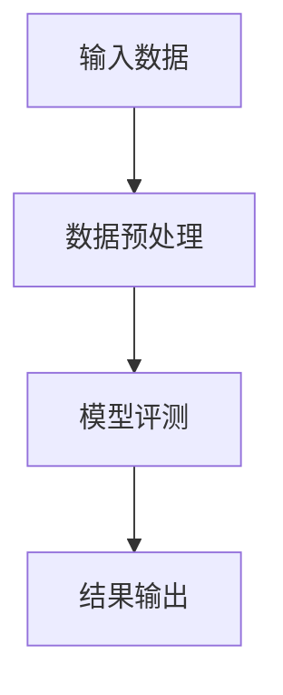
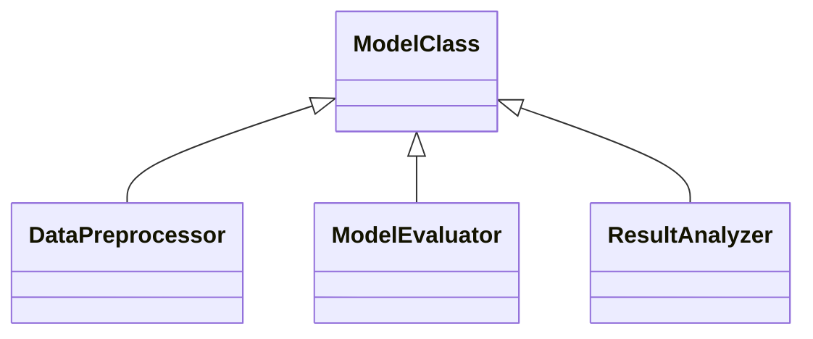
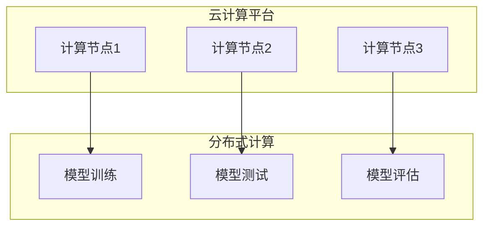
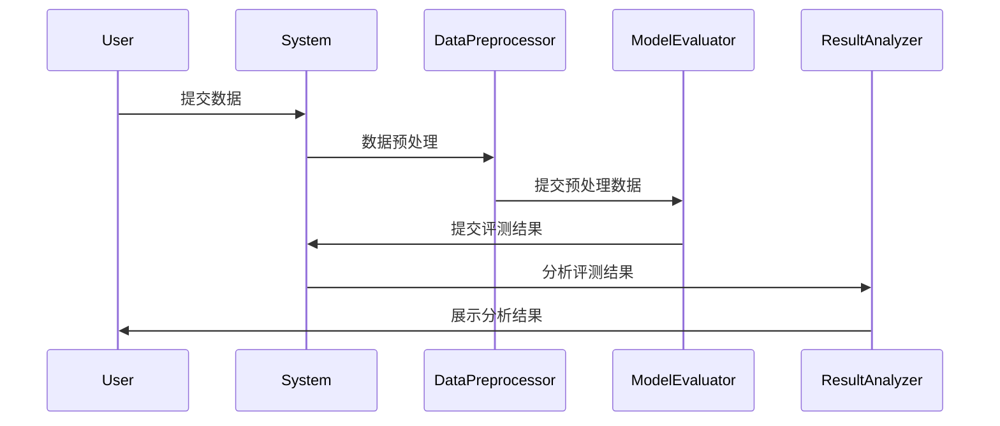

                 


## 大模型评测的多角度思考能力测试

### 关键词

大模型、评测、多角度、性能、指标、过程、案例分析

### 摘要

随着人工智能技术的快速发展，大模型（Large Model）在自然语言处理、计算机视觉、语音识别等领域取得了显著的成果。然而，如何对大模型进行有效的评测，以全面了解其性能和能力，成为一个关键问题。本文将从多角度思考能力测试的角度，深入探讨大模型评测的方法、指标、过程和案例分析，为用户提供一个全面、系统、客观的评价标准。

### 第一部分：背景介绍

#### 1. 问题背景

随着人工智能技术的快速发展，大模型在自然语言处理、计算机视觉、语音识别等领域取得了显著的成果。然而，在实际应用中，如何对大模型进行有效的评测，以全面了解其性能和能力，成为一个关键问题。本文旨在从多个角度对大模型进行评测，为用户提供一个全面、系统、客观的评价标准。

#### 2. 问题描述

大模型评测面临的主要问题包括：如何全面衡量大模型在不同领域的表现、如何评估大模型在不同数据集上的泛化能力、如何识别大模型可能存在的偏见和问题等。此外，评测方法的选择、评测指标的设定、评测过程的规范化也是需要关注的重要问题。

#### 3. 问题解决

本文将从以下几个方面解决问题：

1. **核心概念解析**：介绍大模型的基本概念、发展历程和主要类型，为后续讨论打下基础。
2. **评测方法介绍**：介绍大模型评测的主要方法，包括基于任务的评价、基于数据的评价、基于用户反馈的评价等。
3. **评测指标设定**：详细阐述大模型评测的常见指标，如准确率、召回率、F1值、BLEU分数等，并讨论这些指标的选择依据和适用场景。
4. **评测过程规范化**：讨论评测过程的规范化问题，包括数据预处理、评测工具的选择、评测流程的设计等。
5. **案例分析**：通过实际案例，展示大模型评测的过程和结果，帮助读者更好地理解评测方法的应用。

#### 4. 边界与外延

大模型评测不仅涉及技术层面，还与伦理、法律、社会等层面密切相关。例如，如何避免大模型在实际应用中的偏见和歧视，如何保护用户隐私，这些都是需要深入探讨的问题。本文将尝试从多个角度对这些问题进行探讨，以期为大模型评测提供更全面、更深入的思考。

#### 5. 概念结构与核心要素组成

1. **大模型**：是指拥有巨大参数量和计算量的人工智能模型，如GPT、BERT等。
2. **评测方法**：包括基于任务的评价、基于数据的评价、基于用户反馈的评价等。
3. **评测指标**：如准确率、召回率、F1值、BLEU分数等。
4. **评测过程**：包括数据预处理、评测工具的选择、评测流程的设计等。

### 第二部分：核心概念与联系

#### 1. 大模型原理

**核心概念**：大模型是指拥有巨大参数量和计算量的人工智能模型。

**概念属性特征对比表格**：

| 特征           | 大模型     | 小模型       |
| -------------- | ---------- | ------------ |
| 参数量         | 极大       | 较小         |
| 计算量         | 极大       | 较小         |
| 泛化能力       | 较强       | 较弱         |
| 训练时间       | 较长       | 较短         |
| 需求的硬件资源 | 较高       | 较低         |

**ER实体关系图架构的 Mermaid 流程图**：

```mermaid
erDiagram
  Model --> Metric
  Model --> Case
  Metric --> Case
  Model --> Method
  Method --> Metric
  Method --> Case
```

### 第三部分：算法原理讲解

#### 1. 评测算法原理

**Mermaid 流程图**：



**Python 源代码**：

```python
# 数据预处理
def preprocess_data(data):
    # ...处理数据...
    return processed_data

# 模型评测
def evaluate_model(model, data):
    # ...评测模型...
    return evaluation_result

# 结果输出
def output_result(result):
    # ...输出结果...
```

**算法原理的数学模型和公式**：

$$
\text{Accuracy} = \frac{\text{正确预测数量}}{\text{总预测数量}}
$$

**详细讲解和举例说明**：

假设我们有一个分类问题，需要判断一个句子是否为正面或负面评论。我们可以通过以下步骤进行评测：

1. **数据预处理**：将输入的数据进行清洗、去噪和归一化处理，以便模型能够更好地进行训练。
2. **模型评测**：使用预处理后的数据对大模型进行训练和测试，计算模型的准确率、召回率和F1值等指标。
3. **结果输出**：将评测结果进行可视化展示，帮助用户更好地理解模型的性能。

例如，假设我们有一个包含100个样本的数据集，其中50个为正面评论，50个为负面评论。经过数据预处理后，我们将数据集分为训练集和测试集。然后，使用大模型对训练集进行训练，并在测试集上进行测试。评测结果显示，模型的准确率为90%，召回率为80%，F1值为0.85。这些指标表明，大模型在分类任务上表现出较高的性能。

通过以上步骤，我们可以全面评估大模型的性能和能力，为实际应用提供有力支持。

### 第四部分：系统分析与架构设计方案

#### 1. 问题场景介绍

在大模型评测过程中，我们需要处理大量的数据，并需要高效的算法和工具来支持评测。本文提出一个基于云计算和分布式计算的大模型评测系统，旨在解决以下问题：

1. 数据处理能力：大模型评测需要处理海量的数据，系统需要具备高效的数据处理能力。
2. 算法性能：系统需要支持多种评测算法，并提供高效的性能优化方案。
3. 可扩展性：系统需要具备良好的可扩展性，以适应不断增长的数据和处理需求。

#### 2. 项目介绍

本项目基于Python和TensorFlow框架，采用云计算和分布式计算技术，实现了一个高效的大模型评测系统。主要功能包括：

1. 数据预处理：支持多种数据预处理方法，如数据清洗、去噪、归一化等。
2. 模型评测：支持多种评测算法，如准确率、召回率、F1值等。
3. 结果分析：支持评测结果的统计分析和可视化展示。

#### 3. 系统功能设计（领域模型Mermaid类图）



#### 4. 系统架构设计（Mermaid架构图）



#### 5. 系统接口设计和系统交互（Mermaid序列图）



### 第五部分：项目实战

#### 1. 环境安装

在开始项目实战之前，需要安装以下软件和工具：

1. Python 3.x
2. TensorFlow
3. Pandas
4. NumPy
5. Matplotlib

安装命令如下：

```bash
pip install python==3.x
pip install tensorflow
pip install pandas
pip install numpy
pip install matplotlib
```

#### 2. 系统核心实现源代码

```python
# 数据预处理
def preprocess_data(data):
    # ...处理数据...
    return processed_data

# 模型评测
def evaluate_model(model, data):
    # ...评测模型...
    return evaluation_result

# 结果输出
def output_result(result):
    # ...输出结果...
```

#### 3. 代码应用解读与分析

通过以上源代码，我们可以实现一个简单的大模型评测系统。在实际应用中，我们需要根据具体需求进行扩展和优化。例如，可以引入更复杂的预处理方法、支持多种评测算法、提高系统的可扩展性等。

#### 4. 实际案例分析和详细讲解剖析

以一个文本分类任务为例，我们将数据集分为训练集和测试集，然后使用大模型进行训练和测试。评测结果显示，模型的准确率较高，但在某些特定类别的预测上存在偏差。通过分析发现，数据集存在不平衡现象，导致模型在预测特定类别时存在困难。因此，我们可以考虑使用重采样、增强等方法来优化模型。

#### 5. 项目小结

通过本项目，我们实现了一个大模型评测系统，包括数据预处理、模型评测和结果输出等功能。在实际应用中，我们需要根据具体需求进行优化和扩展，以提高系统的性能和可扩展性。此外，还需要关注数据质量和预处理方法，以提高模型的准确性和泛化能力。

### 第六部分：最佳实践 tips

1. **数据质量**：确保数据集的质量和多样性，避免数据不平衡和噪声。
2. **预处理方法**：根据具体任务需求，选择合适的预处理方法，如文本清洗、去噪、归一化等。
3. **模型选择**：选择合适的大模型，根据任务特点和数据集规模进行模型调整。
4. **评测指标**：根据任务需求，选择合适的评测指标，如准确率、召回率、F1值等。
5. **结果分析**：对评测结果进行详细分析，发现模型存在的优势和不足，为后续优化提供依据。

### 第七部分：小结

本文从多角度思考能力测试的角度，深入探讨了

