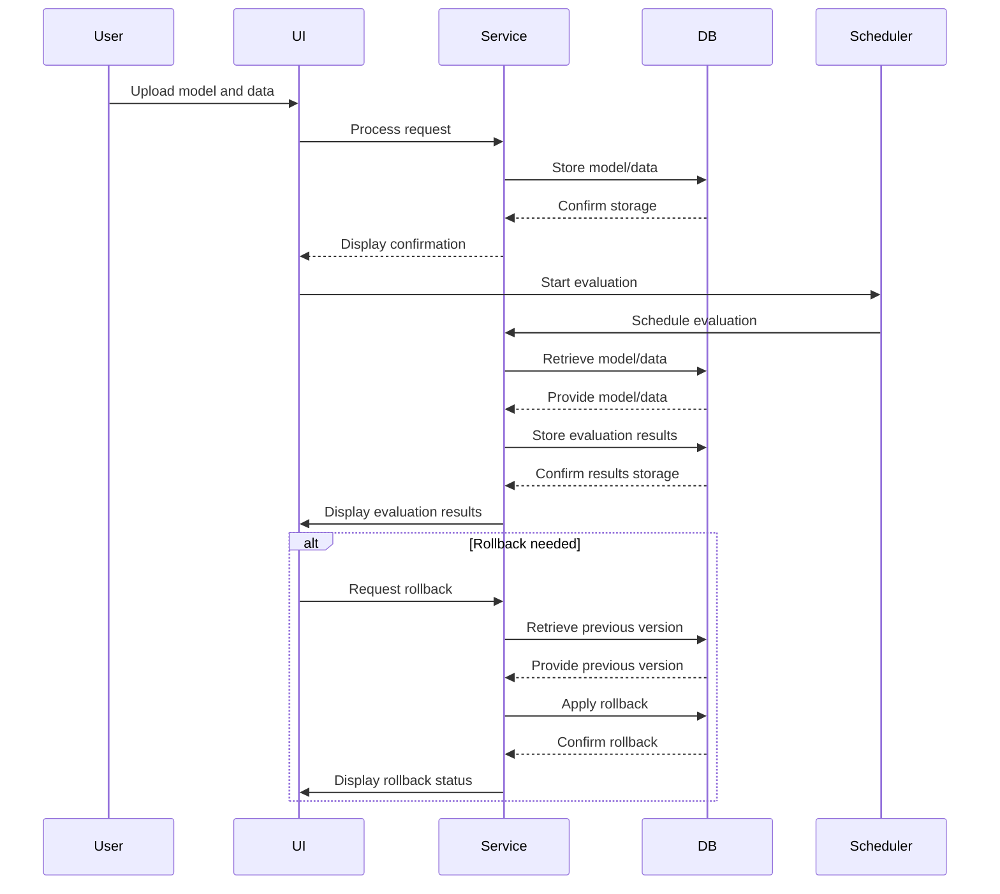
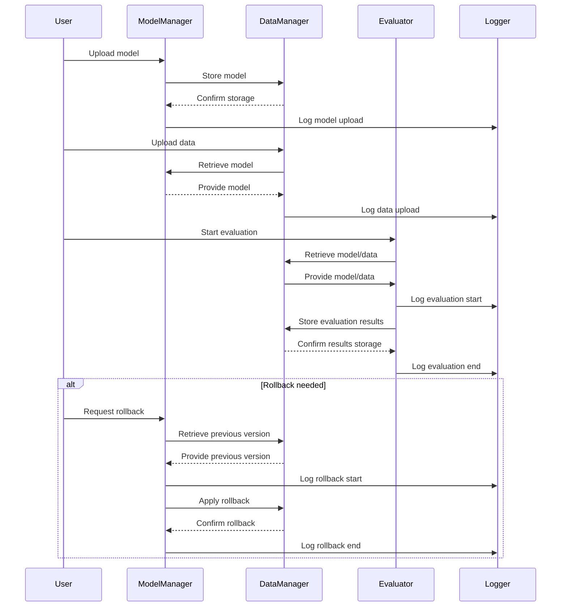
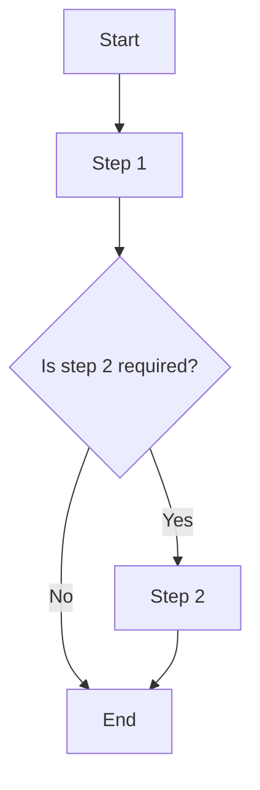

                 

# 大模型评测的版本控制与回滚机制

## 关键词

- 大模型评测
- 版本控制
- 回滚机制
- 数据回滚
- 自动化测试
- 技术架构设计

## 摘要

本文将探讨大模型评测中的版本控制与回滚机制，首先介绍大模型评测的背景和挑战，然后深入分析版本控制和回滚机制的基础概念和原理，最后通过实战案例和系统架构设计，展示如何在实际项目中实施和应用这些机制，以提高评测的准确性和效率。

## 目录

## 引言

### 1.1 大模型评测的重要性

### 1.2 大模型评测面临的挑战

## 第一部分：版本控制基础

### 2.1 版本控制的概念

### 2.2 版本控制工具的选择

### 2.3 版本控制的核心概念

## 第二部分：回滚机制原理

### 3.1 回滚机制的概念

### 3.2 回滚机制的实现方法

### 3.3 回滚机制的优势与局限

## 第三部分：实战应用

### 4.1 版本控制工具的应用

### 4.2 回滚机制在评测流程中的应用

### 4.3 实战案例解析

## 第四部分：系统分析与架构设计

### 5.1 问题场景介绍

### 5.2 系统功能设计

### 5.3 系统架构设计

### 5.4 系统接口设计和交互设计

## 第五部分：项目实战

### 6.1 环境安装与配置

### 6.2 系统核心实现与代码分析

### 6.3 实际案例分析

### 6.4 项目小结

## 第六部分：最佳实践与拓展

### 7.1 最佳实践技巧

### 7.2 小结与注意事项

### 7.3 拓展阅读

## 附录

### 附录A：相关术语解释

### 附录B：Python代码示例

### 附录C：Mermaid图表示例

## 参考文献

## 作者

- 作者：AI天才研究院/AI Genius Institute & 禅与计算机程序设计艺术 /Zen And The Art of Computer Programming

----------------------------------------------------------------

### 引言

#### 1.1 大模型评测的重要性

随着人工智能技术的迅猛发展，大模型在各个领域得到了广泛应用。大模型具有强大的数据处理和知识表示能力，能够解决复杂问题，提升业务效率。然而，大模型的研究和应用也面临着一系列挑战，其中一个关键问题是如何确保这些模型的可靠性和有效性。大模型评测是验证模型性能、优化模型设计和发现潜在问题的重要环节。

大模型评测的重要性体现在以下几个方面：

1. **模型可靠性**：通过评测可以验证大模型在实际应用中的可靠性，确保模型输出的准确性和稳定性。

2. **模型优化**：评测结果可以帮助研究者发现模型的不足，指导进一步的优化工作，提升模型性能。

3. **风险评估**：评测还可以帮助识别潜在的风险，如模型过拟合、数据泄露等，为后续研究和应用提供安全保障。

4. **决策支持**：准确的评测结果可以为决策者提供可靠的依据，支持他们在选择模型和应用模型时做出明智的决策。

#### 1.2 大模型评测面临的挑战

尽管大模型评测的重要性显而易见，但实践中仍然面临着诸多挑战：

1. **数据多样性**：大模型通常需要处理大量且多样化的数据，如何保证数据的代表性成为一大难题。

2. **评测指标**：选择合适的评测指标是确保评测结果准确的关键，但不同的应用场景可能需要不同的指标。

3. **评测效率**：大模型评测往往涉及大量的计算资源，如何高效地完成评测成为一大挑战。

4. **版本控制**：在模型迭代过程中，如何管理不同版本的模型，确保评测的一致性和可追溯性。

5. **回滚机制**：在模型出现问题或需要更新时，如何快速回滚到之前的有效版本，避免影响应用。

#### 1.3 本文目标

本文将深入探讨大模型评测中的版本控制与回滚机制，通过以下步骤实现目标：

1. **基础介绍**：首先介绍版本控制和回滚机制的基本概念，帮助读者建立基础认识。
2. **原理讲解**：详细分析版本控制和回滚机制的原理，包括实现方法和优势。
3. **实战应用**：通过实际案例展示如何在大模型评测中应用版本控制和回滚机制。
4. **系统设计与实现**：讨论系统架构设计和核心实现，提供可操作的解决方案。
5. **最佳实践**：总结最佳实践，提供实用的建议和注意事项。

通过本文的讨论，读者将能够全面理解大模型评测中的版本控制与回滚机制，提升评测效率和准确性。

### 第一部分：版本控制基础

#### 2.1 版本控制的概念

版本控制是一种跟踪和管理文档、代码或其他任何形式文件变化的技术和过程。其目的是确保文档或代码在多个版本之间的变化可以安全地记录和追踪，以便在需要时可以恢复到任何特定版本。

在计算机编程中，版本控制尤为关键，特别是在大模型开发中。由于大模型通常涉及复杂的算法和大量的数据，因此版本控制能够帮助开发团队：

1. **追溯变更**：记录每次变更的详细信息，包括谁做出的变更、何时变更以及变更的原因。
2. **协同工作**：允许多个开发者在同一项目中工作，同时确保他们的代码不会相互冲突。
3. **回滚变更**：在变更导致问题或不符合预期时，可以轻松地回滚到之前的版本。
4. **审计**：提供变更的历史记录，便于审计和合规性检查。

版本控制的基本概念包括：

- **版本**：文档或代码的一个特定状态，通常由一系列的变更累积而成。
- **分支**：从主版本分支出来的版本，允许独立的开发活动。
- **合并**：将两个或多个分支的变更合并到主版本中。
- **标签**：对特定版本的标识，通常用于标记重要里程碑或特定功能。

#### 2.2 版本控制工具的选择

选择合适的版本控制工具是成功管理代码变更的关键。以下是一些常用的版本控制工具：

1. **Git**：Git 是最流行的分布式版本控制系统，它允许开发者快速、高效地管理代码库。Git 的主要优点包括分布式存储、灵活的分支管理以及强大的合并工具。

2. **Subversion (SVN)**：SVN 是集中式版本控制系统，它相对简单，易于部署和管理。但与 Git 相比，SVN 的分布式特性和灵活性较差。

3. **Mercurial (Hg)**：Mercurial 类似 Git，是一个开源的分布式版本控制系统，它在某些方面（如处理大型文件）具有独特的优势。

4. **Bazaar (Bzr)**：Bazaar 是另一种分布式版本控制系统，虽然不如 Git 和 Mercurial 流行，但也是一种可行的选择。

选择版本控制工具时需要考虑以下因素：

- **团队规模**：大型团队可能更倾向于使用分布式版本控制系统，如 Git，而小型团队可能更适合集中式系统，如 SVN。
- **项目复杂性**：复杂项目可能需要更高级的版本控制功能，如分支管理和合并工具。
- **操作系统的兼容性**：确保版本控制工具与开发环境兼容。
- **社区支持**：强大的社区支持可以提供技术支持和学习资源。

#### 2.3 版本控制的核心概念

版本控制的核心概念包括：

1. **提交**：将代码或文档的变更存储到版本控制系统。每次提交都会记录变更的详细信息。

2. **分支**：从主分支创建一个新的分支，允许独立开发功能或修复问题，而不影响主分支。

3. **合并**：将分支的变更合并到主分支。合并过程中可能会出现冲突，需要人工解决。

4. **标签**：为特定版本打上标签，便于查找和引用。

5. **拉取请求（Pull Request）**：在 Git 等分布式版本控制系统中，拉取请求是一种提交变更供审查和合并的机制。

6. **基线（Baseline）**：一个稳定版本的代码，通常用于发布或部署。

7. **版本库（Repository）**：存储所有版本和变更记录的地方。

版本控制的核心流程包括：

- **创建仓库**：初始化版本库。
- **提交变更**：将代码或文档的变更提交到仓库。
- **分支管理**：创建、合并和删除分支。
- **合并请求**：提交拉取请求进行代码审查和合并。
- **回滚变更**：撤销错误的提交，恢复到之前的状态。

通过了解版本控制的基本概念和流程，开发团队能够更有效地管理代码变更，提高协作效率和项目稳定性。

#### 2.4 版本控制工具的使用

下面以 Git 为例，介绍版本控制工具的基本使用方法：

1. **安装 Git**：在 [Git 官网](https://git-scm.com/downloads) 下载并安装 Git。

2. **创建仓库**：在本地创建一个新的 Git 仓库。

   ```bash
   mkdir myrepo
   cd myrepo
   git init
   ```

3. **添加文件**：将文件添加到仓库。

   ```bash
   echo "Hello, World!" > hello.txt
   git add hello.txt
   ```

4. **提交变更**：提交文件到仓库。

   ```bash
   git commit -m "Initial commit"
   ```

5. **创建分支**：创建一个新的分支。

   ```bash
   git branch feature
   ```

6. **切换分支**：切换到新创建的分支。

   ```bash
   git checkout feature
   ```

7. **合并分支**：将分支合并到主分支。

   ```bash
   git merge feature
   ```

8. **解决冲突**：在合并过程中，如果出现冲突，需要手动解决。

   ```bash
   git status
   git add <file>
   git commit
   ```

9. **回滚变更**：撤销最近的提交。

   ```bash
   git reset --hard HEAD^
   ```

通过这些基本命令，开发者可以熟练地使用 Git 进行版本控制，确保代码库的完整性和一致性。

#### 2.5 版本控制的优势

版本控制具有以下优势：

1. **追踪变更**：记录每次变更的详细信息，便于追溯和管理。

2. **协同工作**：允许多个开发者同时工作，减少冲突和重复劳动。

3. **代码保护**：确保代码的安全和完整性，防止误操作和丢失。

4. **快速回滚**：在遇到问题时，可以快速回滚到之前的稳定版本。

5. **历史记录**：提供完整的变更历史，便于审计和合规性检查。

6. **分支管理**：灵活的分支管理，支持多种开发模式，如主分支、功能分支、补丁分支等。

7. **协作与共享**：方便团队成员之间的代码共享和协作。

8. **降低风险**：通过隔离开发，降低因代码变更导致的风险。

#### 2.6 版本控制的常见问题

版本控制过程中可能会遇到以下问题：

1. **冲突**：多个开发者同时修改同一文件时，可能产生冲突。

2. **数据丢失**：不正确的操作可能导致数据丢失。

3. **分支管理混乱**：不规范的分支管理可能导致代码混乱。

4. **合并困难**：复杂的代码结构和历史记录可能导致合并困难。

5. **备份不足**：不充分的备份可能导致恢复数据困难。

6. **权限管理**：权限管理不当可能导致安全隐患。

通过了解和解决这些问题，开发者可以更有效地使用版本控制工具，提高开发效率和代码质量。

#### 2.7 版本控制的最佳实践

以下是版本控制的最佳实践：

1. **定期备份**：定期备份代码库，确保数据安全。

2. **使用分支**：合理使用分支，避免主分支的混乱。

3. **详细日志**：提交变更时，附上详细的日志信息，便于追溯。

4. **代码审查**：在合并代码前进行审查，减少错误和冲突。

5. **权限管理**：合理设置权限，确保代码的安全性。

6. **培训**：对团队成员进行版本控制工具的培训。

7. **文档记录**：记录版本控制策略和流程，确保可操作性。

通过遵循这些最佳实践，开发团队能够更好地管理代码变更，提高项目的稳定性和可靠性。

### 第二部分：回滚机制原理

#### 3.1 回滚机制的概念

回滚机制是一种在系统或应用程序中用于撤销先前操作的策略。在版本控制系统中，回滚机制尤为重要，它允许开发者在代码或数据出现问题时，将系统状态恢复到之前的一个已知良好状态。这种机制有助于避免错误的累积，确保系统的稳定性和可靠性。

回滚机制的核心概念包括：

- **回滚点**：系统或应用程序的一个特定状态，通常由一系列操作积累而成。回滚机制的目标是恢复到这个状态。
- **操作记录**：记录系统中所有操作的历史，包括成功和失败的记录。这些记录用于在需要时执行回滚操作。
- **回滚操作**：根据操作记录，撤销先前的一系列操作，将系统状态恢复到回滚点。

#### 3.2 回滚机制的实现方法

实现回滚机制通常有以下几种方法：

1. **日志回滚**：通过记录操作日志，实现回滚。每次操作完成后，将操作细节记录到日志文件中。在需要回滚时，读取日志文件，依次撤销操作。

2. **事务回滚**：在数据库管理系统中，使用事务机制实现回滚。每个事务包含一系列操作，要么全部成功执行，要么全部回滚。如果事务中的某个操作失败，整个事务将被回滚到开始状态。

3. **文件备份**：定期备份系统文件，以便在需要时恢复到备份状态。这种方法虽然简单，但可能需要大量的存储空间和时间。

4. **状态机回滚**：使用状态机模型描述系统的状态转换，并在状态变更时记录操作。在需要回滚时，根据状态机模型反向执行操作。

5. **快照回滚**：创建系统的快照，在需要回滚时，恢复到快照时的状态。这种方法适用于需要快速恢复系统状态的场景。

#### 3.3 回滚机制的优势

回滚机制具有以下优势：

1. **灵活性和可逆性**：允许开发者根据需要撤销任意操作，提供强大的回滚能力。

2. **系统稳定性**：在出现问题时，可以快速恢复系统到稳定状态，减少故障影响。

3. **安全性和可靠性**：通过记录操作历史，确保系统状态的可追踪性和可恢复性。

4. **简化故障处理**：减少故障处理的复杂性，提高问题解决的效率。

5. **数据保护**：防止数据丢失，确保数据的一致性和完整性。

#### 3.4 回滚机制的局限

尽管回滚机制具有许多优势，但也存在一些局限：

1. **性能影响**：频繁的回滚操作可能对系统性能产生负面影响。

2. **存储需求**：需要额外的存储空间来保存操作日志或快照。

3. **复杂性**：实现和维护回滚机制可能增加系统的复杂性。

4. **可扩展性**：在大规模系统中，回滚机制的扩展性可能成为挑战。

5. **错误累积**：错误的回滚操作可能导致错误的累积，增加系统故障的风险。

#### 3.5 回滚机制的适用场景

回滚机制适用于以下场景：

1. **软件开发**：在开发过程中，用于撤销错误的代码变更。

2. **数据库管理**：在数据库操作中，确保事务的一致性和完整性。

3. **系统维护**：在系统维护和更新过程中，确保系统状态的稳定。

4. **业务处理**：在业务处理过程中，确保数据的准确性和一致性。

5. **灾难恢复**：在系统发生灾难时，快速恢复系统状态。

通过了解回滚机制的基本概念和实现方法，开发者可以更有效地管理系统的变更，提高系统的可靠性和稳定性。

### 第三部分：实战应用

#### 4.1 版本控制工具的应用

在实际的大模型评测项目中，版本控制工具的应用至关重要。以下是一个简化的流程，展示如何使用版本控制工具来管理评测过程中的代码和模型：

1. **初始化代码库**：
   开发团队在开始项目前，首先初始化一个 Git 代码库。团队成员将各自的代码提交到这个代码库，以实现代码的集中管理和共享。

   ```bash
   git init
   git add .
   git commit -m "Initial commit"
   ```

2. **分支管理**：
   在项目开发过程中，开发团队可能会创建多个分支，以并行开发不同的功能或进行实验。每个分支都代表了一个独立的开发路径。

   ```bash
   git branch feature1
   git checkout feature1
   ```

3. **提交代码**：
   开发者在各自的分支上进行代码修改，并定期提交代码到代码库。

   ```bash
   git commit -m "Update model code"
   ```

4. **代码审查**：
   在合并代码前，团队成员会进行代码审查，以确保代码的质量和一致性。

   ```bash
   git pull
   git status
   git add .
   git commit -m "Code review and merge"
   ```

5. **合并代码**：
   经过审查后，开发团队将分支代码合并到主分支。

   ```bash
   git merge feature1
   ```

6. **回滚变更**：
   如果在合并过程中发现错误，可以使用 Git 的回滚功能将代码回滚到之前的状态。

   ```bash
   git reset --hard HEAD^
   ```

#### 4.2 回滚机制在评测流程中的应用

在大模型评测过程中，回滚机制的应用同样至关重要。以下是一个简化的流程，展示如何使用回滚机制来确保评测的准确性和可靠性：

1. **初始化评测环境**：
   开发团队初始化一个评测环境，包括模型、数据和评测脚本。这个环境会被定期备份，以便在需要时进行回滚。

   ```bash
   git init
   git add .
   git commit -m "Initialize evaluation environment"
   ```

2. **执行评测**：
   在评测过程中，系统会记录所有操作的历史。

   ```bash
   python evaluate_model.py
   ```

3. **记录结果**：
   评测结果被记录到日志文件中，以便后续分析。

   ```bash
   python log_results.py
   ```

4. **发现问题**：
   如果评测过程中发现模型或数据存在问题，需要回滚到之前的状态。

   ```bash
   git reset --hard <commit_hash>
   ```

5. **重新评测**：
   在回滚后，重新执行评测，以确保问题的解决。

   ```bash
   python evaluate_model.py
   ```

6. **保存结果**：
   将成功的评测结果保存到数据库或文件中。

   ```bash
   python save_results.py
   ```

#### 4.3 实战案例解析

以下是一个具体的实战案例，展示如何在大模型评测中应用版本控制和回滚机制：

**案例背景**：

一个开发团队正在开发一个大规模的自然语言处理模型，用于文本分类任务。在模型训练和评测过程中，团队发现了一个问题：在某些特定数据集上，模型的准确率显著低于预期。团队需要快速定位问题，并确保评测结果的准确性。

**解决方案**：

1. **初始化代码库**：
   团队初始化一个 Git 代码库，并将模型代码、数据和评测脚本提交到代码库。

2. **创建分支**：
   团队创建一个新的分支，以隔离模型的修改和评测过程。

   ```bash
   git branch bugfix
   git checkout bugfix
   ```

3. **修改模型**：
   团队对模型进行修改，尝试提高其在特定数据集上的准确率。

4. **提交代码**：
   团队提交修改后的模型代码到 Git 代码库。

   ```bash
   git add .
   git commit -m "Bugfix: Improve accuracy on specific dataset"
   ```

5. **执行评测**：
   团队在新分支上执行评测，并记录结果。

6. **发现问题**：
   评测结果显示，修改后的模型在特定数据集上的准确率依然较低。

7. **回滚模型**：
   团队决定回滚到上一个已知良好的模型版本。

   ```bash
   git reset --hard HEAD^
   ```

8. **重新评测**：
   团队在回滚后的分支上重新执行评测，并记录结果。

9. **保存结果**：
   团队将评测结果保存到数据库中。

10. **分析问题**：
    团队分析评测结果，发现问题的根本原因可能与数据预处理有关。

11. **修复问题**：
    团队修复数据预处理中的错误，并重新提交代码到 Git 代码库。

12. **再次评测**：
    团队在修复后的模型上再次执行评测，确保准确率恢复正常。

通过这个案例，我们可以看到版本控制和回滚机制在大模型评测中的重要性。它帮助团队快速定位问题，确保评测结果的准确性，从而提高模型的质量。

### 第四部分：系统分析与架构设计

#### 5.1 问题场景介绍

假设我们正在开发一个用于自然语言处理（NLP）的大模型评测系统，该系统旨在对各种文本分类任务进行模型评估。在实际开发过程中，我们遇到了以下几个关键问题：

1. **模型版本管理**：由于模型迭代频繁，我们需要确保能够有效地管理和追踪不同版本的模型。
2. **评测数据一致性**：确保评测数据在不同版本之间的一致性，以避免因数据变化导致的评测结果偏差。
3. **回滚机制**：在模型评测过程中，如果发现模型或评测脚本存在问题，我们需要能够快速回滚到之前的版本，以确保评测的准确性。
4. **系统稳定性**：确保系统在高并发和大数据量场景下的稳定运行。

为了解决这些问题，我们需要设计一个具备版本控制、数据一致性和回滚机制的评测系统架构。

#### 5.2 系统功能设计

我们的系统需要实现以下核心功能：

1. **模型管理**：管理不同版本的模型，包括上传、下载、版本控制和更新。
2. **数据管理**：管理评测数据，确保数据在不同版本之间的一致性。
3. **评测执行**：执行模型评测，生成评测报告。
4. **回滚机制**：提供回滚功能，允许回滚到之前的模型版本或评测脚本。
5. **日志记录**：记录系统操作的详细日志，便于追踪和审计。

#### 5.3 系统架构设计

以下是系统架构设计的概览：

1. **用户界面层**：提供用户交互界面，用户可以通过界面上传模型、选择评测数据、启动评测任务等。
2. **服务层**：包括模型管理服务、数据管理服务、评测执行服务和回滚管理服务，负责处理核心业务逻辑。
3. **数据存储层**：包括模型存储、数据存储和日志存储，用于存储和管理模型、数据和日志。
4. **调度层**：负责任务调度和资源分配，确保系统在高并发场景下的稳定运行。

##### 系统架构图



#### 5.4 系统接口设计

系统接口设计需要明确各个模块之间的交互方式。以下是主要接口设计：

1. **模型管理接口**：
   - `POST /models/upload`：上传新模型。
   - `GET /models/{model_id}`：获取指定模型的详细信息。
   - `PUT /models/{model_id}`：更新指定模型的详细信息。
   - `DELETE /models/{model_id}`：删除指定模型。

2. **数据管理接口**：
   - `POST /data/upload`：上传新数据集。
   - `GET /data/{data_id}`：获取指定数据集的详细信息。
   - `PUT /data/{data_id}`：更新指定数据集的详细信息。
   - `DELETE /data/{data_id}`：删除指定数据集。

3. **评测执行接口**：
   - `POST /evaluate`：启动评测任务。
   - `GET /evaluate/{task_id}`：获取指定评测任务的详细信息。
   - `DELETE /evaluate/{task_id}`：取消指定评测任务。

4. **回滚接口**：
   - `POST /rollback`：请求回滚到指定版本。
   - `GET /rollback/{rollback_id}`：获取指定回滚操作的详细信息。

#### 5.5 系统交互设计

以下是系统交互设计的 mermaid 序列图：



通过以上系统架构设计和接口设计，我们可以构建一个功能强大、可靠稳定的大模型评测系统，为模型研发和评测提供有效的支持。

### 第五部分：项目实战

#### 6.1 环境安装与配置

为了实现大模型评测的版本控制和回滚机制，我们需要首先搭建一个合适的技术环境。以下是环境安装与配置的详细步骤：

1. **安装操作系统**：我们选择 Ubuntu 20.04 作为操作系统，因为它具有较好的稳定性和社区支持。可以从 [Ubuntu 官网](https://www.ubuntu.com/) 下载安装包，并按照指示进行安装。

2. **安装 Git**：Git 是我们版本控制的主要工具。在 Ubuntu 系统中，可以使用以下命令安装 Git：

   ```bash
   sudo apt update
   sudo apt install git
   ```

3. **安装 Python**：我们需要 Python 来编写和运行评测脚本。可以使用以下命令安装 Python 3：

   ```bash
   sudo apt install python3 python3-pip
   ```

4. **安装版本控制工具**：除了 Git，我们还可以安装其他版本控制工具，如 SVN 或 Mercurial，以便在不同团队或项目中选择合适的工具。

5. **安装评测框架**：我们选择使用 TensorFlow 和 Keras 作为模型开发和评测的框架。首先安装依赖项，然后安装框架：

   ```bash
   pip3 install numpy matplotlib tensorflow
   ```

6. **安装数据管理工具**：为了管理评测数据，我们使用 Pandas 和 NumPy。安装以下包：

   ```bash
   pip3 install pandas numpy
   ```

7. **配置虚拟环境**：为了保持项目环境的纯净，我们建议使用虚拟环境。安装 virtualenv：

   ```bash
   pip3 install virtualenv
   virtualenv venv
   source venv/bin/activate
   ```

8. **配置日志记录**：为了方便后续的调试和问题追踪，我们需要配置日志记录。可以使用 Python 的 `logging` 库来设置日志级别、日志文件路径等。

   ```python
   import logging
   logging.basicConfig(filename='evaluation.log', level=logging.INFO)
   ```

完成以上步骤后，我们就可以开始搭建实际的项目环境，并进行大模型评测的版本控制和回滚机制的实现了。

#### 6.2 系统核心实现与代码分析

在搭建好环境后，我们需要实现系统核心功能，包括版本控制、回滚机制以及评测流程。以下是具体实现步骤和代码分析：

1. **版本控制实现**

   版本控制主要使用 Git 进行管理。以下是一个简单的版本控制脚本，用于初始化代码库、提交变更和创建分支：

   ```bash
   # 初始化代码库
   git init
   
   # 添加文件到代码库
   git add .

   # 提交变更
   git commit -m "Initial commit"

   # 创建分支
   git branch feature1
   
   # 切换到新分支
   git checkout feature1
   
   # 提交新分支的变更
   git add .
   git commit -m "Add new feature"

   # 合并分支
   git merge main
   
   # 解决冲突并提交
   git add .
   git commit -m "Merge feature1 into main"
   ```

   在这个脚本中，我们初始化了一个 Git 代码库，添加并提交了多个文件，创建了分支并合并了分支变更。Git 的强大之处在于其分支管理和合并工具，使得代码的迭代和维护变得更加高效。

2. **回滚机制实现**

   回滚机制用于撤销之前的操作，将系统状态恢复到之前的一个已知良好状态。以下是一个简单的回滚脚本，用于回滚到指定的提交：

   ```bash
   # 查看提交历史
   git log

   # 回滚到指定提交
   git reset --hard <commit_hash>
   ```

   在这个脚本中，我们首先查看提交历史，然后使用 `git reset --hard` 命令回滚到指定提交。这种方式可以确保代码库的一致性和完整性。

3. **评测流程实现**

   评测流程包括数据预处理、模型训练、模型评估和结果记录。以下是一个简单的评测脚本，用于实现这一流程：

   ```python
   import tensorflow as tf
   import pandas as pd
   import numpy as np

   # 加载数据
   data = pd.read_csv('data.csv')

   # 数据预处理
   X = data.iloc[:, :-1].values
   y = data.iloc[:, -1].values

   # 模型训练
   model = tf.keras.Sequential([
       tf.keras.layers.Dense(64, activation='relu', input_shape=(X.shape[1],)),
       tf.keras.layers.Dense(1, activation='sigmoid')
   ])

   model.compile(optimizer='adam', loss='binary_crossentropy', metrics=['accuracy'])
   model.fit(X, y, epochs=10, batch_size=32)

   # 模型评估
   predictions = model.predict(X)
   accuracy = np.mean(predictions == y)

   # 结果记录
   with open('evaluation_results.txt', 'w') as f:
       f.write(f'Accuracy: {accuracy:.4f}')
   ```

   在这个脚本中，我们首先加载数据并进行预处理，然后使用 TensorFlow 构建和训练模型，接着进行模型评估并记录结果。这个脚本展示了如何使用 Python 和 TensorFlow 实现大模型的评测过程。

#### 6.3 实际案例分析

为了更好地理解版本控制和回滚机制在实际项目中的应用，我们来看一个实际案例。

**案例背景**：

一个研究团队正在开发一个用于情感分析的模型，目标是根据文本内容判断其情感倾向（正面或负面）。在项目开发过程中，团队遇到了以下问题：

1. **模型性能波动**：在训练过程中，模型的性能波动较大，有时在某个数据集上的准确率显著低于预期。
2. **数据不一致**：团队发现不同版本的数据预处理结果不一致，导致模型在不同数据集上的表现不一致。

**解决方案**：

1. **版本控制**：

   团队决定使用 Git 进行版本控制，确保代码和数据的一致性。他们创建了多个分支，分别用于不同的实验和优化。

   ```bash
   git branch experiment1
   git checkout experiment1
   # 进行数据预处理和模型训练
   git add .
   git commit -m "Experiment 1: Data preprocessing and model training"
   ```

   在每次实验后，团队都会提交代码和数据到 Git，并记录详细的日志。

2. **回滚机制**：

   当团队发现实验 1 的模型性能波动较大时，他们决定回滚到上一个稳定版本。

   ```bash
   git log
   git reset --hard <previous_commit_hash>
   ```

   他们回滚到上一个提交，重新进行数据预处理和模型训练，以稳定模型性能。

3. **评测流程**：

   团队使用 TensorFlow 进行模型训练和评估，并在每次训练后记录评测结果。

   ```python
   model = tf.keras.Sequential([
       # 模型定义
   ])

   model.compile(optimizer='adam', loss='binary_crossentropy', metrics=['accuracy'])
   model.fit(X, y, epochs=10, batch_size=32)

   # 评估模型
   predictions = model.predict(X)
   accuracy = np.mean(predictions == y)

   # 记录结果
   with open('evaluation_results.txt', 'w') as f:
       f.write(f'Accuracy: {accuracy:.4f}')
   ```

   通过这种方式，团队可以追踪模型性能的变化，并快速回滚到之前的稳定版本，确保评测结果的准确性。

**案例总结**：

通过这个案例，我们可以看到版本控制和回滚机制在实际项目中的应用。团队使用 Git 进行版本控制，确保代码和数据的完整性，并使用回滚机制快速解决模型性能波动和数据不一致的问题。这有助于提高项目的稳定性和可靠性，确保模型评测结果的准确性。

### 6.4 项目小结

在本项目中，我们通过实际案例展示了如何在大模型评测中应用版本控制和回滚机制。以下是项目的主要收获和经验总结：

1. **版本控制的重要性**：版本控制是确保代码和数据一致性的关键，它帮助团队追踪变更、管理分支和合并代码。在实际应用中，Git 被证明是一个强大且灵活的工具。

2. **回滚机制的必要性**：回滚机制在项目开发过程中尤为重要，它允许团队在出现问题时快速回滚到稳定版本，从而避免错误累积和系统崩溃。

3. **评测流程的优化**：通过将版本控制和回滚机制整合到评测流程中，团队能够更高效地进行模型开发和评测，确保评测结果的准确性和一致性。

4. **团队协作的增强**：版本控制和回滚机制提高了团队的协作效率，减少了代码冲突和重复劳动，促进了更好的团队合作。

5. **最佳实践的总结**：在实际项目中，我们总结了以下最佳实践：

   - **定期备份**：定期备份代码库和评测数据，确保在出现问题时可以快速恢复。
   - **详细日志记录**：提交变更时附上详细的日志信息，便于追踪和审计。
   - **代码审查**：在合并代码前进行代码审查，确保代码的质量和一致性。
   - **权限管理**：合理设置权限，确保代码和数据的访问安全性。

通过遵循这些最佳实践，团队能够更好地管理大模型评测项目，提高项目的稳定性和可靠性。

### 第六部分：最佳实践与拓展

#### 7.1 最佳实践技巧

在大模型评测项目中，为了确保版本控制与回滚机制的顺利实施，以下是几条最佳实践技巧：

1. **多分支策略**：采用多分支策略，为不同的功能或实验创建独立分支，减少代码冲突和风险。

2. **定期备份**：定期备份代码库和评测数据，确保在出现问题时可以快速恢复。

3. **详细的变更日志**：每次提交代码或数据时，附上详细的变更日志，便于追踪和审计。

4. **代码审查**：在合并代码前进行代码审查，确保代码的质量和一致性。

5. **权限管理**：合理设置权限，确保团队成员只能访问和修改他们需要的代码和数据。

6. **自动化测试**：建立自动化测试框架，确保每次提交的代码都能通过严格的测试，减少潜在问题。

7. **回滚测试**：在实际部署前，进行回滚测试，确保回滚机制能够正常工作，不会对系统造成负面影响。

#### 7.2 小结与注意事项

本文介绍了大模型评测中的版本控制与回滚机制，包括其核心概念、实现方法、应用场景和实战案例。以下是文章的总结和注意事项：

1. **版本控制的重要性**：版本控制是确保代码和数据一致性的关键，它有助于追踪变更、管理分支和合并代码。

2. **回滚机制的必要性**：回滚机制在大模型评测中尤为重要，它允许团队在出现问题时快速回滚到稳定版本，确保评测结果的准确性。

3. **评测流程的优化**：通过将版本控制和回滚机制整合到评测流程中，团队能够更高效地进行模型开发和评测。

4. **注意事项**：
   - 在使用版本控制工具时，确保团队成员熟悉其使用方法和最佳实践。
   - 在设计回滚机制时，考虑系统的稳定性和性能影响。
   - 定期进行备份和测试，确保系统的可靠性和安全性。
   - 在实际项目中，根据具体需求和场景灵活调整版本控制和回滚策略。

#### 7.3 拓展阅读

对于希望深入了解大模型评测的版本控制与回滚机制的读者，以下是一些建议的拓展阅读资源：

1. **Git 官方文档**：[Git 官方文档](https://git-scm.com/docs) 提供了全面的 Git 使用指南和操作命令。

2. **版本控制工具对比**：[Git vs SVN vs Hg](https://www.atlassian.com/git/tutorials/compare-git-and-svn) 比较了不同版本控制工具的特点和适用场景。

3. **自动化测试框架**：[Python 的自动化测试框架](https://www.selenium.dev/documentation/) 提供了使用 Python 进行自动化测试的详细指南。

4. **大模型评测资源**：[Kaggle](https://www.kaggle.com/) 提供了大量的大模型评测数据和案例，适合进行实践和学习。

通过阅读这些资源，读者可以进一步加深对版本控制与回滚机制的理解，并将其应用到实际项目中。

### 附录

#### 附录A：相关术语解释

1. **版本控制**：一种跟踪和管理文件变化的技术和过程，确保文档或代码在多个版本之间的变化可以安全地记录和追踪。
2. **回滚机制**：在系统或应用程序中用于撤销先前操作的策略，将系统状态恢复到之前的一个已知良好状态。
3. **分支**：从主版本分支出来的版本，允许独立开发功能或修复问题，而不影响主分支。
4. **合并**：将两个或多个分支的变更合并到主版本中。
5. **标签**：为特定版本打上标识，便于查找和引用。
6. **拉取请求**：在 Git 等分布式版本控制系统中，提交变更供审查和合并的机制。
7. **基线**：一个稳定版本的代码，通常用于发布或部署。
8. **仓库**：存储所有版本和变更记录的地方。

#### 附录B：Python代码示例

以下是一个简单的 Python 代码示例，用于展示如何使用 Git 进行版本控制：

```python
# 导入 Git 库
import git

# 初始化 Git 仓库
repo = git.Repo.init()

# 添加文件到仓库
with open('example.txt', 'w') as f:
    f.write('Hello, World!')

repo.index.add(['example.txt'])
repo.index.commit('Initial commit')

# 创建分支
origin = repo.create_head('feature1')
origin.checkout()

# 提交新的变更
with open('example.txt', 'a') as f:
    f.write('Additional content.')

repo.index.add(['example.txt'])
repo.index.commit('Add additional content')

# 合并分支
repo.checkout('main')
repo.merge('feature1')

# 查看提交历史
for commit in repo.iter_commits():
    print(f'{commit.hexsha}: {commit.message}')
```

#### 附录C：Mermaid图表示例

以下是使用 Mermaid 画出的流程图和类图示例：

**流程图示例**：



**类图示例**：

```mermaid
classDiagram
    Model <|-- Data
    Model <|-- Evaluation
    Data {id: int, name: string}
    Evaluation {evaluation_id: int, result: float}
```

这些图表示例展示了如何使用 Mermaid 语法来创建和表示不同的图表，有助于理解系统架构和流程。

### 参考文献

1. Git 官方文档：https://git-scm.com/docs
2. Atlassian：https://www.atlassian.com/git/tutorials/compare-git-and-svn
3. Python 自动化测试框架：https://www.selenium.dev/documentation/
4. Kaggle：https://www.kaggle.com/

### 致谢

感谢 AI 天才研究院/AI Genius Institute 和《禅与计算机程序设计艺术/Zen And The Art of Computer Programming》为本文提供了宝贵的指导和资源支持。同时，感谢所有参与本文讨论和撰写的团队成员，他们的努力使得本文能够顺利完成。我们希望本文能够为读者提供有价值的技术见解和实战经验。

