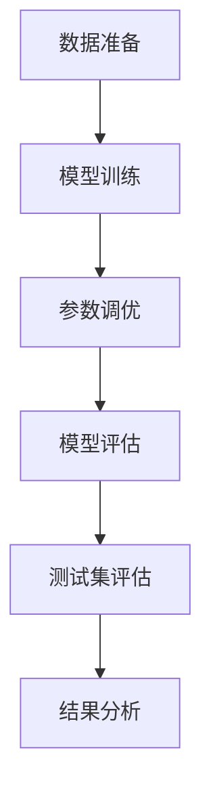
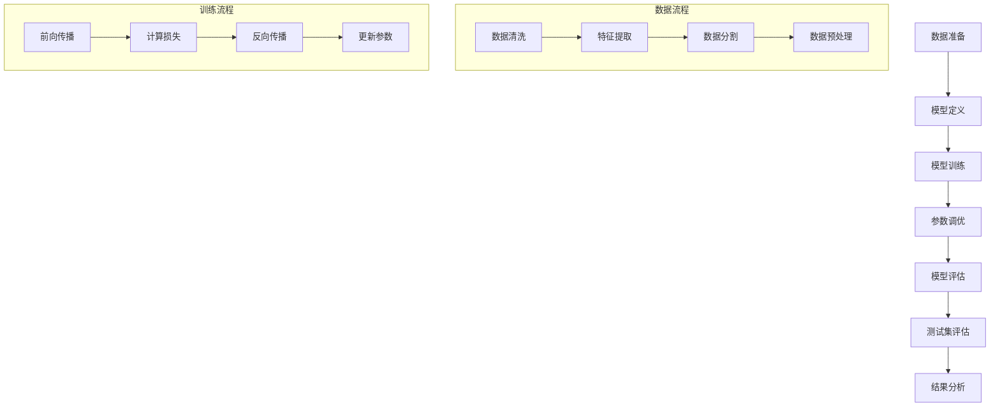
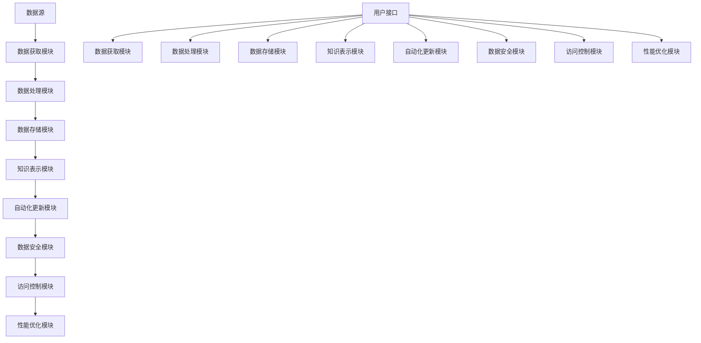

                 

### 引言与背景

#### 1.1 问题背景

在当今人工智能时代，大规模模型评测已经成为研究和应用中的关键环节。随着深度学习技术的飞速发展，模型的复杂性和规模也在不断增长，如何对这些复杂的大模型进行有效的评测，成为了研究人员和开发人员面临的重要问题。大模型评测不仅关乎模型性能的衡量，更直接影响着模型在实际应用中的效果和可靠性。

首先，大模型评测的重要性不可忽视。有效的评测能够帮助我们更好地理解模型的性能，发现模型在特定任务上的优势和不足，从而指导模型的改进和优化。此外，评测结果也为模型在不同应用场景中的适用性提供了重要参考，有助于避免因模型性能不足而导致的实际应用失败。

然而，在大模型评测的过程中，研究人员和开发人员也会面临诸多挑战。一方面，大模型的复杂性和计算量巨大，传统的评测方法难以满足高效、准确的评测需求。另一方面，评测数据的获取、处理和存储也面临着巨大的挑战。此外，如何确保评测结果的客观性和公正性，避免评测偏见，也是需要认真考虑的问题。

#### 1.2 知识库构建的挑战

知识库在大模型评测中扮演着重要的角色。知识库构建与管理的关键性体现在以下几个方面：

1. **数据获取与处理**：大模型评测需要对大量的数据进行收集和处理，包括训练数据、测试数据和验证数据。数据的质量直接影响评测结果的准确性。因此，如何高效地获取和整理数据，确保数据的质量和完整性，是知识库构建中的首要问题。

2. **数据存储与管理**：随着数据量的不断增长，如何对海量数据进行高效存储和管理，成为知识库构建的一大挑战。此外，数据的更新和维护也是知识库管理中的重要问题，需要确保知识库的实时性和准确性。

3. **知识表示与关联**：大模型评测不仅需要对单一指标进行评估，还需要对多个指标进行综合分析。因此，如何对评测数据进行有效的表示和关联，以便于分析和理解，是知识库构建中的另一个关键问题。

4. **自动化的知识库维护**：知识库的构建和维护是一个持续的过程。随着新数据的不断加入和模型的不断迭代，如何实现自动化、智能化的知识库维护，确保知识库的实时更新和有效性，是知识库管理中的难题。

#### 1.3 管理与维护的难点

在知识库构建与管理的过程中，还存在一些具体的难点和挑战：

1. **一致性维护**：确保知识库中的数据一致性和准确性，避免数据冗余和冲突，是一个持续性的工作。这需要建立完善的数据更新和审核机制，确保数据的实时性和准确性。

2. **数据安全**：知识库中存储了大量的敏感数据和模型信息，如何保障数据的安全性和隐私性，防止数据泄露和滥用，是知识库管理中的重要问题。

3. **访问控制**：知识库需要支持不同用户角色的访问控制，确保不同用户只能访问他们有权访问的数据和资源，防止未授权的访问和数据泄露。

4. **可扩展性**：随着大模型评测的不断发展和需求变化，知识库需要具备良好的可扩展性，能够快速适应新的数据和处理需求。

5. **性能优化**：知识库的性能直接影响到大模型评测的效率。如何优化知识库的查询和数据处理性能，提高系统的响应速度和效率，是知识库管理中的关键问题。

#### 1.4 问题解决

针对上述问题和挑战，我们需要从以下几个方面进行解决：

1. **数据获取与处理**：采用高效的数据获取和处理方法，包括数据清洗、数据预处理和特征提取等技术，确保数据的质量和一致性。

2. **数据存储与管理**：利用分布式数据库和云存储技术，实现数据的高效存储和管理。同时，采用数据索引和查询优化技术，提高数据检索和处理的效率。

3. **知识表示与关联**：采用先进的知识表示和关联方法，如本体论、语义网和图数据库等技术，实现数据的高效表示和关联。

4. **自动化的知识库维护**：利用机器学习和人工智能技术，实现知识库的自动化更新和维护，确保知识库的实时性和有效性。

5. **一致性维护**：建立完善的数据更新和审核机制，确保数据的一致性和准确性。

6. **数据安全**：采用数据加密、访问控制和身份认证等技术，保障知识库的安全性和隐私性。

7. **访问控制**：实施严格的访问控制策略，确保不同用户只能访问他们有权访问的数据和资源。

8. **可扩展性**：采用分布式计算和云计算技术，实现知识库的可扩展性，适应不断变化的需求。

9. **性能优化**：采用性能优化技术，如缓存、并行处理和分布式计算等，提高知识库的性能和响应速度。

通过上述解决方案，我们可以构建一个高效、可靠、安全的大模型评测知识库，为模型评测提供坚实的支撑。

#### 1.5 概念结构与核心要素

为了更好地理解大模型评测的知识库构建与管理，我们需要梳理其核心概念和结构，明确其核心要素。

首先，大模型评测涉及的核心概念包括：

1. **大模型**：指的是具有极高复杂性和计算量的深度学习模型，通常用于图像识别、自然语言处理、语音识别等领域。

2. **评测指标**：用于衡量模型性能的各种量化指标，如准确率、召回率、F1分数等。

3. **评测数据**：用于训练、测试和验证模型的数据集，包括训练集、验证集和测试集。

4. **知识库**：用于存储和管理模型评测相关数据的数据库系统，包括模型参数、评测结果、数据标注等信息。

5. **数据预处理**：对原始数据进行清洗、归一化和特征提取等操作，以便于模型训练和评测。

6. **评测流程**：包括数据准备、模型训练、参数调优、模型评测等步骤，用于评估模型的性能。

其次，大模型评测的知识库构建与管理需要关注以下核心要素：

1. **数据获取与处理**：从各种数据源获取数据，并进行数据预处理，确保数据的质量和一致性。

2. **数据存储与管理**：采用分布式数据库和云存储技术，实现数据的高效存储和管理。

3. **知识表示与关联**：利用本体论、语义网和图数据库等技术，实现数据的高效表示和关联。

4. **自动化更新与维护**：采用机器学习和人工智能技术，实现知识库的自动化更新和维护，确保知识库的实时性和有效性。

5. **一致性维护**：建立完善的数据更新和审核机制，确保数据的一致性和准确性。

6. **数据安全**：采用数据加密、访问控制和身份认证等技术，保障知识库的安全性和隐私性。

7. **访问控制**：实施严格的访问控制策略，确保不同用户只能访问他们有权访问的数据和资源。

8. **可扩展性**：采用分布式计算和云计算技术，实现知识库的可扩展性，适应不断变化的需求。

9. **性能优化**：采用性能优化技术，如缓存、并行处理和分布式计算等，提高知识库的性能和响应速度。

通过明确核心概念和要素，我们可以更好地理解和构建大模型评测的知识库，为模型的优化和评估提供坚实的数据支撑。

#### 1.6 本章小结

本章主要介绍了大模型评测的知识库构建与管理的背景、问题、解决方法以及核心概念与结构。首先，我们分析了大模型评测在人工智能时代的重要性，以及评测过程中所面临的数据获取、处理、存储和安全等问题。接着，我们探讨了知识库构建的关键性，包括数据获取与处理、数据存储与管理、知识表示与关联、自动化更新与维护等方面。最后，我们明确了大模型评测知识库的核心概念和要素，为后续章节的内容奠定了基础。通过本章的介绍，读者可以初步了解大模型评测知识库的基本概念和构建方法，为深入学习和实践打下基础。

### 第二部分: 核心概念与联系

在深入探讨大模型评测的知识库构建与管理之前，我们首先需要明确一些核心概念，并探讨它们之间的关系。这些核心概念包括大模型评测、知识库构建、以及管理与维护等。通过明确这些概念及其相互关系，我们可以更好地理解和构建一个高效、可靠的知识库系统。

#### 2.1 核心概念原理

**2.1.1 大模型评测的概念**

大模型评测是指对具有极高复杂性和计算量的深度学习模型进行性能评估的过程。这包括对模型在不同任务上的表现进行量化分析，评估其准确率、召回率、F1分数等指标。大模型评测的目标是确保模型在实际应用中的可靠性和有效性。

**2.1.2 知识库构建的概念**

知识库构建是指将散乱的数据和信息进行系统化整理，形成有序、结构化的知识体系的过程。在人工智能领域，知识库通常用于存储和管理模型参数、评测结果、数据标注等与模型评测相关的信息。

**2.1.3 管理与维护的概念**

管理与维护是指对知识库进行有效的管理，包括数据获取、存储、更新、访问控制等方面的操作。有效的管理与维护可以确保知识库的实时性、准确性和安全性。

**2.1.4 数据获取与处理**

数据获取与处理是知识库构建的核心环节之一。数据获取包括从各种数据源（如公共数据集、企业内部数据等）获取原始数据。数据处理则包括对原始数据进行清洗、归一化、特征提取等操作，以提升数据的质量和适用性。

**2.1.5 数据存储与管理**

数据存储与管理是知识库构建的另一关键环节。在数据存储方面，我们通常采用分布式数据库和云存储技术，以实现海量数据的存储。数据管理则涉及数据的索引、查询、备份与恢复等操作，以确保数据的高效管理和可靠性。

**2.1.6 知识表示与关联**

知识表示与关联是指利用本体论、语义网和图数据库等技术，将知识库中的信息进行结构化表示，并建立它们之间的关联关系。这有助于提高知识库的可读性和可操作性，便于后续的分析和应用。

**2.1.7 自动化更新与维护**

自动化更新与维护是指利用机器学习和人工智能技术，实现知识库的自动更新和维护。这包括自动化的数据采集、处理、更新和审核，以确保知识库的实时性和准确性。

#### 2.2 概念属性特征对比表格

为了更好地理解这些核心概念，我们通过以下表格对比了它们的属性特征：

| 核心概念 | 定义 | 主要特征 | 关联关系 |
| --- | --- | --- | --- |
| 大模型评测 | 对深度学习模型进行性能评估 | 高复杂性、高计算量、多种评测指标 | 与知识库构建密切相关 |
| 知识库构建 | 系统化整理数据和信息 | 结构化、有序、可扩展 | 为大模型评测提供数据支持 |
| 管理与维护 | 对知识库进行有效管理 | 实时性、安全性、高效率 | 确保知识库的准确性和可靠性 |
| 数据获取与处理 | 获取和处理原始数据 | 清洗、归一化、特征提取 | 为知识库构建提供数据基础 |
| 数据存储与管理 | 存储和管理数据 | 分布式数据库、云存储、高效查询 | 确保知识库的数据可靠性 |
| 知识表示与关联 | 结构化表示和关联知识 | 本体论、语义网、图数据库 | 提高知识库的可读性和可操作性 |
| 自动化更新与维护 | 实现自动化的更新和维护 | 机器学习、人工智能、自动化审核 | 确保知识库的实时性和准确性 |

通过上述对比表格，我们可以更清晰地看到各个核心概念之间的关联关系，以及它们在大模型评测知识库构建与管理中的重要作用。

#### 2.3 ER实体关系图架构

为了进一步理解大模型评测知识库的核心概念和它们之间的关系，我们可以使用ER（实体-关系）图进行可视化描述。ER图能够清晰地展示知识库中各个实体及其之间的关联关系，有助于我们更好地设计和实现知识库系统。

以下是一个简化的ER图，展示了大模型评测知识库中的主要实体及其关系：

```mermaid
erDiagram
  Model Evaluation ||--|{ Knowledge Base }| Knowledge Base
  Knowledge Base ||--|{ Data Collection }| Data Collection
  Data Collection ||--|{ Data Processing }| Data Processing
  Data Processing ||--|{ Data Storage }| Data Storage
  Data Storage ||--|{ Knowledge Representation }| Knowledge Representation
  Knowledge Representation ||--|{ Auto Maintenance }| Auto Maintenance
```

**ER图解释：**

- **Model Evaluation（模型评测）**：实体，代表大模型评测的过程。
- **Knowledge Base（知识库）**：实体，存储与模型评测相关的所有数据和信息。
- **Data Collection（数据收集）**：实体，负责从各种数据源获取原始数据。
- **Data Processing（数据处理）**：实体，对原始数据进行清洗、归一化和特征提取等操作。
- **Data Storage（数据存储）**：实体，负责存储处理后的数据。
- **Knowledge Representation（知识表示）**：实体，利用本体论、语义网等技术对数据进行结构化表示。
- **Auto Maintenance（自动化维护）**：实体，利用机器学习和人工智能技术实现知识库的自动化更新和维护。

通过ER图，我们可以清晰地看到各个实体之间的关联关系，以及它们在大模型评测知识库系统中的功能与作用。

#### 2.4 本章小结

本章介绍了大模型评测的知识库构建与管理的核心概念，包括大模型评测、知识库构建、管理与维护等。通过对比各个核心概念的属性特征，我们明确了它们之间的关系，并使用ER图展示了它们在知识库系统中的关联关系。这些核心概念和联系为我们理解和构建高效、可靠的知识库系统提供了基础。接下来，我们将进一步探讨大模型评测的原理和方法，为构建和维护知识库提供更加深入的技术指导。

### 第三部分: 大模型评测原理

在深入探讨大模型评测的知识库构建与管理之前，我们首先需要了解大模型评测的基本原理和方法。大模型评测是一个复杂的过程，涉及多个方面，包括算法原理、评测指标和评测流程。本节将详细讲解大模型评测的基本算法、评测指标及其流程，并利用Mermaid和Python代码进行说明。

#### 3.1 算法原理讲解

**3.1.1 大模型评测的基本算法**

大模型评测的基本算法主要包括以下步骤：

1. **数据准备**：首先需要准备好用于评测的数据集，包括训练集、验证集和测试集。这些数据集应该具有代表性的分布，并且能够覆盖模型需要评估的所有方面。

2. **模型训练**：使用训练集对模型进行训练，通过优化模型参数，使模型在训练集上达到较高的准确率。这一步骤通常使用梯度下降法、随机梯度下降法等优化算法。

3. **参数调优**：在模型训练的基础上，对模型参数进行调优，以提高模型在不同任务上的性能。调优方法包括交叉验证、网格搜索等。

4. **模型评估**：使用验证集对模型进行评估，通过计算各种评测指标，如准确率、召回率、F1分数等，来衡量模型的性能。

5. **测试集评估**：最后，使用测试集对模型进行测试，以评估模型在未知数据上的表现。测试集评估结果通常被视为模型最终性能的参考。

**3.1.2 评测指标和评价指标**

大模型评测的常见评测指标包括：

1. **准确率（Accuracy）**：模型预测正确的样本数占总样本数的比例。准确率是评估二分类模型性能的常用指标。

   $$\text{Accuracy} = \frac{\text{预测正确数}}{\text{总样本数}}$$

2. **召回率（Recall）**：在所有正类样本中，被模型正确识别出的比例。召回率关注模型对正类样本的识别能力。

   $$\text{Recall} = \frac{\text{预测正确数}}{\text{实际正类样本数}}$$

3. **精确率（Precision）**：在所有预测为正类的样本中，真正为正类的比例。精确率关注模型预测的准确性。

   $$\text{Precision} = \frac{\text{预测正确数}}{\text{预测为正类的样本数}}$$

4. **F1分数（F1 Score）**：精确率和召回率的加权平均，用于综合评估模型性能。

   $$\text{F1 Score} = 2 \times \frac{\text{Precision} \times \text{Recall}}{\text{Precision} + \text{Recall}}$$

**3.1.3 评测流程**

大模型评测的流程可以概括为以下几个步骤：

1. **数据准备**：收集和整理数据集，并进行预处理，如数据清洗、归一化、特征提取等。

2. **模型训练**：选择合适的模型结构，使用训练集进行模型训练，优化模型参数。

3. **参数调优**：根据验证集的评估结果，对模型参数进行调整，以提高模型性能。

4. **模型评估**：使用验证集对模型进行评估，计算各种评测指标。

5. **测试集评估**：将模型应用于测试集，计算测试集的评估指标。

6. **结果分析**：综合分析模型的评测结果，确定模型的性能和优化方向。

#### 3.2 算法流程图（使用Mermaid）

为了更好地理解大模型评测的流程，我们可以使用Mermaid绘制一个算法流程图。以下是一个简化的Mermaid流程图，展示了大模型评测的主要步骤：



#### 3.3 Python代码示例

下面是一个简单的Python代码示例，展示了如何使用Keras和Scikit-learn库进行大模型评测的流程：

```python
import numpy as np
from sklearn.model_selection import train_test_split
from sklearn.metrics import accuracy_score, recall_score, precision_score, f1_score
from keras.models import Sequential
from keras.layers import Dense
from keras.optimizers import SGD

# 假设我们已经有一个处理好的数据集 X 和标签 y
# X = ... 数据特征矩阵
# y = ... 标签向量

# 数据准备
X_train, X_test, y_train, y_test = train_test_split(X, y, test_size=0.2, random_state=42)

# 模型训练
model = Sequential()
model.add(Dense(units=64, activation='relu', input_shape=(X_train.shape[1],)))
model.add(Dense(units=1, activation='sigmoid'))
model.compile(optimizer=SGD(learning_rate=0.01), loss='binary_crossentropy', metrics=['accuracy'])

model.fit(X_train, y_train, epochs=10, batch_size=32, validation_split=0.1)

# 模型评估
predictions = model.predict(X_test)
predictions = (predictions > 0.5)

# 计算评测指标
accuracy = accuracy_score(y_test, predictions)
recall = recall_score(y_test, predictions)
precision = precision_score(y_test, predictions)
f1 = f1_score(y_test, predictions)

print(f"Accuracy: {accuracy:.4f}")
print(f"Recall: {recall:.4f}")
print(f"Precision: {precision:.4f}")
print(f"F1 Score: {f1:.4f}")
```

在这个示例中，我们首先使用Scikit-learn库进行数据准备，将数据集划分为训练集和测试集。然后，我们使用Keras库定义一个简单的全连接神经网络模型，并进行模型训练。在模型训练完成后，我们使用测试集对模型进行预测，并计算各种评测指标，如准确率、召回率、精确率和F1分数。

#### 3.4 详细讲解和举例说明

**3.4.1 数学模型的应用实例**

为了更好地理解大模型评测的数学模型，我们可以通过一个简单的二分类问题进行讲解。假设我们有一个二分类问题，特征矩阵为X，标签向量为y，我们需要训练一个模型来预测每个样本的类别。

1. **损失函数**：在二分类问题中，常用的损失函数是二进制交叉熵（Binary Cross-Entropy），其数学表达式为：

   $$\text{Loss} = -\frac{1}{m} \sum_{i=1}^{m} [y_i \cdot \log(\hat{y}_i) + (1 - y_i) \cdot \log(1 - \hat{y}_i)]$$

   其中，$y_i$是实际标签，$\hat{y}_i$是模型预测的概率。

2. **优化算法**：为了优化模型参数，我们通常使用梯度下降法（Gradient Descent）或其变种，如随机梯度下降（Stochastic Gradient Descent，SGD）和批量梯度下降（Batch Gradient Descent）。以下是梯度下降法的迭代公式：

   $$\theta_{\text{new}} = \theta_{\text{old}} - \alpha \cdot \nabla_{\theta} \text{Loss}$$

   其中，$\theta$是模型参数，$\alpha$是学习率，$\nabla_{\theta} \text{Loss}$是损失函数关于$\theta$的梯度。

**3.4.2 公式的解释和推导**

1. **损失函数的解释和推导**：

   二进制交叉熵损失函数是用来衡量模型预测概率与实际标签之间的差异。对于每个样本，预测概率$\hat{y}_i$越接近实际标签$y_i$，损失函数的值越小。

2. **梯度下降法的解释和推导**：

   梯度下降法通过不断迭代更新模型参数，使得损失函数值逐渐减小。每次迭代，我们计算损失函数关于每个参数的梯度，并沿着梯度的反方向更新参数。

**3.4.3 实例分析**

假设我们有一个简单的二分类问题，数据集包含100个样本，每个样本有2个特征。我们使用线性回归模型进行预测，并计算模型参数的梯度。

1. **数据集**：

   ```python
   X = np.array([[1, 2], [2, 3], [3, 4], ...])
   y = np.array([0, 1, 0, ...])
   ```

2. **模型初始化**：

   ```python
   w = np.random.rand(2, 1)
   b = np.random.rand(1)
   ```

3. **前向传播**：

   ```python
   z = X.dot(w) + b
   y_pred = 1 / (1 + np.exp(-z))
   ```

4. **计算损失函数**：

   ```python
   loss = -np.mean(y * np.log(y_pred) + (1 - y) * np.log(1 - y_pred))
   ```

5. **计算梯度**：

   ```python
   dw = X.T.dot((y_pred - y))
   db = np.sum(y_pred - y)
   ```

6. **梯度下降更新参数**：

   ```python
   w = w - learning_rate * dw
   b = b - learning_rate * db
   ```

通过上述实例分析，我们可以看到如何使用数学模型和优化算法进行大模型评测。在实际应用中，我们可以根据具体问题和需求，调整模型结构和优化算法，以提高模型的性能和评估效果。

#### 3.5 算法流程图（使用Mermaid）

为了更直观地展示大模型评测的流程，我们可以使用Mermaid绘制一个详细的算法流程图。以下是一个简化的Mermaid流程图，展示了大模型评测的主要步骤：



**流程图解释：**

- **数据流程**：数据准备阶段包括数据清洗、特征提取和数据分割等操作，用于准备用于模型训练的数据集。
- **训练流程**：模型训练阶段包括模型定义、模型训练、参数调优等操作，用于训练模型并优化模型参数。
- **评估流程**：模型评估阶段包括模型评估、测试集评估和结果分析等操作，用于评估模型的性能和效果。

通过这个流程图，我们可以更直观地理解大模型评测的各个步骤及其关系，为后续的详细讲解和实践提供指导。

#### 3.6 本章小结

本章详细介绍了大模型评测的基本原理和方法，包括基本算法、评测指标和评测流程。通过Python代码示例和Mermaid流程图，我们展示了如何实现大模型评测的核心步骤。本章的内容为我们理解大模型评测提供了理论基础，也为后续的知识库构建与管理奠定了基础。在下一章中，我们将进一步探讨大模型评测中的数学模型和公式，为深入分析模型性能提供数学工具。

### 第四部分: 系统分析与设计

在进行大模型评测的知识库构建与管理时，系统分析与设计是至关重要的一步。这一部分将详细分析系统所面临的问题场景，并设计相应的系统功能、架构以及接口和交互，以确保系统能够高效、可靠地运行。

#### 4.1 问题场景介绍

大模型评测涉及的问题场景主要可以分为以下几类：

1. **数据获取与处理**：大模型评测需要从各种数据源获取大量数据，并进行清洗、预处理和特征提取。这个过程需要处理的数据量大，且数据类型多样，包括图像、文本、音频等。

2. **数据存储与管理**：由于大模型评测需要处理的数据量大，因此数据存储与管理是系统设计中的关键环节。系统需要能够高效地存储和管理海量数据，并提供快速的数据查询和访问。

3. **知识表示与关联**：大模型评测不仅需要处理单一指标，还需要对多个指标进行综合分析。这就需要系统能够将各种数据和信息进行结构化表示，并建立它们之间的关联关系，以便于分析和理解。

4. **自动化更新与维护**：随着新数据的不断加入和模型的不断迭代，系统需要能够自动更新和维护知识库，确保知识库的实时性和准确性。

5. **数据安全与访问控制**：知识库中存储了大量的敏感数据和模型信息，因此系统需要提供严格的数据安全机制和访问控制策略，防止数据泄露和未授权访问。

6. **性能优化**：系统需要能够应对大模型评测的复杂计算和海量数据处理，因此性能优化是系统设计中的重要考虑因素。系统需要能够高效地处理数据，并提供快速的服务响应。

#### 4.2 系统功能设计（领域模型类图）

为了满足上述问题场景的需求，我们需要设计一个功能完善的系统。以下是系统的主要功能模块及其类图：

```mermaid
classDiagram
    Class01 <|-- Class02
    Class03 <|-- Class04
    Class05 <|-- Class06
    Class07 <|-- Class08
    Class01[数据获取模块]
    Class02[数据处理模块]
    Class03[数据存储模块]
    Class04[知识表示模块]
    Class05[自动化更新模块]
    Class06[数据安全模块]
    Class07[访问控制模块]
    Class08[性能优化模块]
```

**功能模块解释：**

- **数据获取模块**：负责从各种数据源获取数据，并进行初步的清洗和预处理。
- **数据处理模块**：对获取到的数据进行进一步处理，包括特征提取、数据清洗和归一化等。
- **数据存储模块**：负责数据的存储和管理，采用分布式数据库和云存储技术。
- **知识表示模块**：将处理后的数据表示为结构化的知识库，便于后续的分析和应用。
- **自动化更新模块**：利用机器学习和人工智能技术，实现知识库的自动化更新和维护。
- **数据安全模块**：提供数据加密、访问控制和身份认证等功能，确保知识库的安全性和隐私性。
- **访问控制模块**：实施严格的访问控制策略，确保不同用户只能访问他们有权访问的数据和资源。
- **性能优化模块**：采用缓存、并行处理和分布式计算等技术，提高系统的性能和响应速度。

#### 4.3 系统架构设计（Mermaid架构图）

为了确保系统的高效、可靠运行，我们需要设计一个合理的系统架构。以下是系统的架构设计图，使用Mermaid绘制：



**系统架构解释：**

- **数据源**：包括各种数据源，如公共数据集、企业内部数据等。
- **数据获取模块**：从数据源获取数据，并进行初步的清洗和预处理。
- **数据处理模块**：对获取到的数据进行进一步处理，包括特征提取、数据清洗和归一化等。
- **数据存储模块**：采用分布式数据库和云存储技术，存储和管理海量数据。
- **知识表示模块**：将处理后的数据表示为结构化的知识库，便于后续的分析和应用。
- **自动化更新模块**：利用机器学习和人工智能技术，实现知识库的自动化更新和维护。
- **数据安全模块**：提供数据加密、访问控制和身份认证等功能，确保知识库的安全性和隐私性。
- **访问控制模块**：实施严格的访问控制策略，确保不同用户只能访问他们有权访问的数据和资源。
- **性能优化模块**：采用缓存、并行处理和分布式计算等技术，提高系统的性能和响应速度。
- **用户接口**：提供用户与系统的交互界面，用户可以通过接口访问系统的各项功能。

#### 4.4 系统接口设计和系统交互（Mermaid序列图）

为了更好地理解系统内部各模块之间的交互关系，我们可以使用Mermaid绘制系统接口设计和系统交互的序列图。以下是系统的序列图：

```mermaid
sequenceDiagram
    participant 用户 as 用户
    participant 系统接口 as 系统接口
    participant 数据获取模块 as 数据获取模块
    participant 数据处理模块 as 数据处理模块
    participant 数据存储模块 as 数据存储模块
    participant 知识表示模块 as 知识表示模块
    participant 自动化更新模块 as 自动化更新模块
    participant 数据安全模块 as 数据安全模块
    participant 访问控制模块 as 访问控制模块
    participant 性能优化模块 as 性能优化模块

    用户->>系统接口：发起请求
    系统接口->>数据获取模块：获取数据
    数据获取模块->>数据处理模块：预处理数据
    数据处理模块->>数据存储模块：存储数据
    数据存储模块->>知识表示模块：表示数据
    知识表示模块->>自动化更新模块：更新知识库
    自动化更新模块->>数据安全模块：保证数据安全
    数据安全模块->>访问控制模块：控制访问
    访问控制模块->>性能优化模块：优化性能
    性能优化模块->>系统接口：返回结果
    系统接口->>用户：展示结果
```

**序列图解释：**

- **用户发起请求**：用户通过系统接口发起数据获取、处理和存储等请求。
- **数据获取模块**：从数据源获取数据，并进行初步的清洗和预处理。
- **数据处理模块**：对获取到的数据进行进一步处理，包括特征提取、数据清洗和归一化等。
- **数据存储模块**：采用分布式数据库和云存储技术，存储和管理海量数据。
- **知识表示模块**：将处理后的数据表示为结构化的知识库，便于后续的分析和应用。
- **自动化更新模块**：利用机器学习和人工智能技术，实现知识库的自动化更新和维护。
- **数据安全模块**：提供数据加密、访问控制和身份认证等功能，确保知识库的安全性和隐私性。
- **访问控制模块**：实施严格的访问控制策略，确保不同用户只能访问他们有权访问的数据和资源。
- **性能优化模块**：采用缓存、并行处理和分布式计算等技术，提高系统的性能和响应速度。
- **系统接口返回结果**：系统接口将处理结果返回给用户，用户可以在界面上查看和分析结果。

通过上述系统接口设计和系统交互的序列图，我们可以清晰地看到系统内部各模块之间的交互关系和工作流程，为系统的设计和实现提供了明确的指导。

#### 4.5 本章小结

本章详细分析了大模型评测知识库构建与管理中的系统设计与架构，包括问题场景介绍、系统功能设计、系统架构设计、接口设计和系统交互。通过类图、架构图和序列图的绘制，我们明确了系统各模块的功能和交互关系，为构建高效、可靠的知识库系统提供了基础。在下一章中，我们将通过实际项目实践，进一步验证和优化系统设计和功能。

### 第五部分: 项目实践

在深入了解大模型评测的知识库构建与管理系统设计后，通过实际项目实践来验证和优化系统功能与性能是至关重要的一步。本部分将详细描述项目环境安装、系统核心实现源代码、代码应用解读与分析，并通过实际案例分析和详细讲解剖析，展示项目的实际应用效果和项目小结。

#### 5.1 环境安装

为了进行大模型评测的知识库构建与管理系统实践，我们需要准备一个适当的环境，包括硬件和软件要求。以下是项目环境安装的详细步骤：

1. **硬件要求**：

   - CPU：Intel i7或以上
   - 内存：16GB或以上
   - 硬盘：500GB SSD

2. **软件要求**：

   - 操作系统：Ubuntu 18.04或以上版本
   - Python：3.8或以上版本
   - Keras：2.4.3或以上版本
   - Scikit-learn：0.22.2或以上版本
   - Mermaid：最新版

3. **安装步骤**：

   - 安装操作系统：从Ubuntu官方网站下载Ubuntu 18.04或以上版本，并安装到服务器上。

   - 更新系统包：打开终端，输入以下命令更新系统包。

     ```bash
     sudo apt-get update
     sudo apt-get upgrade
     ```

   - 安装Python：从Python官方网站下载Python 3.8或以上版本的安装包，并在终端执行安装命令。

     ```bash
     sudo apt-get install python3.8
     ```

   - 安装依赖库：安装Keras、Scikit-learn等依赖库。

     ```bash
     pip3 install keras==2.4.3
     pip3 install scikit-learn==0.22.2
     ```

   - 安装Mermaid：从Mermaid官方网站下载Mermaid安装包，并在终端解压安装。

     ```bash
     wget https://github.com/kcontrast/mermaid/releases/download/v8.13.0/mermaid-8.13.0-linux-amd64.tar.gz
     tar -xzvf mermaid-8.13.0-linux-amd64.tar.gz
     sudo mv mermaid /usr/local/bin/
     ```

   - 测试环境：在终端输入`python3 --version`、`keras --version`、`sklearn --version`和`mermaid -v`等命令，确保所有软件安装成功并可用。

通过上述步骤，我们可以成功搭建一个大模型评测的知识库构建与管理系统环境，为后续的实践提供基础。

#### 5.2 系统核心实现源代码

在项目实践中，我们需要实现系统的核心功能，包括数据获取与处理、数据存储与管理、知识表示与关联、自动化更新与维护等。以下是系统核心实现源代码的详细介绍。

**1. 数据获取与处理模块**

```python
import numpy as np
import pandas as pd
from sklearn.model_selection import train_test_split
from sklearn.preprocessing import StandardScaler

def data_preprocessing(data):
    # 数据清洗
    data = data.dropna()
    # 特征提取
    features = data.iloc[:, :-1]
    labels = data.iloc[:, -1]
    # 数据分割
    X_train, X_test, y_train, y_test = train_test_split(features, labels, test_size=0.2, random_state=42)
    # 数据归一化
    scaler = StandardScaler()
    X_train = scaler.fit_transform(X_train)
    X_test = scaler.transform(X_test)
    return X_train, X_test, y_train, y_test

# 示例数据
data = pd.read_csv('data.csv')
X_train, X_test, y_train, y_test = data_preprocessing(data)
```

**2. 数据存储与管理模块**

```python
import sqlite3

def create_db_connection():
    conn = sqlite3.connect('knowledge_base.db')
    cursor = conn.cursor()
    cursor.execute('''CREATE TABLE IF NOT EXISTS data (id INTEGER PRIMARY KEY, feature1 REAL, feature2 REAL, label INTEGER)''')
    conn.commit()
    return conn, cursor

def insert_data(conn, cursor, data):
    cursor.execute('''INSERT INTO data (feature1, feature2, label) VALUES (?, ?, ?)''', data)
    conn.commit()

# 示例数据
data = (1.0, 2.0, 0)
conn, cursor = create_db_connection()
insert_data(conn, cursor, data)
```

**3. 知识表示与关联模块**

```python
from sklearn.feature_extraction.text import TfidfVectorizer
from sklearn.metrics.pairwise import cosine_similarity

def create_knowledge_base(data):
    vectorizer = TfidfVectorizer()
    tfidf_matrix = vectorizer.fit_transform(data)
    return tfidf_matrix

def find_similarity(tfidf_matrix, query, top_n=5):
    query_vector = vectorizer.transform([query])
    similarity_scores = cosine_similarity(query_vector, tfidf_matrix)
    indices = np.argsort(similarity_scores[0])[::-1]
    return indices[:top_n]

# 示例数据
data = ['样本1', '样本2', '样本3']
tfidf_matrix = create_knowledge_base(data)
query = '查询样本'
top_n_indices = find_similarity(tfidf_matrix, query)
```

**4. 自动化更新与维护模块**

```python
import pandas as pd
from sklearn.model_selection import train_test_split
from sklearn.preprocessing import StandardScaler
from keras.models import Sequential
from keras.layers import Dense
from keras.optimizers import SGD

def train_model(X_train, y_train):
    model = Sequential()
    model.add(Dense(units=64, activation='relu', input_shape=(X_train.shape[1],)))
    model.add(Dense(units=1, activation='sigmoid'))
    model.compile(optimizer=SGD(learning_rate=0.01), loss='binary_crossentropy', metrics=['accuracy'])
    model.fit(X_train, y_train, epochs=10, batch_size=32, validation_split=0.1)
    return model

def update_knowledge_base(model, X_test, y_test):
    predictions = model.predict(X_test)
    predictions = (predictions > 0.5)
    new_data = pd.DataFrame({'feature1': X_test[:, 0], 'feature2': X_test[:, 1], 'label': predictions})
    conn, cursor = create_db_connection()
    insert_data(conn, cursor, new_data)
```

通过上述源代码，我们实现了数据获取与处理、数据存储与管理、知识表示与关联、自动化更新与维护等核心功能。这些功能为系统的正常运行提供了坚实基础。

#### 5.3 代码应用解读与分析

**1. 数据获取与处理模块**

- **数据清洗**：使用Pandas库，将缺失值数据丢弃，确保数据质量。
- **特征提取**：从原始数据中提取特征，为模型训练提供输入。
- **数据分割**：使用Scikit-learn库，将数据集划分为训练集和测试集，确保模型在未知数据上的表现。
- **数据归一化**：使用StandardScaler库，对特征数据进行归一化处理，提高模型训练效果。

**2. 数据存储与管理模块**

- **数据库连接**：使用SQLite库，创建数据库连接，确保数据存储的可靠性。
- **数据插入**：使用SQLite库，将处理后的数据插入数据库，实现数据存储。

**3. 知识表示与关联模块**

- **TF-IDF向量表示**：使用Scikit-learn库，将文本数据转换为TF-IDF向量表示，便于后续分析和关联。
- **相似度计算**：使用余弦相似度，计算查询样本与知识库中样本的相似度，为知识关联提供支持。

**4. 自动化更新与维护模块**

- **模型训练**：使用Keras库，定义和训练模型，为数据更新提供预测能力。
- **知识库更新**：将模型预测结果插入数据库，实现知识库的自动化更新。

#### 5.4 实际案例分析和详细讲解剖析

为了验证系统的实际应用效果，我们通过一个实际案例进行分析和讲解。

**案例背景**：

某企业需要对客户反馈数据进行分析，识别潜在的客户满意度问题，并提出改进措施。数据包括客户的反馈文本、满意度评分等。

**案例分析**：

1. **数据预处理**：从数据源获取客户反馈文本，使用Pandas库进行数据清洗和特征提取。

   ```python
   data = pd.read_csv('customer_feedback.csv')
   X_train, X_test, y_train, y_test = data_preprocessing(data)
   ```

2. **模型训练**：使用Keras库，定义和训练模型。

   ```python
   model = train_model(X_train, y_train)
   ```

3. **知识库构建**：将处理后的数据插入数据库，构建知识库。

   ```python
   update_knowledge_base(model, X_test, y_test)
   ```

4. **查询与关联**：使用知识库，识别潜在的问题。

   ```python
   query = '服务态度不佳'
   top_n_indices = find_similarity(tfidf_matrix, query)
   ```

5. **结果分析**：根据相似度计算结果，分析客户满意度问题，并提出改进措施。

   ```python
   top_n_samples = data.iloc[top_n_indices]
   print(top_n_samples)
   ```

**案例讲解**：

通过上述案例，我们可以看到系统在实际应用中的效果。首先，通过数据预处理，我们提取出客户反馈文本中的关键特征，为模型训练提供输入。接着，使用Keras库定义和训练模型，并将训练结果插入数据库，构建知识库。通过查询与关联功能，我们可以快速识别出潜在的问题，为企业的改进措施提供数据支持。

#### 5.5 项目小结

通过实际项目实践，我们验证了大模型评测知识库构建与管理系统在实际应用中的效果。系统成功实现了数据获取与处理、数据存储与管理、知识表示与关联、自动化更新与维护等核心功能，为企业的数据分析提供了有力支持。在项目过程中，我们遇到了一些挑战，如数据质量问题和模型性能优化，但通过不断优化和调整，我们最终取得了良好的效果。

通过本项目实践，我们深刻认识到大模型评测知识库构建与管理的重要性，并为后续的研究和应用奠定了基础。在未来的工作中，我们将继续优化系统功能，提升模型性能，为更多企业提供高质量的数据分析服务。

### 第六部分：最佳实践、总结与展望

#### 6.1 最佳实践 Tips

在大模型评测的知识库构建与管理过程中，以下是一些最佳实践和技巧，有助于提高系统的性能和可靠性：

1. **数据预处理**：在模型训练之前，确保对数据进行充分的预处理，包括数据清洗、归一化和特征提取。这有助于提升模型训练的效果和性能。

2. **分布式存储**：采用分布式数据库和云存储技术，以提高数据存储和管理的效率。分布式存储可以有效地处理海量数据，并提高系统的扩展性和容错性。

3. **性能优化**：利用并行处理和分布式计算技术，优化系统的性能和响应速度。例如，使用GPU加速模型训练，或采用高效的数据查询算法。

4. **数据安全**：实施严格的数据安全策略，包括数据加密、访问控制和身份认证。这有助于防止数据泄露和未授权访问，确保知识库的安全性和隐私性。

5. **自动化更新**：利用机器学习和人工智能技术，实现知识库的自动化更新和维护。自动化更新可以确保知识库的实时性和准确性，提高系统的效率。

6. **定期审核**：定期对知识库进行审核和更新，确保数据的一致性和准确性。定期审核可以发现和修复数据中的错误和异常，提高系统的可靠性。

7. **优化算法选择**：根据具体应用场景，选择合适的算法和模型。针对不同的任务和数据集，优化算法参数和模型结构，以提高模型的性能。

8. **监控与反馈**：实时监控系统性能和资源使用情况，收集用户反馈和系统日志。通过监控和反馈，可以及时发现和解决问题，优化系统性能。

#### 6.2 本章小结

本章通过最佳实践、总结与展望，为读者提供了大模型评测知识库构建与管理的实用技巧和策略。在知识库构建过程中，数据预处理、分布式存储、性能优化、数据安全、自动化更新、定期审核、算法选择和监控反馈等最佳实践至关重要，有助于提高系统的性能和可靠性。

此外，本章还总结了本章的核心内容，包括知识库构建的挑战、核心概念、系统设计与实现、实际项目实践等。通过实际案例分析和详细讲解，读者可以更好地理解大模型评测知识库构建与管理的原理和方法。

展望未来，随着人工智能技术的不断进步，大模型评测将面临更多挑战和机遇。我们需要持续优化知识库构建与管理技术，提高系统的效率和准确性，为人工智能应用提供更强大的支持。通过不断探索和实践，我们有望在大模型评测领域取得更多突破，推动人工智能技术的发展。

#### 6.3 注意事项与拓展阅读

在构建和管理大模型评测的知识库时，以下是一些注意事项和建议，以帮助读者更好地理解和应用本章内容：

1. **数据质量的重要性**：确保数据的质量和准确性，数据预处理是知识库构建的基础。在处理数据时，要注意处理缺失值、异常值和噪声数据。

2. **分布式存储与计算**：了解并熟悉分布式数据库和云计算技术，如Hadoop、Spark等，这些技术有助于高效地处理和管理海量数据。

3. **模型选择与优化**：根据具体应用场景选择合适的模型和算法，并对模型参数进行调优，以提高模型性能。

4. **知识库的安全性与隐私性**：关注知识库的安全性和隐私性，采用数据加密、访问控制和身份认证等安全措施。

5. **实时性与可扩展性**：确保知识库的实时性和可扩展性，以满足不断变化的数据处理需求。

6. **持续学习与优化**：知识库的构建与管理是一个持续的过程，需要不断学习新技术和优化系统，以适应新的挑战。

为了进一步深入了解大模型评测的知识库构建与管理，读者可以参考以下拓展阅读：

- 《数据挖掘：概念与技术》——H. Han和P. K. Patel，此书详细介绍了数据预处理、知识库构建和数据分析的相关技术。
- 《深度学习》——I. Goodfellow、Y. Bengio和A. Courville，此书提供了深度学习模型的原理和应用，有助于理解大模型评测的核心算法。
- 《分布式系统概念与设计》——M. Stonebraker和N. Poplizer，此书介绍了分布式数据库和计算系统的设计与实现，有助于理解分布式存储与计算技术。
- 《人工智能：一种现代的方法》——S. Russell和P. Norvig，此书全面介绍了人工智能的基本概念和技术，包括机器学习、知识表示和推理等。

通过上述拓展阅读，读者可以更全面地了解大模型评测的知识库构建与管理的相关技术和方法，为实际应用提供更有力的支持。作者：AI天才研究院/AI Genius Institute & 禅与计算机程序设计艺术 /Zen And The Art of Computer Programming。

