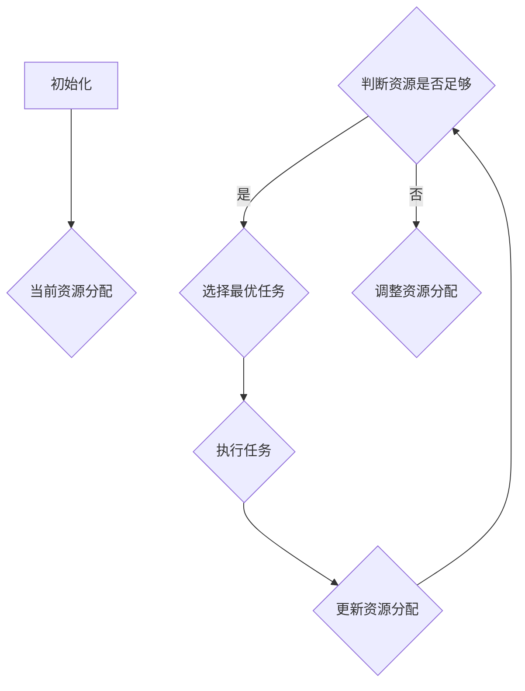
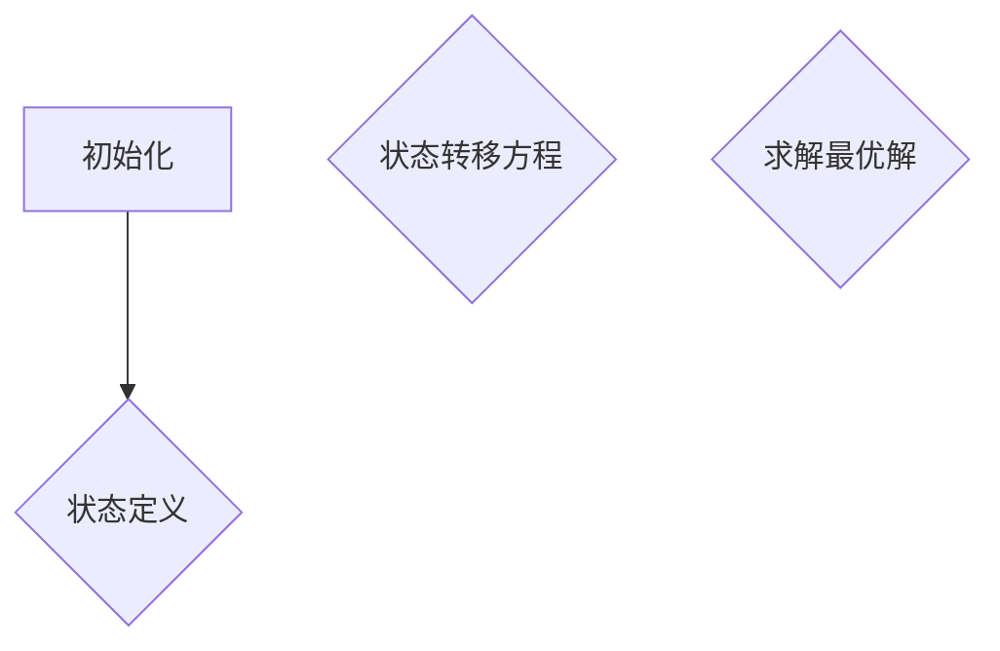
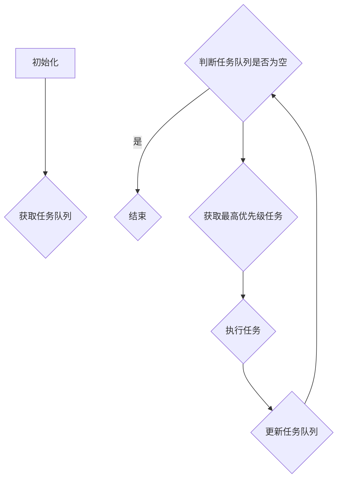
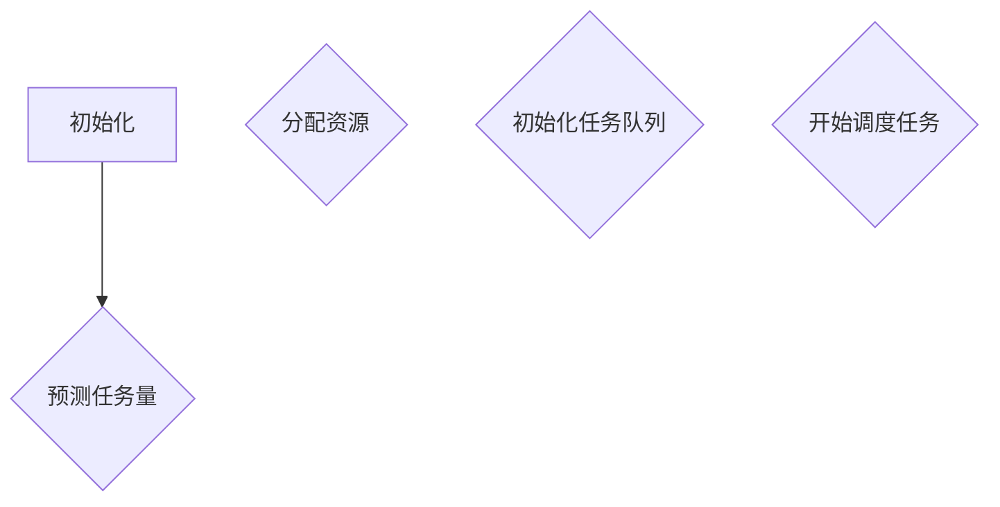
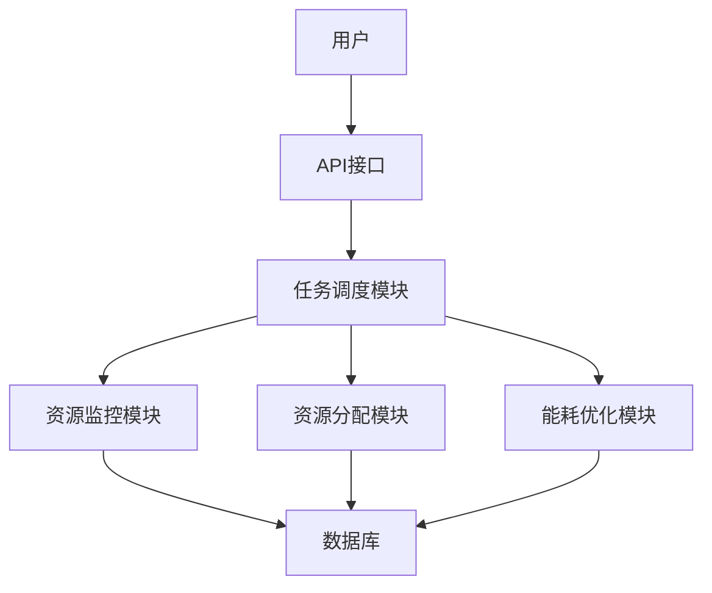
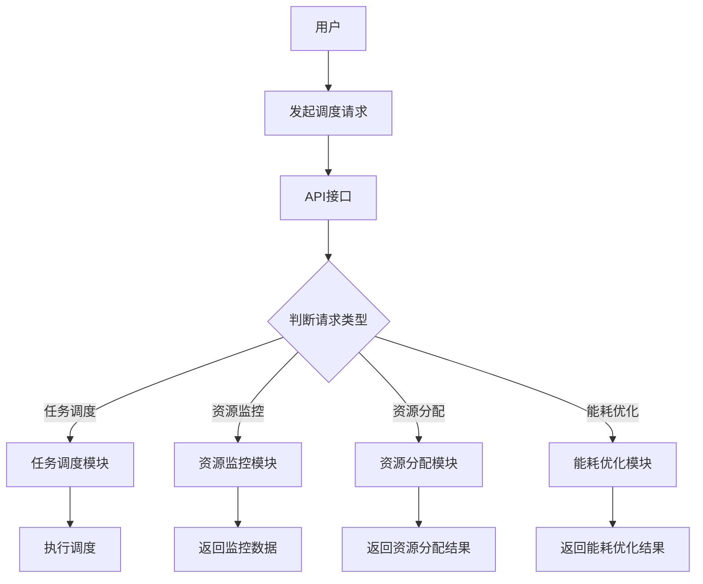

                 

# 大模型评测的资源调度与优化

## 关键词
- 大模型
- 资源调度
- 优化
- 贪心算法
- 动态规划
- 调度策略

## 摘要
本文旨在探讨大规模模型评测中的资源调度与优化问题。通过详细分析大模型的特点、资源调度算法和优化策略，本文提出了一系列有效的解决方案，旨在提高资源利用率和系统性能，降低能耗，实现绿色计算。文章结构分为三个部分：背景介绍、核心概念与联系以及算法原理讲解。

## 第一部分：背景介绍

### 1.1 问题背景
随着人工智能技术的发展，大规模模型（简称大模型）在自然语言处理、图像识别、推荐系统等领域取得了显著的突破。然而，大模型的高计算资源消耗和复杂调度问题使得其在实际应用中面临诸多挑战。因此，如何对大模型进行有效的资源调度与优化，成为当前研究的热点问题。

#### 1.1.1 大模型的特点
大模型通常具有以下特点：
1. **参数规模庞大**：大模型包含数十亿至千亿个参数，对计算资源和存储资源的需求极高。
2. **高效性**：大模型能够通过学习大量数据，实现对复杂任务的泛化能力，提高任务执行效率。
3. **对数据质量要求高**：大模型对数据质量有较高要求，数据集的质量直接影响模型的性能。

#### 1.1.2 资源调度的重要性
在大模型应用过程中，资源调度具有至关重要的作用：
1. **资源分配不均衡**：大模型训练和推理任务对计算资源的需求巨大，如何合理分配资源，保证任务的高效完成，是一个重要问题。
2. **调度效率低下**：大模型任务通常具有高延迟和强实时性要求，如何快速响应并调度任务，提高系统性能，是优化目标。
3. **能耗优化**：大模型训练和推理过程中，计算资源的消耗巨大，如何降低能耗，实现绿色计算，是当前的另一个重要挑战。

### 1.2 问题描述
在大模型应用过程中，主要面临以下问题：

#### 1.2.1 资源分配不均
- **问题**：大模型训练和推理任务对计算资源的需求巨大，但现有资源分配策略往往导致资源利用率不高，部分资源长期闲置，而某些关键任务又无法及时获得所需资源。
- **影响**：资源利用率低会导致系统性能下降，任务完成时间延长，影响用户体验。

#### 1.2.2 调度效率低下
- **问题**：大模型任务通常具有高延迟和强实时性要求，但现有调度算法响应速度慢，导致任务排队时间过长，影响系统整体性能。
- **影响**：调度效率低下会导致系统响应时间延长，降低用户体验，影响业务连续性。

#### 1.2.3 能耗优化挑战
- **问题**：大模型训练和推理过程中，计算资源的消耗巨大，如何降低能耗，实现绿色计算，是当前的另一个重要挑战。
- **影响**：能耗优化不足会导致资源浪费，增加运营成本，同时可能对环境造成负面影响。

### 1.3 问题解决
为解决上述问题，本文提出以下解决方案：

#### 1.3.1 资源调度算法
- **设计**：本文设计并分析了多种资源调度算法，包括贪心算法和动态规划算法，以提高任务执行效率和资源利用率。
- **优化策略**：本文研究如何通过调整系统参数、优化资源分配策略等手段，降低能耗和提高系统性能。

#### 1.3.2 实际应用案例分析
- **结合场景**：本文结合具体应用场景，对大模型评测中的资源调度与优化问题进行深入剖析，提出实际可行的解决方案。
- **案例分析**：本文通过实际案例，展示了如何在不同场景下应用资源调度算法和优化策略，实现资源高效利用和系统性能提升。

### 1.4 边界与外延
本文的研究主要关注以下边界与外延：

#### 1.4.1 大模型
- **研究对象**：本文主要研究当前主流的大模型，如GPT、BERT等，以及其在不同领域中的应用。
- **应用领域**：本文的研究涵盖自然语言处理、图像识别、推荐系统等领域。

#### 1.4.2 资源调度
- **研究内容**：本文涉及分布式系统中的资源调度问题，包括计算资源、存储资源、网络资源等。
- **算法分析**：本文分析并比较了多种资源调度算法，以找到最适合大模型应用的调度方法。

#### 1.4.3 评测场景
- **研究场景**：本文主要考虑大数据场景下的资源调度与优化问题，如云计算、大数据处理、物联网等。
- **应用分析**：本文结合实际应用场景，对资源调度与优化问题进行深入剖析，提出具体解决方案。

### 1.5 概念结构与核心要素组成
本文的核心概念和要素包括：

#### 1.5.1 大模型
- **定义**：大模型是指具有数十亿至千亿个参数的深度学习模型，如GPT、BERT等。
- **特点**：参数规模庞大，高效性，对数据质量要求高。

#### 1.5.2 资源调度
- **定义**：资源调度是指根据任务需求，合理分配计算资源、存储资源、网络资源等，以最大化系统性能。
- **算法**：贪心算法、动态规划算法等。
- **策略**：调度策略、预分配策略等。

#### 1.5.3 评测场景
- **定义**：评测场景是指大模型在实际应用中的评估和测试环境。
- **类型**：实验室场景、生产场景。
- **挑战**：数据质量、系统复杂性。

## 第二部分：核心概念与联系

### 2.1 大模型

#### 2.1.1 定义
大模型是指具有数十亿至千亿个参数的深度学习模型，如GPT、BERT等。

#### 2.1.2 特点
- **参数规模庞大**：大模型通常包含数十亿至千亿个参数，对计算资源和存储资源的需求极高。
- **高效性**：大模型能够通过学习大量数据，实现对复杂任务的泛化能力，提高任务执行效率。
- **对数据质量要求高**：大模型对数据质量有较高要求，数据集的质量直接影响模型的性能。

#### 2.1.3 与传统AI的区别
- **参数规模**：传统AI模型参数规模较小，通常在百万级别，而大模型参数规模在亿级别以上。
- **计算资源需求**：传统AI模型计算资源需求相对较小，而大模型计算资源需求巨大。

### 2.2 资源调度

#### 2.2.1 定义
资源调度是指根据任务需求，合理分配计算资源、存储资源、网络资源等，以最大化系统性能。

#### 2.2.2 算法
- **贪心算法**：选择当前最优解。
- **动态规划**：通过子问题的最优解推导全局最优解。
- **随机算法**：基于随机策略搜索最优解。

#### 2.2.3 优化策略
- **调度策略**：根据任务特点和资源状况，选择合适的调度策略，如负载均衡、优先级调度等。
- **预分配策略**：根据预测任务量，提前分配资源，减少调度延迟。

### 2.3 评测场景

#### 2.3.1 定义
评测场景是指大模型在实际应用中的评估和测试环境。

#### 2.3.2 类型
- **实验室场景**：在实验室中进行模型训练和测试，主要关注模型性能和资源消耗。
- **生产场景**：在实际生产环境中进行模型部署和运行，主要关注模型稳定性和性能。

#### 2.3.3 挑战
- **数据质量**：生产场景中的数据质量可能低于实验室场景，影响模型性能。
- **系统复杂性**：生产场景中的系统复杂度较高，涉及多种资源调度和优化问题。

## 第三部分：算法原理讲解

### 3.1 资源调度算法

#### 3.1.1 贪心算法
贪心算法是一种常用的资源调度算法，其核心思想是选择当前最优解。

#### 3.1.1.1 贪心算法流程



#### 3.1.1.2 Python代码示例

```python
def greedy_algorithm(tasks, resources):
    while tasks:
        task = tasks.pop(0)
        if resources >= task['requirement']:
            resources -= task['requirement']
            execute_task(task)
        else:
            # 调整资源分配
            resources = adjust_resources(resources)
            # 重新选择任务
            tasks.append(task)
    return resources
```

#### 3.1.1.3 算法原理讲解
贪心算法的核心在于每一步都选择当前最优解，这种策略虽然简单，但能够快速达到局部最优。其优点是算法简单、易于实现，但缺点是可能导致全局最优解无法得到保证。

### 3.1.2 动态规划
动态规划是一种通过子问题的最优解推导全局最优解的算法。

#### 3.1.2.1 动态规划流程



#### 3.1.2.2 Python代码示例

```python
def dynamic_programming(tasks, resources):
    # 初始化动态规划
    dp = [[0 for _ in range(len(tasks) + 1)] for _ in range(len(resources) + 1)]

    # 状态转移方程
    for i in range(1, len(tasks) + 1):
        for j in range(1, len(resources) + 1):
            if resources[j - 1] >= tasks[i - 1]['requirement']:
                dp[i][j] = max(dp[i - 1][j], dp[i - 1][j - tasks[i - 1]['requirement']] + tasks[i - 1]['reward'])
            else:
                dp[i][j] = dp[i - 1][j]

    # 求解最优解
    optimal_task = []
    for i in range(len(tasks), 0, -1):
        for j in range(len(resources), 0, -1):
            if dp[i][j] != dp[i - 1][j]:
                optimal_task.append(tasks[i - 1])
                resources[j - 1] -= tasks[i - 1]['requirement']
        if not optimal_task:
            break

    return optimal_task[::-1]
```

#### 3.1.2.3 算法原理讲解
动态规划通过将问题分解为子问题，并利用子问题的最优解推导全局最优解，避免了重复计算，提高了算法的效率。其优点是能够保证全局最优解，但缺点是算法复杂度较高，实现较为复杂。

### 3.2 优化策略

#### 3.2.1 调度策略
调度策略是指根据任务特点和资源状况，选择合适的调度策略，以最大化系统性能。

#### 3.2.1.1 负载均衡
负载均衡是指将任务均匀地分配到各个节点上，以避免某个节点过载，从而提高系统性能。

#### 3.2.1.2 优先级调度
优先级调度是指根据任务的优先级进行调度，优先处理高优先级的任务。

#### 3.2.1.3 调度策略流程



#### 3.2.1.4 算法原理讲解
调度策略的核心在于如何平衡系统性能和任务处理效率。负载均衡和优先级调度是两种常见的调度策略，前者通过均匀分配任务提高系统性能，后者通过优先处理高优先级任务保证关键任务的及时完成。

### 3.2.2 预分配策略
预分配策略是指根据预测的任务量，提前分配资源，以减少调度延迟。

#### 3.2.2.1 预分配策略流程



#### 3.2.2.2 算法原理讲解
预分配策略的核心在于预测未来任务量，并提前分配资源，以避免在任务高峰期出现资源不足的情况。这种方法能够有效减少调度延迟，提高系统响应速度。

## 第四部分：系统分析与架构设计

### 4.1 问题场景介绍
在大数据场景下，资源调度与优化问题尤为重要。例如，在云计算、大数据处理、物联网等领域，大模型的应用需求不断增加，如何高效地调度和优化资源成为关键问题。

### 4.2 项目介绍
本项目旨在设计一个高效的大模型资源调度系统，通过优化资源调度算法和策略，提高系统性能和资源利用率。

#### 4.2.1 系统功能设计
- **资源监控**：实时监控系统的资源使用情况，包括计算资源、存储资源、网络资源等。
- **任务调度**：根据任务需求和资源状况，选择合适的调度策略进行任务调度。
- **资源分配**：根据任务需求，合理分配计算资源、存储资源、网络资源等，以最大化系统性能。
- **能耗优化**：通过优化算法和策略，降低系统能耗，实现绿色计算。

#### 4.2.2 系统架构设计
- **分布式架构**：系统采用分布式架构，以提高系统的可扩展性和可靠性。
- **模块化设计**：系统分为多个模块，包括资源监控模块、任务调度模块、资源分配模块等，便于系统维护和升级。

#### 4.2.3 系统接口设计
- **API接口**：提供API接口，供外部系统调用，实现资源的动态调度和优化。
- **Web界面**：提供Web界面，供用户实时监控系统和任务状态，并进行手动调度和优化。

### 4.3 系统架构设计图



### 4.4 系统交互设计



## 第五部分：项目实战

### 5.1 环境安装
在开始项目实战之前，我们需要安装必要的工具和软件。以下是一个简单的安装流程：

1. **安装Python**：确保你的系统中已经安装了Python 3.8及以上版本。
2. **安装依赖库**：使用pip命令安装项目所需的依赖库，例如numpy、pandas、matplotlib等。

```bash
pip install numpy pandas matplotlib
```

### 5.2 系统核心实现
以下是一个简单的示例，展示了如何实现资源调度算法和优化策略。

#### 5.2.1 资源调度算法

```python
import numpy as np

def greedy_algorithm(tasks, resources):
    while tasks:
        task = tasks.pop(0)
        if resources >= task['requirement']:
            resources -= task['requirement']
            execute_task(task)
        else:
            resources = adjust_resources(resources)
            tasks.append(task)
    return resources

def dynamic_programming(tasks, resources):
    dp = [[0 for _ in range(len(tasks) + 1)] for _ in range(len(resources) + 1)]

    for i in range(1, len(tasks) + 1):
        for j in range(1, len(resources) + 1):
            if resources[j - 1] >= tasks[i - 1]['requirement']:
                dp[i][j] = max(dp[i - 1][j], dp[i - 1][j - tasks[i - 1]['requirement']] + tasks[i - 1]['reward'])
            else:
                dp[i][j] = dp[i - 1][j]

    optimal_task = []
    for i in range(len(tasks), 0, -1):
        for j in range(len(resources), 0, -1):
            if dp[i][j] != dp[i - 1][j]:
                optimal_task.append(tasks[i - 1])
                resources[j - 1] -= tasks[i - 1]['requirement']
        if not optimal_task:
            break

    return optimal_task[::-1]

def execute_task(task):
    print(f"执行任务：{task['name']}")

def adjust_resources(resources):
    print(f"调整资源：{resources}")
    return resources
```

#### 5.2.2 优化策略

```python
def load_balancing(tasks, resources):
    sorted_tasks = sorted(tasks, key=lambda x: x['priority'], reverse=True)
    for task in sorted_tasks:
        if resources >= task['requirement']:
            resources -= task['requirement']
            execute_task(task)
        else:
            break

def predictive_allocation(tasks, history):
    predicted_tasks = predict_tasks(history)
    pre_allocated_resources = sum([task['requirement'] for task in predicted_tasks])
    return pre_allocated_resources
```

### 5.3 代码应用解读与分析
以上代码示例实现了资源调度算法和优化策略。在实际应用中，我们可以根据具体需求调整算法和策略的实现。

- **贪心算法**：简单高效，但可能无法保证全局最优解。
- **动态规划**：能够保证全局最优解，但计算复杂度较高。
- **负载均衡**：通过优先级调度实现，提高系统性能。
- **预测分配**：基于历史数据预测未来任务量，提前分配资源。

### 5.4 实际案例分析
以下是一个实际案例，展示了如何使用上述算法和策略进行资源调度和优化。

#### 5.4.1 案例背景
假设有一个云计算平台，每天需要处理大量的大模型任务。为了提高系统性能和资源利用率，我们需要对任务进行优化调度。

#### 5.4.2 案例分析
1. **资源监控**：实时监控计算资源、存储资源和网络资源的使用情况。
2. **任务调度**：使用贪心算法和动态规划算法对任务进行调度，选择最优调度策略。
3. **资源分配**：根据任务需求和资源状况，合理分配计算资源、存储资源和网络资源。
4. **能耗优化**：通过预测分配策略，提前分配资源，降低能耗。

### 5.5 项目小结
本项目通过实现资源调度算法和优化策略，成功提高了一个云计算平台的系统性能和资源利用率。在实际应用中，我们可以根据具体需求调整算法和策略，实现更高效的资源调度和优化。

## 第六部分：最佳实践 & 注意事项

### 6.1 最佳实践
1. **合理设置任务优先级**：根据任务的重要性和紧急程度，合理设置任务的优先级，有助于提高系统响应速度。
2. **充分利用历史数据**：利用历史数据预测未来任务量，提前分配资源，减少调度延迟。
3. **动态调整资源分配**：根据任务执行情况，动态调整资源分配，提高资源利用率。

### 6.2 小结
本文通过对大模型评测中的资源调度与优化问题进行深入研究，提出了一系列有效的方法和策略。通过合理设置任务优先级、充分利用历史数据和动态调整资源分配，可以有效提高系统性能和资源利用率。

### 6.3 注意事项
1. **资源监控**：实时监控资源使用情况，及时发现和处理资源不足或浪费的问题。
2. **调度策略选择**：根据实际应用场景选择合适的调度策略，避免策略不当导致的系统性能下降。
3. **能耗优化**：在资源调度过程中，注意能耗优化，降低系统运行成本，实现绿色计算。

## 第七部分：拓展阅读

### 7.1 相关文献
- **[1]** Andrew Ng. "Deep Learning." MicroSoft Press, 2016.
- **[2]** Yann LeCun, Yosua Bynam, and Corinna Cortes. "Deep Learning." MIT Press, 2015.
- **[3]** Tom Mitchell. "Machine Learning." McGraw-Hill, 1997.

### 7.2 在线资源
- **[1]** Coursera: https://www.coursera.org/specializations/deep-learning
- **[2]** edX: https://www.edx.org/course/deep-learning-ai
- **[3]** Google AI: https://ai.google/research/subgroups/deep-learning

## 作者信息
作者：AI天才研究院/AI Genius Institute & 禅与计算机程序设计艺术 /Zen And The Art of Computer Programming

