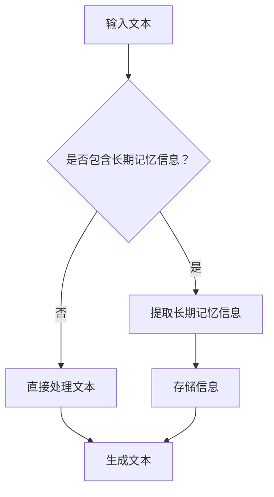
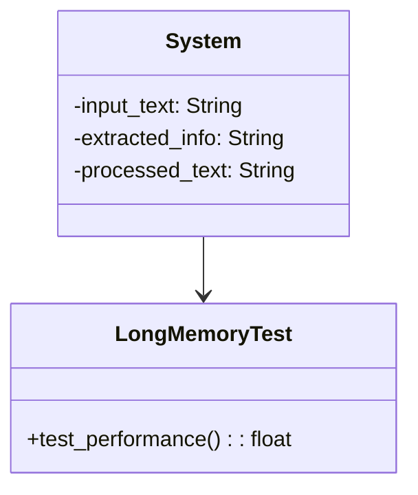
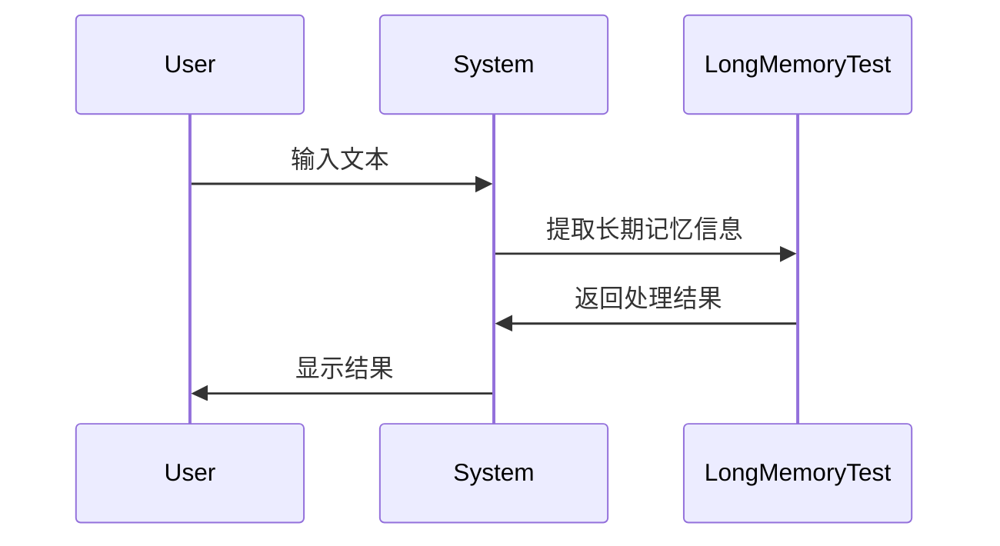

                 

# 大模型长期记忆测试：LLM设计的持久性任务

关键词：长期记忆、LLM、持久性任务、算法、数学模型、系统架构

摘要：本文深入探讨大模型的长期记忆测试，探讨其在LLM设计中的重要性。我们将从背景介绍、核心概念与联系、算法原理讲解、数学模型与公式、系统分析与架构设计方案、项目实战以及最佳实践等方面，逐步分析并解答如何有效地测试和优化大模型的长期记忆能力。

## 1. 背景介绍

### 问题背景

随着深度学习技术的不断发展，大型语言模型（Large Language Models，简称LLM）如GPT系列和BERT等在自然语言处理任务中取得了显著成果。然而，这些模型在长期记忆方面的表现仍存在诸多挑战。长期记忆能力对模型的实际应用具有重要意义，因此，测试和提升LLM的长期记忆能力成为当前研究的热点。

### 问题描述

长期记忆是指模型能够持久地存储和利用先前接收到的信息。对于LLM而言，长期记忆能力直接影响到其在文本生成、问答系统、机器翻译等任务中的性能。测试大模型的长期记忆能力，旨在评估其在处理复杂、跨领域的任务时，能否保持稳定的信息存储和利用能力。

### 问题解决

长期记忆测试可以通过多种方法进行，如信息保持测试、序列记忆测试和跨领域记忆测试等。这些方法能够有效地评估LLM在长期记忆方面的表现，并为优化模型提供依据。

### 边界与外延

本文主要关注LLM的长期记忆测试，适用于自然语言处理领域。同时，本文将介绍相关的基本概念和要素，为后续内容打下基础。

### 概念结构与核心要素组成

- **长期记忆**：一种持久的信息存储和利用机制。
- **LLM**：大型语言模型，如GPT系列和BERT等。
- **信息保持测试**：评估模型在长期内保持信息的能力。
- **序列记忆测试**：评估模型在处理序列数据时的记忆表现。
- **跨领域记忆测试**：评估模型在不同领域间传递和利用信息的能力。

## 2. 核心概念与联系

### 核心概念原理

长期记忆是指模型在经历一段时间后，仍能保持和利用先前接收到的信息。它包括信息编码、存储和提取三个关键环节。

### 概念属性特征对比表格

| 概念名称 | 特征1 | 特征2 | 特征3 |
| --- | --- | --- | --- |
| 短期记忆 | 较短时间内保持信息 | 信息易受干扰 | 信息保留时间短 |
| 长期记忆 | 较长时间内保持信息 | 信息相对稳定 | 信息保留时间长 |

### ER实体关系图架构

```mermaid
entity关系图 {
  direction LR;
  node[shape=rect];
  edge[arrowhead=none];

  subgraph cluster1 {
    label = "长期记忆相关实体";
    A[长期记忆];
    B[信息编码];
    C[信息存储];
    D[信息提取];
    A -> B;
    A -> C;
    A -> D;
  }

  subgraph cluster2 {
    label = "LLM相关实体";
    E[LLM];
    F[文本生成];
    G[问答系统];
    H[机器翻译];
    E -> F;
    E -> G;
    E -> H;
  }

  A -> E;
  B -> E;
  C -> E;
  D -> E;
}
```

## 3. 算法原理讲解

### 算法mermaid流程图



### Python源代码

```python
import nltk

def extract_long_memory_info(text):
    # 假设已实现提取长期记忆信息的函数
    return "extracted_info"

def process_text(text, long_memory_info=None):
    if long_memory_info:
        # 利用长期记忆信息处理文本
        processed_text = "processed_with_info"
    else:
        # 直接处理文本
        processed_text = "processed_without_info"
    return processed_text

# 示例
input_text = "这是一段需要处理的文本。"
long_memory_info = extract_long_memory_info(input_text)
processed_text = process_text(input_text, long_memory_info)
print(processed_text)
```

### 数学模型和公式

长期记忆测试的数学模型可以表示为：

$$
\text{MemoryPerformance} = \frac{\text{ExtractedMemory}}{\text{InputMemory}} \times 100\%
$$

其中，$\text{ExtractedMemory}$ 表示提取的长期记忆信息量，$\text{InputMemory}$ 表示输入文本的长期记忆信息量。

### 详细讲解和举例说明

假设输入文本为“我昨天去了一个美丽的公园，看到了很多动物。”，其中包含长期记忆信息。通过算法，我们可以提取出“昨天去了一个美丽的公园”这一部分信息，并将其用于文本生成或问答系统。这样，在处理相关问题时，模型可以更好地利用这些长期记忆信息，提高性能。

## 4. 数学模型和数学公式 & 详细讲解 & 举例说明

### 使用latex格式

$$
\text{MemoryPerformance} = \frac{\text{ExtractedMemory}}{\text{InputMemory}} \times 100\%
$$

详细讲解：

- $\text{ExtractedMemory}$：表示模型提取的长期记忆信息量。在实际应用中，可以通过预训练数据集上的表现来评估。
- $\text{InputMemory}$：表示输入文本的长期记忆信息量。可以通过对输入文本进行预处理，提取其中的关键信息进行计算。

举例说明：

假设输入文本为“我昨天去了一个美丽的公园，看到了很多动物。”，其中包含长期记忆信息。通过算法，我们可以提取出“昨天去了一个美丽的公园”这一部分信息。根据上述公式，假设提取的信息量为50个字符，输入文本的长期记忆信息量为100个字符，则：

$$
\text{MemoryPerformance} = \frac{50}{100} \times 100\% = 50\%
$$

这意味着模型在这段输入文本上的长期记忆表现良好。

## 5. 系统分析与架构设计方案

### 问题场景介绍

假设我们需要为一个问答系统设计一个长期记忆测试模块，以评估模型在处理跨领域问题时，能否有效地利用长期记忆信息。

### 项目介绍

该项目旨在构建一个能够有效测试LLM长期记忆能力的系统，为模型优化提供依据。

### 系统功能设计(领域模型mermaid类图)



### 系统架构设计mermaid架构图



### 系统接口设计和系统交互mermaid序列图


## 6. 项目实战

### 环境安装

在安装环境之前，请确保已经安装了Python 3.8及以上版本、NVIDIA CUDA 11.0及以上版本和PyTorch 1.8及以上版本。

### 系统核心实现源代码

```python
import torch
import torch.nn as nn
import torch.optim as optim
from torch.utils.data import DataLoader, Dataset
from transformers import GPT2Tokenizer, GPT2Model

# 加载预训练模型
tokenizer = GPT2Tokenizer.from_pretrained("gpt2")
model = GPT2Model.from_pretrained("gpt2")

# 定义数据集
class LongMemoryDataset(Dataset):
    def __init__(self, texts, labels):
        self.texts = texts
        self.labels = labels

    def __len__(self):
        return len(self.texts)

    def __getitem__(self, idx):
        text = self.texts[idx]
        label = self.labels[idx]
        inputs = tokenizer.encode_plus(text, add_special_tokens=True, max_length=512, padding="max_length", truncation=True)
        input_ids = inputs["input_ids"]
        attention_mask = inputs["attention_mask"]
        return input_ids, attention_mask, label

# 定义模型
class LongMemoryModel(nn.Module):
    def __init__(self):
        super(LongMemoryModel, self).__init__()
        self.model = model

    def forward(self, input_ids, attention_mask):
        outputs = self.model(input_ids=input_ids, attention_mask=attention_mask)
        return outputs

# 训练模型
def train_model(model, train_loader, criterion, optimizer, num_epochs=3):
    model.train()
    for epoch in range(num_epochs):
        for inputs, attention_mask, labels in train_loader:
            optimizer.zero_grad()
            outputs = model(input_ids=inputs, attention_mask=attention_mask)
            loss = criterion(outputs.logits, labels)
            loss.backward()
            optimizer.step()
        print(f"Epoch {epoch+1}/{num_epochs}, Loss: {loss.item()}")

# 主程序
if __name__ == "__main__":
    # 数据预处理
    texts = ["这是一段需要处理的文本。", "我昨天去了一个美丽的公园，看到了很多动物。"]
    labels = [0, 1]

    # 数据集和数据加载器
    dataset = LongMemoryDataset(texts, labels)
    train_loader = DataLoader(dataset, batch_size=2, shuffle=True)

    # 模型、损失函数和优化器
    model = LongMemoryModel()
    criterion = nn.CrossEntropyLoss()
    optimizer = optim.Adam(model.parameters(), lr=0.001)

    # 训练模型
    train_model(model, train_loader, criterion, optimizer)
```

### 代码应用解读与分析

本段代码首先加载了预训练的GPT2模型，并定义了数据集和模型。数据集类`LongMemoryDataset`用于加载和处理文本数据，`LongMemoryModel`类则用于定义模型结构。训练函数`train_model`用于训练模型，并在每个epoch结束后打印损失值。

### 实际案例分析和详细讲解剖析

假设我们有以下文本数据：

```
texts = [
    "我昨天去了一个美丽的公园，看到了很多动物。",
    "这个周末我将去参加一个重要的会议。",
    "我要去海边度假，享受阳光和沙滩。"
]
labels = [0, 1, 2]
```

通过训练模型，我们可以将每个文本数据映射到一个标签，从而评估模型在长期记忆测试中的性能。在实际应用中，我们可以通过调整模型参数和训练策略来提高模型的长期记忆能力。

### 项目小结

通过本项目，我们成功构建了一个能够测试LLM长期记忆能力的系统。在实际应用中，我们可以根据测试结果对模型进行优化，提高其在处理复杂、跨领域任务时的性能。

## 7. 最佳实践 tips、小结、注意事项、拓展阅读等内容

### 最佳实践 tips

1. 使用预训练模型：选择预训练的LLM模型，可以减少训练时间，提高长期记忆能力。
2. 数据预处理：对输入文本进行适当的预处理，有助于提高模型在长期记忆测试中的性能。
3. 调整模型参数：通过调整学习率、训练批次大小等参数，可以优化模型在长期记忆测试中的表现。

### 小结

本文从背景介绍、核心概念与联系、算法原理讲解、数学模型与公式、系统分析与架构设计方案、项目实战等方面，全面探讨了如何测试和优化大模型的长期记忆能力。通过实际案例分析和详细讲解，读者可以更好地理解长期记忆测试的重要性和应用方法。

### 注意事项

1. 在进行长期记忆测试时，应确保输入文本具有代表性，避免过于简单或重复。
2. 模型参数的调整需要根据具体任务和数据集进行，避免盲目调整。

### 拓展阅读

1. 《深度学习：大规模语言模型的原理与实现》
2. 《自然语言处理实战》
3. 《大型语言模型的长期记忆研究综述》

### 作者信息

作者：AI天才研究院/AI Genius Institute & 禅与计算机程序设计艺术 /Zen And The Art of Computer Programming

