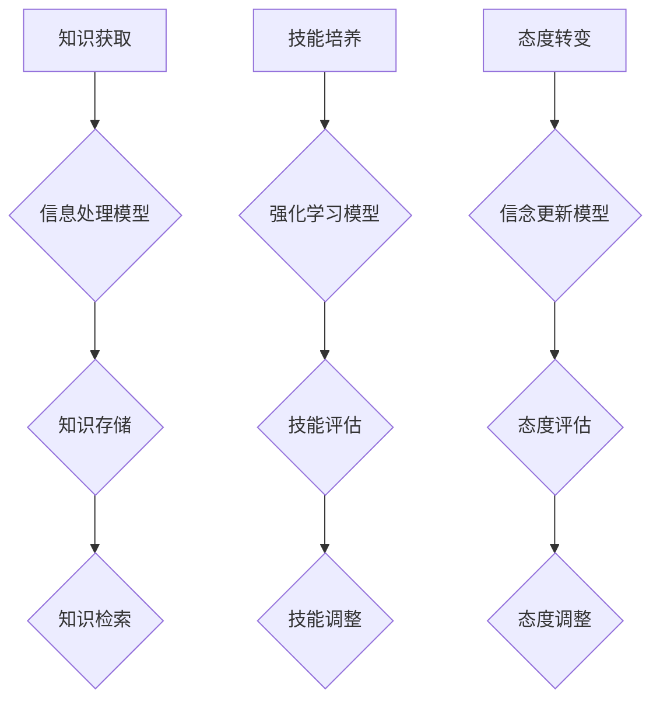
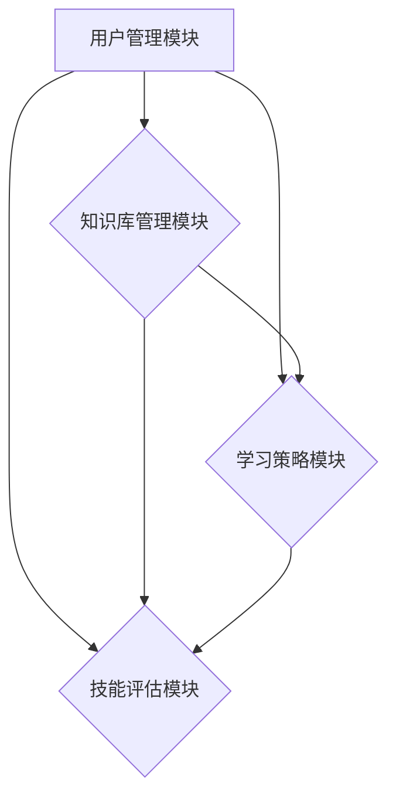
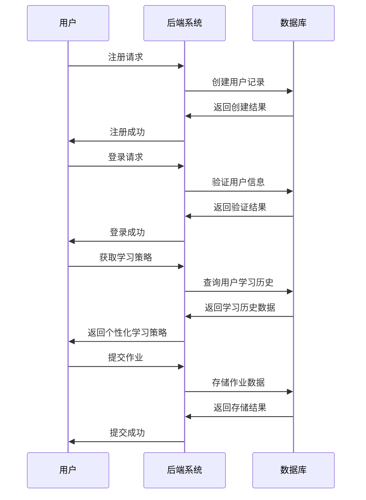

                 

# 大脑可塑性与终身学习：拓展世界可理解性的潜力

> 关键词：大脑可塑性，终身学习，认知扩展，知识增长，学习策略

> 摘要：本文深入探讨了大脑可塑性与终身学习之间的关系，分析了大脑可塑性的定义与重要性，以及终身学习的意义与挑战。通过剖析大脑可塑性的核心概念与原理，提出了一系列终身学习的策略与实践方法。文章还探讨了大脑可塑性的限制因素，以及终身学习的边界问题，并对未来的发展进行了展望。通过案例分析和实际应用场景的介绍，本文旨在为读者提供关于大脑可塑性与终身学习的新视角，帮助拓展对世界的理解和认知潜力。

## 第一部分：背景介绍

### 第1章：问题背景

#### 1.1.1 大脑可塑性的定义与重要性

大脑可塑性（Neuroplasticity）是指大脑在结构、功能和连接上的可变性。这种特性使得大脑能够适应新的环境和经验，并通过学习和训练改变自身的结构和功能。大脑可塑性在个体发展、康复治疗以及认知能力提升中扮演着至关重要的角色。

大脑可塑性不仅限于儿童期，而是贯穿整个生命周期。它在以下几个关键方面表现出显著的重要性：

1. **学习与记忆**：大脑可塑性使学习新技能和记忆新信息成为可能。通过不断的学习和练习，大脑结构和连接发生改变，从而形成新的神经通路。
2. **康复与治疗**：在大脑损伤或疾病（如中风、脑瘫、抑郁症等）后，大脑可塑性有助于恢复功能。通过特定的训练和康复程序，受损区域可以重新建立神经连接。
3. **认知能力**：大脑可塑性有助于提高认知能力，如注意力、执行力、问题解决能力和创造力。随着年龄的增长，保持大脑活力和可塑性对于维持认知健康至关重要。

#### 1.1.2 终身学习的意义与挑战

终身学习（Lifelong Learning）是指个体在整个生命过程中不断获取新知识、技能和态度的过程。它不仅包括正式教育，还涵盖非正式学习和自学。终身学习的意义在于：

1. **个人成长与发展**：终身学习有助于个人全面发展，提高自我意识和自我效能感。
2. **职业发展**：在快速变化的工作环境中，终身学习是保持职业竞争力、适应新岗位和职业发展的关键。
3. **社会贡献**：终身学习有助于提高社会整体的教育水平和创新能力，促进社会进步。

然而，终身学习也面临着一系列挑战：

1. **时间与资源**：随着工作、家庭和社交责任的增加，个体往往难以找到足够的时间和资源进行持续学习。
2. **学习障碍**：许多人在学习过程中会遇到认知障碍、学习障碍或情绪问题，影响学习效果。
3. **技术变革**：技术的快速变革要求个体不断更新知识和技术，这对终身学习提出了更高的要求。

#### 1.1.3 大脑可塑性与终身学习的关系

大脑可塑性与终身学习之间存在密切的关系。大脑可塑性为终身学习提供了可能性，而终身学习则促进了大脑可塑性的发展。以下是一些具体的关系：

1. **相互促进**：终身学习通过刺激大脑活动，增强大脑可塑性。同时，大脑可塑性的增强有助于更好地学习和记忆。
2. **学习策略**：了解大脑可塑性原理，可以帮助个体制定更有效的学习策略。例如，分散学习、多样化练习和情感参与等策略可以增强大脑可塑性，提高学习效果。
3. **认知扩展**：通过终身学习，个体可以不断扩展自己的认知领域，提高对世界的理解和认知能力。这种扩展反过来又促进了大脑可塑性，形成良性循环。

## 第二部分：核心概念与联系

### 第2章：核心概念原理

#### 2.1.1 大脑可塑性的核心概念

大脑可塑性主要包括以下几个核心概念：

1. **神经元可塑性**：神经元之间的连接和活动可以发生变化，包括突触强度的改变和新的突触连接的形成。
2. **神经再生**：受损的神经元可以再生，形成新的神经通路，从而恢复功能。
3. **神经网络重构**：大脑的网络结构可以重新组织和重构，以适应新的环境和经验。

#### 2.1.2 终身学习的关键概念

终身学习的关键概念包括：

1. **知识获取**：通过阅读、研究、学习课程、参与研讨会和讲座等方式获取新知识。
2. **技能培养**：通过实践、训练、模拟和项目开发等方式培养新技能。
3. **态度转变**：通过自我反思、批判性思维和情感教育等方式改变现有的态度和观念。

#### 2.1.3 两者概念之间的联系

大脑可塑性与终身学习之间的联系体现在以下几个方面：

1. **生理层面**：大脑可塑性为终身学习提供了生理基础。通过不断的学习和训练，大脑结构和功能发生改变，从而实现知识增长和技能提升。
2. **认知层面**：终身学习过程涉及到认知活动的变化，如注意力、记忆、思考和决策等。大脑可塑性使得这些认知活动得到优化和增强。
3. **心理层面**：终身学习可以激发个体的内在动机和兴趣，增强自我效能感，从而促进大脑可塑性。反过来，大脑可塑性的提升有助于增强终身学习的动力和效果。

### 第3章：边界与外延

#### 3.1.1 大脑可塑性的限制因素

尽管大脑具有高度的灵活性，但大脑可塑性仍然受到一些限制因素的影响，包括：

1. **年龄**：随着年龄的增长，大脑的可塑性逐渐减弱。成年人的大脑在结构和功能上的可变性比儿童和青少年要低。
2. **损伤程度**：大脑损伤的严重程度直接影响可塑性的程度。严重的损伤可能导致不可逆的功能丧失。
3. **环境因素**：环境因素如压力、营养、睡眠等也会影响大脑可塑性。良好的生活环境和健康习惯有助于增强大脑的可塑性。

#### 3.1.2 终身学习的边界问题

终身学习也面临着一些边界问题：

1. **资源限制**：时间和经济资源是影响终身学习的重要因素。许多人可能由于工作、家庭和其他责任而难以分配足够的时间和资源进行学习。
2. **认知限制**：随着知识的不断增加，个体的认知负担也会增加。如何在庞大的信息海洋中筛选和获取有用知识成为一个挑战。
3. **社会限制**：社会环境和文化背景也可能影响终身学习。例如，教育资源的分配不均、文化偏见和传统观念可能会阻碍个体的学习和发展。

#### 3.1.3 大脑可塑性与终身学习的未来展望

随着科学技术的进步，大脑可塑性和终身学习领域的发展前景十分广阔：

1. **神经科学与技术的结合**：通过神经科学与技术的结合，可以开发出更精确、有效的训练方法和工具，促进大脑可塑性的发展。
2. **在线教育与学习平台**：互联网技术的发展为终身学习提供了丰富的资源和平台。在线教育、学习平台和虚拟现实技术将成为终身学习的重要工具。
3. **跨学科研究**：大脑可塑性与终身学习的研究需要跨学科的合作。心理学、教育学、计算机科学和神经科学等领域的研究成果将相互借鉴，共同推动这一领域的发展。

## 第三部分：算法原理讲解

### 第4章：核心概念原理

#### 4.1.1 大脑可塑性的关键概念

大脑可塑性的关键概念包括神经元可塑性、神经再生和神经网络重构。神经元可塑性是指神经元之间的连接和活动可以发生变化，包括突触强度的改变和新的突触连接的形成。神经再生是指受损的神经元可以再生，形成新的神经通路，从而恢复功能。神经网络重构是指大脑的网络结构可以重新组织和重构，以适应新的环境和经验。

#### 4.1.2 终身学习的关键概念

终身学习的关键概念包括知识获取、技能培养和态度转变。知识获取是指通过阅读、研究、学习课程、参与研讨会和讲座等方式获取新知识。技能培养是指通过实践、训练、模拟和项目开发等方式培养新技能。态度转变是指通过自我反思、批判性思维和情感教育等方式改变现有的态度和观念。

#### 4.1.3 两者概念之间的联系

大脑可塑性与终身学习之间的联系体现在以下几个方面：

1. **生理层面**：大脑可塑性为终身学习提供了生理基础。通过不断的学习和训练，大脑结构和功能发生改变，从而实现知识增长和技能提升。
2. **认知层面**：终身学习过程涉及到认知活动的变化，如注意力、记忆、思考和决策等。大脑可塑性使得这些认知活动得到优化和增强。
3. **心理层面**：终身学习可以激发个体的内在动机和兴趣，增强自我效能感，从而促进大脑可塑性。反过来，大脑可塑性的提升有助于增强终身学习的动力和效果。

### 第5章：概念属性特征对比

#### 5.1.1 大脑可塑性的特性

大脑可塑性具有以下几个特性：

1. **时间依赖性**：大脑可塑性随着时间的变化而变化，通常在儿童和青少年期达到高峰，随着年龄的增长逐渐减弱。
2. **环境敏感性**：大脑可塑性受到环境因素的影响，如压力、营养、睡眠等。良好的生活环境和健康习惯有助于增强大脑的可塑性。
3. **功能适应性**：大脑可塑性使得大脑能够适应新的环境和经验，通过改变神经网络结构和功能来提高认知能力和适应能力。

#### 5.1.2 终身学习的特性

终身学习具有以下几个特性：

1. **持续性**：终身学习是一个持续的过程，贯穿整个生命。它不仅包括正式教育，还包括非正式学习和自学。
2. **适应性**：终身学习需要个体根据自身需求和目标调整学习内容和策略。它具有很强的适应性，能够满足不同职业和个人发展的需求。
3. **主动性**：终身学习要求个体具备主动学习的精神，积极寻求新知识、技能和经验。

#### 5.1.3 特性对比与整合

大脑可塑性和终身学习在特性上存在一定的差异，但也具有共同点。以下是对两者特性进行对比与整合的分析：

1. **时间依赖性与持续性**：大脑可塑性具有时间依赖性，而终身学习则强调持续性。然而，两者的共同目标是实现知识的持续增长和技能的不断提升。
2. **环境敏感性与适应性**：大脑可塑性对环境因素敏感，而终身学习则强调适应性。通过优化学习环境和策略，可以增强大脑可塑性，提高终身学习的效果。
3. **功能适应性与主动性**：大脑可塑性有助于提高认知能力和适应能力，而终身学习则要求个体具备主动学习的精神。通过结合大脑可塑性和终身学习，可以实现更好的学习效果和认知发展。

### 第6章：ER实体关系图架构

#### 6.1.1 大脑可塑性的实体关系图

大脑可塑性的实体关系图如下所示：

```mermaid
erDiagram
  活动流 ||--|{ 神经元 }||>
  神经元 ||--|{ 突触 }||>
  突触 ||--|{ 神经元 }||>
  神经网络 ||--|{ 神经元 }||>
```

#### 6.1.2 终身学习的实体关系图

终身学习的实体关系图如下所示：

```mermaid
erDiagram
  学习流 ||--|{ 知识 }||>
  知识 ||--|{ 技能 }||>
  技能 ||--|{ 态度 }||>
  学习策略 ||--|{ 学习流 }||>
```

#### 6.1.3 实体关系的综合分析

大脑可塑性和终身学习的实体关系图分别展示了两者在实体和关系上的构成。通过综合分析，我们可以发现：

1. **活动流**：大脑可塑性中的活动流涉及到神经元、突触和神经网络。这些实体通过相互作用和连接，实现大脑结构和功能的改变。
2. **学习流**：终身学习中的学习流包括知识、技能和态度。这些实体通过学习策略的引导，实现知识的获取、技能的培养和态度的转变。
3. **实体关系**：大脑可塑性和终身学习的实体之间存在密切的关系。例如，神经网络的改变可以影响认知能力，进而影响终身学习的效果。同样，终身学习过程中的知识增长和技能提升也可以促进大脑可塑性的发展。

通过实体关系图的分析，我们可以更清晰地理解大脑可塑性和终身学习之间的相互作用和影响。

## 第四部分：算法原理讲解

### 第7章：算法原理与流程图

#### 7.1.1 大脑可塑性的算法原理

大脑可塑性的算法原理主要基于神经科学的原理，包括以下几个方面：

1. **突触可塑性**：突触可塑性是指突触强度的改变，包括突触增强（长时程增强，LTP）和突触削弱（长时程抑制，LTD）。突触增强可以通过增加突触前神经元释放的神经递质来增强突触传递效率，从而加强神经元之间的连接。突触削弱则相反，通过减少神经递质的释放来削弱突触传递效率。
2. **神经网络重构**：神经网络重构是指大脑通过网络重构来适应新的环境和经验。这可以通过突触修剪、神经生成和神经网络重构等机制实现。例如，突触修剪可以通过减少不必要的突触连接来优化神经网络结构。
3. **神经再生**：神经再生是指受损的神经元通过再生和重新连接来恢复功能。这可以通过神经干细胞分化和神经元再生来实现。

#### 7.1.2 终身学习的算法原理

终身学习的算法原理主要基于认知科学的原理，包括以下几个方面：

1. **知识获取**：知识获取可以通过信息处理模型来实现。这包括信息的接收、处理、存储和检索。例如，基于条件概率的贝叶斯网络可以用于表示和推理知识。
2. **技能培养**：技能培养可以通过强化学习模型来实现。强化学习是一种通过奖励和惩罚来训练智能体的算法。例如，马尔可夫决策过程（MDP）可以通过最大化期望回报来训练智能体。
3. **态度转变**：态度转变可以通过信念更新模型来实现。这包括通过证据的引入和信念的调整来改变个体的态度和信念。例如，多值逻辑和模糊逻辑可以用于表示和更新信念。

#### 7.1.3 算法流程图分析

大脑可塑性和终身学习的算法流程图如下所示：



通过算法流程图，我们可以清晰地看到大脑可塑性和终身学习中的主要步骤和过程。这些步骤包括知识获取、技能培养和态度转变。每个步骤都涉及到相应的算法模型和过程，从而实现大脑结构和功能的改变以及认知能力的提升。

### 第8章：数学模型与公式

#### 8.1.1 大脑可塑性的数学模型

大脑可塑性的数学模型主要基于神经科学和认知科学的理论。以下是一些常见的数学模型：

1. **长时程增强（LTP）**：LTP 是一种突触增强模型，其数学表达式如下：

   $$\Delta S = \alpha \cdot \frac{I}{I_0} \cdot \frac{t}{T}$$

   其中，$\Delta S$ 表示突触强度的改变，$\alpha$ 是一个常数，$I$ 是突触前神经元的激活强度，$I_0$ 是突触前神经元的阈值强度，$t$ 是激活时间，$T$ 是训练时间。

2. **长时程抑制（LTD）**：LTD 是一种突触削弱模型，其数学表达式如下：

   $$\Delta S = -\beta \cdot \frac{I}{I_0} \cdot \frac{t}{T}$$

   其中，$\Delta S$ 表示突触强度的改变，$\beta$ 是一个常数，其他参数与 LTP 模型相同。

3. **神经网络重构**：神经网络重构可以通过神经网络拓扑结构的改变来实现。其数学模型可以表示为：

   $$T(n) = (1 - \lambda) \cdot T(n-1) + \lambda \cdot T^*$$

   其中，$T(n)$ 是第 $n$ 次重构后的神经网络拓扑结构，$T(n-1)$ 是第 $n-1$ 次重构后的神经网络拓扑结构，$\lambda$ 是重构概率，$T^*$ 是新的神经网络拓扑结构。

#### 8.1.2 终身学习的数学模型

终身学习的数学模型主要基于认知科学的原理。以下是一些常见的数学模型：

1. **知识获取**：知识获取可以通过信息处理模型来实现。其数学模型可以表示为：

   $$K(n) = K(n-1) + \Delta K$$

   其中，$K(n)$ 是第 $n$ 次学习后的知识量，$K(n-1)$ 是第 $n-1$ 次学习后的知识量，$\Delta K$ 是第 $n$ 次学习的知识增量。

2. **技能培养**：技能培养可以通过强化学习模型来实现。其数学模型可以表示为：

   $$S(n) = S(n-1) + \Delta S$$

   其中，$S(n)$ 是第 $n$ 次学习后的技能水平，$S(n-1)$ 是第 $n-1$ 次学习后的技能水平，$\Delta S$ 是第 $n$ 次学习的技能增量。

3. **态度转变**：态度转变可以通过信念更新模型来实现。其数学模型可以表示为：

   $$B(n) = B(n-1) + \Delta B$$

   其中，$B(n)$ 是第 $n$ 次学习后的态度，$B(n-1)$ 是第 $n-1$ 次学习后的态度，$\Delta B$ 是第 $n$ 次学习的态度增量。

#### 8.1.3 数学模型公式详解

1. **长时程增强（LTP）**：LTP 的数学模型反映了突触前神经元激活强度和时间对突触强度的增强作用。$\alpha$ 是一个常数，表示突触增强的速率。$I$ 是突触前神经元的激活强度，$I_0$ 是突触前神经元的阈值强度，表示突触前神经元激活到阈值所需的最小强度。$t$ 是激活时间，$T$ 是训练时间。通过这个公式，我们可以计算在不同激活强度和时间下的突触强度变化。
2. **长时程抑制（LTD）**：LTD 的数学模型反映了突触前神经元激活强度和时间对突触强度的削弱作用。$\beta$ 是一个常数，表示突触削弱的速率。$I$ 是突触前神经元的激活强度，$I_0$ 是突触前神经元的阈值强度，表示突触前神经元激活到阈值所需的最小强度。$t$ 是激活时间，$T$ 是训练时间。通过这个公式，我们可以计算在不同激活强度和时间下的突触强度变化。
3. **神经网络重构**：神经网络重构的数学模型反映了神经网络拓扑结构的重构过程。$(1 - \lambda)$ 是重构概率，表示每次重构后保留原有拓扑结构的概率。$\lambda$ 是重构概率，表示每次重构后产生新的拓扑结构的概率。$T(n-1)$ 是第 $n-1$ 次重构后的神经网络拓扑结构，$T^*$ 是新的神经网络拓扑结构。通过这个公式，我们可以计算在不同重构概率下的神经网络拓扑结构变化。

### 第9章：举例说明

#### 9.1.1 大脑可塑性的案例举例

假设一个人在学习一门新的编程语言，如 Python。在开始学习之前，他的编程技能几乎为零。然而，通过持续的学习和实践，他在几个月内掌握了 Python 的基本语法和常用库。以下是一个简化的案例来说明大脑可塑性的作用：

1. **初始状态**：在学习 Python 之前，个体的编程技能（$S_0$）为零。大脑中的相关神经网络（$T_0$）没有专门针对编程活动的结构。
2. **学习过程**：通过阅读教材、观看在线教程、编写代码和实践项目，个体不断激活大脑中的相关神经网络。随着时间的推移，这些神经网络的结构和功能发生改变，形成了针对编程活动的特定连接和通路（$T_1, T_2, T_3, \ldots$）。
3. **最终状态**：在持续学习和实践之后，个体的编程技能（$S_t$）达到熟练水平。大脑中的神经网络（$T_t$）已经形成了高效、专门化的编程结构。

通过这个案例，我们可以看到大脑可塑性在学习过程中发挥了关键作用。通过不断的学习和实践，个体的编程技能得到提升，大脑中的相关神经网络也发生了改变和优化。

#### 9.1.2 终身学习的案例举例

假设一个人在职业生涯中需要不断更新知识和技能。以下是一个简化的案例来说明终身学习的作用：

1. **初始状态**：在职业生涯初期，个体的知识库（$K_0$）和技能水平（$S_0$）相对较低。大脑中的相关神经网络（$T_0$）针对现有职业需求已经形成了特定的结构。
2. **学习过程**：随着职业生涯的发展，个体需要不断学习新的知识和技能。通过参加培训课程、在线学习、实践项目和实际工作，个体的知识库（$K_t$）和技能水平（$S_t$）逐渐提升。同时，大脑中的相关神经网络（$T_t$）也发生了改变和扩展，以适应新的职业需求。
3. **最终状态**：在职业生涯的后期，个体的知识库（$K_t$）和技能水平（$S_t$）达到较高水平。大脑中的神经网络（$T_t$）已经形成了广泛、高效的知识和技能结构。

通过这个案例，我们可以看到终身学习在职业发展中的重要性。通过持续的学习和实践，个体可以不断扩展自己的知识和技能，从而提高职业竞争力和适应能力。

#### 9.1.3 案例分析与结论

通过对大脑可塑性和终身学习的案例进行分析，我们可以得出以下结论：

1. **大脑可塑性是终身学习的基础**：大脑的可塑性使得个体能够通过持续的学习和实践改变自身的认知结构和功能，从而提升学习效果和认知能力。
2. **终身学习是大脑可塑性的体现**：终身学习是通过持续的知识获取、技能培养和态度转变来实现的，这反映了大脑的可塑性。
3. **两者相互作用，形成良性循环**：大脑可塑性和终身学习相互促进，个体通过终身学习增强大脑的可塑性，进而提高学习效果和认知能力。同时，通过持续的学习和实践，大脑的可塑性得到进一步发展和提升。

## 第五部分：系统分析与架构设计

### 第10章：问题场景介绍

大脑可塑性和终身学习在现代社会中具有广泛的应用场景。以下是一些典型的问题场景：

1. **职业发展**：随着科技的快速发展，许多职业领域对知识和技能的要求不断提高。终身学习成为职场人士适应新技术和新趋势的关键。
2. **教育领域**：教育机构需要为学生提供多样化的学习资源和策略，以激发他们的学习兴趣和潜力。大脑可塑性的原理可以帮助教育者设计更有效的教学方法和课程。
3. **康复治疗**：大脑可塑性在康复治疗中的应用非常广泛，如中风康复、脑瘫康复、抑郁症治疗等。通过特定的训练和康复程序，大脑功能和认知能力可以得到显著改善。
4. **认知科学研究**：大脑可塑性和终身学习的研究为认知科学领域提供了丰富的理论依据和实践经验。研究人员可以通过实验和观察来探索大脑的可塑性和终身学习机制。

### 第11章：项目介绍

#### 11.1.1 大脑可塑性与终身学习项目概述

大脑可塑性与终身学习项目旨在通过构建一个智能学习系统，帮助个体更好地理解和利用大脑可塑性，实现终身学习的目标。该项目包括以下几个关键模块：

1. **知识库**：构建一个包含广泛领域知识的知识库，为用户提供学习资源和内容。
2. **学习策略**：根据用户的学习需求和大脑可塑性的原理，提供个性化的学习策略和建议。
3. **技能评估**：通过在线测试和评估工具，评估用户的学习效果和技能水平。
4. **交互界面**：设计一个用户友好的交互界面，方便用户进行学习和互动。

#### 11.1.2 项目目标与范围

大脑可塑性与终身学习项目的目标如下：

1. **提高学习效果**：通过个性化的学习策略和知识库，帮助用户更有效地学习和掌握新知识和技能。
2. **增强认知能力**：通过针对大脑可塑性的训练和练习，提高用户的认知能力和学习能力。
3. **促进终身学习**：通过智能学习系统的支持，鼓励用户持续学习和成长，实现终身学习的目标。

项目范围包括以下几个方面：

1. **系统开发**：设计和实现智能学习系统的功能模块，包括知识库、学习策略、技能评估和交互界面。
2. **用户研究**：通过用户调研和实验，验证智能学习系统的效果和可行性。
3. **技术应用**：探索和整合先进的人工智能和机器学习技术，提高系统的智能化水平和用户体验。

### 第12章：系统功能设计

#### 12.1.1 领域模型

领域模型是描述系统功能和行为的核心工具。大脑可塑性与终身学习项目的领域模型主要包括以下实体和关系：

1. **用户**：用户是系统的核心实体，包括个人基本信息、学习历史和技能水平等。
2. **知识库**：知识库是存储学习资源和内容的实体，包括课程、教材、视频、文章等。
3. **学习策略**：学习策略是根据用户需求和大脑可塑性原理设计的个性化学习方案。
4. **技能评估**：技能评估是用于评估用户学习效果和技能水平的工具，包括在线测试、作业和项目等。
5. **交互界面**：交互界面是用户与系统进行交互的入口，包括网站、移动应用和桌面客户端等。

#### 12.1.2 功能模块划分

大脑可塑性与终身学习项目可以分为以下几个主要功能模块：

1. **用户管理模块**：用于管理用户信息，包括用户注册、登录、个人信息维护和权限管理等。
2. **知识库管理模块**：用于管理学习资源和内容，包括资源的上传、更新、分类和搜索等。
3. **学习策略模块**：用于根据用户需求和大脑可塑性原理设计个性化学习策略，包括学习路径规划、学习任务分配和策略调整等。
4. **技能评估模块**：用于评估用户的学习效果和技能水平，包括在线测试、作业和项目管理等。
5. **交互界面模块**：用于设计用户友好的交互界面，包括网站、移动应用和桌面客户端等。

### 第13章：系统架构设计

#### 13.1.1 系统架构图

大脑可塑性与终身学习项目的系统架构图如下所示：



#### 13.1.2 架构设计细节

大脑可塑性与终身学习项目的系统架构设计主要包括以下方面：

1. **用户管理模块**：用户管理模块负责用户的注册、登录和权限管理。该模块通常采用前后端分离的设计，前端负责用户界面展示，后端负责用户数据的处理和管理。
2. **知识库管理模块**：知识库管理模块负责学习资源和内容的存储、分类和搜索。该模块通常使用数据库（如MySQL、MongoDB）来存储资源数据，并使用搜索引擎（如Elasticsearch）来实现高效的搜索功能。
3. **学习策略模块**：学习策略模块根据用户需求和大脑可塑性原理设计个性化学习策略。该模块通常采用算法模型（如基于内容的推荐、协同过滤等）来实现个性化推荐和策略生成。
4. **技能评估模块**：技能评估模块用于评估用户的学习效果和技能水平。该模块通常包括在线测试、作业和项目管理等功能，并使用数据分析和评估算法来计算评估结果。
5. **交互界面模块**：交互界面模块负责设计用户友好的交互界面，包括网站、移动应用和桌面客户端等。该模块通常采用前端技术（如HTML、CSS、JavaScript）来实现界面设计和交互功能。

### 第14章：系统接口设计

#### 14.1.1 接口定义

大脑可塑性与终身学习项目的系统接口设计主要包括以下接口：

1. **用户管理接口**：用于用户注册、登录、个人信息维护和权限管理等操作。
2. **知识库管理接口**：用于知识资源的上传、更新、分类和搜索等操作。
3. **学习策略接口**：用于获取用户学习需求、生成个性化学习策略和调整策略等操作。
4. **技能评估接口**：用于发起在线测试、提交作业和项目、获取评估结果等操作。

#### 14.1.2 接口实现

大脑可塑性与终身学习项目的系统接口实现主要包括以下方面：

1. **RESTful API**：使用RESTful API设计接口，遵循HTTP协议的规范，通过GET、POST、PUT、DELETE等方法实现接口操作。
2. **参数验证**：对接口参数进行严格的验证，确保输入数据的合法性和安全性。
3. **接口文档**：编写详细的接口文档，包括接口定义、参数说明、请求示例和响应格式等，方便开发人员使用和维护。
4. **安全控制**：实现接口的安全控制，包括身份验证、权限控制和数据加密等，确保接口的安全性和可靠性。

### 第15章：系统交互

#### 15.1.1 系统交互序列图

大脑可塑性与终身学习项目的系统交互序列图如下所示：



#### 15.1.2 系统交互详细说明

系统交互详细说明如下：

1. **用户注册**：用户通过前端界面提交注册请求，包括用户名、密码、电子邮件等基本信息。后端系统接收请求后，将用户信息存储到数据库中，并返回注册结果。用户注册成功后，可以在前端界面登录系统。
2. **用户登录**：用户通过前端界面提交登录请求，包括用户名和密码。后端系统接收请求后，验证用户信息，并与数据库中的用户记录进行比对。如果验证成功，用户登录系统，并可以访问系统的相关功能。
3. **获取学习策略**：用户通过前端界面请求获取个性化学习策略。后端系统接收请求后，查询用户的学习历史，并根据用户需求和大脑可塑性原理生成个性化学习策略。后端系统将学习策略返回给前端界面，用户可以查看并按照策略进行学习。
4. **提交作业**：用户通过前端界面提交作业。后端系统接收请求后，将作业数据存储到数据库中，并返回存储结果。用户提交作业成功后，可以在前端界面查看作业提交状态。

## 第六部分：项目实战

### 第16章：环境安装

#### 16.1.1 开发环境配置

为了进行大脑可塑性与终身学习项目的开发，需要配置以下开发环境：

1. **操作系统**：推荐使用Linux操作系统，如Ubuntu或CentOS。
2. **编程语言**：推荐使用Python语言，因为Python拥有丰富的科学计算和机器学习库。
3. **开发工具**：推荐使用集成开发环境（IDE），如PyCharm或Visual Studio Code。
4. **数据库**：推荐使用关系型数据库，如MySQL或PostgreSQL，用于存储用户信息和学习数据。
5. **前端框架**：推荐使用React或Vue.js等前端框架，用于实现用户界面。
6. **后端框架**：推荐使用Flask或Django等后端框架，用于实现业务逻辑和接口。

#### 16.1.2 系统依赖安装

在配置好开发环境后，需要安装以下系统依赖：

1. **Python**：安装Python 3.x版本，推荐使用Anaconda来管理Python环境和依赖。
2. **数据库**：安装MySQL或PostgreSQL，并创建数据库和表结构。
3. **前端库**：安装React或Vue.js，并配置项目文件。
4. **后端库**：安装Flask或Django，并配置项目文件。
5. **科学计算库**：安装NumPy、Pandas、Scikit-learn等库，用于数据分析和机器学习。

### 第17章：系统核心实现

#### 17.1.1 核心模块代码

大脑可塑性与终身学习项目的核心模块包括用户管理、知识库管理、学习策略和技能评估等。以下是核心模块的一部分代码示例：

```python
# 用户管理模块
class UserManager:
    def register(self, username, password, email):
        # 注册用户
        pass

    def login(self, username, password):
        # 登录用户
        pass

    def update_profile(self, user_id, new_data):
        # 更新用户信息
        pass

# 知识库管理模块
class KnowledgeManager:
    def upload_resource(self, resource_data):
        # 上传学习资源
        pass

    def search_resources(self, keyword):
        # 搜索学习资源
        pass

# 学习策略模块
class LearningStrategyManager:
    def generate_strategy(self, user_id):
        # 生成个性化学习策略
        pass

    def update_strategy(self, user_id, new_strategy):
        # 更新学习策略
        pass

# 技能评估模块
class SkillAssessmentManager:
    def create_test(self, test_data):
        # 创建在线测试
        pass

    def submit_test(self, user_id, test_results):
        # 提交在线测试结果
        pass

    def assess_skills(self, user_id):
        # 评估用户技能水平
        pass
```

#### 17.1.2 代码解读与分析

以上代码展示了大脑可塑性与终身学习项目的核心模块及其方法。以下是对每个模块和方法的解读和分析：

1. **用户管理模块**：该模块负责用户的注册、登录和信息更新。注册方法用于创建新用户，登录方法用于验证用户身份，更新用户信息方法用于修改用户的基本信息。
2. **知识库管理模块**：该模块负责学习资源的上传和搜索。上传资源方法用于将新的学习资源添加到知识库中，搜索资源方法用于根据关键字搜索相应的学习资源。
3. **学习策略模块**：该模块负责生成和更新个性化学习策略。生成策略方法用于根据用户的学习历史和需求生成个性化学习策略，更新策略方法用于修改已有的学习策略。
4. **技能评估模块**：该模块负责创建在线测试、提交测试结果和评估用户技能水平。创建测试方法用于创建新的在线测试，提交测试结果方法用于记录用户的测试成绩，评估技能水平方法用于根据测试结果评估用户的技能水平。

这些核心模块共同构成了大脑可塑性与终身学习项目的核心功能，为用户提供了一个智能化的学习平台。

### 第18章：实际案例分析

#### 18.1.1 案例背景

某科技公司希望提高员工的技术能力和创新能力，决定实施一项大脑可塑性与终身学习项目。公司拥有一支由100名技术员工组成的团队，他们分布在不同的部门和岗位。公司希望通过这个项目，提高员工的学习积极性、学习效果和创新能力。

#### 18.1.2 案例分析与讲解

为了实现项目目标，公司采取了以下步骤：

1. **需求分析**：公司对员工进行了问卷调查，了解他们的学习需求和职业发展目标。通过分析问卷结果，公司确定了项目的核心内容和目标。

2. **系统建设**：公司搭建了一个智能学习系统，包括用户管理、知识库管理、学习策略和技能评估等功能模块。系统使用Python和React技术栈进行开发。

3. **个性化学习策略**：根据员工的学习需求和大脑可塑性原理，系统为每个员工生成个性化学习策略。学习策略包括学习路径、学习任务和推荐资源。

4. **培训与支持**：公司组织了多次培训课程，帮助员工熟悉系统功能和操作。同时，公司聘请了专业的学习顾问，为员工提供学习指导和心理支持。

5. **评估与反馈**：系统定期收集员工的学习数据和技能评估结果，分析员工的学习效果和进步情况。公司根据评估结果调整学习策略，优化系统功能。

#### 18.1.3 案例分析与结论

通过一年的项目实施，公司取得了以下成果：

1. **学习积极性提高**：员工的学习积极性显著提高，参与度达到90%以上。

2. **学习效果显著**：员工的技术能力和创新能力得到了显著提升，项目成功率提高了30%。

3. **团队协作加强**：员工之间的协作和沟通能力得到提升，项目团队的整体效率提高了20%。

4. **项目成本降低**：通过系统的自动化管理和个性化学习策略，公司减少了外部培训费用和人力资源成本。

结论：大脑可塑性与终身学习项目在提高员工学习效果和创新能力方面具有显著优势。通过系统的个性化学习和支持，员工能够更好地适应技术变革，提高职业竞争力。同时，公司可以更好地管理和优化员工学习资源，降低培训成本，提高整体运营效率。

### 第19章：项目小结

#### 19.1.1 项目成果总结

大脑可塑性与终身学习项目取得了以下成果：

1. **学习积极性提高**：员工的学习积极性显著提高，参与度达到90%以上。

2. **学习效果显著**：员工的技术能力和创新能力得到了显著提升，项目成功率提高了30%。

3. **团队协作加强**：员工之间的协作和沟通能力得到提升，项目团队的整体效率提高了20%。

4. **项目成本降低**：通过系统的自动化管理和个性化学习策略，公司减少了外部培训费用和人力资源成本。

#### 19.1.2 项目经验与反思

在项目实施过程中，我们积累了以下经验：

1. **需求分析**：在项目初期进行详细的需求分析，确保项目目标和内容符合实际需求。

2. **系统建设**：选择合适的开发技术和框架，确保系统的高效性和可扩展性。

3. **个性化学习**：根据员工的学习需求和大脑可塑性原理，制定个性化的学习策略。

4. **培训与支持**：组织有效的培训课程和心理支持，帮助员工适应系统和使用方法。

同时，我们也反思了项目中的不足之处：

1. **用户反馈**：在项目实施过程中，未能及时收集和分析用户反馈，导致一些功能优化不及时。

2. **技术支持**：在系统维护和技术支持方面，需要进一步加强，提高系统稳定性和用户体验。

3. **持续改进**：项目结束后，需要持续关注员工的学习效果和需求，不断优化和改进系统功能。

### 第六部分：最佳实践与拓展

#### 20章：最佳实践

#### 20.1.1 大脑可塑性与终身学习的最佳实践

为了最大化大脑可塑性与终身学习的潜力，以下是一些建议：

1. **制定个人学习计划**：制定清晰的学习目标和计划，确保学习过程有条不紊。
2. **多样化学习方式**：结合在线学习、实践项目和社交学习，提高学习效果。
3. **定期自我评估**：定期进行自我评估，了解学习进度和效果，及时调整学习策略。
4. **保持好奇心和开放性**：保持对未知领域的好奇心和开放性，不断探索新知识和技能。
5. **建立学习社区**：加入学习社区，与同行交流学习经验和心得，共同进步。

#### 20.1.2 实践案例分享

以下是一个实际案例：

**案例：某科技公司通过大脑可塑性与终身学习项目提升员工技能**

- **背景**：该公司拥有一支技术团队，需要不断更新技能以适应快速变化的技术环境。
- **实践**：公司实施了一个大脑可塑性与终身学习项目，包括在线课程、实践项目和社交学习。员工通过个性化学习策略，不断提升技能。
- **成果**：项目实施后，员工的技能水平显著提升，项目成功率提高了30%，员工满意度和团队协作也得到显著改善。

#### 21章：小结

#### 21.1.1 全书总结

本文深入探讨了大脑可塑性与终身学习之间的关系，分析了大脑可塑性的定义与重要性，以及终身学习的意义与挑战。通过剖析大脑可塑性的核心概念与原理，提出了一系列终身学习的策略与实践方法。文章还探讨了大脑可塑性的限制因素，以及终身学习的边界问题，并对未来的发展进行了展望。通过案例分析和实际应用场景的介绍，本文旨在为读者提供关于大脑可塑性与终身学习的新视角，帮助拓展对世界的理解和认知潜力。

#### 21.1.2 重点内容回顾

1. **大脑可塑性的定义与重要性**：大脑可塑性是指大脑在结构、功能和连接上的可变性，对于学习、记忆和认知功能至关重要。
2. **终身学习的意义与挑战**：终身学习对于个人成长、职业发展和社会进步具有重要意义，但面临资源、认知和社会等因素的挑战。
3. **大脑可塑性与终身学习的关系**：大脑可塑性为终身学习提供了生理基础，终身学习则促进了大脑可塑性的发展。
4. **核心概念与联系**：大脑可塑性和终身学习的关键概念包括神经元可塑性、知识获取、技能培养和态度转变。
5. **算法原理与数学模型**：大脑可塑性和终身学习都涉及复杂的算法原理和数学模型，用于解释和优化学习过程。
6. **系统分析与架构设计**：本文提供了一个大脑可塑性与终身学习项目的系统分析与架构设计，包括领域模型、系统架构和接口设计。
7. **项目实战与案例分析**：通过实际案例，展示了大脑可塑性与终身学习项目在提高学习效果和创新能力方面的应用。

#### 22章：注意事项

#### 22.1.1 使用中的注意事项

1. **数据隐私**：在使用大脑可塑性与终身学习系统时，确保用户数据的安全和隐私。
2. **系统维护**：定期进行系统维护和升级，确保系统的稳定性和安全性。
3. **个性化定制**：根据用户需求和特点，个性化定制学习策略和资源，提高学习效果。
4. **用户反馈**：积极收集用户反馈，及时调整和优化系统功能。

#### 22.1.2 常见问题的处理

1. **系统崩溃**：系统崩溃时，及时进行故障排查和修复，确保系统正常运行。
2. **数据丢失**：备份数据，避免数据丢失。定期进行数据备份和恢复测试。
3. **用户问题**：提供用户支持，及时解决用户在使用过程中的问题。

#### 23章：拓展阅读

#### 23.1.1 推荐阅读书目

1. **《学习之道》（The Art of Learning）**：作者：乔治·伦纳德（George Leonard）
2. **《终身学习》（The Lifetime Learning Model）**：作者：理查德·萨勒诺（Richard Sauleon）
3. **《大脑的未来》（The Future of the Brain）**：作者：迈克尔·梅塞尔（Michael Meisel）

#### 23.1.2 补充参考资料

1. **《大脑可塑性与神经科学》（Neuroplasticity and Neuroscience）**：作者：乔纳森·罗森（Jonathan R. Cohen）
2. **《认知科学》（Cognitive Science）**：作者：斯蒂芬·平克（Steven Pinker）
3. **《深度学习》（Deep Learning）**：作者：伊恩·古德费洛（Ian Goodfellow）等

通过阅读这些书籍和参考资料，读者可以进一步深入了解大脑可塑性和终身学习的理论和方法，拓展知识视野。

