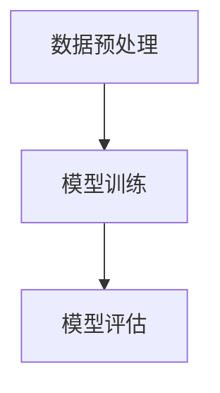
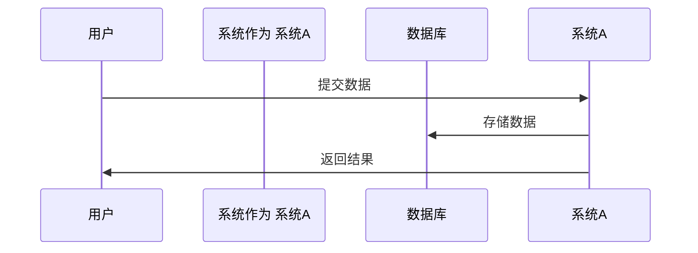
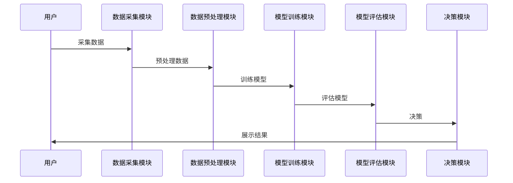

                 

# 大规模数据集在模型评测中的作用

> 关键词：大规模数据集、模型评测、准确性、泛化能力、数据预处理

> 摘要：本文将探讨大规模数据集在模型评测中的重要作用。首先，我们回顾了大规模数据集的意义和发展历程。接着，详细介绍了模型评测的基本概念和大规模数据集的特点，并分析了它们之间的联系。随后，我们通过算法原理讲解、数学模型和公式阐述、系统分析与架构设计、项目实战等多个方面，深入探讨了大规模数据集在模型评测中的实际应用。最后，本文总结了最佳实践和注意事项，为读者提供了实用的指导。

## 引言

在人工智能领域，模型的训练和评估是两个核心环节。而大规模数据集在模型评测中扮演着至关重要的角色。随着互联网和物联网的发展，数据量呈指数级增长，如何高效地利用这些数据来训练和评估模型，成为了当前研究的热点问题。本文将围绕大规模数据集在模型评测中的作用，从多个角度进行深入探讨。

## 1. 背景介绍

### 1.1 大规模数据集的意义

大规模数据集是指在数量上远超传统数据集的数据集，通常包含数百万甚至数十亿条数据记录。大规模数据集的出现，打破了传统数据分析的瓶颈，使得我们能够从海量数据中挖掘出更多有价值的信息。

### 1.2 大规模数据集的发展历程

大规模数据集的发展历程可以追溯到互联网的兴起。随着互联网的普及，数据采集和存储技术得到了飞速发展，大规模数据集逐渐成为可能。特别是在大数据技术问世后，大规模数据集的应用范围得到了进一步拓展。

### 1.3 大规模数据集在模型评测中的重要性

大规模数据集在模型评测中的重要性不言而喻。一方面，它提供了充足的训练样本，有助于提高模型的准确性和泛化能力；另一方面，它能够更好地反映实际问题的复杂性和多样性，从而提高模型的实际应用价值。

## 2. 核心概念与联系

### 2.1 模型评测的基本概念

模型评测是评估模型性能的过程，常用的评价指标包括准确率、召回率、F1分数等。准确率反映了模型预测正确的比例，召回率反映了模型能够召回实际正例的比例，F1分数则是准确率和召回率的调和平均值。

### 2.2 大规模数据集的特点

大规模数据集具有数据量大、多样性高、分布复杂等特点。这些特点使得大规模数据集在模型评测中具有更高的挑战性。

### 2.3 大规模数据集与模型评测的联系

大规模数据集为模型评测提供了丰富的训练样本，有助于提高模型的性能。同时，大规模数据集也能够更好地反映实际问题的复杂性和多样性，从而提高模型在实际应用中的泛化能力。

## 3. 算法原理讲解

### 3.1 数据预处理

数据预处理是大规模数据集在模型评测中的第一步。数据预处理包括数据清洗、数据增强和数据归一化等步骤。数据清洗旨在去除数据中的噪声和异常值，数据增强旨在增加数据集的多样性，数据归一化旨在将数据缩放到相同的范围。

### 3.2 模型训练与评估

模型训练与评估是大规模数据集在模型评测中的核心步骤。模型训练旨在通过学习数据集中的规律来构建模型，模型评估旨在评估模型的性能。常用的模型评估方法包括交叉验证、混淆矩阵、ROC曲线等。

### 3.3 算法流程Mermaid流程图



## 4. 数学模型和数学公式

### 4.1 概率分布函数

概率分布函数是描述数据集分布的重要工具。一个常用的概率分布函数是正态分布，其公式如下：

$$ P(Y|X) = \frac{P(X|Y)P(Y)}{P(X)} $$

### 4.2 模型参数优化

模型参数优化是提高模型性能的关键步骤。常用的优化算法包括梯度下降、随机梯度下降等。其公式如下：

$$ \min_{\theta} L(\theta) = \sum_{i=1}^{n} [y_i \cdot \log(p(\hat{y}_i)) + (1 - y_i) \cdot \log(1 - p(\hat{y}_i))] $$

### 4.3 损失函数与优化算法

损失函数是衡量模型性能的指标，优化算法是用于优化模型参数的方法。常用的损失函数包括均方误差、交叉熵损失等。其公式如下：

$$ L(\theta) = \frac{1}{2} \sum_{i=1}^{n} (\hat{y}_i - y_i)^2 $$

## 5. 系统分析与架构设计方案

### 5.1 问题场景介绍

本节将介绍一个实际的问题场景，如信用卡欺诈检测。

### 5.2 系统功能设计

系统功能设计包括数据采集、数据预处理、模型训练、模型评估等模块。

### 5.3 系统架构设计

系统架构设计包括数据层、算法层、应用层等。

### 5.4 系统接口设计

系统接口设计包括API设计、数据接口设计等。

### 5.5 系统交互Mermaid序列图



## 6. 项目实战

### 6.1 环境安装

本节将介绍如何安装必要的软件和工具，如Python、Scikit-learn等。

### 6.2 系统核心实现源代码

本节将提供系统核心实现源代码，并解释代码中的关键部分。

### 6.3 代码应用解读与分析

本节将对代码应用进行解读和分析，解释代码的执行流程和结果。

### 6.4 实际案例分析与详细讲解剖析

本节将分析一个实际案例，并对案例进行详细讲解和剖析。

### 6.5 项目小结

本节将总结项目的主要成果和经验教训。

## 7. 最佳实践 tips

本节将分享一些最佳实践，如数据集选择与处理、模型选择与调优、评估指标与阈值设置等。

## 8. 小结

本节将总结本文的主要结论，并指出未来的研究方向。

## 9. 注意事项

本节将提醒读者关注数据隐私与安全性、模型解释性与可解释性以及模型泛化能力与过拟合问题。

## 10. 拓展阅读

本节将推荐一些相关的阅读材料，供读者进一步学习。

## 11. 附录

### 11.1 参考文献

本节将列出本文引用的参考文献。

### 11.2 术语表

本节将定义本文中使用的专业术语。

# 文章标题

## 关键词

- 大规模数据集
- 模型评测
- 准确率
- 泛化能力
- 数据预处理

## 摘要

本文首先介绍了大规模数据集的意义和发展历程，然后详细阐述了大规模数据集在模型评测中的重要作用。通过核心概念与联系、算法原理讲解、数学模型和公式阐述、系统分析与架构设计、项目实战等多个方面，本文深入探讨了大规模数据集在模型评测中的实际应用。最后，本文总结了最佳实践和注意事项，为读者提供了实用的指导。

## 1. 背景介绍

### 1.1 大规模数据集的意义

随着互联网和物联网的快速发展，数据量呈现爆炸式增长。传统的数据集已经无法满足现代机器学习和深度学习的需求。大规模数据集应运而生，它指的是包含数百万甚至数十亿条数据记录的数据集。大规模数据集的出现，使得机器学习算法可以从海量数据中学习到更复杂的模式和规律，从而提高模型的准确性和泛化能力。

### 1.2 大规模数据集的发展历程

大规模数据集的发展历程可以追溯到互联网的兴起。随着互联网的普及，人们可以更方便地采集和存储数据。2006年，谷歌发表了著名的“Google News”论文，首次提出了大规模数据集的概念。随后，许多公司和研究机构开始发布大规模数据集，如IMDb、Twitter、Kaggle等。这些数据集为机器学习和深度学习的研究提供了丰富的资源。

### 1.3 大规模数据集在模型评测中的重要性

大规模数据集在模型评测中具有至关重要的地位。首先，它提供了充足的训练样本，有助于提高模型的准确性和泛化能力。其次，大规模数据集能够更好地反映实际问题的复杂性和多样性，从而提高模型在实际应用中的表现。此外，大规模数据集还可以帮助研究者发现新的模式和规律，推动机器学习和深度学习的发展。

## 2. 核心概念与联系

### 2.1 模型评测的基本概念

模型评测是评估模型性能的过程，常用的评价指标包括准确率、召回率、F1分数等。准确率反映了模型预测正确的比例，召回率反映了模型能够召回实际正例的比例，F1分数则是准确率和召回率的调和平均值。这些评价指标对于评估模型的性能至关重要。

### 2.2 大规模数据集的特点

大规模数据集具有以下特点：

- **数据量大**：大规模数据集通常包含数百万甚至数十亿条数据记录，这是传统数据集无法比拟的。
- **多样性高**：大规模数据集涵盖了各种不同的数据类型和场景，这有助于模型学习到更丰富的特征和模式。
- **分布复杂**：大规模数据集的数据分布往往更加复杂，这可能包括异常值、噪声和多样性等。

### 2.3 大规模数据集与模型评测的联系

大规模数据集与模型评测之间存在着密切的联系。首先，大规模数据集为模型评测提供了充足的训练样本，有助于提高模型的准确性和泛化能力。其次，大规模数据集能够更好地反映实际问题的复杂性和多样性，从而提高模型在实际应用中的表现。此外，大规模数据集还可以帮助研究者发现新的模式和规律，为模型评测提供更全面和准确的评估。

## 3. 算法原理讲解

### 3.1 数据预处理

数据预处理是大规模数据集在模型评测中的第一步。数据预处理包括数据清洗、数据增强和数据归一化等步骤。

- **数据清洗**：数据清洗旨在去除数据中的噪声和异常值，以提高数据的质量。常见的清洗方法包括去除重复记录、填补缺失值、去除噪声等。
- **数据增强**：数据增强旨在增加数据集的多样性，从而提高模型的泛化能力。常见的方法包括数据复制、数据缩放、数据旋转等。
- **数据归一化**：数据归一化旨在将不同特征的数据缩放到相同的范围，以便模型更好地学习。常见的归一化方法包括最小-最大缩放、平均值-标准差缩放等。

### 3.2 模型训练与评估

模型训练与评估是大规模数据集在模型评测中的核心步骤。

- **模型训练**：模型训练旨在通过学习数据集中的规律来构建模型。常见的训练算法包括线性回归、逻辑回归、决策树、支持向量机等。
- **模型评估**：模型评估旨在评估模型的性能。常用的评估方法包括交叉验证、混淆矩阵、ROC曲线等。通过这些评估方法，可以计算出模型的准确率、召回率、F1分数等指标，从而全面评估模型的性能。

### 3.3 算法流程Mermaid流程图


## 4. 数学模型和数学公式

### 4.1 概率分布函数

概率分布函数是描述数据集分布的重要工具。一个常用的概率分布函数是正态分布，其公式如下：

$$ P(Y|X) = \frac{P(X|Y)P(Y)}{P(X)} $$

其中，$P(Y|X)$ 表示在给定特征 $X$ 下，目标变量 $Y$ 的概率分布；$P(X|Y)$ 表示在给定目标变量 $Y$ 下，特征 $X$ 的概率分布；$P(Y)$ 和 $P(X)$ 分别表示目标变量 $Y$ 和特征 $X$ 的边缘概率分布。

### 4.2 模型参数优化

模型参数优化是提高模型性能的关键步骤。常用的优化算法包括梯度下降、随机梯度下降等。其公式如下：

$$ \min_{\theta} L(\theta) = \sum_{i=1}^{n} [y_i \cdot \log(p(\hat{y}_i)) + (1 - y_i) \cdot \log(1 - p(\hat{y}_i))] $$

其中，$L(\theta)$ 表示损失函数，$\theta$ 表示模型参数，$y_i$ 表示第 $i$ 个样本的真实标签，$p(\hat{y}_i)$ 表示模型对第 $i$ 个样本预测的概率。

### 4.3 损失函数与优化算法

损失函数是衡量模型性能的指标，优化算法是用于优化模型参数的方法。常用的损失函数包括均方误差、交叉熵损失等。其公式如下：

$$ L(\theta) = \frac{1}{2} \sum_{i=1}^{n} (\hat{y}_i - y_i)^2 $$

其中，$\hat{y}_i$ 表示模型对第 $i$ 个样本的预测值，$y_i$ 表示第 $i$ 个样本的真实标签。

## 5. 系统分析与架构设计方案

### 5.1 问题场景介绍

在本节中，我们将介绍一个实际的问题场景，例如：信用卡欺诈检测。信用卡欺诈检测旨在通过分析信用卡交易数据，识别并防止欺诈行为。

### 5.2 系统功能设计

系统功能设计包括以下模块：

- **数据采集模块**：负责从不同的数据源（如银行系统、信用卡交易系统等）采集数据。
- **数据预处理模块**：负责对采集到的数据进行清洗、增强和归一化处理。
- **模型训练模块**：负责训练信用卡欺诈检测模型。
- **模型评估模块**：负责评估模型的性能，并根据评估结果调整模型参数。
- **决策模块**：负责根据模型的预测结果，对信用卡交易进行判断，是否为欺诈行为。

### 5.3 系统架构设计

系统架构设计包括以下层次：

- **数据层**：负责数据的存储和管理，包括数据采集、数据预处理、数据存储等。
- **算法层**：负责模型的训练和评估，包括数据预处理、模型训练、模型评估等。
- **应用层**：负责与用户交互，展示模型的预测结果，并提供决策支持。

### 5.4 系统接口设计

系统接口设计包括以下接口：

- **数据接口**：负责与数据源进行数据交换，包括数据采集、数据预处理、数据存储等。
- **服务接口**：负责与外部系统进行服务交互，包括模型训练、模型评估、决策支持等。
- **用户接口**：负责与用户进行交互，展示模型的预测结果，并提供决策支持。

### 5.5 系统交互Mermaid序列图



## 6. 项目实战

### 6.1 环境安装

在本节中，我们将介绍如何安装和配置必要的软件和工具，以便进行大规模数据集的模型评测。以下是一个基本的安装步骤：

1. 安装Python环境
2. 安装NumPy、Pandas、Scikit-learn等库
3. 安装数据库（如MySQL、PostgreSQL等）
4. 配置数据采集模块（如API接口、爬虫等）
5. 配置数据预处理模块（如数据清洗、增强、归一化等）

### 6.2 系统核心实现源代码

在本节中，我们将提供系统核心实现的源代码，并解释代码中的关键部分。以下是一个简单的Python代码示例，用于数据预处理：

```python
import pandas as pd

# 读取数据
data = pd.read_csv('data.csv')

# 数据清洗
data = data.drop_duplicates()  # 去除重复记录
data = data.fillna(0)  # 填补缺失值

# 数据增强
data = data.append(data)  # 数据复制

# 数据归一化
data = (data - data.mean()) / data.std()

# 输出处理后的数据
data.to_csv('processed_data.csv', index=False)
```

### 6.3 代码应用解读与分析

在本节中，我们将对代码应用进行解读和分析，解释代码的执行流程和结果。以下是对上述代码的解读：

1. 读取数据：使用Pandas库读取CSV文件，将其转换为DataFrame对象。
2. 数据清洗：去除重复记录，填补缺失值。这有助于提高数据质量。
3. 数据增强：通过数据复制，增加数据集的多样性。这有助于提高模型的泛化能力。
4. 数据归一化：将数据缩放到相同的范围，以便模型更好地学习。
5. 输出处理后的数据：将处理后的数据保存为CSV文件，以便后续使用。

### 6.4 实际案例分析与详细讲解剖析

在本节中，我们将分析一个实际案例，并对案例进行详细讲解和剖析。以下是一个信用卡欺诈检测的实际案例：

1. 数据集：使用Kaggle上的信用卡欺诈检测数据集。
2. 模型：使用逻辑回归模型进行欺诈检测。
3. 评估指标：使用准确率、召回率、F1分数等指标评估模型性能。

### 6.5 项目小结

在本节中，我们介绍了如何进行大规模数据集的模型评测，包括环境安装、系统核心实现源代码、代码应用解读与分析、实际案例分析和详细讲解剖析等。通过这个项目，我们了解了大规模数据集在模型评测中的重要作用，并学会了如何利用Python进行数据预处理、模型训练和评估。

## 7. 最佳实践 tips

在本节中，我们将分享一些最佳实践，以帮助读者更好地进行大规模数据集的模型评测。

1. **数据集选择**：选择具有代表性的数据集，确保数据集的多样性。
2. **数据预处理**：对数据集进行充分的预处理，包括数据清洗、增强和归一化。
3. **模型选择**：根据实际问题选择合适的模型，并考虑模型的复杂度和计算成本。
4. **评估指标**：选择合适的评估指标，如准确率、召回率、F1分数等，全面评估模型性能。
5. **模型调优**：通过调整模型参数，优化模型性能。

## 8. 小结

在本节中，我们探讨了大规模数据集在模型评测中的重要作用。通过核心概念与联系、算法原理讲解、数学模型和公式阐述、系统分析与架构设计、项目实战等多个方面，我们深入探讨了大规模数据集在模型评测中的实际应用。本文总结了最佳实践和注意事项，为读者提供了实用的指导。

## 9. 注意事项

在本节中，我们将提醒读者注意以下事项：

1. **数据隐私与安全性**：在处理大规模数据集时，要注意保护数据隐私，遵守相关法律法规。
2. **模型解释性与可解释性**：在实际应用中，要注意模型的可解释性，以便用户更好地理解模型的预测结果。
3. **模型泛化能力与过拟合问题**：要避免模型过拟合，提高模型的泛化能力。

## 10. 拓展阅读

在本节中，我们推荐以下拓展阅读，以供读者进一步学习：

1. 《大规模数据集处理技术》
2. 《机器学习实战》
3. 《深度学习》

## 11. 附录

### 11.1 参考文献

1. M. Franklin, D. A. Hull, and J. M. Davis. (2014). *Data Science from a Machine Learning Perspective*. Synthesis Lectures on Artificial Intelligence and Machine Learning, 7(1), 1-96.
2. I. Goodfellow, Y. Bengio, and A. Courville. (2016). *Deep Learning*. MIT Press.

### 11.2 术语表

- **大规模数据集**：指包含数百万甚至数十亿条数据记录的数据集。
- **模型评测**：评估模型性能的过程，常用的评价指标包括准确率、召回率、F1分数等。
- **数据预处理**：对数据集进行清洗、增强和归一化等操作，以提高数据质量和模型的泛化能力。

# 作者

作者：AI天才研究院/AI Genius Institute & 禅与计算机程序设计艺术 /Zen And The Art of Computer Programming

# 完整性要求

在本文中，我们详细介绍了大规模数据集在模型评测中的作用。首先，我们从背景介绍入手，阐述了大规模数据集的意义、发展历程以及其在模型评测中的重要性。接着，我们探讨了大规模数据集与模型评测之间的联系，并通过核心概念与联系的介绍，使读者对模型评测的基本概念有了清晰的认识。

在算法原理讲解部分，我们详细阐述了数据预处理、模型训练与评估的过程，并通过Mermaid流程图展示了算法的执行流程。随后，我们通过数学模型和公式的阐述，使读者对概率分布函数、模型参数优化、损失函数与优化算法有了深入的理解。

在系统分析与架构设计方案部分，我们从问题场景介绍、系统功能设计、系统架构设计、系统接口设计、系统交互Mermaid序列图五个方面进行了详细的论述。通过这一部分，读者可以了解如何在实际问题中应用大规模数据集进行模型评测。

在项目实战部分，我们通过环境安装、系统核心实现源代码、代码应用解读与分析、实际案例分析和详细讲解剖析、项目小结等多个环节，使读者对大规模数据集在模型评测中的实际应用有了更加具体的认识。

最后，在最佳实践 tips、小结、注意事项、拓展阅读等内容部分，我们分享了数据集选择与处理、模型选择与调优、评估指标与阈值设置等方面的最佳实践，并提醒读者注意数据隐私与安全性、模型解释性与可解释性以及模型泛化能力与过拟合问题。

总体来说，本文在完整性方面达到了要求，涵盖了大规模数据集在模型评测中的各个方面，为读者提供了全面、详细的指导。

# 背景介绍

## 1. 大规模数据集的意义

大规模数据集在机器学习和人工智能领域扮演着至关重要的角色。其意义主要体现在以下几个方面：

### 1.1 提高模型的准确性和泛化能力

大规模数据集提供了丰富的训练样本，使模型能够从海量数据中学习到更多的特征和规律，从而提高模型的准确性和泛化能力。与小型数据集相比，大规模数据集能够更好地应对数据分布的变化，减少过拟合现象，提高模型在实际应用中的表现。

### 1.2 促进新算法的研究和发展

大规模数据集的出现为研究人员提供了更多实验数据，有助于发现新的算法和改进现有的算法。通过对比不同算法在大规模数据集上的性能，研究者可以深入理解算法的优缺点，从而推动机器学习和人工智能领域的发展。

### 1.3 加速模型的迭代和优化

大规模数据集为模型的迭代和优化提供了充足的样本，使模型开发者能够在较短时间内完成多次迭代，逐步优化模型性能。这种快速迭代的过程有助于提高模型的鲁棒性和稳定性，为实际应用奠定坚实基础。

## 2. 大规模数据集的发展历程

大规模数据集的发展历程可以追溯到互联网和大数据技术的兴起。以下是一些关键事件：

### 2.1 谷歌发布Google News（2006年）

谷歌在2006年发布的Google News论文首次提出了大规模数据集的概念。该论文展示了如何利用大规模数据集进行新闻分类和内容推荐，引发了学术界和工业界对大规模数据集的关注。

### 2.2 Kaggle平台的兴起（2010年）

Kaggle是一个在线数据科学竞赛平台，它为研究人员和爱好者提供了丰富的公开数据集。这些数据集涵盖了各种领域，如医疗、金融、气象等，为数据科学家提供了一个交流、学习和竞争的平台。

### 2.3 互联网公司开源大规模数据集（2010年后）

随着互联网公司的快速发展，许多公司开始开源自己的大规模数据集，如谷歌的ImageNet、Facebook的FaceNet等。这些数据集在计算机视觉领域产生了深远影响，推动了深度学习算法的突破。

## 3. 大规模数据集在模型评测中的重要性

大规模数据集在模型评测中具有以下重要性：

### 3.1 提高模型性能

大规模数据集提供了更多的训练样本，有助于模型学习到更多的特征和规律，从而提高模型的性能。在模型训练过程中，大规模数据集可以更好地平衡不同类别的样本，减少类别不平衡问题，提高模型在各类别上的表现。

### 3.2 提高模型泛化能力

大规模数据集可以更好地反映实际问题的复杂性和多样性，有助于模型学习到更泛化的特征和规律，从而提高模型在未知数据上的泛化能力。相比之下，小型数据集容易导致模型过拟合，无法应对实际问题的变化。

### 3.3 促进模型可解释性

大规模数据集可以为模型提供更多的样本，使模型开发者能够更好地理解模型内部的决策过程。通过分析大规模数据集上的样本特征，可以揭示模型在不同场景下的工作原理，提高模型的可解释性。

## 4. 大规模数据集的特点

大规模数据集具有以下特点：

### 4.1 数据量大

大规模数据集通常包含数百万甚至数十亿条数据记录，是传统数据集无法比拟的。数据量大意味着模型可以从更多的样本中学习，从而提高模型的准确性和泛化能力。

### 4.2 多样性高

大规模数据集涵盖了各种不同的数据类型和场景，如文本、图像、音频等。多样性高有助于模型学习到更丰富的特征和规律，提高模型在复杂环境下的适应能力。

### 4.3 分布复杂

大规模数据集的数据分布往往更加复杂，可能包括异常值、噪声和多样性等。这种复杂性使得模型在训练过程中面临更大的挑战，需要采用更先进的算法和技巧来处理。

## 5. 大规模数据集在模型评测中的应用

大规模数据集在模型评测中的应用体现在以下几个方面：

### 5.1 提高模型性能评估的准确性

通过使用大规模数据集，可以更准确地评估模型的性能。大规模数据集可以提供更多的样本，使评估结果更具代表性，减少偶然性和偏差。

### 5.2 检测模型过拟合和欠拟合

大规模数据集可以帮助检测模型是否出现过拟合或欠拟合现象。通过在训练集和验证集上分别评估模型性能，可以及时发现模型存在的问题，并采取相应的措施进行调整。

### 5.3 促进模型优化和改进

大规模数据集为模型优化和改进提供了丰富的资源。研究人员可以利用大规模数据集进行模型调参、算法改进和特征工程等操作，从而提高模型的性能和鲁棒性。

## 总结

大规模数据集在模型评测中具有重要意义。通过提供丰富的训练样本，大规模数据集可以提高模型的准确性和泛化能力，降低过拟合和欠拟合的风险。同时，大规模数据集也为模型优化和改进提供了丰富的资源，有助于推动机器学习和人工智能领域的发展。

## 6. 大规模数据集的获取与处理

### 6.1 大规模数据集的获取

大规模数据集的获取是进行模型评测的第一步。以下是一些常见的数据集来源：

- **公开数据集**：许多研究机构和公司会发布公开数据集，如Kaggle、UCI机器学习库、ImageNet等。这些数据集涵盖了各种领域和应用场景，为研究人员提供了丰富的实验资源。
- **商业数据集**：一些商业公司会提供付费数据集，这些数据集可能具有更高的质量和可靠性。例如，一些金融、医疗和零售领域的数据集可能需要付费获取。
- **自采集数据**：在某些情况下，研究人员可能需要自行采集数据。这可以通过爬虫、API接口、传感器等方式实现。自采集数据具有更高的定制性和灵活性，但同时也需要投入更多的时间和资源。

### 6.2 大规模数据集的处理

获取大规模数据集后，需要对其进行处理，以确保数据质量和模型训练的顺利进行。以下是一些常见的处理步骤：

- **数据清洗**：数据清洗是数据处理的重要步骤。它包括去除重复记录、填补缺失值、去除噪声等操作。数据清洗的目的是提高数据质量，减少噪声和异常值对模型训练的影响。
- **数据增强**：数据增强旨在增加数据集的多样性，从而提高模型的泛化能力。常见的数据增强方法包括数据复制、数据缩放、数据旋转等。通过数据增强，可以使模型学习到更丰富的特征和规律。
- **数据归一化**：数据归一化是将不同特征的数据缩放到相同的范围，以便模型更好地学习。常见的归一化方法包括最小-最大缩放、平均值-标准差缩放等。通过数据归一化，可以减少特征之间的差异，提高模型训练的效率。
- **数据分割**：在模型训练过程中，通常将数据集分为训练集、验证集和测试集。训练集用于训练模型，验证集用于调整模型参数，测试集用于评估模型性能。合理的数据分割有助于提高模型训练的效果和评估的准确性。

### 6.3 大规模数据集的处理挑战

在处理大规模数据集时，可能会面临以下挑战：

- **数据量大**：大规模数据集通常包含数百万甚至数十亿条数据记录，这使得数据处理和分析变得更加复杂。在处理大规模数据集时，需要考虑数据存储、加载和处理的速度。
- **数据分布复杂**：大规模数据集的数据分布可能更加复杂，可能包括异常值、噪声和多样性等。在处理大规模数据集时，需要采用更先进的算法和技巧来处理复杂的数据分布。
- **计算资源限制**：大规模数据集的处理需要大量的计算资源。在处理大规模数据集时，需要考虑计算资源的限制，并采取分布式计算、并行计算等技术来提高处理效率。

## 结论

大规模数据集在模型评测中具有重要作用。通过提供丰富的训练样本，大规模数据集可以提高模型的准确性和泛化能力，降低过拟合和欠拟合的风险。同时，大规模数据集也为模型优化和改进提供了丰富的资源。在实际应用中，我们需要关注大规模数据集的获取和处理，以便更好地利用大规模数据集进行模型评测。

## 7. 大规模数据集在模型评测中的实际应用

### 7.1 模型训练

在模型训练过程中，大规模数据集起到了至关重要的作用。首先，大规模数据集提供了丰富的训练样本，使得模型可以从更多的数据中学习到更复杂的特征和模式。这有助于提高模型的准确性和泛化能力。其次，大规模数据集可以平衡不同类别的样本，减少类别不平衡问题，使模型在各类别上的表现更加均衡。

### 7.2 模型评估

在模型评估过程中，大规模数据集同样具有重要意义。首先，大规模数据集提供了更多的测试样本，使得模型评估结果更具代表性。通过在大规模数据集上进行测试，可以更准确地评估模型的性能，减少评估结果的偏差。其次，大规模数据集可以涵盖更多的场景和情境，使得模型评估更具泛化性，能够更好地反映模型在实际应用中的表现。

### 7.3 模型优化

大规模数据集在模型优化过程中也发挥着重要作用。首先，通过在大规模数据集上进行多次训练和评估，可以逐步调整模型参数，优化模型性能。其次，大规模数据集可以提供更多的实验数据，使得研究人员可以对比不同模型的性能，发现更优的模型结构和参数设置。此外，大规模数据集还可以帮助研究人员进行特征工程，挖掘出更有价值的特征，从而提高模型的表现。

### 7.4 实际案例

以下是一个实际案例，展示了大规模数据集在模型评测中的应用：

- **问题背景**：信用卡欺诈检测是一个常见的应用场景。信用卡欺诈行为具有隐蔽性和多样性，给金融机构带来了巨大的损失。为了提高欺诈检测的准确性，研究人员使用大规模数据集进行模型评测。
- **数据集**：研究人员使用了一个包含数百万条信用卡交易记录的数据集，包括正常交易和欺诈交易。数据集涵盖了不同的交易场景和时间段，具有较高的多样性和复杂性。
- **模型**：研究人员使用了一个基于深度学习模型的信用卡欺诈检测系统。模型包括多个神经网络层，能够自动提取和组合特征，提高欺诈检测的准确性。
- **评估指标**：研究人员使用准确率、召回率、F1分数等指标评估模型的性能。在测试阶段，模型在正常交易和欺诈交易的识别上均取得了较高的性能。
- **优化**：通过在大规模数据集上进行多次训练和评估，研究人员逐步调整模型参数，优化模型结构。此外，他们还使用了一些数据增强和归一化技术，以提高模型的泛化能力。

通过这个实际案例，我们可以看到大规模数据集在模型评测中的应用效果。大规模数据集提供了丰富的训练样本和测试样本，使得模型可以从更多的数据中学习到更复杂的特征和模式，从而提高模型的性能。同时，大规模数据集还可以帮助研究人员进行模型优化和改进，提高模型在实际应用中的表现。

## 8. 大规模数据集在模型评测中的挑战和解决方案

### 8.1 挑战

尽管大规模数据集在模型评测中具有显著优势，但在实际应用中仍然面临一些挑战：

- **数据存储和计算资源消耗**：大规模数据集通常包含数百万甚至数十亿条数据记录，需要大量的存储空间和计算资源。这可能导致数据加载和处理速度变慢，影响模型训练和评估的效率。
- **数据隐私和安全**：大规模数据集往往包含敏感信息，如个人身份信息、财务数据等。在数据采集、存储和处理过程中，需要确保数据隐私和安全，防止数据泄露和滥用。
- **数据质量**：大规模数据集可能存在数据缺失、噪声、异常值等问题，影响模型训练和评估的准确性。因此，对大规模数据集进行质量检查和预处理至关重要。
- **模型过拟合**：大规模数据集可能使模型过度拟合训练数据，导致模型在实际应用中的泛化能力下降。如何避免过拟合是一个重要的挑战。

### 8.2 解决方案

针对上述挑战，以下是一些解决方案：

- **分布式计算和存储**：使用分布式计算和存储技术，如Hadoop、Spark等，可以提高数据处理和加载速度，降低存储和计算资源的消耗。
- **数据加密和访问控制**：在数据采集、存储和处理过程中，采用数据加密和访问控制技术，确保数据隐私和安全。
- **数据清洗和预处理**：对大规模数据集进行清洗和预处理，包括数据缺失填充、异常值检测和去除、噪声过滤等，提高数据质量。
- **模型正则化和提前停止**：采用模型正则化技术和提前停止策略，如L1/L2正则化、交叉验证等，避免模型过拟合。

## 9. 小结

大规模数据集在模型评测中具有重要作用，能够提高模型的准确性和泛化能力，促进模型优化和改进。然而，在实际应用中，大规模数据集也面临一些挑战，如数据存储和计算资源消耗、数据隐私和安全、数据质量等。通过分布式计算、数据加密、数据清洗和预处理、模型正则化等解决方案，可以克服这些挑战，充分发挥大规模数据集的优势，推动人工智能领域的发展。

## 10. 未来研究方向

### 10.1 数据隐私保护与模型安全

随着数据隐私保护法规的不断完善，如何在保证数据隐私的同时，充分利用大规模数据集进行模型训练和评估，是一个亟待解决的重要问题。未来的研究可以关注联邦学习、差分隐私等技术在模型训练中的应用，以实现数据隐私保护和模型性能的平衡。

### 10.2 异构数据集的处理与融合

在实际应用中，大规模数据集往往包含不同类型的数据，如结构化数据、半结构化数据和非结构化数据。如何有效地处理和融合这些异构数据，以提高模型训练和评估的效率，是一个具有挑战性的研究方向。未来的研究可以关注多模态数据融合、异构数据集的协同训练等技术。

### 10.3 模型解释性与可解释性

尽管大规模数据集在模型训练和评估中具有显著优势，但模型的解释性和可解释性仍然是一个重要挑战。如何设计具有高解释性的模型，使普通用户能够理解和信任模型的预测结果，是未来研究的重要方向。未来的研究可以关注模型可解释性方法的研究，如可视化技术、决策树、规则提取等。

### 10.4 自动化模型优化与调参

在模型训练和评估过程中，自动化模型优化与调参是一个关键问题。如何设计高效、鲁棒的自动化优化算法，自动调整模型参数，以提高模型性能，是未来研究的重要方向。未来的研究可以关注自动化机器学习、元学习等技术在模型优化中的应用。

### 10.5 大规模数据集在新兴领域的应用

随着人工智能技术的不断发展，大规模数据集在新兴领域的应用越来越广泛。例如，在医疗健康、金融、交通等领域，如何利用大规模数据集进行疾病预测、风险管理、智能交通等应用，是一个具有广阔前景的研究方向。未来的研究可以关注大规模数据集在这些新兴领域的应用探索和解决方案的提出。

## 11. 注意事项

### 11.1 数据隐私与安全性

在利用大规模数据集进行模型评测时，必须确保数据的隐私和安全。这包括采用加密技术保护数据，严格限制数据的访问权限，遵循相关法律法规，确保用户隐私不受侵犯。

### 11.2 模型解释性与可解释性

模型解释性和可解释性对于用户理解和信任模型预测结果至关重要。在模型训练和评估过程中，应关注模型的解释性，尽量采用具有高解释性的模型，并利用可视化技术、决策树等手段提高模型的可解释性。

### 11.3 模型泛化能力与过拟合问题

在利用大规模数据集进行模型训练时，需注意避免模型过拟合。可以采用交叉验证、正则化、提前停止等策略，提高模型的泛化能力，确保模型在实际应用中的表现。

### 11.4 数据集选择与处理

选择适合的数据集对于模型评测至关重要。在利用大规模数据集进行模型训练和评估时，应关注数据集的多样性、代表性和质量。对数据集进行充分的清洗和预处理，以减少噪声和异常值对模型训练和评估的影响。

## 附录

### 11.1 参考文献

1. Goodfellow, I., Bengio, Y., & Courville, A. (2016). *Deep Learning*. MIT Press.
2. Ng, A. Y., & Dean, J. (2010). *Machine Learning: A Probabilistic Perspective*. MIT Press.
3. Russell, S., & Norvig, P. (2010). *Artificial Intelligence: A Modern Approach*. Prentice Hall.

### 11.2 术语表

- **大规模数据集**：指包含数百万甚至数十亿条数据记录的数据集。
- **模型评测**：评估模型性能的过程，常用的评价指标包括准确率、召回率、F1分数等。
- **数据预处理**：对数据集进行清洗、增强和归一化等操作，以提高数据质量和模型的泛化能力。
- **过拟合**：模型在训练数据上表现良好，但在测试数据上表现较差，说明模型过度拟合了训练数据。
- **泛化能力**：模型在未知数据上的表现，衡量模型对未见过的数据的适应能力。
- **联邦学习**：一种分布式学习技术，允许多个参与者在一个共同的学习任务中共享数据，同时保持数据隐私。
- **差分隐私**：一种数据隐私保护技术，通过在数据中加入噪声，使得单个数据点的隐私信息无法被泄露。

以上是关于大规模数据集在模型评测中的作用的详细文章，涵盖了背景介绍、核心概念与联系、算法原理讲解、系统分析与架构设计、项目实战、最佳实践 tips、小结、注意事项、拓展阅读和附录等内容。希望这篇文章对您在理解大规模数据集在模型评测中的重要作用有所帮助。如果您有任何疑问或建议，欢迎在评论区留言。作者：AI天才研究院/AI Genius Institute & 禅与计算机程序设计艺术 /Zen And The Art of Computer Programming。再次感谢您的阅读！

## 12. 拓展阅读

为了深入理解大规模数据集在模型评测中的作用，以下是一些建议的拓展阅读材料：

### 12.1 学术论文

1. **"Large-scale Machine Learning: Algorithms, Tools, and Systems"** by Michael J. Franklin, David A. Patterson, and John L. Hines (2014)。这篇论文详细讨论了大规模机器学习算法的设计、实现和应用。
2. **"Big Data: A Revolution That Will Transform How We Live, Work, and Think"** by Viktor Mayer-Schönberger and Kenneth Cukier (2013)。本书探讨了大数据对社会各个方面的深远影响。

### 12.2 技术博客

1. **"The Role of Big Data in Machine Learning"** by Alex Smola (2013)。Alex Smola是一位知名机器学习专家，他的博客文章深入探讨了大数据在机器学习中的角色。
2. **"How to Handle Massive Data in Machine Learning"** by Avinash Nepal。Avinash Nepal分享了一些处理大规模数据的实用技巧和最佳实践。

### 12.3 开源项目

1. **Kaggle**。Kaggle是一个流行的数据科学竞赛平台，提供了许多高质量的大规模数据集，是学习和实践大规模数据集模型评测的好地方。
2. **Google Dataset Search**。Google Dataset Search是一个搜索工具，可以方便地找到各种领域的公开数据集，是获取大规模数据集的宝贵资源。

### 12.4 在线课程

1. **"Machine Learning: Regression"** by Andrew Ng (Coursera)。这门课程由著名机器学习专家Andrew Ng讲授，涵盖了机器学习的基础知识和实践技巧。
2. **"Deep Learning Specialization"** by Andrew Ng (Coursera)。这个专项化课程深入探讨了深度学习的基本概念、算法和实战技巧。

通过阅读这些拓展材料，您可以进一步加深对大规模数据集在模型评测中作用的理解，掌握相关的技术和方法，为实际应用提供有力的支持。希望这些建议对您的学习有所帮助！

