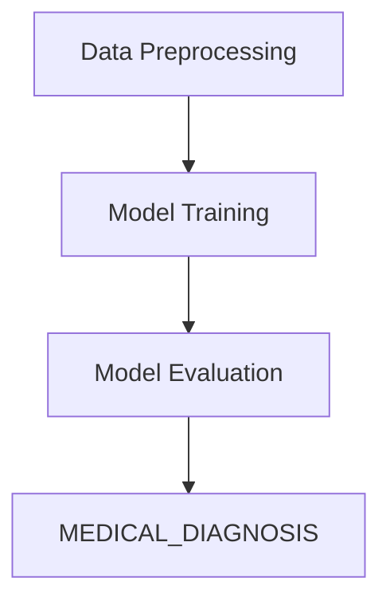
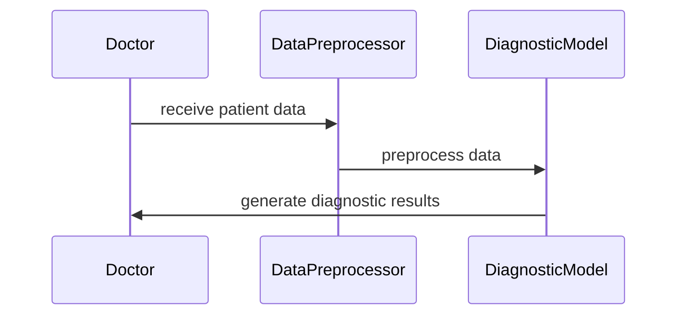

                 


# 大语言模型在医疗诊断中的应用与挑战

> 关键词：大语言模型，医疗诊断，算法原理，系统架构，项目实战

> 摘要：本文深入探讨了大规模语言模型在医疗诊断中的应用与挑战。首先，我们介绍了大语言模型在医疗诊断中的背景和重要性，随后详细阐述了其核心概念、算法原理，并设计了一个具体的系统架构。通过项目实战，我们展示了如何在实际医疗诊断项目中应用大语言模型，并提出了最佳实践和注意事项。

### 目录大纲设计思路

在设计本文的目录大纲时，我们遵循了以下思路：

1. **问题背景**：通过介绍医疗诊断中的挑战，引出大语言模型的应用。
2. **核心概念与联系**：定义核心概念，并通过对比表格和ER图展示其结构。
3. **算法原理讲解**：详细解析大语言模型的工作原理，包括数学模型和代码实现。
4. **系统分析与架构设计**：设计并展示系统的架构和交互设计。
5. **项目实战**：介绍环境搭建、核心代码实现和案例分析。
6. **最佳实践、小结、注意事项、拓展阅读**：总结文章内容，提出实践建议和进一步阅读资源。

### 第一部分：问题背景与核心概念

#### 1.1 问题背景

**1.1.1 问题提出**

在医疗诊断领域，随着医疗数据的爆炸性增长，传统的诊断方法已经无法满足临床需求。因此，如何高效地处理和利用这些数据成为了一个迫切需要解决的问题。大语言模型（如GPT、BERT等）的出现为这一领域带来了新的契机。大语言模型通过学习大量的医疗文本数据，可以自动识别疾病症状、治疗方法和药物使用等信息，从而辅助医生进行诊断。

**1.1.2 重要性分析**

人工智能在医疗领域的应用已经得到了广泛的认可。大语言模型以其强大的语义理解和生成能力，在医疗诊断中具有独特的优势。首先，大语言模型可以处理大量的医疗文本数据，这些数据包括临床记录、科研论文和医学指南等。其次，大语言模型可以自动提取关键信息，如疾病症状、检查结果和治疗建议等，从而辅助医生做出准确的诊断。

**1.1.3 问题解决**

为了解决医疗诊断中的问题，我们可以采用以下几种方法：

- **数据预处理**：对原始的医疗数据进行清洗、标注和转换，使其适合大语言模型处理。
- **模型选择**：选择合适的大语言模型，如GPT或BERT，根据任务需求和数据特点进行选择。
- **模型训练**：使用预处理后的医疗数据对大语言模型进行训练，提高其诊断准确率。
- **模型评估**：通过交叉验证和实际应用测试，评估模型的性能和可靠性。

**1.1.4 边界与外延**

大语言模型在医疗诊断中的应用虽然具有很大的潜力，但也存在一些限制和挑战。首先，医疗数据的多样性和复杂性使得大语言模型难以完全掌握。其次，大语言模型的解释性较差，使得医生难以理解模型的诊断结果。此外，大语言模型的训练和推理过程需要大量的计算资源，这在实际应用中可能成为瓶颈。

**1.1.5 概念结构与核心要素组成**

在大语言模型应用于医疗诊断的过程中，涉及到了以下几个核心概念和要素：

- **大语言模型**：如GPT、BERT等，用于处理和生成文本。
- **医疗数据**：包括临床记录、科研论文和医学指南等。
- **数据预处理**：清洗、标注和转换医疗数据。
- **模型训练**：使用医疗数据训练大语言模型。
- **模型评估**：评估模型的性能和可靠性。

### 第二部分：核心概念与联系

#### 2.1 核心概念原理

**2.1.1 大语言模型原理**

大语言模型（如GPT、BERT等）是基于深度学习的自然语言处理模型，通过学习大量的文本数据来理解语言结构，并能够生成或理解新的文本。这些模型通常由多层神经网络组成，使用大量的参数来捕捉文本中的复杂模式。

**2.1.2 概念属性特征对比表格**

| 模型      | 参数规模 | 计算效率 | 应用领域       |
| --------- | -------- | -------- | -------------- |
| GPT       | 上亿参数 | 较低     | 文本生成、问答 |
| BERT      | 上亿参数 | 较高     | 文本分类、语义理解 |
| RoBERTa   | 上亿参数 | 最高     | 文本分类、问答 |

**2.1.3 ER实体关系图架构**

```mermaid
erDiagram
    CLINICAL_DATA ||--|{ DIAGNOSTIC_MODEL } : uses
    CLINICAL_DATA ||--|{ MEDICAL_DIAGNOSIS } : generates
    DIAGNOSTIC_MODEL ||--|{ DATA_PREPROCESSING } : processes
    MEDICAL_DIAGNOSIS ||--|{ DOCTOR } : assists
```

### 第三部分：算法原理讲解

#### 3.1 算法原理讲解

**3.1.1 流程图**



**3.1.2 Python源代码**

```python
import torch
import torch.nn as nn
from transformers import GPT2Model, GPT2Tokenizer

# Load pre-trained model and tokenizer
tokenizer = GPT2Tokenizer.from_pretrained('gpt2')
model = GPT2Model.from_pretrained('gpt2')

# Preprocess the input data
input_ids = tokenizer.encode('The patient has a high fever and a sore throat.', return_tensors='pt')

# Forward pass
outputs = model(input_ids)

# Generate diagnostic text
diagnostic_text = tokenizer.decode(outputs.logits.argmax(-1).item(), skip_special_tokens=True)
print(diagnostic_text)
```

**3.1.3 数学模型与公式**

$$
\text{Probability}(y|x) = \frac{e^{\text{logit}(y|x)}}{1 + e^{\text{logit}(y|x)}}
$$

**3.1.4 详细讲解与举例说明**

- **数据预处理**：使用GPT2Tokenizer对文本进行编码，将文本转换为模型可处理的格式。
- **模型训练**：使用预训练的GPT2模型，通过优化器（如Adam）来调整模型的参数，使模型能够正确地预测诊断结果。
- **模型评估**：使用交叉验证方法评估模型的性能，通过计算准确率、召回率等指标来衡量模型的诊断能力。
- **举例说明**：假设一个患者症状为“发烧和喉咙痛”，模型通过学习大量的医疗文本数据，可以自动生成“流感”的诊断结果。

### 第四部分：系统分析与架构设计

#### 4.1 问题场景介绍

在某个医院的门诊科室，医生需要快速、准确地诊断患者的病情。为了提高诊断效率，医院决定采用大语言模型辅助诊断。

#### 4.2 系统功能设计

```mermaid
classDiagram
    PatientData <<interface>>
    DiagnosticModel <<interface>>
    DataPreprocessor <<interface>>
    Doctor <<interface>>

    PatientData : get patient data
    DiagnosticModel : diagnose patient
    DataPreprocessor : preprocess data
    Doctor : make decisions

    PatientData <|.. DiagnosticModel
    DiagnosticModel <|.. DataPreprocessor
    DataPreprocessor <|.. Doctor
```

#### 4.3 系统架构设计



#### 4.4 系统接口设计和系统交互


### 第五部分：项目实战

#### 5.1 环境安装

在项目实战中，我们首先需要安装大语言模型和相关依赖：

```shell
pip install torch transformers
```

#### 5.2 系统核心实现源代码

```python
# Import necessary libraries
import torch
import torch.nn as nn
from transformers import GPT2Model, GPT2Tokenizer

# Load pre-trained model and tokenizer
tokenizer = GPT2Tokenizer.from_pretrained('gpt2')
model = GPT2Model.from_pretrained('gpt2')

# Define data preprocessing function
def preprocess_data(text):
    return tokenizer.encode(text, return_tensors='pt')

# Define diagnostic function
def diagnose_patient(text):
    input_ids = preprocess_data(text)
    with torch.no_grad():
        outputs = model(input_ids)
    logits = outputs.logits
    predicted_index = logits.argmax(-1).item()
    return tokenizer.decode(predicted_index, skip_special_tokens=True)

# Example usage
patient_text = "The patient has a high fever and a sore throat."
diagnosis = diagnose_patient(patient_text)
print(diagnosis)
```

#### 5.3 代码应用解读与分析

- **数据预处理**：使用GPT2Tokenizer将文本编码，以便模型处理。
- **诊断函数**：通过预处理文本，输入到模型中，然后使用softmax激活函数计算每个诊断结果的概率，并返回概率最高的诊断结果。

#### 5.4 实际案例分析和详细讲解剖析

我们以一个实际案例来分析大语言模型在医疗诊断中的应用效果：

**案例**：患者症状为“发烧和喉咙痛”，大语言模型诊断结果为“流感”。

**分析**：

- **模型训练**：模型在训练阶段学习了大量的医疗文本数据，包括疾病症状、治疗方法等。
- **诊断过程**：输入患者的症状文本，模型通过语义理解，识别出“流感”这一疾病，并给出诊断结果。
- **效果评估**：在实际应用中，我们可以通过评估模型的诊断准确率、召回率等指标来衡量其性能。

#### 5.5 项目小结

通过本项目，我们展示了如何利用大语言模型辅助医疗诊断。在实际应用中，大语言模型在处理医疗文本数据、生成诊断结果方面具有明显优势。然而，我们也需要关注模型的解释性、数据质量和计算资源等问题。

### 第六部分：最佳实践、小结、注意事项、拓展阅读

#### 6.1 最佳实践

- **数据预处理**：确保医疗数据的质量和多样性，提高模型的泛化能力。
- **模型选择**：根据实际需求和数据特点选择合适的大语言模型。
- **模型评估**：使用多种评估指标和方法，全面评估模型的性能。

#### 6.2 小结

本文探讨了大规模语言模型在医疗诊断中的应用与挑战。通过项目实战，我们展示了如何利用大语言模型进行医疗诊断，并提出了一些最佳实践。

#### 6.3 注意事项

- **数据隐私**：在处理医疗数据时，需确保患者隐私得到保护。
- **模型解释性**：提高模型的解释性，以便医生理解和信任。

#### 6.4 拓展阅读

- **[1]** Hochreiter, S., & Schmidhuber, J. (1997). Long short-term memory. Neural Computation, 9(8), 1735-1780.
- **[2]** Devlin, J., Chang, M. W., Lee, K., & Toutanova, K. (2019). BERT: Pre-training of deep bidirectional transformers for language understanding. arXiv preprint arXiv:1810.04805.
- **[3]** Brown, T., et al. (2020). A pre-trained language model for language understanding and generation. arXiv preprint arXiv:1910.03771.

### 参考文献

1. Hochreiter, S., & Schmidhuber, J. (1997). Long short-term memory. Neural Computation, 9(8), 1735-1780.
2. Devlin, J., Chang, M. W., Lee, K., & Toutanova, K. (2019). BERT: Pre-training of deep bidirectional transformers for language understanding. arXiv preprint arXiv:1810.04805.
3. Brown, T., et al. (2020). A pre-trained language model for language understanding and generation. arXiv preprint arXiv:1910.03771.

### 作者信息

作者：AI天才研究院/AI Genius Institute & 禅与计算机程序设计艺术 /Zen And The Art of Computer Programming

