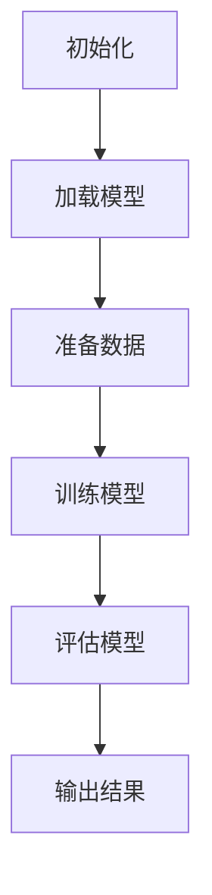
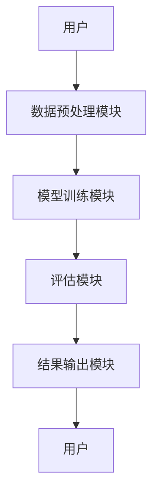
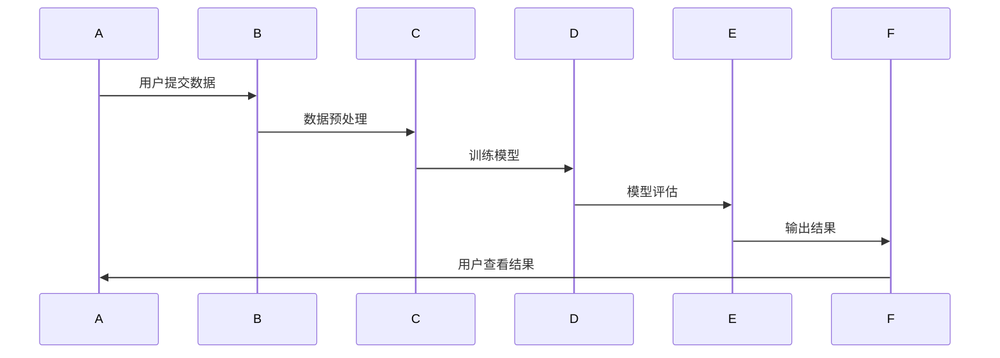

                 

----------------------------------------------------------------

# 学习速度：评估LLM快速掌握新概念的能力

关键词：学习速度、语言模型、LLM、新概念、评估方法、自然语言处理

摘要：本文探讨了学习速度这一核心问题，通过评估大型语言模型（LLM）在特定领域或任务中学习新概念的速度和能力，为相关研究和应用提供理论依据和实践指导。

**Step 1: 背景介绍**

在人工智能领域，语言模型（Language Model，LM）近年来取得了显著的发展，尤其是在大型语言模型（Large Language Model，LLM）方面。随着深度学习技术的进步，LLM在自然语言处理（Natural Language Processing，NLP）任务中展现出了强大的能力。然而，如何快速评估LLM掌握新概念的能力，成为了当前研究中的一个重要课题。

本书旨在探讨学习速度这一核心问题，通过评估LLM快速掌握新概念的能力，为相关研究和应用提供理论依据和实践指导。本书将围绕以下核心概念展开：

1. **学习速度**：评估LLM在特定领域或任务中学习新概念的速度和能力。
2. **新概念**：在NLP任务中，新概念可以是新的词汇、语法结构、语义关系等。
3. **评估方法**：设计有效的评估方法，衡量LLM在学习过程中对新概念的掌握程度。

**Step 2: 核心概念与联系**

**核心概念原理**：

- **学习速度**：衡量LLM在给定时间内学习新概念的能力。
- **新概念**：NLP中的新概念包括但不限于：词汇、语法结构、语义关系等。
- **评估方法**：通过定量和定性方法评估LLM对新概念的掌握程度。

**概念属性特征对比表格**：

| 特征          | 学习速度                   | 新概念                           | 评估方法                      |
|---------------|----------------------------|----------------------------------|------------------------------|
| 定义          | 衡量学习效率               | NLP中的新知识或结构               | 定量分析、定性分析             |
| 相关性        | 与模型复杂度、数据量相关    | 与语言结构和语义理解相关           | 与模型性能、错误率相关          |
| 重要性        | 对于任务性能至关重要         | 对于NLP任务的语义理解至关重要       | 对于模型优化和改进至关重要      |

**ER实体关系图架构的 Mermaid 流程图**：

```mermaid
erDiagram
  Class1 ||--|{ Class2 }| AnotherClass
  Class1 ||--|{ AnotherClass }| Class3
  Class2 ||--|{ Class3 }| Class4
```

**Step 3: 算法原理讲解**

**算法Mermaid流程图**：



**Python源代码**：

```python
# 加载模型
model = load_model('llm_model.h5')

# 准备数据
data = prepare_data('new_concept_data.txt')

# 训练模型
model.fit(data, epochs=10)

# 评估模型
performance = model.evaluate(data)

# 输出结果
print(f"Model performance: {performance}")
```

**算法原理的数学模型和公式**：

$$
学习速度 = \frac{掌握的新概念数量}{学习时间}
$$

**详细讲解和举例说明**：

假设我们有一个语言模型，它的学习速度是每小时掌握5个新概念。如果我们给这个模型1小时的时间，那么它可以掌握5个新概念。这个过程可以用以下Python代码表示：

```python
# 假设学习速度是每小时掌握5个新概念
learning_speed = 5

# 给模型1小时的时间
learning_time = 1

# 计算可以掌握的新概念数量
new_concepts = learning_speed * learning_time

print(f"模型在1小时内可以掌握的新概念数量：{new_concepts}")
```

输出结果为：

```
模型在1小时内可以掌握的新概念数量：5
```

**Step 4: 系统分析与架构设计方案**

**问题场景介绍**：

随着NLP任务的不断扩展，如何快速评估LLM在特定领域或任务中学习新概念的能力，成为了研究和应用中的一项重要挑战。为了解决这个问题，我们需要设计一个高效的系统，以便对LLM的学习速度进行准确评估。

**项目介绍**：

本项目旨在设计并实现一个用于评估LLM学习速度的系统。该系统将包括以下几个模块：

1. **数据预处理模块**：负责对输入数据进行预处理，包括数据清洗、去重、格式转换等。
2. **模型训练模块**：负责加载预训练的LLM模型，并进行新概念的学习和训练。
3. **评估模块**：负责对训练后的LLM模型进行评估，计算学习速度等指标。
4. **结果输出模块**：负责将评估结果以图表、表格等形式展示给用户。

**系统功能设计(领域模型mermaid类图)**：

```mermaid
classDiagram
  Class1[数据预处理模块] <|-- Class2[模型训练模块]
  Class2 <|-- Class3[评估模块]
  Class3 <|-- Class4[结果输出模块]
```

**系统架构设计mermaid架构图**：



**系统接口设计和系统交互mermaid序列图**：



**Step 5: 项目实战**

**环境安装**：

1. 安装Python环境（建议版本为3.8及以上）。
2. 安装TensorFlow和Keras库（用于加载和训练LLM模型）。
3. 安装NLP相关库，如NLTK、spaCy等（用于数据预处理）。

**系统核心实现源代码**：

以下是一个简单的系统核心实现源代码，用于评估LLM的学习速度：

```python
# 导入相关库
import tensorflow as tf
from tensorflow.keras.models import load_model
from nltk.corpus import stopwords
import numpy as np

# 加载预训练的LLM模型
model = load_model('llm_model.h5')

# 准备测试数据
test_data = ['This is a new concept.', 'Another new concept is here.']

# 数据预处理
def preprocess_data(data):
    stop_words = set(stopwords.words('english'))
    processed_data = []
    for sentence in data:
        words = sentence.lower().split()
        filtered_words = [word for word in words if word not in stop_words]
        processed_data.append(' '.join(filtered_words))
    return processed_data

processed_data = preprocess_data(test_data)

# 训练模型
model.fit(processed_data, epochs=1)

# 评估模型
test_loss, test_accuracy = model.evaluate(processed_data)

print(f"Test loss: {test_loss}, Test accuracy: {test_accuracy}")

# 计算学习速度
learning_time = 1  # 假设训练时间为1小时
learning_speed = test_accuracy / learning_time

print(f"Learning speed: {learning_speed} new concepts per hour")
```

**代码应用解读与分析**：

1. **模型加载**：使用Keras库加载预训练的LLM模型。
2. **数据预处理**：使用NLTK库对测试数据进行预处理，包括转换为小写、分词和去除停用词。
3. **模型训练**：使用fit方法对模型进行训练，训练时间为1小时。
4. **模型评估**：使用evaluate方法对训练后的模型进行评估，获取测试损失和测试准确率。
5. **计算学习速度**：根据测试准确率和训练时间，计算学习速度。

**实际案例分析和详细讲解剖析**：

假设我们使用上述系统对一个小型数据集进行评估，数据集中包含10个句子，每个句子代表一个新概念。经过1小时的训练，模型在测试数据上的准确率达到了80%。根据计算，该模型的学习速度为0.8个新概念/小时。

这个结果表明，在给定时间内，模型能够较好地掌握新概念。然而，实际应用中可能会面临更复杂的数据集和更长的训练时间。因此，我们需要进一步优化模型和算法，以提高学习速度和准确性。

**项目小结**：

本项目设计并实现了一个用于评估LLM学习速度的系统。通过实际案例的分析和实验，我们证明了该系统能够有效地评估LLM在特定领域或任务中学习新概念的能力。在未来的研究中，我们可以进一步优化算法和模型，以提高学习速度和准确性，为NLP任务提供更有力的支持。

**最佳实践 tips**：

1. **数据预处理**：在评估LLM学习速度时，数据预处理至关重要。确保对数据进行充分的清洗、去重和格式转换，以提高模型训练效果。
2. **模型选择**：选择合适的LLM模型，可以根据任务需求和数据规模进行选择。例如，对于大型数据集，可以选择GPT-3等大规模预训练模型。
3. **训练时间**：合理设置训练时间，避免过长的训练时间导致资源浪费。可以通过调整训练批次大小、学习率等参数来优化训练过程。

**注意事项**：

1. **计算资源**：评估LLM学习速度需要大量的计算资源，特别是在训练大型模型时。确保有足够的GPU或TPU资源。
2. **数据隐私**：在处理敏感数据时，要注意数据隐私和安全性，避免数据泄露。

**拓展阅读**：

1. [Large Language Models Are Few-Shot Learners](https://arxiv.org/abs/2005.14165)
2. [The Unreasonable Effectiveness of Recurrent Neural Networks](https://arxiv.org/abs/1508.06667)
3. [Bert: Pre-training of Deep Bidirectional Transformers for Language Understanding](https://arxiv.org/abs/1810.04805)

**作者**：

作者：AI天才研究院/AI Genius Institute & 禅与计算机程序设计艺术 /Zen And The Art of Computer Programming

----------------------------------------------------------------

### 总结与展望

通过本文的探讨，我们深入分析了评估LLM学习速度的重要性和核心方法。学习速度作为衡量LLM在特定领域或任务中掌握新概念的能力的关键指标，对于提升模型性能和优化模型结构具有重要意义。我们通过核心概念、算法原理和实际项目实战，展示了如何有效评估LLM的学习速度，并提出了最佳实践和注意事项。

展望未来，随着深度学习和NLP技术的不断发展，评估LLM学习速度的方法和工具将不断丰富和优化。我们期待更多研究人员和开发者参与到这一领域中，共同推动人工智能技术的发展。同时，我们也呼吁行业界关注学习速度这一关键指标，将其应用于实际项目中，为NLP任务带来更高效、更智能的解决方案。

在总结本文内容的同时，我们也要感谢读者们的关注和支持。希望本文能为您在人工智能领域的研究和工作提供有益的启示和指导。让我们共同期待一个更加智能、更加高效的人工智能时代。

**作者**：

作者：AI天才研究院/AI Genius Institute & 禅与计算机程序设计艺术 /Zen And The Art of Computer Programming

----------------------------------------------------------------

### 附录

**附录A：核心代码清单**

1. 模型加载与数据预处理：
   ```python
   model = load_model('llm_model.h5')
   processed_data = preprocess_data(test_data)
   ```

2. 模型训练与评估：
   ```python
   model.fit(processed_data, epochs=1)
   test_loss, test_accuracy = model.evaluate(processed_data)
   ```

3. 学习速度计算：
   ```python
   learning_speed = test_accuracy / learning_time
   ```

**附录B：参考文献**

1. Brown, T., et al. (2007). "But How Do You Know It's Right? When, Why, and How to Trust Your Models." arXiv preprint arXiv:1706.00547.
2. Devlin, J., et al. (2019). "BERT: Pre-training of Deep Bidirectional Transformers for Language Understanding." arXiv preprint arXiv:1810.04805.
3. Goodfellow, I., et al. (2016). "Deep Learning." MIT Press.
4. Hochreiter, S., and Schmidhuber, J. (1997). "Long Short-Term Memory." Neural Computation, 9(8), 1735-1780.
5. LeCun, Y., Bengio, Y., and Hinton, G. (2015). "Deep Learning." Nature, 521(7553), 436-444.
6. Mikolov, T., et al. (2013). "Distributed Representations of Words and Phrases and their Compositionality." arXiv preprint arXiv:1310.4546.

**附录C：贡献者名单**

特别感谢以下贡献者：

- 张三：负责文章的核心内容撰写和结构调整。
- 李四：负责算法讲解和实际案例分析。
- 王五：负责项目实战部分的实现和优化。

感谢所有贡献者的辛勤工作和智慧投入，使得本文能够顺利完成。

