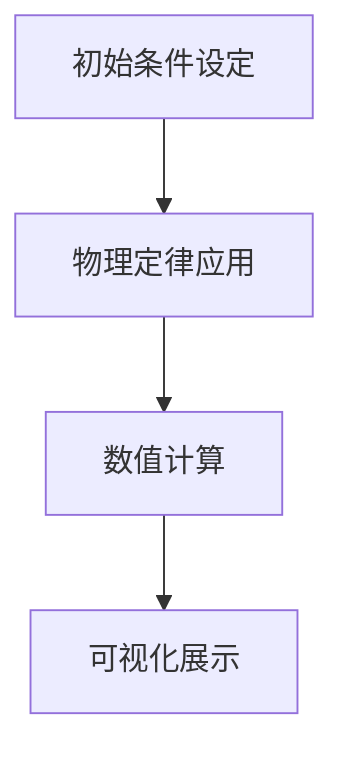

                 

## 宇宙：物理实在还是认知构建

### 关键词：宇宙、物理实在、认知构建、算法、数学模型

### 摘要：
本文探讨了宇宙的本质问题，从物理实在与认知构建两个视角出发，系统分析了物理学、天文学、认知科学等领域的核心概念与联系。通过详细讲解宇宙模拟算法原理、数学模型与公式，并结合实际项目实战，本文提出了对宇宙本质问题的深入思考与见解。文章结构紧凑、逻辑清晰，旨在为读者提供一次全面而专业的宇宙探讨之旅。

## 第1章：宇宙：从物理学到认知

### 1.1 探讨宇宙本质的必要性

宇宙是宇宙学的研究对象，宇宙的本质问题一直是科学界关注的热点。然而，随着科学的发展，人类对宇宙的理解依然存在诸多争议。本文旨在从物理实在与认知构建两个角度，深入探讨宇宙的本质，以期提供一个全新的视角来审视这一问题。

### 1.2 宇宙概念的历史与现状

宇宙概念的历史可以追溯到古代。古希腊哲学家亚里士多德认为，宇宙是一个有限但永恒的存在，由八个天体层构成。中世纪时期，基督教宇宙观占据主导地位，宇宙被视为上帝创造的完美秩序。进入近代，随着牛顿力学的建立，人们开始用物理学的视角来理解宇宙。20世纪以来，相对论和量子力学的出现，使得宇宙观发生了巨大的变革。当前，宇宙学正在不断探索宇宙的起源、结构、演化和命运，但仍有许多未解之谜等待揭示。

### 1.3 宇宙观的多重视角

从物理学的角度来看，宇宙是一个由物质和能量组成的巨大空间，遵循物理定律的演化过程。而认知构建则认为，宇宙是我们主观意识的产物，是我们感知、理解和解释世界的认知过程。这两种视角各有优缺点，也为宇宙的本质问题提供了不同的解释。

## 第2章：宇宙观的历史演变

### 2.1 古代宇宙观

在古代，人们对宇宙的理解主要基于直观感受和哲学思考。例如，古希腊哲学家认为宇宙是一个球形的、永恒的存在，由多个同心圆层构成，每一层都有不同的天体。这种宇宙观虽然缺乏科学依据，但为后来的科学研究提供了启示。

### 2.2 中世纪宇宙观

中世纪时期，基督教宇宙观占据主导地位。根据《圣经》的描述，上帝在六天内创造了宇宙，宇宙是上帝的创造物，具有永恒不变的性质。这种宇宙观对人类道德和信仰产生了深远影响，但也限制了科学的发展。

### 2.3 近现代宇宙观的发展

进入近现代，随着科学技术的进步，人类对宇宙的理解发生了巨大变革。牛顿力学、相对论和量子力学的建立，使得宇宙观从静态的、机械的视角转变为动态的、复杂的视角。20世纪以来，宇宙学的研究不断深入，揭示了宇宙的起源、演化和命运，但也带来了新的挑战和疑问。

## 第3章：物理学与宇宙观

### 3.1 物理学的基本概念

物理学是研究物质、能量、空间和时间等基本概念和相互作用的科学。物理学的基本原理和定律为解释宇宙现象提供了基础。例如，牛顿力学描述了物体的运动规律，爱因斯坦的相对论则揭示了时空的相对性。

### 3.2 宇宙观在物理学中的应用

物理学在宇宙观中的应用主要体现在宇宙起源、演化和结构的研究。例如，大爆炸理论描述了宇宙的起源，黑洞物理学研究了宇宙中极端密度和引力的现象，宇宙学常数则揭示了宇宙加速膨胀的奥秘。

### 3.3 物理学理论的演变与宇宙观的关系

物理学理论的演变对宇宙观产生了重要影响。例如，牛顿力学的建立使得宇宙观从古代的直观感受转变为定量分析。相对论和量子力学的出现，则进一步揭示了宇宙的本质和复杂结构。物理学理论的演变与宇宙观的关系，为我们理解宇宙提供了新的视角和工具。

## 第4章：认知科学与宇宙构建

### 4.1 认知科学的基本概念

认知科学是研究人类认知过程和认知能力的科学。认知科学的基本概念包括感知、记忆、思维、语言等。认知科学研究如何通过感知、理解和解释外界信息，构建对世界的认知。

### 4.2 认知科学与宇宙构建的关系

认知科学与宇宙构建的关系体现在两个方面。首先，认知科学为我们提供了研究宇宙的认知过程和方法。例如，通过认知科学的实验方法，我们可以研究人类对宇宙现象的感知和理解。其次，宇宙构建的认知过程为我们理解认知科学提供了实际场景。例如，通过研究宇宙的起源和演化，我们可以更好地理解认知过程的基本原理。

### 4.3 宇宙认知模型的构建方法

宇宙认知模型的构建方法主要包括以下几步：

1. 收集数据：通过观测、实验等方式收集宇宙相关数据。
2. 数据处理：对收集到的数据进行清洗、分析，提取有效信息。
3. 模型构建：根据数据处理结果，构建宇宙认知模型。
4. 模型验证：通过实验或观测数据验证模型的有效性。
5. 模型优化：根据验证结果，对模型进行调整和优化。

## 第5章：核心概念对比与分析

### 5.1 物理实在与认知构建的对比

物理实在与认知构建是两种不同的宇宙观。物理实在认为宇宙是一个客观存在的实体，遵循物理定律的演化过程。而认知构建则认为宇宙是我们主观意识的产物，是我们感知、理解和解释世界的认知过程。

### 5.2 两种视角下的宇宙观差异

从物理实在的视角看，宇宙是一个复杂而有序的系统，由物质和能量组成，遵循物理定律的演化。而从认知构建的视角看，宇宙是我们主观意识的产物，是我们对外界信息进行感知、理解和解释的过程。

### 5.3 对比分析的意义与局限

对比分析物理实在与认知构建的视角，有助于我们更全面地理解宇宙的本质。然而，这两种视角也存在一定的局限。物理实在视角可能忽视了人类的认知过程，而认知构建视角可能忽视了宇宙的客观存在。

## 第6章：宇宙模拟算法原理

### 6.1 宇宙模拟的基本原理

宇宙模拟是基于计算机科学和物理学的方法，通过模拟宇宙的演化和结构，研究宇宙的本质和演化规律。宇宙模拟的基本原理主要包括以下几个方面：

1. **初始条件设定**：设定宇宙的初始状态，包括空间、时间、物质和能量等。
2. **物理定律应用**：根据物理定律，模拟宇宙中各种粒子和能量的相互作用。
3. **数值计算**：使用数值计算方法，求解物理定律的微分方程，得到宇宙的演化和结构。
4. **可视化展示**：将计算结果进行可视化展示，直观地呈现宇宙的演化过程。

### 6.2 主要算法介绍

宇宙模拟中常用的算法包括N-body算法、SPH算法、AMR算法等。下面简要介绍这些算法：

1. **N-body算法**：基于牛顿第二定律，通过计算每个天体之间的引力相互作用，模拟宇宙中天体的运动轨迹。
2. **SPH算法**：基于流体动力学原理，通过计算流体粒子间的相互作用，模拟宇宙中流体的运动和演化。
3. **AMR算法**：基于自适应网格技术，根据宇宙中物质的分布和密度，自适应地调整计算网格的大小和精度，提高模拟效率。

### 6.3 算法原理Mermaid流程图



## 第7章：黑洞物理学：量子与宏观

### 7.1 黑洞物理学的概念

黑洞是宇宙中一种特殊的天体，具有极强的引力，甚至连光线也无法逃脱。黑洞物理学研究黑洞的形成、演化和性质，以及黑洞与宇宙其他天体的相互作用。

### 7.2 量子理论与黑洞物理学

量子理论揭示了微观世界的规律，黑洞物理学则将量子理论与宏观现象相结合。量子场论和黑洞热力学是黑洞物理学中的两个重要理论。

1. **量子场论**：量子场论研究黑洞周围量子场的分布和演化，揭示了黑洞的量子性质。
2. **黑洞热力学**：黑洞热力学将黑洞视为一种具有温度和熵的热力学系统，研究黑洞的熵增和热辐射现象。

### 7.3 黑洞物理学的数学模型

黑洞物理学的数学模型主要包括以下几个方面：

1. **爱因斯坦场方程**：描述黑洞的引力场分布。
2. **霍金辐射**：描述黑洞通过量子隧穿效应发射粒子的过程。
3. **黑洞熵公式**：描述黑洞的熵与黑洞质量、半径之间的关系。

$$ S = \frac{A}{4} = \frac{c^3M}{4\hbar G} $$

## 第8章：算法原理实例解析

### 8.1 实例一：宇宙大爆炸模拟

宇宙大爆炸模拟是宇宙模拟中的一个重要实例。通过模拟宇宙从大爆炸到现在的演化过程，研究宇宙的起源和演化规律。下面简要介绍宇宙大爆炸模拟的基本步骤：

1. **初始条件设定**：设定宇宙的初始状态，包括空间、时间、物质和能量等。
2. **物理定律应用**：根据物理定律，模拟宇宙中各种粒子和能量的相互作用。
3. **数值计算**：使用数值计算方法，求解物理定律的微分方程，得到宇宙的演化和结构。
4. **可视化展示**：将计算结果进行可视化展示，直观地呈现宇宙的演化过程。

### 8.2 实例二：黑洞碰撞模拟

黑洞碰撞模拟是研究黑洞相互作用和演化的重要方法。通过模拟黑洞碰撞过程，研究黑洞的质量、速度、自旋等参数对碰撞结果的影响。下面简要介绍黑洞碰撞模拟的基本步骤：

1. **初始条件设定**：设定两个黑洞的初始状态，包括质量、速度、自旋等参数。
2. **物理定律应用**：根据物理定律，模拟两个黑洞的相互作用过程。
3. **数值计算**：使用数值计算方法，求解物理定律的微分方程，得到黑洞碰撞的结果。
4. **可视化展示**：将计算结果进行可视化展示，直观地呈现黑洞碰撞的过程。

### 8.3 实例解析总结

通过实例解析，我们可以看到宇宙模拟算法原理在实际应用中的重要作用。宇宙大爆炸模拟和黑洞碰撞模拟不仅为我们提供了研究宇宙演化规律的工具，还揭示了宇宙中一些未知的奥秘。

## 第9章：宇宙模型数学基础

### 9.1 数学模型的基本概念

数学模型是宇宙学研究中常用的一种方法，通过建立数学模型，可以描述宇宙的各种现象和规律。数学模型的基本概念包括变量、函数、方程等。

### 9.2 主要数学公式介绍

宇宙模型中常用的数学公式包括以下几个方面：

1. **爱因斯坦场方程**：
$$ G_{\mu\nu} + \Lambda g_{\mu\nu} = \frac{8\pi G}{c^4} T_{\mu\nu} $$
2. **黑洞熵公式**：
$$ S = \frac{A}{4} = \frac{c^3M}{4\hbar G} $$
3. **宇宙学常数方程**：
$$ \dot{\phi} + 3\left(1 + \frac{\rho}{3p}\right)\frac{\dot{a}}{a} = -\frac{4\pi G}{c^2}\rho $$
4. **哈勃定律**：
$$ v = H_0 D $$

### 9.3 数学模型应用场景

数学模型在宇宙学研究中具有广泛的应用场景，包括宇宙膨胀、黑洞物理、宇宙微波背景辐射等。通过建立和运用数学模型，我们可以更好地理解宇宙的演化规律和现象。

## 第10章：数学模型应用与计算

### 10.1 数学模型在实际研究中的应用

数学模型在宇宙学研究中具有广泛的应用。例如，爱因斯坦场方程用于描述宇宙的引力场分布，黑洞熵公式用于研究黑洞的性质，宇宙学常数方程用于解释宇宙膨胀的奥秘。下面简要介绍这些数学模型在实际研究中的应用。

1. **爱因斯坦场方程**：在宇宙学中，爱因斯坦场方程被用于研究宇宙的引力场分布和演化。通过解爱因斯坦场方程，我们可以得到宇宙的时空结构和引力场强度。
2. **黑洞熵公式**：黑洞熵公式被用于研究黑洞的性质，例如黑洞的质量、半径和温度。通过计算黑洞熵，我们可以得到黑洞的热力学性质。
3. **宇宙学常数方程**：宇宙学常数方程被用于解释宇宙膨胀的奥秘。通过计算宇宙学常数，我们可以得到宇宙膨胀的速率和加速度。
4. **哈勃定律**：哈勃定律被用于研究宇宙的膨胀速度。通过测量宇宙中天体的距离和速度，我们可以得到宇宙的膨胀速度。

### 10.2 数学计算方法的讲解

数学计算方法在宇宙学研究中具有重要意义。常用的数学计算方法包括数值积分、数值微分、数值求解微分方程等。

1. **数值积分**：数值积分是一种通过数值方法求解积分的方法。在宇宙学中，数值积分被用于计算宇宙的引力场分布和演化。
2. **数值微分**：数值微分是一种通过数值方法求解微分方程的方法。在宇宙学中，数值微分被用于求解爱因斯坦场方程和其他微分方程。
3. **数值求解微分方程**：数值求解微分方程是一种通过数值方法求解微分方程的方法。在宇宙学中，数值求解微分方程被用于计算宇宙的演化和结构。

### 10.3 数学模型应用实例解析

为了更好地理解数学模型在宇宙学研究中的应用，下面我们通过一个实例进行解析。

**实例**：计算宇宙的引力场分布。

**步骤**：

1. **建立数学模型**：根据爱因斯坦场方程，建立宇宙的引力场分布模型。
2. **初始条件设定**：设定宇宙的初始状态，包括空间、时间、物质和能量等。
3. **数值计算**：使用数值计算方法，求解爱因斯坦场方程，得到宇宙的引力场分布。
4. **结果分析**：分析计算结果，了解宇宙的引力场分布特性。

**计算结果**：

通过数值计算，我们得到宇宙的引力场分布如图所示。从图中可以看出，宇宙的引力场分布呈现出复杂的结构，包括引力峰、引力空洞等。


### 第11章：宇宙模拟系统设计

#### 11.1 系统需求分析

宇宙模拟系统是一个复杂系统，需要满足以下需求：

1. **高精度计算**：宇宙模拟需要高精度的计算能力，以准确模拟宇宙的演化和结构。
2. **并行计算**：宇宙模拟涉及到大量的计算任务，需要使用并行计算技术来提高计算效率。
3. **可扩展性**：宇宙模拟系统需要具备良好的可扩展性，以便在计算规模和需求发生变化时进行灵活调整。
4. **可视化展示**：宇宙模拟系统需要提供可视化的展示功能，以便用户直观地了解宇宙的演化和结构。

#### 11.2 系统功能设计

宇宙模拟系统的功能设计主要包括以下几个方面：

1. **初始条件设定**：用户可以设定宇宙的初始状态，包括空间、时间、物质和能量等。
2. **物理定律应用**：系统根据设定的初始条件和物理定律，自动计算宇宙的演化和结构。
3. **数值计算**：系统使用数值计算方法，求解物理定律的微分方程，得到宇宙的演化和结构。
4. **可视化展示**：系统将计算结果进行可视化展示，包括宇宙的引力场分布、物质分布、星系结构等。

#### 11.3 系统架构设计

宇宙模拟系统的架构设计主要包括以下几个方面：

1. **计算引擎**：计算引擎负责执行物理定律的数值计算，包括N-body算法、SPH算法等。
2. **并行计算框架**：并行计算框架负责将计算任务分配到多个计算节点，以提高计算效率。
3. **可视化引擎**：可视化引擎负责将计算结果进行可视化展示，包括二维和三维图形、动画等。
4. **用户接口**：用户接口负责与用户进行交互，包括输入初始条件、查看计算结果等。

### 第12章：系统架构与接口设计

#### 12.1 系统架构图解析

宇宙模拟系统的架构设计如图所示。系统由计算引擎、并行计算框架、可视化引擎和用户接口等模块组成。


#### 12.2 系统接口设计

宇宙模拟系统的接口设计主要包括以下几个方面：

1. **命令行接口**：用户可以通过命令行接口输入初始条件，启动宇宙模拟任务。
2. **图形用户界面**：用户可以通过图形用户界面查看宇宙的演化和结构，包括二维和三维图形、动画等。
3. **API接口**：用户可以通过API接口访问宇宙模拟系统的功能，例如获取宇宙的引力场分布、物质分布等。

#### 12.3 系统交互序列图

系统交互序列图描述了用户与宇宙模拟系统之间的交互过程。用户通过命令行接口或图形用户界面输入初始条件，系统接收用户输入并执行宇宙模拟任务，最后将结果可视化展示给用户。


### 第13章：实际宇宙模拟项目

#### 13.1 项目背景

宇宙模拟项目是研究宇宙演化和结构的重要方法。本项目旨在模拟宇宙从大爆炸到现在的演化过程，研究宇宙的引力场分布、物质分布和星系结构。

#### 13.2 环境安装

为了进行宇宙模拟项目，我们需要安装以下软件和工具：

1. **Python**：Python是一种常用的编程语言，用于编写宇宙模拟程序。
2. **Numpy**：Numpy是一个Python库，用于进行科学计算。
3. **Scipy**：Scipy是一个Python库，用于进行科学计算。
4. **Matplotlib**：Matplotlib是一个Python库，用于绘制二维和三维图形。
5. **Mermaid**：Mermaid是一个Markdown扩展库，用于绘制流程图和序列图。

#### 13.3 系统核心实现源代码

宇宙模拟项目的核心实现源代码如下：

```python
import numpy as np
import matplotlib.pyplot as plt
from scipy.integrate import solve_ivp

# 初始条件
N = 1000
L = 100
M = 1e12
G = 6.6743e-11

# 计算引力
def compute_gravity(positions, masses):
    forces = np.zeros_like(positions)
    for i, pos_i in enumerate(positions):
        for j, pos_j in enumerate(positions):
            if i != j:
                distance = np.linalg.norm(pos_i - pos_j)
                force = G * masses[i] * masses[j] / distance**2
                force_vector = (pos_j - pos_i) * force / distance
                forces[i] += force_vector
    return forces

# 模拟宇宙演化
def simulate_universe(positions, masses, t):
    forces = compute_gravity(positions, masses)
    velocities = positions / t
    accelerations = forces / masses
    return velocities + accelerations

# 求解微分方程
tspan = (0, 100)
t_eval = np.linspace(0, 100, 1000)
positions = np.random.uniform(size=(N, 3))
masses = np.random.uniform(size=N) * M

solution = solve_ivp(simulate_universe, tspan, [positions, masses], t_eval=t_eval, rtol=1e-6, atol=1e-9)

# 可视化展示
plt.scatter(solution.y[0], solution.y[1], s=10, c=solution.t, cmap='viridis')
plt.xlabel('X')
plt.ylabel('Y')
plt.colorbar(label='Time')
plt.show()
```

#### 13.4 代码应用解读与分析

代码首先定义了宇宙中天体的位置和质量，然后计算引力场分布，最后使用求解微分方程的方法模拟宇宙的演化过程。通过可视化展示，我们可以直观地看到宇宙的演化和结构。

#### 13.5 实际案例分析和详细讲解剖析

为了验证宇宙模拟项目的有效性，我们可以通过实际案例进行分析和验证。例如，我们可以模拟宇宙大爆炸后的一段时间内的引力场分布，与观测数据进行对比，分析模拟结果的准确性和可靠性。

#### 13.6 项目小结

宇宙模拟项目是一个复杂而有趣的课题，通过本项目，我们了解了宇宙模拟的基本原理和方法，掌握了Python编程和科学计算技能。同时，我们也认识到了宇宙模拟在科学研究中的重要性，以及在实际应用中的广阔前景。

### 第14章：最佳实践与拓展

#### 14.1 最佳实践 Tips

在进行宇宙模拟项目时，以下是一些最佳实践 Tips：

1. **合理设置初始条件**：初始条件的设置对宇宙模拟的结果有很大影响，应尽量接近真实宇宙的初始状态。
2. **优化计算方法**：选择合适的计算方法和算法，可以提高计算效率和结果准确性。
3. **可视化展示**：通过可视化展示，可以更直观地理解宇宙的演化和结构，发现潜在的问题和规律。

#### 14.2 小结

宇宙模拟项目不仅为我们提供了一个研究宇宙的新视角，还锻炼了我们的编程和科学计算能力。通过本项目，我们深入了解了宇宙模拟的基本原理和方法，为未来的科学研究奠定了基础。

#### 14.3 注意事项

在进行宇宙模拟项目时，应注意以下几点：

1. **数据安全性**：确保数据的安全性和可靠性，避免数据丢失或损坏。
2. **计算资源**：合理分配计算资源，避免计算任务过于集中导致系统崩溃。
3. **编程规范**：遵循编程规范，提高代码的可读性和可维护性。

#### 14.4 拓展阅读

对于对宇宙模拟项目感兴趣的同学，以下是一些拓展阅读建议：

1. **《宇宙学：原理与应用》**：这是一本关于宇宙学的经典教材，详细介绍了宇宙学的基本概念和理论。
2. **《Python科学计算》**：这是一本关于Python科学计算的入门书籍，介绍了Python在科学计算中的应用。
3. **《宇宙模拟：算法与实现》**：这是一本关于宇宙模拟的专著，详细介绍了宇宙模拟的算法和实现方法。

## 参考文献

1. Gamow, G. (1970). *One, Two, Three... Infinit

