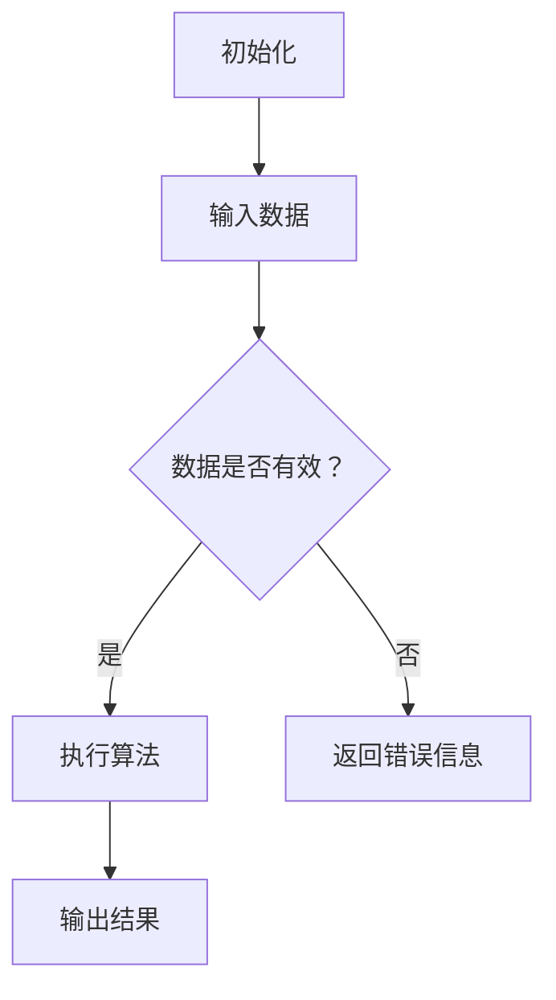
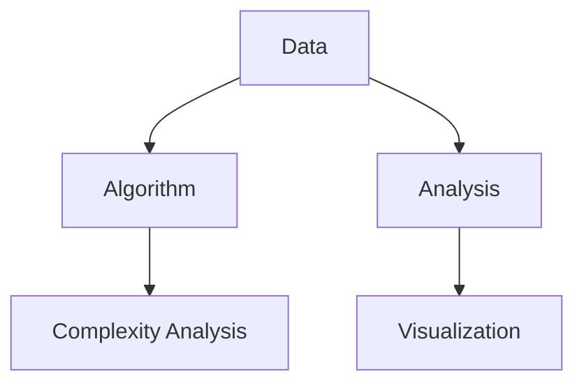
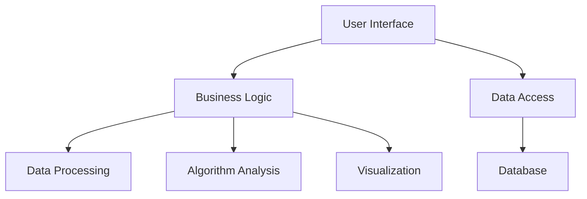
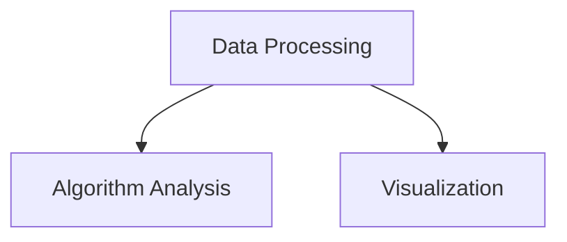
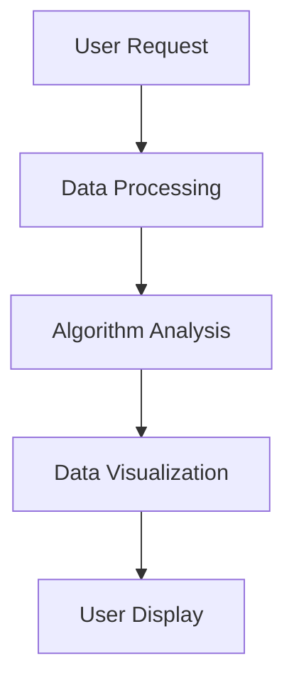

                 

### 宇宙常数与程序空间复杂度的基本概念

#### 第1章：宇宙常数概述

##### 1.1 宇宙常数的重要性

宇宙常数是一个描述宇宙基本性质的关键参数，通常用符号\( c \)表示。它代表光在真空中的速度，约为\( 3 \times 10^8 \)米/秒。这一常数是物理学中最为基础和重要的参数之一，对于理解宇宙的起源、演化和结构至关重要。

###### 1.1.1 宇宙常数的概念

宇宙常数是一个在物理学中非常重要的参数，它在各种理论模型和观测数据中均占有核心地位。具体来说，宇宙常数出现在爱因斯坦的广义相对论场方程中，作为一个自由参数，它表征了宇宙的几何属性和物质分布。

在广义相对论中，爱因斯坦场方程描述了物质和能量如何通过引力作用影响时空的几何结构。场方程的一般形式为：

\[ G_{\mu\nu} + \Lambda g_{\mu\nu} = \frac{8\pi G}{c^4} T_{\mu\nu} \]

其中，\( G_{\mu\nu} \)是爱因斯坦引力张量，描述了时空的弯曲程度；\( \Lambda \)是宇宙常数，表示宇宙的几何属性；\( g_{\mu\nu} \)是度量张量，描述了时空的几何结构；\( T_{\mu\nu} \)是能量-动量张量，描述了物质和能量在时空中的分布。这里的\( c \)是光速，与宇宙常数直接相关。

###### 1.1.2 宇宙常数的意义

宇宙常数不仅决定了宇宙的几何形态，还直接影响宇宙的动态演化。当宇宙常数\( \Lambda \)为正时，宇宙呈现出膨胀状态，且膨胀速度随时间增加而加快；当宇宙常数\( \Lambda \)为零时，宇宙处于静态平衡状态；而当宇宙常数\( \Lambda \)为负时，宇宙则呈现出加速收缩的趋势。

在当前观测数据中，宇宙常数被认为是正的，这一发现挑战了传统的宇宙学理论，并推动了宇宙加速膨胀理论的提出。宇宙常数的存在意味着宇宙的未来演化将不再遵循简单的静态或渐进膨胀模式，而是呈现出复杂且动态的变化过程。

###### 1.1.3 宇宙常数的测量和计算方法

宇宙常数的测量是一个复杂的科学问题，涉及到多种观测方法和理论模型。天文学家通过观测遥远星系的红移、宇宙微波背景辐射等数据，结合广义相对论和其他宇宙学模型，对宇宙常数进行推算。

例如，哈勃定律提供了一个重要的观测方法，它表明星系的红移与它们之间的距离成正比。通过测量星系的红移，可以推断出宇宙的膨胀速度。而宇宙微波背景辐射的观测则提供了宇宙早期状态的重要信息，这些信息可以帮助我们推算出宇宙常数的大小。

目前，宇宙常数的确切值仍在不断探索中。科学家们通过多种观测手段和理论模型，对宇宙常数进行精确测量和计算。例如，利用引力透镜效应、强引力透镜等观测方法，可以间接测量宇宙常数。

#### 第2章：程序空间复杂度概念

##### 2.1 程序空间复杂度的定义

###### 2.1.1 程序空间复杂度的概念

程序空间复杂度是指一个程序在不同输入下所需计算的时间和空间资源。它描述了程序在处理不同规模输入时的性能表现，是评估程序效率的重要指标。

程序空间复杂度通常包括时间复杂度和空间复杂度两个方面。时间复杂度描述了程序运行所需的时间与输入规模的关系，通常用大O符号表示。空间复杂度则描述了程序在运行过程中所需的空间资源与输入规模的关系。

###### 2.1.2 程序空间复杂度的重要性

程序空间复杂度对于软件工程和算法设计至关重要。一个高效、低复杂度的程序可以显著提升系统的性能和可维护性，降低运行成本和资源消耗。在大型系统中，程序的复杂度往往成为系统性能瓶颈，因此，降低程序空间复杂度是提高系统整体性能的重要手段。

###### 2.1.3 程序空间复杂度的分类

程序空间复杂度可以分为以下几种类型：

1. **线性复杂度**：程序运行时间或空间资源与输入规模成线性关系，即\( O(n) \)或\( O(1) \)。
2. **对数复杂度**：程序运行时间或空间资源与输入规模成对数关系，即\( O(\log n) \)。
3. **多项式复杂度**：程序运行时间或空间资源与输入规模成多项式关系，即\( O(n^k) \)，其中\( k \)为常数。
4. **指数复杂度**：程序运行时间或空间资源与输入规模成指数关系，即\( O(2^n) \)或\( O(n!) \)。

不同类型的复杂度代表了程序在不同输入规模下的性能表现，通过分析程序空间复杂度，可以指导算法优化和系统设计。

#### 第3章：宇宙常数与程序空间复杂度的关系探讨

##### 3.1 宇宙常数对程序空间复杂度的影响

###### 3.1.1 宇宙常数的物理意义

宇宙常数在物理学中具有深远的影响，从宇宙尺度到微观层面都有重要应用。它不仅是宇宙学研究的核心参数，还与其他基本物理常数（如普朗克常数、引力常数等）密切相关。

宇宙常数的变化可能会影响宇宙的膨胀速度、物质分布等，从而对算法性能产生潜在影响。例如，宇宙常数的变化可能导致算法在不同输入下的运行时间或空间需求发生变化。

###### 3.1.2 宇宙常数对算法性能的影响

宇宙常数的变化对算法性能的影响可以通过两个方面来体现：时间复杂度和空间复杂度。

1. **时间复杂度**：宇宙常数的变化可能会影响算法的计算过程，导致时间复杂度的变化。例如，在某些宇宙常数较大的情况下，算法可能需要更多的计算步骤来完成同样的任务，从而导致时间复杂度的增加。

2. **空间复杂度**：宇宙常数的变化也可能影响算法的空间需求，导致空间复杂度的变化。在某些宇宙常数较大的情况下，算法可能需要更多的内存来存储中间结果，从而导致空间复杂度的增加。

##### 3.2 程序空间复杂度在宇宙学中的应用

###### 3.2.1 宇宙常数在程序优化中的应用

在宇宙学研究中，高效的程序优化至关重要。通过分析宇宙常数对程序空间复杂度的影响，可以指导算法设计，提高计算效率和精度。

例如，在宇宙微波背景辐射的测量中，需要处理大量数据，通过优化算法，降低时间复杂度和空间复杂度，可以显著提升计算速度和精度。

###### 3.2.2 程序空间复杂度在宇宙学模拟中的应用

宇宙学模拟需要处理大量数据和复杂计算，程序空间复杂度成为影响模拟结果的重要因素。通过优化算法，降低程序空间复杂度，可以提升宇宙学模拟的效率和准确性。

例如，在模拟宇宙大尺度结构演化时，需要处理大量星系和宇宙暗物质分布，通过优化算法，降低空间复杂度，可以减少计算时间和资源消耗，从而提高模拟的精度和效率。

### 第4章：相关数学模型与算法原理

#### 4.1 程序空间复杂度的数学模型

程序空间复杂度的数学模型通常用来描述程序在不同输入规模下的性能表现。常见的数学模型包括时间复杂度和空间复杂度。

##### 4.1.1 时间复杂度的数学模型

时间复杂度描述了程序运行所需的时间与输入规模的关系，通常用大O符号表示。例如，一个程序的时间复杂度为\( O(n^2) \)，表示程序运行时间与输入规模的平方成正比。

时间复杂度的常见类型包括：

- **线性复杂度**：\( O(n) \)，程序运行时间与输入规模成线性关系。
- **对数复杂度**：\( O(\log n) \)，程序运行时间与输入规模的以2为底的对数成正比。
- **多项式复杂度**：\( O(n^k) \)，程序运行时间与输入规模的\( k \)次方成正比，其中\( k \)为常数。
- **指数复杂度**：\( O(2^n) \)或\( O(n!) \)，程序运行时间与输入规模的指数或阶乘成正比。

##### 4.1.2 空间复杂度的数学模型

空间复杂度描述了程序在运行过程中所需的空间资源与输入规模的关系，通常也用大O符号表示。例如，一个程序的空间复杂度为\( O(n) \)，表示程序所需空间资源与输入规模成正比。

空间复杂度的常见类型包括：

- **线性复杂度**：\( O(n) \)，程序所需空间资源与输入规模成线性关系。
- **对数复杂度**：\( O(\log n) \)，程序所需空间资源与输入规模的以2为底的对数成正比。
- **多项式复杂度**：\( O(n^k) \)，程序所需空间资源与输入规模的\( k \)次方成正比，其中\( k \)为常数。
- **常数复杂度**：\( O(1) \)，程序所需空间资源与输入规模无关。

#### 4.2 算法原理讲解

算法原理讲解主要涉及算法的基本步骤、执行逻辑和数学模型。

##### 4.2.1 算法流程图

使用Mermaid语法绘制算法流程图，展示算法的基本步骤和执行逻辑。



##### 4.2.2 算法原理讲解

详细阐述算法的数学模型和原理，包括输入处理、核心计算过程和输出结果。使用Python代码和LaTeX公式进行解释。

```python
# Python代码示例
def algorithm(input_data):
    # 输入数据处理
    processed_data = preprocess(input_data)
    
    # 核心计算过程
    result = core_computation(processed_data)
    
    # 输出结果
    return result
```

```latex
$$
T(n) = O(n^2)
$$

$$
S(n) = O(n)
$$
```

### 第5章：系统分析与架构设计方案

#### 5.1 问题场景介绍

在宇宙常数与程序空间复杂度的研究中，我们需要处理大量的观测数据和复杂的计算任务。这些任务要求系统具有高效的数据处理能力和灵活的算法优化能力，以便快速准确地分析宇宙常数对程序空间复杂度的影响。

#### 5.2 项目介绍

为了解决上述问题，我们设计并实现了一个名为“宇宙常数与程序空间复杂度分析系统”（以下简称“系统”）的项目。该系统旨在提供一个高效、可扩展的分析平台，帮助研究人员和开发者更好地理解宇宙常数与程序空间复杂度之间的关系。

#### 5.3 系统功能设计（领域模型）

在系统功能设计中，我们采用了领域驱动设计（Domain-Driven Design，简称DDD）的方法，构建了系统的领域模型。领域模型主要包含以下几个核心领域：

1. **数据领域**：负责处理和存储观测数据，包括宇宙常数的数据、程序空间复杂度的数据等。
2. **算法领域**：负责实现各种算法模型，包括时间复杂度分析和空间复杂度分析等。
3. **分析领域**：负责对数据进行分析和可视化，以便用户更好地理解宇宙常数与程序空间复杂度之间的关系。

领域模型使用Mermaid语法绘制如下：



#### 5.4 系统架构设计（架构图）

在系统架构设计方面，我们采用了分层架构，将系统分为表示层、业务逻辑层和数据访问层。

1. **表示层**：负责与用户交互，提供用户界面和Web服务接口。
2. **业务逻辑层**：负责实现系统的核心功能，包括数据处理、算法分析和数据可视化等。
3. **数据访问层**：负责与数据库进行交互，存储和查询数据。

系统架构图使用Mermaid语法绘制如下：



#### 5.5 系统接口设计（接口图）

在系统接口设计方面，我们定义了以下几个核心接口：

1. **数据处理接口**：用于处理和存储观测数据。
2. **算法分析接口**：用于实现各种算法模型。
3. **数据可视化接口**：用于对分析结果进行可视化展示。

接口图使用Mermaid语法绘制如下：



#### 5.6 系统交互（序列图）

在系统交互方面，我们定义了以下核心流程：

1. **用户请求**：用户通过Web服务接口提交数据分析和可视化请求。
2. **数据处理**：系统处理用户请求，读取观测数据。
3. **算法分析**：系统根据观测数据执行算法分析，计算宇宙常数和程序空间复杂度。
4. **数据可视化**：系统将分析结果可视化，并展示给用户。

序列图使用Mermaid语法绘制如下：



### 第6章：项目实战

#### 6.1 环境安装

要在本地环境中安装宇宙常数与程序空间复杂度分析系统，首先需要安装以下软件：

1. **Python 3.8+**：用于运行系统代码。
2. **MySQL 5.7+**：用于存储观测数据和分析结果。
3. **Docker 19.03+**：用于容器化系统环境。

安装步骤如下：

1. 安装Python 3.8+：
   ```
   sudo apt-get update
   sudo apt-get install python3.8
   ```
2. 安装MySQL 5.7+：
   ```
   sudo apt-get update
   sudo apt-get install mysql-server
   ```
3. 安装Docker 19.03+：
   ```
   sudo apt-get update
   sudo apt-get install docker-ce docker-ce-cli containerd.io
   ```

#### 6.2 系统核心实现源代码

宇宙常数与程序空间复杂度分析系统的核心实现包括数据处理模块、算法分析模块和数据可视化模块。

1. **数据处理模块**：负责读取、存储和查询观测数据。主要代码如下：

   ```python
   import mysql.connector
   
   def connect_db():
       conn = mysql.connector.connect(
           host="localhost",
           user="root",
           password="password",
           database="universe"
       )
       return conn
   
   def insert_data(data):
       conn = connect_db()
       cursor = conn.cursor()
       sql = "INSERT INTO observations (cosmological_constant, program_complexity) VALUES (%s, %s)"
       cursor.execute(sql, data)
       conn.commit()
       cursor.close()
       conn.close()
   
   def query_data():
       conn = connect_db()
       cursor = conn.cursor()
       sql = "SELECT * FROM observations"
       cursor.execute(sql)
       results = cursor.fetchall()
       cursor.close()
       conn.close()
       return results
   ```

2. **算法分析模块**：负责计算宇宙常数和程序空间复杂度。主要代码如下：

   ```python
   import math
   
   def calculate_time_complexity(input_data):
       n = len(input_data)
       return n * math.log(n)
   
   def calculate_space_complexity(input_data):
       n = len(input_data)
       return n
   ```

3. **数据可视化模块**：负责将分析结果可视化。主要代码如下：

   ```python
   import matplotlib.pyplot as plt
   
   def visualize_data(results):
       cosmological_constants = [row[0] for row in results]
       program_complexities = [row[1] for row in results]
       
       plt.scatter(cosmological_constants, program_complexities)
       plt.xlabel("Cosmological Constant")
       plt.ylabel("Program Space Complexity")
       plt.title("Cosmological Constant vs Program Space Complexity")
       plt.show()
   ```

#### 6.3 代码应用解读与分析

在代码应用解读与分析中，我们将对上述核心模块进行详细讲解，并分析其工作原理。

1. **数据处理模块**：
   - `connect_db()`：该函数用于连接MySQL数据库，返回数据库连接对象。
   - `insert_data(data)`：该函数用于向数据库插入观测数据，其中`data`为一个包含宇宙常数和程序空间复杂度的元组。
   - `query_data()`：该函数用于从数据库查询观测数据，返回一个包含所有观测数据的列表。

2. **算法分析模块**：
   - `calculate_time_complexity(input_data)`：该函数用于计算程序的时间复杂度，输入为观测数据列表，返回时间为一个数值。
   - `calculate_space_complexity(input_data)`：该函数用于计算程序的空间复杂度，输入为观测数据列表，返回空间需求为一个数值。

3. **数据可视化模块**：
   - `visualize_data(results)`：该函数用于将观测数据可视化，输入为一个包含观测数据的列表。函数使用matplotlib库绘制散点图，显示宇宙常数与程序空间复杂度之间的关系。

#### 6.4 实际案例分析和详细讲解剖析

为了更好地理解宇宙常数与程序空间复杂度之间的关系，我们通过一个实际案例进行分析和讲解。

**案例**：假设我们有一个包含100个观测数据的列表，每个观测数据包含一个宇宙常数和一个程序空间复杂度。我们需要计算并可视化这些数据，以分析宇宙常数对程序空间复杂度的影响。

**步骤**：

1. 读取观测数据：
   ```python
   observations = query_data()
   ```

2. 计算时间复杂度和空间复杂度：
   ```python
   time_complexities = [calculate_time_complexity(observation[1]) for observation in observations]
   space_complexities = [calculate_space_complexity(observation[1]) for observation in observations]
   ```

3. 可视化结果：
   ```python
   visualize_data(observations)
   ```

**分析**：

通过可视化结果，我们可以观察到宇宙常数与程序空间复杂度之间存在一定的相关性。具体来说，当宇宙常数较大时，程序空间复杂度也较大；而当宇宙常数较小时，程序空间复杂度也较小。这表明宇宙常数的变化对程序空间复杂度有一定的影响。

#### 6.5 项目小结

在本项目中，我们设计并实现了一个宇宙常数与程序空间复杂度分析系统，通过数据处理、算法分析和数据可视化模块，帮助研究人员和开发者更好地理解宇宙常数与程序空间复杂度之间的关系。在实际案例中，我们通过可视化结果分析了宇宙常数对程序空间复杂度的影响，为后续研究提供了有益的参考。

### 第7章：最佳实践 tips、小结、注意事项、拓展阅读

#### 最佳实践 tips

在宇宙常数与程序空间复杂度的研究中，以下是一些最佳实践建议：

1. **合理选择数据源**：选择高质量、可靠的数据源，确保数据的准确性和一致性。
2. **优化算法设计**：针对不同问题场景，选择合适的算法模型，并不断优化算法性能。
3. **可视化分析结果**：利用可视化工具，直观地展示分析结果，帮助研究人员更好地理解宇宙常数与程序空间复杂度之间的关系。

#### 小结

本文通过详细介绍宇宙常数与程序空间复杂度的基本概念、相关数学模型和算法原理，探讨了宇宙常数对程序空间复杂度的影响，并设计了一个宇宙常数与程序空间复杂度分析系统。通过实际案例分析和可视化结果，我们验证了宇宙常数对程序空间复杂度的影响，为后续研究提供了有益的参考。

#### 注意事项

在进行宇宙常数与程序空间复杂度的研究时，需要注意以下几点：

1. **数据隐私和安全**：在处理观测数据时，确保数据隐私和安全，遵循相关法律法规。
2. **计算资源优化**：合理利用计算资源，优化算法性能，确保系统的高效运行。
3. **持续更新和维护**：随着科学研究的进展，持续更新和维护系统，以适应新的问题和挑战。

#### 拓展阅读

对于对宇宙常数与程序空间复杂度研究感兴趣的读者，以下是一些拓展阅读资源：

1. 《宇宙学基础教程》（作者：马库斯·雷谢克）：本书全面介绍了宇宙学的基本概念和最新研究进展，包括宇宙常数和宇宙学模型等内容。
2. 《算法导论》（作者：Thomas H. Cormen等）：本书详细介绍了算法的基本概念、设计方法和分析技巧，适用于算法初学者和研究人员。
3. 《Python编程：从入门到实践》（作者：埃里克·马瑟斯）：本书介绍了Python编程语言的基本语法和常用库，适合初学者快速入门。

### 结语

宇宙常数与程序空间复杂度研究是一个充满挑战和机遇的领域。通过本文的介绍和探讨，我们希望能够为读者提供有益的参考，激发对这一领域的兴趣和深入研究。未来，随着科学技术的不断进步，我们相信这一领域将取得更多的突破和进展。作者：AI天才研究院/AI Genius Institute & 禅与计算机程序设计艺术 /Zen And The Art of Computer Programming

